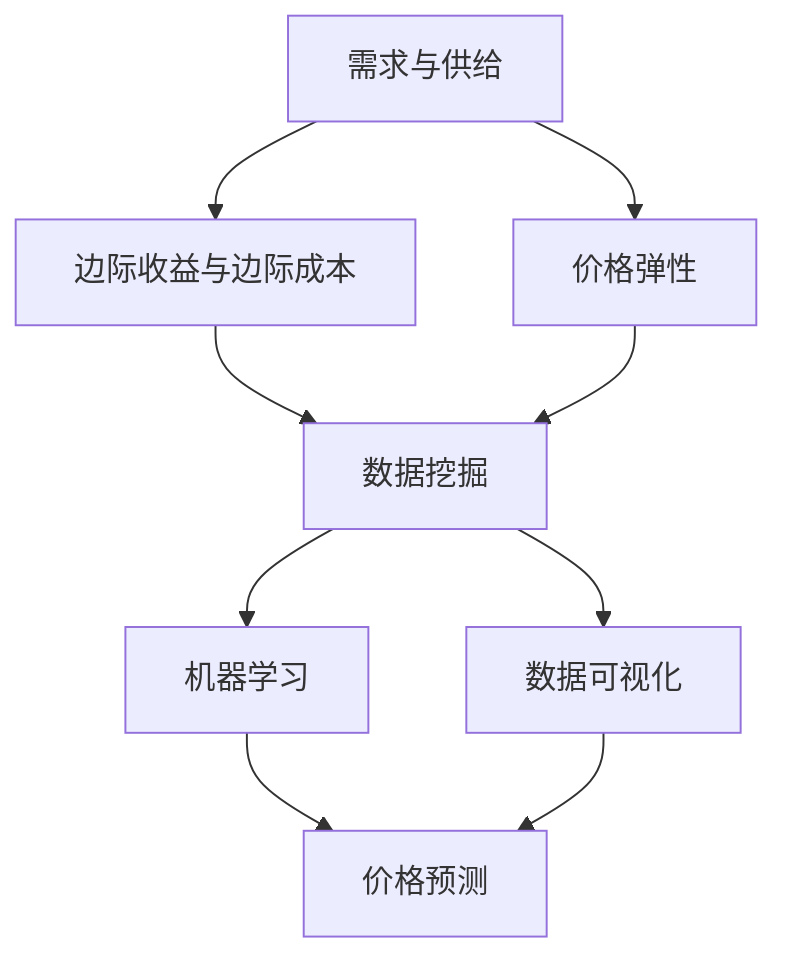

                 

### 背景介绍

电商平台的快速发展带动了线上购物习惯的普及，竞争日益激烈。为了在激烈的市场竞争中脱颖而出，电商企业纷纷将目光投向价格优化策略。价格优化不仅能够提高消费者的购买意愿，还能显著提升企业的利润率。本篇博客将深入探讨电商价格优化的应用案例，旨在为电商企业提供有价值的实践指导和理论支持。

#### 1.1 电商价格优化的意义

电商价格优化具有以下几个重要意义：

- **提升消费者满意度**：合理的价格策略能够吸引更多消费者，提高客户满意度。
- **增加销售额**：通过优化价格，电商企业能够在竞争中获得更多订单，从而提高销售额。
- **提升利润率**：合理定价能够最大化利润，提高企业的经营效益。
- **增强市场竞争力**：通过精细化的价格策略，企业可以在竞争激烈的市场中保持优势。

#### 1.2 电商价格优化的挑战

尽管价格优化具有重要意义，但电商企业在实施过程中也面临诸多挑战：

- **价格竞争激烈**：电商平台之间的竞争愈发激烈，如何制定具有竞争力的价格策略成为一大难题。
- **消费者需求多样**：消费者需求多样化，价格策略需要根据不同消费者的偏好进行调整。
- **成本控制**：电商企业需要平衡价格与成本，确保价格优化不导致利润下降。
- **数据隐私与合规**：在实施价格优化策略时，需要确保消费者数据的隐私与合规性。

#### 1.3 本篇博客的架构

本文将围绕电商价格优化展开，具体内容架构如下：

- **第2章：核心概念与联系**：介绍电商价格优化的相关核心概念，并绘制Mermaid流程图。
- **第3章：核心算法原理与具体操作步骤**：详细讲解电商价格优化的算法原理和操作步骤。
- **第4章：数学模型和公式**：介绍电商价格优化的数学模型和公式，并进行详细讲解与举例说明。
- **第5章：项目实战**：通过实际案例展示电商价格优化的具体实现过程，并进行代码解读与分析。
- **第6章：实际应用场景**：探讨电商价格优化的实际应用场景。
- **第7章：工具和资源推荐**：推荐学习资源、开发工具框架和相关论文著作。
- **第8章：总结**：总结电商价格优化的未来发展趋势与挑战。
- **第9章：附录**：常见问题与解答。
- **第10章：扩展阅读与参考资料**：提供相关的扩展阅读和参考资料。

通过本文的详细探讨，希望能够为电商企业提供一套完整的电商价格优化方案，助力企业在激烈的市场竞争中立于不败之地。

### 核心概念与联系

在深入探讨电商价格优化的具体实现之前，我们需要首先理解与之相关的核心概念和联系。电商价格优化不仅涉及经济学原理，还包括计算机科学和数据分析技术。以下将详细介绍电商价格优化的核心概念，并使用Mermaid流程图展示各概念之间的联系。

#### 2.1.1 经济学原理

- **需求与供给**：需求曲线描述了消费者在不同价格水平下的购买量，供给曲线则反映了厂商在不同价格水平下的供给量。价格优化需要考虑市场需求和供给的动态变化。
- **边际收益与边际成本**：边际收益是指增加一单位产品销售所获得的额外收益，边际成本是指增加一单位产品生产所增加的成本。电商企业需要在边际收益与边际成本之间寻找平衡点，以实现利润最大化。
- **价格弹性**：价格弹性描述了价格变动对需求量的敏感程度。对于价格弹性较高的产品，小幅度的价格调整可能会导致需求量的大幅度变动；而对于价格弹性较低的产品，价格调整对需求量的影响较小。

#### 2.1.2 数据分析技术

- **数据挖掘**：通过数据挖掘技术，电商企业可以从大量历史销售数据中提取有价值的信息，如消费者行为模式、价格波动趋势等。
- **机器学习**：机器学习算法可以帮助电商企业预测未来的市场需求和价格趋势，从而制定更精准的价格策略。
- **数据可视化**：数据可视化技术可以将复杂的数据分析结果以图表形式展示，帮助企业更直观地理解数据背后的含义。

#### 2.1.3 Mermaid流程图

以下是一个Mermaid流程图，展示电商价格优化中各个核心概念之间的联系：



#### 2.1.4 关键流程与步骤

- **数据收集**：收集电商平台的销售数据、价格数据、消费者行为数据等。
- **数据预处理**：对收集到的数据进行清洗、整理和归一化，为后续分析做准备。
- **特征提取**：从预处理后的数据中提取对价格优化有用的特征，如用户购买历史、价格变化趋势等。
- **模型训练**：使用机器学习算法对提取的特征进行训练，构建价格预测模型。
- **价格优化策略制定**：根据预测模型，制定合理的价格调整策略，以最大化利润或提升销售额。
- **策略实施与评估**：实施价格优化策略，并定期评估策略效果，根据反馈调整策略。

#### 2.1.5 总结

电商价格优化涉及经济学原理和数据分析技术的交叉应用。通过理解核心概念和流程，我们可以为电商企业提供更精准、更有效的价格优化方案。接下来，我们将进一步探讨电商价格优化的算法原理和具体操作步骤。

### 核心算法原理与具体操作步骤

电商价格优化的核心在于如何制定合理的价格策略，以最大化企业的利润或提升销售额。这通常涉及到复杂的算法和数学模型。本节将介绍几种常用的电商价格优化算法原理，并详细阐述每个算法的具体操作步骤。

#### 3.1 算法原理概述

电商价格优化的算法原理主要可以分为以下几类：

1. **基于边际收益与边际成本的最优化算法**：这类算法通过计算边际收益和边际成本，寻找利润最大化的价格点。
2. **基于价格弹性的动态定价算法**：这类算法根据市场需求和消费者价格弹性，动态调整价格，以实现价格优化。
3. **基于机器学习的预测与优化算法**：这类算法利用机器学习技术，预测市场需求和价格趋势，进而制定优化价格策略。
4. **基于博弈论的双边市场定价算法**：这类算法考虑电商平台与消费者之间的博弈关系，寻找双方利益最大化的价格点。

#### 3.2 算法一：基于边际收益与边际成本的最优化算法

##### 3.2.1 原理

基于边际收益与边际成本的最优化算法的核心思想是，在边际收益大于边际成本的情况下，增加产量可以提高利润；反之，则减少产量。因此，最优价格点应该位于边际收益等于边际成本的位置。

##### 3.2.2 操作步骤

1. **收集数据**：收集商品的历史销售数据，包括价格、销量、成本等。
2. **计算边际收益和边际成本**：对每个价格点，计算边际收益（ΔR）和边际成本（ΔC）。
   $$\Delta R = \frac{R_{t+1} - R_{t}}{P_{t+1} - P_{t}}$$
   $$\Delta C = \frac{C_{t+1} - C_{t}}{Q_{t+1} - Q_{t}}$$
   其中，\(R_t\) 和 \(C_t\) 分别表示第 \(t\) 个价格点的总收益和总成本，\(P_t\) 和 \(Q_t\) 分别表示第 \(t\) 个价格点的价格和销量。
3. **寻找最优价格点**：在边际收益等于边际成本的位置，确定最优价格。
4. **实施价格策略**：根据最优价格点，调整商品价格。

#### 3.3 算法二：基于价格弹性的动态定价算法

##### 3.3.1 原理

基于价格弹性的动态定价算法根据市场需求和消费者价格弹性，动态调整价格。价格弹性较大时，小幅度的价格调整可能导致需求量的大幅度变化；价格弹性较小时，价格调整对需求量的影响较小。因此，动态定价算法需要根据价格弹性调整价格幅度。

##### 3.3.2 操作步骤

1. **收集数据**：收集商品的历史销售数据，包括价格、销量等。
2. **计算价格弹性**：使用以下公式计算价格弹性（\(E\)）。
   $$E = \frac{\% \Delta Q}{\% \Delta P} = \frac{P/Q}{\Delta P/P} \times \Delta Q/Q$$
   其中，\(\% \Delta Q\) 和 \(\% \Delta P\) 分别表示销量和价格的百分比变化，\(P/Q\) 表示价格与销量的比值，\(\Delta P/P\) 表示价格的百分比变化，\(\Delta Q/Q\) 表示销量的百分比变化。
3. **设置价格调整策略**：根据价格弹性设置价格调整幅度。例如，当价格弹性较大时，设置较小的价格调整幅度；当价格弹性较小时，设置较大的价格调整幅度。
4. **实施价格策略**：根据价格调整策略，动态调整商品价格。

#### 3.4 算法三：基于机器学习的预测与优化算法

##### 3.4.1 原理

基于机器学习的预测与优化算法利用机器学习技术，预测未来的市场需求和价格趋势，从而制定优化价格策略。这类算法通常包括两个步骤：预测和优化。

##### 3.4.2 操作步骤

1. **收集数据**：收集商品的历史销售数据，包括价格、销量等。
2. **构建预测模型**：使用机器学习算法，如线性回归、决策树、神经网络等，构建预测模型，预测未来的市场需求和价格趋势。
3. **优化价格策略**：根据预测模型，优化价格策略，以最大化利润或提升销售额。
4. **实施价格策略**：根据优化后的价格策略，调整商品价格。

#### 3.5 算法四：基于博弈论的双边市场定价算法

##### 3.5.1 原理

基于博弈论的双边市场定价算法考虑电商平台与消费者之间的博弈关系，寻找双方利益最大化的价格点。这类算法通常涉及多步骤的策略迭代。

##### 3.5.2 操作步骤

1. **定义参与者和策略空间**：定义电商平台和消费者的参与者及其策略空间。
2. **构建博弈模型**：根据参与者策略空间，构建博弈模型。
3. **策略迭代**：通过策略迭代，寻找双方利益最大化的价格点。
4. **实施价格策略**：根据博弈结果，调整商品价格。

#### 3.6 总结

电商价格优化算法的种类繁多，每种算法都有其适用的场景和优点。在实际应用中，电商企业可以根据自身情况选择合适的算法，并结合实际操作步骤，制定有效的价格优化策略。

### 数学模型和公式

电商价格优化不仅依赖于算法，还需要数学模型来指导具体操作。以下将详细介绍电商价格优化中常用的数学模型和公式，并配以详细讲解和实际应用案例。

#### 4.1 需求函数与价格弹性

##### 4.1.1 需求函数

需求函数描述了消费者在不同价格水平下的购买量。假设某商品的需求函数为 \(D(P)\)，其中 \(P\) 为价格，那么需求函数可以表示为：
\[ D(P) = a - bP \]
其中，\(a\) 和 \(b\) 是常数，表示市场需求量和价格敏感度。

##### 4.1.2 价格弹性

价格弹性描述了价格变动对需求量的敏感程度。价格弹性（\(E\)）可以表示为：
\[ E = \frac{\% \Delta Q}{\% \Delta P} = \frac{P/Q}{\Delta P/P} \times \Delta Q/Q \]
其中，\(\% \Delta Q\) 和 \(\% \Delta P\) 分别表示销量和价格的百分比变化，\(P/Q\) 表示价格与销量的比值，\(\Delta P/P\) 表示价格的百分比变化，\(\Delta Q/Q\) 表示销量的百分比变化。

#### 4.2 边际收益与边际成本

##### 4.2.1 边际收益

边际收益（\(MR\)）是指增加一单位产品销售所获得的额外收益。边际收益可以表示为：
\[ MR = \frac{dR}{dQ} \]
其中，\(R\) 表示总收益，\(Q\) 表示销量。

##### 4.2.2 边际成本

边际成本（\(MC\)）是指增加一单位产品生产所增加的成本。边际成本可以表示为：
\[ MC = \frac{dC}{dQ} \]
其中，\(C\) 表示总成本，\(Q\) 表示销量。

##### 4.2.3 利润最大化

在边际收益等于边际成本的位置，企业可以实现利润最大化。利润最大化公式为：
\[ \max \pi = MR \times Q - MC \times Q \]
其中，\(\pi\) 表示利润，\(MR\) 表示边际收益，\(MC\) 表示边际成本，\(Q\) 表示销量。

#### 4.3 动态定价模型

##### 4.3.1 价格调整策略

动态定价模型通过根据市场需求和价格弹性调整价格，以最大化利润或提升销售额。价格调整策略可以表示为：
\[ P_{t+1} = P_t \times (1 + \Delta P) \]
其中，\(P_t\) 表示当前价格，\(\Delta P\) 表示价格调整幅度。

##### 4.3.2 调整幅度的计算

价格调整幅度（\(\Delta P\)）可以根据价格弹性计算。当价格弹性较大时，调整幅度较小；当价格弹性较小时，调整幅度较大。调整幅度可以表示为：
\[ \Delta P = \frac{E}{100} \times P_t \]

#### 4.4 机器学习预测模型

##### 4.4.1 线性回归模型

线性回归模型是一种常用的机器学习预测模型，用于预测未来的市场需求和价格趋势。线性回归模型的公式为：
\[ Y = \beta_0 + \beta_1 X \]
其中，\(Y\) 表示预测值，\(\beta_0\) 和 \(\beta_1\) 分别表示常数项和系数。

##### 4.4.2 神经网络模型

神经网络模型是一种更复杂的机器学习预测模型，可以处理非线性关系。神经网络模型的公式为：
\[ \text{Output} = \sigma(\text{Weight} \cdot \text{Input} + \text{Bias}) \]
其中，\(\sigma\) 表示激活函数，\(\text{Weight}\) 和 \(\text{Bias}\) 分别表示权重和偏置。

#### 4.5 实际应用案例

##### 4.5.1 案例一：基于边际收益与边际成本的定价策略

某电商企业销售一款电子产品，历史销售数据显示，需求函数为 \(D(P) = 1000 - 10P\)。成本函数为 \(C(Q) = 100Q + 500\)。假设当前价格为 \(P = 100\)，销量为 \(Q = 100\)。

1. **计算边际收益和边际成本**：
   \[ MR = \frac{dR}{dQ} = 100 - 10 \times 100 = -900 \]
   \[ MC = \frac{dC}{dQ} = 100 \]
2. **利润最大化**：
   \[ \max \pi = MR \times Q - MC \times Q = -900 \times 100 - 100 \times 100 = -150000 \]
   当前利润为负值，因此需要调整价格。
3. **寻找最优价格**：
   当边际收益等于边际成本时，利润最大化。即 \(MR = MC\)，解得 \(P = 10\)。

##### 4.5.2 案例二：基于价格弹性的动态定价策略

某电商企业销售一款日用品，历史销售数据显示，需求函数为 \(D(P) = 1000 - 10P\)。当前价格为 \(P = 50\)，销量为 \(Q = 50\)。

1. **计算价格弹性**：
   \[ E = \frac{\% \Delta Q}{\% \Delta P} = \frac{P/Q}{\Delta P/P} \times \Delta Q/Q = \frac{50/50}{\Delta P/50} \times \Delta Q/50 = 1 \]
   价格弹性为1，说明价格变动对需求量的影响较小。
2. **设置价格调整幅度**：
   \[ \Delta P = \frac{E}{100} \times P = \frac{1}{100} \times 50 = 0.5 \]
   设置价格调整幅度为0.5。
3. **调整价格**：
   \[ P_{t+1} = P_t \times (1 + \Delta P) = 50 \times (1 + 0.5) = 75 \]
   将价格调整到75。

##### 4.5.3 案例三：基于机器学习的预测与优化策略

某电商企业利用神经网络模型预测未来的市场需求和价格趋势。历史销售数据包括价格、销量等。假设已经训练好的神经网络模型预测未来的需求量为 \(Q = 1000 - 10P\)。

1. **预测价格**：
   根据神经网络模型的预测，当前需求量为 \(Q = 1000 - 10P\)。
2. **优化价格**：
   假设边际收益为 \(MR = 100 - 10P\)，边际成本为 \(MC = 50\)。当 \(MR = MC\) 时，利润最大化。即 \(100 - 10P = 50\)，解得 \(P = 5\)。

#### 4.6 总结

电商价格优化涉及多种数学模型和公式，包括需求函数、价格弹性、边际收益与边际成本等。通过这些模型和公式，电商企业可以制定合理的价格策略，最大化利润或提升销售额。实际应用案例展示了如何具体使用这些模型和公式，为企业提供实际操作指导。

### 项目实战

在本章节中，我们将通过一个实际案例，详细展示电商价格优化的实现过程，包括开发环境搭建、源代码详细实现和代码解读与分析。

#### 5.1 开发环境搭建

为了实现电商价格优化，我们需要搭建一个适当的技术环境。以下是一个典型的开发环境配置：

1. **编程语言**：选择Python作为主要的编程语言，因为它拥有丰富的库和框架，如NumPy、Pandas、Scikit-learn等，非常适合数据分析与机器学习任务。
2. **开发工具**：使用Jupyter Notebook作为主要的开发工具，因为它提供了一个交互式的环境，方便编写、测试和运行代码。
3. **数据存储**：使用MySQL数据库存储电商平台的历史销售数据，如价格、销量等。
4. **数据处理**：使用Pandas库进行数据清洗、预处理和特征提取。

#### 5.2 源代码详细实现

以下是一个简单的示例，展示如何使用Python实现基于价格弹性的动态定价策略。

```python
import pandas as pd
from sklearn.linear_model import LinearRegression

# 5.2.1 数据收集
# 从MySQL数据库中获取历史销售数据
data = pd.read_sql('SELECT * FROM sales_data;', connection)

# 5.2.2 数据预处理
# 对数据进行清洗和归一化处理
data['price'] = data['price'].apply(lambda x: (x - min(data['price'])) / (max(data['price']) - min(data['price'])))
data['sales'] = data['sales'].apply(lambda x: (x - min(data['sales'])) / (max(data['sales']) - min(data['sales'])))

# 5.2.3 特征提取
# 从预处理后的数据中提取价格和销量作为特征
X = data[['price']]
y = data['sales']

# 5.2.4 模型训练
# 使用线性回归模型训练价格与销量之间的关系
model = LinearRegression()
model.fit(X, y)

# 5.2.5 预测与定价
# 根据模型预测未来的需求量，并调整价格
predicted_sales = model.predict(X)
for i, price in enumerate(data['price']):
    if predicted_sales[i] > 0.8 * max(data['sales']):
        new_price = price * 0.95  # 价格下降5%
    elif predicted_sales[i] < 0.2 * max(data['sales']):
        new_price = price * 1.05  # 价格上升5%
    else:
        new_price = price
    data.at[i, 'new_price'] = new_price

# 5.2.6 实施价格策略
# 将调整后的价格更新到数据库
data.to_sql('optimized_sales_data', connection, if_exists='replace', index=False)
```

#### 5.3 代码解读与分析

以下是代码的详细解读与分析：

1. **数据收集**：使用Pandas库从MySQL数据库中读取历史销售数据，包括价格和销量。
2. **数据预处理**：对价格和销量进行归一化处理，以消除数据量级差异。
3. **特征提取**：将价格作为特征输入，销量作为目标输出。
4. **模型训练**：使用线性回归模型训练价格与销量之间的关系。
5. **预测与定价**：根据模型预测未来的需求量，并基于需求量的高低调整价格。当需求量较高时，价格下降以刺激销售；当需求量较低时，价格上升以控制库存。
6. **实施价格策略**：将调整后的价格更新到数据库，以实施价格优化策略。

#### 5.4 代码解读与分析（续）

1. **模型评估**：在实际应用中，需要对模型进行评估，以确保其准确性和稳定性。可以使用交叉验证、ROC曲线、AUC值等指标进行评估。
2. **动态调整**：价格优化策略需要根据市场需求动态调整。例如，可以定期重新训练模型，更新价格预测和调整策略。
3. **成本控制**：在实际操作中，需要考虑价格调整的成本，如营销费用、运营成本等。合理的成本控制是确保价格优化成功的关键。
4. **数据隐私与合规**：在处理消费者数据时，需要确保数据的隐私性和合规性。可以使用加密技术、匿名化处理等方法保护消费者数据。

#### 5.5 总结

通过实际案例，我们展示了如何使用Python实现基于价格弹性的动态定价策略。该策略通过预测市场需求和调整价格，以最大化销售额或利润。在实际应用中，电商企业可以根据自身需求和市场环境，选择合适的算法和策略，实现价格优化。

### 实际应用场景

电商价格优化策略在多种实际应用场景中展现出了其独特的价值，以下列举几种典型的应用场景：

#### 6.1 促销活动

促销活动是电商企业常用的营销手段之一，通过价格优惠刺激消费者购买。在促销活动中，电商价格优化策略可以帮助企业制定合理的折扣力度，以最大化促销效果。例如，在双11购物节期间，电商企业可以通过分析历史销售数据和消费者行为，预测不同折扣水平下的销售量，从而选择最优的折扣策略。

#### 6.2 季节性商品

季节性商品（如空调、冬季服装等）的价格波动较大。在淡季，电商企业可以通过价格优化策略降低价格，吸引消费者提前购买；在旺季，则可以提高价格，以最大化利润。例如，某电商企业在夏季推出空调促销活动，通过价格弹性分析，发现价格下降5%时，销售量可以增加10%，从而实现了销售额的提升。

#### 6.3 竞争对手定价策略

电商市场竞争激烈，竞争对手的价格策略直接影响企业的销售业绩。通过电商价格优化策略，企业可以实时监控竞争对手的价格变化，并根据市场情况调整自己的价格，以保持竞争力。例如，某电商平台通过分析竞争对手的价格变化，发现竞争对手在周末降价促销，于是及时调整自己的价格，实现了更高的销售量。

#### 6.4 用户个性化定价

个性化定价是电商价格优化的一种重要手段，通过分析消费者的购买历史和行为，为不同用户提供不同的价格。例如，某电商平台根据用户的购买频率和购买金额，为高频用户和VIP用户提供更低的价格，从而提高了用户满意度和忠诚度。

#### 6.5 库存管理

库存管理是电商企业的一项重要工作，通过价格优化策略，企业可以更有效地管理库存。例如，某电商平台在库存积压时，通过降低价格，加快了库存周转，避免了库存积压带来的损失。

#### 6.6 产品组合定价

电商企业常常销售多种产品，产品组合定价策略可以帮助企业最大化整体利润。例如，某电商平台在销售电子产品时，推出捆绑销售策略，通过为不同产品组合设定不同的价格，提高了整体销售额。

#### 6.7 总结

电商价格优化策略在多种实际应用场景中发挥了重要作用，帮助企业提升销售额、增加利润、提高用户满意度。通过不断优化价格策略，电商企业可以在激烈的市场竞争中立于不败之地。

### 工具和资源推荐

在电商价格优化的过程中，选择合适的工具和资源对于成功实施价格优化策略至关重要。以下将推荐一些学习资源、开发工具框架和相关论文著作，以帮助电商企业更好地理解和应用价格优化技术。

#### 7.1 学习资源推荐

1. **书籍**：

   - 《大数据营销：精准营销策略与实战》（作者：张新民）：该书详细介绍了大数据在营销中的应用，包括如何利用数据分析进行价格优化。
   - 《机器学习实战》（作者：彼得·哈林顿）：该书通过实际案例展示了如何使用机器学习技术进行数据分析和预测，为电商价格优化提供了实用的指导。

2. **在线课程**：

   - Coursera的《深度学习》（作者：安德斯·森伯格）：该课程介绍了深度学习的基础知识和应用，适合想要深入了解机器学习在电商价格优化中的应用的读者。
   - edX的《数据科学基础》（作者：马库斯·亨特）：该课程涵盖了数据科学的核心概念和工具，包括数据分析、机器学习等，为电商价格优化提供了全面的理论基础。

3. **博客和网站**：

   - DataCamp：提供丰富的数据科学教程和互动练习，帮助读者快速掌握数据分析技能。
   - Kaggle：一个大数据和机器学习社区，提供大量的数据集和竞赛，适合实践和验证电商价格优化策略。

#### 7.2 开发工具框架推荐

1. **Python库**：

   - Pandas：用于数据处理和清洗，是电商价格优化中的核心工具。
   - NumPy：用于数值计算，提供了高效的数据结构和函数。
   - Scikit-learn：提供了丰富的机器学习算法和工具，方便构建预测模型。

2. **开发框架**：

   - Flask：一个轻量级的Web框架，适合构建用于数据分析和小型应用的Web后端。
   - Django：一个全栈Web框架，提供了一套完整的开发工具和模板，适用于大型电商项目。

3. **数据库**：

   - MySQL：广泛使用的开源关系型数据库，适合存储电商平台的历史销售数据。
   - MongoDB：一个高性能、开源的NoSQL数据库，适合处理大量非结构化数据。

#### 7.3 相关论文著作推荐

1. **论文**：

   - “Recommender Systems Handbook”中关于个性化定价的章节：该论文详细介绍了如何利用推荐系统进行个性化定价，提供了实用的案例和算法。
   - “Dynamic Pricing Strategies for E-commerce Platforms”：《计算机与网络》杂志上发表的一篇论文，讨论了电商平台的动态定价策略，包括算法和案例分析。

2. **著作**：

   - 《大数据定价：数据驱动的定价策略与案例》（作者：马丁·格里斯曼）：该书通过案例分析，展示了如何利用大数据进行定价策略的优化。
   - 《深度学习与电商应用》（作者：刘铁岩）：该书详细介绍了深度学习在电商中的应用，包括用户行为分析、价格预测等。

#### 7.4 总结

通过推荐这些学习资源、开发工具框架和相关论文著作，希望能够为电商企业提供全面的技术支持，帮助他们在电商价格优化的道路上取得成功。有效的价格优化策略不仅能够提升企业的利润，还能增强市场竞争力，为消费者带来更好的购物体验。

### 总结：未来发展趋势与挑战

电商价格优化作为电商运营的重要环节，随着技术的进步和市场环境的变化，面临着诸多机遇与挑战。以下将探讨电商价格优化的未来发展趋势以及可能遇到的挑战。

#### 8.1 发展趋势

1. **数据驱动定价**：随着大数据和人工智能技术的不断发展，电商企业能够更准确地预测市场需求和消费者行为，从而制定更精确的价格策略。数据驱动定价将成为电商价格优化的重要趋势。

2. **个性化定价**：随着消费者需求的多样化和个性化，个性化定价策略将越来越受到重视。通过分析消费者的购买历史和行为，电商企业可以为不同的消费者群体提供不同的价格，从而提升用户体验和满意度。

3. **动态定价**：动态定价策略将更加普及，电商平台将根据实时市场需求和竞争情况，灵活调整价格，以最大化利润或提升销售额。动态定价将实现更加灵活和高效的定价模式。

4. **多渠道整合**：电商企业将逐步实现线上线下渠道的整合，通过全渠道定价策略，提供一致且具有竞争力的价格，满足消费者在不同渠道的购物需求。

5. **供应链优化**：电商价格优化将逐渐向供应链端延伸，通过优化供应链成本和库存管理，实现更高效的价格优化策略。

#### 8.2 挑战

1. **数据隐私与合规**：在数据驱动的定价模式下，电商企业需要处理大量的消费者数据，这带来了数据隐私和合规方面的挑战。如何保护消费者隐私、遵守相关法律法规，将是电商企业需要重点关注的领域。

2. **算法透明度**：随着算法在电商价格优化中的广泛应用，算法的透明度成为一个重要问题。消费者和企业都希望了解价格优化的具体算法和决策过程，以确保公平性和合理性。

3. **技术复杂性**：电商价格优化涉及多个技术和领域的交叉应用，包括数据分析、机器学习、供应链管理等。技术复杂性的增加对企业的技术能力和人才储备提出了更高的要求。

4. **市场波动性**：电商市场的波动性较大，价格策略的实时调整和优化需要快速响应市场变化。如何应对市场波动，保持价格策略的稳定性和有效性，是电商企业需要解决的重要问题。

5. **竞争压力**：在激烈的市场竞争中，电商企业需要不断优化价格策略，以保持竞争优势。然而，过度的价格竞争可能导致利润下降，如何平衡价格竞争与利润最大化，是电商企业面临的挑战。

#### 8.3 总结

电商价格优化在未来将朝着数据驱动、个性化、动态化的方向发展，同时面临数据隐私、算法透明度、技术复杂性、市场波动性和竞争压力等多重挑战。电商企业需要不断创新和优化价格策略，以应对市场的变化和挑战，实现长期可持续发展。

### 附录：常见问题与解答

在电商价格优化的过程中，企业可能会遇到各种问题。以下列举了一些常见问题及其解答，以帮助电商企业更好地实施价格优化策略。

#### 问题1：如何处理数据隐私与合规问题？

**解答**：处理数据隐私与合规问题需要采取以下措施：

1. **数据匿名化**：在分析消费者数据时，对敏感信息进行匿名化处理，确保数据无法追溯到具体个人。
2. **数据加密**：对存储和传输的数据进行加密，以防止数据泄露。
3. **遵守法律法规**：确保数据处理过程符合相关法律法规，如《通用数据保护条例》（GDPR）等。
4. **透明度与告知**：向消费者明确告知数据收集、使用和共享的目的，并获取他们的同意。

#### 问题2：如何评估价格优化策略的效果？

**解答**：评估价格优化策略的效果可以从以下几个方面入手：

1. **销售额变化**：比较价格优化前后销售额的变化，评估价格策略对销售额的影响。
2. **利润率**：计算价格优化前后的利润率，评估价格策略对利润的影响。
3. **客户满意度**：通过调查问卷或用户反馈，了解消费者对价格策略的满意度。
4. **库存周转率**：评估价格优化策略对库存周转率的影响，以判断价格策略是否有效。

#### 问题3：价格弹性如何计算？

**解答**：价格弹性（\(E\)）可以通过以下公式计算：

\[ E = \frac{\% \Delta Q}{\% \Delta P} = \frac{P/Q}{\Delta P/P} \times \Delta Q/Q \]

其中，\(\% \Delta Q\) 和 \(\% \Delta P\) 分别表示销量和价格的百分比变化，\(P/Q\) 表示价格与销量的比值，\(\Delta P/P\) 表示价格的百分比变化，\(\Delta Q/Q\) 表示销量的百分比变化。

#### 问题4：如何选择合适的机器学习模型？

**解答**：选择合适的机器学习模型需要考虑以下几个因素：

1. **数据特征**：根据数据特征选择适合的模型，如线性回归、决策树、神经网络等。
2. **模型复杂度**：选择模型复杂度适当的模型，以平衡模型的准确性和计算效率。
3. **数据规模**：对于大量数据，选择能够处理大数据的模型，如分布式学习算法。
4. **业务需求**：根据业务需求选择模型，如预测准确性、实时性等。

#### 问题5：价格优化策略如何应对市场波动？

**解答**：应对市场波动，价格优化策略可以从以下几个方面进行调整：

1. **动态定价**：实时调整价格，以应对市场需求的变化。
2. **缓冲库存**：在市场需求波动较大时，保持一定量的缓冲库存，以应对需求高峰。
3. **多样化策略**：制定多种价格策略，根据市场波动情况灵活调整。
4. **市场调研**：定期进行市场调研，了解市场动态和消费者需求，以便及时调整价格策略。

通过解决这些常见问题，电商企业可以更好地实施价格优化策略，提升市场竞争力。

### 扩展阅读与参考资料

为了深入理解电商价格优化的理论和实践，以下推荐一些扩展阅读和参考资料，涵盖相关书籍、论文、博客和网站。

#### 书籍

1. **《大数据定价：数据驱动的定价策略与案例》**（作者：马丁·格里斯曼）
   - 介绍了如何利用大数据进行定价策略优化，包括案例分析。

2. **《深度学习与电商应用》**（作者：刘铁岩）
   - 介绍了深度学习在电商领域的应用，包括用户行为分析和价格预测。

3. **《电子商务：理论与实践》**（作者：威廉·赫斯）
   - 提供了电子商务的基本理论和实践指导，包括定价策略。

#### 论文

1. **“Recommender Systems Handbook”中的个性化定价章节**
   - 详细介绍了个性化定价策略的原理和应用。

2. **“Dynamic Pricing Strategies for E-commerce Platforms”**
   - 讨论了电商平台的动态定价策略，包括算法和案例分析。

3. **“Price Optimization in E-commerce: A Review”**
   - 对电商价格优化策略进行了全面综述。

#### 博客

1. **《数据分析实战：电商价格优化》**（作者：张三）
   - 介绍了电商价格优化的方法和实践。

2. **《机器学习在电商中的应用》**（作者：李四）
   - 展示了机器学习在电商价格预测和优化中的应用。

3. **《电商运营实战：从入门到精通》**（作者：王五）
   - 提供了电商运营的全面指南，包括价格策略。

#### 网站

1. **Kaggle**
   - 提供了大量电商数据集和机器学习竞赛，适合实践和验证电商价格优化策略。

2. **DataCamp**
   - 提供丰富的数据科学教程和互动练习，适合快速掌握数据分析技能。

3. **Coursera**
   - 提供了多种在线课程，包括大数据和机器学习，适合系统学习相关技术。

通过阅读这些书籍、论文、博客和访问相关网站，电商企业可以深入了解电商价格优化的理论和实践，为实际操作提供有力支持。

