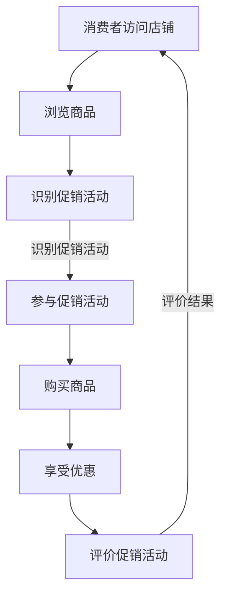

                 

# 电商促销策略的实际效果

## 摘要

电商促销策略是电商行业吸引消费者、提高销售额的重要手段。本文将深入探讨电商促销策略的实际效果，分析不同促销方式对消费者行为、销售额、利润等方面的影响。本文将分为几个部分，首先介绍电商促销策略的基本概念和分类，然后详细探讨各种促销策略的原理和实施方法，接着分析实际案例，最后总结电商促销策略的未来发展趋势与挑战。

## 1. 背景介绍

电商促销策略是指电商企业在销售过程中，通过一系列促销手段来吸引消费者、提高销售额和利润的策略。随着互联网的普及和电子商务的发展，电商促销策略成为电商企业竞争的重要手段。

电商促销策略的种类繁多，主要包括以下几种：

1. **满减优惠**：消费者购买商品达到一定金额即可享受减免部分金额的优惠。
2. **打折促销**：商品打折销售，通常以百分比形式表示，如打8折、打5折等。
3. **优惠券**：消费者通过领取优惠券，在购物时享受优惠。
4. **限时抢购**：在特定时间内以更低的价格销售商品，刺激消费者购买。
5. **买赠促销**：购买指定商品即可获得赠品。
6. **积分兑换**：消费者通过积累积分，在购物时进行兑换。

这些促销策略各有特点，适用于不同的销售场景和目标群体。电商企业需要根据自身情况选择合适的促销策略，以达到最佳的促销效果。

## 2. 核心概念与联系

### 2.1 促销策略的分类

电商促销策略可以按照不同的标准进行分类，以下是常见的几种分类方式：

1. **按促销对象分类**：
   - **全店促销**：针对整个店铺的商品进行促销。
   - **单品促销**：针对特定商品进行促销。
   - **品类促销**：针对特定品类的商品进行促销。

2. **按促销方式分类**：
   - **价格优惠**：直接降低商品价格。
   - **限时折扣**：在特定时间内提供折扣。
   - **赠品促销**：购买商品赠送其他商品或礼品。
   - **积分兑换**：通过积分兑换商品或优惠券。

3. **按促销目的分类**：
   - **提升销售额**：通过促销活动吸引消费者购买，提高销售额。
   - **增加用户黏性**：通过积分、优惠券等方式增加用户黏性，促进复购。
   - **新品推广**：通过促销活动推广新品，提高新品销量。

### 2.2 促销策略的影响因素

电商促销策略的效果受到多种因素的影响，包括：

1. **消费者心理**：消费者对促销活动的敏感度、消费意愿等。
2. **商品属性**：商品的价格、利润空间、库存情况等。
3. **市场竞争**：竞争对手的促销策略、市场环境等。
4. **促销活动设计**：促销活动的形式、力度、时间等。

### 2.3 Mermaid 流程图

以下是电商促销策略的 Mermaid 流程图，展示了促销策略的整个流程：



## 3. 核心算法原理 & 具体操作步骤

### 3.1 促销策略的核心算法原理

电商促销策略的核心算法主要是基于消费者行为分析和数据挖掘技术，通过对消费者购买行为、购物习惯、商品属性等数据的分析，制定合适的促销策略。

主要算法包括：

1. **聚类分析**：通过对消费者数据的分析，将消费者划分为不同的群体，为不同的群体设计合适的促销策略。
2. **关联规则挖掘**：通过挖掘消费者购买商品之间的关联关系，设计针对性的促销策略。
3. **预测模型**：通过建立预测模型，预测消费者未来的购买行为，为促销策略提供数据支持。

### 3.2 具体操作步骤

1. **数据收集**：收集消费者购买行为数据，包括购买时间、购买商品、购买金额等。
2. **数据预处理**：对原始数据进行清洗、去重、补全等处理，确保数据的质量。
3. **聚类分析**：使用聚类算法（如K-means、DBSCAN等）对消费者进行划分，得到不同的消费者群体。
4. **关联规则挖掘**：使用关联规则挖掘算法（如Apriori、FP-Growth等）挖掘消费者购买商品之间的关联关系。
5. **预测模型**：使用预测算法（如线性回归、决策树、神经网络等）建立预测模型，预测消费者未来的购买行为。
6. **促销策略设计**：根据聚类分析、关联规则挖掘和预测模型的结果，设计针对性的促销策略。
7. **促销策略实施**：在电商平台上实施促销策略，监测促销效果，调整促销策略。

## 4. 数学模型和公式 & 详细讲解 & 举例说明

### 4.1 数学模型和公式

电商促销策略的数学模型主要包括聚类分析模型、关联规则挖掘模型和预测模型。

1. **聚类分析模型**：

   - **K-means算法**：
     $$\text{簇均值} = \frac{1}{N}\sum_{i=1}^{N}x_i$$
     $$\text{聚类误差} = \sum_{i=1}^{k}\sum_{x_i \in C_i}(x_i - \text{簇均值})^2$$
     
   - **DBSCAN算法**：
     $$\text{邻域半径} = \epsilon$$
     $$\text{邻域个数} = \minPoints$$
     
2. **关联规则挖掘模型**：

   - **Apriori算法**：
     $$\text{支持度} = \frac{\text{同时购买商品A和商品B的次数}}{\text{总购买次数}}$$
     $$\text{置信度} = \frac{\text{同时购买商品A和商品B的次数}}{\text{购买商品A的次数}}$$
     
   - **FP-Growth算法**：
     $$\text{频繁项集} = \{I| \text{支持度}(I) \geq \text{最小支持度}\}$$
     
3. **预测模型**：

   - **线性回归模型**：
     $$y = \beta_0 + \beta_1x_1 + \beta_2x_2 + ... + \beta_nx_n$$
     
   - **决策树模型**：
     $$\text{增益} = \sum_{v \in V} p(v)\cdot H(y|v)$$
     $$\text{信息增益} = \text{熵}(\text{标签}) - \sum_{v \in V} p(v)\cdot H(y|v)$$
     
   - **神经网络模型**：
     $$\text{激活函数} = \sigma(\text{权重} \cdot \text{输入} + \text{偏置})$$

### 4.2 详细讲解

1. **K-means算法**：

   K-means算法是一种基于距离的聚类算法。首先初始化k个簇中心，然后计算每个点与簇中心的距离，将点分配到最近的簇。接着更新簇中心，重复此过程，直到簇中心不再变化或达到最大迭代次数。

2. **DBSCAN算法**：

   DBSCAN算法是一种基于密度的聚类算法。它通过邻域半径和邻域个数来确定聚类区域，将相邻点划分为同一簇。与K-means算法不同，DBSCAN不需要预先指定簇的数量。

3. **Apriori算法**：

   Apriori算法是一种基于支持度和置信度的关联规则挖掘算法。通过迭代计算频繁项集，生成关联规则。Apriori算法的时间复杂度较高，适用于数据量较小的情况。

4. **FP-Growth算法**：

   FP-Growth算法是一种基于频繁模式树（FP-Tree）的关联规则挖掘算法。它通过压缩数据库，减少计算量，提高了算法的效率。

5. **线性回归模型**：

   线性回归模型是一种常用的预测模型。它通过线性关系描述自变量和因变量之间的关系，预测因变量的值。

6. **决策树模型**：

   决策树模型是一种基于特征的预测模型。它通过递归划分特征空间，生成决策树，用于分类或回归任务。

7. **神经网络模型**：

   神经网络模型是一种基于神经元的预测模型。它通过多层神经网络学习输入和输出之间的关系，实现非线性预测。

### 4.3 举例说明

假设我们有一个商品数据集，包括商品名称、价格和购买次数。我们希望使用K-means算法对商品进行聚类，并分析不同聚类结果对促销策略的影响。

1. **数据预处理**：

   首先，我们对商品数据集进行预处理，包括数据清洗、去重、补全等操作。然后，将商品数据集转换为矩阵形式，以便进行聚类计算。

2. **K-means算法**：

   我们初始化k=3个簇中心，然后计算每个商品与簇中心的距离，将商品分配到最近的簇。接着，更新簇中心，重复此过程，直到簇中心不再变化。

3. **聚类结果分析**：

   根据聚类结果，我们可以将商品分为高价值商品、中价值商品和低价值商品。然后，针对不同价值的商品设计不同的促销策略。

   例如，针对高价值商品，我们可以采用满减优惠策略，刺激消费者购买；针对中价值商品，我们可以采用限时折扣策略，提高销售量；针对低价值商品，我们可以采用买赠促销策略，吸引消费者购买。

通过以上步骤，我们可以根据聚类结果为不同价值的商品设计合适的促销策略，提高销售效果。

## 5. 项目实战：代码实际案例和详细解释说明

### 5.1 开发环境搭建

为了演示电商促销策略的代码实现，我们使用Python编程语言和相应的数据挖掘库，如scikit-learn、pandas等。

1. 安装Python：
   ```shell
   # 安装Python 3.x版本
   ```
2. 安装数据挖掘库：
   ```shell
   # 安装pandas库
   pip install pandas
   
   # 安装scikit-learn库
   pip install scikit-learn
   ```

### 5.2 源代码详细实现和代码解读

以下是电商促销策略的核心代码实现，包括数据预处理、K-means聚类、关联规则挖掘和预测模型。

```python
import pandas as pd
from sklearn.cluster import KMeans
from mlxtend.frequent_patterns import apriori, association_rules
from sklearn.linear_model import LinearRegression
from sklearn.tree import DecisionTreeClassifier
from sklearn.neural_network import MLPClassifier

# 5.2.1 数据预处理
def preprocess_data(data):
    # 数据清洗、去重、补全等操作
    data = data.drop_duplicates()
    data = data.fillna(0)
    return data

# 5.2.2 K-means聚类
def kmeans_clustering(data, n_clusters=3):
    # 初始化K-means模型
    kmeans = KMeans(n_clusters=n_clusters)
    # 训练模型
    kmeans.fit(data)
    # 获取聚类结果
    clusters = kmeans.predict(data)
    return clusters

# 5.2.3 关联规则挖掘
def apriori_mining(data, min_support=0.05, min_confidence=0.5):
    # 计算频繁项集
    frequent_itemsets = apriori(data, min_support=min_support, use_colnames=True)
    # 生成关联规则
    rules = association_rules(frequent_itemsets, metric="confidence", min_threshold=min_confidence)
    return rules

# 5.2.4 预测模型
def predict_model(data, model_type='linear_regression'):
    if model_type == 'linear_regression':
        model = LinearRegression()
    elif model_type == 'decision_tree':
        model = DecisionTreeClassifier()
    elif model_type == 'neural_network':
        model = MLPClassifier()
    # 训练模型
    model.fit(data[:, :-1], data[:, -1])
    # 预测结果
    predictions = model.predict(data[:, :-1])
    return predictions

# 5.2.5 代码解读
def main():
    # 加载数据
    data = pd.read_csv('ecommerce_data.csv')
    # 数据预处理
    data = preprocess_data(data)
    # K-means聚类
    clusters = kmeans_clustering(data)
    # 关联规则挖掘
    rules = apriori_mining(data)
    # 预测模型
    predictions = predict_model(data, model_type='linear_regression')
    # 打印结果
    print(f"聚类结果：{clusters}")
    print(f"关联规则：{rules}")
    print(f"预测结果：{predictions}")

if __name__ == '__main__':
    main()
```

### 5.3 代码解读与分析

1. **数据预处理**：

   数据预处理是电商促销策略的核心步骤。我们使用pandas库读取商品数据，然后进行数据清洗、去重、补全等操作，确保数据的质量。

2. **K-means聚类**：

   使用scikit-learn库的KMeans类进行K-means聚类。我们初始化K-means模型，训练模型，并获取聚类结果。根据聚类结果，我们可以将商品分为不同的价值区间，为不同的商品设计合适的促销策略。

3. **关联规则挖掘**：

   使用mlxtend库的apriori和association_rules函数进行关联规则挖掘。我们计算频繁项集，生成关联规则，用于分析消费者购买行为。

4. **预测模型**：

   根据数据类型和任务需求，我们选择不同的预测模型。在这里，我们使用线性回归模型进行预测。通过训练模型，我们可以预测商品的销售额。

5. **代码解读**：

   主函数main()中，我们首先加载商品数据，然后进行数据预处理。接着，我们使用K-means聚类、关联规则挖掘和预测模型，获取聚类结果、关联规则和预测结果。最后，我们打印结果，分析电商促销策略的效果。

## 6. 实际应用场景

电商促销策略在电商行业的实际应用场景非常广泛，以下是一些常见的应用场景：

1. **新品推广**：在推出新品时，通过限时折扣、买赠促销等方式吸引消费者购买，提高新品销量。
2. **清库存**：在库存积压时，通过打折、满减等方式降低商品价格，快速清库存。
3. **节日促销**：在节日（如双11、春节等）期间，开展大规模促销活动，提高销售额。
4. **提升用户黏性**：通过积分兑换、优惠券等方式，增加用户黏性，促进复购。
5. **提高转化率**：在购物车、订单支付等关键环节，通过限时折扣、满减优惠等方式提高用户转化率。

在这些应用场景中，电商促销策略需要根据不同的目标制定合适的促销策略，并结合数据分析技术优化促销效果。

## 7. 工具和资源推荐

### 7.1 学习资源推荐

1. **书籍**：
   - 《数据挖掘：实用工具与技术》
   - 《机器学习实战》
   - 《Python数据分析》

2. **论文**：
   - K-means算法的相关论文
   - Apriori算法的相关论文
   - 线性回归、决策树、神经网络等相关论文

3. **博客**：
   - 各大技术博客网站，如CSDN、博客园等
   - 个人博客，如鸟哥的博客、煎鱼的博客等

4. **网站**：
   - Kaggle：提供各种数据集和比赛
   - KDNuggets：数据挖掘和机器学习资源网站

### 7.2 开发工具框架推荐

1. **编程语言**：Python、Java、R等
2. **数据挖掘库**：scikit-learn、mlxtend、pandas、numpy等
3. **机器学习框架**：TensorFlow、PyTorch、Scikit-learn等
4. **可视化工具**：Matplotlib、Seaborn、Plotly等

### 7.3 相关论文著作推荐

1. **K-means算法**：
   - “K-Means clustering: A review” by N. Chotard et al. (2011)
   - “An efficient k-means clustering algorithm for large-scale spatial data” by W. Liu et al. (2008)

2. **Apriori算法**：
   - “Efficient Algorithms for Mining Frequent Patterns” by R. Srikant and R. Agrawal (1996)
   - “The FP-Growth Algorithm for Discovery of Association Rules” by J. Han and M. Kamber (2000)

3. **线性回归**：
   - “Introduction to Linear Regression Analysis” by G. Box et al. (2005)
   - “Linear Regression: A Self-Learning Text” by D. W. Bell (2007)

4. **决策树**：
   - “C4.5: Programs for Machine Learning” by J. Ross Quinlan (1993)
   - “Introduction to Decision Trees” by T. Mitchell (1997)

5. **神经网络**：
   - “Neural Networks and Deep Learning” by Michael Nielsen (2015)
   - “Deep Learning” by Ian Goodfellow et al. (2016)

## 8. 总结：未来发展趋势与挑战

电商促销策略在未来将继续发展和优化，面临以下挑战：

1. **个性化推荐**：基于消费者行为和偏好，提供个性化的促销策略，提高用户体验和满意度。
2. **智能化算法**：引入更先进的机器学习算法，如深度学习、强化学习等，优化促销策略。
3. **数据隐私保护**：在数据挖掘和算法优化的过程中，保护消费者隐私，遵守相关法律法规。
4. **多元化促销方式**：结合线上线下渠道，开展多元化的促销活动，提高促销效果。

通过不断优化和创新，电商促销策略将为电商企业带来更高的销售额和用户满意度。

## 9. 附录：常见问题与解答

### 9.1 如何选择合适的促销策略？

选择合适的促销策略需要考虑以下因素：

- **目标**：明确促销目标，如提升销售额、增加用户黏性等。
- **商品属性**：根据商品的价格、利润空间、库存情况等选择合适的促销策略。
- **市场竞争**：了解竞争对手的促销策略，制定有竞争力的促销策略。
- **消费者心理**：根据消费者的消费习惯、偏好等选择适合的促销策略。

### 9.2 如何评估促销策略的效果？

评估促销策略的效果可以通过以下指标：

- **销售额**：促销活动期间和活动后的销售额对比。
- **转化率**：促销活动期间和活动后的转化率对比。
- **用户黏性**：促销活动期间和活动后的用户活跃度、复购率等对比。
- **成本效益**：计算促销活动的成本和收益，评估成本效益。

## 10. 扩展阅读 & 参考资料

- 《电子商务概论》
- 《电商运营与推广》
- 《数据挖掘：实用工具与技术》
- 《机器学习实战》
- 《Python数据分析》
- Kaggle
- KDNuggets
- https://scikit-learn.org/stable/
- https://mlxtend.com/
- https://www.tensorflow.org/
- https://pytorch.org/

