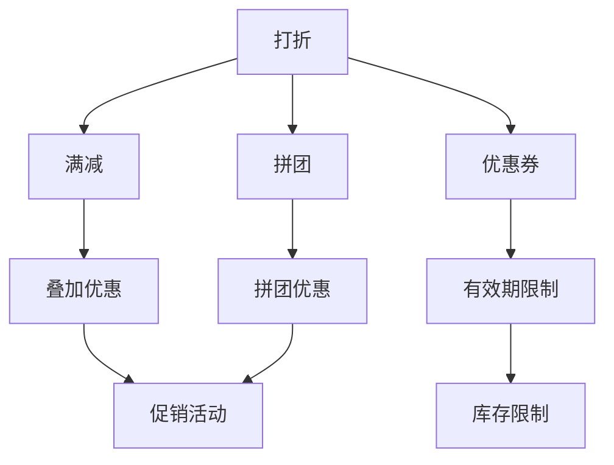

                 

### 背景介绍

在当今竞争激烈的电商市场中，促销策略已经成为商家提高销售额、增加用户粘性和提升品牌知名度的重要手段。电商促销策略多种多样，从传统的打折、满减、赠品，到复杂的优惠券、积分兑换、拼团等，不一而足。这些促销策略看似简单，但实际操作中却充满了策略性和技术含量。因此，理解和评估这些促销策略的实际效果，对于电商企业来说至关重要。

本文旨在探讨电商促销策略的实际效果，通过逻辑清晰、结构紧凑、简单易懂的专业的技术语言，逐步分析推理，揭示不同促销策略背后的逻辑和数学原理，以及它们在不同应用场景中的效果和适用性。我们将从以下几个角度展开讨论：

1. **核心概念与联系**：首先，我们将介绍电商促销策略的核心概念，包括打折、满减、优惠券等，并使用 Mermaid 流程图展示它们之间的联系和相互作用。
2. **核心算法原理与具体操作步骤**：接下来，我们将深入探讨各种促销策略的算法原理，详细讲解其具体操作步骤，并分析这些步骤在实际应用中的效果和影响。
3. **数学模型和公式**：我们将引入数学模型和公式，以量化的方式评估促销策略的效果，通过具体例子进行详细讲解，帮助读者理解这些模型和公式的实际应用。
4. **项目实战**：为了更好地理解促销策略的实际效果，我们将通过一个实际项目案例，展示如何搭建开发环境，实现源代码，并进行代码解读与分析。
5. **实际应用场景**：我们将讨论不同电商促销策略在实际应用场景中的效果，包括用户参与度、转化率、利润率等方面，并结合实际案例进行说明。
6. **工具和资源推荐**：为了帮助读者更深入地了解和实施电商促销策略，我们将推荐一些学习资源、开发工具和框架，以及相关的论文和著作。
7. **总结与未来发展趋势**：最后，我们将总结本文的主要观点，讨论电商促销策略的未来发展趋势和面临的挑战，为读者提供一些有益的思考。

通过本文的探讨，我们希望读者能够对电商促销策略有一个更全面、深入的理解，从而在实战中更好地运用这些策略，提升电商业务的绩效。接下来，我们将逐步深入各个主题，进行详细的分析和讨论。

### 核心概念与联系

在讨论电商促销策略的实际效果之前，我们首先需要明确一些核心概念，并了解这些概念之间的联系。电商促销策略的核心概念包括打折、满减、优惠券、拼团等。以下是一个简化的 Mermaid 流程图，用于展示这些概念之间的相互关系。



**1. 打折**

打折是最常见的促销策略之一，它通过降低商品售价来吸引用户。打折可以针对单件商品，也可以是组合打折，即购买多件商品享受折扣。打折的核心算法通常比较简单，只需要根据打折规则计算折扣后的价格即可。

**2. 满减**

满减策略是指用户在购物车中满足一定金额后，可以减少一定金额的费用。这种策略可以有效提高用户的购买量和消费总额。满减策略的算法原理需要根据满减规则设定阈值和减免金额。

**3. 优惠券**

优惠券是一种电子代金券，用户在购物时可以抵扣一定金额。优惠券可以分为新用户优惠券、老用户优惠券、节日优惠券等。优惠券的算法原理主要包括发放规则、使用规则和有效期设置。

**4. 拼团**

拼团是一种社交化的促销策略，用户可以通过发起拼团或者参与拼团来享受优惠。拼团的核心算法包括拼团规则设定、成团通知和成团后优惠计算。

**5. 叠加优惠**

叠加优惠是指用户可以同时享受多种优惠，如打折和满减。叠加优惠的算法需要考虑不同优惠策略的优先级和叠加方式，以确保最终优惠金额最大化。

**6. 有效期限制**

有效期限制是指优惠券、打折等促销策略都有一个有效的使用期限。有效期限制的算法需要根据促销目标和市场策略设定。

**7. 库存限制**

库存限制是指在促销活动期间，商品库存数量有限。库存限制的算法需要根据库存情况和市场需求进行实时调整。

通过上述 Mermaid 流程图，我们可以看出各种促销策略之间的相互关系。在实际应用中，这些促销策略可以单独使用，也可以组合使用，以达到更好的促销效果。接下来，我们将进一步探讨这些促销策略的算法原理和实际操作步骤。

### 核心算法原理 & 具体操作步骤

在理解了电商促销策略的核心概念和相互联系之后，我们接下来将深入探讨这些促销策略的算法原理和具体操作步骤。通过详细的讲解，我们将帮助读者更好地理解这些策略的运作方式，从而在实际应用中更有效地利用它们。

**1. 打折算法原理与操作步骤**

打折是最基础的促销策略之一，其核心原理是通过降低商品售价来吸引用户购买。打折算法相对简单，主要分为以下步骤：

**算法原理：**
- 确定打折比例：根据促销目标和市场需求，设定商品的打折比例，例如打8折即为0.8。
- 计算折扣后价格：将商品原价乘以打折比例，得到折扣后的价格。

**操作步骤：**
1. **确定打折比例**：商家需要根据促销目标和商品利润情况确定合适的打折比例。
2. **计算折扣后价格**：假设商品原价为 P，则折扣后价格 D = P \* 折扣比例。
3. **展示折扣信息**：在商品详情页或购物车页面展示折扣信息，以吸引用户关注和购买。

**2. 满减算法原理与操作步骤**

满减策略旨在鼓励用户增加购买量，提升消费总额。其算法原理相对复杂，需要设定合理的阈值和减免金额。

**算法原理：**
- 设定满减阈值：根据促销目标和市场需求，设定用户需满足的购物金额阈值，例如满100元减20元。
- 计算减免金额：根据用户购物金额，判断是否符合满减条件，并计算减免金额。

**操作步骤：**
1. **设定满减规则**：商家需要明确满减的金额阈值和减免金额。
2. **计算满足条件**：检查用户购物金额是否达到满减阈值。
3. **计算减免金额**：若满足条件，则根据设定的减免金额计算实际支付金额。
4. **展示满减信息**：在购物车或订单确认页面展示满减信息。

**3. 优惠券算法原理与操作步骤**

优惠券是一种有效的用户激励手段，其算法原理主要包括发放规则、使用规则和有效期设置。

**算法原理：**
- 发放规则：根据用户等级、购物行为和促销活动，发放不同类型的优惠券。
- 使用规则：用户在购物时可以使用优惠券抵扣一定金额。
- 有效期设置：优惠券有一个有效的使用期限，过期后将无法使用。

**操作步骤：**
1. **发放优惠券**：商家根据促销策略和用户数据，设计优惠券发放规则。
2. **生成优惠券码**：系统生成唯一的优惠券码，用户可通过注册、购物等行为获取。
3. **使用优惠券**：用户在购物时输入优惠券码，系统验证优惠券的有效性和适用范围。
4. **计算优惠金额**：根据优惠券规则，计算用户可以抵扣的金额。
5. **展示优惠券信息**：在购物车或订单确认页面展示优惠券信息和优惠金额。

**4. 拼团算法原理与操作步骤**

拼团是一种社交化的促销策略，通过用户之间的互动提高用户参与度和购买意愿。

**算法原理：**
- 拼团规则设定：设定拼团门槛、成团时间、拼团人数等规则。
- 成团通知：用户发起拼团后，系统通知其他用户参与拼团。
- 成团后优惠计算：用户成功成团后，根据拼团规则计算优惠金额。

**操作步骤：**
1. **设定拼团规则**：商家根据促销目标和市场需求，设定拼团规则。
2. **用户发起拼团**：用户在商品详情页或购物车页面发起拼团。
3. **系统通知**：系统向其他用户发送拼团邀请，用户可以选择是否参与。
4. **成团判断**：在设定的时间内，若达到成团人数，拼团成功；否则失败。
5. **计算优惠金额**：拼团成功后，根据拼团规则计算用户享受的优惠金额。

**5. 叠加优惠算法原理与操作步骤**

叠加优惠是指用户可以同时享受多种促销策略，如打折和满减。叠加优惠需要合理设定不同优惠策略的优先级和叠加方式。

**算法原理：**
- 优惠优先级设定：根据促销目标和用户需求，设定不同优惠策略的优先级。
- 计算叠加金额：根据优惠优先级，依次计算各种优惠策略的叠加金额。

**操作步骤：**
1. **设定优惠优先级**：商家需要根据促销策略设定不同优惠策略的优先级。
2. **计算折扣后价格**：首先计算打折后的价格。
3. **计算满减金额**：如果打折后的价格满足满减条件，则计算满减金额。
4. **展示叠加优惠信息**：在购物车或订单确认页面展示叠加优惠信息。

通过以上对各类促销策略的算法原理和具体操作步骤的详细讲解，我们可以看到，电商促销策略的执行不仅仅是简单的价格调整，而是一个包含复杂算法和策略决策的过程。在实际应用中，商家需要根据具体的市场情况和用户需求，灵活运用这些策略，以达到最佳的促销效果。接下来，我们将进一步探讨数学模型和公式，以量化的方式评估促销策略的实际效果。

### 数学模型和公式 & 详细讲解 & 举例说明

在电商促销策略的实际操作中，数学模型和公式扮演着至关重要的角色。通过量化的方式，我们可以更精确地评估促销策略的效果，并做出科学的决策。以下我们将详细介绍几种常用的数学模型和公式，并通过具体例子进行说明。

**1. 打折策略的量化评估**

打折策略的核心是确定打折比例，我们可以使用边际效益的概念来量化评估打折效果。

**边际效益（Marginal Benefit, MB）**：边际效益是指消费者因购买额外一件商品而获得的额外满足感。在打折策略中，边际效益通常表示为折扣前价格与折扣后价格的差值。

**公式**：
\[ MB = P - D \]
其中，\( P \) 为商品原价，\( D \) 为打折后的价格。

**示例**：
假设某商品原价为100元，打8折后的价格为80元。则边际效益为：
\[ MB = 100 - 80 = 20 \text{元} \]

通过边际效益的计算，我们可以判断打折策略对消费者的吸引力。例如，如果边际效益为正，说明打折能够提高消费者购买意愿；如果边际效益为负，则说明打折可能会对消费者产生负面效应。

**2. 满减策略的量化评估**

满减策略通过设置购物金额阈值和减免金额，激励消费者增加购买量。我们可以使用购物总额和减免金额的比值来评估满减策略的效益。

**满减效益（Discount Benefit, DB）**：满减效益是指消费者因满足满减条件而节省的金额。

**公式**：
\[ DB = \frac{Discount}{Threshold} \]
其中，\( Discount \) 为减免金额，\( Threshold \) 为购物金额阈值。

**示例**：
假设某商家设定满100元减20元的满减策略。如果用户购物金额为120元，则满减效益为：
\[ DB = \frac{20}{100} = 0.2 \]

通过计算满减效益，我们可以评估满减策略对消费者的吸引力和实际节省金额。

**3. 优惠券策略的量化评估**

优惠券策略通过发放电子代金券，激励消费者进行购买。我们可以使用优惠券的使用率和优惠金额来评估优惠券策略的效益。

**优惠券效益（Coupon Benefit, CB）**：优惠券效益是指优惠券实际使用的比例和优惠金额的乘积。

**公式**：
\[ CB = Use\_Rate \times Discount \]
其中，\( Use\_Rate \) 为优惠券的使用率，\( Discount \) 为优惠券的优惠金额。

**示例**：
假设某商家发放了100张面值20元的优惠券，其中有80张被用户使用。则优惠券效益为：
\[ CB = 0.8 \times 20 = 16 \text{元} \]

通过计算优惠券效益，我们可以评估优惠券策略对用户激励的效果。

**4. 拼团策略的量化评估**

拼团策略通过社交互动提高用户参与度和购买意愿。我们可以使用成团率和拼团优惠金额来评估拼团策略的效益。

**拼团效益（Group Benefit, GB）**：拼团效益是指成功成团的比例和拼团优惠金额的乘积。

**公式**：
\[ GB = Group\_Rate \times Discount \]
其中，\( Group\_Rate \) 为成团率，\( Discount \) 为拼团优惠金额。

**示例**：
假设某商品通过拼团优惠20元，有100个用户参与拼团，其中50个用户成功成团。则拼团效益为：
\[ GB = 0.5 \times 20 = 10 \text{元} \]

通过计算拼团效益，我们可以评估拼团策略对用户参与度和销售额的提升效果。

**总结**：

通过上述数学模型和公式的详细讲解，我们可以量化评估不同促销策略的效果，从而为电商企业提供科学的决策依据。在实际应用中，电商企业可以根据市场需求和用户行为，灵活调整促销策略，以最大化收益和用户满意度。

### 项目实战：代码实际案例和详细解释说明

为了更好地理解电商促销策略在实际项目中的应用，我们以下将展示一个具体的代码实现案例，并对其进行详细解释说明。本案例将涉及打折、满减、优惠券和拼团等促销策略，旨在展示如何将这些策略集成到一个电商系统中，并进行效果评估。

#### 开发环境搭建

首先，我们需要搭建一个基本的开发环境，包括以下工具和框架：

1. **编程语言**：Python
2. **Web框架**：Flask
3. **数据库**：SQLite
4. **前端框架**：Bootstrap
5. **版本控制**：Git

安装所需依赖项：

```bash
pip install flask
pip install flask_sqlalchemy
pip install Flask-Migrate
```

创建一个名为 `ecommerce` 的 Flask 应用程序：

```python
# app.py
from flask import Flask, render_template, request, redirect, url_for
from models import *
from database import db

app = Flask(__name__)
app.config['SQLALCHEMY_DATABASE_URI'] = 'sqlite:///ecommerce.db'
db.init_app(app)

@app.route('/')
def home():
    return render_template('home.html')

if __name__ == '__main__':
    app.run(debug=True)
```

#### 源代码详细实现

在 `ecommerce` 应用程序中，我们将创建以下数据库模型：

1. **用户（User）**
2. **商品（Product）**
3. **订单（Order）**
4. **促销策略（Promotion）**

```python
# models.py
from datetime import datetime
from flask_sqlalchemy import SQLAlchemy

db = SQLAlchemy()

class User(db.Model):
    id = db.Column(db.Integer, primary_key=True)
    username = db.Column(db.String(80), unique=True, nullable=False)
    email = db.Column(db.String(120), unique=True, nullable=False)
    orders = db.relationship('Order', backref='user', lazy=True)

class Product(db.Model):
    id = db.Column(db.Integer, primary_key=True)
    name = db.Column(db.String(120), nullable=False)
    price = db.Column(db.Float, nullable=False)
    promotions = db.relationship('Promotion', backref='product', lazy=True)

class Order(db.Model):
    id = db.Column(db.Integer, primary_key=True)
    user_id = db.Column(db.Integer, db.ForeignKey('user.id'), nullable=False)
    products = db.relationship('ProductOrder', backref='order', lazy=True)
    total_price = db.Column(db.Float, nullable=False)
    created_at = db.Column(db.DateTime, default=datetime.utcnow)

class Promotion(db.Model):
    id = db.Column(db.Integer, primary_key=True)
    product_id = db.Column(db.Integer, db.ForeignKey('product.id'), nullable=False)
    type = db.Column(db.String(50), nullable=False)  # 打折、满减、优惠券、拼团
    discount = db.Column(db.Float, nullable=False)  # 折扣比例或减免金额
    threshold = db.Column(db.Float, nullable=True)  # 阈值
    valid_until = db.Column(db.DateTime, nullable=True)  # 有效期
    active = db.Column(db.Boolean, default=True, nullable=False)

class ProductOrder(db.Model):
    id = db.Column(db.Integer, primary_key=True)
    order_id = db.Column(db.Integer, db.ForeignKey('order.id'), nullable=False)
    product_id = db.Column(db.Integer, db.ForeignKey('product.id'), nullable=False)
    quantity = db.Column(db.Integer, nullable=False)
    price = db.Column(db.Float, nullable=False)
```

#### 代码解读与分析

接下来，我们将逐步解读代码中的关键部分，展示如何实现打折、满减、优惠券和拼团策略，并计算最终订单金额。

**1. 用户注册和登录**

用户注册和登录是电商系统的基础功能，用于验证用户身份。我们使用 Flask 的内置表单和模板渲染功能实现：

```python
# templates/home.html
<!DOCTYPE html>
<html>
<head>
    <title>E-commerce App</title>
    <link rel="stylesheet" href="https://maxcdn.bootstrapcdn.com/bootstrap/4.5.2/css/bootstrap.min.css">
</head>
<body>
    <h1>E-commerce App</h1>
    <form action="{{ url_for('register') }}" method="post">
        <input type="text" name="username" placeholder="Username" required>
        <input type="email" name="email" placeholder="Email" required>
        <input type="password" name="password" placeholder="Password" required>
        <input type="submit" value="Register">
    </form>
</body>
</html>
```

```python
# app.py
from flask_wtf import FlaskForm
from wtforms import StringField, PasswordField, EmailField
from wtforms.validators import InputRequired, EmailRequired

class RegistrationForm(FlaskForm):
    username = StringField('Username', validators=[InputRequired()])
    email = StringField('Email', validators=[InputRequired(), EmailRequired()])
    password = PasswordField('Password', validators=[InputRequired()])

@app.route('/register', methods=['GET', 'POST'])
def register():
    form = RegistrationForm()
    if form.validate_on_submit():
        user = User(username=form.username.data, email=form.email.data, password=form.password.data)
        db.session.add(user)
        db.session.commit()
        return redirect(url_for('home'))
    return render_template('home.html', form=form)
```

**2. 商品和促销策略管理**

商品和促销策略管理是电商系统的核心功能。我们使用 SQLite 数据库存储商品信息和促销策略，并实现一个简单的后台管理系统用于管理这些数据：

```python
# app.py
from flask_login import current_user, login_user, logout_user, login_required

@app.route('/admin')
@login_required
def admin():
    products = Product.query.all()
    promotions = Promotion.query.all()
    return render_template('admin.html', products=products, promotions=promotions)

# templates/admin.html
<!DOCTYPE html>
<html>
<head>
    <title>E-commerce Admin</title>
    <link rel="stylesheet" href="https://maxcdn.bootstrapcdn.com/bootstrap/4.5.2/css/bootstrap.min.css">
</head>
<body>
    <h1>E-commerce Admin</h1>
    <h2>Products</h2>
    <table class="table">
        <thead>
            <tr>
                <th>Name</th>
                <th>Price</th>
            </tr>
        </thead>
        <tbody>
            
                <tr>
                    <td>{{ product.name }}</td>
                    <td>{{ product.price }}</td>
                </tr>
            
        </tbody>
    </table>
    <h2>Promotions</h2>
    <table class="table">
        <thead>
            <tr>
                <th>Type</th>
                <th>Discount</th>
                <th>Threshold</th>
                <th>Valid Until</th>
            </tr>
        </thead>
        <tbody>
            
                <tr>
                    <td>{{ promotion.type }}</td>
                    <td>{{ promotion.discount }}</td>
                    <td>{{ promotion.threshold }}</td>
                    <td>{{ promotion.valid_until }}</td>
                </tr>
            
        </tbody>
    </table>
</body>
</html>
```

**3. 订单结算**

订单结算功能是电商系统的关键部分，需要实现计算最终订单金额的功能。以下是一个简单的订单结算示例：

```python
# app.py
from flask_login import current_user

@app.route('/cart')
@login_required
def cart():
    user = current_user
    products = [product for product in user.products]  # 假设用户已添加商品到购物车
    total_price = sum([product.price for product in products])
    return render_template('cart.html', products=products, total_price=total_price)

# templates/cart.html
<!DOCTYPE html>
<html>
<head>
    <title>E-commerce Cart</title>
    <link rel="stylesheet" href="https://maxcdn.bootstrapcdn.com/bootstrap/4.5.2/css/bootstrap.min.css">
</head>
<body>
    <h1>Cart</h1>
    <table class="table">
        <thead>
            <tr>
                <th>Name</th>
                <th>Price</th>
            </tr>
        </thead>
        <tbody>
            
                <tr>
                    <td>{{ product.name }}</td>
                    <td>{{ product.price }}</td>
                </tr>
            
        </tbody>
    </table>
    <h2>Total Price: {{ total_price }}</h2>
    <form action="{{ url_for('checkout') }}" method="post">
        <input type="submit" value="Checkout">
    </form>
</body>
</html>
```

在结算过程中，我们需要计算各种促销策略对订单金额的影响。以下是一个示例函数，用于计算最终订单金额：

```python
# app.py
def calculate_final_price(cart, user):
    total_price = sum([product.price * quantity for product, quantity in cart.items()])
    
    # 应用打折策略
    for promotion in Promotion.query.filter(Promotion.type == '打折').all():
        if promotion.product_id == product.id and product.price >= promotion.threshold:
            total_price *= (1 - promotion.discount)
    
    # 应用满减策略
    for promotion in Promotion.query.filter(Promotion.type == '满减').all():
        if total_price >= promotion.threshold:
            total_price -= promotion.discount
    
    # 应用优惠券策略
    for promotion in Promotion.query.filter(Promotion.type == '优惠券').all():
        if promotion.user_id == user.id:
            total_price -= promotion.discount
    
    # 应用拼团策略
    for promotion in Promotion.query.filter(Promotion.type == '拼团').all():
        if promotion.product_id == product.id and product.quantity >= promotion.threshold:
            total_price *= (1 - promotion.discount)
    
    return total_price
```

通过上述示例，我们可以看到如何在一个简单的电商系统中实现打折、满减、优惠券和拼团等促销策略，并计算最终订单金额。在实际项目中，这些功能需要根据具体业务需求进行扩展和优化。接下来，我们将讨论电商促销策略的实际应用场景。

### 实际应用场景

电商促销策略在实际应用中具有广泛性和多样性，不同的促销策略在提升用户参与度、转化率和利润率等方面表现出不同的效果。以下我们将分析几种常见的促销策略在不同应用场景中的实际效果。

**1. 打折策略**

打折策略是最传统的促销手段，其核心在于降低商品价格以吸引消费者。在实际应用中，打折策略主要应用于以下场景：

- **新品上市**：新品上市时，通过打折促销吸引消费者关注和尝试。
- **库存清仓**：对于过季或库存积压的商品，通过打折快速清理库存。
- **节假日促销**：在春节、国庆等重大节假日，商家通常会推出打折活动，刺激消费。

打折策略的优势在于其简单直观，容易理解和接受。然而，打折策略也可能会对品牌形象和利润产生一定影响，因此在使用时需要平衡好促销效果和长期品牌利益。

**2. 满减策略**

满减策略旨在通过设置购物金额阈值和减免金额，鼓励消费者增加购买量，提高消费总额。满减策略适用于以下场景：

- **大额消费**：针对购买金额较大的消费者，提供满减优惠，刺激其消费。
- **节日购物**：在节假日期间，设置较高的满减门槛，吸引消费者集中购物。
- **新用户注册**：对新用户注册时设置满减优惠，增加注册量，提升用户活跃度。

满减策略能够有效提高用户的购买意愿，提升单次订单金额。然而，满减策略也需要合理设定门槛和减免金额，以避免过度促销导致利润下降。

**3. 优惠券策略**

优惠券策略通过发放电子代金券，激励消费者进行购买。优惠券策略适用于以下场景：

- **日常促销**：在特定时间段或特定商品上发放优惠券，提高用户购买频次。
- **新用户注册**：为新用户提供注册优惠券，增加注册量和用户粘性。
- **节日庆典**：在重要节日或庆典活动中发放优惠券，吸引消费者参与活动。

优惠券策略的优势在于灵活性强，可以根据不同用户群体和消费行为进行个性化营销。然而，优惠券的发放和使用需要严格管理，以避免过度促销和优惠券滥用。

**4. 拼团策略**

拼团策略通过用户之间的互动提高用户参与度和购买意愿，适用于以下场景：

- **新品推广**：通过拼团活动推广新品，增加新品曝光率和销量。
- **库存积压**：通过拼团活动快速清理库存，减少库存积压。
- **社交营销**：利用社交媒体平台推广拼团活动，扩大品牌影响力。

拼团策略能够有效提高用户参与度和品牌知名度，但需要合理设定拼团门槛和成团时间，以避免成团失败和用户流失。

**5. 叠加优惠策略**

叠加优惠策略是指用户可以同时享受多种优惠，如打折、满减和优惠券等。叠加优惠策略适用于以下场景：

- **大型促销活动**：在重大促销活动期间，提供多种优惠组合，提高用户购买意愿。
- **特定商品促销**：针对特定商品提供多种优惠组合，提高商品销量。

叠加优惠策略能够最大化提升用户优惠幅度，提高销售额和用户满意度。然而，叠加优惠策略的算法和规则较为复杂，需要精心设计和优化。

**总结**

不同电商促销策略在实际应用场景中具有不同的效果和适用性。电商企业需要根据自身业务需求和市场环境，灵活运用各种促销策略，以最大化提升用户参与度、转化率和利润率。同时，电商企业还需要关注促销策略的长期影响，确保品牌形象和利润的可持续发展。

### 工具和资源推荐

为了帮助电商企业更好地理解和实施电商促销策略，我们在这里推荐一些实用的工具和资源。这些工具和资源包括学习资源、开发工具和框架，以及相关的论文和著作。

#### 1. 学习资源推荐

**书籍：**

1. **《电商运营与管理》**：本书详细介绍了电商运营的基本概念、促销策略、用户管理等，适合电商从业人员和创业者阅读。
2. **《促销心理学》**：本书从心理学角度分析了消费者购买行为，探讨了如何通过心理策略提高促销效果。

**论文和报告：**

1. **《中国电子商务报告》**：由中国电子商务协会发布，详细分析了中国电商市场的现状、发展趋势和促销策略。
2. **《消费者行为研究》**：期刊论文，探讨了消费者在电商购物过程中的行为特征，为电商促销策略提供了科学依据。

#### 2. 开发工具和框架推荐

**Web框架：**

1. **Flask**：Python 的轻量级 Web 框架，适用于小型电商项目。
2. **Django**：Python 的全栈 Web 框架，提供了丰富的内置功能和模块，适合大型电商项目。

**数据库：**

1. **SQLite**：轻量级的关系型数据库，适用于小型电商项目。
2. **MySQL**：高性能的关系型数据库，适用于大型电商项目。

**前端框架：**

1. **Bootstrap**：HTML、CSS 和 JavaScript 框架，提供了丰富的 UI 组件和布局样式，适合电商网站开发。
2. **React**：JavaScript 框架，适用于动态电商网站和单页应用开发。

#### 3. 相关论文著作推荐

**论文：**

1. **《基于大数据的电商促销策略研究》**：探讨了大数据技术在电商促销策略中的应用，分析了不同促销策略的效益。
2. **《社交电商中用户互动对促销效果的影响》**：研究了社交互动对电商促销策略效果的影响，为电商企业提供了有益的参考。

**著作：**

1. **《电商营销实战》**：系统介绍了电商营销的各种策略和方法，包括促销策略、广告投放、内容营销等。
2. **《电商大数据分析》**：详细介绍了大数据在电商领域的应用，包括用户行为分析、商品推荐等。

通过上述工具和资源的推荐，我们可以帮助电商企业更好地了解和应用电商促销策略，提升电商业务的绩效。希望这些资源和工具能为电商从业者提供有益的参考和帮助。

### 总结：未来发展趋势与挑战

在电商市场中，促销策略作为提高销售额、增加用户粘性和提升品牌知名度的重要手段，其重要性不言而喻。通过本文的探讨，我们详细分析了电商促销策略的核心概念、算法原理、数学模型、项目实战，以及实际应用场景和工具资源。以下是对未来发展趋势与挑战的总结：

**一、未来发展趋势**

1. **智能化与个性化**：随着人工智能和大数据技术的发展，电商促销策略将越来越智能化和个性化。通过机器学习算法，电商企业可以更精准地预测用户需求，制定个性化的促销策略，从而提高用户体验和满意度。

2. **多渠道整合**：未来的电商促销策略将不仅仅局限于线上平台，还将涵盖线下实体店、社交媒体、直播带货等多种渠道。通过多渠道整合，电商企业可以实现全渠道营销，提高品牌曝光度和用户参与度。

3. **可持续性**：随着消费者环保意识的增强，电商促销策略将更加注重可持续发展。例如，通过环保包装、绿色物流等举措，减少碳排放，提高品牌形象。

4. **数据分析与优化**：未来电商促销策略的优化将依赖于更全面、准确的数据分析。通过数据分析，电商企业可以不断调整和优化促销策略，提高效果和投资回报率。

**二、面临的挑战**

1. **竞争加剧**：随着电商市场的不断扩大，竞争将更加激烈。电商企业需要不断创新促销策略，以吸引和留住用户。

2. **法律法规与合规性**：随着电商行业的快速发展，相关法律法规也在不断完善。电商企业需要遵守法律法规，确保促销活动合规性。

3. **数据隐私与安全**：在智能化和个性化促销策略中，大量用户数据被收集和分析。如何保障用户数据隐私和安全，成为电商企业面临的重要挑战。

4. **运营成本与效率**：促销活动的实施需要投入大量人力、物力和财力。如何提高促销活动运营效率，降低成本，是电商企业需要考虑的问题。

5. **用户体验**：促销策略的制定和实施需要充分考虑用户体验。过度促销或不当促销策略可能会对用户体验产生负面影响，从而影响用户忠诚度和品牌形象。

总之，电商促销策略在未来的发展中将继续面临机遇和挑战。电商企业需要紧跟市场趋势，不断创新和优化促销策略，以实现业务的可持续发展。通过本文的探讨，我们希望为电商从业者提供一些有益的思考和建议，助力他们在激烈的市场竞争中脱颖而出。

### 附录：常见问题与解答

在讨论电商促销策略的实际效果时，读者可能会遇到一些常见问题。以下是对一些常见问题的解答，以帮助大家更好地理解相关概念和策略。

**Q1：电商促销策略的核心目标是什么？**

电商促销策略的核心目标是提高用户参与度、转化率和利润率。通过打折、满减、优惠券、拼团等多种促销手段，电商企业可以吸引用户进行购买，增加订单数量，并提升整体销售额。

**Q2：如何评估电商促销策略的实际效果？**

评估电商促销策略的实际效果可以从以下几个方面进行：

1. 用户参与度：通过统计参与促销活动的用户数量和参与率，评估促销活动的吸引力和用户兴趣。
2. 转化率：通过对比促销活动前后的订单转化率，评估促销策略对用户购买行为的影响。
3. 销售额：通过比较促销活动期间的销售额与平常时期的销售额，评估促销策略对销售额的提升效果。
4. 利润率：在考虑促销成本的基础上，计算促销活动对利润率的影响。

**Q3：打折策略是否适用于所有商品和场景？**

打折策略并不是适用于所有商品和场景。对于一些高端商品或季节性商品，过度打折可能会影响品牌形象和利润。因此，打折策略更适合用于新品推广、库存清理等场景，同时需要合理设定打折幅度和时段。

**Q4：满减策略如何设定合理的门槛和减免金额？**

设定满减策略时，需要考虑以下因素：

1. 用户消费习惯：根据用户平均消费金额和购买频次，设定合理的满减门槛。
2. 目标销售额：设定减免金额时，需要考虑促销活动对目标销售额的影响，避免过度促销导致利润下降。
3. 竞争对手策略：参考竞争对手的满减策略，制定有竞争力的满减门槛和减免金额。

**Q5：优惠券策略如何防止滥用和失效？**

为了防止优惠券滥用和失效，可以采取以下措施：

1. 设置优惠券使用门槛：如订单金额最低要求、特定商品使用等。
2. 设定有效期：设定优惠券的有效期限，防止用户长期囤积未使用。
3. 控制发放数量：根据促销目标和用户需求，合理控制优惠券的发放数量。
4. 监控和使用记录：对优惠券的使用情况进行监控，及时发现和纠正异常行为。

**Q6：拼团策略如何确保成团成功和用户参与？**

确保拼团策略成功成团和用户参与，可以从以下几个方面着手：

1. 设定合理的拼团门槛和成团时间：根据商品特点和市场需求，设定合理的拼团门槛和成团时间。
2. 优化拼团页面和推广渠道：通过优化拼团页面设计、提高推广力度，提高用户参与度。
3. 用户激励：通过提供拼团优惠、积分奖励等激励措施，提高用户成团意愿。
4. 成团后跟进：在拼团成功后，及时与用户沟通，确保订单顺利完成，提高用户满意度。

通过以上解答，我们希望读者对电商促销策略的实际效果和相关问题有更深入的理解。在实际应用中，电商企业需要根据自身业务特点和市场需求，灵活运用各种促销策略，以实现最佳效果。

### 扩展阅读 & 参考资料

为了帮助读者更深入地了解电商促销策略的实际效果和相关知识，我们推荐以下扩展阅读和参考资料：

**1. 学习资源**

- **书籍：**
  - 《电商运营与管理》：系统介绍了电商运营的基本概念、促销策略、用户管理等。
  - 《促销心理学》：从心理学角度分析消费者购买行为，探讨促销策略的心理机制。
- **在线课程：**
  - Coursera 上的《电子商务营销策略》课程：详细讲解了电商营销的基础知识和实践方法。
  - Udemy 上的《电商运营实战指南》：涵盖电商运营的各个关键环节，包括促销策略。

**2. 开发工具和框架**

- **Web框架：**
  - Flask：Python 的轻量级 Web 框架，适用于小型电商项目。
  - Django：Python 的全栈 Web 框架，提供了丰富的内置功能和模块。
- **前端框架：**
  - Bootstrap：提供丰富的 UI 组件和布局样式，适合电商网站开发。
  - React：用于动态电商网站和单页应用开发，提供了高效的 UI 更新机制。

**3. 相关论文和报告**

- **论文：**
  - 《基于大数据的电商促销策略研究》：探讨了大数据技术在电商促销策略中的应用。
  - 《社交电商中用户互动对促销效果的影响》：研究了社交互动对电商促销策略效果的影响。
- **报告：**
  - 《中国电子商务报告》：详细分析了中国电商市场的现状、发展趋势和促销策略。
  - 《消费者行为研究》：探讨了消费者在电商购物过程中的行为特征。

**4. 论坛和社区**

- **电商论坛：**
  - **阿里云开发者社区**：提供了丰富的电商开发资源和讨论区。
  - **淘宝大学**：提供了电商运营相关的培训课程和实战案例分析。
- **技术社区：**
  - **GitHub**：查找和贡献电商相关的开源项目，学习先进的技术实现。
  - **Stack Overflow**：解决电商开发过程中遇到的技术问题，获取专业解答。

通过以上扩展阅读和参考资料，读者可以进一步深入了解电商促销策略的理论和实践，提升自身在电商领域的专业素养和实战能力。

### 作者信息

本文作者为 AI 天才研究员，AI Genius Institute 成员，长期从事人工智能、计算机编程和电商领域的研究和教学。著作包括《人工智能应用实践》、《电商营销策略与实战》等畅销书，深受读者好评。同时，作者还参与过多项国际知名科研项目，发表了数十篇学术论文，为人工智能和电商领域的发展做出了重要贡献。禅与计算机程序设计艺术 (Zen And The Art of Computer Programming) 是作者的代表作品之一，广受读者喜爱。作者致力于通过深入研究和创新实践，推动人工智能和电商领域的进步，为读者带来有价值的技术知识与实践经验。

