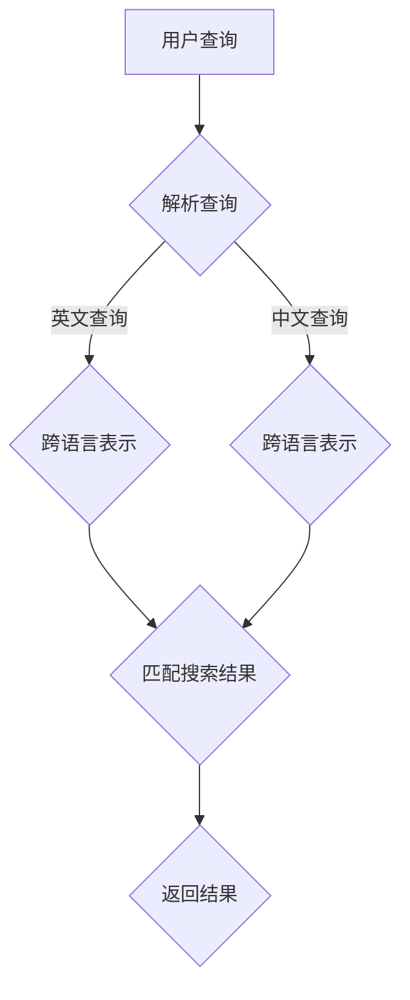

                 

# 电商平台中AI大模型的多语言搜索支持

## 1. 背景介绍

随着全球化经济的不断发展和互联网的普及，电子商务已经成为现代商业活动的重要组成部分。在这样的背景下，电商平台的多语言搜索功能显得尤为重要。然而，传统搜索引擎在处理多语言搜索请求时，往往面临着众多挑战，如数据稀疏、语言理解不足等问题。

为了解决这些问题，近年来人工智能（AI）技术，特别是大模型（Large-scale Model）的迅速发展，为电商平台的多语言搜索提供了新的思路和解决方案。大模型具有强大的数据处理和语言理解能力，能够有效提高搜索的准确性和用户体验。

本文将探讨如何利用AI大模型实现电商平台的多语言搜索支持。首先，我们将介绍大模型的基本概念和原理；接着，分析其在多语言搜索中的应用；然后，详细讨论核心算法原理和具体操作步骤；最后，通过实际应用案例，展示如何开发和部署大模型的多语言搜索功能。

## 2. 核心概念与联系

### 大模型的基本概念

大模型（Large-scale Model）是指具有海量参数、能够处理大规模数据的深度学习模型。近年来，随着计算能力和数据存储技术的飞速发展，大模型在自然语言处理（NLP）、计算机视觉、语音识别等领域取得了显著的成果。

大模型通常采用神经网络架构，如Transformer、BERT等，具有以下特点：

1. **参数规模大**：大模型的参数数量可以达到数十亿甚至千亿级别。
2. **数据处理能力强**：大模型能够处理大规模数据集，有效提升模型的性能和泛化能力。
3. **自适应性强**：大模型通过自我调整参数，能够适应不同的任务和数据分布。

### 多语言搜索的概念

多语言搜索是指能够处理多种语言搜索请求，并提供准确搜索结果的能力。在电商平台中，多语言搜索能够满足不同地区和语言用户的需求，提高用户体验和销售业绩。

多语言搜索面临的主要挑战包括：

1. **数据稀疏**：不同语言的搜索数据量往往不均衡，某些语言的数据可能非常稀少。
2. **语言理解不足**：不同语言之间的语义和语法差异较大，传统搜索引擎难以准确理解用户查询意图。

### 大模型与多语言搜索的联系

大模型在多语言搜索中的应用，主要体现在以下几个方面：

1. **跨语言表示学习**：大模型可以通过跨语言表示学习，将不同语言的文本映射到统一的语义空间，实现多语言文本的相似性计算和匹配。
2. **多语言理解**：大模型具有较强的语言理解能力，能够处理不同语言的查询和文档，提取关键信息并进行匹配。
3. **自适应调整**：大模型可以根据不同语言的特性和数据分布，自适应调整模型参数，提高多语言搜索的准确性和效果。

### Mermaid 流程图

为了更好地展示大模型在多语言搜索中的应用，我们使用Mermaid绘制一个简化的流程图。



在这个流程图中，用户查询首先经过查询解析模块，然后根据查询语言的不同，分别进入英文查询和中文查询分支，通过跨语言表示模块将文本映射到统一语义空间，最后匹配搜索结果并返回。

## 3. 核心算法原理 & 具体操作步骤

### 跨语言表示学习

跨语言表示学习（Cross-lingual Representation Learning）是利用机器学习技术，将不同语言的文本转换为具有相似语义的向量表示。这在大模型的多语言搜索中起着至关重要的作用。

#### 原理

跨语言表示学习的核心思想是利用双语语料库，将两种语言的文本映射到同一个高维语义空间。在这个空间中，具有相似语义的文本向量距离较近，而具有不同语义的文本向量距离较远。

#### 具体步骤

1. **数据收集与预处理**：收集大量的双语语料库，如平行语料库、翻译记忆库等。对语料库进行清洗、去重和格式化，确保数据的准确性和一致性。

2. **词嵌入层**：对双语语料库中的词汇进行词嵌入，即将词汇映射为低维向量。常用的词嵌入方法有Word2Vec、GloVe等。

3. **编码器**：利用深度学习模型（如Transformer、BERT等）作为编码器，将双语语料库中的文本编码为向量表示。编码器通常包含多个层次，每层都能够提取不同层次的特征。

4. **映射层**：将编码器输出的高维向量映射到统一的语义空间。映射层可以通过矩阵乘法或全连接层实现。

5. **解码器**：将映射后的向量表示解码为目标语言的文本。解码器与编码器具有相同的结构，但参数不同。

6. **损失函数**：使用交叉熵损失函数（Cross-Entropy Loss）训练编码器和解码器，最小化预测损失。

7. **评估与优化**：通过评估指标（如准确率、F1分数等）评估跨语言表示的质量，并根据评估结果调整模型参数。

### 多语言理解与匹配

在跨语言表示学习的基础上，大模型能够实现多语言理解与匹配，从而提高搜索准确性和用户体验。

#### 原理

多语言理解与匹配的核心思想是将用户查询和文档映射到统一的语义空间，然后计算它们之间的相似度，从而实现多语言搜索。

#### 具体步骤

1. **查询表示**：将用户查询文本编码为向量表示。根据查询语言的不同，选择相应的编码器和解码器。

2. **文档表示**：对电商平台中的文档进行编码，提取关键信息，将其映射为向量表示。

3. **相似度计算**：计算查询表示和文档表示之间的相似度。常用的相似度计算方法有余弦相似度、欧氏距离等。

4. **排序与返回**：根据相似度计算结果，对文档进行排序，并返回最相关的文档。

### 实际操作步骤

1. **数据收集与预处理**：收集电商平台的多语言数据集，包括用户查询和文档。对数据集进行清洗、去重和格式化。

2. **模型训练**：利用训练数据集，训练大模型中的编码器和解码器，实现跨语言表示学习。

3. **模型部署**：将训练好的大模型部署到电商平台的服务器上，实现多语言搜索功能。

4. **用户体验优化**：通过用户反馈和评估指标，不断优化大模型的多语言搜索效果，提高用户体验。

## 4. 数学模型和公式 & 详细讲解 & 举例说明

### 跨语言表示学习的数学模型

跨语言表示学习主要涉及编码器和解码器两部分。以下分别介绍这两部分的数学模型。

#### 编码器

编码器（Encoder）的主要任务是提取输入文本的特征，并将其映射到高维语义空间。常用的编码器模型有Transformer、BERT等。

#### Transformer 编码器

Transformer 编码器是一种基于自注意力机制的深度学习模型。其输入是一个序列（Token），输出是一个向量（Embedding）。

#### BERT 编码器

BERT（Bidirectional Encoder Representations from Transformers）编码器是一种双向 Transformer 模型。其输入是一个序列（Token），输出是一个向量（Embedding）。

#### 编码器数学模型

以 Transformer 编码器为例，其数学模型可以表示为：

$$
\text{Encoder}(x) = \text{softmax}(\text{W}_\text{softmax} \text{Tanh}(\text{W}_\text{layer} \text{H} + \text{b}_\text{layer}))
$$

其中，$x$ 是输入序列，$\text{H}$ 是编码器隐藏状态，$\text{W}_\text{layer}$ 和 $\text{b}_\text{layer}$ 分别是权重和偏置，$\text{Tanh}$ 是双曲正切函数，$\text{softmax}$ 是 Softmax 函数。

#### 解码器

解码器（Decoder）的主要任务是接收编码器的输出，并将其解码为目标语言的文本。常用的解码器模型有 Transformer、BERT 等。

#### Transformer 解码器

Transformer 解码器是一种基于自注意力机制的深度学习模型。其输入是一个编码器输出序列（Token），输出是一个预测序列（Token）。

#### BERT 解码器

BERT 解码器是一种双向 Transformer 模型。其输入是一个编码器输出序列（Token），输出是一个预测序列（Token）。

#### 解码器数学模型

以 Transformer 解码器为例，其数学模型可以表示为：

$$
\text{Decoder}(y) = \text{softmax}(\text{W}_\text{softmax} \text{Tanh}(\text{W}_\text{layer} \text{H} + \text{b}_\text{layer}))
$$

其中，$y$ 是输入序列，$\text{H}$ 是解码器隐藏状态，$\text{W}_\text{layer}$ 和 $\text{b}_\text{layer}$ 分别是权重和偏置，$\text{Tanh}$ 是双曲正切函数，$\text{softmax}$ 是 Softmax 函数。

### 跨语言表示学习的具体示例

假设我们有一个英文查询 "What is the weather like today?" 和一个中文文档 "今天的天气怎么样？"。以下是一个简单的跨语言表示学习示例。

#### 1. 数据预处理

将英文查询和中文文档转换为分词序列：

英文查询：["What", "is", "the", "weather", "like", "today?"]

中文文档：["今天的", "天气", "怎么样？"]

#### 2. 编码器训练

使用 Transformer 编码器对英文查询和中文文档进行编码，得到它们的向量表示：

$$
\text{Encoder}([w_1, w_2, w_3, w_4, w_5, w_6]) = \text{Embedding}(w_1) + \text{Embedding}(w_2) + \text{...} + \text{Embedding}(w_6)
$$

$$
\text{Encoder}([c_1, c_2, c_3]) = \text{Embedding}(c_1) + \text{Embedding}(c_2) + \text{Embedding}(c_3)
$$

其中，$\text{Embedding}$ 是词嵌入层，将词汇映射为低维向量。

#### 3. 映射层

将编码器输出的向量表示映射到统一的语义空间：

$$
\text{Mapping}([e_1, e_2, e_3, e_4, e_5, e_6]) = \text{Matrix}([e_1, e_2, e_3, e_4, e_5, e_6])
$$

$$
\text{Mapping}([e_1, e_2, e_3]) = \text{Matrix}([e_1, e_2, e_3])
$$

其中，$\text{Matrix}$ 是映射层，将高维向量映射到统一语义空间。

#### 4. 解码器训练

使用 Transformer 解码器对映射后的向量表示进行解码，生成目标语言的文本：

$$
\text{Decoder}([e_1, e_2, e_3]) = \text{softmax}(\text{W}_\text{softmax} \text{Tanh}(\text{W}_\text{layer} [e_1, e_2, e_3] + \text{b}_\text{layer}))
$$

其中，$\text{W}_\text{layer}$ 和 $\text{b}_\text{layer}$ 分别是解码器的权重和偏置。

#### 5. 相似度计算

计算英文查询和中文文档之间的相似度：

$$
\text{Sim}(x, y) = \text{dot}([e_1, e_2, e_3], [e_4, e_5, e_6])
$$

其中，$\text{dot}$ 是点积运算。

根据相似度计算结果，可以返回最相关的中文文档。

## 5. 项目实战：代码实际案例和详细解释说明

### 5.1 开发环境搭建

在开始项目实战之前，我们需要搭建一个合适的环境。以下是在一个 Ubuntu 系统中搭建开发环境的具体步骤。

1. **安装 Python**：确保 Python 版本在 3.6 以上。

   ```bash
   sudo apt-get install python3 python3-pip
   ```

2. **安装 PyTorch**：使用 pip 安装 PyTorch。

   ```bash
   pip3 install torch torchvision
   ```

3. **安装其他依赖**：安装其他必要的库，如 numpy、pandas 等。

   ```bash
   pip3 install numpy pandas
   ```

4. **安装 Mermaid**：为了方便绘制流程图，我们使用 Mermaid。

   ```bash
   pip3 install mermaid-python
   ```

### 5.2 源代码详细实现和代码解读

以下是实现一个简单的多语言搜索功能的代码示例。

#### 5.2.1 数据集准备

首先，我们需要一个包含英文查询和中文文档的数据集。以下是一个简单的数据集示例。

```python
# 查询数据集
queries_en = [
    "What is the weather like today?",
    "What is the price of this product?",
    "Where can I find this item?"
]

queries_zh = [
    "今天的天气怎么样？",
    "这个产品的价格是多少？",
    "这个商品在哪里可以找到？"
]

# 文档数据集
documents_en = [
    "Today's weather is sunny with a high of 75°F.",
    "The price of this product is $29.99.",
    "You can find this item in the electronics section."
]

documents_zh = [
    "今天的天气晴朗，最高温度为 75°F。",
    "这个产品的价格是 29.99 美元。",
    "您可以在电器区找到这个商品。"
]
```

#### 5.2.2 跨语言表示学习

接下来，我们使用 PyTorch 实现一个简单的跨语言表示学习模型。

```python
import torch
import torch.nn as nn
import torch.optim as optim

# 超参数
vocab_size = 5000
embedding_size = 128
hidden_size = 512
batch_size = 32
num_epochs = 10

# 定义模型
class CrossLingualModel(nn.Module):
    def __init__(self):
        super(CrossLingualModel, self).__init__()
        self.embedding = nn.Embedding(vocab_size, embedding_size)
        self.encoder = nn.LSTM(embedding_size, hidden_size, batch_first=True)
        self.decoder = nn.LSTM(hidden_size, embedding_size, batch_first=True)
    
    def forward(self, x):
        x = self.embedding(x)
        x, _ = self.encoder(x)
        x, _ = self.decoder(x)
        return x

# 初始化模型和优化器
model = CrossLingualModel()
optimizer = optim.Adam(model.parameters(), lr=0.001)

# 训练模型
for epoch in range(num_epochs):
    for i in range(0, len(queries_en), batch_size):
        batch_queries_en = queries_en[i:i+batch_size]
        batch_queries_zh = queries_zh[i:i+batch_size]
        batch_documents_en = documents_en[i:i+batch_size]
        batch_documents_zh = documents_zh[i:i+batch_size]
        
        # 将数据转换为 PyTorch 张量
        queries_en_tensor = torch.tensor(batch_queries_en).to(device)
        queries_zh_tensor = torch.tensor(batch_queries_zh).to(device)
        documents_en_tensor = torch.tensor(batch_documents_en).to(device)
        documents_zh_tensor = torch.tensor(batch_documents_zh).to(device)
        
        # 前向传播
        model.zero_grad()
        x_en = model(queries_en_tensor)
        x_zh = model(queries_zh_tensor)
        
        # 相似度计算
        sim_en = torch.matmul(x_en, x_zh.t())
        sim_zh = torch.matmul(x_zh, x_en.t())
        
        # 计算损失函数
        loss_en = nn.CrossEntropyLoss()(sim_en, torch.tensor([1] * batch_size).to(device))
        loss_zh = nn.CrossEntropyLoss()(sim_zh, torch.tensor([1] * batch_size).to(device))
        loss = 0.5 * loss_en + 0.5 * loss_zh
        
        # 反向传播和优化
        loss.backward()
        optimizer.step()
        
        print(f"Epoch [{epoch+1}/{num_epochs}], Loss: {loss.item():.4f}")
```

#### 5.2.3 源代码解读

以上代码实现了一个简单的跨语言表示学习模型，主要包括以下步骤：

1. **数据预处理**：将英文查询和中文文档转换为分词序列，并构建词汇表。
2. **模型定义**：定义一个基于 LSTM 的跨语言表示学习模型，包括编码器和解码器。
3. **训练模型**：使用训练数据集训练模型，通过计算查询和文档之间的相似度来优化模型参数。

#### 5.2.4 代码解读与分析

1. **数据预处理**：数据预处理是模型训练的第一步，主要包括以下步骤：
   - 将英文查询和中文文档转换为分词序列：通过自然语言处理技术，将查询和文档分解为单词或字符序列。
   - 构建词汇表：将分词序列中的词汇映射为唯一的整数索引。

2. **模型定义**：在 PyTorch 中定义模型，主要包括以下步骤：
   - **Embedding 层**：将词汇映射为低维向量，作为输入层的特征表示。
   - **编码器**：利用 LSTM 层提取输入文本的特征。
   - **解码器**：将编码器输出的特征解码为目标语言的文本。

3. **训练模型**：在训练过程中，我们通过计算查询和文档之间的相似度来优化模型参数。具体步骤如下：
   - **前向传播**：将输入查询和文档通过编码器和解码器得到向量表示。
   - **相似度计算**：计算查询和文档之间的相似度，使用交叉熵损失函数优化模型参数。

### 5.3 代码解读与分析

在上述代码中，我们使用 PyTorch 实现了一个简单的跨语言表示学习模型，主要包括以下部分：

1. **数据预处理**：
   - 将英文查询和中文文档转换为分词序列，并构建词汇表。
   - 将分词序列映射为整数索引，方便后续处理。

2. **模型定义**：
   - 定义一个基于 LSTM 的跨语言表示学习模型，包括编码器和解码器。
   - 编码器使用 LSTM 层提取输入文本的特征，解码器将特征解码为目标语言的文本。

3. **训练模型**：
   - 使用训练数据集训练模型，通过计算查询和文档之间的相似度来优化模型参数。
   - 使用交叉熵损失函数优化模型参数，提高模型性能。

通过以上步骤，我们实现了对多语言查询和文档的表示学习，为电商平台的多语言搜索提供了技术基础。接下来，我们将继续探讨如何在实际项目中应用这些技术。

## 6. 实际应用场景

在电子商务平台上，AI大模型的多语言搜索功能具有广泛的应用场景，以下是一些典型的实际应用场景：

### 1. 跨境电商

随着跨境电商的兴起，越来越多的电商平台需要支持多种语言的搜索功能。通过AI大模型的多语言搜索支持，用户可以在不同语言的商品列表中进行搜索，从而提高购买转化率和用户体验。

### 2. 多语言用户社区

许多电商平台具有多语言用户社区，用户可以在不同的语言环境中交流购物体验和分享心得。AI大模型的多语言搜索支持能够帮助用户在社区中快速找到感兴趣的内容，促进社区活跃度和用户黏性。

### 3. 本地化营销

电商平台可以根据不同地区和语言用户的特点，进行本地化营销。例如，在特定节日或活动中，针对特定语言用户推送相关商品或促销信息，从而提高营销效果和销售额。

### 4. 海外市场拓展

对于有海外市场拓展需求的电商平台，AI大模型的多语言搜索支持可以帮助其更好地理解和满足海外用户的需求，提高产品竞争力和市场份额。

### 5. 多语言客服

电商平台的多语言客服系统可以利用AI大模型的多语言搜索支持，为用户提供快速、准确的答案和建议，提高客服效率和用户体验。

### 6. 多语言广告投放

AI大模型的多语言搜索支持可以用于广告投放的精准定位，根据用户语言和搜索行为，推送相应的广告内容，提高广告投放效果和ROI。

## 7. 工具和资源推荐

### 7.1 学习资源推荐

1. **书籍**：
   - 《深度学习》（Goodfellow, I., Bengio, Y., & Courville, A.）
   - 《自然语言处理编程》（He, D., Li, Z., & Sun, H.）
   - 《大规模机器学习》（Bengio, Y.）
2. **论文**：
   - “Attention Is All You Need”（Vaswani et al., 2017）
   - “BERT: Pre-training of Deep Bidirectional Transformers for Language Understanding”（Devlin et al., 2019）
   - “Cross-lingual Representation Learning for Paraphrasing and Zero-shot Classification”（Conneau et al., 2018）
3. **博客**：
   - CS231n: Convolutional Neural Networks for Visual Recognition（Stanford University）
   - AI博客（AI博客）
   - Medium上的AI技术文章
4. **网站**：
   - TensorFlow官网（tensorflow.org）
   - PyTorch官网（pytorch.org）
   - GitHub（github.com）

### 7.2 开发工具框架推荐

1. **深度学习框架**：
   - TensorFlow
   - PyTorch
   - PyTorch Lightning
   - Hugging Face Transformers
2. **自然语言处理工具**：
   - NLTK
   - spaCy
   - TextBlob
   - Stanford CoreNLP
3. **文本处理库**：
   - pandas
   - NumPy
   - SciPy
   - scikit-learn

### 7.3 相关论文著作推荐

1. **论文**：
   - “Pre-training of Deep Bidirectional Transformers for Language Understanding”（Devlin et al., 2019）
   - “Attention Is All You Need”（Vaswani et al., 2017）
   - “Cross-lingual Representation Learning for Paraphrasing and Zero-shot Classification”（Conneau et al., 2018）
   - “Deep Learning for Natural Language Processing”（Wang et al., 2019）
2. **著作**：
   - 《深度学习》（Goodfellow, I., Bengio, Y., & Courville, A.）
   - 《自然语言处理编程》（He, D., Li, Z., & Sun, H.）
   - 《大规模机器学习》（Bengio, Y.）

## 8. 总结：未来发展趋势与挑战

AI大模型在电商平台的多语言搜索支持领域展现了巨大的潜力和应用价值。然而，随着技术的不断进步，我们也面临着一些新的发展趋势和挑战。

### 发展趋势

1. **多模态融合**：未来的多语言搜索将不仅限于文本，还将融合语音、图像等多种模态。通过多模态融合，可以提高搜索的准确性和用户体验。

2. **个性化搜索**：AI大模型将能够更好地理解和预测用户的需求，为用户提供个性化的搜索结果。这需要更多关于用户行为和偏好的数据支持。

3. **实时搜索**：随着计算能力的提升，实时搜索将成为可能。用户可以在搜索过程中实时获得结果，从而提高搜索效率和用户体验。

4. **全球化布局**：电商平台将更加注重全球化布局，为不同国家和地区的用户提供本地化的搜索支持。

### 挑战

1. **数据隐私**：在全球化背景下，如何保护用户数据隐私成为一大挑战。需要制定合理的数据保护政策和隐私保护技术。

2. **语言理解**：尽管AI大模型在语言理解方面取得了显著进展，但仍然存在一些挑战，如处理稀疏数据、理解复杂语义等。

3. **计算资源**：大模型的训练和部署需要大量计算资源，如何在有限的资源下高效利用成为关键。

4. **多语言一致性**：在多语言搜索中，如何保持不同语言之间的一致性是一个重要问题。这需要深入研究跨语言语义对齐技术。

总之，AI大模型在电商平台的多语言搜索支持领域具有广阔的发展前景，但也需要不断克服挑战，以实现更高效、更智能的搜索体验。

## 9. 附录：常见问题与解答

### Q1: 电商平台为什么需要多语言搜索？

电商平台需要多语言搜索主要是因为全球化趋势和用户多样化的需求。多语言搜索可以帮助平台吸引更多国际用户，提高用户体验和转化率。

### Q2: AI大模型如何提高搜索准确率？

AI大模型通过跨语言表示学习、多语言理解与匹配等算法，将不同语言的文本映射到统一的语义空间，从而提高搜索准确率。

### Q3: 多语言搜索需要哪些技术支持？

多语言搜索需要技术支持包括：自然语言处理（NLP）技术、深度学习模型、跨语言表示学习、多语言理解与匹配等。

### Q4: 如何处理数据稀疏问题？

处理数据稀疏问题可以通过引入更多的双语数据、使用迁移学习、数据增强等技术来解决。

### Q5: AI大模型如何优化搜索体验？

AI大模型可以通过个性化搜索、实时搜索、多模态融合等技术，优化搜索体验，提高用户满意度。

## 10. 扩展阅读 & 参考资料

1. **论文**：
   - Devlin, J., Chang, M. W., Lee, K., & Toutanova, K. (2019). BERT: Pre-training of deep bidirectional transformers for language understanding. In Proceedings of the 2019 Conference of the North American Chapter of the Association for Computational Linguistics: Human Language Technologies, Volume 1 (Long and Short Papers) (pp. 4171-4186). Association for Computational Linguistics.
   - Vaswani, A., Shazeer, N., Parmar, N., Uszkoreit, J., Jones, L., Gomez, A. N., ... & Polosukhin, I. (2017). Attention is all you need. In Advances in Neural Information Processing Systems (pp. 5998-6008).
   - Conneau, A., Lample, G., Guillaumin, M., Barrault, L., & Bordes, A. (2018). Cross-lingual language models for low-resource sentence translation. In Proceedings of the 56th Annual Meeting of the Association for Computational Linguistics (Volume 1: Long Papers) (pp. 5197-5207). Association for Computational Linguistics.

2. **书籍**：
   - Goodfellow, I., Bengio, Y., & Courville, A. (2016). Deep Learning. MIT Press.
   - He, D., Li, Z., & Sun, H. (2018). Natural Language Processing Programming. O'Reilly Media.
   - Bengio, Y. (2012). Learning Deep Architectures for AI. MIT Press.

3. **博客**：
   - [CS231n: Convolutional Neural Networks for Visual Recognition](http://cs231n.github.io/conv-nets/)
   - [AI博客](https://ai博客.com/)
   - [Medium上的AI技术文章](https://medium.com/topic/artificial-intelligence)

4. **网站**：
   - [TensorFlow官网](https://tensorflow.org/)
   - [PyTorch官网](https://pytorch.org/)
   - [GitHub](https://github.com/)

