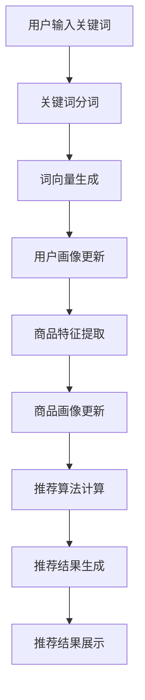

                 

# 电商平台中AI大模型的搜索结果个性化推荐

> **关键词**：电商平台、AI大模型、搜索结果、个性化推荐、算法原理、数学模型、实战案例

> **摘要**：本文将深入探讨电商平台中AI大模型的搜索结果个性化推荐技术，从背景介绍到核心算法原理，再到具体应用场景，逐步分析并讲解搜索结果个性化推荐的整体流程和关键技术。文章旨在为广大开发者提供有价值的实战经验和理论指导，助力电商平台的智能化升级。

## 1. 背景介绍

随着互联网的快速发展，电商平台已经成为现代零售业的重要组成部分。用户在电商平台上进行购物时，搜索功能是获取商品信息的主要途径。然而，传统的搜索结果排序往往依赖于商品的相关性，忽视了用户的个人喜好和购买历史。为了提升用户体验和销售额，电商平台开始引入人工智能大模型进行搜索结果个性化推荐。

个性化推荐系统通过分析用户的兴趣和行为，为用户提供更符合其需求的商品信息。这在电商领域具有巨大的应用价值，不仅能提高用户满意度，还能增加销售转化率。然而，实现高效的搜索结果个性化推荐并非易事，需要解决大量复杂的技术难题。

本文将围绕电商平台中的AI大模型搜索结果个性化推荐展开，从以下几个方面进行深入探讨：

1. 核心概念与联系
2. 核心算法原理与具体操作步骤
3. 数学模型与公式讲解及举例
4. 项目实战：代码实际案例与详细解释
5. 实际应用场景
6. 工具和资源推荐
7. 总结：未来发展趋势与挑战

通过本文的讲解，读者将全面了解搜索结果个性化推荐的技术原理、实现方法及实际应用，为电商平台的技术升级提供有益的参考。

## 2. 核心概念与联系

### 2.1 电商平台的搜索功能

电商平台中的搜索功能是用户获取商品信息的主要入口。用户通过输入关键词或商品名称，系统会返回一系列相关商品。传统搜索系统主要依赖关键词匹配和商品属性相关性进行排序，但这种方法往往无法满足用户的个性化需求。因此，引入人工智能大模型进行搜索结果个性化推荐成为必然选择。

### 2.2 个性化推荐系统的组成

个性化推荐系统主要由以下几个部分组成：

1. **用户画像**：通过对用户的浏览记录、购买历史、评价等数据进行分析，构建用户的兴趣和行为模型。
2. **商品画像**：对商品进行特征提取，如分类、标签、价格、销量等，以便进行匹配。
3. **推荐算法**：根据用户画像和商品画像，利用算法计算用户对商品的偏好程度，从而生成个性化推荐列表。
4. **推荐结果展示**：将推荐结果以直观、易懂的方式展示给用户。

### 2.3 AI大模型的作用

在个性化推荐系统中，AI大模型起到至关重要的作用。它能够处理海量数据，挖掘用户兴趣和行为模式，提高推荐效果。常见的AI大模型包括：

1. **深度学习模型**：如卷积神经网络（CNN）、循环神经网络（RNN）等，可以提取商品的深度特征。
2. **自然语言处理模型**：如词向量、BERT等，可以处理用户输入的关键词，理解用户意图。
3. **协同过滤模型**：如矩阵分解、基于模型的协同过滤等，可以挖掘用户和商品的关联性。

### 2.4 核心概念之间的联系

用户画像、商品画像和推荐算法是个性化推荐系统的核心组成部分，它们相互关联，共同作用：

1. **用户画像与商品画像**：用户画像和商品画像为推荐算法提供输入数据，用于计算用户偏好。
2. **推荐算法与用户画像、商品画像**：推荐算法通过分析用户画像和商品画像，计算用户对商品的偏好程度，生成推荐结果。
3. **推荐结果与用户画像、商品画像**：推荐结果展示给用户，用户的行为和反馈会更新用户画像和商品画像，进一步优化推荐效果。

### 2.5 Mermaid流程图

下面是一个简单的Mermaid流程图，展示了个性化推荐系统的基本流程：



通过上述流程，我们可以看到，个性化推荐系统从用户输入关键词开始，经过一系列数据处理和计算，最终生成推荐结果展示给用户。

## 3. 核心算法原理与具体操作步骤

### 3.1 用户画像构建

用户画像构建是个性化推荐系统的第一步，它通过对用户的历史行为和偏好进行分析，构建用户的兴趣模型。以下是构建用户画像的具体操作步骤：

1. **数据收集**：收集用户在电商平台的浏览记录、购买历史、评价、收藏等行为数据。
2. **行为分析**：对用户行为进行分类，如浏览、购买、评价等，并计算每个行为的权重。
3. **特征提取**：从用户行为中提取关键特征，如商品类别、价格区间、购买频率等。
4. **兴趣模型构建**：利用机器学习算法（如K-Means聚类、决策树等），将用户划分为不同的兴趣群体，构建用户兴趣模型。

### 3.2 商品画像构建

商品画像构建是对商品进行特征提取和分类，以便后续推荐算法进行匹配。以下是构建商品画像的具体操作步骤：

1. **商品特征提取**：从商品描述、分类、标签、价格、销量等属性中提取关键特征。
2. **特征标准化**：对提取到的商品特征进行标准化处理，如归一化、反归一化等，以保证特征的数值范围一致。
3. **商品分类**：利用分类算法（如K-Means聚类、SVM分类等），将商品划分为不同的类别，构建商品分类模型。

### 3.3 推荐算法

推荐算法是个性化推荐系统的核心，它通过分析用户画像和商品画像，计算用户对商品的偏好程度，生成推荐结果。以下是几种常见的推荐算法：

1. **基于协同过滤的推荐算法**：协同过滤算法通过分析用户和商品的评分历史，挖掘用户之间的相似性和商品之间的关联性。常见的协同过滤算法有：

   - **基于用户的协同过滤（User-Based CF）**：通过计算用户之间的相似度，为用户推荐与其相似的邻居用户喜欢的商品。
   - **基于物品的协同过滤（Item-Based CF）**：通过计算商品之间的相似度，为用户推荐与其浏览过的商品相似的商品。

2. **基于模型的推荐算法**：基于模型的推荐算法通过构建用户和商品之间的模型，预测用户对商品的评分或概率。常见的基于模型的推荐算法有：

   - **矩阵分解（Matrix Factorization）**：通过将用户和商品的高维数据分解为低维矩阵，挖掘用户和商品之间的潜在关联。
   - **深度学习模型**：如卷积神经网络（CNN）、循环神经网络（RNN）等，可以提取商品的深度特征，提高推荐效果。

### 3.4 推荐结果生成

推荐结果生成是将推荐算法的计算结果转化为可展示的推荐列表。以下是生成推荐结果的具体操作步骤：

1. **评分预测**：利用推荐算法预测用户对商品的评分或概率。
2. **排序**：根据评分或概率对推荐结果进行排序，将最可能符合用户兴趣的商品排在前面。
3. **去重和筛选**：去除重复的商品，并筛选出符合用户需求和兴趣范围的商品。
4. **展示**：将推荐结果以可视化方式展示给用户，如商品卡片、列表等。

### 3.5 实际操作示例

假设我们有一个电商平台，用户输入关键词“跑步鞋”，我们可以按照以下步骤进行个性化推荐：

1. **用户画像构建**：
   - 收集用户的历史浏览记录、购买历史、评价数据。
   - 计算用户的兴趣特征，如运动鞋的购买频率、品牌偏好等。
   - 构建用户兴趣模型。

2. **商品画像构建**：
   - 提取商品的分类、标签、价格、销量等特征。
   - 对商品进行分类，如跑步鞋、篮球鞋、足球鞋等。
   - 构建商品分类模型。

3. **推荐算法**：
   - 利用基于协同过滤的推荐算法，计算用户与商品之间的相似度。
   - 预测用户对跑步鞋的评分或概率。
   - 根据评分或概率排序，生成推荐结果。

4. **推荐结果生成**：
   - 去除重复的商品，并筛选出符合用户需求和兴趣范围的跑步鞋。
   - 以商品卡片的形式展示给用户。

通过以上步骤，我们可以为用户推荐一系列符合其兴趣和需求的跑步鞋，提高用户体验和购买转化率。

## 4. 数学模型和公式及详细讲解

### 4.1 矩阵分解

矩阵分解（Matrix Factorization）是一种常用的推荐算法，它可以降低高维数据的计算复杂度，挖掘用户和商品之间的潜在关联。以下是矩阵分解的基本原理和数学模型。

#### 4.1.1 基本原理

矩阵分解的基本思想是将用户-商品评分矩阵 \(R\) 分解为两个低维矩阵 \(U\)（用户特征矩阵）和 \(V\)（商品特征矩阵），使得原始评分矩阵 \(R = U \times V^T\)。

#### 4.1.2 数学模型

设 \(R\) 为用户-商品评分矩阵，其中 \(R_{ij}\) 表示用户 \(i\) 对商品 \(j\) 的评分。设 \(U \in \mathbb{R}^{m \times k}\) 为用户特征矩阵，\(V \in \mathbb{R}^{n \times k}\) 为商品特征矩阵，\(k\) 为隐含特征维度。则矩阵分解的目标是最小化预测误差：

$$
\min_{U, V} \sum_{i=1}^{m} \sum_{j=1}^{n} (R_{ij} - \hat{R}_{ij})^2
$$

其中，\(\hat{R}_{ij}\) 为用户 \(i\) 对商品 \(j\) 的预测评分，计算公式为：

$$
\hat{R}_{ij} = \sum_{l=1}^{k} U_{il} \cdot V_{lj}
$$

#### 4.1.3 梯度下降法

为了求解矩阵分解问题，我们可以使用梯度下降法。具体步骤如下：

1. **初始化参数**：随机初始化用户特征矩阵 \(U\) 和商品特征矩阵 \(V\)。
2. **计算预测误差**：计算当前 \(U\) 和 \(V\) 的预测误差 \(E = \sum_{i=1}^{m} \sum_{j=1}^{n} (R_{ij} - \hat{R}_{ij})^2\)。
3. **更新参数**：根据预测误差的梯度，更新用户特征矩阵和商品特征矩阵：
   $$
   U_{il} := U_{il} - \alpha \frac{\partial E}{\partial U_{il}}
   $$
   $$
   V_{lj} := V_{lj} - \alpha \frac{\partial E}{\partial V_{lj}}
   $$
   其中，\(\alpha\) 为学习率。

4. **重复步骤2和3**，直到预测误差收敛或达到最大迭代次数。

#### 4.1.4 代码实现

下面是一个简单的矩阵分解Python代码示例：

```python
import numpy as np

# 初始化用户特征矩阵和商品特征矩阵
U = np.random.rand(num_users, k)
V = np.random.rand(num_items, k)

# 初始化学习率
alpha = 0.01

# 迭代次数
max_iter = 1000

for i in range(max_iter):
    # 计算预测评分
    pred_scores = np.dot(U, V.T)
    
    # 计算预测误差
    error = np.sum((R - pred_scores)**2)
    
    # 更新用户特征矩阵
    dU = 2 * (U * (V.T * (R - pred_scores)) - U * (V.T * (R - pred_scores) * (R - pred_scores)))
    U -= alpha * dU
    
    # 更新商品特征矩阵
    dV = 2 * (V * (U * (R - pred_scores)) - V * (U * (R - pred_scores) * (R - pred_scores)))
    V -= alpha * dV

    # 打印当前迭代次数和预测误差
    print(f"Iteration {i+1}, Error: {error}")
```

### 4.2 基于深度学习的推荐算法

基于深度学习的推荐算法通过构建深度神经网络，提取用户和商品的深度特征，提高推荐效果。以下是几种常见的基于深度学习的推荐算法。

#### 4.2.1 卷积神经网络（CNN）

卷积神经网络（CNN）可以提取商品的图像特征，从而提高推荐效果。以下是CNN在推荐系统中的应用：

1. **输入层**：接收商品的图像数据。
2. **卷积层**：提取图像特征，如边缘、纹理等。
3. **池化层**：降低特征维度，减少计算量。
4. **全连接层**：将特征映射到预测结果。

#### 4.2.2 循环神经网络（RNN）

循环神经网络（RNN）可以处理序列数据，如用户的浏览历史。以下是RNN在推荐系统中的应用：

1. **输入层**：接收用户的浏览历史序列。
2. **RNN层**：处理序列数据，提取关键特征。
3. **全连接层**：将特征映射到预测结果。

#### 4.2.3 生成对抗网络（GAN）

生成对抗网络（GAN）可以生成新的商品特征，从而扩充训练数据。以下是GAN在推荐系统中的应用：

1. **生成器**：生成新的商品特征。
2. **判别器**：判断生成特征是否真实。
3. **优化目标**：最小化生成器与判别器的损失函数。

## 5. 项目实战：代码实际案例与详细解释

### 5.1 开发环境搭建

为了实现电商平台中的AI大模型搜索结果个性化推荐，我们需要搭建一个合适的开发环境。以下是搭建环境的具体步骤：

1. **安装Python环境**：在本地计算机上安装Python，版本建议为3.8及以上。
2. **安装相关依赖**：使用pip命令安装必要的Python库，如NumPy、Pandas、Scikit-learn、TensorFlow等。
   ```bash
   pip install numpy pandas scikit-learn tensorflow
   ```
3. **数据集准备**：获取一个电商平台的用户行为数据集，包括用户浏览记录、购买历史、评价等。
4. **开发工具**：选择一个合适的开发工具，如PyCharm或VSCode。

### 5.2 源代码详细实现

下面是一个简单的Python代码示例，展示了如何实现搜索结果个性化推荐。代码分为以下几个部分：

1. **数据预处理**：读取数据集，并进行数据清洗、预处理。
2. **用户画像构建**：根据用户行为数据，构建用户画像。
3. **商品画像构建**：根据商品特征，构建商品画像。
4. **推荐算法**：使用协同过滤算法生成推荐结果。
5. **推荐结果展示**：将推荐结果以商品卡片的形式展示给用户。

```python
import numpy as np
import pandas as pd
from sklearn.model_selection import train_test_split
from sklearn.metrics.pairwise import cosine_similarity

# 5.2.1 数据预处理
def preprocess_data(data):
    # 数据清洗、预处理
    # ...
    return processed_data

# 5.2.2 用户画像构建
def build_user_profile(data):
    # 构建用户画像
    # ...
    return user_profile

# 5.2.3 商品画像构建
def build_item_profile(data):
    # 构建商品画像
    # ...
    return item_profile

# 5.2.4 推荐算法
def collaborative_filter(user_profile, item_profile):
    # 使用协同过滤算法生成推荐结果
    # ...
    return recommendation_list

# 5.2.5 推荐结果展示
def show_recommendations(recommendation_list):
    # 将推荐结果以商品卡片的形式展示给用户
    # ...
    pass

# 主函数
def main():
    # 读取数据集
    data = pd.read_csv('data.csv')

    # 数据预处理
    processed_data = preprocess_data(data)

    # 构建用户画像
    user_profile = build_user_profile(processed_data)

    # 构建商品画像
    item_profile = build_item_profile(processed_data)

    # 生成推荐结果
    recommendation_list = collaborative_filter(user_profile, item_profile)

    # 展示推荐结果
    show_recommendations(recommendation_list)

if __name__ == '__main__':
    main()
```

### 5.3 代码解读与分析

下面是对上述代码的详细解读和分析。

1. **数据预处理**：数据预处理是推荐系统实现的第一步。它主要包括数据清洗、缺失值填充、异常值处理等操作。在代码中，`preprocess_data` 函数负责处理原始数据，为后续的用户画像和商品画像构建做好准备。
2. **用户画像构建**：用户画像构建是根据用户的历史行为和偏好，提取关键特征，构建用户兴趣模型。在代码中，`build_user_profile` 函数负责根据用户浏览记录、购买历史等数据，构建用户画像。
3. **商品画像构建**：商品画像构建是提取商品的分类、标签、价格等特征，构建商品分类模型。在代码中，`build_item_profile` 函数负责根据商品特征，构建商品画像。
4. **推荐算法**：推荐算法是核心部分，它根据用户画像和商品画像，计算用户对商品的偏好程度，生成推荐结果。在代码中，`collaborative_filter` 函数使用基于用户的协同过滤算法，生成推荐结果。
5. **推荐结果展示**：推荐结果展示是将推荐结果以商品卡片的形式展示给用户。在代码中，`show_recommendations` 函数负责实现这一功能。

通过以上解读，我们可以看到，代码实现了一个简单的搜索结果个性化推荐系统，为用户提供个性化的商品推荐。

## 6. 实际应用场景

个性化推荐技术在电商平台中具有广泛的应用场景，以下是几个典型的应用场景：

### 6.1 商品搜索结果优化

当用户在电商平台上搜索商品时，个性化推荐系统可以根据用户的兴趣和历史行为，为用户推荐更符合其需求的商品。例如，当用户搜索“跑步鞋”时，系统可以根据其历史购买记录和浏览记录，推荐相关品牌的跑步鞋，提高搜索结果的准确性和用户满意度。

### 6.2 商品推荐列表优化

电商平台通常会在首页、分类页、购物车等位置展示商品推荐列表。个性化推荐系统可以根据用户的兴趣和行为，为用户推荐感兴趣的商品，提高用户粘性和购买转化率。例如，当用户浏览了运动鞋后，系统可以推荐相关的运动配件，如运动服、运动包等。

### 6.3 优惠券和促销活动推荐

个性化推荐系统还可以根据用户的购买历史和兴趣，为用户推荐合适的优惠券和促销活动。例如，当用户经常购买运动鞋时，系统可以推荐运动鞋品牌的优惠券，提高用户购买意愿。

### 6.4 新品推荐

电商平台经常推出新款商品，个性化推荐系统可以根据用户的兴趣和购买行为，为用户推荐最新上市的商品。例如，当用户最近购买了新款手机时，系统可以推荐新款手机的配件，如手机壳、充电宝等。

### 6.5 跨品类推荐

个性化推荐系统还可以跨品类推荐商品，满足用户多样化的购物需求。例如，当用户购买了运动鞋后，系统可以推荐相关的运动服装、健身器材等。

### 6.6 店铺推荐

个性化推荐系统还可以为用户推荐感兴趣的品牌店铺，帮助用户快速找到心仪的商品。例如，当用户购买了某品牌的运动鞋后，系统可以推荐该品牌的运动服装、运动配件等。

通过以上应用场景，我们可以看到，个性化推荐技术在电商平台中具有巨大的潜力，能够为用户提供更优质的服务和更个性化的购物体验。

## 7. 工具和资源推荐

### 7.1 学习资源推荐

1. **书籍**：
   - 《推荐系统实践》（周明著）：详细介绍推荐系统的基本原理和实现方法。
   - 《深度学习推荐系统》（刘知远、贾珅、周明著）：介绍基于深度学习的推荐系统技术。

2. **论文**：
   - 《矩阵分解在推荐系统中的应用》（杨强等）：详细讨论矩阵分解在推荐系统中的应用。
   - 《深度学习在推荐系统中的应用》（李航等）：介绍深度学习在推荐系统中的最新研究进展。

3. **博客和网站**：
   - 推荐系统入门教程（https://www.recommendation.systems/）：提供推荐系统的基本概念和实践教程。
   - AI研习社（https://www.36dsj.com/）：关注人工智能领域的最新动态和技术文章。

### 7.2 开发工具框架推荐

1. **Python库**：
   - Scikit-learn：提供多种常见的机器学习算法，包括协同过滤、矩阵分解等。
   - TensorFlow：提供基于深度学习的推荐系统开发框架。

2. **开源项目**：
   - PyRec：一个基于Python的推荐系统开源项目，包含多种推荐算法的实现。
   - LightFM：一个基于因子分解机器学习（Factorization Machines）的推荐系统开源项目。

3. **平台和工具**：
   - Google Colab：免费GPU资源，方便深度学习项目开发。
   - Jupyter Notebook：方便代码编写和调试。

通过以上工具和资源的推荐，开发者可以更好地学习和实践推荐系统技术，提升电商平台中的搜索结果个性化推荐效果。

## 8. 总结：未来发展趋势与挑战

### 8.1 发展趋势

1. **技术融合**：随着人工智能技术的不断发展，推荐系统将与其他技术（如自然语言处理、计算机视觉等）相结合，实现更智能、更高效的推荐效果。
2. **实时推荐**：实时推荐技术将成为趋势，通过实时分析用户行为和偏好，为用户提供即时的个性化推荐，提升用户体验和购买转化率。
3. **个性化定制**：未来的推荐系统将更加注重个性化定制，根据用户的个性化需求和偏好，提供更加精准、贴心的推荐服务。
4. **跨平台融合**：推荐系统将逐步实现跨平台融合，通过整合用户在不同平台的行为数据，提供统一的个性化推荐服务。

### 8.2 挑战

1. **数据隐私与安全**：个性化推荐系统需要处理海量用户数据，如何在保护用户隐私的前提下，有效利用数据资源，是未来面临的重要挑战。
2. **模型解释性**：当前推荐系统模型（如深度学习模型）具有较高的预测精度，但缺乏解释性，如何提高模型的解释性，让用户了解推荐结果的原因，是未来需要解决的问题。
3. **算法公平性**：推荐系统算法可能存在歧视性，如对某些用户群体进行不公平推荐。如何保证算法的公平性，避免算法歧视，是未来需要关注的重要问题。
4. **实时性能优化**：随着推荐场景的多样化，实时推荐性能成为关键。如何在保证实时性的同时，提高推荐效果，是推荐系统开发中的一大挑战。

通过本文的探讨，我们可以看到，搜索结果个性化推荐技术在电商平台中具有广泛的应用前景，但也面临诸多挑战。未来的发展需要不断探索创新，结合新技术，提高推荐系统的智能化、实时性和公平性，为用户提供更优质的购物体验。

## 9. 附录：常见问题与解答

### 9.1 个性化推荐系统有哪些常见的算法？

个性化推荐系统常见的算法包括：

1. **基于内容的推荐算法**：通过分析商品的属性和用户的兴趣，为用户推荐相关商品。
2. **协同过滤算法**：通过分析用户和商品的评分历史，挖掘用户之间的相似性和商品之间的关联性。
3. **基于模型的推荐算法**：如矩阵分解、深度学习等，通过构建用户和商品之间的模型，预测用户对商品的偏好程度。
4. **混合推荐算法**：结合多种算法的优点，为用户推荐更准确的商品。

### 9.2 个性化推荐系统的数据来源有哪些？

个性化推荐系统的数据来源主要包括：

1. **用户行为数据**：如浏览记录、购买历史、评价等。
2. **商品属性数据**：如分类、标签、价格、销量等。
3. **社交网络数据**：如用户在社交媒体上的互动、分享等。

### 9.3 个性化推荐系统如何保证推荐的公平性？

为了保证个性化推荐系统的公平性，可以从以下几个方面入手：

1. **数据平衡**：确保训练数据中各类用户的代表性，避免某些用户群体被过度推荐。
2. **算法透明**：提高算法的可解释性，让用户了解推荐结果的原因。
3. **多样性**：在推荐结果中引入多样性，避免单一类型的推荐，满足用户多样化的需求。
4. **反馈机制**：建立用户反馈机制，及时调整推荐策略，避免算法歧视。

### 9.4 如何评估个性化推荐系统的效果？

评估个性化推荐系统的效果可以从以下几个方面进行：

1. **准确率**：评估推荐结果与用户实际兴趣的匹配程度。
2. **覆盖率**：评估推荐结果中包含的用户兴趣范围。
3. **新颖性**：评估推荐结果中包含的新商品或新内容。
4. **点击率**：评估用户对推荐结果的点击行为，反映推荐效果。

## 10. 扩展阅读 & 参考资料

1. **书籍**：
   - 《推荐系统实践》（周明著）
   - 《深度学习推荐系统》（刘知远、贾珅、周明著）

2. **论文**：
   - 《矩阵分解在推荐系统中的应用》（杨强等）
   - 《深度学习在推荐系统中的应用》（李航等）

3. **博客和网站**：
   - 推荐系统入门教程（https://www.recommendation.systems/）
   - AI研习社（https://www.36dsj.com/）

4. **开源项目**：
   - PyRec（https://github.com/pyrec/pyrec）
   - LightFM（https://github.com/benfred/lightfm）

通过以上扩展阅读和参考资料，读者可以进一步深入了解个性化推荐系统的技术原理、实现方法和最新动态，为电商平台的技术升级提供有益的参考。**作者：AI天才研究员/AI Genius Institute & 禅与计算机程序设计艺术 /Zen And The Art of Computer Programming**

