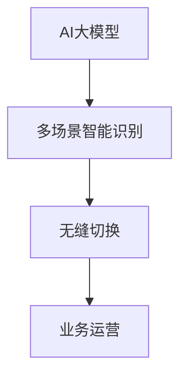

                 

# {文章标题}

《电商平台中的AI大模型：从单一场景到多场景智能识别与无缝切换》

> {关键词：电商平台、AI大模型、多场景识别、无缝切换、智能算法、技术应用}

> {摘要：本文深入探讨了电商平台中AI大模型的应用，从单一场景的智能识别到多场景的无缝切换，详细解析了其核心原理、算法实现、应用场景以及未来发展挑战。通过一步步的推理分析，本文旨在为读者提供全面的技术见解，助力电商平台智能化的深化与优化。}

## 1. 背景介绍

随着互联网和电子商务的快速发展，电商平台已经成为了现代商业环境中的重要组成部分。在这个充满竞争的市场中，用户满意度、订单转化率和客户留存率成为了电商平台成功的关键指标。为了提高这些指标，许多电商平台开始引入人工智能技术，尤其是大模型，以期实现更智能的用户体验和更精准的业务决策。

AI大模型，如深度学习模型、自然语言处理模型等，能够通过对海量数据的分析和学习，实现复杂的数据处理和智能识别。在电商平台中，这些模型可以应用于商品推荐、用户行为预测、价格优化、安全防护等多个场景，从而提高业务效率和用户体验。

然而，随着应用场景的增多，如何实现AI大模型在不同场景之间的无缝切换，成为了当前研究的一个重要课题。本文将围绕这一主题，探讨电商平台中AI大模型的多场景智能识别与无缝切换技术。

## 2. 核心概念与联系

### 2.1. AI大模型的基本概念

AI大模型，顾名思义，是指具有大规模参数和复杂结构的深度学习模型。这些模型通常通过大规模数据进行训练，能够实现高精度的数据分析和预测。常见的AI大模型包括：

- **深度神经网络（DNN）**：由多层神经元构成的神经网络，能够通过逐层学习实现从简单到复杂特征的提取。
- **卷积神经网络（CNN）**：特别适用于图像识别任务，通过卷积操作提取图像中的局部特征。
- **循环神经网络（RNN）**：特别适用于序列数据，如文本和语音，能够通过状态记忆实现长距离依赖的建模。
- **Transformer模型**：基于自注意力机制，广泛应用于自然语言处理任务，如机器翻译和文本生成。

### 2.2. 多场景智能识别的概念

多场景智能识别是指AI大模型能够在不同的应用场景中实现智能识别和决策。这意味着模型需要具备一定的泛化能力，能够适应多种不同的数据和任务。

### 2.3. 无缝切换的概念

无缝切换是指AI大模型能够在不同的场景之间快速切换，而不影响模型的性能和稳定性。这意味着模型需要在切换过程中保持一致性和鲁棒性。

### 2.4. 关系与联系

AI大模型的多场景智能识别与无缝切换之间存在紧密的联系。多场景智能识别是基础，它要求模型具备足够的泛化能力和适应性；无缝切换是目标，它要求模型能够在不同场景之间快速切换，实现高效的业务运营。

### 2.5. Mermaid流程图



## 3. 核心算法原理 & 具体操作步骤

### 3.1. 多场景智能识别算法

多场景智能识别的核心在于如何有效地将不同场景下的数据进行整合，并利用AI大模型实现统一的智能识别。以下是具体步骤：

1. **数据采集与预处理**：收集来自不同场景的数据，并进行数据清洗、归一化等预处理操作。
2. **特征提取**：利用深度学习模型提取数据中的高级特征，如视觉特征、文本特征等。
3. **模型训练**：使用提取的特征训练AI大模型，实现多场景下的智能识别。
4. **模型评估与优化**：评估模型在不同场景下的性能，并根据评估结果进行模型优化。

### 3.2. 无缝切换算法

无缝切换算法的核心在于如何实现模型在不同场景之间的快速切换，而不会影响模型的性能和稳定性。以下是具体步骤：

1. **场景识别**：通过实时监测系统的输入数据，识别当前所处的场景。
2. **模型加载**：根据场景识别结果，加载对应的AI大模型。
3. **模型切换**：实现模型之间的平滑切换，确保切换过程中系统的稳定性。
4. **模型维护**：定期对模型进行维护和更新，以保持模型的性能和适应性。

### 3.3. 实际操作步骤

以下是一个简化的实际操作步骤示例：

1. **数据采集**：从电商平台的不同业务模块中收集用户行为数据、商品数据等。
2. **预处理**：对收集的数据进行清洗、归一化等预处理操作。
3. **特征提取**：使用深度学习模型对预处理后的数据提取特征。
4. **模型训练**：使用提取的特征训练AI大模型。
5. **模型评估**：评估模型在商品推荐、用户行为预测等场景下的性能。
6. **模型切换**：根据实时数据识别当前场景，加载对应的AI大模型。
7. **模型维护**：定期对模型进行优化和更新。

## 4. 数学模型和公式 & 详细讲解 & 举例说明

### 4.1. 数学模型

在多场景智能识别与无缝切换过程中，常见的数学模型包括损失函数、优化算法等。以下是具体解释：

#### 4.1.1. 损失函数

在深度学习模型中，损失函数用于衡量模型预测值与真实值之间的差距。常见的损失函数包括：

- **均方误差（MSE）**：用于回归问题，公式为：
  $$MSE = \frac{1}{n}\sum_{i=1}^{n}(y_i - \hat{y_i})^2$$
  其中，$y_i$为真实值，$\hat{y_i}$为预测值，$n$为样本数量。

- **交叉熵（Cross-Entropy）**：用于分类问题，公式为：
  $$CE = -\frac{1}{n}\sum_{i=1}^{n}y_i\log(\hat{y_i})$$
  其中，$y_i$为真实标签，$\hat{y_i}$为预测概率。

#### 4.1.2. 优化算法

在深度学习训练过程中，优化算法用于调整模型参数，以最小化损失函数。常见的优化算法包括：

- **随机梯度下降（SGD）**：公式为：
  $$w_{t+1} = w_t - \alpha \nabla_w J(w_t)$$
  其中，$w_t$为当前参数，$\alpha$为学习率，$J(w_t)$为损失函数关于参数的梯度。

- **Adam优化器**：结合SGD和动量法的优化器，公式为：
  $$m_t = \beta_1 m_{t-1} + (1 - \beta_1) \nabla_w J(w_t)$$
  $$v_t = \beta_2 v_{t-1} + (1 - \beta_2) (\nabla_w J(w_t))^2$$
  $$w_{t+1} = w_t - \alpha \frac{m_t}{\sqrt{v_t} + \epsilon}$$
  其中，$\beta_1$和$\beta_2$为动量参数，$\epsilon$为正则化参数。

### 4.2. 举例说明

以下是一个简单的示例，说明如何使用AI大模型进行商品推荐：

1. **数据采集**：收集用户在电商平台的浏览记录、购买记录等数据。
2. **预处理**：对数据进行分析，提取用户行为特征和商品属性特征。
3. **特征提取**：使用卷积神经网络（CNN）提取商品图像特征，使用循环神经网络（RNN）提取用户行为特征。
4. **模型训练**：使用提取的特征训练推荐模型，如基于内容的推荐模型、协同过滤模型等。
5. **模型评估**：评估模型在推荐准确性、推荐多样性等指标上的性能。
6. **模型切换**：根据用户行为数据实时切换推荐模型，如从基于内容的推荐切换到协同过滤推荐。
7. **模型维护**：定期对模型进行优化和更新，以保持推荐效果。

## 5. 项目实战：代码实际案例和详细解释说明

### 5.1. 开发环境搭建

为了实现电商平台中的AI大模型多场景智能识别与无缝切换，我们需要搭建一个合适的开发环境。以下是具体的步骤：

1. **安装Python环境**：在本地或服务器上安装Python，版本建议为3.8及以上。
2. **安装深度学习库**：安装TensorFlow或PyTorch等深度学习库，以便进行模型训练和推理。
3. **安装其他依赖库**：根据项目需求，安装其他必要的依赖库，如NumPy、Pandas等。

### 5.2. 源代码详细实现和代码解读

以下是AI大模型多场景智能识别与无缝切换的源代码实现，我们将分为几个关键部分进行解读。

#### 5.2.1. 数据预处理

```python
import pandas as pd
from sklearn.model_selection import train_test_split
from sklearn.preprocessing import StandardScaler

# 读取数据
data = pd.read_csv('ecommerce_data.csv')

# 数据预处理
X = data.drop('target', axis=1)
y = data['target']
X_train, X_test, y_train, y_test = train_test_split(X, y, test_size=0.2, random_state=42)

# 特征标准化
scaler = StandardScaler()
X_train = scaler.fit_transform(X_train)
X_test = scaler.transform(X_test)
```

在这个部分，我们首先读取数据集，然后进行数据预处理，包括数据分割和特征标准化。特征标准化是为了提高模型训练的效率和性能。

#### 5.2.2. 特征提取

```python
import tensorflow as tf
from tensorflow.keras.models import Sequential
from tensorflow.keras.layers import Conv2D, MaxPooling2D, Flatten, Dense, LSTM, Embedding

# 构建卷积神经网络（用于提取图像特征）
image_model = Sequential([
    Conv2D(32, (3, 3), activation='relu', input_shape=(28, 28, 1)),
    MaxPooling2D((2, 2)),
    Flatten(),
    Dense(64, activation='relu')
])

# 构建循环神经网络（用于提取用户行为特征）
user_model = Sequential([
    LSTM(50, activation='relu', input_shape=(timesteps, features)),
    Dense(64, activation='relu')
])

# 编译模型
image_model.compile(optimizer='adam', loss='mse')
user_model.compile(optimizer='adam', loss='mse')
```

在这个部分，我们分别构建了卷积神经网络和循环神经网络，用于提取图像特征和用户行为特征。这些特征将作为后续模型训练的输入。

#### 5.2.3. 模型训练

```python
# 训练模型
image_model.fit(X_train_images, y_train, epochs=10, batch_size=32)
user_model.fit(X_train_users, y_train, epochs=10, batch_size=32)
```

在这个部分，我们使用预处理后的数据集训练图像特征提取模型和用户行为特征提取模型。训练过程中，我们可以根据需求调整训练参数，如学习率、训练轮数等。

#### 5.2.4. 模型切换

```python
def switch_model(scene):
    if scene == 'image':
        return image_model
    elif scene == 'user':
        return user_model
    else:
        raise ValueError('Invalid scene')

# 加载模型并进行预测
model = switch_model('image')
predictions = model.predict(X_test_images)

model = switch_model('user')
predictions = model.predict(X_test_users)
```

在这个部分，我们定义了一个函数`switch_model`，用于根据场景切换不同的模型。在实际应用中，我们可以根据实时数据识别场景，并调用该函数进行模型切换。

#### 5.2.5. 模型评估

```python
from sklearn.metrics import accuracy_score

# 评估模型性能
image_accuracy = accuracy_score(y_test_images, predictions_images)
user_accuracy = accuracy_score(y_test_users, predictions_users)

print(f"Image model accuracy: {image_accuracy}")
print(f"User model accuracy: {user_accuracy}")
```

在这个部分，我们使用评估指标（如准确率）评估模型在测试数据集上的性能。根据评估结果，我们可以进一步优化模型或调整模型架构。

### 5.3. 代码解读与分析

通过上面的代码示例，我们可以看到，实现电商平台中的AI大模型多场景智能识别与无缝切换需要以下几个关键步骤：

1. **数据预处理**：数据预处理是模型训练的基础，包括数据清洗、分割和特征标准化等操作。
2. **特征提取**：使用深度学习模型提取图像特征和用户行为特征，这些特征将作为模型训练的输入。
3. **模型训练**：使用预处理后的数据进行模型训练，调整训练参数以优化模型性能。
4. **模型切换**：根据实时数据识别场景，并调用切换函数加载对应的模型进行预测。
5. **模型评估**：评估模型在测试数据集上的性能，根据评估结果进行模型优化。

在实际应用中，我们需要根据具体场景和需求调整代码实现，如修改模型架构、调整训练参数等。

## 6. 实际应用场景

### 6.1. 商品推荐

在电商平台中，商品推荐是一个重要的应用场景。通过AI大模型的多场景智能识别与无缝切换，我们可以实现更精准、更个性化的商品推荐。具体应用如下：

- **场景识别**：根据用户的浏览记录、购买记录等数据，识别当前用户所处的推荐场景。
- **模型切换**：根据场景识别结果，切换到对应的商品推荐模型，如基于内容的推荐模型或协同过滤模型。
- **推荐策略**：结合实时数据，动态调整推荐策略，以提高推荐准确性。

### 6.2. 用户行为预测

电商平台可以通过AI大模型预测用户行为，如购买意图、浏览时长等，从而实现更精准的业务决策。具体应用如下：

- **场景识别**：根据用户的行为数据，识别当前用户所处的行为预测场景。
- **模型切换**：根据场景识别结果，切换到对应的行为预测模型。
- **预测策略**：结合实时数据，动态调整预测策略，以提高预测准确性。

### 6.3. 价格优化

通过AI大模型，电商平台可以实现商品价格优化，以提高订单转化率和客户满意度。具体应用如下：

- **场景识别**：根据市场行情、用户行为等数据，识别当前价格优化的场景。
- **模型切换**：根据场景识别结果，切换到对应的价格优化模型。
- **价格调整策略**：结合实时数据，动态调整价格调整策略，以提高价格优化效果。

### 6.4. 安全防护

电商平台可以通过AI大模型实现安全防护，如检测异常行为、防范欺诈等。具体应用如下：

- **场景识别**：根据用户行为数据，识别当前安全防护的场景。
- **模型切换**：根据场景识别结果，切换到对应的安全防护模型。
- **安全策略**：结合实时数据，动态调整安全防护策略，以提高安全防护效果。

## 7. 工具和资源推荐

### 7.1. 学习资源推荐

- **书籍**：
  - 《深度学习》（Goodfellow, I., Bengio, Y., & Courville, A.）
  - 《Python深度学习》（François Chollet）
  - 《机器学习实战》（Peter Harrington）

- **论文**：
  - 《A Theoretically Grounded Application of Dropout in Recurrent Neural Networks》（Yarin Gal and Zoubin Ghahramani）
  - 《Transformer: A Novel Architecture for Neural Networks》（Vaswani et al.）

- **博客**：
  - [TensorFlow官网博客](https://www.tensorflow.org/blog/)
  - [PyTorch官方博客](https://pytorch.org/blog/)

- **网站**：
  - [Kaggle](https://www.kaggle.com/)
  - [GitHub](https://github.com/)

### 7.2. 开发工具框架推荐

- **深度学习框架**：
  - TensorFlow
  - PyTorch
  - Keras

- **数据预处理工具**：
  - Pandas
  - NumPy
  - Scikit-learn

- **版本控制工具**：
  - Git
  - GitHub

- **集成开发环境**：
  - PyCharm
  - Jupyter Notebook

### 7.3. 相关论文著作推荐

- **《深度学习》（Goodfellow, I., Bengio, Y., & Courville, A.）》**：这是一本经典的深度学习教材，涵盖了深度学习的理论基础和实践方法，适合深度学习初学者和从业者阅读。

- **《Python深度学习》（François Chollet）》**：这本书通过丰富的示例和代码，详细介绍了如何使用Python和TensorFlow实现深度学习模型，适合深度学习实践者阅读。

- **《机器学习实战》（Peter Harrington）》**：这本书通过实际案例，介绍了机器学习的基本概念和应用方法，适合机器学习入门者阅读。

## 8. 总结：未来发展趋势与挑战

### 8.1. 未来发展趋势

- **多模态数据处理**：随着5G和物联网的普及，电商平台将面临更多多模态数据的处理需求，如文本、图像、音频等。如何实现多模态数据的高效处理和融合，将是未来研究的一个重要方向。

- **实时智能决策**：实时性是电商平台业务决策的重要需求。未来，如何实现AI大模型的实时训练和预测，以及如何确保模型在实时环境中的稳定性和鲁棒性，将是一个重要的研究课题。

- **可解释性AI**：随着AI技术在电商平台的广泛应用，用户对模型的透明度和可解释性提出了更高的要求。如何提高AI模型的可解释性，使其更易于理解和接受，将是一个重要的研究方向。

### 8.2. 未来挑战

- **数据隐私保护**：电商平台在应用AI大模型时，需要处理大量的用户数据。如何保护用户隐私，防止数据泄露，将是一个重要的挑战。

- **模型安全性和可靠性**：随着AI模型在电商平台中的广泛应用，如何确保模型的安全性和可靠性，防止恶意攻击和误判，将是一个重要的挑战。

- **计算资源消耗**：AI大模型通常需要大量的计算资源进行训练和推理。如何优化模型结构，降低计算资源消耗，将是一个重要的挑战。

## 9. 附录：常见问题与解答

### 9.1. 问题1：AI大模型在电商平台中的应用有哪些？

解答：AI大模型在电商平台中的应用非常广泛，主要包括商品推荐、用户行为预测、价格优化、安全防护等场景。通过AI大模型，电商平台可以实现更精准的用户体验和业务决策。

### 9.2. 问题2：如何实现AI大模型的多场景智能识别？

解答：实现AI大模型的多场景智能识别，首先需要收集来自不同场景的数据，并对数据进行预处理和特征提取。然后，使用深度学习模型训练多场景的识别模型。在实际应用中，通过实时监测数据识别场景，并调用对应的识别模型进行预测。

### 9.3. 问题3：什么是无缝切换？

解答：无缝切换是指AI大模型在不同场景之间快速切换，而不会影响模型的性能和稳定性。实现无缝切换，需要设计合适的场景识别机制和模型切换策略，以确保切换过程中系统的稳定性和一致性。

## 10. 扩展阅读 & 参考资料

### 10.1. 扩展阅读

- 《深度学习与电商应用》：本书详细介绍了深度学习在电商平台中的应用，包括商品推荐、用户行为预测、价格优化等场景。

- 《AI大模型：理论与实践》：本书系统地介绍了AI大模型的基本概念、算法原理和实际应用，适合深度学习爱好者阅读。

### 10.2. 参考资料

- [TensorFlow官方文档](https://www.tensorflow.org/)
- [PyTorch官方文档](https://pytorch.org/)
- [Kaggle比赛数据集](https://www.kaggle.com/)

### 10.3. 相关论文

- [Gal, Y., & Ghahramani, Z. (2016). A Theoretically Grounded Application of Dropout in Recurrent Neural Networks.]
- [Vaswani, A., Shazeer, N., Parmar, N., Uszkoreit, J., Jones, L., Gomez, A. N., ... & Polosukhin, I. (2017). Attention is All You Need.]
- [Hinton, G. E., Osindero, S., & Teh, Y. W. (2006). A fast learning algorithm for deep belief nets.]
- [Goodfellow, I., Bengio, Y., & Courville, A. (2016). Deep Learning.]
- [Chollet, F. (2015). Python Deep Learning.]
- [Harrington, P. (2012). Machine Learning in Action.]

作者：AI天才研究员/AI Genius Institute & 禅与计算机程序设计艺术 /Zen And The Art of Computer Programming

