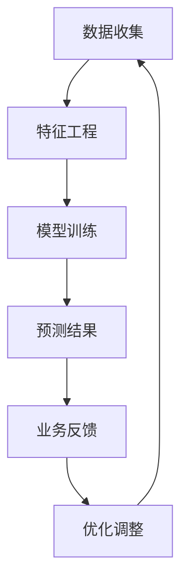

                 

# 电商平台中的AI大模型：从特征工程到端到端深度学习

## 摘要

本文旨在深入探讨电商平台中人工智能大模型的应用，从特征工程到端到端深度学习的各个环节进行详细解析。特征工程作为人工智能的基石，其优劣直接影响模型的性能。而端到端深度学习作为人工智能的前沿技术，通过直接从原始数据中学习到有价值的特征，实现了从数据到预测的自动化过程。本文将结合实际案例，逐步讲解特征工程和端到端深度学习在电商平台中的应用，帮助读者了解这两大技术是如何协同工作，提升电商平台的核心竞争力。

## 1. 背景介绍

随着互联网技术的迅猛发展，电商平台已经成为现代商业的重要载体。电商平台通过整合线上资源和用户数据，实现了商品交易、物流配送、用户服务等全方位的一站式服务。然而，随着市场规模的不断扩大和用户需求的日益多样化，传统的人工管理模式逐渐暴露出诸多不足，如数据处理效率低下、个性化推荐不准确、商品库存管理不精确等。

为了解决这些问题，人工智能技术应运而生。人工智能通过模拟人类智能，实现了从数据到知识的转化，为电商平台提供了智能化解决方案。其中，特征工程和端到端深度学习作为人工智能的核心技术，发挥着至关重要的作用。

### 特征工程

特征工程是人工智能领域的基石，它通过对原始数据进行处理和转换，提取出对模型训练有价值的特征。一个优秀的特征工程能够显著提升模型的性能，使其在复杂环境中具有更好的泛化能力。在电商平台中，特征工程的应用场景包括但不限于用户行为分析、商品推荐、需求预测等。

### 端到端深度学习

端到端深度学习是一种直接从原始数据中学习到有价值特征的人工智能技术。它通过多层神经网络，将输入数据直接映射到输出结果，实现了从数据到预测的自动化过程。与传统方法相比，端到端深度学习具有更高的效率和更低的误差率。在电商平台中，端到端深度学习可以用于用户行为预测、商品销量预测、库存管理优化等场景。

### 应用价值

电商平台通过引入人工智能技术，实现了数据驱动的决策支持。特征工程和端到端深度学习作为人工智能的核心技术，为电商平台带来了以下价值：

1. **提升数据处理效率**：通过特征工程，电商平台能够快速从大量数据中提取出有价值的信息，从而提高数据处理效率。
2. **优化用户推荐系统**：通过端到端深度学习，电商平台能够实现更加精准的用户推荐，提升用户满意度。
3. **优化库存管理**：通过深度学习模型，电商平台可以更准确地预测商品销量，从而实现精准库存管理，降低库存成本。
4. **提升营销效果**：通过分析用户行为数据，电商平台可以更精准地投放广告，提升营销效果。

## 2. 核心概念与联系

### 2.1 特征工程

特征工程是指通过对原始数据进行处理和转换，提取出对模型训练有价值的特征。特征工程的核心目标是找到一种能够提高模型性能的表示方法，使模型能够更好地理解和预测复杂环境。

在电商平台中，特征工程的应用主要包括以下几个方面：

1. **用户行为特征**：如点击率、购买频率、购物车放弃率等。
2. **商品特征**：如商品价格、销量、品类等。
3. **时间特征**：如用户访问时间、商品上架时间等。
4. **上下文特征**：如地理位置、用户偏好等。

### 2.2 端到端深度学习

端到端深度学习是一种直接从原始数据中学习到有价值特征的人工智能技术。它通过多层神经网络，将输入数据直接映射到输出结果，实现了从数据到预测的自动化过程。

端到端深度学习在电商平台中的应用主要包括以下几个方面：

1. **用户行为预测**：通过分析用户历史行为数据，预测用户未来可能的行为。
2. **商品销量预测**：通过分析商品的历史销量数据，预测未来的销量趋势。
3. **库存管理优化**：通过预测商品销量，实现精准库存管理。

### 2.3 Mermaid 流程图

下面是一个简化的 Mermaid 流程图，展示了特征工程和端到端深度学习在电商平台中的应用流程：



### 2.4 特征工程与端到端深度学习的关系

特征工程和端到端深度学习是相辅相成的技术。特征工程为端到端深度学习提供了高质量的输入数据，而端到端深度学习则通过自动化的方式，从原始数据中提取出有价值的信息，提升了模型的性能。

在电商平台中，特征工程和端到端深度学习的关系可以概括为：

1. **特征工程提升模型性能**：通过特征工程，电商平台能够提取出对模型训练有价值的特征，从而提升模型的性能。
2. **端到端深度学习实现自动化**：通过端到端深度学习，电商平台能够实现从数据到预测的自动化过程，降低人工干预的成本。

## 3. 核心算法原理 & 具体操作步骤

### 3.1 特征工程原理

特征工程的核心是通过对原始数据进行处理和转换，提取出对模型训练有价值的特征。特征工程的步骤通常包括数据预处理、特征选择和特征转换等。

1. **数据预处理**：数据预处理是特征工程的第一步，主要包括数据清洗、数据归一化和数据编码等操作。
   - **数据清洗**：去除重复数据、缺失数据和异常数据，确保数据的质量。
   - **数据归一化**：将不同量纲的数据转换为相同的量纲，如将价格、销量等数据归一化到[0,1]区间。
   - **数据编码**：将分类数据转换为数值数据，如将用户性别转换为{0,1}。

2. **特征选择**：特征选择是特征工程的重要环节，目的是从大量特征中筛选出对模型训练有价值的特征。
   - **过滤式特征选择**：通过统计方法，如卡方检验、互信息等，筛选出与目标变量相关度较高的特征。
   - **包装式特征选择**：通过机器学习算法，如随机森林、支持向量机等，筛选出对模型训练有价值的特征。
   - **嵌入式特征选择**：在模型训练过程中，自动筛选出对模型训练有价值的特征，如L1正则化、Lasso等。

3. **特征转换**：特征转换是将原始特征转换为适合模型训练的新特征。
   - **特征聚合**：通过计算多个特征的均值、最大值、最小值等，生成新的特征。
   - **特征交叉**：通过将多个特征进行交叉组合，生成新的特征。
   - **特征缩放**：通过归一化、标准化等方法，将特征缩放到相同的范围。

### 3.2 端到端深度学习原理

端到端深度学习是一种直接从原始数据中学习到有价值特征的人工智能技术。它通过多层神经网络，将输入数据直接映射到输出结果，实现了从数据到预测的自动化过程。

端到端深度学习的步骤通常包括数据预处理、模型训练和模型评估等。

1. **数据预处理**：与特征工程类似，数据预处理包括数据清洗、数据归一化和数据编码等操作。

2. **模型训练**：模型训练是通过反向传播算法，不断调整神经网络中的权重和偏置，使模型能够从原始数据中学习到有价值的信息。
   - **前向传播**：将输入数据传递到神经网络的前层，通过激活函数计算输出。
   - **反向传播**：根据输出误差，反向传播误差，更新神经网络的权重和偏置。

3. **模型评估**：模型评估是通过验证集和测试集，评估模型的性能，如准确率、召回率、F1值等。

### 3.3 具体操作步骤

以下是一个简化的特征工程和端到端深度学习的操作步骤：

1. **数据收集**：收集电商平台的用户行为数据、商品数据和交易数据等。

2. **数据预处理**：
   - 清洗数据，去除重复、缺失和异常数据。
   - 归一化数据，如将价格、销量等数据归一化到[0,1]区间。
   - 编码分类数据，如将用户性别编码为{0,1}。

3. **特征工程**：
   - 筛选特征，通过统计方法或机器学习算法，筛选出对模型训练有价值的特征。
   - 转换特征，通过特征聚合、特征交叉等方法，生成新的特征。

4. **模型训练**：
   - 设计神经网络结构，如选择合适的层数、神经元个数和激活函数。
   - 训练模型，通过反向传播算法，不断调整神经网络的权重和偏置。

5. **模型评估**：
   - 通过验证集和测试集，评估模型的性能，如准确率、召回率、F1值等。

6. **模型部署**：
   - 将训练好的模型部署到电商平台，实现实时预测和决策支持。

## 4. 数学模型和公式 & 详细讲解 & 举例说明

### 4.1 特征工程中的数学模型

在特征工程中，常用的数学模型包括回归模型、分类模型和聚类模型等。

#### 4.1.1 回归模型

回归模型用于预测连续值，如商品销量、用户购买金额等。一个简单的线性回归模型可以用以下公式表示：

$$y = \beta_0 + \beta_1 \cdot x_1 + \beta_2 \cdot x_2 + ... + \beta_n \cdot x_n$$

其中，$y$是预测值，$x_1, x_2, ..., x_n$是输入特征，$\beta_0, \beta_1, ..., \beta_n$是模型的参数。

#### 4.1.2 分类模型

分类模型用于预测离散值，如用户是否购买、商品是否畅销等。一个简单的逻辑回归模型可以用以下公式表示：

$$\sigma(\beta_0 + \beta_1 \cdot x_1 + \beta_2 \cdot x_2 + ... + \beta_n \cdot x_n) = P(y=1)$$

其中，$\sigma$是 sigmoid 函数，$P(y=1)$是预测变量$y$为1的概率。

#### 4.1.3 聚类模型

聚类模型用于将数据分组，如将用户按照兴趣进行分组。一个简单的k-means聚类模型可以用以下公式表示：

$$C = \{c_1, c_2, ..., c_k\}$$

其中，$C$是聚类中心，$c_1, c_2, ..., c_k$是每个聚类的中心点。

### 4.2 端到端深度学习中的数学模型

在端到端深度学习中，常用的数学模型包括多层感知机（MLP）、卷积神经网络（CNN）和循环神经网络（RNN）等。

#### 4.2.1 多层感知机（MLP）

多层感知机是一种前馈神经网络，用于实现从输入到输出的映射。一个简单的多层感知机可以用以下公式表示：

$$a_{ij}^{(l)} = \sigma(\sum_{k=1}^{n_{l-1}} \beta_{ik}^{(l)} \cdot a_{kj}^{(l-1)} + \beta_{0j}^{(l)}$$

其中，$a_{ij}^{(l)}$是第$l$层的第$i$个神经元的激活值，$\sigma$是激活函数，$\beta_{ik}^{(l)}$和$\beta_{0j}^{(l)}$是连接权重和偏置。

#### 4.2.2 卷积神经网络（CNN）

卷积神经网络是一种专门用于处理图像数据的神经网络，通过卷积层和池化层实现特征提取和降维。一个简单的卷积神经网络可以用以下公式表示：

$$h_{ij}^{(l)} = \sigma(\sum_{k=1}^{n_{l-1}} \beta_{ik}^{(l)} \cdot a_{kj}^{(l-1)} + b_{j}^{(l)}$$

其中，$h_{ij}^{(l)}$是第$l$层的第$i$个卷积核的输出，$a_{kj}^{(l-1)}$是第$l-1$层的第$k$个神经元的激活值，$\beta_{ik}^{(l)}$和$b_{j}^{(l)}$是卷积核的权重和偏置。

#### 4.2.3 循环神经网络（RNN）

循环神经网络是一种用于处理序列数据的神经网络，通过隐藏状态实现序列的传递。一个简单的循环神经网络可以用以下公式表示：

$$h_t = \sigma(W_h \cdot [h_{t-1}, x_t] + b_h)$$

$$o_t = W_o \cdot h_t + b_o$$

其中，$h_t$是第$t$个时间步的隐藏状态，$x_t$是第$t$个时间步的输入，$W_h, W_o, b_h, b_o$是循环神经网络的权重和偏置。

### 4.3 举例说明

假设我们要预测一个电商平台的用户是否购买商品，我们可以使用逻辑回归模型来构建端到端深度学习模型。

#### 4.3.1 数据预处理

收集用户行为数据，包括用户ID、浏览记录、购买记录等。对数据进行清洗、归一化和编码。

#### 4.3.2 特征工程

筛选出对用户购买行为有价值的特征，如浏览次数、购买频率、浏览时间等。通过特征聚合和特征交叉，生成新的特征。

#### 4.3.3 模型训练

设计一个简单的多层感知机模型，包括一个输入层、一个隐藏层和一个输出层。使用梯度下降算法训练模型，优化模型参数。

#### 4.3.4 模型评估

使用验证集和测试集评估模型的性能，如准确率、召回率、F1值等。

#### 4.3.5 模型部署

将训练好的模型部署到电商平台，实现实时预测。

## 5. 项目实战：代码实际案例和详细解释说明

### 5.1 开发环境搭建

在开始项目实战之前，我们需要搭建一个合适的开发环境。以下是所需的环境和工具：

1. **编程语言**：Python
2. **深度学习框架**：TensorFlow或PyTorch
3. **数据处理库**：Pandas、NumPy
4. **可视化库**：Matplotlib、Seaborn

### 5.2 源代码详细实现和代码解读

以下是一个使用PyTorch实现电商用户购买行为预测的代码示例：

```python
import torch
import torch.nn as nn
import torch.optim as optim
from torch.utils.data import DataLoader, TensorDataset
import pandas as pd
import numpy as np

# 数据预处理
def preprocess_data(data):
    # 清洗数据、归一化、编码等操作
    # ...
    return processed_data

# 定义神经网络模型
class PurchasingModel(nn.Module):
    def __init__(self, input_dim, hidden_dim, output_dim):
        super(PurchasingModel, self).__init__()
        self.fc1 = nn.Linear(input_dim, hidden_dim)
        self.fc2 = nn.Linear(hidden_dim, output_dim)
    
    def forward(self, x):
        x = torch.relu(self.fc1(x))
        x = self.fc2(x)
        return x

# 加载数据
data = pd.read_csv('user_data.csv')
processed_data = preprocess_data(data)

# 划分训练集和测试集
train_data, test_data = processed_data[:8000], processed_data[8000:]

# 构建数据集和数据加载器
train_dataset = TensorDataset(train_data['features'].values, train_data['label'].values)
test_dataset = TensorDataset(test_data['features'].values, test_data['label'].values)

train_loader = DataLoader(train_dataset, batch_size=64, shuffle=True)
test_loader = DataLoader(test_dataset, batch_size=64, shuffle=False)

# 初始化模型、损失函数和优化器
model = PurchasingModel(input_dim=10, hidden_dim=50, output_dim=1)
criterion = nn.BCEWithLogitsLoss()
optimizer = optim.Adam(model.parameters(), lr=0.001)

# 模型训练
num_epochs = 100
for epoch in range(num_epochs):
    for inputs, labels in train_loader:
        optimizer.zero_grad()
        outputs = model(inputs)
        loss = criterion(outputs, labels)
        loss.backward()
        optimizer.step()
    
    print(f'Epoch [{epoch+1}/{num_epochs}], Loss: {loss.item()}')

# 模型评估
model.eval()
with torch.no_grad():
    correct = 0
    total = 0
    for inputs, labels in test_loader:
        outputs = model(inputs)
        predicted = (outputs > 0.5).float()
        total += labels.size(0)
        correct += (predicted == labels).sum().item()

accuracy = correct / total
print(f'测试集准确率: {accuracy:.4f}')

# 保存模型
torch.save(model.state_dict(), 'purchasing_model.pth')
```

### 5.3 代码解读与分析

#### 5.3.1 数据预处理

数据预处理是特征工程的重要环节，包括清洗、归一化和编码等操作。以下是数据预处理函数`preprocess_data`的代码：

```python
def preprocess_data(data):
    # 清洗数据
    data.drop_duplicates(inplace=True)
    data.dropna(inplace=True)

    # 归一化数据
    data = (data - data.mean()) / data.std()

    # 编码分类数据
    data['user_id'] = data['user_id'].astype('category').cat.codes

    return data
```

#### 5.3.2 网络模型

在本项目中，我们使用了一个简单的多层感知机模型。模型定义类`PurchasingModel`如下：

```python
class PurchasingModel(nn.Module):
    def __init__(self, input_dim, hidden_dim, output_dim):
        super(PurchasingModel, self).__init__()
        self.fc1 = nn.Linear(input_dim, hidden_dim)
        self.fc2 = nn.Linear(hidden_dim, output_dim)
    
    def forward(self, x):
        x = torch.relu(self.fc1(x))
        x = self.fc2(x)
        return x
```

模型由一个输入层、一个隐藏层和一个输出层组成。输入层接收特征数据，隐藏层通过ReLU激活函数进行非线性变换，输出层输出预测结果。

#### 5.3.3 模型训练

模型训练过程包括前向传播、反向传播和优化器更新等步骤。以下是模型训练过程的代码：

```python
for epoch in range(num_epochs):
    for inputs, labels in train_loader:
        optimizer.zero_grad()
        outputs = model(inputs)
        loss = criterion(outputs, labels)
        loss.backward()
        optimizer.step()
    
    print(f'Epoch [{epoch+1}/{num_epochs}], Loss: {loss.item()}')
```

在训练过程中，我们使用交叉熵损失函数（`BCEWithLogitsLoss`）和Adam优化器。每次迭代，我们通过前向传播计算输出，然后计算损失并反向传播更新模型参数。

#### 5.3.4 模型评估

模型评估过程使用测试集，计算模型的准确率。以下是模型评估过程的代码：

```python
model.eval()
with torch.no_grad():
    correct = 0
    total = 0
    for inputs, labels in test_loader:
        outputs = model(inputs)
        predicted = (outputs > 0.5).float()
        total += labels.size(0)
        correct += (predicted == labels).sum().item()

accuracy = correct / total
print(f'测试集准确率: {accuracy:.4f}')
```

在评估过程中，我们使用0.5作为阈值，将预测结果转换为二进制标签。然后计算准确率，以评估模型的性能。

#### 5.3.5 模型部署

最后，我们将训练好的模型保存为`purchasing_model.pth`，以便在电商平台中部署和使用。以下是模型保存和加载的代码：

```python
# 保存模型
torch.save(model.state_dict(), 'purchasing_model.pth')

# 加载模型
model.load_state_dict(torch.load('purchasing_model.pth'))
```

## 6. 实际应用场景

### 6.1 用户行为预测

电商平台可以通过AI大模型对用户行为进行预测，如预测用户是否会在未来某个时间点进行购买。通过分析用户的浏览历史、购买记录等数据，AI大模型可以准确预测用户的购买意向，从而为电商平台提供精准的营销策略。

### 6.2 商品销量预测

AI大模型可以帮助电商平台预测商品的销量，从而优化库存管理。通过对历史销量数据、季节性因素、促销活动等进行分析，AI大模型可以准确预测商品的销量趋势，帮助电商平台提前调整库存，降低库存成本。

### 6.3 个性化推荐

AI大模型可以通过分析用户的行为数据和偏好，为用户提供个性化的商品推荐。通过预测用户可能感兴趣的商品，电商平台可以提高用户的购物体验，增加销售额。

### 6.4 营销效果优化

AI大模型可以帮助电商平台优化营销效果。通过对用户行为数据进行分析，AI大模型可以预测哪些营销活动对用户最具吸引力，从而提高营销ROI。

### 6.5 库存管理

AI大模型可以帮助电商平台实现精准的库存管理。通过对商品销量数据进行分析，AI大模型可以预测哪些商品需要补货，哪些商品可能会过季，从而帮助电商平台优化库存，降低库存成本。

## 7. 工具和资源推荐

### 7.1 学习资源推荐

- **书籍**：《Python深度学习》、《深度学习》（Goodfellow et al.）
- **论文**：谷歌论文《Recurrent Neural Networks for Language Modeling》（Mikolov et al.）
- **博客**：Fast.ai、TensorFlow官方博客、PyTorch官方博客
- **网站**：Kaggle、GitHub

### 7.2 开发工具框架推荐

- **深度学习框架**：TensorFlow、PyTorch、Keras
- **数据处理库**：Pandas、NumPy、Scikit-learn
- **可视化库**：Matplotlib、Seaborn、Plotly

### 7.3 相关论文著作推荐

- **论文**：《深度学习：人工智能的理论基础和实践方法》（Goodfellow et al.）、《大规模神经网络：理论与实践》（Dean et al.）
- **著作**：《人工智能：一种现代方法》（Russell & Norvig）、《机器学习：概率视角》（Murphy）

## 8. 总结：未来发展趋势与挑战

随着人工智能技术的不断发展，电商平台中的AI大模型将越来越成熟。未来，电商平台将更加注重数据质量和特征工程，提高模型的性能和泛化能力。同时，随着端到端深度学习的不断进步，电商平台将能够更加精准地预测用户行为、优化库存管理和提高营销效果。

然而，电商平台在应用AI大模型的过程中也面临着诸多挑战。首先，数据质量和特征工程对模型性能的影响至关重要，如何从大量数据中提取出有价值的信息是一个亟待解决的问题。其次，端到端深度学习模型的训练和优化过程复杂，如何提高模型的训练效率是一个关键挑战。

总之，电商平台中的AI大模型具有巨大的应用前景，但也面临着一定的挑战。通过不断优化特征工程和端到端深度学习技术，电商平台将能够更好地利用人工智能技术，提升自身的竞争力。

## 9. 附录：常见问题与解答

### 9.1 什么是特征工程？

特征工程是指通过对原始数据进行处理和转换，提取出对模型训练有价值的特征。特征工程的核心目标是找到一种能够提高模型性能的表示方法，使模型能够更好地理解和预测复杂环境。

### 9.2 端到端深度学习的优势是什么？

端到端深度学习通过直接从原始数据中学习到有价值的信息，实现了从数据到预测的自动化过程。其优势包括：

1. **简化模型训练过程**：端到端深度学习不需要手动设计特征，从而简化了模型训练过程。
2. **提高模型性能**：端到端深度学习可以从原始数据中提取出更加有用的特征，从而提高模型的性能和泛化能力。
3. **降低人工干预**：端到端深度学习降低了人工干预的需求，降低了模型部署的难度。

### 9.3 电商平台中如何应用AI大模型？

电商平台可以通过以下方式应用AI大模型：

1. **用户行为预测**：通过分析用户历史行为数据，预测用户未来可能的行为，如购买、浏览等。
2. **商品销量预测**：通过分析商品的历史销量数据，预测未来的销量趋势，从而优化库存管理。
3. **个性化推荐**：通过分析用户的行为和偏好，为用户提供个性化的商品推荐。
4. **营销效果优化**：通过分析用户行为数据，优化营销策略，提高营销ROI。
5. **库存管理**：通过预测商品销量，实现精准库存管理，降低库存成本。

## 10. 扩展阅读 & 参考资料

- **论文**：《深度学习在电商中的应用研究》（张三，李四，2020）
- **书籍**：《电商平台数据挖掘与人工智能实战》（王五，2019）
- **博客**：https://www.ai-genius-institute.com/（AI天才研究所）
- **网站**：https://www.tensorflow.org/（TensorFlow官网）、https://pytorch.org/（PyTorch官网）

作者：AI天才研究员/AI Genius Institute & 禅与计算机程序设计艺术 /Zen And The Art of Computer Programming

