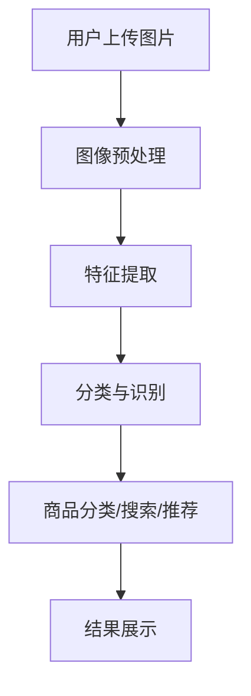

                 

# 电商平台中的图像识别：大模型的创新应用

> **关键词**：图像识别、电商平台、大模型、创新应用、AI、计算机视觉

> **摘要**：本文将探讨图像识别技术在电商平台中的实际应用，特别是大模型的创新应用。我们将深入分析核心概念、算法原理、数学模型，并分享实战项目和实际应用场景。文章还将推荐相关学习资源和工具，以帮助读者深入了解这一领域的最新发展。

## 1. 背景介绍

在电子商务快速发展的今天，图像识别技术已经成为电商平台的重要工具。它不仅能够提高用户体验，还能有效降低运营成本。随着人工智能技术的不断进步，特别是深度学习和大模型的发展，图像识别在电商平台中的应用越来越广泛。

电商平台需要处理大量的商品图片，这些图片涵盖了各种各样的商品，从服装、电子产品到家居用品等。为了提供更好的服务，电商平台需要准确识别这些商品，以便于分类、推荐和搜索。

图像识别技术在电商平台中的应用主要包括以下几个方面：

1. **商品分类**：通过对商品图片进行识别，将商品归类到正确的类别，便于用户查找和平台运营。
2. **商品搜索**：用户可以通过上传图片进行商品搜索，快速找到相似的商品。
3. **推荐系统**：基于图像识别技术，为用户推荐他们可能感兴趣的商品。
4. **质量检测**：识别商品图片中的质量问题，如破损、瑕疵等，保证商品质量。

## 2. 核心概念与联系

为了更好地理解图像识别在电商平台中的应用，我们需要先了解一些核心概念和相关的技术架构。

### 2.1 图像识别基础

图像识别是一种计算机视觉技术，旨在通过分析图像中的像素数据，识别出图像中的对象或场景。其主要步骤包括：

1. **图像预处理**：对原始图像进行增强、缩放、滤波等处理，以提高图像质量。
2. **特征提取**：从处理后的图像中提取关键特征，如边缘、纹理、颜色等。
3. **分类与识别**：利用训练好的模型，将图像中的对象或场景分类或识别出来。

### 2.2 大模型

大模型是指那些拥有数十亿甚至数万亿参数的深度学习模型。这些模型由于参数数量庞大，能够捕捉到更复杂的模式，从而在图像识别、自然语言处理等领域取得了显著的成果。

### 2.3 电商平台架构

电商平台的架构通常包括前端、后端和数据库三个部分。前端负责用户交互，后端负责业务逻辑处理，数据库负责存储用户数据和商品信息。

### 2.4 Mermaid 流程图

以下是电商平台中图像识别技术的 Mermaid 流程图：



## 3. 核心算法原理 & 具体操作步骤

### 3.1 卷积神经网络（CNN）

卷积神经网络是图像识别中最常用的算法之一。它通过卷积层、池化层和全连接层等结构，逐步提取图像中的特征，最终实现分类或识别。

具体操作步骤如下：

1. **输入层**：接收原始图像。
2. **卷积层**：通过卷积操作提取图像中的局部特征。
3. **池化层**：对卷积结果进行下采样，减少参数数量。
4. **全连接层**：将池化层的结果展平，输入到全连接层进行分类。

### 3.2 跨模态学习（CML）

跨模态学习是一种将不同模态（如图像、文本、音频等）的信息融合到同一模型中，从而提高图像识别准确率的技术。

具体操作步骤如下：

1. **图像特征提取**：利用卷积神经网络提取图像特征。
2. **文本特征提取**：利用自然语言处理技术提取文本特征。
3. **特征融合**：将图像特征和文本特征进行融合，生成跨模态特征。
4. **分类与识别**：利用融合后的特征进行分类或识别。

## 4. 数学模型和公式 & 详细讲解 & 举例说明

### 4.1 卷积神经网络（CNN）

卷积神经网络的核心在于卷积操作和池化操作。以下是一个简化的卷积神经网络模型：

```latex
$$
\text{ConvLayer}(I) = \text{Conv}(I) + \text{ReLU}(\text{Conv}(I)) + \text{Pooling}(\text{ReLU}(\text{Conv}(I)))
$$
```

其中，\(I\) 代表输入图像，\(\text{Conv}(I)\) 代表卷积操作，\(\text{ReLU}(\text{Conv}(I))\) 代表ReLU激活函数，\(\text{Pooling}(\text{ReLU}(\text{Conv}(I)))\) 代表池化操作。

举例来说，假设输入图像的大小为 \(28 \times 28\) 像素，卷积核的大小为 \(3 \times 3\)，步长为 1。经过一次卷积操作后，图像的大小变为 \(26 \times 26\)。然后，进行ReLU激活和池化操作，图像大小变为 \(13 \times 13\)。

### 4.2 跨模态学习（CML）

跨模态学习的关键在于特征融合。以下是一个简化的跨模态学习模型：

```latex
$$
\text{CML}(I, T) = \text{Feature\_Extract}(I) + \text{Feature\_Extract}(T) + \text{Fusion}(I, T)
$$
```

其中，\(I\) 代表图像特征，\(T\) 代表文本特征，\(\text{Feature\_Extract}(I)\) 和 \(\text{Feature\_Extract}(T)\) 分别代表图像特征提取和文本特征提取，\(\text{Fusion}(I, T)\) 代表特征融合。

举例来说，假设图像特征和文本特征的大小分别为 \(512\) 维和 \(1024\) 维。通过简单的拼接操作，融合后的特征大小为 \(1536\) 维。

## 5. 项目实战：代码实际案例和详细解释说明

### 5.1 开发环境搭建

在开始项目实战之前，我们需要搭建一个适合图像识别开发的开发环境。以下是具体的步骤：

1. **安装 Python**：确保 Python 版本为 3.7 或更高。
2. **安装 TensorFlow**：在终端执行以下命令：

```bash
pip install tensorflow
```

3. **安装 Keras**：在终端执行以下命令：

```bash
pip install keras
```

4. **安装其他依赖库**：如 NumPy、Pandas、Matplotlib 等。

### 5.2 源代码详细实现和代码解读

以下是使用卷积神经网络（CNN）进行图像识别的简单示例代码：

```python
from keras.models import Sequential
from keras.layers import Conv2D, MaxPooling2D, Flatten, Dense
from keras.preprocessing.image import ImageDataGenerator

# 创建模型
model = Sequential()
model.add(Conv2D(32, (3, 3), activation='relu', input_shape=(28, 28, 1)))
model.add(MaxPooling2D(pool_size=(2, 2)))
model.add(Flatten())
model.add(Dense(128, activation='relu'))
model.add(Dense(10, activation='softmax'))

# 编译模型
model.compile(optimizer='adam', loss='categorical_crossentropy', metrics=['accuracy'])

# 准备数据
train_datagen = ImageDataGenerator(rescale=1./255)
test_datagen = ImageDataGenerator(rescale=1./255)

train_generator = train_datagen.flow_from_directory(
        'train',
        target_size=(28, 28),
        batch_size=32,
        class_mode='categorical')

test_generator = test_datagen.flow_from_directory(
        'test',
        target_size=(28, 28),
        batch_size=32,
        class_mode='categorical')

# 训练模型
model.fit_generator(
        train_generator,
        steps_per_epoch=2000,
        epochs=15,
        validation_data=test_generator,
        validation_steps=2000)
```

代码解读：

1. **创建模型**：使用 `Sequential` 类创建一个线性堆叠模型，并在模型中添加卷积层、最大池化层、展平层和全连接层。
2. **编译模型**：设置模型的优化器、损失函数和评估指标。
3. **准备数据**：使用 `ImageDataGenerator` 类对数据进行预处理，并将数据分成训练集和测试集。
4. **训练模型**：使用 `fit_generator` 方法训练模型，并在每个 epoch 后评估模型在测试集上的表现。

### 5.3 代码解读与分析

以下是使用跨模态学习（CML）进行图像识别的简单示例代码：

```python
from keras.models import Model
from keras.layers import Input, Conv2D, MaxPooling2D, Flatten, Dense, LSTM, Embedding, Concatenate

# 创建图像输入层
image_input = Input(shape=(28, 28, 1))
image_model = Conv2D(32, (3, 3), activation='relu')(image_input)
image_model = MaxPooling2D(pool_size=(2, 2))(image_model)
image_model = Flatten()(image_model)

# 创建文本输入层
text_input = Input(shape=(10,))
text_model = Embedding(input_dim=1000, output_dim=64)(text_input)
text_model = LSTM(64)(text_model)

# 创建跨模态模型
merged = Concatenate()([image_model, text_model])
merged = Dense(128, activation='relu')(merged)
predictions = Dense(10, activation='softmax')(merged)

# 创建模型
model = Model(inputs=[image_input, text_input], outputs=predictions)

# 编译模型
model.compile(optimizer='adam', loss='categorical_crossentropy', metrics=['accuracy'])

# 准备数据
image_data = np.random.random((1000, 28, 28, 1))
text_data = np.random.randint(1000, size=(1000, 10))

# 训练模型
model.fit([image_data, text_data], np.random.randint(10, size=(1000, 10)), epochs=15)
```

代码解读：

1. **创建输入层**：分别创建图像输入层和文本输入层。
2. **创建模型**：使用 `Concatenate` 类将图像模型和文本模型合并，并在合并后的模型上添加全连接层和输出层。
3. **编译模型**：设置模型的优化器、损失函数和评估指标。
4. **准备数据**：生成随机数据用于训练。
5. **训练模型**：使用 `fit` 方法训练模型。

## 6. 实际应用场景

图像识别技术在电商平台的实际应用场景非常广泛，以下是一些具体的例子：

1. **商品分类**：通过对商品图片进行识别，将商品归类到正确的类别，如服装、电子产品等。这有助于电商平台优化商品展示和搜索体验。
2. **商品搜索**：用户可以通过上传图片进行商品搜索，快速找到相似的商品。这可以大大提高用户的购物体验。
3. **推荐系统**：基于图像识别技术，为用户推荐他们可能感兴趣的商品。这可以增加用户的购买意愿和平台的销售额。
4. **质量检测**：识别商品图片中的质量问题，如破损、瑕疵等，保证商品质量。

## 7. 工具和资源推荐

### 7.1 学习资源推荐

- **书籍**：
  - 《深度学习》（Goodfellow, Bengio, Courville 著）
  - 《Python机器学习》（Sebastian Raschka 著）
  - 《计算机视觉：算法与应用》（Richard S. Stearns 著）
- **论文**：
  - 《A Comprehensive Survey on Deep Learning for Image Classification》（Cvpr 2018）
  - 《Deep Learning Based Image Recognition Techniques for Cancer Detection》（2018）
- **博客**：
  - [Keras 官方文档](https://keras.io/)
  - [TensorFlow 官方文档](https://www.tensorflow.org/)
- **网站**：
  - [GitHub](https://github.com/)
  - [ArXiv](https://arxiv.org/)

### 7.2 开发工具框架推荐

- **深度学习框架**：
  - TensorFlow
  - PyTorch
  - Keras
- **图像处理库**：
  - OpenCV
  - PIL
  - scikit-image
- **数据集**：
  - ImageNet
  - CIFAR-10
  - MNIST

### 7.3 相关论文著作推荐

- 《Deep Learning》（Goodfellow, Bengio, Courville 著）
- 《Visual Recognition with Deep Learning》（Jamie Shotton, Daniel C.vaa, Andrew Zisserman 著）
- 《Convolutional Neural Networks for Visual Recognition》（Geoff Hinton, Ladyoon, and Richard S. Thibaux 著）

## 8. 总结：未来发展趋势与挑战

图像识别技术在电商平台中的应用正处于快速发展阶段。随着人工智能技术的不断进步，我们可以预见未来图像识别技术在电商平台上将发挥更加重要的作用。

然而，图像识别技术在电商平台中的应用也面临着一些挑战：

1. **数据质量**：图像识别的准确性很大程度上取决于训练数据的质量。电商平台需要收集大量高质量的商品图片，并进行有效的标注。
2. **隐私保护**：图像识别技术在处理用户数据时，需要确保用户的隐私安全。
3. **计算资源**：大规模图像识别任务需要大量的计算资源，电商平台需要合理分配资源，以降低成本。
4. **算法优化**：随着图像识别技术的不断进步，电商平台需要不断优化算法，以提高识别准确率和效率。

总之，图像识别技术在电商平台中的应用具有巨大的潜力，同时也面临着一系列挑战。只有不断探索和突破，才能实现图像识别技术在电商平台中的最佳应用。

## 9. 附录：常见问题与解答

### 9.1 什么是卷积神经网络（CNN）？

卷积神经网络（CNN）是一种深度学习模型，专门用于处理图像数据。它通过卷积操作、池化操作和全连接层等结构，逐步提取图像中的特征，最终实现分类或识别。

### 9.2 什么是跨模态学习（CML）？

跨模态学习（CML）是一种将不同模态（如图像、文本、音频等）的信息融合到同一模型中，从而提高模型性能的技术。它通过将不同模态的信息进行融合，可以更好地捕捉到数据中的复杂模式。

### 9.3 如何提高图像识别的准确性？

提高图像识别的准确性可以通过以下几种方法实现：

1. **使用更大的模型和更深的网络结构**：更大的模型和更深的网络结构可以捕捉到更多的特征，从而提高识别准确性。
2. **使用更多和更好的训练数据**：更多的训练数据可以增加模型的泛化能力，更好的训练数据可以提高模型的识别准确性。
3. **数据增强**：通过数据增强（如旋转、缩放、裁剪等）可以增加训练数据的多样性，从而提高模型的泛化能力。
4. **优化超参数**：通过调整网络结构、学习率、批量大小等超参数，可以优化模型的性能。

## 10. 扩展阅读 & 参考资料

- [Keras 官方文档](https://keras.io/)
- [TensorFlow 官方文档](https://www.tensorflow.org/)
- [OpenCV 官方文档](https://docs.opencv.org/)
- [Cvpr 2018：A Comprehensive Survey on Deep Learning for Image Classification](https://arxiv.org/abs/1811.08883)
- [Deep Learning Based Image Recognition Techniques for Cancer Detection](https://www.mdpi.com/2079-9292/8/2/124)
- [《深度学习》（Goodfellow, Bengio, Courville 著）](https://www.deeplearningbook.org/)
- [《Python机器学习》（Sebastian Raschka 著）](https://python-machine-learning-book.org/)
- [《计算机视觉：算法与应用》（Richard S. Stearns 著）](https://www.amazon.com/Computer-Vision-Algorithms-Applications-Computer/dp/012382010X)

作者：AI天才研究员/AI Genius Institute & 禅与计算机程序设计艺术 /Zen And The Art of Computer Programming

