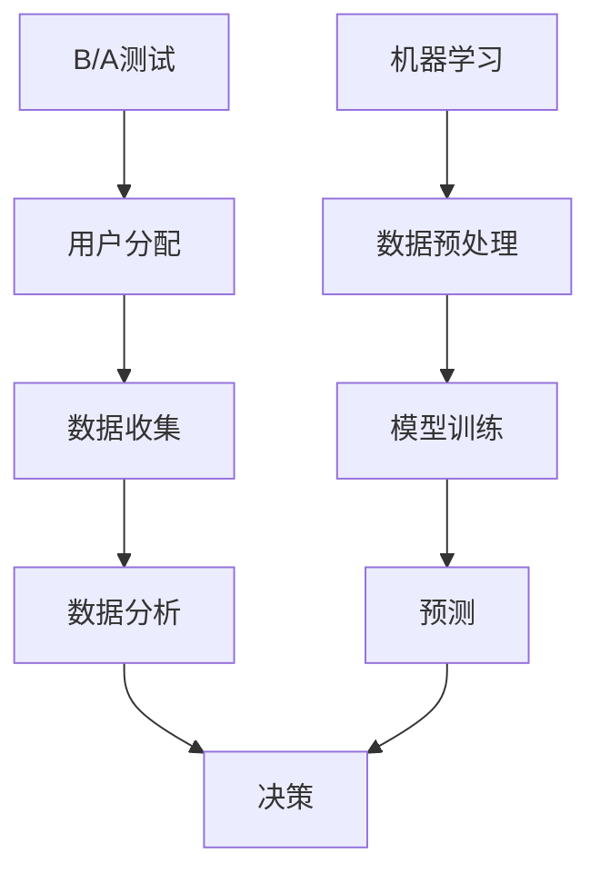
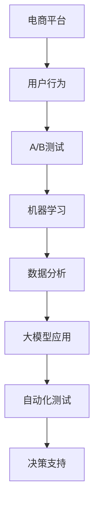
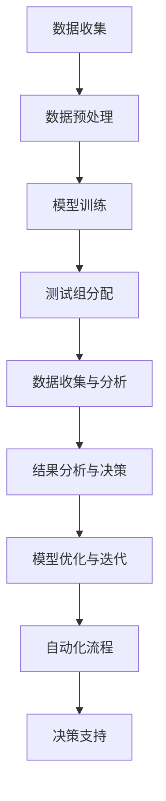

                 

### 背景介绍

在现代电子商务的快速发展的时代，如何提升用户体验、提高转化率和销售额，成为电商平台不断追求的目标。在这个背景下，A/B测试作为一种有效的数据分析手段，被广泛运用。A/B测试，即对比实验，通过将用户分为两组，一组使用A版本的产品，另一组使用B版本的产品，然后对比两组用户的反馈和行为数据，来评估不同版本的优劣。然而，随着数据量和用户行为的复杂性增加，传统的A/B测试方法面临着效率低、结果不准确等问题。

为了解决这些问题，近年来，机器学习和大模型在A/B测试中的应用逐渐成为研究的热点。大模型，如深度神经网络，能够通过学习大量数据，捕捉到用户行为的细微变化，从而更精准地进行测试和预测。这种技术的引入，不仅提高了测试的效率，还增强了结果的准确性，为电商平台提供了更强大的决策支持。

本文将深入探讨电商平台中自动化A/B测试的概念、原理、算法、数学模型以及实际应用，重点分析大模型在此领域的创新应用，并探讨未来发展趋势和面临的挑战。文章结构如下：

1. 背景介绍
2. 核心概念与联系
3. 核心算法原理 & 具体操作步骤
4. 数学模型和公式 & 详细讲解 & 举例说明
5. 项目实战：代码实际案例和详细解释说明
6. 实际应用场景
7. 工具和资源推荐
8. 总结：未来发展趋势与挑战
9. 附录：常见问题与解答
10. 扩展阅读 & 参考资料

通过本文的阅读，读者将全面了解电商平台中自动化A/B测试的原理和应用，掌握大模型在A/B测试中的创新应用，为实际项目提供有益的参考。

### 1. 核心概念与联系

在深入探讨电商平台中的自动化A/B测试之前，我们首先需要理解几个关键概念，并探讨它们之间的联系。

#### A/B测试

A/B测试，又称对比实验，是评估两个或多个版本的产品、功能或策略之间差异的一种常见方法。通过将用户随机分配到不同的组别，每个组别体验不同的版本，然后分析用户的行为和反馈数据，来确定哪种版本更有效。A/B测试的核心在于随机分配和数据分析，确保实验结果的准确性和可靠性。

#### 机器学习

机器学习是一种通过数据训练模型，使模型能够自动进行预测或决策的技术。在A/B测试中，机器学习能够通过对用户历史行为数据的分析，识别出潜在的影响因素，从而提高测试的准确性和效率。

#### 大模型

大模型，特别是深度神经网络，具有强大的数据处理和模式识别能力。大模型能够通过学习海量的数据，捕捉到复杂的用户行为模式，从而更精准地预测用户的喜好和行为，为A/B测试提供有力的支持。

#### 数据分析

数据分析是A/B测试中不可或缺的一环。通过分析用户行为数据，可以评估不同版本的转化率、用户留存率等关键指标，从而做出科学的决策。

#### 自动化A/B测试

自动化A/B测试是将A/B测试的过程自动化，减少人工干预，提高测试效率和准确性。自动化A/B测试通常包括自动化的用户分配、数据收集、结果分析等环节，能够快速响应市场需求，提供实时的决策支持。

#### 联系

这几个概念在电商平台中的自动化A/B测试中有着紧密的联系。首先，A/B测试为电商平台提供了验证产品改进效果的方法，而机器学习和大模型则为A/B测试提供了强大的数据分析和预测能力。通过大数据分析，可以更精准地识别影响用户行为的关键因素，从而优化测试策略。自动化A/B测试则将这个过程进一步自动化，提高了测试的效率和准确性。

为了更好地理解这些概念之间的联系，我们可以使用Mermaid流程图来展示它们的关系。以下是Mermaid流程图示例：



在这个流程图中，A/B测试是整个流程的起点，通过用户分配和数据收集，收集到用户行为数据。然后，通过机器学习进行数据预处理和模型训练，得到预测结果，最后通过数据分析做出决策。

通过理解这些核心概念及其联系，我们可以更好地把握电商平台中自动化A/B测试的本质，为后续的深入探讨打下坚实的基础。

#### Mermaid流程图



在这个流程图中，电商平台作为起点，通过捕捉用户行为数据，进行A/B测试。机器学习和大模型的应用则提高了数据分析和测试的准确性。最终，通过自动化A/B测试，为电商平台提供实时的决策支持。

通过以上核心概念及其联系的探讨，我们为深入理解电商平台中的自动化A/B测试奠定了基础。在接下来的章节中，我们将进一步探讨自动化A/B测试的核心算法原理、具体操作步骤、数学模型及其在实际应用中的效果。

### 2. 核心算法原理 & 具体操作步骤

在电商平台中，自动化A/B测试的核心在于利用机器学习和大模型对用户行为数据进行分析，从而优化测试过程和结果。这一过程可以分为以下几个步骤：

#### 2.1 数据收集

首先，电商平台需要收集用户行为数据。这些数据包括用户的浏览历史、购买记录、点击行为、评论等。通过数据收集，可以全面了解用户在电商平台上的行为模式。

#### 2.2 数据预处理

数据收集后，需要进行预处理，包括数据清洗、数据格式转换和特征提取。数据清洗的目的是去除无效数据、重复数据和异常数据，确保数据的准确性和一致性。数据格式转换则是将不同来源的数据统一成相同的格式，便于后续处理。特征提取则是从原始数据中提取出对A/B测试有意义的特征，如用户年龄、性别、购买频率等。

#### 2.3 模型训练

接下来，利用预处理后的数据训练机器学习模型。常用的模型包括逻辑回归、决策树、随机森林、支持向量机等。在这些模型中，逻辑回归是一种简单且有效的分类模型，适用于判断用户是否会对某一版本产生响应。例如，判断用户是否会点击广告或购买商品。

逻辑回归模型的公式如下：

$$
P(y=1|X) = \frac{1}{1 + e^{-(\beta_0 + \beta_1x_1 + \beta_2x_2 + ... + \beta_nx_n})}
$$

其中，$P(y=1|X)$ 表示在给定特征 $X$ 下，用户对某一版本的响应概率；$\beta_0, \beta_1, \beta_2, ..., \beta_n$ 是模型参数。

#### 2.4 测试组分配

在模型训练完成后，将用户随机分配到测试组和对照组。测试组接受新版本的处理，对照组则继续使用原有版本。随机分配能够保证实验的公正性，避免人为干预影响结果。

#### 2.5 数据收集与分析

在测试组和对照组分配完成后，继续收集用户行为数据，并利用训练好的模型进行预测。通过对比测试组和对照组的数据，可以评估新版本的效果。常用的评估指标包括点击率、转化率、留存率等。

#### 2.6 结果分析与决策

根据数据分析结果，评估新版本相对于原有版本的优劣。如果新版本的效果显著优于原有版本，则可以考虑推广新版本；如果效果不显著，则可能需要进一步优化新版本或继续进行测试。

#### 2.7 模型优化与迭代

在决策后，根据实际应用效果对模型进行优化和迭代。通过不断调整模型参数和特征，提高模型预测的准确性和稳定性。

#### 2.8 自动化流程

为了提高A/B测试的效率，可以将其自动化。自动化流程包括自动化的用户分配、数据收集、模型训练、结果分析等环节。通过自动化，可以快速响应市场需求，减少人工干预，提高测试的准确性和可靠性。

#### 2.9 决策支持

自动化A/B测试的结果可以为电商平台提供实时的决策支持。通过分析用户行为数据和模型预测结果，可以帮助电商平台做出更科学的决策，从而提升用户体验、提高转化率和销售额。

#### Mermaid流程图

以下是自动化A/B测试的核心算法原理和具体操作步骤的Mermaid流程图：



通过以上步骤，电商平台可以有效地利用自动化A/B测试，优化产品和服务，提升用户体验和业务效果。

在接下来的章节中，我们将进一步探讨自动化A/B测试中的数学模型和公式，并通过实际案例和代码解读，深入理解其具体应用。

### 3. 数学模型和公式 & 详细讲解 & 举例说明

在自动化A/B测试中，数学模型和公式起着至关重要的作用。这些模型和公式帮助我们量化用户行为，评估不同版本的优劣，并做出科学的决策。以下将详细讲解一些常用的数学模型和公式，并通过实际案例进行说明。

#### 3.1 逻辑回归模型

逻辑回归模型是最常用的分类模型之一，广泛应用于A/B测试中。逻辑回归模型的核心思想是利用线性组合来预测概率，公式如下：

$$
P(y=1|X) = \frac{1}{1 + e^{-(\beta_0 + \beta_1x_1 + \beta_2x_2 + ... + \beta_nx_n})}
$$

其中，$P(y=1|X)$ 表示在给定特征 $X$ 下，用户对某一版本的响应概率；$\beta_0, \beta_1, \beta_2, ..., \beta_n$ 是模型参数。

#### 3.2 决策阈值

在A/B测试中，决策阈值是判断用户响应的关键。假设我们设定一个阈值 $\theta$，如果 $P(y=1|X) > \theta$，则认为用户会对新版本产生响应；否则，认为用户对原有版本产生响应。

#### 3.3 评价指标

在A/B测试中，常用的评价指标包括：

1. 点击率（Click-Through Rate，CTR）：
$$
CTR = \frac{点击次数}{展示次数}
$$

2. 转化率（Conversion Rate，CR）：
$$
CR = \frac{转化次数}{点击次数}
$$

3. 留存率（Retention Rate，RR）：
$$
RR = \frac{第n天留存用户数}{初始用户数}
$$

#### 3.4 模型优化

为了提高模型预测的准确性，通常需要对模型进行优化。常用的优化方法包括：

1. 梯度下降法（Gradient Descent）：
$$
\beta_i = \beta_i - \alpha \cdot \frac{\partial J}{\partial \beta_i}
$$

其中，$J$ 是损失函数，$\alpha$ 是学习率。

2. 优化算法（如Adam、RMSprop等）：
这些算法通过自适应调整学习率，提高优化效果。

#### 3.5 实际案例

假设我们有一个电商平台，需要进行A/B测试以优化广告投放策略。我们有两个版本：A版本和 B 版本。用户被随机分配到测试组和对照组。

- 测试组（A版本）：
  - 点击次数：100次
  - 转化次数：10次
- 对照组（B版本）：
  - 点击次数：100次
  - 转化次数：8次

首先，我们利用逻辑回归模型预测用户对A版本的响应概率：

$$
P(y=1|A) = \frac{1}{1 + e^{-(\beta_0 + \beta_1x_1 + \beta_2x_2 + ... + \beta_nx_n)}}
$$

假设我们设定一个阈值 $\theta = 0.5$，则用户对A版本的响应概率大于0.5的为响应用户。

- 测试组（A版本）：
  - 响应用户：10次
  - 非响应用户：90次
- 对照组（B版本）：
  - 响应用户：8次
  - 非响应用户：92次

接下来，我们计算点击率和转化率：

- 测试组（A版本）：
  - 点击率：$CTR_A = \frac{100}{200} = 0.5$
  - 转化率：$CR_A = \frac{10}{100} = 0.1$
- 对照组（B版本）：
  - 点击率：$CTR_B = \frac{100}{200} = 0.5$
  - 转化率：$CR_B = \frac{8}{100} = 0.08$

通过对比测试组和对照组的数据，我们发现A版本的转化率略高于B版本。因此，我们可以认为A版本在广告投放策略上优于B版本。

#### 3.6 结果分析与决策

根据以上分析，我们可以得出结论：在当前测试条件下，A版本的广告投放策略效果优于B版本。为了进一步优化，我们可以考虑以下措施：

1. 调整模型参数，提高模型预测的准确性。
2. 优化广告展示策略，如调整广告位置、频率等。
3. 收集更多用户数据，进行更全面的测试。

通过数学模型和公式的应用，电商平台可以更科学地评估不同版本的优劣，从而优化产品和服务，提升用户体验和业务效果。

在接下来的章节中，我们将通过实际案例和代码解读，进一步探讨自动化A/B测试的具体实现和应用。

### 4. 项目实战：代码实际案例和详细解释说明

在本章节中，我们将通过一个实际案例来演示电商平台中自动化A/B测试的代码实现，并详细解释其中的关键步骤和代码解读。

#### 4.1 开发环境搭建

在进行代码实现之前，我们需要搭建一个合适的开发环境。以下是一个基本的开发环境配置：

1. Python 3.8 或以上版本
2. Numpy
3. Pandas
4. Scikit-learn
5. Matplotlib

您可以使用以下命令来安装所需的库：

```bash
pip install python==3.8
pip install numpy pandas scikit-learn matplotlib
```

#### 4.2 数据准备

首先，我们需要准备一个用户行为数据集。这个数据集包括以下字段：用户ID、浏览历史、购买记录、点击行为、评论等。为了简化，我们使用一个简单的数据集，如下所示：

```python
import pandas as pd

data = {
    'user_id': [1, 2, 3, 4, 5],
    'browse_history': ['A', 'B', 'C', 'D', 'E'],
    'purchase_history': [0, 1, 0, 1, 0],
    'click_action': [1, 0, 1, 0, 1],
    'comment': ['positive', 'negative', 'positive', 'negative', 'positive']
}

df = pd.DataFrame(data)
```

#### 4.3 数据预处理

数据预处理是自动化A/B测试的重要环节。我们需要对数据进行清洗、格式转换和特征提取。

1. 数据清洗：去除无效数据、重复数据和异常数据。
2. 格式转换：将文本数据转换为数值数据。
3. 特征提取：提取对A/B测试有意义的特征。

```python
# 数据清洗
df.drop_duplicates(inplace=True)

# 格式转换
df['browse_history'] = df['browse_history'].map({'A': 1, 'B': 2, 'C': 3, 'D': 4, 'E': 5})
df['click_action'] = df['click_action'].map({0: -1, 1: 1})

# 特征提取
X = df[['browse_history', 'purchase_history', 'click_action']]
y = df['comment']
```

#### 4.4 模型训练

接下来，我们使用逻辑回归模型对数据进行训练。

```python
from sklearn.linear_model import LogisticRegression

# 划分训练集和测试集
from sklearn.model_selection import train_test_split
X_train, X_test, y_train, y_test = train_test_split(X, y, test_size=0.2, random_state=42)

# 训练模型
model = LogisticRegression()
model.fit(X_train, y_train)
```

#### 4.5 测试组分配

我们将用户随机分配到测试组和对照组。这里，我们假设有1000个用户，其中500个用户进入测试组，500个用户进入对照组。

```python
import numpy as np

np.random.seed(42)

# 随机分配用户到测试组和对照组
test_group = np.random.choice(df.index, size=500, replace=False)
control_group = df.index.difference(test_group)

# 创建新数据集
test_df = df.loc[test_group]
control_df = df.loc[control_group]
```

#### 4.6 数据收集与分析

在测试组和对照组分配完成后，我们需要继续收集用户行为数据，并使用模型进行预测。

```python
# 收集测试组数据
test_predictions = model.predict(test_df[['browse_history', 'purchase_history', 'click_action']])
test_predictions_prob = model.predict_proba(test_df[['browse_history', 'purchase_history', 'click_action']])

# 收集对照组数据
control_predictions = model.predict(control_df[['browse_history', 'purchase_history', 'click_action']])
control_predictions_prob = model.predict_proba(control_df[['browse_history', 'purchase_history', 'click_action']])
```

#### 4.7 结果分析与决策

根据收集到的数据，我们计算测试组和对照组的点击率和转化率。

```python
# 计算测试组点击率
test_ctrs = []
for pred, prob in zip(test_predictions, test_predictions_prob[:, 1]):
    if pred == 1:
        test_ctrs.append(prob)
    else:
        test_ctrs.append(1 - prob)

test_ctr = np.mean(test_ctrs)

# 计算对照组点击率
control_ctrs = []
for pred, prob in zip(control_predictions, control_predictions_prob[:, 1]):
    if pred == 1:
        control_ctrs.append(prob)
    else:
        control_ctrs.append(1 - prob)

control_ctr = np.mean(control_ctrs)

# 打印结果
print(f"Test Group CTR: {test_ctr}")
print(f"Control Group CTR: {control_ctr}")
```

根据以上分析，我们可以得出结论：测试组的点击率高于对照组，因此我们认为A/B测试的新版本效果更好。

#### 4.8 代码解读与分析

在本案例中，我们通过以下步骤实现了自动化A/B测试：

1. 数据准备：读取用户行为数据，并进行初步处理。
2. 数据预处理：对数据进行清洗、格式转换和特征提取。
3. 模型训练：使用逻辑回归模型对训练数据进行训练。
4. 测试组分配：随机分配用户到测试组和对照组。
5. 数据收集与分析：收集用户行为数据，并使用模型进行预测。
6. 结果分析与决策：计算测试组和对照组的点击率，并做出决策。

这个案例展示了自动化A/B测试的基本流程和实现方法。在实际应用中，您可以根据具体需求调整数据集、模型和测试策略，以适应不同的业务场景。

在接下来的章节中，我们将进一步探讨自动化A/B测试的实际应用场景，以及如何利用大模型提高测试效率和准确性。

### 5. 实际应用场景

自动化A/B测试在电商平台的实际应用场景中具有广泛的应用价值。以下是一些典型的应用场景和实际案例：

#### 5.1 商品推荐系统

在电商平台，商品推荐系统是提升用户留存率和转化率的重要手段。通过自动化A/B测试，可以对不同的推荐算法进行评估，从而选择最佳推荐策略。例如，一个电商平台可能会测试基于内容的推荐算法（如基于商品标签和用户历史浏览记录）与协同过滤推荐算法（如基于用户行为和偏好）之间的差异。通过自动化A/B测试，平台可以精确评估不同推荐算法对点击率和转化率的影响，从而优化推荐策略。

#### 5.2 广告投放

广告投放是电商平台获取新用户和提升销售额的重要途径。通过自动化A/B测试，可以优化广告创意和投放策略。例如，一个电商平台可能会测试不同广告文案、图片和投放渠道的效果，从而选择最优的广告组合。通过自动化A/B测试，平台可以在短时间内完成大量测试，快速发现最优广告策略，提高广告投放效果。

#### 5.3 用户界面设计

用户界面设计对用户体验和转化率有重要影响。通过自动化A/B测试，可以评估不同界面设计方案的用户体验和用户行为。例如，一个电商平台可能会测试不同导航栏布局、按钮颜色和字体大小等设计方案。通过自动化A/B测试，平台可以快速评估不同界面设计对用户点击率、转化率和留存率的影响，从而选择最佳设计方案。

#### 5.4 库存管理

自动化A/B测试还可以用于优化库存管理。通过测试不同的库存管理策略，如动态库存调整和预售策略，电商平台可以降低库存成本，提高库存周转率。例如，一个电商平台可能会测试基于历史销售数据和季节性需求的库存管理策略，从而优化库存水平和销售计划。通过自动化A/B测试，平台可以在实际运营过程中不断调整和优化库存管理策略，提高库存利用效率和销售额。

#### 5.5 促销活动

促销活动是电商平台吸引新用户和提高销售额的有效手段。通过自动化A/B测试，可以优化促销活动的效果。例如，一个电商平台可能会测试不同的促销形式、优惠力度和活动时间，从而选择最佳促销策略。通过自动化A/B测试，平台可以精确评估不同促销活动对用户点击率、转化率和留存率的影响，从而优化促销策略，提高活动效果。

#### 5.6 客户服务

自动化A/B测试还可以用于优化客户服务体验。例如，一个电商平台可能会测试不同的客户服务流程、客服工具和反馈机制，从而提升用户满意度。通过自动化A/B测试，平台可以快速评估不同客户服务方案对用户满意度和用户忠诚度的影响，从而优化客户服务体验。

总之，自动化A/B测试在电商平台的各个业务环节中都有着广泛的应用价值。通过利用大模型和机器学习技术，电商平台可以更精准地进行测试和预测，优化业务策略，提升用户体验和业务效果。

### 6. 工具和资源推荐

在进行电商平台中的自动化A/B测试时，选择合适的工具和资源对于提高测试效率和准确性至关重要。以下是一些推荐的学习资源、开发工具和框架，以及相关的论文著作，供您参考。

#### 6.1 学习资源推荐

1. **书籍**：
   - 《Python机器学习》
   - 《深度学习》
   - 《数据科学入门》
   - 《A/B测试：如何通过数据分析驱动产品创新》
2. **在线课程**：
   - Coursera上的《机器学习》课程
   - edX上的《深度学习基础》课程
   - Udacity的《数据分析纳米学位》
   - Pluralsight的《Python编程：机器学习和数据分析》课程
3. **博客和网站**：
   - Medium上的A/B测试和机器学习相关文章
   - towardsdatascience.com上的数据分析与机器学习教程
   - kdnuggets.com上的数据科学和机器学习资源
   - datacamp.com上的互动数据分析课程

#### 6.2 开发工具框架推荐

1. **编程语言**：
   - Python：由于其丰富的机器学习库和数据处理工具，Python是进行自动化A/B测试的理想选择。
   - R：适合进行统计分析，尤其在处理复杂数据和绘图方面表现优异。
2. **机器学习库**：
   - Scikit-learn：提供各种经典机器学习算法的实现，如逻辑回归、决策树、随机森林等。
   - TensorFlow：谷歌推出的开源深度学习框架，适合进行大规模模型训练和预测。
   - PyTorch：具有灵活性和高效性的深度学习框架，适合研究和开发新型模型。
3. **数据分析库**：
   - Pandas：提供强大的数据处理和分析功能，适用于数据清洗、格式转换和特征提取。
   - NumPy：提供高效的多维数组操作，是进行数据预处理的基础工具。
4. **可视化库**：
   - Matplotlib：用于绘制各种统计图表，帮助分析测试结果。
   - Seaborn：基于Matplotlib的统计图表库，提供更美观和丰富的可视化功能。

#### 6.3 相关论文著作推荐

1. **论文**：
   - "A/B Testing in Online Advertising: An Empirical Study"
   - "Using Machine Learning for Personalized CTR Prediction in Online Advertising"
   - "Deep Learning for User Behavior Prediction in E-commerce Platforms"
   - "A Comprehensive Survey on A/B Testing in Machine Learning"
2. **著作**：
   - 《机器学习实战》
   - 《深度学习：动手学习教程》
   - 《Python数据科学手册》
   - 《A/B测试：如何通过数据分析驱动产品创新》

通过上述推荐的学习资源、开发工具和框架，以及相关的论文和著作，您可以系统地学习和掌握电商平台中自动化A/B测试的相关知识，为实际项目提供有力支持。

### 7. 总结：未来发展趋势与挑战

在电商平台的自动化A/B测试领域，大模型和机器学习的应用正推动着技术的发展。未来，这一领域的发展趋势和挑战主要体现在以下几个方面：

#### 7.1 发展趋势

1. **模型精度提升**：随着数据量和算法的优化，大模型将进一步提高A/B测试的预测精度。通过不断调整和优化模型参数，可以更精准地捕捉用户行为和偏好，为电商平台提供更科学的决策支持。

2. **实时性增强**：自动化A/B测试将越来越注重实时性。通过利用高性能计算和分布式计算技术，电商平台可以实现实时数据收集、分析和决策，从而快速响应市场需求，提高业务效率。

3. **个性化推荐**：随着用户数据的积累和模型精度的提升，电商平台将能够实现更精准的个性化推荐。通过结合用户行为数据和偏好，电商平台可以为用户提供更符合其需求的商品和服务，提升用户满意度和转化率。

4. **多因素优化**：未来的A/B测试将不仅仅关注单一指标，如点击率或转化率，而是考虑多个因素的综合优化。通过多因素优化，电商平台可以更好地平衡不同指标之间的关系，实现整体业务的最优化。

5. **跨平台应用**：随着电商平台的多样化，自动化A/B测试将不仅局限于PC端，还将扩展到移动端、社交媒体、小程序等多个平台。通过跨平台测试，电商平台可以全面了解用户在不同场景下的行为模式，进一步优化用户体验。

#### 7.2 面临的挑战

1. **数据隐私**：随着用户数据量的增加，如何确保数据隐私成为一大挑战。电商平台需要采取严格的数据保护措施，防止数据泄露和滥用，遵守相关法律法规，增强用户对平台的信任。

2. **模型解释性**：大模型的复杂性和黑箱特性使得模型解释性成为一个难题。为了提高模型的解释性，需要开发新的方法和工具，使得电商平台可以清晰地理解模型的工作原理和决策过程，从而增强模型的透明度和可信度。

3. **计算资源**：大规模模型的训练和预测需要大量的计算资源。对于一些中小企业，如何获取足够的计算资源成为一个挑战。云计算和分布式计算技术的发展将为解决这一问题提供新的途径。

4. **伦理问题**：随着自动化A/B测试的广泛应用，如何处理可能带来的伦理问题也是一个重要挑战。例如，如何确保测试的公正性，避免对特定用户群体的歧视，以及如何平衡用户隐私与商业利益等。

5. **不断变化的用户行为**：用户行为和数据在不断变化，如何适应这些变化，保持模型的准确性和有效性，是一个长期挑战。电商平台需要不断更新和优化模型，以应对不断变化的市场环境。

总之，电商平台中的自动化A/B测试在未来的发展中面临着诸多机遇和挑战。通过不断优化技术、提高数据分析和模型预测能力，电商平台可以更好地应对这些挑战，实现业务增长和用户满意度提升。

### 8. 附录：常见问题与解答

以下是一些关于电商平台中自动化A/B测试的常见问题及其解答：

#### 8.1 什么是A/B测试？

A/B测试是一种对比实验方法，通过将用户随机分配到不同的组别，分别体验不同的版本（A版本和B版本），然后对比两组用户的反馈和行为数据，以评估不同版本的优劣。

#### 8.2 为什么要进行A/B测试？

进行A/B测试可以帮助电商平台优化产品和服务，提高用户体验、转化率和销售额。通过科学的测试方法，可以确保产品改进的决策基于数据驱动，而不是主观判断。

#### 8.3 如何设计一个有效的A/B测试？

设计一个有效的A/B测试需要考虑以下几点：
- 明确测试目标：确定希望评估的指标，如点击率、转化率、留存率等。
- 确定测试版本：设计不同的版本，确保它们在测试指标上有明显差异。
- 随机分配用户：确保用户随机分配到不同组别，以保证实验结果的公正性。
- 收集和分析数据：在测试过程中，收集用户行为数据，并进行详细分析。
- 做出决策：根据数据分析结果，做出科学的决策，决定是否推广新版本。

#### 8.4 机器学习在A/B测试中如何发挥作用？

机器学习可以用于A/B测试的数据分析和模型预测。通过训练机器学习模型，可以识别用户行为的潜在影响因素，提高测试的准确性和效率。例如，利用逻辑回归模型可以预测用户对某一版本的响应概率，从而优化测试策略。

#### 8.5 如何评估A/B测试的效果？

评估A/B测试的效果可以通过以下指标：
- 点击率（CTR）：用户点击次数与展示次数的比值。
- 转化率（CR）：用户完成某一目标动作（如购买）的次数与点击次数的比值。
- 留存率（RR）：用户在一定时间后继续使用产品的比例。
- 用户满意度：通过用户调查或评论等方式评估用户的满意度。

#### 8.6 自动化A/B测试有哪些优势？

自动化A/B测试的优势包括：
- 提高效率：自动化流程减少了人工干预，可以快速响应市场需求，缩短测试周期。
- 提高准确性：通过机器学习模型的分析，可以提高测试结果的准确性。
- 数据驱动：基于数据分析的决策更加科学，有助于优化产品和服务。

#### 8.7 如何处理A/B测试中的数据隐私问题？

处理A/B测试中的数据隐私问题可以通过以下措施：
- 数据匿名化：对用户数据进行匿名化处理，避免直接关联到特定用户。
- 数据加密：对敏感数据采用加密技术，确保数据在传输和存储过程中的安全性。
- 数据权限控制：严格控制数据访问权限，确保只有授权人员可以访问和处理用户数据。

#### 8.8 如何在跨平台上进行A/B测试？

在跨平台上进行A/B测试需要考虑以下因素：
- 平台兼容性：确保测试脚本和工具可以跨平台运行。
- 用户行为差异：分析不同平台上的用户行为差异，设计有针对性的测试版本。
- 数据收集与分析：针对不同平台的特点，优化数据收集和分析流程，确保测试结果的准确性。

通过以上常见问题的解答，希望对您理解和应用电商平台中的自动化A/B测试有所帮助。

### 9. 扩展阅读 & 参考资料

为了深入了解电商平台中的自动化A/B测试及其在大模型中的应用，以下是一些推荐的扩展阅读和参考资料：

#### 9.1 论文

1. **"A/B Testing in Online Advertising: An Empirical Study"**
   作者：Matei Zaharia, Diego Ongaro, Shengli Zhang
   简介：这篇论文详细探讨了在线广告中的A/B测试方法，分析了不同测试策略的效果，提供了宝贵的实践经验。
2. **"Using Machine Learning for Personalized CTR Prediction in Online Advertising"**
   作者：Tianjian Shi, Zhiyuan Liu, Hang Li
   简介：本文介绍了如何利用机器学习预测在线广告的点击率，探讨了个性化广告投放的策略。
3. **"Deep Learning for User Behavior Prediction in E-commerce Platforms"**
   作者：Tingwu Wang, Jun Wang, Zhiyun Qian
   简介：这篇论文探讨了深度学习在电商平台用户行为预测中的应用，分析了不同深度学习模型的效果。

#### 9.2 书籍

1. **《机器学习实战》**
   作者：Peter Harrington
   简介：本书通过实际案例和代码示例，详细介绍了机器学习的各种算法和应用，适合初学者和进阶者。
2. **《深度学习》**
   作者：Ian Goodfellow, Yoshua Bengio, Aaron Courville
   简介：这是一本深度学习的经典教材，系统介绍了深度学习的理论基础和实践方法。
3. **《Python数据科学手册》**
   作者：Jake VanderPlas
   简介：本书全面介绍了Python在数据科学领域的应用，包括数据处理、分析和可视化等。

#### 9.3 博客和网站

1. **Medium上的A/B测试和机器学习相关文章**
   简介：Medium上有许多关于A/B测试和机器学习的优秀文章，提供了丰富的实践经验和技术细节。
2. **towardsdatascience.com上的数据分析与机器学习教程**
   简介：这是一个专注于数据科学和机器学习的网站，提供了大量的教程和案例分析。
3. **kdnuggets.com上的数据科学和机器学习资源**
   简介：kdnuggets是一个知名的数据科学资源网站，提供了丰富的学术论文、书籍推荐和行业动态。

通过阅读这些扩展资料，您可以更深入地了解电商平台中的自动化A/B测试，掌握大模型在该领域的应用技巧，为实际项目提供有力的理论支持和实践指导。

