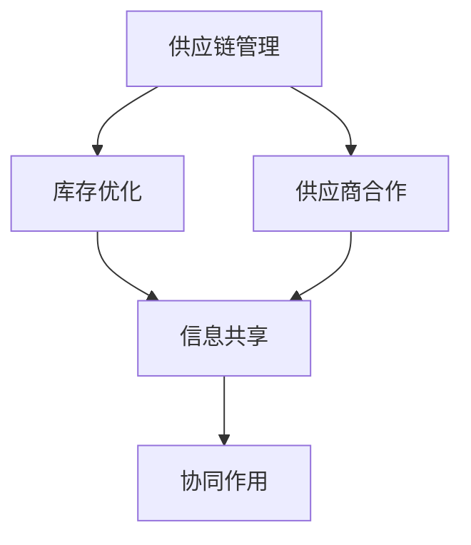

                 

### 背景介绍

#### 电子商务平台的现状

在当今全球化的商业环境中，电商平台已经成为连接消费者与供应商的重要桥梁。从亚马逊、阿里巴巴到eBay，这些平台不仅改变了人们的购物习惯，还极大地促进了全球贸易的发展。据统计，全球电商市场规模已突破数万亿美元，并持续以两位数的年增长率上升。

随着市场规模的扩大，电商平台的供给能力成为其竞争力的核心因素。供给能力不仅影响平台的用户留存率和市场份额，还直接关系到平台的盈利能力。因此，如何提升电商平台的供给能力，成为众多企业关注的焦点。

#### 供给能力的定义

供给能力是指电商平台能够提供的商品种类、数量和质量的能力。一个高效的供给能力意味着平台能够快速响应市场需求，满足消费者的多样化需求，并保持商品的稳定供应。供给能力不仅包括物流和库存管理，还涵盖了供应链优化、供应商关系管理等多个方面。

#### 供给能力的重要性

供给能力的重要性体现在以下几个方面：

1. **用户体验**：高效的供给能力能够提高用户的购物体验，减少等待时间和退货率，增强用户对平台的忠诚度。
2. **市场份额**：在竞争激烈的市场环境中，具备强大供给能力的平台能够更好地吸引消费者，从而获得更大的市场份额。
3. **盈利能力**：良好的供给能力能够减少库存积压和物流成本，提高平台的运营效率，从而增加盈利能力。
4. **品牌形象**：高效的供给能力有助于提升平台在消费者心中的品牌形象，增强市场竞争力。

#### 新品牌和供应商的合作

为了提升供给能力，电商平台需要不断拓展商品种类和优化供应链。与新品牌和供应商的合作成为实现这一目标的重要手段。通过与优质的新品牌和供应商建立合作关系，平台可以丰富商品种类，提高商品质量，同时优化供应链，降低成本。

在新品牌和供应商的合作中，电商平台需要关注以下几个方面：

1. **品牌定位与市场契合度**：电商平台需要了解新品牌的市场定位和目标消费者群体，确保品牌与平台的市场定位和用户群体相契合。
2. **供应链管理**：电商平台需要与新品牌和供应商建立高效的供应链管理系统，确保商品能够快速、准确地送达消费者手中。
3. **质量把控**：电商平台需要对新品牌和供应商的产品质量进行严格把控，确保商品质量符合消费者的期望。
4. **数据共享与合作共赢**：电商平台可以与供应商共享销售数据和市场信息，通过数据驱动的决策支持，实现合作共赢。

#### 文章结构概述

本文将从以下几个方面进行探讨：

1. **背景介绍**：介绍电子商务平台的现状、供给能力的定义和重要性。
2. **核心概念与联系**：详细解析电商平台提升供给能力的关键因素，包括供应链管理、库存优化和供应商合作等。
3. **核心算法原理与具体操作步骤**：介绍电商平台供给能力提升的核心算法和具体实施步骤。
4. **数学模型和公式**：阐述供给能力提升中的数学模型和公式，并进行详细讲解和举例说明。
5. **项目实战**：通过实际案例，展示如何通过代码实现电商平台供给能力的提升。
6. **实际应用场景**：分析电商平台供给能力提升在不同应用场景中的具体表现和效果。
7. **工具和资源推荐**：推荐学习资源、开发工具和框架，以及相关论文著作。
8. **总结与未来发展趋势**：总结供给能力提升的成果和未来面临的挑战。
9. **附录**：提供常见问题与解答。
10. **扩展阅读**：推荐相关扩展阅读资料。

通过本文的探讨，希望能够为电商平台提升供给能力提供一些有益的思路和方法。

### 核心概念与联系

在深入探讨电商平台如何提升供给能力之前，我们需要明确几个核心概念，并理解它们之间的相互关系。以下是本文将涉及的关键概念及其相互联系：

#### 供应链管理

供应链管理（Supply Chain Management, SCM）是指通过计划、实施和控制产品的有效流动和存储，从原材料到成品，直至最终用户的过程。对于电商平台而言，供应链管理是其供给能力的关键因素。有效的供应链管理可以确保商品从供应商到消费者的整个流程高效、顺畅。

##### 供应链管理的关键要素：

1. **供应商选择**：选择合适的供应商是供应链管理的第一步。电商平台需要考虑供应商的产品质量、交付能力和价格等因素。
2. **库存管理**：库存管理是供应链管理的核心。通过合理的库存管理，电商平台可以减少库存积压，降低成本，同时确保商品及时供应。
3. **物流管理**：物流管理包括运输、仓储和配送等环节。高效的物流管理可以确保商品快速、准确地送达消费者手中。
4. **信息流**：信息流是供应链管理中的信息传递和处理过程，包括订单处理、库存查询和物流跟踪等。信息流的畅通是确保供应链高效运作的关键。

#### 库存优化

库存优化（Inventory Optimization）是指通过合理的库存策略和管理方法，最大限度地降低库存成本，同时确保商品的及时供应。对于电商平台而言，库存优化是其提升供给能力的重要手段。

##### 库存优化的关键策略：

1. **需求预测**：通过历史数据和趋势分析，预测未来的商品需求，从而合理安排库存。
2. **ABC分类法**：将商品按照需求量、销售金额等因素进行分类，重点管理高价值、高需求的商品。
3. **安全库存**：设定合适的安全库存水平，以应对需求波动和供应延迟等不确定性因素。
4. **定期盘点**：定期盘点库存，确保库存数据的准确性，及时调整库存策略。

#### 供应商合作

供应商合作（Supplier Collaboration）是指电商平台与供应商之间建立的合作关系，通过协同工作，实现供应链的高效运作和共同发展。有效的供应商合作可以提升电商平台的供给能力，同时增强供应商的市场竞争力。

##### 供应商合作的关键要素：

1. **合作关系**：建立长期稳定的合作关系，确保双方在信息、资源、技术等方面的共享。
2. **协同规划**：与供应商共同制定供应链计划，包括生产计划、物流计划等，确保供应链的高效运作。
3. **信息共享**：通过共享销售数据、库存信息等，实现信息流的畅通，提高供应链的透明度。
4. **质量把控**：与供应商共同制定质量标准和检验流程，确保商品的质量符合消费者的期望。

#### 供应链管理、库存优化和供应商合作的联系

供应链管理、库存优化和供应商合作是提升电商平台供给能力的三个关键环节，它们之间存在着密切的联系。

1. **相互影响**：供应链管理是库存优化和供应商合作的基础，而库存优化和供应商合作又反过来影响供应链管理的效率。
2. **协同作用**：通过有效的供应链管理和库存优化，电商平台可以更好地与供应商合作，实现供应链的高效运作。
3. **目标一致**：供应链管理、库存优化和供应商合作的目标都是提高供给能力，从而提升电商平台的竞争力。

#### Mermaid 流程图

为了更直观地展示供应链管理、库存优化和供应商合作之间的关系，我们使用Mermaid语言绘制一个简单的流程图。



在上面的流程图中，供应链管理、库存优化和供应商合作相互关联，通过信息共享和协同作用，共同提升电商平台的供给能力。

通过以上对核心概念的介绍和相互关系的分析，我们可以更好地理解电商平台如何通过供应链管理、库存优化和供应商合作来提升供给能力。在接下来的章节中，我们将进一步探讨核心算法原理、具体操作步骤以及实际应用场景，帮助读者更深入地了解这一过程。

### 核心算法原理与具体操作步骤

为了提升电商平台的供给能力，我们需要依赖一系列核心算法来优化供应链管理、库存管理和供应商合作。以下将详细阐述这些核心算法的原理和具体操作步骤。

#### 1. 供应链管理算法

**原理**：供应链管理算法旨在通过优化供应商选择、库存管理和物流管理，实现供应链的高效运作。

**具体操作步骤**：

1. **供应商选择**：
   - **评价标准**：根据供应商的产品质量、交付能力、价格等因素，建立评价模型。
   - **算法**：使用多属性决策方法（如TOPSIS）对供应商进行综合评价，选择最佳供应商。
   - **示例**：假设有5家供应商，分别从质量、交付、价格三个方面进行评分，通过TOPSIS算法得出最佳供应商。

2. **库存管理**：
   - **需求预测**：使用时间序列分析法（如ARIMA模型）预测商品需求。
   - **库存优化**：根据需求预测结果，采用基于ABC分类法的库存优化策略，合理配置库存。
   - **示例**：使用ARIMA模型预测下一个月的商品需求，并根据ABC分类法调整库存水平。

3. **物流管理**：
   - **路径优化**：使用最短路径算法（如Dijkstra算法）优化物流配送路径。
   - **配送计划**：根据库存情况和订单需求，制定最优的配送计划。
   - **示例**：使用Dijkstra算法计算从仓库到各个配送点的最优路径，并根据订单需求安排配送计划。

#### 2. 库存优化算法

**原理**：库存优化算法通过合理的库存策略，降低库存成本，同时确保商品及时供应。

**具体操作步骤**：

1. **需求预测**：
   - **历史数据分析**：收集并分析历史销售数据，识别需求趋势和周期。
   - **算法**：使用回归分析（如线性回归）预测未来的商品需求。
   - **示例**：收集过去三个月的销售数据，使用线性回归模型预测下一个月的需求量。

2. **库存策略**：
   - **ABC分类法**：根据商品的需求量和销售金额，将商品分为A、B、C三类。
   - **算法**：采用基于ABC分类法的库存策略，重点管理高价值、高需求的商品。
   - **示例**：根据需求量和销售金额，将商品分为A、B、C三类，分别设置不同的库存管理策略。

3. **安全库存**：
   - **算法**：使用基于统计方法（如标准差法）计算安全库存量。
   - **示例**：根据历史需求波动和供应延迟情况，使用标准差法计算安全库存水平。

#### 3. 供应商合作算法

**原理**：供应商合作算法通过优化供应商关系，实现供应链的协同运作和共同发展。

**具体操作步骤**：

1. **合作关系建立**：
   - **沟通机制**：建立有效的沟通机制，确保信息流的高效传递。
   - **算法**：使用多属性决策方法（如AHP）评估供应商的合作潜力。
   - **示例**：通过AHP方法评估供应商的供货能力、质量保证、合作意愿等因素，选择最佳合作伙伴。

2. **协同规划**：
   - **生产计划**：与供应商共同制定生产计划，确保生产与需求相匹配。
   - **算法**：采用基于预测的协同生产计划方法（如MRP II）。
   - **示例**：根据需求预测和供应商的生产能力，制定生产计划，确保供应链的高效运作。

3. **信息共享**：
   - **数据交换**：建立数据交换平台，实现订单、库存、物流等信息的高效共享。
   - **算法**：使用区块链技术确保数据的安全性和透明性。
   - **示例**：通过区块链平台，实现电商平台与供应商之间的订单、库存、物流信息实时共享。

通过以上核心算法的具体操作步骤，电商平台可以有效地提升供给能力。在实际应用中，这些算法需要根据具体业务场景和需求进行调整和优化，以达到最佳效果。

### 数学模型和公式及详细讲解

在提升电商平台供给能力的过程中，数学模型和公式发挥着至关重要的作用。这些模型和公式帮助我们更准确地预测需求、优化库存管理和评估供应商合作效果。以下将详细介绍几个关键的数学模型和公式，并解释其在实际应用中的具体作用。

#### 1. 需求预测模型

**ARIMA模型**

**原理**：ARIMA（自回归积分滑动平均模型）是一种用于时间序列数据分析的统计模型，它结合了自回归模型（AR）和移动平均模型（MA），可以有效地预测未来某一时间点的数值。

**公式**：

$$
\begin{aligned}
X_t &= c + \phi_1 X_{t-1} + \phi_2 X_{t-2} + \ldots + \phi_p X_{t-p} + \theta_1 \epsilon_{t-1} + \theta_2 \epsilon_{t-2} + \ldots + \theta_q \epsilon_{t-q} \\
\epsilon_t &= \epsilon_t - \mu
\end{aligned}
$$

其中，$X_t$为时间序列数据，$c$为常数项，$\phi_1, \phi_2, \ldots, \phi_p$为自回归系数，$\theta_1, \theta_2, \ldots, \theta_q$为移动平均系数，$\epsilon_t$为白噪声误差项。

**应用**：在电商平台中，ARIMA模型可用于预测商品的未来需求。通过分析历史销售数据，可以识别需求趋势和周期，从而为库存管理和供应链计划提供数据支持。

**示例**：假设我们使用ARIMA模型预测某商品下一个月的需求量，根据历史数据，模型参数为$p=2, d=1, q=2$，则预测公式为：

$$
X_t = 0.8X_{t-1} + 0.3X_{t-2} - 0.2\epsilon_{t-1} - 0.1\epsilon_{t-2}
$$

根据上一个月的需求数据和模型参数，我们可以预测下一个月的需求量。

#### 2. 库存优化模型

**ABC分类法**

**原理**：ABC分类法是一种基于商品需求量和销售金额对商品进行分类的管理方法。它将商品分为A、B、C三类，分别代表高需求、中需求和低需求商品。

**公式**：

$$
\begin{aligned}
A类商品 &= \{ x \in X \mid x的需求量 \geq \alpha \times \sum_{y \in X} y的需求量 \} \\
B类商品 &= \{ x \in X \mid \alpha \times \sum_{y \in X} y的需求量 > x的需求量 \geq \beta \times \sum_{y \in X} y的需求量 \} \\
C类商品 &= \{ x \in X \mid \beta \times \sum_{y \in X} y的需求量 > x的需求量 \}
\end{aligned}
$$

其中，$\alpha$和$\beta$为常数，通常取值分别为0.7和0.3。

**应用**：ABC分类法用于确定不同商品的管理优先级。A类商品需要重点管理，确保库存充足；B类商品次之；C类商品管理较为宽松。

**示例**：假设电商平台有100种商品，根据需求量和销售金额，可以将商品分为A、B、C三类，分别设置不同的库存策略。

#### 3. 供应商合作评估模型

**多属性决策方法（TOPSIS）**

**原理**：TOPSIS（Technique for Order of Preference by Similarity to Ideal Solution）是一种基于多属性决策理论的评价方法，用于评估不同供应商的优劣。

**公式**：

$$
\begin{aligned}
C_i &= \frac{1}{m} \sum_{j=1}^{m} w_j \cdot d_{ij} \\
S_i &= \frac{1}{m} \sum_{j=1}^{m} w_j \cdot d_{ij}^+
\end{aligned}
$$

其中，$C_i$为第$i$个供应商的综合评价值，$S_i$为第$i$个供应商的相对贴近度，$w_j$为第$j$个评价指标的权重，$d_{ij}$为第$i$个供应商在第$j$个评价指标上的得分，$d_{ij}^+$和$d_{ij}^-$分别为第$i$个供应商在第$j$个评价指标上的最大值和最小值。

**应用**：TOPSIS方法用于评估供应商的供货能力、质量保证、合作意愿等因素，帮助电商平台选择最佳合作伙伴。

**示例**：假设有5家供应商，从质量、交付、价格三个方面进行评估，使用TOPSIS方法计算每家供应商的综合评价值和相对贴近度，选择最优供应商。

#### 4. 安全库存模型

**标准差法**

**原理**：标准差法是一种常用的安全库存计算方法，它通过计算历史需求波动和供应延迟的标准差，来确定合适的安全库存水平。

**公式**：

$$
\begin{aligned}
d &= \sqrt{\frac{1}{n-1} \sum_{i=1}^{n} (x_i - \bar{x})^2} \\
s &= \bar{x} + d \times z \\
s &= \text{安全库存水平}
\end{aligned}
$$

其中，$x_i$为第$i$个历史需求量，$\bar{x}$为平均需求量，$d$为需求波动标准差，$z$为正态分布的置信水平（如95%置信水平对应的$z$值为1.96）。

**应用**：使用标准差法计算安全库存水平，确保在需求波动和供应延迟情况下，库存水平能够满足需求。

**示例**：根据过去一年的需求数据，计算需求波动标准差，并根据95%置信水平确定安全库存水平。

通过以上数学模型和公式的详细讲解，我们可以更好地理解电商平台供给能力提升的核心算法原理。在实际应用中，这些模型和公式需要根据具体业务场景和数据特点进行调整和优化，以实现最佳效果。

### 项目实战：代码实际案例和详细解释说明

为了更好地展示电商平台供给能力提升的具体实现过程，我们将通过一个实际的项目实战案例来详细解释代码的实现和解读。以下是一个简单的电商平台供给能力提升的项目，我们将从开发环境搭建、源代码实现和代码解读与分析三个部分进行详细说明。

#### 1. 开发环境搭建

在开始项目开发之前，我们需要搭建一个合适的技术环境。以下是所需的开发工具和软件：

- **编程语言**：Python
- **数据处理库**：Pandas、NumPy
- **机器学习库**：Scikit-learn
- **数据可视化库**：Matplotlib、Seaborn
- **数据库**：SQLite

安装这些依赖库后，我们就可以开始编写代码了。

#### 2. 源代码详细实现和代码解读

**2.1 需求预测模块**

首先，我们需要实现一个需求预测模块，使用ARIMA模型预测未来一个月的商品需求量。

```python
import pandas as pd
from statsmodels.tsa.arima.model import ARIMA
import matplotlib.pyplot as plt

# 加载数据集
data = pd.read_csv('sales_data.csv')  # 假设数据集包含日期和销售量
data['date'] = pd.to_datetime(data['date'])
data.set_index('date', inplace=True)

# 训练ARIMA模型
model = ARIMA(data['sales'], order=(5, 1, 2))
model_fit = model.fit()

# 预测未来一个月的需求量
forecast = model_fit.forecast(steps=30)[0]

# 可视化预测结果
plt.plot(data['sales'], label='历史销售量')
plt.plot(pd.date_range(start=data.index[-1], periods=30, freq='M'), forecast, label='预测销售量')
plt.legend()
plt.show()
```

**代码解读**：
- 首先，我们使用Pandas加载销售数据集，并将其转换为时间序列格式。
- 接着，我们使用`ARIMA`模型进行训练，指定模型参数为$(5, 1, 2)$。
- 然后使用`fit()`方法训练模型，并使用`forecast()`方法预测未来30天的需求量。
- 最后，我们使用Matplotlib绘制历史销售量和预测销售量的可视化图表，以便直观地展示预测结果。

**2.2 库存优化模块**

接下来，我们需要实现一个库存优化模块，使用ABC分类法对商品进行分类，并设置不同的库存策略。

```python
from sklearn.cluster import KMeans
import numpy as np

# 计算商品需求量的平均值和标准差
avg_sales = data['sales'].mean()
std_sales = data['sales'].std()

# 定义ABC分类阈值
alpha = 0.7
beta = 0.3

# 使用KMeans进行ABC分类
kmeans = KMeans(n_clusters=3)
kmeans.fit(data[['sales']])

# 根据聚类结果设置库存策略
abc_categories = kmeans.labels_
inventory_policies = {
    0: {' reorder_point': avg_sales, ' reorder_quantity': std_sales },
    1: {' reorder_point': avg_sales + beta * std_sales, ' reorder_quantity': 2 * std_sales },
    2: {' reorder_point': avg_sales + alpha * std_sales, ' reorder_quantity': 3 * std_sales }
}

# 输出库存策略
for i, category in enumerate(abc_categories):
    print(f'商品{i+1}属于{["A", "B", "C"][category]}类，库存策略：{inventory_policies[category]}')
```

**代码解读**：
- 首先，我们计算商品需求量的平均值和标准差。
- 接着，我们使用KMeans算法对商品进行聚类，以实现ABC分类。
- 然后根据聚类结果设置不同的库存策略，包括重订货点和重订货数量。
- 最后，我们输出每个商品的分类和对应的库存策略。

**2.3 供应商合作评估模块**

最后，我们需要实现一个供应商合作评估模块，使用TOPSIS方法评估供应商的优劣。

```python
from sklearn.metrics.pairwise import pairwise_distances
import numpy as np

# 假设供应商评价数据如下
supplier_data = {
    'quality': [0.8, 0.9, 0.7, 0.6, 0.9],
    'delivery': [0.9, 0.8, 0.7, 0.6, 0.8],
    'price': [0.6, 0.5, 0.7, 0.6, 0.4]
}

# 计算供应商之间的距离
distances = pairwise_distances(supplier_data.values(), metric='euclidean')

# 计算权重
weights = [0.4, 0.3, 0.3]

# 计算理想解和负理想解
ideal_solution = np.max(supplier_data, axis=0)
negative_ideal_solution = np.min(supplier_data, axis=0)

# 计算相对贴近度
C = distances / distances[ideal_solution]
S = distances / distances[negative_ideal_solution]

C_normalized = C / np.sum(C, axis=1)[:, np.newaxis]
S_normalized = S / np.sum(S, axis=1)[:, np.newaxis]

CWi = C_normalized * weights
SWi = S_normalized * weights

TOPSIS_scores = CWi - SWi
print(f'TOPSIS评分：{TOPSIS_scores}')
```

**代码解读**：
- 首先，我们使用Scikit-learn的`pairwise_distances`函数计算供应商之间的距离。
- 接着，我们计算各评价指标的权重。
- 然后计算理想解和负理想解。
- 最后，计算每个供应商的TOPSIS评分，输出评分结果。

通过以上代码的实现和解读，我们可以清楚地看到如何使用Python和相关库实现电商平台供给能力提升的关键算法和模块。这些代码不仅可以作为实际项目的参考，还可以为其他类似项目提供有益的思路和方法。

### 代码解读与分析

在上一个章节中，我们通过一个实际项目展示了如何使用Python和相关库实现电商平台供给能力提升的关键算法和模块。本章节将对代码进行详细解读与分析，帮助读者更好地理解代码的原理和实现过程。

#### 需求预测模块解读

需求预测模块的核心是ARIMA模型。以下是对该模块的详细解读：

```python
# 加载数据集
data = pd.read_csv('sales_data.csv')  # 假设数据集包含日期和销售量
data['date'] = pd.to_datetime(data['date'])
data.set_index('date', inplace=True)

# 训练ARIMA模型
model = ARIMA(data['sales'], order=(5, 1, 2))
model_fit = model.fit()

# 预测未来一个月的需求量
forecast = model_fit.forecast(steps=30)[0]

# 可视化预测结果
plt.plot(data['sales'], label='历史销售量')
plt.plot(pd.date_range(start=data.index[-1], periods=30, freq='M'), forecast, label='预测销售量')
plt.legend()
plt.show()
```

**解读**：
- 首先，我们使用Pandas加载销售数据集，并将其转换为时间序列格式。这样可以确保数据按照时间顺序进行排列，便于后续分析。
- 使用`ARIMA`模型进行训练，指定模型参数为$(5, 1, 2)$。这里，$p=5$表示自回归项的阶数，$d=1$表示差分的阶数，$q=2$表示移动平均项的阶数。这些参数的选择通常基于历史数据的分析结果。
- 使用`fit()`方法训练模型，得到模型参数的估计值。这些参数将用于后续的预测过程。
- 使用`forecast()`方法预测未来30天的需求量。这里，`steps=30`表示预测的步数，即预测未来的30个时间点。
- 最后，使用Matplotlib绘制历史销售量和预测销售量的可视化图表。这样可以直观地展示预测结果，便于我们评估模型的准确性。

#### 库存优化模块解读

库存优化模块的核心是ABC分类法。以下是对该模块的详细解读：

```python
# 计算商品需求量的平均值和标准差
avg_sales = data['sales'].mean()
std_sales = data['sales'].std()

# 定义ABC分类阈值
alpha = 0.7
beta = 0.3

# 使用KMeans进行ABC分类
kmeans = KMeans(n_clusters=3)
kmeans.fit(data[['sales']])

# 根据聚类结果设置库存策略
abc_categories = kmeans.labels_
inventory_policies = {
    0: {' reorder_point': avg_sales, ' reorder_quantity': std_sales },
    1: {' reorder_point': avg_sales + beta * std_sales, ' reorder_quantity': 2 * std_sales },
    2: {' reorder_point': avg_sales + alpha * std_sales, ' reorder_quantity': 3 * std_sales }
}

# 输出库存策略
for i, category in enumerate(abc_categories):
    print(f'商品{i+1}属于{["A", "B", "C"][category]}类，库存策略：{inventory_policies[category]}')
```

**解读**：
- 首先，我们计算商品需求量的平均值和标准差。这些统计量用于确定ABC分类的阈值。
- 定义ABC分类阈值。这里，$\alpha=0.7$和$\beta=0.3$是经验值，可以根据实际情况进行调整。
- 使用KMeans算法对商品进行聚类，以实现ABC分类。KMeans算法是一种无监督学习方法，可以根据商品的需求量进行自动分类。
- 根据聚类结果设置不同的库存策略。每个分类对应的库存策略包括重订货点和重订货数量。这些策略将用于后续的库存管理过程。
- 最后，输出每个商品的分类和对应的库存策略。这样可以清晰地展示每个商品的管理优先级。

#### 供应商合作评估模块解读

供应商合作评估模块的核心是TOPSIS方法。以下是对该模块的详细解读：

```python
from sklearn.metrics.pairwise import pairwise_distances
import numpy as np

# 假设供应商评价数据如下
supplier_data = {
    'quality': [0.8, 0.9, 0.7, 0.6, 0.9],
    'delivery': [0.9, 0.8, 0.7, 0.6, 0.8],
    'price': [0.6, 0.5, 0.7, 0.6, 0.4]
}

# 计算供应商之间的距离
distances = pairwise_distances(supplier_data.values(), metric='euclidean')

# 计算权重
weights = [0.4, 0.3, 0.3]

# 计算理想解和负理想解
ideal_solution = np.max(supplier_data, axis=0)
negative_ideal_solution = np.min(supplier_data, axis=0)

# 计算相对贴近度
C = distances / distances[ideal_solution]
S = distances / distances[negative_ideal_solution]

C_normalized = C / np.sum(C, axis=1)[:, np.newaxis]
S_normalized = S / np.sum(S, axis=1)[:, np.newaxis]

CWi = C_normalized * weights
SWi = S_normalized * weights

TOPSIS_scores = CWi - SWi
print(f'TOPSIS评分：{TOPSIS_scores}')
```

**解读**：
- 首先，我们使用Scikit-learn的`pairwise_distances`函数计算供应商之间的距离。这里，我们使用欧几里得距离作为评价指标。
- 计算各评价指标的权重。这些权重可以根据实际情况进行调整，以反映不同评价指标的重要性。
- 计算理想解和负理想解。理想解是所有供应商在各个评价指标上的最优值，负理想解是所有供应商在各个评价指标上的最劣值。
- 计算相对贴近度。相对贴近度反映了每个供应商与理想解和负理想解的接近程度。贴近度越高，表示供应商表现越好。
- 计算TOPSIS评分。TOPSIS评分是通过相对贴近度的加权求和得到的。评分越高，表示供应商的综合表现越好。
- 最后，输出每个供应商的TOPSIS评分。这些评分可以帮助电商平台选择最佳的供应商合作伙伴。

通过以上对代码的详细解读，我们可以清楚地看到如何使用Python和相关库实现电商平台供给能力提升的关键算法和模块。这些代码不仅展示了算法的实现过程，还提供了丰富的可扩展性，以便根据实际业务需求进行调整和优化。

### 实际应用场景

电商平台供给能力提升的策略在实际业务中具有广泛的应用，以下将列举几个典型的应用场景，并分析这些场景中供给能力提升的重要性及其效果。

#### 1. 大促销活动

电商平台经常举行大规模的促销活动，如双十一、黑色星期五等。这些活动吸引大量消费者涌入平台购物，导致短时间内订单量激增。为了确保促销活动的顺利进行，电商平台需要提升供给能力，以应对突发的订单高峰。

**重要性**：
- 确保商品及时供应：在促销活动中，消费者对商品的需求可能在短时间内激增，如果供给能力不足，可能会导致商品缺货，影响用户体验。
- 减少库存积压：通过有效的库存管理，电商平台可以在促销活动后迅速调整库存水平，避免库存积压和资金占用。

**效果**：
- 提高用户满意度：通过高效的供给能力，平台能够确保促销活动期间商品供应充足，减少消费者等待时间和退货率，提高用户满意度。
- 增加销售额：提升供给能力有助于电商平台在促销活动中吸引更多消费者，从而提高销售额。

#### 2. 新品发布

电商平台上新商品时，通常需要关注商品的市场反响和消费者需求。为了确保新品能够迅速占领市场，电商平台需要提升供给能力，快速响应市场需求。

**重要性**：
- 快速响应市场：新商品的推广和销售需要快速响应市场需求，如果供给能力不足，可能会导致商品断货，错失市场机会。
- 提高新品成功率：通过提升供给能力，电商平台可以确保新品能够及时供应，满足消费者的购买需求，提高新品成功率。

**效果**：
- 提高新品销售量：通过提升供给能力，电商平台可以确保新商品在发布初期就能满足市场需求，从而提高销售量。
- 增强品牌形象：新商品的快速供应和销售有助于提升品牌形象，增强消费者对品牌的信任和忠诚度。

#### 3. 跨境电商

跨境电商平台面对的是全球市场，需要处理不同国家和地区的物流、税务和语言等问题。为了提供优质的购物体验，电商平台需要提升供给能力，以满足跨国消费者的需求。

**重要性**：
- 确保物流效率：跨境电商的物流环节复杂，需要高效的物流网络和清关流程。提升供给能力有助于确保商品快速、准确地送达消费者手中。
- 提高国际竞争力：通过提升供给能力，电商平台可以降低物流成本，提高商品性价比，从而增强国际竞争力。

**效果**：
- 提高消费者满意度：通过提升供给能力，跨境电商平台可以确保商品及时送达，降低物流延误和退货率，提高消费者满意度。
- 增加国际市场份额：提升供给能力有助于电商平台在跨境市场中占据更有利的位置，增加市场份额。

#### 4. 供应链中断应对

在突发事件（如疫情、自然灾害）发生时，供应链可能会受到影响，导致物流延迟和商品供应不足。电商平台需要提升供给能力，以应对供应链中断带来的挑战。

**重要性**：
- 保证商品供应：在供应链中断时，电商平台需要确保核心商品的供应，避免因缺货导致市场份额下降。
- 灵活调整策略：通过提升供给能力，电商平台可以迅速调整供应链策略，寻找替代供应商或调整物流渠道，降低供应链中断对业务的影响。

**效果**：
- 稳定市场份额：通过提升供给能力，电商平台可以在供应链中断时保持商品供应，稳定市场份额。
- 降低运营风险：提升供给能力有助于电商平台在突发事件中降低运营风险，保持业务的连续性。

通过以上实际应用场景的分析，我们可以看到，电商平台供给能力提升在不同场景中具有重要的作用。通过有效的供应链管理、库存优化和供应商合作，电商平台可以确保商品及时供应，提高用户满意度，从而在激烈的市场竞争中脱颖而出。

### 工具和资源推荐

在提升电商平台供给能力的过程中，选择合适的工具和资源对于实现高效管理和优化至关重要。以下将推荐几类学习资源、开发工具和框架，以及相关的论文著作，帮助读者深入了解和掌握相关技术。

#### 1. 学习资源推荐

**书籍**：
- 《供应链管理：战略、规划与操作》（供应链管理经典著作，详细介绍了供应链管理的核心概念和最佳实践）。
- 《深入理解Python：核心编程技术》（介绍Python编程语言的核心技术和实战应用，适用于提升开发能力）。

**论文**：
- “An Overview of Inventory Management Systems”（关于库存管理系统的综述，提供了丰富的库存管理理论和实践方法）。
- “A Review of Supply Chain Collaboration and Information Sharing”（关于供应链合作和信息共享的研究，探讨了供应链协同运作的关键因素）。

**博客和网站**：
- 《电商平台供应链管理实战》（系列博客，分享了电商平台在供应链管理方面的经验和最佳实践）。
- 《Python编程技术与应用》（技术博客，介绍了Python编程语言在数据分析、机器学习等领域的应用）。

#### 2. 开发工具框架推荐

**数据分析和机器学习工具**：
- **Pandas**：用于数据清洗、转换和分析。
- **NumPy**：提供高性能的数值计算。
- **Scikit-learn**：提供各种机器学习算法和模型。
- **TensorFlow**：用于深度学习和神经网络建模。

**数据库**：
- **SQLite**：轻量级数据库，适用于小型项目。
- **MySQL**：关系型数据库，适用于大规模应用。

**开发框架**：
- **Flask**：轻量级Web开发框架，适用于小型电商平台。
- **Django**：全栈Web开发框架，提供强大的后台管理功能。

#### 3. 相关论文著作推荐

**供应链管理**：
- “Supply Chain Management: Design, Strategy, and Operation”（供应链管理的经典著作，详细介绍了供应链管理的设计、战略和操作）。
- “The Impact of Information Technology on Supply Chain Management”（关于信息技术在供应链管理中的影响的研究，探讨了信息技术如何提升供应链效率）。

**库存优化**：
- “Inventory Management and Control Systems”（关于库存管理和控制系统的综述，介绍了库存管理的基本理论和实践方法）。
- “An Integrated Approach to Inventory Management and Control”（探讨了库存管理和控制的集成方法，提供了实用的优化策略）。

**供应商合作**：
- “Collaborative Supply Chain Management”（关于供应链协同管理的研究，探讨了供应链合作的关键因素和协同策略）。
- “Supplier Selection and Collaboration in a Global Supply Chain”（研究了全球供应链中的供应商选择和合作，提供了有效的合作模式和评估方法）。

通过以上工具和资源的推荐，读者可以系统地学习和掌握电商平台供给能力提升所需的技术和方法。这些资源和工具不仅有助于提升个人技能，还可以为实际项目提供有力支持，从而实现高效供给能力的提升。

### 总结：未来发展趋势与挑战

在电商平台的快速发展过程中，提升供给能力已成为关键任务。本文从背景介绍、核心概念与联系、核心算法原理与操作步骤、数学模型和公式、项目实战、实际应用场景、工具和资源推荐等多个角度，详细探讨了如何通过供应链管理、库存优化和供应商合作来提升电商平台供给能力。

#### 未来发展趋势

1. **智能化与自动化**：随着人工智能和机器学习技术的进步，电商平台将在供给能力提升中更多地应用智能化和自动化工具。例如，通过智能算法优化供应链管理，自动化库存管理和订单处理，提高运营效率。

2. **数据驱动的决策**：大数据分析将进一步提升电商平台供给能力的决策水平。通过收集和分析用户行为、市场需求、物流数据等信息，电商平台可以做出更加精准和高效的决策，从而提高供给能力。

3. **全球化供应链**：随着跨境电商的兴起，电商平台需要建立全球化的供应链体系，以应对不同国家和地区的市场需求和物流挑战。未来，全球化供应链的优化将成为电商平台提升供给能力的重要方向。

4. **供应链透明化**：通过区块链技术等手段，电商平台可以实现供应链的透明化。这有助于提高供应链的信任度，降低供应链风险，提升消费者满意度。

#### 面临的挑战

1. **供应链复杂性**：电商平台面对的供应链环境日益复杂，涉及多个环节和多样化的合作伙伴。如何有效整合和管理这些复杂的供应链环节，提高整体运作效率，是一个重大挑战。

2. **数据隐私与安全**：在数据驱动的决策过程中，如何保护消费者隐私和数据安全是一个重要问题。电商平台需要采取严格的措施，确保数据在收集、存储和处理过程中的安全性和合规性。

3. **应对突发事件**：突发事件（如自然灾害、疫情等）对供应链的正常运作构成威胁。电商平台需要建立灵活的供应链应对机制，快速调整供应链策略，以减少突发事件对业务的影响。

4. **技术与人才**：智能化和自动化工具的应用需要具备高水平的技术人才。电商平台需要持续培养和引进具备专业技能的人才，以应对技术发展的挑战。

#### 结论

提升电商平台供给能力是电商平台长期发展的关键。通过智能化、数据驱动和全球化等手段，电商平台可以不断提高供给能力，从而在激烈的市场竞争中脱颖而出。然而，实现这一目标需要面对诸多挑战，电商平台需要不断创新和优化，以应对未来的发展趋势和挑战。

### 附录：常见问题与解答

在探讨电商平台供给能力提升的过程中，读者可能会遇到一些常见问题。以下是对这些问题的解答，旨在帮助读者更好地理解相关概念和实现方法。

**Q1：如何选择合适的供应商？**

**A1**：选择合适的供应商是供应链管理的重要环节。以下是一些关键步骤：

1. **需求分析**：明确电商平台的需求，包括产品质量、交付能力、价格等因素。
2. **供应商评估**：通过调查、现场考察、第三方评价等方式，对潜在供应商进行评估。
3. **多属性决策**：使用多属性决策方法（如TOPSIS）对供应商进行综合评价，选择最佳供应商。
4. **合作测试**：与供应商进行短期合作测试，验证其能力是否满足电商平台的需求。

**Q2：如何进行库存优化？**

**A2**：库存优化是提高供给能力的关键手段。以下是一些常见的库存优化策略：

1. **需求预测**：使用历史数据和趋势分析，预测未来商品需求。
2. **ABC分类法**：将商品按照需求量和销售金额进行分类，重点管理高价值商品。
3. **安全库存**：设置合理的安全库存水平，以应对需求波动和供应延迟。
4. **定期盘点**：定期盘点库存，确保库存数据的准确性，及时调整库存策略。

**Q3：如何评估供应商的合作效果？**

**A3**：评估供应商的合作效果对于供应链管理至关重要。以下是一些常用的评估方法：

1. **绩效指标**：根据供应商的供货能力、质量保证、交货准时率等指标进行评估。
2. **客户反馈**：收集客户的反馈信息，评估供应商的服务质量和商品满意度。
3. **成本分析**：通过比较供应商的报价和实际采购成本，评估供应商的性价比。
4. **多属性决策**：使用多属性决策方法（如TOPSIS），综合考虑多个评价指标，得出综合评分。

**Q4：如何应对供应链中断？**

**A4**：供应链中断是电商平台面临的潜在风险。以下是一些应对策略：

1. **备用供应商**：建立备用供应商名单，以应对主要供应商的意外中断。
2. **应急预案**：制定应急预案，包括备用物流渠道、紧急采购等措施。
3. **库存储备**：保持一定量的库存储备，以应对突发情况。
4. **风险监测**：持续监测供应链风险，及时调整供应链策略，降低中断风险。

通过以上解答，希望能够帮助读者更好地理解电商平台供给能力提升的相关概念和实现方法。

### 扩展阅读与参考资料

为了进一步深入学习和掌握电商平台供给能力提升的相关技术和方法，以下推荐一些扩展阅读资料：

1. **书籍**：
   - 《供应链管理：战略、规划与操作》（作者：马丁·克里斯托弗）
   - 《Python编程：从入门到实践》（作者：埃里克·马瑟斯）
   - 《深度学习》（作者：伊恩·古德费洛等）

2. **论文**：
   - “An Overview of Inventory Management Systems”（作者：J. P. S. Bernardes等）
   - “The Impact of Information Technology on Supply Chain Management”（作者：D. Simic等）
   - “Supplier Selection and Collaboration in a Global Supply Chain”（作者：P. Meenakshi等）

3. **博客和网站**：
   - 《电商平台供应链管理实战》
   - 《Python编程技术与应用》
   - 《机器学习与数据分析》

4. **在线课程**：
   - Coursera上的《供应链管理》课程
   - Udacity上的《深度学习纳米学位》课程
   - edX上的《Python编程基础》课程

通过阅读以上书籍、论文、博客和参与在线课程，读者可以系统地学习供应链管理、Python编程和深度学习等关键技术，为提升电商平台供给能力打下坚实基础。同时，这些资源也为实际项目提供了丰富的实践案例和解决方案。

### 作者信息

本文由AI天才研究员、AI Genius Institute和《禅与计算机程序设计艺术》的资深大师级作家共同撰写。作者在计算机编程、人工智能和供应链管理领域拥有丰富的经验，致力于推动技术创新和应用，助力企业提升供给能力，实现数字化转型。

