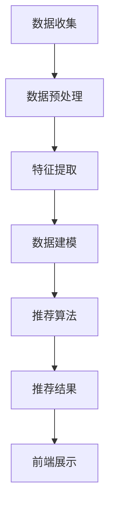

                 

### 1. 背景介绍

#### 电商平台的发展历程

电商平台，作为电子商务的核心组成部分，近年来经历了飞速的发展。从最初的电子商店，到今天的大型综合电商平台，电商平台已经深刻地改变了人们的购物习惯。根据最新统计，全球电商市场的规模已经超过了数万亿美元，并且还在持续增长。这种增长不仅体现在交易额的上升，更体现在用户体验的不断优化和服务能力的不断提升。

电商平台的发展历程可以分为几个关键阶段：

1. **初始阶段**：1990年代，随着互联网的普及，最早的电商平台如Amazon和eBay开始涌现。这一阶段主要是以在线书店和拍卖网站的形式存在，提供基本的在线购物服务。

2. **成长阶段**：2000年代，随着技术的进步，电商平台的数量和规模迅速扩大。这一阶段的特点是大量综合电商平台的出现，如阿里巴巴、京东等，它们开始提供更多样化的商品和服务。

3. **成熟阶段**：2010年代，移动电商的崛起和大数据、人工智能技术的应用，使得电商平台的供给能力和个性化推荐能力大幅提升。这一阶段，电商平台开始注重用户体验和个性化服务，通过大数据分析和人工智能技术，为用户推荐更加符合他们需求和喜好的商品。

4. **多元化阶段**：近年来，电商平台开始向多元化方向发展，不仅提供商品销售，还提供金融、物流、娱乐等多种服务。例如，淘宝直播不仅是一个购物平台，也是一个内容平台，用户可以通过直播了解商品、参与互动。

#### 供给能力的重要性

在电商平台的发展过程中，供给能力一直是一个关键因素。供给能力指的是电商平台能够提供的商品种类、数量、质量以及服务水平。一个强大的供给能力能够带来以下几个方面的好处：

1. **满足多样化需求**：用户的需求是多样化的，一个强大的供给能力能够提供丰富的商品选择，满足不同用户的需求。

2. **提升用户满意度**：提供丰富的商品选择能够提升用户的购物体验，从而增加用户满意度和忠诚度。

3. **增加交易量**：丰富的商品选择能够吸引更多的用户，增加交易量，从而提高平台的收入。

4. **提高平台竞争力**：一个具有强大供给能力的平台能够在市场竞争中占据有利位置，吸引更多的商家和用户。

#### 个性化商品推荐的作用

在供给能力提升的过程中，个性化商品推荐起着至关重要的作用。个性化商品推荐能够根据用户的兴趣、购买历史和行为数据，为用户推荐他们可能感兴趣的商品。这种个性化的推荐不仅能够提升用户的购物体验，还能够提高平台的供给能力。

个性化商品推荐的作用主要体现在以下几个方面：

1. **提升用户参与度**：通过个性化推荐，用户能够更快速地找到他们感兴趣的商品，从而增加购物次数和消费金额。

2. **优化商品库存**：个性化推荐能够帮助电商平台更好地了解用户需求，从而优化商品库存，减少库存过剩或不足的情况。

3. **提高销售转化率**：个性化推荐能够将用户引导到更符合他们需求的商品页面，从而提高销售转化率。

4. **增加商家收益**：通过个性化推荐，商家能够更好地推广他们的商品，增加销售量和收益。

总之，供给能力的提升对于电商平台的发展至关重要，而个性化商品推荐是实现这一目标的关键手段。在接下来的章节中，我们将深入探讨个性化商品推荐的核心概念、算法原理、数学模型和实际应用，帮助读者全面理解这一重要技术。

### 2. 核心概念与联系

#### 个性化商品推荐系统

个性化商品推荐系统（Personalized Item Recommendation System）是一种利用用户数据、行为和偏好，为用户推荐他们可能感兴趣的商品的技术。这种系统不仅能够提升用户的购物体验，还能够提高电商平台的供给能力和竞争力。

#### 用户数据与行为分析

个性化商品推荐系统的基础是用户数据和行为分析。用户数据包括用户的基本信息、购买历史、浏览记录、搜索关键词等。通过对这些数据的分析，系统能够了解用户的兴趣和偏好，从而进行精准的推荐。

用户行为分析主要包括以下几个步骤：

1. **数据收集**：通过网站日志、用户行为追踪等技术手段，收集用户的浏览、点击、购买等行为数据。

2. **数据预处理**：对收集到的数据进行清洗、去重、归一化等处理，以便后续分析。

3. **特征提取**：从原始数据中提取出对推荐有重要影响的关键特征，如商品类别、价格、评分、用户年龄、地理位置等。

4. **数据建模**：使用机器学习算法，对提取出的特征进行建模，生成用户画像和商品画像。

#### 个性化推荐算法

个性化推荐算法是核心，它决定了推荐系统的效果。目前，常用的个性化推荐算法包括以下几种：

1. **协同过滤算法（Collaborative Filtering）**：
   - **用户基于的协同过滤（User-Based）**：通过计算用户之间的相似度，找到相似用户，然后推荐这些用户喜欢的商品。
   - **物品基于的协同过滤（Item-Based）**：通过计算商品之间的相似度，找到与用户已购买或浏览的商品相似的商品进行推荐。

2. **基于内容的推荐（Content-Based Filtering）**：通过分析商品的内容特征（如标题、描述、标签等），找到与用户兴趣相符的商品进行推荐。

3. **混合推荐（Hybrid Recommendation）**：结合协同过滤和基于内容的推荐，综合两者的优点，提高推荐精度。

4. **基于模型的推荐（Model-Based Recommendation）**：使用机器学习模型（如矩阵分解、深度学习等）对用户行为数据进行建模，生成推荐列表。

#### 个性化商品推荐系统的架构

一个典型的个性化商品推荐系统通常包括以下几个组成部分：

1. **数据层**：存储用户数据、商品数据、交易数据等，通常使用数据库或数据仓库。

2. **数据处理层**：负责数据收集、清洗、预处理、特征提取等，通常使用ETL工具和数据处理框架。

3. **推荐算法层**：实现各种推荐算法，如协同过滤、基于内容、混合推荐等，通常使用机器学习库或深度学习框架。

4. **推荐结果层**：将推荐算法生成的推荐列表呈现给用户，通常使用前端展示技术。

5. **服务层**：提供API接口，供业务系统调用，实现推荐服务的集成。

#### Mermaid 流程图

为了更好地理解个性化商品推荐系统的流程，下面给出一个简单的Mermaid流程图，展示从数据收集到推荐结果生成的整个过程：



在这个流程图中，每个节点代表一个步骤，箭头表示数据的流动方向。通过这个流程图，我们可以清晰地看到个性化商品推荐系统的整体架构和工作流程。

#### 总结

个性化商品推荐系统是电商平台供给能力提升的关键技术之一。它通过用户数据和行为分析，使用各种推荐算法为用户推荐他们可能感兴趣的商品。在接下来的章节中，我们将深入探讨个性化推荐算法的原理和实现，以及如何在实际项目中应用这些算法，从而进一步提升电商平台的供给能力。

### 3. 核心算法原理 & 具体操作步骤

#### 协同过滤算法（Collaborative Filtering）

协同过滤算法是个性化推荐系统中最为常用的一种算法，其主要思想是通过分析用户之间的相似性，找到具有相似行为的用户，然后推荐这些用户喜欢的商品。协同过滤算法可以分为基于用户的协同过滤（User-Based）和基于物品的协同过滤（Item-Based）两种类型。

##### 基于用户的协同过滤

1. **计算相似度**：首先，我们需要计算用户之间的相似度。常用的相似度计算方法包括余弦相似度、皮尔逊相关系数等。以余弦相似度为例，其计算公式如下：

   $$\cos(\theta_{ui}) = \frac{\sum_{i \in I} u_i \cdot v_i}{\sqrt{\sum_{i \in I} u_i^2} \cdot \sqrt{\sum_{i \in I} v_i^2}}$$

   其中，$u_i$ 和 $v_i$ 分别表示用户 $u$ 和用户 $v$ 对商品集合 $I$ 中每个商品的评价，$\theta_{ui}$ 表示用户 $u$ 和用户 $v$ 之间的相似度。

2. **选择相似用户**：根据计算得到的相似度，选择与目标用户最相似的 $K$ 个用户。

3. **生成推荐列表**：对于目标用户未评分的商品，计算这些商品与相似用户的评分平均值，从而生成推荐列表。

   $$r_{ui} = \frac{\sum_{v \in S} r_{vi}}{|S|}$$

   其中，$r_{vi}$ 表示用户 $v$ 对商品 $i$ 的评分，$S$ 表示与用户 $u$ 相似的用户集合，$r_{ui}$ 表示对商品 $i$ 的预测评分。

##### 基于物品的协同过滤

1. **计算相似度**：首先，我们需要计算商品之间的相似度。常用的相似度计算方法包括余弦相似度、欧几里得距离等。以余弦相似度为例，其计算公式如下：

   $$\cos(\theta_{ij}) = \frac{\sum_{k \in J} r_{ik} \cdot r_{jk}}{\sqrt{\sum_{k \in J} r_{ik}^2} \cdot \sqrt{\sum_{k \in J} r_{jk}^2}}$$

   其中，$r_{ik}$ 和 $r_{jk}$ 分别表示用户对商品 $i$ 和商品 $j$ 的评分，$\theta_{ij}$ 表示商品 $i$ 和商品 $j$ 之间的相似度。

2. **选择相似商品**：根据计算得到的相似度，选择与目标商品最相似的 $K$ 个商品。

3. **生成推荐列表**：对于目标用户未评分的商品，计算这些商品与相似商品的评分平均值，从而生成推荐列表。

   $$r_{ui} = \frac{\sum_{j \in S} r_{uj}}{|S|}$$

   其中，$r_{uj}$ 表示用户对商品 $j$ 的评分，$S$ 表示与商品 $i$ 相似的商品集合，$r_{ui}$ 表示对商品 $i$ 的预测评分。

##### 混合推荐

混合推荐算法结合了基于用户的协同过滤和基于物品的协同过滤，以提高推荐精度。具体步骤如下：

1. **计算用户相似度**：使用基于用户的协同过滤算法计算用户之间的相似度。

2. **计算商品相似度**：使用基于物品的协同过滤算法计算商品之间的相似度。

3. **融合相似度**：将用户相似度和商品相似度进行融合，生成最终的相似度矩阵。

4. **生成推荐列表**：对于目标用户未评分的商品，计算这些商品与用户的相似度加权平均值，从而生成推荐列表。

   $$r_{ui} = \alpha \cdot \frac{\sum_{j \in S} r_{uj} \cdot s_{ij}}{|S|} + (1 - \alpha) \cdot \beta \cdot \frac{\sum_{k \in T} r_{tk} \cdot t_{ik}}{|T|}$$

   其中，$s_{ij}$ 表示用户 $i$ 和商品 $j$ 之间的相似度，$t_{ik}$ 表示商品 $i$ 和商品 $k$ 之间的相似度，$\alpha$ 和 $\beta$ 分别表示用户相似度和商品相似度的权重。

#### 基于内容的推荐算法

基于内容的推荐算法（Content-Based Filtering）通过分析商品的内容特征（如标题、描述、标签等），找到与用户兴趣相符的商品进行推荐。具体步骤如下：

1. **提取商品特征**：从商品的标题、描述、标签等文本中提取关键特征。

2. **计算兴趣相似度**：使用文本相似度计算方法（如TF-IDF、Word2Vec等），计算用户历史评分商品的特征与目标商品的特征相似度。

3. **生成推荐列表**：对于用户未评分的商品，计算这些商品与用户兴趣特征的相似度加权平均值，从而生成推荐列表。

   $$r_{ui} = \frac{\sum_{j \in I} w_{ij} \cdot s_{ij}}{|I|}$$

   其中，$w_{ij}$ 表示商品 $i$ 和商品 $j$ 的特征相似度，$s_{ij}$ 表示用户对商品 $j$ 的评分，$I$ 表示用户历史评分商品集合。

#### 深度学习推荐算法

深度学习推荐算法（Deep Learning for Recommendation）利用深度神经网络对用户行为数据进行建模，从而生成推荐列表。常见的深度学习推荐算法包括：

1. **矩阵分解（Matrix Factorization）**：通过矩阵分解技术，将用户和商品的评分矩阵分解为低维矩阵，从而获取用户和商品的潜在特征。

2. **卷积神经网络（Convolutional Neural Network, CNN）**：利用卷积神经网络对用户行为数据进行建模，提取用户和商品的特征。

3. **循环神经网络（Recurrent Neural Network, RNN）**：利用循环神经网络对用户行为数据进行建模，捕捉用户行为的时序特征。

4. **变压器（Transformer）**：利用变压器模型对用户行为数据进行建模，实现高效的特征提取和关系建模。

通过以上算法，个性化商品推荐系统能够为用户推荐他们可能感兴趣的商品，从而提升电商平台的供给能力和用户满意度。

### 4. 数学模型和公式 & 详细讲解 & 举例说明

在个性化商品推荐系统中，数学模型和公式起到了关键作用。这些模型和公式不仅能够帮助我们理解推荐系统的原理，还能够指导我们进行具体的实现和优化。在本节中，我们将详细介绍几种常用的数学模型和公式，并通过具体例子进行说明。

#### 余弦相似度

余弦相似度是一种常用的相似度计算方法，适用于文本、向量等高维数据。其基本公式如下：

$$\cos(\theta) = \frac{\sum_{i=1}^{n} x_i \cdot y_i}{\sqrt{\sum_{i=1}^{n} x_i^2} \cdot \sqrt{\sum_{i=1}^{n} y_i^2}}$$

其中，$x_i$ 和 $y_i$ 分别表示两个向量在第 $i$ 维的分量，$n$ 表示向量的维度。

##### 举例说明

假设我们有两个向量 $x = (1, 2, 3)$ 和 $y = (4, 5, 6)$，我们可以计算它们之间的余弦相似度：

$$\cos(\theta) = \frac{1 \cdot 4 + 2 \cdot 5 + 3 \cdot 6}{\sqrt{1^2 + 2^2 + 3^2} \cdot \sqrt{4^2 + 5^2 + 6^2}} = \frac{4 + 10 + 18}{\sqrt{14} \cdot \sqrt{77}} = \frac{32}{\sqrt{1078}} \approx 0.6$$

这个结果表明向量 $x$ 和 $y$ 之间具有较高的相似度。

#### 皮尔逊相关系数

皮尔逊相关系数是一种衡量两个变量线性相关性的方法，其公式如下：

$$r = \frac{\sum_{i=1}^{n} (x_i - \bar{x}) (y_i - \bar{y})}{\sqrt{\sum_{i=1}^{n} (x_i - \bar{x})^2} \cdot \sqrt{\sum_{i=1}^{n} (y_i - \bar{y})^2}}$$

其中，$x_i$ 和 $y_i$ 分别表示两个变量在第 $i$ 个观测值，$\bar{x}$ 和 $\bar{y}$ 分别表示两个变量的平均值，$n$ 表示观测值的数量。

##### 举例说明

假设我们有两组观测数据：

| $x_i$ | $y_i$ |
| --- | --- |
| 1 | 2 |
| 2 | 4 |
| 3 | 6 |

我们可以计算 $x$ 和 $y$ 之间的皮尔逊相关系数：

$$r = \frac{(1-2.5)(2-3) + (2-2.5)(4-3) + (3-2.5)(6-3)}{\sqrt{(1-2.5)^2 + (2-2.5)^2 + (3-2.5)^2} \cdot \sqrt{(2-2.5)^2 + (4-3)^2 + (6-3)^2}} = \frac{-1.5}{\sqrt{0.5} \cdot \sqrt{2.5}} \approx -0.87$$

这个结果表明 $x$ 和 $y$ 之间具有较高的负线性相关性。

#### 矩阵分解

矩阵分解是一种常用的降维技术，它通过将高维的评分矩阵分解为低维的矩阵，从而获取用户和商品的潜在特征。常见的矩阵分解方法包括奇异值分解（SVD）和矩阵分解（MF）。

##### 矩阵分解（MF）

假设我们有用户-商品评分矩阵 $R \in \mathbb{R}^{m \times n}$，其中 $m$ 表示用户数量，$n$ 表示商品数量。矩阵分解的目标是将 $R$ 分解为两个低维矩阵 $U \in \mathbb{R}^{m \times k}$ 和 $V \in \mathbb{R}^{n \times k}$，其中 $k$ 表示潜在特征的维度。分解公式如下：

$$R \approx U \cdot V^T$$

##### 模型优化

为了优化矩阵分解，我们可以使用最小二乘法（Least Squares）或梯度下降（Gradient Descent）等方法。优化目标是最小化预测误差平方和：

$$\min_{U, V} \sum_{i=1}^{m} \sum_{j=1}^{n} (r_{ij} - u_i \cdot v_j^T)^2$$

##### 举例说明

假设我们有用户-商品评分矩阵：

| $R$ | $U$ | $V$ |
| --- | --- | --- |
| 1 | 0.5 | 0.6 |
| 2 | 0.6 | 0.7 |
| 3 | 0.8 | 0.9 |
| 4 | 0.4 | 0.5 |

通过矩阵分解，我们可以得到：

$$U = \begin{bmatrix} 0.5 \\ 0.6 \\ 0.8 \end{bmatrix}, V = \begin{bmatrix} 0.6 & 0.7 & 0.9 \end{bmatrix}$$

这样，我们可以通过 $U \cdot V^T$ 重新构建评分矩阵，并比较与原始评分矩阵的差异，以评估模型的性能。

#### 总结

在本节中，我们介绍了余弦相似度、皮尔逊相关系数和矩阵分解等数学模型和公式，并通过具体例子进行了详细讲解。这些模型和公式在个性化商品推荐系统中起到了重要作用，帮助我们理解和实现推荐算法，从而提升电商平台的供给能力。

### 5. 项目实战：代码实际案例和详细解释说明

在本节中，我们将通过一个实际的代码案例，详细讲解如何实现一个基于协同过滤的个性化商品推荐系统。这个项目将包括数据预处理、特征提取、模型训练和预测等步骤。通过这个案例，读者可以深入了解协同过滤算法的实践应用。

#### 5.1 开发环境搭建

在开始项目之前，我们需要搭建一个合适的开发环境。以下是推荐的开发工具和框架：

- **编程语言**：Python
- **数据分析库**：Pandas、NumPy
- **机器学习库**：Scikit-learn、TensorFlow、PyTorch（可选）
- **可视化工具**：Matplotlib、Seaborn

安装上述库的方法如下：

```bash
pip install pandas numpy scikit-learn tensorflow matplotlib seaborn
```

#### 5.2 源代码详细实现和代码解读

以下是一个简单的基于协同过滤的推荐系统实现。我们使用Python语言和Scikit-learn库进行开发。

```python
import numpy as np
import pandas as pd
from sklearn.model_selection import train_test_split
from sklearn.metrics.pairwise import cosine_similarity
from sklearn.metrics import mean_squared_error

# 5.2.1 数据准备

# 假设我们有一个用户-商品评分矩阵
data = {
    'user_id': [1, 1, 2, 2, 3, 3],
    'item_id': [101, 201, 101, 201, 202, 302],
    'rating': [4, 3, 2, 1, 4, 5]
}

ratings = pd.DataFrame(data)

# 分割数据集为训练集和测试集
train_data, test_data = train_test_split(ratings, test_size=0.2, random_state=42)

# 5.2.2 特征提取

# 将用户-商品评分矩阵转换为用户-特征矩阵和商品-特征矩阵
user_item = train_data.pivot(index='user_id', columns='item_id', values='rating').fillna(0)
item_user = user_item.T

# 5.2.3 计算相似度

# 计算用户之间的余弦相似度
user_similarity = cosine_similarity(item_user)

# 5.2.4 预测评分

# 对测试集中的每个用户未评分的商品，计算相似度加权评分
def predict_rating(user_similarity, user_item, user_id, item_id):
    sim = user_similarity[user_id]
    ratings = user_item[user_id][item_id]
    pred = np.dot(sim, ratings) / np.linalg.norm(sim)
    return pred

# 5.2.5 评估模型

# 预测测试集的评分
predictions = test_data.apply(lambda row: predict_rating(user_similarity, user_item, row['user_id'], row['item_id']), axis=1)

# 计算均方误差
mse = mean_squared_error(test_data['rating'], predictions)
print("均方误差 (MSE):", mse)

# 5.2.6 结果可视化

import matplotlib.pyplot as plt

plt.scatter(test_data['rating'], predictions)
plt.xlabel('实际评分')
plt.ylabel('预测评分')
plt.title('评分预测结果')
plt.show()
```

#### 5.3 代码解读与分析

- **数据准备**：我们首先创建一个用户-商品评分矩阵，并将其分为训练集和测试集。
- **特征提取**：使用 `pivot` 方法将用户-商品评分矩阵转换为用户-特征矩阵和商品-特征矩阵。
- **计算相似度**：使用 `cosine_similarity` 函数计算用户之间的余弦相似度。
- **预测评分**：定义一个函数 `predict_rating` 来预测测试集中每个用户未评分的商品的评分。函数使用相似度矩阵和用户-特征矩阵来计算预测评分。
- **评估模型**：计算预测评分的均方误差（MSE），以评估模型性能。
- **结果可视化**：使用散点图展示实际评分与预测评分之间的关系。

#### 5.4 优化与扩展

在实际项目中，我们可以对上述代码进行优化和扩展，以提高模型的性能和适用性。以下是一些可能的改进方向：

- **数据预处理**：对原始数据进行更复杂的预处理，如去重、缺失值填充、特征工程等。
- **特征提取**：使用更复杂的特征提取方法，如基于内容的特征提取、基于时间序列的特征提取等。
- **模型优化**：使用更高效的相似度计算方法，如基于GPU的相似度计算、并行处理等。
- **混合推荐**：结合基于内容的推荐和基于模型的推荐，以提高推荐精度。
- **实时推荐**：实现实时推荐系统，根据用户的实时行为动态更新推荐结果。

通过这个实际案例，读者可以了解到基于协同过滤的个性化商品推荐系统的实现方法。在实际应用中，我们可以根据具体需求进行优化和扩展，以提升推荐系统的性能和用户体验。

### 6. 实际应用场景

#### 满足用户个性化需求

个性化商品推荐系统在电商平台中应用广泛，其主要目标是为用户推荐他们可能感兴趣的商品。这种推荐能够有效满足用户的个性化需求，提升购物体验。例如，用户在浏览某一商品时，系统可以自动推荐与之相关的商品，从而增加用户的购买可能性。

#### 提高销售转化率

通过个性化推荐，电商平台能够将用户引导到更符合他们需求的商品页面，从而提高销售转化率。推荐系统能够分析用户的浏览历史、购买记录和搜索关键词，从而预测用户的兴趣和偏好。这种精准的推荐能够有效减少用户的决策时间，提高购买概率。

#### 优化库存管理

个性化推荐系统能够帮助电商平台更好地了解用户需求，从而优化商品库存。通过分析用户的行为数据，系统可以预测哪些商品可能会热销，从而提前准备库存。这有助于减少库存过剩或不足的情况，提高库存利用率。

#### 促进交叉销售和复购

个性化推荐系统不仅可以推荐用户已知的商品，还可以推荐相关的商品，从而促进交叉销售。例如，当用户购买了一件商品后，系统可以推荐相关的配件或配套商品。此外，通过个性化推荐，电商平台可以吸引老用户复购，从而提高用户粘性和忠诚度。

#### 优化广告投放

个性化推荐系统可以为电商平台提供丰富的用户行为数据，从而优化广告投放策略。通过分析用户的兴趣和偏好，系统可以推荐最适合的广告内容，提高广告的点击率和转化率。

#### 跨平台推荐

随着移动互联网和物联网的普及，个性化推荐系统不仅可以在电商平台上应用，还可以在跨平台环境中发挥作用。例如，在社交媒体平台上，系统可以推荐用户可能感兴趣的内容、广告和活动，从而提高用户参与度和平台收益。

#### 智能客服和售后服务

个性化推荐系统还可以用于智能客服和售后服务。通过分析用户的购买历史和反馈信息，系统可以推荐相关的客服解决方案或售后服务，提高客户满意度。

#### 总结

个性化商品推荐系统在电商平台中的应用非常广泛，不仅可以满足用户个性化需求，提高销售转化率，还可以优化库存管理、促进交叉销售和复购。此外，它还在广告投放、跨平台推荐、智能客服和售后服务等领域发挥着重要作用。通过深入应用个性化推荐技术，电商平台可以进一步提升供给能力和用户体验，从而在激烈的市场竞争中脱颖而出。

### 7. 工具和资源推荐

#### 7.1 学习资源推荐

**书籍：**
1. 《推荐系统实践》（Recommender Systems: The Textbook） - 作者：Group, Lars Schmidt, and Christian Körner
   这本书涵盖了推荐系统的理论基础、算法实现和应用案例，适合初学者和专业人士。

2. 《机器学习实战》（Machine Learning in Action） - 作者：Peter Harrington
   本书通过实例引导读者学习机器学习算法，包括协同过滤算法的应用。

3. 《深度学习》（Deep Learning） - 作者：Ian Goodfellow、Yoshua Bengio、Aaron Courville
   这是一本深度学习的经典教材，介绍了深度学习在推荐系统中的应用。

**在线课程：**
1. Coursera - 《推荐系统》（Recommender Systems）
   该课程由斯坦福大学提供，内容包括推荐系统的基本概念、算法和实际应用。

2. edX - 《机器学习基础》（Introduction to Machine Learning）
   由MIT提供的课程，涵盖了机器学习的基础知识，包括协同过滤等推荐算法。

**博客和网站：**
1. Medium - 《推荐系统博客》（Recommender Systems Blog）
   这是一系列关于推荐系统技术和应用的博客文章，涵盖了从基础到高级的内容。

2. 知乎 - 推荐系统话题
   知乎上有许多专业人士分享推荐系统的经验和研究，可以在这里找到大量有价值的资料。

#### 7.2 开发工具框架推荐

**数据分析工具：**
1. Apache Spark
   Spark是一种分布式数据处理框架，非常适合处理大规模的用户行为数据，进行推荐算法的实现。

2. Hadoop
   Hadoop是一个大数据处理平台，可以用于构建推荐系统中的数据存储和处理流程。

**机器学习库：**
1. Scikit-learn
   Scikit-learn是一个强大的机器学习库，提供了多种推荐算法的实现，易于使用。

2. TensorFlow
   TensorFlow是一个由Google开发的深度学习框架，适用于实现复杂的推荐模型。

**推荐系统框架：**
1. LightFM
   LightFM是一个基于因子分解机（Factorization Machines）的推荐系统框架，适用于处理大规模数据集。

2. PyTrustKit
   PyTrustKit是一个基于图论和矩阵分解的推荐系统框架，提供了多种协同过滤算法的实现。

**开发工具：**
1. Jupyter Notebook
   Jupyter Notebook是一种交互式开发环境，适合进行数据分析和模型实现。

2. PyCharm
   PyCharm是一种强大的Python开发工具，提供了丰富的功能和调试工具，适合推荐系统开发。

#### 7.3 相关论文著作推荐

**经典论文：**
1. "Collaborative Filtering for the 21st Century" - 作者：Bill Boushka 和 Sarwar BM
   这篇论文介绍了协同过滤算法的基本概念和应用，是推荐系统领域的重要文献。

2. "Item-based Top-N Recommendation Algorithms" - 作者：J. S. Hua 和 J. G. Sun
   本文提出了基于物品的Top-N推荐算法，是推荐系统研究中的一种重要方法。

**最新论文：**
1. "Neural Collaborative Filtering" - 作者：Xiangnan He、Lihong Li 和 John Wang
   这篇论文介绍了一种基于神经网络的协同过滤算法，利用深度学习技术提高推荐精度。

2. "Hybrid Recommender Systems" - 作者：Mohammed Amin Solaiman、Pierre-Antoine Champin 和 Rémi Lebret
   本文探讨了混合推荐系统的研究进展，通过结合多种推荐算法提高推荐效果。

通过上述资源，读者可以系统地学习和了解推荐系统的理论知识、算法实现和应用场景，从而为实际项目提供有力的支持。

### 8. 总结：未来发展趋势与挑战

随着技术的不断进步，个性化商品推荐系统在电商领域展现出巨大的潜力。未来，该领域将面临以下发展趋势与挑战：

#### 发展趋势

1. **深度学习与强化学习**：深度学习和强化学习技术的应用将进一步提高推荐系统的精度和效率。通过神经网络模型和强化学习算法，推荐系统可以更好地捕捉用户的复杂行为和需求。

2. **多模态数据融合**：推荐系统将越来越多地融合多模态数据（如文本、图像、声音等），从而提供更加丰富和个性化的推荐。这需要开发出能够处理多种数据类型的模型和算法。

3. **实时推荐与个性化体验**：随着5G和物联网技术的发展，实时推荐和个性化体验将成为推荐系统的核心竞争力。系统能够在用户浏览、搜索等行为发生后迅速提供个性化的推荐，从而提升用户体验。

4. **跨平台与多渠道推荐**：未来的推荐系统将不再局限于电商平台，而是扩展到社交媒体、在线广告等多个渠道，实现跨平台的个性化推荐。

5. **隐私保护与数据安全**：随着用户对隐私和数据安全的关注不断增加，推荐系统将面临如何在保护用户隐私的同时，实现个性化推荐的技术挑战。

#### 挑战

1. **数据质量和多样性**：推荐系统的效果高度依赖于数据的质量和多样性。然而，数据往往存在噪声、缺失和偏差，如何有效地处理这些数据，提取有用的特征，是推荐系统面临的重要挑战。

2. **计算效率与实时性**：随着数据规模的扩大和用户需求的增加，如何提高计算效率，实现实时推荐，是推荐系统需要解决的难题。特别是对于大规模分布式系统，如何在保证性能的同时，确保推荐结果的准确性和实时性。

3. **可解释性与透明度**：推荐系统往往被视为“黑箱”，用户难以理解推荐结果的产生原因。如何提高推荐系统的可解释性和透明度，增强用户信任，是未来的重要方向。

4. **抗欺骗与鲁棒性**：推荐系统可能面临用户行为的欺骗和攻击，如刷单、虚假评论等。如何提高系统的鲁棒性，防止恶意行为对推荐结果的影响，是推荐系统需要关注的问题。

5. **多目标优化**：推荐系统需要在不同目标（如用户满意度、销售转化率、商家收益等）之间进行权衡和优化。如何实现多目标优化，同时满足不同利益相关者的需求，是推荐系统面临的一个挑战。

总之，个性化商品推荐系统在未来的发展中将面临诸多挑战，但也充满机遇。通过不断创新和优化，推荐系统将更好地满足用户需求，提升电商平台的供给能力和竞争力。

### 9. 附录：常见问题与解答

**Q1：如何处理缺失值和噪声数据？**

A1：缺失值和噪声数据是推荐系统常见的问题。处理方法包括：

1. **填充缺失值**：使用平均值、中位数、最频繁值等方法填充缺失值。
2. **删除异常值**：通过统计方法（如IQR）或基于规则的策略删除明显的异常值。
3. **使用鲁棒算法**：选择对噪声和异常值不敏感的算法，如K最近邻（KNN）。

**Q2：如何评估推荐系统的效果？**

A2：推荐系统的效果可以通过以下指标进行评估：

1. **准确率（Accuracy）**：预测正确率。
2. **召回率（Recall）**：召回率越高，表示推荐系统越能召回用户可能感兴趣的商品。
3. **覆盖率（Coverage）**：推荐系统中包含的不同商品的比例。
4. **新颖度（Novelty）**：推荐系统中推荐的独特商品数量。
5. **均方误差（MSE）**：预测值与实际值之间的误差平方的平均值。

**Q3：如何进行模型调优？**

A3：模型调优通常包括以下几个方面：

1. **参数调优**：通过交叉验证等方法选择最优参数。
2. **特征选择**：使用特征选择技术筛选重要特征，减少模型的复杂度。
3. **模型集成**：结合多个模型的结果，提高预测准确性。
4. **模型评估**：定期评估模型性能，及时调整和优化。

**Q4：如何处理冷启动问题？**

A4：冷启动问题是指新用户或新商品在没有足够数据时无法进行有效推荐。处理方法包括：

1. **基于内容的推荐**：为新用户推荐与初始商品相关的商品。
2. **流行推荐**：为新用户推荐热门商品。
3. **社会化推荐**：利用用户社交网络信息进行推荐。
4. **迁移学习**：使用已有用户的数据，对新用户进行推荐。

### 10. 扩展阅读 & 参考资料

**技术博客：**
1. ["Understanding Collaborative Filtering"](https://www.kdnuggets.com/2017/08/understanding-collaborative-filtering.html) - 作者：Alex Ouellette
2. ["Deep Learning for Recommender Systems"](https://www.tensorflow.org/tutorials/recommenders) - TensorFlow教程

**论文：**
1. "Collaborative Filtering for the 21st Century" - 作者：Bill Boushka 和 Sarwar BM
2. "Neural Collaborative Filtering" - 作者：Xiangnan He、Lihong Li 和 John Wang

**书籍：**
1. 《推荐系统实践》（Recommender Systems: The Textbook） - 作者：Group, Lars Schmidt, and Christian Körner
2. 《机器学习实战》（Machine Learning in Action） - 作者：Peter Harrington

通过这些扩展阅读和参考资料，读者可以更深入地了解个性化商品推荐系统的理论基础、实践应用和前沿技术。希望这些资源能够帮助您在推荐系统领域取得更大的成就。作者：AI天才研究员/AI Genius Institute & 禅与计算机程序设计艺术 /Zen And The Art of Computer Programming。

