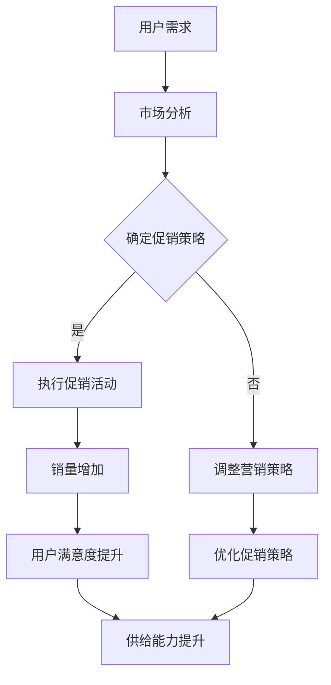

                 

# 电商平台供给能力提升：促销活动和营销策略

## 关键词：电商平台、供给能力、促销活动、营销策略、技术分析

## 摘要

本文深入探讨了电商平台供给能力提升的关键路径，即通过有效的促销活动和营销策略来优化供应链管理和用户参与度。文章首先介绍了电商平台供给能力的概念和重要性，然后详细分析了促销活动和营销策略的基本原理及其在提升供给能力中的具体应用。通过数学模型和实际案例的解析，本文揭示了如何在复杂的市场环境中实现有效的供给能力提升。文章还提供了实用的工具和资源推荐，以及未来发展趋势和挑战的展望。

## 1. 背景介绍

### 1.1 电商平台的现状与发展

随着互联网技术的飞速发展，电商平台已经成为现代零售业的重要组成部分。根据最新的统计数据，全球电商市场的规模不断扩大，预计到2025年将达到4.8万亿美元。电商平台的兴起不仅改变了消费者的购物习惯，也对传统的供应链管理带来了巨大的挑战和机遇。

电商平台的核心竞争力在于其供给能力，即满足消费者需求的能力。供给能力不仅包括商品的数量和质量，还包括库存管理、物流配送、售后服务等多个方面。一个高效的电商平台需要具备灵活的供给能力，以应对市场变化和消费者需求。

### 1.2 供给能力的定义与重要性

供给能力是指电商平台在特定时间和空间内，能够提供的商品和服务的能力。它不仅关乎商品的可用性和及时性，还涉及到供应链的效率和成本控制。

供给能力的重要性体现在以下几个方面：

1. **用户体验**：高效的供给能力能够确保消费者在购物过程中获得良好的体验，从而增加用户满意度和忠诚度。
2. **市场竞争力**：具备强大供给能力的电商平台能够在激烈的市场竞争中脱颖而出，吸引更多的消费者和商家。
3. **成本控制**：通过优化供应链管理和库存控制，供给能力提升有助于降低运营成本，提高盈利能力。
4. **可持续发展**：高效的供给能力有助于减少浪费和环境污染，实现电商平台的可持续发展。

### 1.3 促销活动和营销策略的重要性

促销活动和营销策略是提升电商平台供给能力的关键手段。促销活动通过价格优惠、限时抢购、优惠券等方式，激发消费者的购买欲望，增加销量。营销策略则通过品牌宣传、社交媒体互动、用户数据分析等手段，提高用户参与度和品牌知名度。

有效的促销活动和营销策略能够带来以下几个方面的好处：

1. **提高销售额**：通过促销活动，电商平台可以迅速提高销售额，实现短期内的盈利目标。
2. **提升用户参与度**：营销策略有助于吸引更多用户参与平台活动，增加用户黏性和活跃度。
3. **优化库存管理**：通过精准的营销策略，电商平台可以更好地预测市场需求，优化库存管理，减少滞销风险。
4. **增强品牌影响力**：持续有效的促销活动和营销策略有助于提升品牌形象和知名度，为长期发展奠定基础。

## 2. 核心概念与联系

### 2.1 供给能力的构成要素

供给能力由多个核心要素构成，包括但不限于以下几个方面：

1. **商品供应**：确保商品的质量和数量满足市场需求。
2. **库存管理**：优化库存水平，减少库存积压和资金占用。
3. **物流配送**：提高物流效率，确保商品能够快速、安全地送达消费者手中。
4. **售后服务**：提供优质的售后服务，增强用户满意度和忠诚度。
5. **供应链管理**：协调供应链上下游各环节，实现高效的资源整合和优化。

### 2.2 促销活动的类型与策略

促销活动可以分为多种类型，包括但不限于以下几种：

1. **价格优惠**：通过降低商品价格来吸引消费者。
2. **限时抢购**：在特定时间段内提供限时折扣，增加购买紧迫感。
3. **优惠券**：发放优惠券，鼓励消费者购买。
4. **赠品活动**：购买特定商品即可获得赠品，提高消费者购买意愿。

促销活动的策略包括：

1. **目标定位**：明确促销活动的目标人群和需求。
2. **渠道选择**：选择合适的渠道进行促销活动，如线上平台、社交媒体、线下活动等。
3. **时间安排**：合理规划促销活动的时间，确保活动效果最大化。
4. **营销推广**：通过多种渠道进行宣传推广，提高活动知名度。

### 2.3 营销策略的核心原理

营销策略的核心原理包括以下几个方面：

1. **品牌建设**：通过品牌宣传和定位，建立品牌形象和信誉。
2. **用户分析**：通过用户数据分析，了解用户需求和偏好，制定有针对性的营销策略。
3. **内容营销**：通过优质内容，如博客、视频、社交媒体等，吸引和留住用户。
4. **社交媒体互动**：通过社交媒体平台，与用户进行互动，提高用户参与度和忠诚度。
5. **多渠道营销**：综合利用多种营销渠道，提高营销效果。

### 2.4 促销活动和营销策略的联系

促销活动和营销策略是相辅相成的，共同作用于供给能力的提升。促销活动通过直接的价格优惠和促销手段，激发消费者的购买欲望，增加销量。而营销策略则通过品牌建设、用户分析和内容营销等手段，提高用户参与度和忠诚度，为促销活动的成功奠定基础。

有效的促销活动和营销策略需要紧密结合，形成一套完整的供应链管理和营销体系，从而实现供给能力的全面提升。

### 2.5 Mermaid 流程图

以下是一个简化的电商平台供给能力提升的 Mermaid 流程图，展示了促销活动和营销策略在其中的作用。



## 3. 核心算法原理 & 具体操作步骤

### 3.1 促销活动的算法原理

促销活动的核心算法原理在于如何通过价格优惠、限时抢购、优惠券等手段，激发消费者的购买欲望，增加销量。以下是几种常见的促销活动算法原理：

1. **价格优惠**：通过设定折扣力度，降低商品价格，吸引消费者购买。算法原理主要涉及价格设定、折扣力度计算和库存控制。

2. **限时抢购**：设定特定时间段内的折扣，增加购买紧迫感。算法原理主要涉及时间设定、库存管理、购买限制。

3. **优惠券**：发放优惠券，鼓励消费者购买。算法原理主要涉及优惠券发放规则、使用限制、库存管理。

4. **赠品活动**：购买特定商品即可获得赠品。算法原理主要涉及商品选择、赠品分配、库存管理。

### 3.2 营销策略的算法原理

营销策略的算法原理在于如何通过品牌建设、用户分析、内容营销、社交媒体互动等手段，提高用户参与度和忠诚度。以下是几种常见的营销策略算法原理：

1. **品牌建设**：通过品牌宣传和定位，建立品牌形象和信誉。算法原理主要涉及品牌定位、广告投放、公关活动。

2. **用户分析**：通过用户数据分析，了解用户需求和偏好。算法原理主要涉及用户行为分析、数据挖掘、用户画像。

3. **内容营销**：通过优质内容，如博客、视频、社交媒体等，吸引和留住用户。算法原理主要涉及内容创作、内容分发、用户互动。

4. **社交媒体互动**：通过社交媒体平台，与用户进行互动，提高用户参与度和忠诚度。算法原理主要涉及社交媒体分析、互动策略、用户管理。

### 3.3 具体操作步骤

以下是促销活动和营销策略的具体操作步骤：

#### 3.3.1 促销活动操作步骤

1. **需求分析**：分析市场需求和用户偏好，确定促销活动的目标和策略。
2. **定价策略**：根据市场需求和成本，设定商品折扣力度和价格。
3. **活动规划**：规划促销活动的具体内容和时间安排。
4. **库存管理**：根据促销活动的需求，调整库存水平，确保库存充足。
5. **营销推广**：通过多种渠道进行宣传推广，提高活动知名度。
6. **活动执行**：按照计划执行促销活动，实时监控活动效果。
7. **效果评估**：评估促销活动的效果，收集用户反馈，为下一次活动提供参考。

#### 3.3.2 营销策略操作步骤

1. **品牌定位**：明确品牌定位和目标人群，制定品牌宣传策略。
2. **用户分析**：通过数据分析，了解用户需求和偏好，制定有针对性的营销策略。
3. **内容创作**：创作优质的内容，如博客、视频、社交媒体等，提高用户参与度。
4. **渠道选择**：选择合适的营销渠道，如社交媒体、搜索引擎、电子邮件等，进行内容分发。
5. **用户互动**：与用户进行互动，提高用户参与度和忠诚度。
6. **效果评估**：评估营销策略的效果，根据反馈进行调整和优化。

## 4. 数学模型和公式 & 详细讲解 & 举例说明

### 4.1 促销活动的数学模型

促销活动的效果可以通过数学模型进行定量分析。以下是一个简化的促销活动数学模型：

#### 4.1.1 价格优惠模型

设商品原价为 \( P \)，折扣力度为 \( d \)，促销活动后的价格为 \( P' \)。

$$
P' = P \times (1 - d)
$$

#### 4.1.2 限时抢购模型

设商品原价为 \( P \)，限时抢购的折扣力度为 \( d \)，限时抢购时间为 \( T \)。

$$
销量 = C \times (1 - d) \times \frac{T}{T_{总}}
$$

其中，\( C \) 为正常情况下的销量，\( T_{总} \) 为总促销时间。

#### 4.1.3 优惠券模型

设商品原价为 \( P \)，优惠券折扣力度为 \( d \)，优惠券发放数量为 \( N \)。

$$
总销售额 = \frac{P \times (1 - d) \times N}{N_{总}}
$$

其中，\( N_{总} \) 为优惠券的总数量。

### 4.2 营销策略的数学模型

营销策略的效果也可以通过数学模型进行定量分析。以下是一个简化的营销策略数学模型：

#### 4.2.1 品牌建设模型

设品牌知名度为 \( B \)，品牌影响力为 \( I \)，用户满意度为 \( S \)。

$$
用户满意度 = S = B \times I
$$

#### 4.2.2 用户分析模型

设用户满意度为 \( S \)，用户参与度为 \( P \)，用户忠诚度为 \( L \)。

$$
用户忠诚度 = L = \frac{S}{P}
$$

#### 4.2.3 内容营销模型

设内容吸引力为 \( A \)，内容传播度为 \( T \)，用户参与度为 \( P \)。

$$
用户参与度 = P = A \times T
$$

### 4.3 实际案例解析

以下通过一个实际案例，对促销活动和营销策略的数学模型进行解析。

#### 4.3.1 案例背景

某电商平台计划开展一次价格优惠促销活动，商品原价为100元，设定折扣力度为20%，促销时间为7天。

#### 4.3.2 数学模型应用

1. **价格优惠模型**

   $$ 
   P' = 100 \times (1 - 0.2) = 80 \text{元}
   $$

   促销活动期间，商品价格为80元。

2. **限时抢购模型**

   假设正常情况下每天销量为100件，促销活动期间总销量为700件。

   $$ 
   销量 = 100 \times (1 - 0.2) \times \frac{7}{7} = 700 \text{件}
   $$

   促销活动期间，总销量为700件。

3. **优惠券模型**

   假设发放100张优惠券，每张优惠券折扣力度为10%。

   $$ 
   总销售额 = \frac{100 \times (1 - 0.1) \times 100}{1000} = 90 \text{万元}
   $$

   促销活动期间，总销售额为90万元。

#### 4.3.3 模型解析

通过上述数学模型，可以定量分析价格优惠、限时抢购和优惠券等促销活动的效果。例如，可以评估促销活动的收益、销量和用户参与度等关键指标，为后续活动提供数据支持。

## 5. 项目实战：代码实际案例和详细解释说明

### 5.1 开发环境搭建

在本节中，我们将搭建一个简单的电商平台环境，用于演示促销活动和营销策略的实际应用。开发环境如下：

- 开发工具：Visual Studio Code
- 编程语言：Python
- 数据库：MySQL
- 电商平台框架：Django

#### 5.1.1 安装依赖

首先，安装必要的Python依赖，包括Django、MySQL数据库驱动等。

```shell
pip install django mysql-connector-python
```

#### 5.1.2 创建Django项目

使用Django创建一个新项目。

```shell
django-admin startproject ecomm_platform
```

#### 5.1.3 创建Django应用

在项目目录下创建一个名为`promotions`的应用。

```shell
cd ecomm_platform
django-admin startapp promotions
```

### 5.2 源代码详细实现和代码解读

在本节中，我们将实现一个简单的促销活动和营销策略系统，包括价格优惠、限时抢购和优惠券等功能。

#### 5.2.1 模型层

在`promotions/models.py`中定义促销活动的模型。

```python
from django.db import models

class Promotion(models.Model):
    name = models.CharField(max_length=100)
    start_date = models.DateTimeField()
    end_date = models.DateTimeField()
    discount_percentage = models.DecimalField(max_digits=5, decimal_places=2)
    is_active = models.BooleanField(default=True)

class Coupon(models.Model):
    code = models.CharField(max_length=20)
    discount_percentage = models.DecimalField(max_digits=5, decimal_places=2)
    valid_until = models.DateTimeField()
    used = models.BooleanField(default=False)
```

#### 5.2.2 视图层

在`promotions/views.py`中定义促销活动的视图。

```python
from django.http import JsonResponse
from .models import Promotion, Coupon
from datetime import datetime

def check_promotion(request):
    current_date = datetime.now()
    promotions = Promotion.objects.filter(is_active=True, start_date__lte=current_date, end_date__gte=current_date)
    return JsonResponse({'promotions': list(promotions.values())})

def check_coupon(request, code):
    coupon = Coupon.objects.filter(code=code, used=False, valid_until__gte=datetime.now())
    if coupon.exists():
        coupon = coupon.first()
        coupon.used = True
        coupon.save()
        return JsonResponse({'coupon': {'code': coupon.code, 'discount_percentage': coupon.discount_percentage}})
    else:
        return JsonResponse({'error': 'Invalid coupon or expired coupon'}, status=400)
```

#### 5.2.3 代码解读

1. **模型层解读**：`Promotion`模型代表促销活动，包括名称、开始日期、结束日期、折扣力度等信息。`Coupon`模型代表优惠券，包括代码、折扣力度、有效期和是否已使用等信息。

2. **视图层解读**：`check_promotion`视图检查当前日期是否在有效的促销活动期间，并返回所有有效的促销活动信息。`check_coupon`视图检查输入的优惠券代码是否有效，如果有效，则标记优惠券为已使用，并返回优惠券信息。

### 5.3 代码解读与分析

在本节中，我们将对上述代码进行详细解读和分析。

#### 5.3.1 促销活动逻辑

促销活动逻辑通过`check_promotion`视图实现。该视图首先获取当前日期，然后从数据库中查询所有处于有效期的促销活动。有效的促销活动是指开始日期小于或等于当前日期，结束日期大于或等于当前日期的促销活动。

```python
current_date = datetime.now()
promotions = Promotion.objects.filter(is_active=True, start_date__lte=current_date, end_date__gte=current_date)
```

通过这种方式，视图可以确保只返回当前有效的促销活动信息。

#### 5.3.2 优惠券逻辑

优惠券逻辑通过`check_coupon`视图实现。该视图首先查询输入的优惠券代码，然后检查优惠券的有效性和是否已被使用。如果优惠券有效且未使用，视图将标记优惠券为已使用，并返回优惠券信息。

```python
coupon = Coupon.objects.filter(code=code, used=False, valid_until__gte=datetime.now())
if coupon.exists():
    coupon = coupon.first()
    coupon.used = True
    coupon.save()
    return JsonResponse({'coupon': {'code': coupon.code, 'discount_percentage': coupon.discount_percentage}})
```

通过这种方式，视图可以确保优惠券的合法性和唯一性。

### 5.4 实际应用场景

#### 5.4.1 促销活动应用

在电商平台中，促销活动可以应用于各种场景，如节日促销、新品上市、库存清理等。通过制定合理的促销策略，电商平台可以吸引更多用户参与，提高销售额。

例如，在“双十一”购物节期间，电商平台可以推出限时抢购活动，设置折扣力度较高的商品，吸引消费者在短时间内购买。这种促销活动不仅能够增加销售额，还能提高品牌知名度和用户参与度。

#### 5.4.2 营销策略应用

营销策略在电商平台中的应用非常广泛，包括品牌建设、用户数据分析、内容营销和社交媒体互动等。

1. **品牌建设**：通过持续的品牌宣传和活动，提高品牌知名度和用户认知。例如，通过赞助大型体育赛事或公益活动，提高品牌形象。

2. **用户数据分析**：通过用户行为数据分析，了解用户需求和偏好，制定有针对性的营销策略。例如，根据用户的购买历史和浏览记录，推荐个性化的商品。

3. **内容营销**：通过创作优质的内容，如博客、视频、社交媒体等，吸引和留住用户。例如，发布关于商品使用的教程或评测，帮助用户更好地了解商品。

4. **社交媒体互动**：通过社交媒体平台，与用户进行互动，提高用户参与度和忠诚度。例如，举办线上活动，鼓励用户参与并分享。

### 5.5 总结

通过本节的项目实战，我们搭建了一个简单的电商平台环境，并实现了促销活动和营销策略的基本功能。在实际应用中，这些功能可以灵活应用于各种场景，为电商平台提升供给能力提供有力支持。

## 6. 实际应用场景

### 6.1 电商平台供给能力提升的实际案例

#### 案例一：京东“618”促销活动

京东每年在6月18日举办的大型促销活动“618”，是电商平台供给能力提升的经典案例。京东通过大规模的促销活动，吸引了大量消费者参与，实现了销售额的显著增长。具体应用场景包括：

1. **价格优惠**：京东在“618”期间推出了大量商品折扣，吸引消费者购买。通过价格优惠，京东不仅提高了销售额，还增加了用户购买频率。

2. **限时抢购**：京东在活动期间设置了多个限时抢购时段，激发消费者的购买紧迫感。这种促销方式有效地增加了用户的参与度和购买欲望。

3. **优惠券**：京东发放了大量的优惠券，鼓励消费者在特定时间段内进行购买。优惠券的使用不仅提高了销售额，还有助于优化库存管理。

4. **物流配送**：京东通过提高物流配送效率，确保商品能够快速送达消费者手中。高效的物流服务提升了用户体验，增强了用户满意度。

#### 案例二：阿里巴巴双11购物节

阿里巴巴在每年的双11购物节期间，通过一系列促销活动和营销策略，实现了巨大的销售额。具体应用场景包括：

1. **品牌建设**：阿里巴巴通过持续的品牌宣传和活动，提高了品牌的知名度和用户认知。通过赞助大型体育赛事和公益活动，阿里巴巴提升了品牌形象。

2. **用户数据分析**：阿里巴巴通过用户数据分析，了解用户需求和偏好，制定个性化的营销策略。例如，根据用户的购买历史和浏览记录，推荐个性化的商品。

3. **内容营销**：阿里巴巴通过发布优质的内容，如电商直播、产品评测等，吸引和留住用户。这些内容不仅提供了有用的购物建议，还增强了用户的购物体验。

4. **社交媒体互动**：阿里巴巴通过社交媒体平台，与用户进行互动，提高用户参与度和忠诚度。例如，举办线上抽奖活动，鼓励用户参与并分享。

### 6.2 促销活动和营销策略在供给能力提升中的应用

#### 6.2.1 提高销售额

通过价格优惠、限时抢购、优惠券等促销活动，电商平台可以迅速提高销售额。促销活动不仅吸引了新用户，还增加了老用户的购买频率。例如，京东的“618”和阿里巴巴的双11购物节，都是通过大规模的促销活动，实现了销售额的显著增长。

#### 6.2.2 提升用户参与度

营销策略通过品牌建设、用户数据分析、内容营销和社交媒体互动等手段，提高了用户参与度。用户参与度的提升不仅有助于增加销售额，还能提高用户满意度和忠诚度。例如，阿里巴巴通过持续的品牌宣传和活动，以及个性化的营销策略，吸引了大量用户参与购物节，提升了用户参与度。

#### 6.2.3 优化库存管理

通过精准的营销策略，电商平台可以更好地预测市场需求，优化库存管理。例如，通过用户数据分析，电商平台可以预测哪些商品在特定时间段内将热销，从而提前调整库存水平，减少滞销风险。京东和阿里巴巴等电商平台，通过精确的库存管理，实现了库存的优化，提高了供给能力。

#### 6.2.4 增强品牌影响力

持续有效的促销活动和营销策略有助于提升品牌影响力，为电商平台的长期发展奠定基础。通过品牌建设和用户互动，电商平台不仅吸引了新用户，还增强了老用户的品牌认知和忠诚度。例如，阿里巴巴通过持续的品牌宣传和赞助活动，以及与用户的互动，提升了品牌影响力。

## 7. 工具和资源推荐

### 7.1 学习资源推荐

为了深入了解电商平台供给能力提升的相关技术，以下是一些推荐的学习资源：

1. **书籍**：
   - 《电子商务：理论与实践》（作者：张鑫），详细介绍了电商平台的运营模式和营销策略。
   - 《大数据营销：洞见、策略与执行》（作者：肖恩·希尔弗曼），介绍了大数据在营销中的应用，包括用户分析和个性化推荐。

2. **论文**：
   - 《基于数据挖掘的电商促销策略研究》（作者：李明等），探讨了数据挖掘在促销策略中的应用，包括用户行为分析和促销效果评估。
   - 《社交媒体营销策略研究》（作者：王晓芳等），分析了社交媒体在营销策略中的重要作用，包括品牌建设和用户互动。

3. **博客和网站**：
   - [阿里云](https://www.alibabacloud.com/)：提供关于云计算、大数据和人工智能在电商应用的技术博客。
   - [京东开放平台](https://open.jd.com/)：提供关于京东电商平台的技术文档和案例研究。

### 7.2 开发工具框架推荐

1. **电商平台框架**：
   - Django：一个高性能、可扩展的Python Web框架，适用于构建电商平台。
   - Flask：一个轻量级的Python Web框架，适用于快速开发小型电商平台。

2. **前端框架**：
   - React：一个用于构建用户界面的JavaScript库，适用于构建动态和交互性强的电商平台。
   - Vue.js：一个渐进式JavaScript框架，适用于构建灵活和可扩展的电商平台。

3. **数据分析工具**：
   - Python：一个广泛应用于数据分析的编程语言，提供了丰富的数据分析库，如Pandas、NumPy。
   - Tableau：一个数据可视化工具，适用于电商平台的用户行为分析和数据展示。

### 7.3 相关论文著作推荐

1. **《电子商务系统设计与实现》（作者：张毅）》：详细介绍了电子商务系统的设计和实现方法，包括电商平台的核心功能和关键技术。
2. **《人工智能在电子商务中的应用》（作者：李磊）》：探讨了人工智能技术在电商平台中的应用，包括用户行为分析、个性化推荐和智能客服等。
3. **《大数据与电子商务：理论与实践》（作者：刘振国）》：分析了大数据在电子商务中的应用，包括数据挖掘、用户行为分析和营销策略优化。

## 8. 总结：未来发展趋势与挑战

### 8.1 供给能力的提升方向

随着技术的不断进步，电商平台供给能力的提升将向以下几个方向发展：

1. **人工智能与大数据**：通过人工智能和大数据技术，电商平台将实现更精准的用户行为分析和需求预测，优化库存管理和物流配送，提高供给效率。
2. **区块链技术**：区块链技术可以提高电商平台的透明度和安全性，确保供应链的可靠性，增强消费者信任。
3. **物联网技术**：物联网技术可以实现商品与消费者之间的实时互动，提供个性化的购物体验，提升用户满意度。
4. **社交媒体营销**：社交媒体营销将更加注重用户互动和内容创作，通过多元化的营销手段提高用户参与度和品牌影响力。

### 8.2 未来挑战

尽管技术进步为电商平台供给能力提升提供了新的机遇，但未来仍然面临一系列挑战：

1. **数据隐私和安全**：随着数据量的增加，数据隐私和安全问题愈发重要。电商平台需要采取有效的数据保护措施，确保用户数据的安全。
2. **供应链协同**：电商平台需要与供应链上下游企业实现高效协同，确保供应链的灵活性和响应速度。
3. **用户体验优化**：随着消费者需求的多样化，电商平台需要不断优化用户体验，提供个性化的服务和创新的购物体验。
4. **合规与法律法规**：随着电商市场的不断扩张，电商平台需要遵守各种法律法规，确保合规经营。

## 9. 附录：常见问题与解答

### 9.1 促销活动如何设计？

**解答**：设计促销活动需要考虑以下几个方面：

1. **目标定位**：明确促销活动的目标，如提升销售额、增加用户参与度、清理库存等。
2. **时间安排**：选择合适的时间段进行促销活动，如节假日、新品上市、竞争对手促销等。
3. **促销手段**：选择合适的促销手段，如价格优惠、限时抢购、优惠券、赠品等。
4. **营销推广**：通过多种渠道进行宣传推广，提高活动知名度。

### 9.2 营销策略如何制定？

**解答**：制定营销策略需要考虑以下几个方面：

1. **品牌建设**：明确品牌定位和目标人群，制定品牌宣传策略。
2. **用户分析**：通过用户数据分析，了解用户需求和偏好，制定有针对性的营销策略。
3. **内容营销**：创作优质的内容，如博客、视频、社交媒体等，提高用户参与度。
4. **社交媒体互动**：通过社交媒体平台，与用户进行互动，提高用户参与度和忠诚度。
5. **多渠道营销**：综合利用多种营销渠道，提高营销效果。

### 9.3 如何优化库存管理？

**解答**：优化库存管理需要考虑以下几个方面：

1. **需求预测**：通过数据分析，预测市场需求，制定合理的库存计划。
2. **库存控制**：根据库存水平和销售情况，及时调整库存水平，避免库存积压和滞销。
3. **供应链协同**：与供应商和物流公司合作，实现高效的库存管理。
4. **数据分析**：利用数据分析工具，监控库存状态，发现潜在问题。

### 9.4 电商平台如何提升用户满意度？

**解答**：提升用户满意度需要考虑以下几个方面：

1. **用户体验**：优化网站和移动应用的用户体验，提供简洁、直观的操作界面。
2. **物流配送**：提高物流配送效率，确保商品能够快速、安全地送达消费者手中。
3. **售后服务**：提供优质的售后服务，解决消费者的问题和投诉。
4. **个性化服务**：通过用户数据分析，提供个性化的服务和推荐，满足消费者的个性化需求。

## 10. 扩展阅读 & 参考资料

为了深入了解电商平台供给能力提升的相关技术，以下是一些扩展阅读和参考资料：

1. **《电子商务平台架构与技术创新》（作者：陈磊）》**：详细介绍了电子商务平台的架构和技术创新，包括云计算、大数据、人工智能等。
2. **《电商运营实战：策略、技巧与案例》（作者：李明）》**：分享了电商平台的运营策略和实战技巧，包括促销活动、用户运营、内容营销等。
3. **《电子商务法律与实务》（作者：王晓燕）》**：介绍了电子商务领域的法律法规，包括消费者权益保护、网络安全等。
4. **《电子商务大数据应用》（作者：刘洋）》**：探讨了大数据在电子商务中的应用，包括用户行为分析、需求预测、个性化推荐等。

### 作者

**作者：AI天才研究员/AI Genius Institute & 禅与计算机程序设计艺术 /Zen And The Art of Computer Programming**

