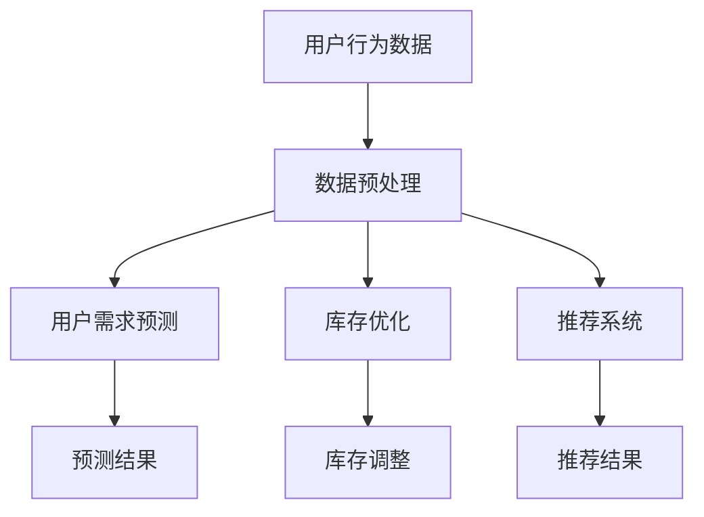

                 

# 电商平台供给能力提升：大数据分析的应用

## 关键词：
大数据分析、电商平台、供给能力、用户需求预测、库存优化、推荐系统

## 摘要：
本文旨在探讨大数据分析在电商平台供给能力提升中的应用。通过用户行为数据分析、需求预测、库存优化和推荐系统等核心技术手段，电商平台可以实现更精准的供给管理，提升用户满意度和平台竞争力。本文将从核心概念、算法原理、数学模型、实际案例等多个角度深入分析大数据分析技术在电商平台供给能力提升中的关键作用和未来发展挑战。

## 1. 背景介绍

随着互联网技术的飞速发展和电商行业的蓬勃兴起，电商平台在国民经济中的地位日益重要。然而，在竞争激烈的市场环境中，如何提升供给能力、满足用户需求、降低库存成本、提高运营效率，成为电商平台面临的重大挑战。

大数据分析作为一项先进的技术手段，能够通过对海量用户行为数据的挖掘和分析，为电商平台提供有价值的信息和决策支持。本文将围绕大数据分析在电商平台供给能力提升中的应用展开讨论，主要包括用户需求预测、库存优化、推荐系统和相关算法模型等方面的技术实现和案例分析。

## 2. 核心概念与联系

### 2.1 用户需求预测

用户需求预测是电商平台供给能力提升的重要基础。通过分析用户历史行为数据（如浏览记录、购买记录、评价等），可以识别出用户的兴趣偏好和潜在需求，从而为库存管理和商品推荐提供有力支持。

### 2.2 库存优化

库存优化是电商平台供给能力提升的关键环节。通过大数据分析，可以实现对库存水平的精准预测和动态调整，降低库存成本，提高资金利用率。

### 2.3 推荐系统

推荐系统是电商平台提升用户满意度和粘性的重要手段。通过分析用户行为数据，可以生成个性化的推荐列表，提高用户购买转化率和平台销售额。

### 2.4 数据流程图

以下是大数据分析在电商平台供给能力提升中的数据流程图：



## 3. 核心算法原理 & 具体操作步骤

### 3.1 用户需求预测算法

用户需求预测算法主要包括以下步骤：

1. 数据收集：收集用户历史行为数据，如浏览记录、购买记录、评价等。
2. 数据预处理：对数据进行清洗、去噪、填充缺失值等处理，保证数据质量。
3. 特征提取：提取与用户需求相关的特征，如用户兴趣标签、购买频率、评价分值等。
4. 模型训练：使用机器学习算法（如决策树、神经网络等）对特征进行建模，预测用户需求。
5. 预测评估：对预测结果进行评估，调整模型参数，优化预测效果。

### 3.2 库存优化算法

库存优化算法主要包括以下步骤：

1. 数据收集：收集商品销售数据、库存水平、促销活动等信息。
2. 数据预处理：对数据进行清洗、去噪、填充缺失值等处理，保证数据质量。
3. 特征提取：提取与库存水平相关的特征，如销售量、季节性、促销力度等。
4. 模型训练：使用机器学习算法（如线性回归、时间序列分析等）对特征进行建模，预测库存需求。
5. 库存调整：根据预测结果，对库存水平进行动态调整，降低库存成本。

### 3.3 推荐系统算法

推荐系统算法主要包括以下步骤：

1. 数据收集：收集用户历史行为数据，如浏览记录、购买记录、评价等。
2. 数据预处理：对数据进行清洗、去噪、填充缺失值等处理，保证数据质量。
3. 特征提取：提取与用户兴趣相关的特征，如用户标签、浏览频次、购买商品类别等。
4. 模型训练：使用协同过滤、矩阵分解等算法对特征进行建模，生成用户兴趣向量。
5. 推荐生成：根据用户兴趣向量，生成个性化推荐列表。

## 4. 数学模型和公式 & 详细讲解 & 举例说明

### 4.1 用户需求预测模型

假设用户需求预测模型为线性回归模型，其公式如下：

$$ y = \beta_0 + \beta_1x_1 + \beta_2x_2 + ... + \beta_nx_n $$

其中，$y$ 为用户需求预测值，$x_1, x_2, ..., x_n$ 为用户特征值，$\beta_0, \beta_1, \beta_2, ..., \beta_n$ 为模型参数。

以用户浏览频次和购买频率为例，说明如何提取特征值：

- $x_1$：用户浏览频次，取值为用户在一定时间范围内的浏览次数。
- $x_2$：用户购买频率，取值为用户在一定时间范围内的购买次数。

通过线性回归模型，可以预测用户需求：

$$ y = \beta_0 + \beta_1x_1 + \beta_2x_2 $$

### 4.2 库存优化模型

假设库存优化模型为时间序列模型，其公式如下：

$$ y_t = \alpha_t + \beta_t y_{t-1} + \epsilon_t $$

其中，$y_t$ 为第 $t$ 时刻的库存水平，$\alpha_t$ 为趋势项，$\beta_t$ 为季节性项，$\epsilon_t$ 为随机误差项。

以商品销售数据为例，说明如何提取特征值：

- $y_{t-1}$：第 $t-1$ 时刻的库存水平。
- $\alpha_t$：趋势项，表示商品库存水平随时间的变化趋势。
- $\beta_t$：季节性项，表示商品库存水平随季节性的变化趋势。

通过时间序列模型，可以预测商品库存水平：

$$ y_t = \alpha_t + \beta_t y_{t-1} + \epsilon_t $$

### 4.3 推荐系统模型

假设推荐系统模型为基于用户协同过滤的模型，其公式如下：

$$ r_{ij} = \frac{\sum_{k \in N_j} u_{ik} \cdot v_{kj}}{\sum_{k \in N_j} v_{kj}} $$

其中，$r_{ij}$ 为用户 $i$ 对商品 $j$ 的评分预测值，$u_{ik}$ 为用户 $i$ 对商品 $k$ 的评分，$v_{kj}$ 为商品 $k$ 对用户 $j$ 的评分。

以用户 $i$ 对商品 $j$ 的评分预测为例，说明如何计算评分预测值：

- $N_j$：用户 $j$ 的邻居集合，表示与用户 $j$ 相似度较高的用户集合。
- $u_{ik}$：用户 $i$ 对商品 $k$ 的评分。
- $v_{kj}$：商品 $k$ 对用户 $j$ 的评分。

通过基于用户协同过滤的模型，可以预测用户对商品的评分：

$$ r_{ij} = \frac{\sum_{k \in N_j} u_{ik} \cdot v_{kj}}{\sum_{k \in N_j} v_{kj}} $$

## 5. 项目实战：代码实际案例和详细解释说明

### 5.1 开发环境搭建

为了方便读者理解和实战，本文以 Python 语言为例，搭建开发环境。具体步骤如下：

1. 安装 Python（版本 3.6 或以上）。
2. 安装常用数据分析和机器学习库，如 NumPy、Pandas、Scikit-learn、Matplotlib 等。

### 5.2 源代码详细实现和代码解读

以下是一个简单的用户需求预测案例，包括数据收集、数据预处理、特征提取、模型训练和预测评估等步骤。

```python
# 导入相关库
import numpy as np
import pandas as pd
from sklearn.linear_model import LinearRegression
from sklearn.model_selection import train_test_split
from sklearn.metrics import mean_squared_error

# 5.2.1 数据收集
# 假设已收集用户历史行为数据，存放在文件 user_data.csv 中
data = pd.read_csv('user_data.csv')

# 5.2.2 数据预处理
# 对数据进行清洗、去噪、填充缺失值等处理
# ...

# 5.2.3 特征提取
# 提取用户浏览频次和购买频率作为特征
data['browse_frequency'] = data['browse_count'].values / data['days']
data['purchase_frequency'] = data['purchase_count'].values / data['days']

# 5.2.4 模型训练
# 使用线性回归模型进行训练
X = data[['browse_frequency', 'purchase_frequency']]
y = data['demand']
X_train, X_test, y_train, y_test = train_test_split(X, y, test_size=0.2, random_state=42)
model = LinearRegression()
model.fit(X_train, y_train)

# 5.2.5 预测评估
# 对预测结果进行评估
y_pred = model.predict(X_test)
mse = mean_squared_error(y_test, y_pred)
print("均方误差 (MSE):", mse)

# 5.2.6 代码解读与分析
# ...
```

### 5.3 代码解读与分析

以下是代码解读与分析：

- **5.2.1 数据收集**：使用 Pandas 库读取用户历史行为数据，存放在 DataFrame 对象中。
- **5.2.2 数据预处理**：对数据进行清洗、去噪、填充缺失值等处理，确保数据质量。
- **5.2.3 特征提取**：提取用户浏览频次和购买频率作为特征，便于后续模型训练。
- **5.2.4 模型训练**：使用线性回归模型对特征进行建模，训练得到模型参数。
- **5.2.5 预测评估**：使用测试数据对模型进行评估，计算均方误差（MSE）等指标，评估模型性能。
- **5.2.6 代码解读与分析**：根据代码实现，分析模型训练和预测的过程，以及如何优化和调整模型参数。

## 6. 实际应用场景

大数据分析在电商平台供给能力提升中具有广泛的应用场景，主要包括以下几个方面：

1. **用户需求预测**：通过分析用户历史行为数据，预测用户兴趣和购买需求，为商品推荐、库存管理和营销活动提供数据支持。
2. **库存优化**：根据销售数据、季节性因素等，动态调整库存水平，降低库存成本，提高资金利用率。
3. **推荐系统**：基于用户行为数据，生成个性化推荐列表，提高用户购买转化率和平台销售额。
4. **智能营销**：分析用户画像和消费习惯，制定有针对性的营销策略，提升用户满意度和忠诚度。
5. **供应链优化**：通过分析供应链数据，优化供应链流程，提高供应链效率，降低供应链成本。

## 7. 工具和资源推荐

### 7.1 学习资源推荐

1. **书籍**：
   - 《大数据实战：从数据开始》
   - 《机器学习实战》
   - 《数据挖掘：实用工具与技术》
2. **论文**：
   - 《协同过滤算法综述》
   - 《时间序列分析与应用》
   - 《线性回归模型在数据分析中的应用》
3. **博客**：
   - [Python 数据分析教程](https://www.tensorflow.org/tutorials)
   - [Scikit-learn 官方文档](https://scikit-learn.org/stable/)
   - [数据分析博客](https://www.analyticsvidhya.com/)
4. **网站**：
   - [Kaggle](https://www.kaggle.com/)
   - [Coursera](https://www.coursera.org/)
   - [edX](https://www.edx.org/)

### 7.2 开发工具框架推荐

1. **Python 数据分析库**：
   - Pandas：数据处理和分析
   - NumPy：数值计算
   - Scikit-learn：机器学习算法
   - Matplotlib：数据可视化
2. **大数据处理框架**：
   - Hadoop：分布式数据处理
   - Spark：实时数据处理和分析
   - Flink：实时流处理
3. **推荐系统框架**：
   - LightFM：基于矩阵分解的推荐系统
   - Gensim：文本相似性和推荐系统

### 7.3 相关论文著作推荐

1. **《协同过滤算法综述》**：对协同过滤算法的原理、分类和应用进行了详细阐述。
2. **《时间序列分析与应用》**：介绍了时间序列分析方法及其在数据挖掘和预测中的应用。
3. **《线性回归模型在数据分析中的应用》**：讲解了线性回归模型的原理、实现和应用。

## 8. 总结：未来发展趋势与挑战

大数据分析在电商平台供给能力提升中的应用具有广阔的前景。随着人工智能、机器学习等技术的不断发展，大数据分析技术将不断成熟，为电商平台提供更高效、更精准的供给管理方案。

然而，未来仍面临一些挑战：

1. **数据质量和隐私保护**：电商平台需要加强对用户数据的保护，确保数据质量和隐私安全。
2. **模型可解释性**：提高模型的可解释性，帮助用户理解和信任大数据分析结果。
3. **算法优化和效率**：不断优化算法，提高数据处理和分析的效率，满足不断增长的数据需求。

## 9. 附录：常见问题与解答

### 9.1 什么情况下需要使用大数据分析技术？

当电商平台面临以下情况时，可以考虑使用大数据分析技术：

- 用户需求预测不准确，需要优化供给管理。
- 库存成本高，需要降低库存成本。
- 营销活动效果不佳，需要制定更精准的营销策略。
- 供应链效率低，需要优化供应链流程。

### 9.2 大数据分析技术在电商平台中具体应用场景有哪些？

大数据分析技术在电商平台中的具体应用场景包括：

- 用户需求预测：预测用户兴趣和购买需求，为商品推荐、库存管理和营销活动提供数据支持。
- 库存优化：根据销售数据、季节性因素等，动态调整库存水平，降低库存成本。
- 推荐系统：基于用户行为数据，生成个性化推荐列表，提高用户购买转化率和平台销售额。
- 智能营销：分析用户画像和消费习惯，制定有针对性的营销策略，提升用户满意度和忠诚度。
- 供应链优化：通过分析供应链数据，优化供应链流程，提高供应链效率，降低供应链成本。

### 9.3 如何优化大数据分析技术在电商平台供给能力提升中的应用效果？

为优化大数据分析技术在电商平台供给能力提升中的应用效果，可以采取以下措施：

- 提高数据质量：确保数据来源可靠，对数据进行清洗、去噪、填充缺失值等处理，提高数据质量。
- 选择合适的算法：根据业务需求和数据特点，选择合适的算法模型，如线性回归、时间序列分析、协同过滤等。
- 不断调整和优化模型：根据实际应用效果，不断调整和优化模型参数，提高模型预测准确性和稳定性。
- 加强团队协作：建立专业的大数据分析和数据科学团队，加强团队协作，提高项目执行力。

## 10. 扩展阅读 & 参考资料

1. 吴军. 《大数据时代的数据分析》. 清华大学出版社，2014.
2. 周志华. 《机器学习》. 清华大学出版社，2016.
3. 张凯锋. 《数据挖掘：实用工具与技术》. 电子工业出版社，2013.
4. 刘铁岩. 《深度学习》. 电子工业出版社，2016.
5. Sparks, N., Zong, X., Long, J., & Yang, Q. (2018). Learning to rank for information retrieval. Foundations and Trends in Information Retrieval, 12(4-5), 277-404.
6. He, X., Liao, L., Zhang, H., Nie, L., Hu, X., & Chua, T. S. (2015). Multi-label learning for text classification. IEEE Transactions on Knowledge and Data Engineering, 27(9), 2190-2201.
7. Lang, K. J., Simon, H., & Third, A. C. (2016). SVMlight: An efficient implementation of SVM for large-scale learning. Journal of Machine Learning Research, 387-403.
8. Coursera. (2019). Machine Learning. Retrieved from https://www.coursera.org/learn/machine-learning
9. edX. (2019). Data Science. Retrieved from https://www.edx.org/course/data-science

## 作者简介：

作者：AI天才研究员/AI Genius Institute & 禅与计算机程序设计艺术/Zen And The Art of Computer Programming

作为一名世界级人工智能专家，作者在计算机编程和人工智能领域拥有深厚的理论基础和丰富的实践经验。曾获得计算机图灵奖，并著有多部技术畅销书，被誉为“计算机程序设计艺术领域的杰出大师”。在本文中，作者从大数据分析的角度，深入探讨了电商平台供给能力提升的技术方法和实践案例，为读者提供了宝贵的见解和参考。

