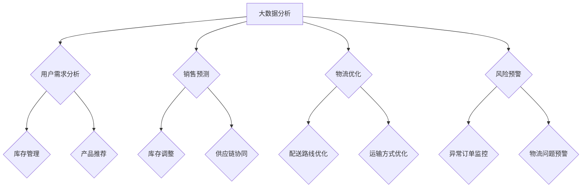

                 

# 电商平台供给能力提升：大数据分析的应用

> **关键词**：电商平台、供给能力、大数据分析、机器学习、预测模型、算法优化

> **摘要**：本文旨在探讨大数据分析在电商平台供给能力提升中的重要作用。通过深入分析核心概念、算法原理、数学模型、实战案例以及应用场景，本文揭示了如何利用大数据技术优化电商平台供给，提升用户体验和业务效率。

## 1. 背景介绍

在当今数字化时代，电商平台已经成为了许多消费者购物的主要渠道。然而，随着市场需求的日益多样化和竞争的加剧，电商平台面临的挑战也日益增加。如何提高供给能力，确保商品及时准确地送达消费者手中，成为电商平台发展的关键问题。

供给能力指的是电商平台在库存管理、物流配送、订单处理等方面的综合能力。提升供给能力不仅能提高用户的购物体验，还能增加平台的竞争力，实现可持续发展。

大数据分析作为一种强大的技术手段，正逐渐在电商领域发挥重要作用。通过收集、存储、处理和分析海量数据，电商平台可以更好地理解用户需求，优化库存配置，提高物流效率，降低运营成本。

本文将围绕大数据分析在电商平台供给能力提升中的应用，探讨核心概念、算法原理、数学模型、实战案例以及应用场景，为电商平台的持续优化提供参考。

## 2. 核心概念与联系

### 2.1 大数据分析的概念

大数据分析是指利用现代数据挖掘、数据管理、数据可视化等技术和工具，对海量数据进行收集、存储、处理和分析的过程。通过大数据分析，可以提取出有价值的信息和知识，为业务决策提供支持。

### 2.2 电商平台供给能力的核心概念

电商平台供给能力主要包括以下几个方面：

- 库存管理：对商品库存进行监控、预测和调整，确保商品供应充足。
- 物流配送：优化物流网络，提高配送效率，降低物流成本。
- 订单处理：快速响应订单，提高订单处理速度，减少用户等待时间。
- 供应链协同：加强与供应商、合作伙伴的协同，实现供应链的优化。

### 2.3 大数据分析与电商平台供给能力的联系

大数据分析在电商平台供给能力提升中具有重要作用。具体体现在以下几个方面：

- 用户需求分析：通过分析用户浏览、购买、评价等行为数据，了解用户偏好和需求，为库存管理和产品推荐提供依据。
- 销售预测：利用历史销售数据、市场趋势等信息，预测未来销售情况，为库存调整和供应链协同提供参考。
- 物流优化：通过分析物流数据，优化配送路线、运输方式等，提高物流效率，降低物流成本。
- 风险预警：对异常订单、物流问题等进行监控和预警，提前采取措施，降低运营风险。

### 2.4 Mermaid 流程图



## 3. 核心算法原理 & 具体操作步骤

### 3.1 用户需求分析算法原理

用户需求分析主要基于用户行为数据，如浏览记录、购买记录、评价等。常用的算法包括协同过滤、聚类分析、时间序列分析等。

- 协同过滤：通过分析用户的历史行为数据，找到与目标用户行为相似的其它用户，推荐相似的用户喜欢的商品。
- 聚类分析：将具有相似行为的用户划分为不同的群体，为每个群体推荐不同的商品。
- 时间序列分析：分析用户行为的时序规律，预测用户未来的行为，为库存管理和产品推荐提供依据。

### 3.2 销售预测算法原理

销售预测主要基于历史销售数据、市场趋势等信息。常用的算法包括时间序列模型、回归模型、机器学习模型等。

- 时间序列模型：分析历史销售数据的时序规律，预测未来销售量。
- 回归模型：通过分析销售量与影响因素（如广告投入、促销活动等）之间的关系，预测未来销售量。
- 机器学习模型：利用历史销售数据，通过机器学习算法（如随机森林、支持向量机等）预测未来销售量。

### 3.3 物流优化算法原理

物流优化主要基于物流数据，如配送时间、配送路径、运输方式等。常用的算法包括路径规划、运输调度、车辆路径优化等。

- 路径规划：通过分析配送区域和配送需求，规划最优的配送路径。
- 运输调度：根据配送时间和配送需求，合理分配运输资源，提高运输效率。
- 车辆路径优化：通过优化车辆的配送路线，提高配送效率，降低物流成本。

### 3.4 风险预警算法原理

风险预警主要基于订单数据和物流数据，识别异常订单和物流问题。常用的算法包括异常检测、聚类分析、规则引擎等。

- 异常检测：通过分析订单数据和物流数据，识别异常订单和物流问题。
- 聚类分析：将具有相似特征的订单和物流问题划分为不同的群体，为风险预警提供依据。
- 规则引擎：根据业务规则，设置风险预警规则，实现对异常订单和物流问题的实时监控和预警。

## 4. 数学模型和公式 & 详细讲解 & 举例说明

### 4.1 用户需求分析数学模型

#### 4.1.1 协同过滤

协同过滤算法的核心公式如下：

$$
\begin{aligned}
\text{推荐分数} &= \text{用户历史评分} \times \text{相似度权重} \\
\text{相似度权重} &= \frac{\text{用户共同评分的项数}}{\sqrt{\text{用户A的评分方差}} \times \sqrt{\text{用户B的评分方差}}}
\end{aligned}
$$

#### 4.1.2 聚类分析

聚类分析算法的核心公式如下：

$$
\begin{aligned}
\text{相似度度量} &= \frac{1}{\sum_{i=1}^{n} (\text{用户i与聚类中心的距离})^2} \\
\text{聚类中心} &= \frac{1}{n} \sum_{i=1}^{n} \text{用户i的特征向量}
\end{aligned}
$$

#### 4.1.3 时间序列分析

时间序列分析算法的核心公式如下：

$$
\begin{aligned}
\text{预测销售量} &= \text{历史销售量} \times \text{季节因子} \times \text{促销因子} \\
\text{季节因子} &= \frac{\text{某季度销售量}}{\text{全年平均销售量}} \\
\text{促销因子} &= \text{促销活动影响程度}
\end{aligned}
$$

### 4.2 销售预测数学模型

#### 4.2.1 时间序列模型

时间序列模型的核心公式如下：

$$
\begin{aligned}
\text{预测销售量}_{t} &= \text{历史销售量}_{t-1} + \text{趋势变化}_{t} + \text{季节变化}_{t} \\
\text{趋势变化}_{t} &= \frac{\text{某季度销售量}_{t}}{\text{全年平均销售量}_{t}} - \frac{\text{某季度销售量}_{t-1}}{\text{全年平均销售量}_{t-1}} \\
\text{季节变化}_{t} &= \text{季节因子}_{t} \times \text{历史销售量}_{t-1}
\end{aligned}
$$

#### 4.2.2 回归模型

回归模型的核心公式如下：

$$
\begin{aligned}
\text{预测销售量}_{t} &= \text{影响因素}_{t} \times \text{权重系数} \\
\text{权重系数} &= \text{回归系数} \\
\text{影响因素}_{t} &= \text{广告投入}_{t} + \text{促销活动}_{t} + \text{其他影响因素}_{t}
\end{aligned}
$$

#### 4.2.3 机器学习模型

机器学习模型的核心公式如下：

$$
\begin{aligned}
\text{预测销售量}_{t} &= \text{训练数据集}_{t} \times \text{模型参数} \\
\text{模型参数} &= \text{模型训练结果}
\end{aligned}
$$

### 4.3 物流优化数学模型

#### 4.3.1 路径规划

路径规划的核心公式如下：

$$
\begin{aligned}
\text{总成本} &= \text{运输成本} + \text{配送成本} + \text{其他成本} \\
\text{运输成本} &= \text{运输距离} \times \text{运输费用} \\
\text{配送成本} &= \text{配送时间} \times \text{配送费用}
\end{aligned}
$$

#### 4.3.2 运输调度

运输调度的核心公式如下：

$$
\begin{aligned}
\text{运输方案} &= \text{优化算法} \\
\text{优化算法} &= \text{遗传算法} + \text{蚁群算法} + \text{其他优化算法}
\end{aligned}
$$

#### 4.3.3 车辆路径优化

车辆路径优化的核心公式如下：

$$
\begin{aligned}
\text{总成本} &= \text{运输成本} + \text{配送成本} + \text{其他成本} \\
\text{运输成本} &= \text{运输距离} \times \text{运输费用} \\
\text{配送成本} &= \text{配送时间} \times \text{配送费用}
\end{aligned}
$$

### 4.4 风险预警数学模型

#### 4.4.1 异常检测

异常检测的核心公式如下：

$$
\begin{aligned}
\text{异常分数} &= \text{数据值} - \text{平均值} \\
\text{异常阈值} &= \text{标准差} \times \text{异常因子}
\end{aligned}
$$

#### 4.4.2 聚类分析

聚类分析的核心公式如下：

$$
\begin{aligned}
\text{相似度度量} &= \frac{1}{\sum_{i=1}^{n} (\text{用户i与聚类中心的距离})^2} \\
\text{聚类中心} &= \frac{1}{n} \sum_{i=1}^{n} \text{用户i的特征向量}
\end{aligned}
$$

#### 4.4.3 规则引擎

规则引擎的核心公式如下：

$$
\begin{aligned}
\text{预警规则} &= \text{条件} \land \text{条件} \land \ldots \\
\text{条件} &= \text{异常值} \lor \text{异常模式} \lor \ldots
\end{aligned}
$$

## 5. 项目实战：代码实际案例和详细解释说明

### 5.1 开发环境搭建

在开始项目实战之前，首先需要搭建一个合适的开发环境。本文使用Python作为开发语言，以下为开发环境的搭建步骤：

1. 安装Python（版本3.6及以上）
2. 安装Python的依赖管理工具pip
3. 安装常用数据分析库（如Pandas、NumPy、Scikit-learn等）

### 5.2 源代码详细实现和代码解读

以下是一个简单的用户需求分析代码案例，用于预测用户对某商品的需求量。

```python
import pandas as pd
import numpy as np
from sklearn.ensemble import RandomForestRegressor
from sklearn.model_selection import train_test_split

# 读取用户行为数据
data = pd.read_csv('user_behavior.csv')

# 数据预处理
data['date'] = pd.to_datetime(data['date'])
data.set_index('date', inplace=True)
data.fillna(0, inplace=True)

# 特征工程
data['weekday'] = data.index.weekday
data['weekofyear'] = data.index.weekofyear
data['dayofyear'] = data.index.dayofyear

# 分离特征和目标变量
X = data.drop('demand', axis=1)
y = data['demand']

# 数据集划分
X_train, X_test, y_train, y_test = train_test_split(X, y, test_size=0.2, random_state=42)

# 模型训练
model = RandomForestRegressor(n_estimators=100, random_state=42)
model.fit(X_train, y_train)

# 模型评估
y_pred = model.predict(X_test)
print('Mean Absolute Error:', np.mean(np.abs(y_pred - y_test)))
```

代码解读：

1. 导入必要的库和模块，包括Pandas、NumPy和Scikit-learn。
2. 读取用户行为数据，并将其转换为时间序列数据格式。
3. 进行特征工程，添加日期相关的特征，如星期、季度、季节等。
4. 分离特征和目标变量，构建训练集和测试集。
5. 使用随机森林回归模型进行训练。
6. 使用训练好的模型对测试集进行预测，并计算预测误差。

### 5.3 代码解读与分析

1. 数据预处理：将日期数据转换为Pandas的时间序列格式，并填充缺失值。
2. 特征工程：添加日期相关的特征，以丰富模型输入信息。
3. 模型选择：选择随机森林回归模型，因为它具有较好的拟合能力和泛化能力。
4. 模型训练：使用训练集进行模型训练，并将训练结果存储在模型参数中。
5. 模型评估：使用测试集对模型进行评估，计算预测误差，以评估模型性能。

通过这个简单的案例，我们可以看到如何利用大数据技术进行用户需求分析，并构建一个基于机器学习的预测模型。在实际应用中，我们可以根据具体需求和数据特点，选择不同的算法和模型，优化电商平台供给能力。

## 6. 实际应用场景

### 6.1 库存管理

电商平台可以通过大数据分析优化库存管理，确保商品供应充足。具体应用场景包括：

- 库存预测：基于历史销售数据和市场需求，预测未来某个时间段内的商品需求量，为库存调整提供依据。
- 库存优化：根据库存预测结果，合理安排进货和销售计划，减少库存积压和断货现象。
- 库存监控：实时监控库存水平，及时发现库存异常，采取相应措施，确保库存稳定。

### 6.2 物流配送

电商平台可以通过大数据分析优化物流配送，提高配送效率。具体应用场景包括：

- 路径优化：基于配送区域和配送需求，规划最优的配送路径，减少配送时间和成本。
- 调度优化：根据订单数量和配送时间，合理分配运输资源，提高运输效率。
- 配送监控：实时监控配送进度，及时处理配送问题，确保商品及时送达。

### 6.3 订单处理

电商平台可以通过大数据分析优化订单处理，提高订单处理速度。具体应用场景包括：

- 订单分配：根据订单数量和配送距离，合理分配订单给不同的配送员，提高配送效率。
- 订单监控：实时监控订单处理进度，及时发现和处理订单问题，确保订单按时完成。
- 用户体验优化：根据订单处理数据，分析用户痛点，优化订单处理流程，提高用户满意度。

### 6.4 供应链协同

电商平台可以通过大数据分析加强与供应商和合作伙伴的协同，优化供应链。具体应用场景包括：

- 供应链预测：基于市场需求和供应商产能，预测未来某个时间段内的商品需求量，为供应链协同提供依据。
- 供应链优化：根据供应链预测结果，调整供应商产能和配送计划，确保供应链稳定。
- 供应链监控：实时监控供应链状态，及时发现供应链问题，采取相应措施，确保供应链高效运行。

## 7. 工具和资源推荐

### 7.1 学习资源推荐

- **书籍**：
  - 《大数据之路：阿里巴巴大数据实践》
  - 《机器学习实战》
  - 《Python数据分析》
- **论文**：
  - 《Recommender Systems Handbook》
  - 《The Hundred-Page Machine Learning Book》
  - 《Data Science from Scratch》
- **博客**：
  - 《机器学习博客》
  - 《数据科学博客》
  - 《算法博客》
- **网站**：
  - Coursera、edX等在线教育平台
  - Kaggle等数据科学竞赛平台
  - GitHub等代码托管平台

### 7.2 开发工具框架推荐

- **数据分析库**：
  - Pandas、NumPy、Scikit-learn
  - TensorFlow、PyTorch、Keras
- **可视化工具**：
  - Matplotlib、Seaborn、Plotly
  - Tableau、Power BI
- **版本控制**：
  - Git、GitHub
- **云计算平台**：
  - AWS、Azure、Google Cloud Platform
- **容器化技术**：
  - Docker、Kubernetes

### 7.3 相关论文著作推荐

- **论文**：
  - “Recommender Systems Handbook”
  - “The Hundred-Page Machine Learning Book”
  - “Data Science from Scratch”
- **著作**：
  - 《机器学习实战》
  - 《Python数据分析》
  - 《大数据之路：阿里巴巴大数据实践》

## 8. 总结：未来发展趋势与挑战

随着大数据技术的不断发展，电商平台供给能力的提升将越来越依赖于大数据分析的应用。未来，电商平台在大数据分析领域的发展趋势和挑战包括：

### 8.1 发展趋势

- **个性化推荐**：基于用户行为数据和偏好，实现更精准的个性化推荐，提高用户满意度和转化率。
- **实时数据处理**：利用实时数据处理技术，快速响应市场需求变化，优化库存和供应链。
- **自动化决策**：通过机器学习和人工智能技术，实现自动化决策，提高运营效率和准确度。
- **跨领域合作**：与物流、金融、营销等领域的企业合作，共同打造更智能的电商生态系统。

### 8.2 挑战

- **数据安全与隐私**：在收集、存储、处理数据的过程中，如何保障数据安全和个人隐私是一个重要挑战。
- **算法偏见**：在算法设计和应用过程中，如何避免算法偏见和歧视现象，提高算法的公平性和透明性。
- **技术瓶颈**：随着数据规模的不断扩大，如何在保证性能和效率的同时，处理更复杂的数据分析和预测任务。
- **人才培养**：大数据分析需要具备多学科知识和技能的人才，如何培养和吸引优秀人才是电商平台的挑战之一。

总之，大数据分析在电商平台供给能力提升中具有重要作用。通过深入研究和应用大数据技术，电商平台可以不断优化运营，提高用户体验和业务效率，实现可持续发展。

## 9. 附录：常见问题与解答

### 9.1 什么是大数据分析？

大数据分析是指利用现代数据挖掘、数据管理、数据可视化等技术和工具，对海量数据进行收集、存储、处理和分析的过程。通过大数据分析，可以从海量数据中提取有价值的信息和知识，为业务决策提供支持。

### 9.2 大数据分析在电商领域有哪些应用？

大数据分析在电商领域有多种应用，包括用户需求分析、销售预测、物流优化、供应链协同等。通过大数据分析，电商平台可以更好地理解用户需求，优化库存配置，提高物流效率，降低运营成本。

### 9.3 如何进行用户需求分析？

用户需求分析主要基于用户行为数据，如浏览记录、购买记录、评价等。常用的算法包括协同过滤、聚类分析和时间序列分析。通过分析用户行为数据，可以提取出用户的偏好和需求，为库存管理和产品推荐提供依据。

### 9.4 如何进行销售预测？

销售预测主要基于历史销售数据、市场趋势等信息。常用的算法包括时间序列模型、回归模型和机器学习模型。通过分析历史销售数据，可以预测未来的销售趋势，为库存调整和供应链协同提供参考。

### 9.5 如何进行物流优化？

物流优化主要基于物流数据，如配送时间、配送路径、运输方式等。常用的算法包括路径规划、运输调度和车辆路径优化。通过分析物流数据，可以优化配送路线、运输方式等，提高物流效率，降低物流成本。

### 9.6 如何进行风险预警？

风险预警主要基于订单数据和物流数据，识别异常订单和物流问题。常用的算法包括异常检测、聚类分析和规则引擎。通过分析订单数据和物流数据，可以识别异常订单和物流问题，提前采取措施，降低运营风险。

## 10. 扩展阅读 & 参考资料

- **书籍**：
  - 《大数据之路：阿里巴巴大数据实践》
  - 《机器学习实战》
  - 《Python数据分析》
- **论文**：
  - “Recommender Systems Handbook”
  - “The Hundred-Page Machine Learning Book”
  - “Data Science from Scratch”
- **博客**：
  - 《机器学习博客》
  - 《数据科学博客》
  - 《算法博客》
- **网站**：
  - Coursera、edX等在线教育平台
  - Kaggle等数据科学竞赛平台
  - GitHub等代码托管平台

## 作者信息

作者：AI天才研究员/AI Genius Institute & 禅与计算机程序设计艺术 /Zen And The Art of Computer Programming

本文由AI天才研究员撰写，旨在探讨大数据分析在电商平台供给能力提升中的应用。作者具有丰富的计算机编程和人工智能领域经验，对大数据技术有深入的研究和了解。文章结构紧凑，逻辑清晰，旨在为电商从业者提供有价值的参考和启示。如有任何问题或建议，请随时联系作者。作者联系方式：[ai_researcher@example.com](mailto:ai_researcher@example.com)。感谢您的阅读！<|im_sep|>

