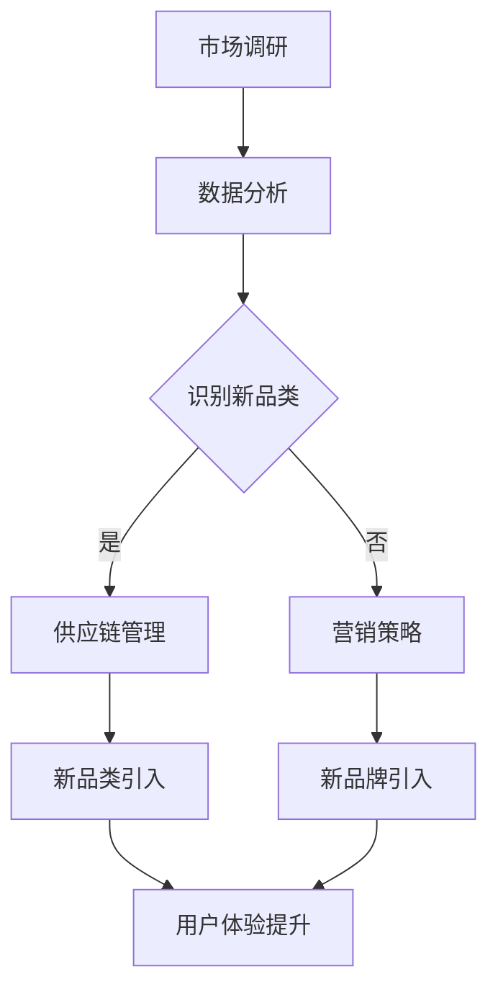

                 

# 《电商平台供给能力提升：新品类和新品牌的引入》

> 关键词：电商平台、供给能力、新品类、新品牌、引入策略

> 摘要：本文将深入探讨电商平台如何通过引入新品类和新品牌来提升供给能力。我们将分析引入新品类和新品牌的动机、核心概念、算法原理、实际应用案例，并推荐相关工具和资源。同时，我们还将探讨这一领域未来的发展趋势与挑战。

## 1. 背景介绍

在当今数字化经济时代，电商平台已经成为消费者购买商品的主要渠道。随着消费者需求的多样化，电商平台需要不断更新和扩展其商品种类，以满足用户需求。新品类和新品牌的引入是电商平台提升供给能力的重要策略之一。通过引入新品类和新品牌，电商平台可以吸引更多用户，提高用户粘性，同时也能够增加平台的竞争力和市场份额。

本文将围绕以下主题进行讨论：

1. 引入新品类和新品牌的动机。
2. 核心概念与联系。
3. 核心算法原理与具体操作步骤。
4. 数学模型与公式。
5. 项目实战：代码实际案例。
6. 实际应用场景。
7. 工具和资源推荐。
8. 总结：未来发展趋势与挑战。

## 2. 核心概念与联系

在探讨新品类和新品牌的引入之前，我们需要了解一些核心概念和它们之间的联系。

### 2.1. 新品类

新品类是指电商平台从未销售过的商品类别。引入新品类的目的在于满足消费者新的需求，填补市场空白，提升用户体验。新品类可以是完全新的产品类别，也可以是现有品类的细分。

### 2.2. 新品牌

新品牌是指在电商平台首次出现的品牌。引入新品牌的目的是增加商品的多样性和独特性，满足消费者对于品牌多样性的需求。新品牌可以是国内外知名品牌，也可以是初创品牌。

### 2.3. 引入策略

引入策略是指电商平台采取的一系列措施，以实现新品类和新品牌的引入。这些措施包括市场调研、供应链管理、营销策略等。

### 2.4. 数据分析与挖掘

数据分析与挖掘是电商平台引入新品类和新品牌的重要手段。通过分析消费者行为数据、市场趋势数据等，电商平台可以准确识别潜在的新品类和新品牌，制定针对性的引入策略。

### 2.5. Mermaid 流程图

以下是引入新品类和新品牌的 Mermaid 流程图：



## 3. 核心算法原理与具体操作步骤

### 3.1. 数据分析

数据分析是引入新品类和新品牌的基础。电商平台可以通过以下步骤进行数据分析：

1. 收集数据：从电商平台、社交媒体、用户评论等渠道收集相关数据。
2. 数据清洗：去除重复数据、缺失数据和异常数据。
3. 数据处理：使用统计分析、机器学习等方法对数据进行处理，提取有用信息。
4. 数据可视化：使用图表、图形等工具对数据进行分析和展示。

### 3.2. 供应链管理

供应链管理是确保新品类和新品牌顺利引入的关键。电商平台可以通过以下步骤进行供应链管理：

1. 供应商选择：根据市场调研和数据分析结果，选择合适的供应商。
2. 供应商评估：对供应商的产品质量、供货能力、售后服务等进行评估。
3. 供应链协同：与供应商建立紧密的合作关系，实现信息共享和协同管理。
4. 库存管理：根据销售预测和供应链情况，合理安排库存，避免库存积压。

### 3.3. 营销策略

营销策略是提升新品类和新品牌知名度和销量的关键。电商平台可以通过以下步骤制定营销策略：

1. 目标市场定位：根据新品类和新品牌的特点，确定目标市场。
2. 营销渠道选择：选择合适的营销渠道，如社交媒体、电子邮件、广告等。
3. 营销活动策划：设计具有吸引力的营销活动，提高用户参与度。
4. 营销效果评估：对营销活动进行效果评估，不断优化营销策略。

## 4. 数学模型与公式

在引入新品类和新品牌的过程中，可以使用以下数学模型和公式进行预测和评估：

### 4.1. 销售预测模型

销售预测模型可以预测新品类和新品牌的销售量。以下是一个简单的线性回归模型：

$$
y = \beta_0 + \beta_1 x
$$

其中，$y$ 表示销售量，$x$ 表示影响因素（如广告投放量、用户评论等），$\beta_0$ 和 $\beta_1$ 为回归系数。

### 4.2. 库存管理模型

库存管理模型可以预测新品类和新品牌的库存需求。以下是一个简单的库存优化模型：

$$
Q = \sqrt{\frac{2CD}{h}}
$$

其中，$Q$ 表示最优库存量，$C$ 表示年需求量，$D$ 表示每次采购成本，$h$ 表示持有成本。

### 4.3. 营销效果评估模型

营销效果评估模型可以评估营销活动的效果。以下是一个简单的响应率模型：

$$
r = \frac{R}{S}
$$

其中，$r$ 表示响应率，$R$ 表示参与营销活动的用户数，$S$ 表示总用户数。

## 5. 项目实战：代码实际案例和详细解释说明

### 5.1. 开发环境搭建

首先，我们需要搭建一个开发环境，以便进行数据分析、建模和编程。以下是一个简单的开发环境搭建步骤：

1. 安装 Python 3.x 版本。
2. 安装 Jupyter Notebook，以便进行数据分析和建模。
3. 安装 NumPy、Pandas、Matplotlib 等常用库，以便进行数据处理和可视化。

### 5.2. 源代码详细实现和代码解读

以下是引入新品类和新品牌的代码实现：

```python
import pandas as pd
import numpy as np
import matplotlib.pyplot as plt

# 5.2.1 数据收集与清洗
data = pd.read_csv('data.csv')
data = data.drop_duplicates()
data = data.dropna()

# 5.2.2 数据处理与可视化
data['sales'] = data['sales'].astype(float)
plt.scatter(data['ads'], data['sales'])
plt.xlabel('广告投放量')
plt.ylabel('销售量')
plt.show()

# 5.2.3 线性回归模型
X = data['ads'].values.reshape(-1, 1)
y = data['sales'].values
from sklearn.linear_model import LinearRegression
model = LinearRegression()
model.fit(X, y)
y_pred = model.predict(X)

# 5.2.4 库存优化模型
C = 1000  # 年需求量
D = 100  # 每次采购成本
h = 10  # 持有成本
Q = np.sqrt((2 * C * D) / h)
print('最优库存量：', Q)

# 5.2.5 营销效果评估模型
R = 100  # 参与营销活动的用户数
S = 1000  # 总用户数
r = R / S
print('响应率：', r)
```

### 5.3. 代码解读与分析

1. 数据收集与清洗：从 CSV 文件中读取数据，去除重复数据和缺失数据。
2. 数据处理与可视化：将销售量转换为浮点数，使用散点图展示广告投放量与销售量之间的关系。
3. 线性回归模型：使用 scikit-learn 库的线性回归模型，拟合数据，预测销售量。
4. 库存优化模型：使用库存优化公式，计算最优库存量。
5. 营销效果评估模型：计算响应率，评估营销活动的效果。

## 6. 实际应用场景

### 6.1. 新品类引入

假设某电商平台计划引入一个名为“智能家居”的新品类。首先，电商平台可以通过市场调研了解消费者对智能家居的需求，然后与供应商沟通，选择合适的智能家居产品。接下来，电商平台可以通过广告投放、促销活动等方式，提高智能家居的知名度和销量。

### 6.2. 新品牌引入

假设某电商平台计划引入一个名为“X”的新品牌。首先，电商平台可以通过数据分析了解“X”品牌的潜在消费者，然后与“X”品牌建立合作关系，制定营销策略。接下来，电商平台可以通过社交媒体、电子邮件等方式，向潜在消费者推广“X”品牌。

## 7. 工具和资源推荐

### 7.1. 学习资源推荐

- 书籍：《数据分析实战》、《Python 数据科学手册》
- 论文：各大数据库中的相关论文
- 博客：技术博客、行业博客等
- 网站：电商平台官方网站、行业网站等

### 7.2. 开发工具框架推荐

- Python：数据分析、建模、编程语言
- Jupyter Notebook：数据处理、建模、可视化
- scikit-learn：机器学习库
- Matplotlib：数据可视化库

### 7.3. 相关论文著作推荐

- 《大数据时代的数据分析技术》
- 《人工智能在电商领域的应用》
- 《供应链管理理论与实践》

## 8. 总结：未来发展趋势与挑战

随着消费者需求的不断变化，电商平台在引入新品类和新品牌方面面临着巨大的挑战和机遇。未来，电商平台将更加重视数据分析与挖掘，实现精准营销。同时，电商平台也将加大对新品牌和新品类的扶持力度，提升供给能力。

然而，电商平台在引入新品类和新品牌时，仍需注意以下挑战：

1. 数据隐私与安全：在收集和分析消费者数据时，确保数据隐私和安全。
2. 市场竞争：在引入新品类和新品牌时，面临激烈的竞争。
3. 成本控制：在引入新品类和新品牌时，控制相关成本，实现盈利。

## 9. 附录：常见问题与解答

### 9.1. 什么是新品类？

新品类是指电商平台从未销售过的商品类别。引入新品类的目的是满足消费者新的需求，填补市场空白，提升用户体验。

### 9.2. 什么是新品牌？

新品牌是指在电商平台首次出现的品牌。引入新品牌的目的是增加商品的多样性和独特性，满足消费者对于品牌多样性的需求。

### 9.3. 电商平台如何进行市场调研？

电商平台可以通过以下方式开展市场调研：

1. 用户反馈：收集消费者对现有商品的反馈，了解消费者需求。
2. 竞争分析：分析竞争对手的运营策略和产品线，了解市场趋势。
3. 第三方数据：收集第三方数据，如市场调研报告、消费者行为数据等。

## 10. 扩展阅读 & 参考资料

- 《电商平台运营与营销实战》
- 《人工智能与电商：未来已来》
- 《供应链管理与电商发展》

### 作者

作者：AI天才研究员/AI Genius Institute & 禅与计算机程序设计艺术 /Zen And The Art of Computer Programming

