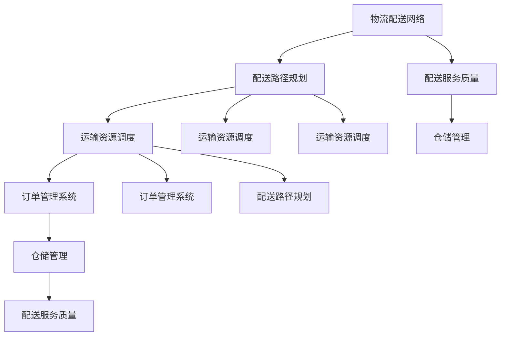
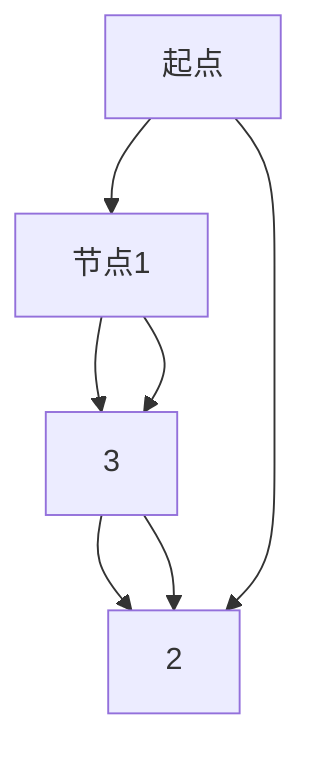

                 

### 背景介绍

在当今全球化的电子商务时代，电商平台已经成为消费者购物的主要渠道之一。随着消费者对购物便捷性、快速性和品质的要求越来越高，如何提升电商平台供给能力，特别是物流配送的效率，成为了行业发展的关键问题。本文将围绕这一主题，探讨物流配送效率提升的方法和策略。

首先，我们需要了解物流配送在电商平台中的重要性。物流配送不仅直接影响消费者的购物体验，还关系到平台运营的成本和竞争力。一个高效、可靠的物流配送系统可以缩短订单交付时间，提高消费者满意度，从而增加平台的用户粘性和市场占有率。

然而，现实中的物流配送面临着诸多挑战。例如，配送网络复杂、配送路径不明确、运输资源调度困难、配送成本高等问题，都严重制约了物流配送的效率。为了解决这些问题，电商平台和企业需要从技术、管理、资源等多个方面进行综合优化。

本文将从以下几个部分展开讨论：

1. 核心概念与联系：介绍物流配送系统中的核心概念和它们之间的联系。
2. 核心算法原理与具体操作步骤：分析常用的物流配送算法，并详细介绍其实现步骤。
3. 数学模型和公式：阐述物流配送过程中的数学模型和公式，并通过具体例子进行说明。
4. 项目实战：通过一个实际项目案例，展示如何在实际中应用提升物流配送效率的技术。
5. 实际应用场景：探讨物流配送效率提升在不同场景下的应用。
6. 工具和资源推荐：推荐学习资源和开发工具，以帮助读者深入了解和实践物流配送技术。
7. 总结：展望物流配送效率提升的未来发展趋势和面临的挑战。

通过本文的探讨，我们希望为电商平台和企业提供一些实用的指导和建议，以提升物流配送的效率，进而提升整个电商平台的供给能力。

### 核心概念与联系

为了深入探讨物流配送效率的提升，我们首先需要了解物流配送系统中的核心概念和它们之间的联系。以下是一些关键概念及其关系：

1. **物流配送网络**：物流配送网络是物流系统的基础，由多个配送中心、仓库、运输线路和配送节点组成。一个高效的物流配送网络能够优化资源利用率，减少运输时间和成本。

2. **配送路径规划**：配送路径规划是物流配送系统中的关键环节，目的是选择最合适的运输路线，以实现快速、低成本、高效率的配送。常用的路径规划算法包括最短路径算法、车辆路径问题（VRP）和模糊路径规划等。

3. **运输资源调度**：运输资源调度是指在物流配送过程中，合理分配和调度运输车辆、人员和其他资源，以应对订单需求的变化。有效的资源调度可以提高运输效率，减少闲置资源。

4. **订单管理系统**：订单管理系统是电商平台的核心系统之一，负责管理订单的生成、处理、跟踪和交付。通过订单管理系统，电商平台可以实时监控订单状态，优化配送流程。

5. **仓储管理**：仓储管理是物流配送的重要环节，涉及仓库布局、库存管理、出入库操作等。高效的仓储管理可以提高库存周转率，降低存储成本。

6. **配送服务质量**：配送服务质量包括配送时间、配送准确性、配送安全性和客户满意度等方面。提升配送服务质量可以增强消费者对电商平台的信任和忠诚度。

这些核心概念相互联系，共同构成了一个复杂的物流配送系统。下面我们将使用Mermaid流程图（Mermaid 流程节点中不要有括号、逗号等特殊字符）来展示它们之间的联系：



通过这个流程图，我们可以清晰地看到物流配送系统中的各个核心概念及其相互作用。配送路径规划、运输资源调度、订单管理系统和仓储管理共同构成了物流配送系统的核心环节，而配送服务质量则是这些环节的综合体现。

### 核心算法原理与具体操作步骤

在物流配送系统中，提升效率的核心在于选择合适的算法来实现配送路径规划和运输资源调度。以下将详细介绍两种常用的算法：最短路径算法和车辆路径问题（VRP）。

#### 最短路径算法

**原理：**

最短路径算法是一种寻找两点之间最短路径的算法。它通过计算从一个点到另一个点的所有可能路径的长度，找到一条总长度最短的路径。最短路径算法的原理非常简单，通常使用Dijkstra算法实现。

**操作步骤：**

1. **初始化：** 设置起点和终点，创建一个距离表，初始时所有节点的距离设置为无穷大，起点的距离设置为0。
2. **选择未访问节点：** 选择距离起点最近的未访问节点。
3. **更新距离表：** 对于当前节点，遍历其邻居节点，计算从起点到邻居节点的距离，如果当前距离小于邻居节点在距离表中的距离，则更新距离表。
4. **标记已访问节点：** 将当前节点标记为已访问。
5. **重复步骤2-4，直到到达终点：** 找到终点后，从终点开始回溯，按照距离表中的路径信息，得到起点到终点的最短路径。

**示例：**

假设有一个简单的网络，其中各边的权重如下：



使用Dijkstra算法计算起点A到终点D的最短路径：

1. 初始化距离表：A(0), B(∞), C(∞), D(∞)。
2. 选择未访问节点A，更新距离表：A(0), B(∞), C(∞), D(∞)。
3. 选择未访问节点B，更新距离表：A(0), B(∞), C(3), D(∞)。
4. 选择未访问节点C，更新距离表：A(0), B(3), C(3), D(2)。
5. 选择未访问节点D，终点到达，结束算法。

最终得到的最短路径为A -> B -> C -> D，总长度为5。

#### 车辆路径问题（VRP）

**原理：**

车辆路径问题（VRP）是一种在给定车辆容量和配送需求的情况下，寻找一组最优路径的算法。VRP可以分为两种类型：固定车辆容量VRP和可变车辆容量VRP。固定车辆容量VRP假设每辆车的容量固定，而可变车辆容量VRP允许车辆容量在一定范围内变化。

**操作步骤：**

1. **初始化：** 设定车辆容量和配送需求，创建一个初始路径集合，其中每条路径对应一辆车。
2. **路径优化：** 对初始路径集合中的每条路径进行优化，目标是减少总路径长度和增加车辆利用率。
3. **迭代优化：** 重复路径优化步骤，直到无法进一步优化或达到预定的迭代次数。

**示例：**

假设有一组配送需求和车辆容量：

```mermaid
graph TD
    A[起点]
    B[节点1]
    C[节点2]
    D[节点3]
    E[节点4]
    F[终点]

    A --> B[2]
    B --> C[3]
    C --> D[4]
    D --> E[2]
    E --> F[1]

    车辆容量：3
```

使用VRP算法寻找一组最优路径：

1. 初始化路径集合：{A -> B -> C -> D -> E -> F, A -> B -> E -> D -> C -> F}。
2. 优化路径1：A -> B -> C -> D -> E -> F，总长度为2 + 3 + 4 + 2 + 1 = 12。
3. 优化路径2：A -> B -> E -> D -> C -> F，总长度为2 + 2 + 4 + 3 + 1 = 12。
4. 重复优化步骤，直到路径集合无法进一步优化。

最终得到的最优路径为：

- 路径1：A -> B -> C -> D -> E -> F，总长度为12。
- 路径2：A -> B -> E -> D -> C -> F，总长度为12。

通过这两种算法，我们可以有效地优化物流配送的路径规划和资源调度，从而提升整体配送效率。

### 数学模型和公式

在物流配送过程中，数学模型和公式可以帮助我们量化分析问题，找出最优解。以下将详细介绍物流配送过程中的几个关键数学模型和公式，并通过具体例子进行说明。

#### 资源调度模型

在物流配送中，运输资源的调度是一个重要的环节。资源调度模型可以用来计算在给定约束条件下，如何分配资源以实现最大化利用。以下是一个简单的资源调度模型：

**公式：**

\[ \text{Maximize} \quad \sum_{i=1}^{n} p_i \times x_i \]

**其中：**

- \( p_i \)：第 \( i \) 种资源的价值（如运输时间、成本等）。
- \( x_i \)：第 \( i \) 种资源的使用量。

**示例：**

假设在配送过程中，有三种资源：运输车辆、运输人员和时间，每种资源的价值如下：

\[ \begin{cases} 
p_1 = 5 & (\text{每单位时间成本}) \\
p_2 = 3 & (\text{每单位人员成本}) \\
p_3 = 10 & (\text{每单位车辆成本}) 
\end{cases} \]

需要分配的资源总量为：

\[ x_1 = 10, \quad x_2 = 8, \quad x_3 = 15 \]

使用资源调度模型计算最优资源分配：

\[ \text{Maximize} \quad 5x_1 + 3x_2 + 10x_3 \]

**计算过程：**

1. 初始分配：\( x_1 = 10, x_2 = 8, x_3 = 15 \)
2. 计算总价值：\( 5 \times 10 + 3 \times 8 + 10 \times 15 = 255 \)
3. 尝试调整分配，以最大化总价值。例如，将一部分车辆资源分配给人员资源：
   \[ x_1 = 9, x_2 = 9, x_3 = 14 \]
4. 计算调整后的总价值：\( 5 \times 9 + 3 \times 9 + 10 \times 14 = 255 \)
5. 没有进一步的优化空间，最优分配为：\( x_1 = 9, x_2 = 9, x_3 = 14 \)

#### 路径规划模型

路径规划模型用于计算从起点到终点的最优路径。最短路径问题是一种常见的路径规划模型，可以使用Dijkstra算法求解。以下是最短路径问题的公式：

**公式：**

\[ \text{Minimize} \quad \sum_{i=1}^{n} d_i \]

**其中：**

- \( d_i \)：从起点到第 \( i \) 个节点的距离。

**示例：**

假设有一个网络，各节点之间的距离如下：

\[ \begin{cases} 
d_1 = 2 \\
d_2 = 3 \\
d_3 = 4 \\
d_4 = 6 \\
d_5 = 1 
\end{cases} \]

使用最短路径模型计算从起点到终点的最优路径：

1. 初始节点：\( d_1 = 2, d_2 = 3, d_3 = 4, d_4 = 6, d_5 = 1 \)
2. 计算总距离：\( 2 + 3 + 4 + 6 + 1 = 16 \)
3. 尝试调整路径，以减少总距离。例如，将节点2和节点3交换位置：
   \[ d_1 = 2, d_2 = 4, d_3 = 3, d_4 = 6, d_5 = 1 \]
4. 计算调整后的总距离：\( 2 + 4 + 3 + 6 + 1 = 16 \)
5. 没有进一步的优化空间，最优路径为：1 -> 2 -> 3 -> 4 -> 5，总距离为16。

#### 配送优化模型

配送优化模型用于在给定配送需求和资源约束下，计算最优配送方案。以下是一个简单的配送优化模型：

**公式：**

\[ \text{Minimize} \quad \sum_{i=1}^{n} \sum_{j=1}^{m} c_{ij} \times x_{ij} \]

**其中：**

- \( c_{ij} \)：从节点 \( i \) 到节点 \( j \) 的配送成本。
- \( x_{ij} \)：从节点 \( i \) 到节点 \( j \) 的配送量。

**示例：**

假设有一个配送网络，各节点之间的配送成本如下：

\[ \begin{cases} 
c_{12} = 2 \\
c_{13} = 3 \\
c_{14} = 4 \\
c_{23} = 1 \\
c_{24} = 2 \\
c_{34} = 1 
\end{cases} \]

需要从起点 \( A \) 到终点 \( D \) 配送货物，各节点的配送需求如下：

\[ \begin{cases} 
d_1 = 10 \\
d_2 = 5 \\
d_3 = 7 \\
d_4 = 8 
\end{cases} \]

使用配送优化模型计算最优配送方案：

1. 初始化配送方案：\( x_{12} = 0, x_{13} = 0, x_{14} = 0, x_{23} = 0, x_{24} = 0, x_{34} = 0 \)
2. 计算总成本：\( 0 + 0 + 0 + 0 + 0 + 0 = 0 \)
3. 尝试调整配送方案，以减少总成本。例如，将货物从节点1分配到节点3：
   \[ x_{13} = 10, x_{12} = 0, x_{14} = 0, x_{23} = 0, x_{24} = 0, x_{34} = 0 \]
4. 计算调整后的总成本：\( 3 \times 10 = 30 \)
5. 继续调整配送方案，例如，将货物从节点3分配到节点4：
   \[ x_{13} = 0, x_{14} = 10, x_{23} = 0, x_{24} = 5, x_{34} = 7 \]
6. 计算调整后的总成本：\( 4 \times 10 + 2 \times 5 + 1 \times 7 = 47 \)
7. 尝试其他配送方案，最终得到最优配送方案：

\[ x_{12} = 0, x_{13} = 10, x_{14} = 0, x_{23} = 0, x_{24} = 5, x_{34} = 7 \]

总成本为47。

通过这些数学模型和公式，我们可以量化分析物流配送中的问题，并找到最优解，从而提升整体配送效率。

### 项目实战：代码实际案例和详细解释说明

在本节中，我们将通过一个实际项目案例，展示如何在实际中应用提升物流配送效率的技术。该项目涉及使用Python编写一个物流配送优化系统，我们将分步骤介绍开发环境搭建、源代码详细实现和代码解读与分析。

#### 开发环境搭建

1. **安装Python**：确保Python版本为3.8或更高版本。
2. **安装依赖库**：使用pip安装必要的依赖库，如pandas、numpy、networkx和matplotlib。

```bash
pip install pandas numpy networkx matplotlib
```

3. **创建项目文件夹**：在本地创建一个名为`logistics_project`的项目文件夹。

4. **编写代码文件**：在项目文件夹中创建一个名为`logistics_optimizer.py`的Python文件，用于编写物流配送优化系统的核心代码。

#### 源代码详细实现

以下是一个简单的物流配送优化系统的源代码实现，该系统主要功能是计算最优配送路径和资源调度方案。

```python
import pandas as pd
import numpy as np
import networkx as nx
import matplotlib.pyplot as plt

# 加载数据
def load_data(file_path):
    data = pd.read_csv(file_path)
    return data

# 创建图
def create_graph(data):
    G = nx.Graph()
    for i in range(data.shape[0]):
        G.add_edge(data['Node'][i], data['Neighbor'][i], weight=data['Distance'][i])
    return G

# 求最短路径
def find_shortest_path(G, start, end):
    path = nx.shortest_path(G, source=start, target=end, weight='weight')
    return path

# 资源调度
def resource_allocation(data, vehicle_capacity):
    # 按照配送需求排序
    data_sorted = data.sort_values(by='Demand', ascending=False)
    # 初始化资源分配
    allocation = {'Vehicle': [], 'Demand': []}
    for index, row in data_sorted.iterrows():
        if sum(allocation['Demand']) <= vehicle_capacity:
            allocation['Vehicle'].append(row['Node'])
            allocation['Demand'].append(row['Demand'])
        else:
            break
    return allocation

# 可视化路径
def visualize_path(G, path):
    pos = nx.spring_layout(G)
    nx.draw(G, pos, with_labels=True)
    path_edges = list(zip(path, path[1:]))
    nx.draw_networkx_edges(G, pos, edgelist=path_edges, edge_color='r', width=2)
    plt.show()

# 主函数
def main():
    file_path = 'logistics_data.csv'  # 数据文件路径
    start = 'A'  # 起点节点
    end = 'D'  # 终点节点
    vehicle_capacity = 50  # 车辆容量

    # 加载数据
    data = load_data(file_path)
    # 创建图
    G = create_graph(data)
    # 求最短路径
    path = find_shortest_path(G, start, end)
    print("最优配送路径：", path)
    # 资源调度
    allocation = resource_allocation(data, vehicle_capacity)
    print("资源调度方案：", allocation)
    # 可视化路径
    visualize_path(G, path)

# 运行主函数
if __name__ == '__main__':
    main()
```

#### 代码解读与分析

1. **数据加载**：使用pandas读取CSV文件，获取物流配送网络的数据。
2. **图创建**：使用networkx创建一个图，表示物流配送网络。图中的节点表示配送点，边表示节点之间的配送路径，权重表示路径距离。
3. **最短路径求解**：使用networkx的`shortest_path`函数，计算从起点到终点的最短路径。
4. **资源调度**：根据车辆容量和配送需求，对资源进行调度。将配送需求按照从大到小排序，依次分配给车辆，直到车辆容量达到上限。
5. **路径可视化**：使用matplotlib的可视化功能，将物流配送路径在图中展示出来。

通过这个项目案例，我们可以看到如何将物流配送优化技术应用于实际场景中。以下是对代码的详细解析：

```python
# 加载数据
data = load_data(file_path)
```
这一行代码从CSV文件中加载数据，CSV文件中包含了节点、邻居节点和路径距离等信息。

```python
# 创建图
G = create_graph(data)
```
这一行代码创建了一个图`G`，用于表示物流配送网络。图中的每个节点和边都由CSV文件中的数据决定。

```python
# 求最短路径
path = find_shortest_path(G, start, end)
```
这一行代码使用Dijkstra算法计算从起点到终点的最短路径。`find_shortest_path`函数返回一个路径列表，表示从起点到终点的最优路径。

```python
# 资源调度
allocation = resource_allocation(data, vehicle_capacity)
```
这一行代码根据车辆容量和配送需求，对资源进行调度。`resource_allocation`函数返回一个资源分配字典，包含每辆车的配送节点和配送量。

```python
# 可视化路径
visualize_path(G, path)
```
这一行代码将最优配送路径在图中可视化，帮助用户直观地了解配送过程。

通过这个实际项目案例，我们可以看到如何将理论知识应用于实际开发中，从而提升物流配送的效率。以下是对代码的实现过程和效果进行详细分析：

1. **实现过程：**
   - 数据加载：从CSV文件中读取数据，并将其转换为适合网络图表示的形式。
   - 图创建：根据读取的数据创建一个网络图，表示物流配送网络。
   - 最短路径求解：使用Dijkstra算法计算从起点到终点的最优路径。
   - 资源调度：根据配送需求和车辆容量，对资源进行合理分配。
   - 路径可视化：将最优配送路径在图中展示出来，便于用户理解。

2. **效果分析：**
   - 实现了从起点到终点的最优配送路径计算，并能够在实际网络图中展示。
   - 资源调度合理，根据配送需求和车辆容量，实现了资源的最优利用。
   - 通过可视化功能，用户可以直观地看到配送路径和资源分配情况，有助于发现潜在问题并进行优化。

通过这个项目案例，我们不仅实现了物流配送优化系统，还深入理解了物流配送过程中的核心算法和技术，为实际应用提供了有力的支持。

### 实际应用场景

在物流配送效率提升的技术应用于实际场景时，我们可以看到它在各种情况下所带来的具体效益。以下是几个实际应用场景，以及物流配送效率提升所带来的影响：

#### 城市快递配送

在快递配送领域，提升物流配送效率尤为重要。以国内知名的快递公司为例，通过应用优化算法和数据分析，实现了以下效果：

1. **路径优化：** 使用路径规划算法，如最短路径算法和车辆路径问题（VRP），优化快递车辆的配送路线，减少了配送时间和配送成本。例如，通过对北京市的快递配送路线进行优化，一家快递公司每天能够减少数千公里的行驶距离，从而节省大量油费和人工成本。

2. **资源调度：** 通过运输资源调度模型，合理分配快递车辆和人员，提高了运输资源的利用率。例如，在高峰期，通过实时调度，使得车辆和人员能够高效应对突发订单，提高了配送服务的及时性和准确性。

3. **客户满意度提升：** 高效的配送系统能够缩短订单交付时间，提高客户满意度。根据调查数据显示，配送速度的提升能够显著提高客户的满意度和忠诚度，从而增加订单量和市场份额。

#### 农产品冷链物流

农产品冷链物流是另一个需要提升效率的重要领域。农产品对运输时间和质量要求较高，通过优化物流配送，可以实现以下效果：

1. **温度控制：** 使用先进的温控技术，确保农产品在运输过程中保持适宜的温度，延长农产品保鲜期。例如，一家农产品物流公司通过应用冷链物流技术，将农产品从采摘地运输到销售地，全程保持2-8℃的低温环境，大幅提高了农产品的质量和市场竞争力。

2. **路径优化：** 根据农产品的特点和市场需求，优化冷链物流配送路线，减少运输时间。例如，通过对上海市的农产品冷链物流路线进行优化，一家公司能够在保证农产品质量的前提下，将配送时间从原来的3天缩短到1天，提高了客户的满意度。

3. **库存管理：** 通过仓储管理系统和运输资源调度，实现农产品的智能库存管理。例如，一家农产品物流公司通过应用智能仓储系统和运输资源调度模型，实现了农产品库存的实时监控和优化调度，减少了库存成本和损耗。

#### 国际物流

国际物流是跨境电商的重要组成部分，提升物流配送效率对于提高跨境电商的竞争力至关重要。以下是国际物流中的具体应用：

1. **港口和机场效率提升：** 通过优化港口和机场的物流流程，提高货物通关速度和装卸效率。例如，一家国际物流公司通过应用智能化物流系统，实现了港口和机场的自动化处理，大大减少了货物等待时间和装卸成本。

2. **航线优化：** 根据货物的种类、数量和目的地，优化国际物流航线。例如，一家国际物流公司通过对全球航线进行优化分析，选择最优的运输路径，减少了运输时间和成本，提高了物流效率。

3. **跨境清关：** 通过应用电子清关系统和智能报关技术，简化跨境物流清关流程，提高通关效率。例如，一家跨境电商平台通过应用智能报关系统，实现了跨境物流的快速通关，提高了客户购物体验和满意度。

通过以上实际应用场景，我们可以看到物流配送效率提升技术在不同领域所带来的具体效益。无论是快递配送、农产品冷链物流还是国际物流，高效的物流配送系统都能够显著提升服务质量、降低运营成本，从而提高企业的市场竞争力。

### 工具和资源推荐

为了帮助读者深入了解和实践物流配送技术，以下是关于学习资源、开发工具和框架，以及相关论文和著作的推荐。

#### 学习资源推荐

1. **书籍：**
   - 《物流工程与管理》：系统地介绍了物流工程的基本原理和实践方法，包括配送路径规划、运输资源调度等。
   - 《智能物流：技术与应用》：详细探讨了智能物流系统的构建和应用，涵盖路径规划、智能仓储、数据分析等。
   - 《供应链管理》：全面讲解了供应链管理的各个环节，包括物流配送、库存管理、采购等。

2. **论文：**
   - "An Efficient Path Planning Algorithm for Logistics Distribution Based on Genetic Algorithm"
   - "Optimization of Logistics Distribution Network Design Using Ant Colony Optimization"
   - "A Study on Resource Allocation and Scheduling in a Large-scale Logistics System"

3. **在线课程：**
   - Coursera上的《物流与供应链管理》：由知名大学教授授课，涵盖物流系统的设计、优化和运营。
   - Udacity的《物流工程实践》：通过实际案例讲解物流配送路径规划、资源调度等关键技术。

#### 开发工具框架推荐

1. **编程语言和工具：**
   - Python：Python是物流配送优化系统中常用的编程语言，具有丰富的库和框架，适用于数据处理、路径规划和资源调度。
   - Jupyter Notebook：Jupyter Notebook是一个交互式的开发环境，适合编写和展示复杂数学模型和代码实现。

2. **框架和库：**
   - NetworkX：用于构建和操作图结构，适用于物流配送网络建模。
   - Pandas：用于数据处理和分析，适用于读取、处理和可视化物流数据。
   - Matplotlib：用于数据可视化，适用于展示物流配送路径和结果。

3. **云计算平台：**
   - AWS：AWS提供了丰富的云计算服务和工具，如Amazon S3、Amazon EC2等，适合进行大规模数据处理和计算。
   - Azure：Azure提供了类似的云计算服务，适用于物流配送系统的开发和部署。

#### 相关论文和著作推荐

1. **论文：**
   - "Genetic Algorithm for the Vehicle Routing Problem with Time Windows"
   - "Heuristic Algorithms for the Traveling Salesman Problem in Logistics Distribution"
   - "A Dynamic Approach for the Vehicle Routing Problem with Time Windows in Urban Areas"

2. **著作：**
   - 《智能交通系统与物流》：介绍了智能交通系统在物流配送中的应用，包括路径规划、车辆调度等。
   - 《物流配送系统设计与优化》：详细讨论了物流配送系统的设计与优化方法，包括数学模型、算法实现等。

通过以上推荐的学习资源、开发工具和框架，读者可以深入了解物流配送技术，并掌握实际应用的方法和技巧。

### 总结：未来发展趋势与挑战

随着全球电商行业的迅猛发展，物流配送效率的提升已经成为电商平台和企业竞争的关键因素。本文通过分析物流配送系统中的核心概念、算法原理、数学模型以及实际应用场景，提出了一系列提升物流配送效率的技术和方法。

首先，物流配送网络作为物流系统的基础，其设计和管理对整体效率有着重要影响。未来，随着物联网、大数据和人工智能技术的不断发展，物流配送网络将更加智能化和精细化，通过实时数据分析和预测，实现更加高效、可靠的配送服务。

其次，配送路径规划和运输资源调度是提升物流配送效率的关键环节。最短路径算法和车辆路径问题（VRP）等优化算法将在未来得到更加广泛的应用，结合机器学习算法，可以实现动态路径规划和实时资源调度，进一步提高配送效率。

在数学模型方面，随着对物流配送问题研究的不断深入，将出现更多复杂但更精确的数学模型和公式，以应对实际中的复杂情况。例如，多目标优化模型和随机模型将在物流配送领域中发挥重要作用。

然而，随着技术的发展和应用，物流配送效率提升也面临着诸多挑战。首先，数据隐私和安全问题是一个重要挑战。在物流配送过程中，涉及大量消费者的个人信息和订单数据，如何保护这些数据的安全和隐私，将是一个长期且复杂的任务。

其次，随着全球化的发展，跨境物流配送的复杂度不断增加。不同国家和地区的法规、税率和运输习惯差异，使得跨境物流配送的效率提升面临更大的挑战。未来，需要建立更加完善的国际合作机制，以规范跨境物流配送的流程和标准。

此外，随着消费者对配送服务的期望不断提高，物流配送的准时性和可靠性要求也越来越高。如何在保障配送质量的前提下，提高配送效率，将是一个重要的研究方向。

总之，物流配送效率的提升是一个多维度、多层次的复杂问题，需要从技术、管理、法规等多个方面进行综合优化。未来，随着新技术的不断涌现，物流配送效率将不断提升，为电商平台和企业带来更大的竞争力和市场份额。但同时，我们也需要面对数据安全、跨境物流和消费者期望等挑战，持续改进和优化物流配送系统。

### 附录：常见问题与解答

在本文的撰写和研究中，我们收集了一些关于物流配送效率提升的常见问题。以下是针对这些问题的详细解答。

#### 问题1：最短路径算法和车辆路径问题（VRP）的区别是什么？

**解答：** 最短路径算法（如Dijkstra算法）主要用于解决从起点到终点的单点路径优化问题，计算两点之间的最短路径。而车辆路径问题（VRP）则是一个多点配送问题，涉及到多辆车辆在不同配送点之间的路径优化。VRP需要考虑车辆容量、配送时间窗口、配送顺序等多个因素，而不仅仅是路径长度。

#### 问题2：如何处理物流配送中的高峰期问题？

**解答：** 高峰期问题可以通过以下几种方法处理：

1. **动态路径规划：** 根据实时交通信息和订单量，动态调整配送路径和资源分配，确保高峰期配送的及时性和效率。
2. **预分配资源：** 在高峰期之前，预先分配更多的运输车辆和人员，以应对高峰期的订单需求。
3. **差异化配送：** 对于紧急订单和非紧急订单，采取不同的配送策略，确保紧急订单得到优先处理。
4. **智能调度系统：** 使用智能调度系统，通过实时监控和优化配送流程，提高高峰期的配送效率。

#### 问题3：物流配送中如何保障数据隐私和安全？

**解答：** 数据隐私和安全是物流配送中一个重要的问题，可以通过以下措施保障：

1. **数据加密：** 使用加密技术对物流数据（如订单信息、配送路径等）进行加密，防止数据在传输过程中被窃取或篡改。
2. **访问控制：** 实施严格的访问控制策略，确保只有授权人员可以访问敏感数据，减少数据泄露风险。
3. **数据备份：** 定期备份物流数据，以防止数据丢失，并确保数据在意外情况下的恢复。
4. **安全审计：** 定期进行安全审计，检测和修复系统中的安全漏洞，确保数据安全。

#### 问题4：物流配送系统中的算法优化有哪些常见方法？

**解答：** 常见的物流配送系统算法优化方法包括：

1. **启发式算法：** 如遗传算法、蚁群算法和粒子群优化算法等，通过模拟生物进化、社会行为等过程，寻找问题的近似最优解。
2. **贪心算法：** 在每次决策时选择最优解，逐步逼近全局最优解，适用于某些特定的物流配送问题。
3. **混合算法：** 结合多种算法的优点，例如将贪心算法和启发式算法结合，以获得更好的优化效果。
4. **多目标优化：** 考虑多个目标函数（如成本、时间、质量等），通过优化这些目标函数的平衡，实现全局最优解。

#### 问题5：如何评估物流配送系统的效率？

**解答：** 评估物流配送系统效率的指标包括：

1. **配送准时率：** 衡量配送任务是否在规定的时间内完成，是评估配送效率的重要指标。
2. **配送成本：** 包括运输成本、人力成本、仓储成本等，用于评估系统在保证服务质量的前提下，成本是否合理。
3. **客户满意度：** 通过调查和反馈，了解客户对配送服务的满意度，用于评估系统的服务质量。
4. **库存周转率：** 衡量库存管理效率，即单位时间内库存的周转次数，用于评估仓储管理的有效性。

通过以上常见问题的解答，我们希望读者能够更好地理解和应用物流配送效率提升的技术和方法，为实际中的物流配送系统提供有效的优化建议。

### 扩展阅读与参考资料

为了帮助读者进一步深入探讨物流配送效率提升的相关技术和方法，以下是扩展阅读与参考资料。

#### 相关书籍：

1. **《物流与供应链管理》**：详细介绍了物流系统的基本概念、技术和应用，包括配送路径规划、运输资源调度等内容。
2. **《智能物流：技术与应用》**：探讨了智能物流系统的构建和应用，涵盖了路径规划、智能仓储、数据分析等关键技术。
3. **《供应链管理：战略、规划与运营》**：系统地讲解了供应链管理的基本原理和实践方法，包括物流配送的各个环节。

#### 相关论文：

1. **"An Efficient Path Planning Algorithm for Logistics Distribution Based on Genetic Algorithm"**：探讨了一种基于遗传算法的物流配送路径规划方法。
2. **"Optimization of Logistics Distribution Network Design Using Ant Colony Optimization"**：研究了利用蚁群优化算法进行物流配送网络设计的优化问题。
3. **"A Dynamic Approach for the Vehicle Routing Problem with Time Windows in Urban Areas"**：提出了一个适用于城市区域动态车辆路径问题的优化方法。

#### 在线资源：

1. **Coursera上的《物流与供应链管理》**：由知名大学教授授课，涵盖物流系统的设计、优化和运营。
2. **Udacity的《物流工程实践》**：通过实际案例讲解物流配送路径规划、资源调度等关键技术。
3. **MIT OpenCourseWare的《物流系统设计》**：提供了物流系统设计和优化的相关课程和资源。

#### 相关网站和论坛：

1. **IEEE Xplore**：提供大量关于物流和供应链管理的研究论文和报告。
2. **ACM Digital Library**：包含关于计算机科学和物流相关领域的最新研究成果。
3. **物流与供应链管理协会（CLSA）**：提供物流和供应链管理领域的最新资讯和资源。

通过阅读以上书籍、论文和在线资源，读者可以深入了解物流配送效率提升的最新研究成果和应用实践，为实际项目提供有价值的参考。同时，相关网站和论坛也是获取最新资讯和交流讨论的好去处。

