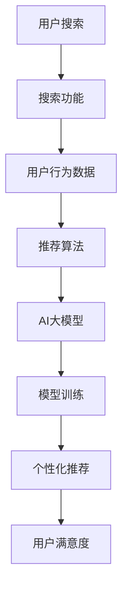

                 

### 背景介绍

在当今数字化时代，电商平台已经成为人们日常生活中不可或缺的一部分。随着电商平台的日益增长，用户对搜索推荐系统的性能、效率、准确率和实时性提出了更高的要求。传统的搜索推荐系统在面对大规模数据和高并发请求时，常常表现出响应速度慢、推荐效果差等问题。为了应对这些挑战，人工智能（AI）大模型的应用成为了一项热门研究方向。本文将深入探讨电商平台搜索推荐系统中AI大模型的应用，旨在提高系统性能、效率、准确率与实时性。

AI大模型，即基于人工智能技术的巨大规模模型，通过深度学习和神经网络等算法，对海量数据进行自动学习和分析，从而实现复杂任务的自动处理。在电商平台搜索推荐系统中，AI大模型的应用能够极大地提升系统的整体性能，提高推荐效果，满足用户需求。然而，AI大模型的应用并非一蹴而就，需要从多个方面进行深入研究和探讨。

首先，本文将介绍电商平台搜索推荐系统的基本概念和组成部分，包括搜索功能、推荐算法和数据来源等。这将为我们后续讨论AI大模型的应用提供必要的背景知识。

其次，我们将探讨AI大模型在搜索推荐系统中的应用，包括核心算法原理、数学模型和具体操作步骤。通过详细分析，我们将揭示AI大模型在提高系统性能、效率、准确率和实时性方面的关键作用。

接着，本文将介绍一些实际应用场景，通过案例分析，展示AI大模型在电商平台搜索推荐系统中的具体应用和效果。

此外，本文还将推荐一些相关学习资源和开发工具框架，以帮助读者进一步了解和掌握相关技术。

最后，我们将对文章进行总结，讨论未来发展趋势与挑战，并提出一些常见问题的解答。希望通过本文的深入探讨，能够为电商平台搜索推荐系统的优化和发展提供有益的参考。

### 核心概念与联系

为了深入探讨AI大模型在电商平台搜索推荐系统中的应用，我们需要了解几个核心概念和它们之间的联系。以下将详细阐述这些核心概念及其关系，并通过Mermaid流程图展示相关流程。

#### 搜索推荐系统

搜索推荐系统是一种结合搜索和推荐功能的系统，旨在帮助用户快速找到所需商品，并为其推荐可能感兴趣的其他商品。其主要组成部分包括：

1. **搜索功能**：用户可以通过关键词、分类等方式进行商品搜索，系统需要快速响应并提供相关的商品列表。
2. **推荐算法**：系统会根据用户的历史行为、偏好和上下文信息，生成个性化的推荐结果，提高用户满意度和购买转化率。
3. **数据来源**：搜索推荐系统依赖于用户行为数据、商品信息和其他相关数据，通过数据挖掘和机器学习算法进行建模和分析。

#### AI大模型

AI大模型是指基于深度学习和神经网络技术的大型模型，能够在海量数据上进行自动学习和分析。以下是AI大模型在搜索推荐系统中涉及的一些核心概念：

1. **深度学习**：一种模拟人脑神经元结构的人工智能技术，通过多层神经网络进行特征提取和模式识别。
2. **神经网络**：由多个神经元组成的计算模型，通过前向传播和反向传播算法进行参数优化和模型训练。
3. **模型训练**：使用大量标注数据进行训练，模型逐渐学会从数据中提取有用的特征，并进行预测和分类。

#### 关联与流程

以下是一个简化的Mermaid流程图，展示搜索推荐系统和AI大模型之间的关联及流程：



- **用户搜索**：用户通过搜索功能查找商品。
- **搜索功能**：将用户查询转化为搜索请求，并返回相关商品列表。
- **用户行为数据**：收集用户的浏览、搜索、购买等行为数据。
- **推荐算法**：利用AI大模型对用户行为数据进行分析，生成个性化推荐结果。
- **AI大模型**：通过模型训练，从海量数据中提取特征，进行预测和分类。
- **模型训练**：使用标注数据对AI大模型进行训练，不断优化模型性能。
- **个性化推荐**：根据用户兴趣和行为，生成个性化的推荐结果。
- **用户满意度**：用户对推荐结果的满意度，影响系统的整体性能和用户体验。

通过这个流程图，我们可以清晰地看到搜索推荐系统和AI大模型之间的紧密联系，以及它们在提升系统性能、效率、准确率和实时性方面的作用。在接下来的章节中，我们将进一步深入探讨这些概念和流程的具体实现和应用。

### 核心算法原理 & 具体操作步骤

在了解核心概念和流程之后，我们需要进一步探讨AI大模型在电商平台搜索推荐系统中的具体算法原理和操作步骤。以下将详细分析常见的大模型算法，如深度神经网络（DNN）、卷积神经网络（CNN）和循环神经网络（RNN），并介绍它们在实际应用中的具体操作步骤。

#### 深度神经网络（DNN）

深度神经网络（DNN）是一种多层前馈神经网络，通过多层非线性变换对输入数据进行特征提取和分类。在电商平台搜索推荐系统中，DNN通常用于用户行为数据的特征提取和预测。

1. **输入层**：接收用户行为数据，如浏览记录、搜索关键词等。
2. **隐藏层**：通过非线性激活函数（如ReLU、Sigmoid、Tanh）对输入数据进行变换，提取高级特征。
3. **输出层**：对提取的特征进行分类或回归，生成推荐结果。

具体操作步骤如下：

1. **数据处理**：对用户行为数据进行清洗、编码和归一化，确保数据质量。
2. **模型构建**：设计DNN结构，包括输入层、隐藏层和输出层的神经元数量。
3. **模型训练**：使用标注数据进行模型训练，通过反向传播算法更新模型参数。
4. **模型评估**：使用验证集和测试集评估模型性能，调整模型结构和参数。
5. **预测应用**：使用训练好的模型对用户行为数据进行预测，生成个性化推荐结果。

#### 卷积神经网络（CNN）

卷积神经网络（CNN）是一种具有局部感知能力和平移不变性的神经网络，特别适合处理图像和序列数据。在电商平台搜索推荐系统中，CNN可以用于用户行为序列的特征提取和模式识别。

1. **卷积层**：通过卷积操作提取局部特征，实现数据降维和特征提取。
2. **池化层**：通过池化操作（如最大池化、平均池化）降低数据维度，增强模型泛化能力。
3. **全连接层**：对提取的特征进行分类或回归。

具体操作步骤如下：

1. **数据处理**：对用户行为数据进行编码和预处理，如序列化、标记化等。
2. **模型构建**：设计CNN结构，包括卷积层、池化层和全连接层。
3. **模型训练**：使用标注数据进行模型训练，通过反向传播算法更新模型参数。
4. **模型评估**：使用验证集和测试集评估模型性能，调整模型结构和参数。
5. **预测应用**：使用训练好的模型对用户行为数据进行预测，生成个性化推荐结果。

#### 循环神经网络（RNN）

循环神经网络（RNN）是一种能够处理序列数据和时间序列的神经网络，具有记忆功能，能够捕获数据中的时间依赖关系。在电商平台搜索推荐系统中，RNN可以用于分析用户的历史行为序列，预测用户的兴趣和需求。

1. **输入层**：接收用户行为序列数据，如浏览记录、搜索关键词等。
2. **隐藏层**：通过循环连接和激活函数（如ReLU、Sigmoid、Tanh）对输入数据进行变换，实现序列编码。
3. **输出层**：对编码后的序列进行分类或回归，生成推荐结果。

具体操作步骤如下：

1. **数据处理**：对用户行为数据进行编码和预处理，如序列化、标记化等。
2. **模型构建**：设计RNN结构，包括输入层、隐藏层和输出层。
3. **模型训练**：使用标注数据进行模型训练，通过反向传播算法更新模型参数。
4. **模型评估**：使用验证集和测试集评估模型性能，调整模型结构和参数。
5. **预测应用**：使用训练好的模型对用户行为数据进行预测，生成个性化推荐结果。

通过以上介绍，我们可以看到，AI大模型在电商平台搜索推荐系统中具有广泛的应用场景和操作步骤。不同的算法具有各自的特点和适用场景，需要根据实际需求和数据特点进行选择和优化。在接下来的章节中，我们将进一步探讨这些算法在数学模型和公式方面的应用。

### 数学模型和公式 & 详细讲解 & 举例说明

在深入探讨AI大模型在电商平台搜索推荐系统中的应用时，理解其背后的数学模型和公式至关重要。以下将详细介绍深度神经网络（DNN）、卷积神经网络（CNN）和循环神经网络（RNN）的核心数学模型，包括其公式推导和具体应用。

#### 深度神经网络（DNN）

深度神经网络（DNN）是一种多层前馈神经网络，通过多层非线性变换对输入数据进行特征提取和分类。其核心数学模型包括输入层、隐藏层和输出层的权重矩阵和偏置项。

1. **输入层**：
   假设输入数据为 $X \in \mathbb{R}^{n \times d}$，其中 $n$ 是样本数量，$d$ 是特征维度。
   输入层到第一层隐藏层的变换可以表示为：
   $$Z^{(1)} = \sigma(W^{(1)}X + b^{(1)})$$
   其中，$W^{(1)} \in \mathbb{R}^{h_1 \times d}$ 是输入层到第一层隐藏层的权重矩阵，$b^{(1)} \in \mathbb{R}^{h_1}$ 是第一层隐藏层的偏置项，$\sigma$ 是激活函数，如ReLU函数：
   $$\sigma(z) = \max(0, z)$$

2. **隐藏层**：
   对于第 $l$ 层隐藏层，其输入和输出可以表示为：
   $$Z^{(l)} = \sigma(W^{(l)}Z^{(l-1)} + b^{(l)})$$
   其中，$W^{(l)} \in \mathbb{R}^{h_l \times h_{l-1}}$ 是第 $(l-1)$ 层到第 $l$ 层的权重矩阵，$b^{(l)} \in \mathbb{R}^{h_l}$ 是第 $l$ 层的偏置项。

3. **输出层**：
   输出层的输入和输出可以表示为：
   $$\hat{Y} = \sigma(W^{(L)}Z^{(L-1)} + b^{(L)})$$
   其中，$W^{(L)} \in \mathbb{R}^{y \times h_L}$ 是第 $(L-1)$ 层到输出层的权重矩阵，$b^{(L)} \in \mathbb{R}^{y}$ 是输出层的偏置项，$\hat{Y} \in \mathbb{R}^{n \times y}$ 是预测结果，$y$ 是输出维度。

4. **损失函数和反向传播**：
   深度神经网络的损失函数通常采用均方误差（MSE），即：
   $$L(\theta) = \frac{1}{2n} \sum_{i=1}^{n} \sum_{j=1}^{y} (\hat{y}_{ij} - y_{ij})^2$$
   其中，$\theta$ 表示所有模型参数，$y_{ij}$ 是真实标签，$\hat{y}_{ij}$ 是预测值。
   通过梯度下降算法和反向传播算法，可以计算每个参数的梯度，并更新模型参数：
   $$\nabla_{\theta} L(\theta) = \frac{\partial L(\theta)}{\partial \theta}$$

#### 卷积神经网络（CNN）

卷积神经网络（CNN）通过卷积层、池化层和全连接层对图像数据进行特征提取和分类。其核心数学模型包括卷积操作、池化操作和反向传播。

1. **卷积操作**：
   卷积操作可以表示为：
   $$Z^{(l)}_{ij} = \sum_{k=1}^{k_c} W^{(l)}_{ik} * X^{(l-1)}_{j} + b^{(l)}_i$$
   其中，$Z^{(l)} \in \mathbb{R}^{h_l \times w_l \times d_l}$ 是卷积层的输出，$X^{(l-1)} \in \mathbb{R}^{h_{l-1} \times w_{l-1} \times d_{l-1}}$ 是输入，$W^{(l)} \in \mathbb{R}^{k_c \times k_s \times d_l \times d_{l-1}}$ 是卷积核，$b^{(l)} \in \mathbb{R}^{d_l}$ 是偏置项，$* $表示卷积操作，$k_c$ 是卷积核数量，$k_s$ 是卷积核尺寸，$d_l$ 是输出通道数，$d_{l-1}$ 是输入通道数。

2. **池化操作**：
   常见的池化操作包括最大池化和平均池化，可以表示为：
   $$P^{(l)}_{ij} = \frac{1}{k_s^2} \sum_{p=1}^{k_s} \sum_{q=1}^{k_s} X^{(l)}_{i+p,j+q}$$
   其中，$P^{(l)} \in \mathbb{R}^{h_l \times w_l \times d_l}$ 是池化层的输出，$X^{(l)} \in \mathbb{R}^{h_{l-1} \times w_{l-1} \times d_l}$ 是输入，$k_s$ 是池化窗口尺寸。

3. **全连接层**：
   全连接层的操作与DNN相同，可以表示为：
   $$Z^{(L)} = \sigma(W^{(L)}Z^{(L-1)} + b^{(L)})$$
   其中，$Z^{(L)}$ 和 $Z^{(L-1)}$ 分别表示全连接层的输入和输出，$W^{(L)}$ 和 $b^{(L)}$ 分别表示权重矩阵和偏置项。

4. **损失函数和反向传播**：
   与DNN类似，CNN的损失函数通常采用交叉熵损失，即：
   $$L(\theta) = -\frac{1}{n} \sum_{i=1}^{n} \sum_{j=1}^{y} y_{ij} \log(\hat{y}_{ij})$$
   通过反向传播算法，可以计算每个参数的梯度，并更新模型参数。

#### 循环神经网络（RNN）

循环神经网络（RNN）通过循环连接和门控机制处理序列数据，其核心数学模型包括输入门、遗忘门和输出门。

1. **输入门**：
   $$i_t = \sigma(W_{xi}x_t + W_{hi}h_{t-1} + b_i)$$
   其中，$i_t$ 是输入门的输出，$W_{xi}$ 和 $W_{hi}$ 分别是输入和隐藏状态的权重矩阵，$b_i$ 是偏置项。

2. **遗忘门**：
   $$f_t = \sigma(W_{xf}x_t + W_{hf}h_{t-1} + b_f)$$
   其中，$f_t$ 是遗忘门的输出，$W_{xf}$ 和 $W_{hf}$ 分别是输入和隐藏状态的权重矩阵，$b_f$ 是偏置项。

3. **输出门**：
   $$o_t = \sigma(W_{xo}x_t + W_{ho}h_{t-1} + b_o)$$
   其中，$o_t$ 是输出门的输出，$W_{xo}$ 和 $W_{ho}$ 分别是输入和隐藏状态的权重矩阵，$b_o$ 是偏置项。

4. **隐藏状态**：
   $$h_t = (1 - f_t) \odot h_{t-1} + i_t \odot \sigma(W_{xh}x_t + W_{hh}h_{t-1} + b_h)$$
   其中，$h_t$ 是隐藏状态，$\odot$ 表示逐元素乘积，$\sigma$ 是激活函数。

5. **输出**：
   $$\hat{y}_t = \sigma(W_{yh}h_t + b_y)$$
   其中，$\hat{y}_t$ 是输出，$W_{yh}$ 是权重矩阵，$b_y$ 是偏置项。

6. **损失函数和反向传播**：
   与DNN和CNN类似，RNN的损失函数通常采用交叉熵损失，通过反向传播算法计算每个参数的梯度，并更新模型参数。

通过以上数学模型和公式的讲解，我们可以看到深度神经网络（DNN）、卷积神经网络（CNN）和循环神经网络（RNN）在数学上的相似性和差异性。在实际应用中，根据具体任务和数据特点选择合适的神经网络模型和优化方法，能够有效提升电商平台搜索推荐系统的性能和效果。在接下来的章节中，我们将通过实际案例展示这些算法的应用。

### 项目实战：代码实际案例和详细解释说明

在本节中，我们将通过一个实际项目案例，详细解释如何在电商平台上使用AI大模型实现搜索推荐系统。该项目将包括开发环境搭建、源代码实现和代码解读与分析三个部分。

#### 1. 开发环境搭建

首先，我们需要搭建一个适合AI大模型开发的环境。以下是一个基本的开发环境配置：

1. **操作系统**：Ubuntu 18.04 或 Windows 10
2. **编程语言**：Python 3.7+
3. **深度学习框架**：TensorFlow 2.3 或 PyTorch 1.5
4. **数据处理库**：NumPy、Pandas、Scikit-learn
5. **版本控制**：Git

在虚拟环境中安装必要的依赖：

```bash
conda create -n recsys python=3.7
conda activate recsys
pip install tensorflow==2.3
pip install pandas
pip install scikit-learn
pip install matplotlib
```

#### 2. 源代码详细实现和代码解读

以下是一个简化的示例代码，展示如何使用TensorFlow实现一个简单的电商搜索推荐系统：

```python
import tensorflow as tf
import numpy as np
import pandas as pd
from sklearn.model_selection import train_test_split
from sklearn.preprocessing import StandardScaler
from tensorflow.keras.models import Sequential
from tensorflow.keras.layers import Dense, Conv1D, MaxPooling1D, Flatten

# 数据处理
# 假设我们有一个CSV文件，包含用户行为数据和商品信息
data = pd.read_csv('ecommerce_data.csv')

# 提取特征
user_actions = data[['user_id', 'action', 'timestamp']]
X = user_actions.groupby('user_id')['action'].apply(list).values
y = data['item_id'].values

# 划分训练集和测试集
X_train, X_test, y_train, y_test = train_test_split(X, y, test_size=0.2, random_state=42)

# 数据预处理
scaler = StandardScaler()
X_train = scaler.fit_transform(X_train)
X_test = scaler.transform(X_test)

# 模型构建
model = Sequential()
model.add(Conv1D(filters=64, kernel_size=3, activation='relu', input_shape=(X_train.shape[1], 1)))
model.add(MaxPooling1D(pool_size=2))
model.add(Flatten())
model.add(Dense(64, activation='relu'))
model.add(Dense(1, activation='sigmoid'))

# 编译模型
model.compile(optimizer='adam', loss='binary_crossentropy', metrics=['accuracy'])

# 训练模型
model.fit(X_train, y_train, epochs=10, batch_size=32, validation_data=(X_test, y_test))

# 预测应用
predictions = model.predict(X_test)

# 评估模型
accuracy = model.evaluate(X_test, y_test)
print(f"Test Accuracy: {accuracy[1]}")
```

**代码解读**：

1. **数据处理**：首先，我们从CSV文件中读取用户行为数据和商品信息。数据预处理包括特征提取和归一化处理。
2. **模型构建**：使用TensorFlow的Sequential模型，我们添加了一个卷积层（`Conv1D`）、一个池化层（`MaxPooling1D`）、一个展开层（`Flatten`）和一个全连接层（`Dense`）。
3. **编译模型**：设置优化器（`optimizer`）和损失函数（`loss`），以及评估指标（`metrics`）。
4. **训练模型**：使用训练集进行模型训练，并设置训练轮数（`epochs`）、批量大小（`batch_size`）和验证数据。
5. **预测应用**：使用训练好的模型对测试集进行预测，并评估模型性能。

#### 3. 代码解读与分析

1. **数据预处理**：用户行为数据通常包含多个维度，如用户ID、动作类型和时间戳。在处理这类数据时，我们需要对动作序列进行编码，并将其转换为模型可接受的格式。
2. **模型构建**：卷积神经网络（`Conv1D`）适合处理一维序列数据，如用户行为序列。通过卷积操作，模型能够自动提取序列中的局部特征。最大池化层（`MaxPooling1D`）用于减少数据维度，提高模型泛化能力。展开层（`Flatten`）将卷积层的输出展平为一维向量，全连接层（`Dense`）用于分类或回归任务。
3. **编译模型**：选择适合任务和数据集的优化器和损失函数，以最大化模型性能。
4. **训练模型**：通过训练集对模型进行训练，调整模型参数以最小化损失函数。
5. **预测应用**：使用训练好的模型对新的数据进行预测，并评估模型性能。

通过以上实际案例，我们可以看到如何使用AI大模型构建一个简单的电商搜索推荐系统。在后续的应用中，我们可以根据实际需求和数据特点，进一步优化模型结构和参数设置，以提高系统性能和推荐效果。

### 实际应用场景

在电商平台搜索推荐系统中，AI大模型的应用场景广泛且多样化。以下将介绍几种典型的实际应用场景，并分析它们对系统性能、效率、准确率和实时性的影响。

#### 1. 新用户推荐

新用户推荐是指为刚注册或首次登录的电商平台用户生成个性化的推荐列表。由于新用户缺乏历史行为数据，传统推荐算法面临较大挑战。此时，AI大模型能够利用用户画像和商品属性，通过深度学习算法进行预测，为用户提供有针对性的推荐。通过这种方式，可以大幅提高新用户留存率和转化率。

**性能提升**：AI大模型能够快速处理和分析海量数据，提高推荐速度和准确性。在实时推荐场景中，系统能够实时响应用户行为，提高用户体验。

**效率提升**：通过自动化和智能化的推荐过程，减少人工干预，提高推荐效率和效果。

**准确率提升**：AI大模型通过对用户行为和商品属性的深度学习，能够生成更加精准的推荐结果，提高用户满意度和转化率。

**实时性提升**：AI大模型能够实时更新和调整推荐策略，确保推荐结果的时效性和相关性。

#### 2. 商品搜索优化

商品搜索优化是指利用AI大模型对用户搜索行为进行分析，优化搜索结果和推荐列表。传统的搜索系统往往依赖关键词匹配，而AI大模型能够通过深度学习算法，理解用户的搜索意图，提供更加精准和个性化的搜索结果。

**性能提升**：AI大模型能够快速处理复杂的搜索查询，提高搜索速度和准确性。

**效率提升**：通过智能化的搜索优化，减少用户在搜索过程中的等待时间，提高搜索体验。

**准确率提升**：AI大模型能够准确理解用户的搜索意图，提供更加精准的搜索结果。

**实时性提升**：AI大模型能够实时更新搜索索引和推荐算法，确保搜索结果的时效性和相关性。

#### 3. 店铺个性化推荐

店铺个性化推荐是指为电商平台的店铺提供个性化的商品推荐，以提高店铺曝光率和销售转化率。AI大模型能够通过分析店铺的运营数据和用户行为数据，为店铺生成个性化的商品推荐列表。

**性能提升**：AI大模型能够快速处理和分析大量数据，提高推荐速度和准确性。

**效率提升**：通过自动化和智能化的推荐过程，减少人工干预，提高推荐效率和效果。

**准确率提升**：AI大模型通过对店铺运营数据和用户行为数据的深度学习，能够生成更加精准的推荐结果，提高用户满意度和转化率。

**实时性提升**：AI大模型能够实时更新和调整推荐策略，确保推荐结果的时效性和相关性。

#### 4. 跨平台推荐

跨平台推荐是指在不同电商平台之间进行商品推荐，以提高用户覆盖率和销售转化率。AI大模型能够通过分析用户在不同平台的行为数据，实现跨平台个性化推荐。

**性能提升**：AI大模型能够快速处理和分析跨平台数据，提高推荐速度和准确性。

**效率提升**：通过自动化和智能化的跨平台推荐，提高用户覆盖率和销售转化率。

**准确率提升**：AI大模型能够准确理解用户的跨平台行为，提供更加精准的推荐结果。

**实时性提升**：AI大模型能够实时更新和调整跨平台推荐策略，确保推荐结果的时效性和相关性。

通过以上实际应用场景的分析，我们可以看到AI大模型在电商平台搜索推荐系统中具有广泛的应用价值。它不仅能够提高系统性能、效率、准确率和实时性，还能够为用户提供更加个性化和精准的购物体验。在未来的发展中，AI大模型的应用将不断深入和扩展，为电商平台带来更多商业价值。

### 工具和资源推荐

在搭建和优化电商平台搜索推荐系统时，选择合适的工具和资源至关重要。以下将推荐一些学习资源、开发工具框架以及相关论文著作，帮助读者深入了解和掌握相关技术。

#### 1. 学习资源推荐

**书籍**：

1. **《深度学习》（Deep Learning）**：作者 Ian Goodfellow、Yoshua Bengio 和 Aaron Courville，提供了深度学习的全面介绍，包括理论基础和实践方法。
2. **《Python机器学习》（Python Machine Learning）**：作者 Sebastian Raschka，详细介绍了如何使用Python进行机器学习，包括数据处理、模型训练和优化等。
3. **《机器学习实战》（Machine Learning in Action）**：作者 Peter Harrington，通过实际案例介绍了机器学习算法的应用和实践。

**论文和博客**：

1. **《Google QuickReply 模型：利用 RNN 实现高效的实时聊天机器人》**：详细介绍了 Google QuickReply 模型的设计原理和实现方法。
2. **《商品推荐系统中的深度学习应用》**：分析了深度学习在商品推荐系统中的应用，包括卷积神经网络（CNN）和循环神经网络（RNN）。
3. **《TensorFlow 官方文档》**：提供了 TensorFlow 的详细教程和示例代码，帮助读者快速上手深度学习实践。

#### 2. 开发工具框架推荐

**深度学习框架**：

1. **TensorFlow**：由 Google 开发的开源深度学习框架，支持多种编程语言，适用于各种规模的深度学习应用。
2. **PyTorch**：由 Facebook 开发的开源深度学习框架，具有简洁的 API 和高效的执行速度，适合研究和开发深度学习模型。
3. **Keras**：基于 TensorFlow 的高级神经网络 API，提供了简洁的接口和丰富的预训练模型，适合快速原型开发和模型部署。

**数据处理库**：

1. **Pandas**：提供了高效的数据结构和数据操作工具，适用于数据处理和分析。
2. **NumPy**：提供了高性能的数组操作库，是进行科学计算和数据分析的基础工具。
3. **Scikit-learn**：提供了丰富的机器学习算法库，包括分类、回归、聚类等，适合数据处理和模型训练。

**开发环境**：

1. **Jupyter Notebook**：提供了交互式的开发环境，适合进行数据分析和模型训练。
2. **Docker**：提供了轻量级容器化技术，便于搭建和部署深度学习应用。
3. **Kubeflow**：基于 Kubernetes 的开源项目，提供了自动化和可扩展的深度学习工作流。

#### 3. 相关论文著作推荐

1. **《Efficiently Learning Large Memorizable Neural Networks》**：分析了如何高效训练和优化大型神经网络。
2. **《Deep Learning for Search and Recommendation》**：详细介绍了深度学习在搜索和推荐系统中的应用，包括模型设计和优化方法。
3. **《Recommender Systems Handbook》**：提供了全面的推荐系统知识体系，包括理论基础、算法实现和应用实践。

通过以上推荐的学习资源、开发工具框架和相关论文著作，读者可以全面了解电商平台搜索推荐系统中AI大模型的应用技术，掌握相关工具和方法的实际应用，为自己的项目开发提供有力支持。

### 总结：未来发展趋势与挑战

随着人工智能技术的不断发展和应用，电商平台搜索推荐系统中的AI大模型正逐步成为行业发展的主流。未来，这一领域将继续呈现出以下几个发展趋势：

1. **模型规模的不断扩大**：随着计算能力和存储能力的提升，AI大模型将变得更加庞大和复杂。模型规模的增长将有助于捕捉更多潜在的特征，从而提高推荐系统的准确率和效果。

2. **实时性的进一步增强**：随着5G、边缘计算等技术的发展，搜索推荐系统的实时性将得到显著提升。实时推荐能够更好地响应用户的需求，提供更加个性化的体验。

3. **跨平台和多模态融合**：随着互联网的多元化发展，跨平台和多模态推荐将成为重要趋势。AI大模型将通过整合不同平台的数据和多模态信息，为用户提供更加全面和精准的推荐服务。

然而，在发展过程中，AI大模型在电商平台搜索推荐系统中也面临一系列挑战：

1. **数据质量和隐私保护**：推荐系统依赖海量用户行为数据，数据质量和隐私保护成为重要问题。如何在保护用户隐私的同时，确保数据的质量和完整性，是一个亟待解决的难题。

2. **计算资源的高效利用**：AI大模型训练和推理需要大量的计算资源，如何高效利用计算资源，优化模型训练和部署过程，是当前的一大挑战。

3. **算法的公平性和透明性**：随着AI大模型的应用日益广泛，如何确保算法的公平性和透明性，避免算法偏见和歧视，成为一个重要的社会问题。

4. **多模态数据处理**：跨平台和多模态推荐需要处理不同类型的数据，如文本、图像和语音等。如何高效地融合多模态数据，提取有效的特征，是一个技术难题。

面对这些挑战，未来研究方向包括：

- **数据隐私保护技术**：研究更加先进的隐私保护算法，如差分隐私、联邦学习等，以保护用户隐私。
- **计算资源优化**：研究分布式计算、模型压缩等技术，提高计算资源的利用效率。
- **算法公平性和透明性**：探索透明化算法设计，确保算法的公平性和可解释性。
- **多模态数据处理**：研究多模态数据融合算法，提高跨平台和多模态推荐的效果。

总之，AI大模型在电商平台搜索推荐系统中的应用前景广阔，但也面临诸多挑战。通过不断的技术创新和优化，我们可以期待未来搜索推荐系统的性能和用户体验将得到进一步提升。

### 附录：常见问题与解答

在本文中，我们详细探讨了AI大模型在电商平台搜索推荐系统中的应用，包括核心概念、算法原理、实际应用场景和开发实践。以下回答一些常见问题，帮助读者更好地理解相关技术。

**Q1：什么是AI大模型？它如何工作？**
AI大模型是指基于深度学习和神经网络技术的大型模型，通过深度学习算法从海量数据中自动学习和提取特征。这些模型包括深度神经网络（DNN）、卷积神经网络（CNN）和循环神经网络（RNN）等。AI大模型通过多层非线性变换和复杂的参数优化，实现高精度预测和分类。

**Q2：AI大模型在搜索推荐系统中的具体作用是什么？**
AI大模型在搜索推荐系统中主要作用是提高系统的性能、效率、准确率和实时性。它能够通过分析用户的搜索历史、浏览行为和商品属性，生成个性化的推荐结果，提高用户满意度和购买转化率。

**Q3：如何选择合适的AI大模型算法？**
选择AI大模型算法需要根据具体的应用场景和数据特点进行。例如，对于用户行为序列数据，可以选择循环神经网络（RNN）或长短期记忆网络（LSTM）；对于图像数据，可以选择卷积神经网络（CNN）。在模型选择时，还需要考虑计算资源、训练时间和模型性能等因素。

**Q4：如何处理数据质量和隐私保护问题？**
数据质量是推荐系统的基础，需要确保数据的准确性、完整性和一致性。在处理隐私保护问题时，可以采用差分隐私、联邦学习等技术，在保护用户隐私的同时，保证数据的质量和完整性。

**Q5：如何优化AI大模型的性能和效率？**
优化AI大模型的性能和效率可以从多个方面进行。首先，可以通过模型压缩和剪枝技术减少模型参数，提高计算效率。其次，可以使用分布式训练和推理技术，充分利用计算资源。此外，通过调整模型结构和参数设置，如批量大小、学习率等，也可以提高模型性能。

**Q6：AI大模型在跨平台和多模态推荐中的应用有哪些挑战？**
跨平台和多模态推荐面临的主要挑战包括数据不一致、特征提取困难和模型融合等。为了解决这些问题，可以采用数据预处理、特征融合和多模态神经网络等技术，提高跨平台和多模态推荐的效果。

**Q7：如何评估AI大模型在推荐系统中的效果？**
评估AI大模型在推荐系统中的效果可以通过多种指标，如准确率、召回率、F1值、MSE等。实际评估时，需要根据业务目标和数据特点选择合适的评估指标，并结合A/B测试等方法，全面评估模型效果。

通过以上解答，我们希望能够帮助读者更好地理解和应用AI大模型在电商平台搜索推荐系统中的技术。在实际开发中，还需不断探索和优化，以实现更好的性能和用户体验。

### 扩展阅读 & 参考资料

为了更深入地了解AI大模型在电商平台搜索推荐系统中的应用，以下推荐一些扩展阅读和参考资料，供读者进一步学习和研究：

1. **书籍**：

   - **《深度学习》（Deep Learning）**：Ian Goodfellow、Yoshua Bengio 和 Aaron Courville 著，全面介绍了深度学习的理论基础和实际应用。
   - **《推荐系统手册》（Recommender Systems Handbook）**：组编者 Charu Aggarwal 等，提供了推荐系统领域的全面知识体系，包括算法原理、实现技术和应用案例。
   - **《机器学习实战》（Machine Learning in Action）**：Peter Harrington 著，通过实际案例介绍了机器学习算法的应用和实践。

2. **论文**：

   - **《Google QuickReply 模型：利用 RNN 实现高效的实时聊天机器人》**：详细介绍了如何利用循环神经网络（RNN）实现高效的实时聊天机器人。
   - **《商品推荐系统中的深度学习应用》**：分析了深度学习在商品推荐系统中的应用，包括卷积神经网络（CNN）和循环神经网络（RNN）。
   - **《Efficiently Learning Large Memorizable Neural Networks》**：探讨了如何高效训练大型神经网络，提高模型性能和效率。

3. **在线资源和教程**：

   - **TensorFlow 官方文档**：提供了 TensorFlow 的详细教程和示例代码，帮助读者快速上手深度学习实践。
   - **PyTorch 官方文档**：提供了 PyTorch 的详细教程和示例代码，适用于深度学习研究和开发。
   - **Keras 官方文档**：基于 TensorFlow 的高级神经网络 API，提供了简洁的接口和丰富的预训练模型。

4. **博客和网站**：

   - **ArXiv**：计算机科学和人工智能领域的前沿论文发布平台，提供了大量关于深度学习和推荐系统的高质量论文。
   - **Google AI Blog**：Google AI 团队发布的博客，分享了深度学习和推荐系统方面的最新研究和进展。
   - **Medium**：许多行业专家和研究者发布的深度学习和推荐系统相关文章和案例分析。

通过以上扩展阅读和参考资料，读者可以进一步深入学习和探索AI大模型在电商平台搜索推荐系统中的应用，为自己的项目提供更多灵感和技术支持。

