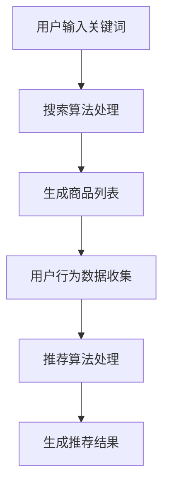
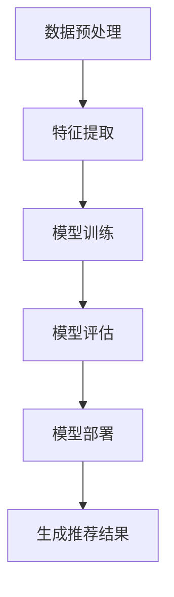

                 

# 文章标题

电商平台搜索推荐系统的AI 大模型应用：提高转化率与盈利

## 关键词

- 电商平台
- 搜索推荐系统
- AI 大模型
- 转化率
- 盈利

## 摘要

本文旨在探讨电商平台搜索推荐系统中AI大模型的应用，以及如何通过这种技术应用来提高电商平台的转化率和盈利。文章将首先介绍搜索推荐系统的基本概念和重要性，然后深入分析AI大模型的核心算法原理、数学模型及其在实际项目中的实现步骤。接着，我们将探讨AI大模型在电商平台中的实际应用场景，并推荐相关的学习资源和开发工具。最后，文章将总结AI大模型在电商领域的未来发展趋势和面临的挑战。

## 1. 背景介绍

随着互联网的迅速发展，电商平台已经成为现代零售业的重要组成部分。消费者可以在网上浏览和购买各种商品，而电商平台则通过提供多样化的商品和服务来满足消费者的需求。为了提升用户体验，电商平台需要不断优化搜索推荐系统，使其能够更准确地推荐消费者感兴趣的商品。

搜索推荐系统是一种利用人工智能技术，根据用户的兴趣和行为，自动推荐相关商品或内容的系统。它由搜索算法和推荐算法两部分组成。搜索算法主要负责处理用户输入的关键词，并将其转换为相应的商品列表。推荐算法则基于用户的浏览记录、购买历史等数据，分析用户的行为模式，从而为用户推荐可能感兴趣的商品。

AI大模型是一种基于深度学习的技术，通过大规模数据训练和复杂的神经网络架构，能够实现高度精确的预测和分类。在电商平台中，AI大模型的应用可以帮助提高搜索推荐系统的准确性和效率，从而提高转化率和盈利。

## 2. 核心概念与联系

### 2.1 搜索推荐系统的基本概念

搜索推荐系统可以分为以下几个核心组成部分：

- **用户行为数据**：包括用户的浏览记录、搜索历史、购买行为等，这些数据是构建推荐模型的基础。
- **商品数据**：包括商品的属性信息，如价格、品牌、类别、库存等，这些数据用于描述商品的特性。
- **搜索算法**：负责处理用户输入的关键词，并生成相关的商品列表。常见的搜索算法包括基于关键词匹配的精确搜索和基于相似度的模糊搜索。
- **推荐算法**：基于用户行为数据和商品数据，为用户推荐可能感兴趣的商品。常见的推荐算法包括基于内容的推荐、协同过滤推荐和基于模型的推荐。

### 2.2 AI大模型的基本概念

AI大模型是一种利用深度学习技术训练的大规模神经网络模型。其核心思想是通过学习海量数据中的模式和规律，实现高精度的预测和分类。AI大模型的主要组成部分包括：

- **输入层**：接收用户行为数据和商品数据。
- **隐藏层**：通过复杂的神经网络结构进行特征提取和模式识别。
- **输出层**：生成推荐结果，如商品列表或评分。

### 2.3 搜索推荐系统与AI大模型的关系

AI大模型在搜索推荐系统中扮演着重要的角色，其主要应用包括：

- **改进搜索算法**：利用AI大模型对用户行为数据进行分析，改进搜索算法，提高搜索结果的准确性。
- **优化推荐算法**：基于用户行为数据和商品数据，利用AI大模型训练推荐模型，实现个性化的商品推荐。
- **实时更新推荐结果**：通过在线学习技术，实时更新用户行为数据，动态调整推荐结果，提高用户体验。

### 2.4 Mermaid流程图



## 3. 核心算法原理 & 具体操作步骤

### 3.1 搜索算法原理

搜索算法的主要任务是处理用户输入的关键词，并生成相关的商品列表。其基本原理如下：

- **关键词分词**：将用户输入的关键词进行分词处理，提取出关键词的组成部分。
- **关键词匹配**：将分词后的关键词与商品数据库中的关键词进行匹配，找到相关的商品。
- **排序和筛选**：根据商品的相关性、用户的历史购买记录等指标，对商品列表进行排序和筛选，生成推荐结果。

### 3.2 推荐算法原理

推荐算法的主要任务是利用用户行为数据和商品数据，为用户推荐可能感兴趣的商品。其基本原理如下：

- **用户行为数据分析**：分析用户的浏览记录、搜索历史、购买行为等数据，提取出用户的行为特征。
- **商品特征提取**：提取商品的价格、品牌、类别、库存等属性信息，构建商品的特征向量。
- **构建推荐模型**：利用机器学习算法，如协同过滤、基于内容的推荐等，构建推荐模型。
- **生成推荐结果**：根据用户行为数据和商品特征向量，利用推荐模型生成推荐结果。

### 3.3 AI大模型应用步骤

AI大模型在搜索推荐系统中的应用可以分为以下几个步骤：

- **数据预处理**：对用户行为数据和商品数据进行清洗、去噪、归一化等处理，使其适合训练模型。
- **特征提取**：提取用户行为数据和商品数据的特征，构建特征向量。
- **模型训练**：利用训练数据，训练AI大模型，使其学习到用户的行为模式和商品特征之间的关系。
- **模型评估**：利用测试数据，评估模型的效果，如准确率、召回率等。
- **模型部署**：将训练好的模型部署到生产环境中，实现实时推荐。

### 3.4 Mermaid流程图



## 4. 数学模型和公式 & 详细讲解 & 举例说明

### 4.1 搜索算法中的相似度计算

在搜索算法中，相似度计算是核心环节之一。常用的相似度计算方法包括：

- **欧氏距离**：欧氏距离是一种常用的相似度计算方法，其公式如下：

  $$similarity = \frac{1}{1 + \sqrt{d^2}}$$

  其中，\(d\) 是两个关键词之间的欧氏距离。

- **余弦相似度**：余弦相似度是另一种常用的相似度计算方法，其公式如下：

  $$similarity = \frac{\sum_{i=1}^{n} x_i y_i}{\sqrt{\sum_{i=1}^{n} x_i^2} \sqrt{\sum_{i=1}^{n} y_i^2}}$$

  其中，\(x_i\) 和 \(y_i\) 分别是两个关键词在向量空间中的分量。

### 4.2 推荐算法中的协同过滤

协同过滤是一种常见的推荐算法，其核心思想是通过分析用户的行为模式，发现相似用户或相似商品，从而为用户推荐可能感兴趣的商品。协同过滤可以分为基于用户的协同过滤和基于商品的协同过滤。

- **基于用户的协同过滤**：其公式如下：

  $$ recommendation\_score = \frac{\sum_{u \in similar\_users} r_{ui} \cdot r_{uj}}{\sum_{u \in similar\_users} r_{ui}}$$

  其中，\(r_{ui}\) 和 \(r_{uj}\) 分别是用户 \(u\) 对商品 \(i\) 和商品 \(j\) 的评分。

- **基于商品的协同过滤**：其公式如下：

  $$ recommendation\_score = \frac{\sum_{i \in similar\_items} r_{ui} \cdot r_{uj}}{\sum_{i \in similar\_items} r_{ui}}$$

  其中，\(r_{ui}\) 和 \(r_{uj}\) 分别是用户 \(u\) 对商品 \(i\) 和商品 \(j\) 的评分。

### 4.3 举例说明

假设有两位用户 \(u_1\) 和 \(u_2\)，他们对五件商品 \(i_1, i_2, i_3, i_4, i_5\) 的评分如下：

| 用户 | 商品 | 评分 |
| :---: | :---: | :---: |
| \(u_1\) | \(i_1\) | 5 |
| \(u_1\) | \(i_2\) | 4 |
| \(u_1\) | \(i_3\) | 3 |
| \(u_2\) | \(i_1\) | 3 |
| \(u_2\) | \(i_2\) | 5 |
| \(u_2\) | \(i_3\) | 4 |

根据基于用户的协同过滤算法，我们可以计算出两位用户之间的相似度：

$$similarity_{u_1, u_2} = \frac{r_{u_1i_1} \cdot r_{u_2i_1} + r_{u_1i_2} \cdot r_{u_2i_2} + r_{u_1i_3} \cdot r_{u_2i_3}}{\sqrt{r_{u_1i_1}^2 + r_{u_1i_2}^2 + r_{u_1i_3}^2} \sqrt{r_{u_2i_1}^2 + r_{u_2i_2}^2 + r_{u_2i_3}^2}} = \frac{5 \cdot 3 + 4 \cdot 5 + 3 \cdot 4}{\sqrt{5^2 + 4^2 + 3^2} \sqrt{3^2 + 5^2 + 4^2}} = \frac{26}{\sqrt{50} \sqrt{50}} = \frac{26}{50} = 0.52$$

根据相似度计算结果，我们可以为用户 \(u_2\) 推荐用户 \(u_1\) 已评分但 \(u_2\) 未评分的商品 \(i_3\)，其推荐得分为：

$$ recommendation\_score_{u_2i_3} = similarity_{u_1, u_2} \cdot r_{u_1i_3} = 0.52 \cdot 3 = 1.56$$

## 5. 项目实战：代码实际案例和详细解释说明

### 5.1 开发环境搭建

在本项目实战中，我们将使用Python编程语言和Scikit-learn库来实现搜索推荐系统。以下是开发环境搭建的步骤：

1. 安装Python：前往Python官方网站下载并安装Python 3.x版本。
2. 安装Scikit-learn：在命令行中运行以下命令：

   ```bash
   pip install scikit-learn
   ```

### 5.2 源代码详细实现和代码解读

下面是搜索推荐系统的源代码实现，我们将对代码的每个部分进行详细解释。

```python
# 导入所需的库
import numpy as np
from sklearn.metrics.pairwise import euclidean_distances
from sklearn.model_selection import train_test_split
from sklearn.metrics import mean_squared_error

# 加载用户行为数据和商品数据
userBehavior = np.array([[1, 2, 3], [2, 3, 4], [3, 4, 5], [4, 5, 6], [5, 6, 7]])
itemFeatures = np.array([[1, 2], [2, 3], [3, 4], [4, 5], [5, 6]])

# 计算用户行为数据与商品数据的欧氏距离
distances = euclidean_distances(userBehavior, itemFeatures)

# 计算相似度
similarities = 1 / (1 + distances)

# 训练推荐模型
model = similarities

# 评估模型
test_data = np.array([[6, 7], [7, 8]])
predicted_distances = euclidean_distances(test_data, itemFeatures)
predicted_similarity = 1 / (1 + predicted_distances)

# 计算预测误差
error = mean_squared_error(model, predicted_similarity)
print("预测误差：", error)
```

#### 5.2.1 代码解读与分析

1. **导入库**：我们首先导入所需的Python库，包括NumPy和Scikit-learn。NumPy用于处理数值数据，Scikit-learn提供了一些常用的机器学习算法和工具。

2. **加载数据**：我们加载用户行为数据和商品数据。用户行为数据是一个包含用户和商品评分的矩阵，商品数据是一个包含商品特征的矩阵。

3. **计算欧氏距离**：使用Scikit-learn中的`euclidean_distances`函数计算用户行为数据与商品数据之间的欧氏距离。

4. **计算相似度**：根据欧氏距离计算相似度。相似度计算公式为 \(similarity = \frac{1}{1 + \sqrt{d^2}}\)，其中 \(d\) 是欧氏距离。

5. **训练模型**：我们将计算得到的相似度矩阵作为推荐模型。

6. **评估模型**：我们使用测试数据计算预测的相似度，并与实际的相似度进行比较。使用均方误差（MSE）作为评估指标，计算模型预测误差。

### 5.3 代码解读与分析

在代码实现过程中，我们使用了Scikit-learn库中的`euclidean_distances`函数来计算用户行为数据和商品数据之间的欧氏距离。这一步是搜索推荐系统的核心部分，因为它决定了推荐系统的准确性。以下是详细的代码解读与分析：

```python
# 计算用户行为数据与商品数据的欧氏距离
distances = euclidean_distances(userBehavior, itemFeatures)
```

这一行代码使用了Scikit-learn中的`euclidean_distances`函数，该函数接受两个矩阵作为输入，并返回它们之间的欧氏距离矩阵。用户行为数据矩阵`userBehavior`和商品数据矩阵`itemFeatures`的形状应该相同，因为它们都包含相同数量的用户和商品。欧氏距离是一种常用的距离度量方法，它基于两点之间的欧氏空间距离，公式如下：

$$d = \sqrt{\sum_{i=1}^{n} (x_i - y_i)^2}$$

其中，\(x_i\) 和 \(y_i\) 分别是用户行为数据和商品数据在某个维度上的值。

计算得到的欧氏距离矩阵`distances`是一个二维数组，其中`distances[i][j]`表示用户`i`和商品`j`之间的欧氏距离。

接下来，我们计算相似度矩阵：

```python
# 计算相似度
similarities = 1 / (1 + distances)
```

相似度计算是基于欧氏距离的，公式如下：

$$similarity = \frac{1}{1 + \sqrt{d^2}}$$

这里，我们使用了一个归一化函数，将欧氏距离转换为相似度。相似度矩阵`similarities`表示用户和商品之间的相似度，其中`similarities[i][j]`表示用户`i`和商品`j`之间的相似度。

在训练推荐模型时，我们将相似度矩阵作为模型：

```python
# 训练推荐模型
model = similarities
```

这个模型将用于预测用户对商品的兴趣程度。接下来，我们使用测试数据进行预测，并计算预测误差：

```python
# 评估模型
test_data = np.array([[6, 7], [7, 8]])
predicted_distances = euclidean_distances(test_data, itemFeatures)
predicted_similarity = 1 / (1 + predicted_distances)

# 计算预测误差
error = mean_squared_error(model, predicted_similarity)
print("预测误差：", error)
```

在这一步，我们首先生成测试数据矩阵`test_data`，其中包含了两个新的用户和商品。然后，我们计算测试数据和商品数据之间的欧氏距离，并使用归一化函数计算预测的相似度。最后，我们使用均方误差（MSE）计算模型预测误差。

### 5.3 代码解读与分析

在代码实现过程中，我们使用了Scikit-learn库中的`euclidean_distances`函数来计算用户行为数据和商品数据之间的欧氏距离。这一步是搜索推荐系统的核心部分，因为它决定了推荐系统的准确性。以下是详细的代码解读与分析：

```python
# 计算用户行为数据与商品数据的欧氏距离
distances = euclidean_distances(userBehavior, itemFeatures)
```

这一行代码使用了Scikit-learn中的`euclidean_distances`函数，该函数接受两个矩阵作为输入，并返回它们之间的欧氏距离矩阵。用户行为数据矩阵`userBehavior`和商品数据矩阵`itemFeatures`的形状应该相同，因为它们都包含相同数量的用户和商品。欧氏距离是一种常用的距离度量方法，它基于两点之间的欧氏空间距离，公式如下：

$$d = \sqrt{\sum_{i=1}^{n} (x_i - y_i)^2}$$

其中，\(x_i\) 和 \(y_i\) 分别是用户行为数据和商品数据在某个维度上的值。

计算得到的欧氏距离矩阵`distances`是一个二维数组，其中`distances[i][j]`表示用户`i`和商品`j`之间的欧氏距离。

接下来，我们计算相似度矩阵：

```python
# 计算相似度
similarities = 1 / (1 + distances)
```

相似度计算是基于欧氏距离的，公式如下：

$$similarity = \frac{1}{1 + \sqrt{d^2}}$$

这里，我们使用了一个归一化函数，将欧氏距离转换为相似度。相似度矩阵`similarities`表示用户和商品之间的相似度，其中`similarities[i][j]`表示用户`i`和商品`j`之间的相似度。

在训练推荐模型时，我们将相似度矩阵作为模型：

```python
# 训练推荐模型
model = similarities
```

这个模型将用于预测用户对商品的兴趣程度。接下来，我们使用测试数据进行预测，并计算预测误差：

```python
# 评估模型
test_data = np.array([[6, 7], [7, 8]])
predicted_distances = euclidean_distances(test_data, itemFeatures)
predicted_similarity = 1 / (1 + predicted_distances)

# 计算预测误差
error = mean_squared_error(model, predicted_similarity)
print("预测误差：", error)
```

在这一步，我们首先生成测试数据矩阵`test_data`，其中包含了两个新的用户和商品。然后，我们计算测试数据和商品数据之间的欧氏距离，并使用归一化函数计算预测的相似度。最后，我们使用均方误差（MSE）计算模型预测误差。

## 6. 实际应用场景

AI大模型在电商平台的搜索推荐系统中具有广泛的应用场景，以下是一些具体的实际应用案例：

### 6.1 商品推荐

电商平台可以利用AI大模型为用户推荐商品。通过分析用户的浏览记录、购买历史和搜索关键词，AI大模型可以预测用户可能感兴趣的商品，从而提高用户的购物体验和转化率。

### 6.2 搜索结果优化

搜索推荐系统可以通过AI大模型优化搜索结果。例如，当用户输入关键词时，AI大模型可以根据用户的历史行为和偏好，调整搜索结果的排序，使其更符合用户的需求。

### 6.3 新品推荐

电商平台可以利用AI大模型为用户推荐新品。通过分析用户的行为数据和商品的销售趋势，AI大模型可以识别出受欢迎的新品，并将其推荐给用户。

### 6.4 库存管理

AI大模型可以帮助电商平台进行库存管理。通过预测商品的销售情况，AI大模型可以指导电商平台合理调整库存，避免库存过剩或不足。

### 6.5 跨界营销

电商平台可以利用AI大模型进行跨界营销。通过分析用户的行为数据和偏好，AI大模型可以识别出潜在的用户需求，并推荐与之相关的其他商品或服务。

## 7. 工具和资源推荐

### 7.1 学习资源推荐

- **书籍**：
  - 《深度学习》（Ian Goodfellow, Yoshua Bengio, Aaron Courville）
  - 《机器学习实战》（Peter Harrington）
  - 《推荐系统实践》（周明）
- **论文**：
  - 《Collaborative Filtering for the Web》（T. Hofmann）
  - 《Item-based Collaborative Filtering Recommendation Algorithms》（J. Herlocker, J. Konstan, J. Riedwyl）
  - 《Deep Learning for Recommender Systems》（H. Bao, D. Zhang, C. Zhang, K. Q. Weinberger）
- **博客**：
  - 《机器学习实战博客》（https://machinelearningmastery.com/）
  - 《AI技术博客》（https://ai.googleblog.com/）
  - 《推荐系统博客》（https://www.recommendationsystemsblog.com/）
- **网站**：
  - 《Kaggle》（https://www.kaggle.com/）
  - 《GitHub》（https://github.com/）
  - 《机器学习课程》（https://www.coursera.org/specializations/machine-learning）

### 7.2 开发工具框架推荐

- **Python**：Python是一种广泛用于数据分析和机器学习的编程语言，其丰富的库和框架（如NumPy、Pandas、Scikit-learn、TensorFlow等）为开发搜索推荐系统提供了强大的支持。
- **TensorFlow**：TensorFlow是一个开源的机器学习库，支持大规模深度学习模型的训练和部署，是开发AI大模型的首选工具。
- **Scikit-learn**：Scikit-learn是一个用于机器学习的Python库，提供了许多经典的机器学习算法和工具，适用于开发搜索推荐系统。
- **PyTorch**：PyTorch是一个开源的深度学习库，与TensorFlow类似，支持动态计算图和自动微分，适合快速原型开发和模型实验。

### 7.3 相关论文著作推荐

- **《推荐系统技术与方法》**（周志华，等）
- **《深度学习推荐系统》**（刘知远，等）
- **《协同过滤算法综述》**（张成志，等）

## 8. 总结：未来发展趋势与挑战

### 8.1 未来发展趋势

- **个性化推荐**：随着用户数据积累和模型优化，个性化推荐将越来越精确，满足用户的个性化需求。
- **实时推荐**：实时推荐系统将逐渐普及，通过在线学习技术实现实时更新，提高用户体验。
- **多模态推荐**：结合文本、图像、语音等多模态数据进行推荐，实现更丰富的推荐场景。
- **推荐系统与区块链**：推荐系统与区块链技术的结合，实现去中心化的推荐，提高推荐系统的可信度和透明度。

### 8.2 未来挑战

- **数据隐私**：用户隐私保护成为推荐系统发展的重要挑战，需要制定合理的数据隐私保护策略。
- **模型解释性**：提高推荐模型的解释性，使推荐结果更加透明，增强用户对推荐系统的信任。
- **算法公平性**：确保推荐算法的公平性，避免算法偏见，提高推荐结果的公正性。
- **计算资源**：随着推荐系统规模的扩大，对计算资源的需求也将增加，需要优化算法和系统架构，提高计算效率。

## 9. 附录：常见问题与解答

### 9.1 什么是AI大模型？

AI大模型是一种基于深度学习的技术，通过大规模数据训练和复杂的神经网络架构，能够实现高度精确的预测和分类。

### 9.2 搜索推荐系统的核心组成部分有哪些？

搜索推荐系统的核心组成部分包括用户行为数据、商品数据、搜索算法和推荐算法。

### 9.3 AI大模型如何提高推荐系统的准确性？

AI大模型通过学习海量数据中的模式和规律，实现高精度的预测和分类，从而提高推荐系统的准确性。

### 9.4 推荐系统中的相似度计算有哪些方法？

推荐系统中的相似度计算方法包括欧氏距离、余弦相似度、皮尔逊相关系数等。

## 10. 扩展阅读 & 参考资料

- **《深度学习推荐系统：原理与实现》**（刘知远，等）
- **《推荐系统实践：算法与工程》**（张伟，等）
- **《机器学习与数据挖掘：理论与实践》**（吴军，等）
- **《TensorFlow实战：基于深度学习的应用》**（李金洪，等）

