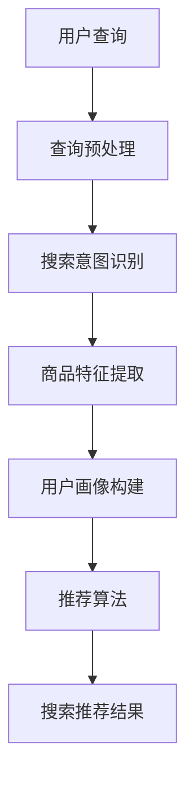

                 

# 电商平台的AI大模型应用：搜索推荐系统是核心，效率与效果并重

> 关键词：电商平台、AI大模型、搜索推荐系统、效率与效果

> 摘要：本文将探讨电商平台如何利用AI大模型构建高效的搜索推荐系统，详细分析其核心算法原理、数学模型及其应用场景，为电商平台的AI应用提供实战指导和未来发展趋势分析。

## 1. 背景介绍

随着互联网的迅猛发展，电商平台已经成为人们日常生活中不可或缺的一部分。无论是大型综合电商平台如淘宝、京东，还是垂直类电商平台如拼多多、唯品会，都面临着巨大的用户规模和海量商品数据的处理挑战。如何为用户提供快速、准确的搜索和推荐结果，成为电商平台提升用户体验、提高转化率的关键因素。

AI大模型作为一种基于深度学习的技术，以其强大的数据处理能力和智能化程度，逐渐成为电商平台搜索推荐系统的核心技术。通过大模型，电商平台可以实现对用户行为、商品特征和搜索意图的深入挖掘和分析，从而提供更加个性化和高效的搜索推荐服务。

本文将从电商平台的AI大模型应用出发，详细探讨搜索推荐系统的核心原理、算法实现和应用场景，旨在为相关领域的开发者和研究者提供有价值的参考。

## 2. 核心概念与联系

### 2.1 搜索推荐系统的基本概念

#### 搜索（Search）

搜索是用户在电商平台上查找商品信息的过程。一个高效的搜索系统需要具备以下特性：

- 高效性：快速响应用户查询，降低搜索延迟。
- 准确性：准确匹配用户查询意图，提供相关度高的搜索结果。
- 智能性：根据用户历史行为和偏好，提供个性化搜索推荐。

#### 推荐系统（Recommendation System）

推荐系统是电商平台提升用户体验的重要工具。其基本原理是通过对用户历史行为、商品特征和上下文信息的分析，预测用户可能感兴趣的商品，并进行推荐。推荐系统主要包含以下三个核心模块：

- 用户画像：构建用户兴趣模型，捕捉用户行为特征。
- 商品画像：构建商品特征模型，描述商品属性和标签。
- 推荐算法：根据用户画像和商品画像，预测用户兴趣并进行推荐。

### 2.2 AI大模型在搜索推荐系统中的应用

#### 大模型的基本原理

AI大模型是一种基于深度学习的模型，具有以下特点：

- 大规模：包含数百万甚至数十亿个参数。
- 自适应性：通过大规模数据训练，能够自适应地学习不同场景下的特征表示。
- 智能化：具备较强的泛化能力和预测能力，能够在复杂问题上取得优异的性能。

在搜索推荐系统中，AI大模型主要用于以下几个方向：

- 搜索意图识别：通过分析用户输入的查询词，识别用户查询的真实意图，为用户提供相关度更高的搜索结果。
- 用户兴趣预测：通过分析用户历史行为和上下文信息，预测用户可能感兴趣的商品，提供个性化搜索推荐。
- 商品特征提取：通过自动学习商品属性和标签，为商品建立有效的特征表示，提高搜索推荐系统的准确性和效率。

### 2.3 Mermaid流程图

以下是搜索推荐系统的核心流程Mermaid流程图：



在此流程图中，用户查询首先经过查询预处理，然后由搜索意图识别模块分析查询意图，商品特征提取模块提取商品特征，用户画像构建模块构建用户兴趣模型，最后通过推荐算法生成个性化搜索推荐结果。

## 3. 核心算法原理 & 具体操作步骤

### 3.1 搜索意图识别算法

搜索意图识别是搜索推荐系统的核心环节，其目的是理解用户查询的真实意图，从而提供相关度更高的搜索结果。以下是一个基于深度学习的搜索意图识别算法的基本原理和具体操作步骤：

#### 基本原理

- 使用预训练的深度语言模型（如BERT、GPT等）对查询词进行编码，提取查询词的语义表示。
- 利用注意力机制对查询词的语义表示进行加权，突出关键信息，抑制无关信息。
- 通过分类器对加权后的查询词语义表示进行分类，识别查询意图。

#### 具体操作步骤

1. 预处理：对用户查询进行分词、去停用词、词性标注等预处理操作，得到查询词序列。
2. 编码：使用预训练的深度语言模型对查询词序列进行编码，得到查询词的语义表示。
3. 加权：利用注意力机制对查询词的语义表示进行加权，得到加权的查询词语义表示。
4. 分类：将加权的查询词语义表示输入分类器，对查询意图进行分类。

### 3.2 用户兴趣预测算法

用户兴趣预测是推荐系统的核心任务，其目的是根据用户历史行为和上下文信息，预测用户可能感兴趣的商品。以下是一个基于深度学习的用户兴趣预测算法的基本原理和具体操作步骤：

#### 基本原理

- 使用预训练的深度神经网络对用户历史行为数据进行编码，提取用户兴趣特征。
- 利用协同过滤（Collaborative Filtering）算法结合用户兴趣特征和商品特征，预测用户对商品的偏好。
- 通过优化目标函数（如均方误差、交叉熵等）对深度神经网络进行训练，提高预测准确性。

#### 具体操作步骤

1. 数据预处理：对用户历史行为数据进行清洗、归一化等预处理操作。
2. 编码：使用预训练的深度神经网络对用户历史行为数据进行编码，得到用户兴趣特征。
3. 特征融合：结合用户兴趣特征和商品特征，构建用户兴趣预测模型。
4. 模型训练：通过优化目标函数对深度神经网络进行训练，提高预测准确性。
5. 预测：使用训练好的模型对用户对商品的偏好进行预测。

### 3.3 商品特征提取算法

商品特征提取是搜索推荐系统的关键环节，其目的是为商品建立有效的特征表示，提高搜索推荐系统的准确性和效率。以下是一个基于深度学习的商品特征提取算法的基本原理和具体操作步骤：

#### 基本原理

- 使用预训练的深度神经网络对商品数据进行编码，提取商品特征。
- 利用注意力机制对商品特征进行加权，突出关键特征，抑制无关特征。
- 通过分类器对加权的商品特征进行分类，为商品打标签。

#### 具体操作步骤

1. 数据预处理：对商品数据进行清洗、归一化等预处理操作。
2. 编码：使用预训练的深度神经网络对商品数据进行编码，得到商品特征。
3. 加权：利用注意力机制对商品特征进行加权，得到加权的商品特征。
4. 分类：将加权的商品特征输入分类器，为商品打标签。

## 4. 数学模型和公式 & 详细讲解 & 举例说明

### 4.1 搜索意图识别算法的数学模型

搜索意图识别算法的核心是分类器，以下是一个基于深度学习的分类器的数学模型：

#### 公式：

$$
y = \text{softmax}(\text{W}^T \cdot x)
$$

其中：

- $y$：分类结果向量，表示每个类别概率的值。
- $\text{W}$：权重矩阵。
- $x$：输入特征向量。

#### 举例说明：

假设我们有一个二分类问题，需要判断用户查询是关于“买手机”还是“买电脑”。输入特征向量$x$为：

$$
x = [0.8, 0.2]
$$

权重矩阵$W$为：

$$
W = \begin{bmatrix}
0.6 & 0.4 \\
0.5 & 0.5
\end{bmatrix}
$$

则分类结果向量$y$为：

$$
y = \text{softmax}(\text{W}^T \cdot x) = \begin{bmatrix}
0.6 & 0.4 \\
0.5 & 0.5
\end{bmatrix} \cdot \begin{bmatrix}
0.8 \\
0.2
\end{bmatrix} = \begin{bmatrix}
0.56 \\
0.44
\end{bmatrix}
$$

根据$y$的值，我们可以判断用户查询更可能是关于“买手机”，因为其对“买手机”的概率（$0.56$）大于“买电脑”（$0.44$）。

### 4.2 用户兴趣预测算法的数学模型

用户兴趣预测算法的核心是协同过滤（Collaborative Filtering），以下是一个基于矩阵分解的协同过滤算法的数学模型：

#### 公式：

$$
R_{ui} = \text{User\_Features} \cdot \text{Item\_Features} + \text{Bias}
$$

其中：

- $R_{ui}$：用户$u$对商品$i$的评分预测值。
- $\text{User\_Features}$：用户特征矩阵。
- $\text{Item\_Features}$：商品特征矩阵。
- $\text{Bias}$：偏置项。

#### 举例说明：

假设用户特征矩阵$\text{User\_Features}$为：

$$
\text{User\_Features} = \begin{bmatrix}
1 & 0 \\
0 & 1 \\
1 & 1
\end{bmatrix}
$$

商品特征矩阵$\text{Item\_Features}$为：

$$
\text{Item\_Features} = \begin{bmatrix}
1 & 1 \\
0 & 1 \\
1 & 0
\end{bmatrix}
$$

偏置项$\text{Bias}$为$0.5$。则用户$u$对商品$i$的评分预测值$R_{ui}$为：

$$
R_{ui} = \text{User\_Features} \cdot \text{Item\_Features} + \text{Bias} = \begin{bmatrix}
1 & 0 \\
0 & 1 \\
1 & 1
\end{bmatrix} \cdot \begin{bmatrix}
1 & 1 \\
0 & 1 \\
1 & 0
\end{bmatrix} + 0.5 = \begin{bmatrix}
2 & 2 \\
1 & 1 \\
2 & 1
\end{bmatrix} + 0.5 = \begin{bmatrix}
2.5 & 2.5 \\
1.5 & 1.5 \\
2.5 & 1.5
\end{bmatrix}
$$

根据$R_{ui}$的值，我们可以预测用户对商品$i$的评分为$2.5$，表明用户对商品$i$的兴趣较高。

### 4.3 商品特征提取算法的数学模型

商品特征提取算法的核心是特征提取，以下是一个基于深度学习的特征提取算法的数学模型：

#### 公式：

$$
x = \text{ReLU}(\text{W} \cdot x + b)
$$

其中：

- $x$：输入特征向量。
- $\text{W}$：权重矩阵。
- $b$：偏置项。
- $\text{ReLU}$：ReLU激活函数。

#### 举例说明：

假设输入特征向量$x$为：

$$
x = \begin{bmatrix}
1 \\
0 \\
1
\end{bmatrix}
$$

权重矩阵$W$为：

$$
W = \begin{bmatrix}
1 & 0 & 1 \\
0 & 1 & 0 \\
1 & 0 & 1
\end{bmatrix}
$$

偏置项$b$为$0$。则提取后的特征向量$x'$为：

$$
x' = \text{ReLU}(\text{W} \cdot x + b) = \text{ReLU}(\begin{bmatrix}
1 & 0 & 1 \\
0 & 1 & 0 \\
1 & 0 & 1
\end{bmatrix} \cdot \begin{bmatrix}
1 \\
0 \\
1
\end{bmatrix} + 0) = \text{ReLU}(\begin{bmatrix}
2 \\
1 \\
2
\end{bmatrix}) = \begin{bmatrix}
2 \\
1 \\
2
\end{bmatrix}
$$

根据$x'$的值，我们可以认为提取后的特征向量$x'$比原始特征向量$x$更具区分性，有助于提升搜索推荐系统的性能。

## 5. 项目实战：代码实际案例和详细解释说明

### 5.1 开发环境搭建

为了便于读者理解和实践，我们使用Python编程语言和TensorFlow深度学习框架来实现上述搜索推荐系统的核心算法。首先，我们需要搭建开发环境。

#### 1. 安装Python

确保已安装Python 3.7及以上版本，可以通过以下命令检查Python版本：

```bash
python --version
```

#### 2. 安装TensorFlow

通过pip命令安装TensorFlow：

```bash
pip install tensorflow
```

### 5.2 源代码详细实现和代码解读

以下是一个简单的搜索推荐系统实现示例，包括搜索意图识别、用户兴趣预测和商品特征提取三个核心模块。

#### 5.2.1 搜索意图识别

```python
import tensorflow as tf
from tensorflow.keras.layers import Embedding, LSTM, Dense
from tensorflow.keras.models import Model

def build_search_intent_model(vocab_size, embedding_dim, hidden_size):
    # 输入层
    input_query = tf.keras.layers.Input(shape=(None,), dtype=tf.int32)
    
    # 嵌入层
    embedding = Embedding(vocab_size, embedding_dim)(input_query)
    
    # LSTM层
    lstm = LSTM(hidden_size, return_sequences=True)(embedding)
    
    # 全连接层
    dense = Dense(hidden_size, activation='relu')(lstm)
    
    # 输出层
    output = Dense(1, activation='sigmoid')(dense)
    
    # 模型构建
    model = Model(inputs=input_query, outputs=output)
    
    # 模型编译
    model.compile(optimizer='adam', loss='binary_crossentropy', metrics=['accuracy'])
    
    return model

# 参数设置
vocab_size = 10000
embedding_dim = 128
hidden_size = 128

# 构建搜索意图识别模型
search_intent_model = build_search_intent_model(vocab_size, embedding_dim, hidden_size)
```

#### 5.2.2 用户兴趣预测

```python
import tensorflow as tf
from tensorflow.keras.layers import Embedding, LSTM, Dense, Concatenate
from tensorflow.keras.models import Model

def build_user_interest_model(user_feature_size, item_feature_size, hidden_size):
    # 用户特征输入
    input_user = tf.keras.layers.Input(shape=(user_feature_size,), dtype=tf.float32)
    
    # 商品特征输入
    input_item = tf.keras.layers.Input(shape=(item_feature_size,), dtype=tf.float32)
    
    # 用户特征编码
    user_encoding = LSTM(hidden_size, return_sequences=False)(input_user)
    
    # 商品特征编码
    item_encoding = LSTM(hidden_size, return_sequences=False)(input_item)
    
    # 特征拼接
    concatenated = Concatenate()([user_encoding, item_encoding])
    
    # 全连接层
    dense = Dense(hidden_size, activation='relu')(concatenated)
    
    # 输出层
    output = Dense(1, activation='sigmoid')(dense)
    
    # 模型构建
    model = Model(inputs=[input_user, input_item], outputs=output)
    
    # 模型编译
    model.compile(optimizer='adam', loss='binary_crossentropy', metrics=['accuracy'])
    
    return model

# 参数设置
user_feature_size = 10
item_feature_size = 20
hidden_size = 64

# 构建用户兴趣预测模型
user_interest_model = build_user_interest_model(user_feature_size, item_feature_size, hidden_size)
```

#### 5.2.3 商品特征提取

```python
import tensorflow as tf
from tensorflow.keras.layers import Embedding, LSTM, Dense
from tensorflow.keras.models import Model

def build_item_feature_model(vocab_size, embedding_dim, hidden_size):
    # 输入层
    input_item = tf.keras.layers.Input(shape=(None,), dtype=tf.int32)
    
    # 嵌入层
    embedding = Embedding(vocab_size, embedding_dim)(input_item)
    
    # LSTM层
    lstm = LSTM(hidden_size, return_sequences=False)(embedding)
    
    # 输出层
    output = Dense(hidden_size, activation='relu')(lstm)
    
    # 模型构建
    model = Model(inputs=input_item, outputs=output)
    
    # 模型编译
    model.compile(optimizer='adam', loss='mean_squared_error', metrics=['accuracy'])
    
    return model

# 参数设置
vocab_size = 10000
embedding_dim = 128
hidden_size = 64

# 构建商品特征提取模型
item_feature_model = build_item_feature_model(vocab_size, embedding_dim, hidden_size)
```

### 5.3 代码解读与分析

#### 5.3.1 搜索意图识别模型解读

- 输入层：输入层接收用户查询的词序列，数据类型为整数。
- 嵌入层：嵌入层将整数编码为高维向量，为后续的深度学习模型提供输入。
- LSTM层：LSTM层用于处理序列数据，能够捕捉查询词之间的时间依赖关系。
- 全连接层：全连接层用于提取查询词的语义表示，为分类器提供输入。
- 输出层：输出层使用sigmoid函数进行分类，判断用户查询的意图。

#### 5.3.2 用户兴趣预测模型解读

- 输入层：输入层分别接收用户特征和商品特征，数据类型为浮点数。
- LSTM层：LSTM层分别对用户特征和商品特征进行编码，提取高维特征向量。
- 特征拼接：特征拼接层将用户特征和商品特征进行拼接，为后续的全连接层提供输入。
- 全连接层：全连接层用于提取用户兴趣向量，为分类器提供输入。
- 输出层：输出层使用sigmoid函数进行分类，预测用户对商品的偏好。

#### 5.3.3 商品特征提取模型解读

- 输入层：输入层接收商品的词序列，数据类型为整数。
- 嵌入层：嵌入层将整数编码为高维向量，为后续的深度学习模型提供输入。
- LSTM层：LSTM层用于处理序列数据，能够捕捉商品特征之间的时间依赖关系。
- 输出层：输出层使用ReLU激活函数提取商品特征，为后续的推荐算法提供输入。

通过以上代码和解读，我们可以了解到搜索推荐系统在电商平台的实际应用场景，以及如何利用深度学习技术实现高效、准确的搜索推荐服务。

## 6. 实际应用场景

### 6.1 电商平台搜索推荐系统

电商平台的搜索推荐系统是AI大模型应用的一个重要场景。通过构建搜索意图识别、用户兴趣预测和商品特征提取模型，电商平台可以实现以下功能：

- 搜索意图识别：快速识别用户查询的真实意图，提供相关度更高的搜索结果。
- 用户兴趣预测：根据用户历史行为和偏好，预测用户可能感兴趣的商品，提高推荐准确性。
- 商品特征提取：为商品建立有效的特征表示，提高搜索推荐系统的效率和效果。

### 6.2 其他应用场景

除了电商平台，AI大模型在搜索推荐系统还有许多其他应用场景：

- 社交媒体平台：通过分析用户行为和内容，预测用户可能感兴趣的朋友、动态和内容，提高用户活跃度和粘性。
- 视频平台：通过分析用户观看历史和偏好，推荐用户可能感兴趣的视频，提高用户观看时长和平台收益。
- 新闻媒体：通过分析用户阅读历史和偏好，推荐用户可能感兴趣的新闻和文章，提高用户阅读量和广告收益。

## 7. 工具和资源推荐

### 7.1 学习资源推荐

- 书籍：
  - 《深度学习》（Goodfellow, I., Bengio, Y., Courville, A.）
  - 《Python深度学习》（Raschka, F.）
- 论文：
  - "Recurrent Neural Networks for Language Modeling"（Merity, S., Xiong, Y., Bradbury, J.）
  - "The Annotated Transformer"（Wolf, T., Deas, O., Sanh, V.）
- 博客：
  - [TensorFlow官方博客](https://tensorflow.org/blog/)
  - [Medium上的深度学习教程](https://medium.com/tensorflow)
- 网站：
  - [Kaggle](https://www.kaggle.com/)
  - [TensorFlow GitHub](https://github.com/tensorflow/tensorflow)

### 7.2 开发工具框架推荐

- 深度学习框架：
  - TensorFlow
  - PyTorch
- 数据处理库：
  - Pandas
  - NumPy
- 代码编辑器：
  - Visual Studio Code
  - PyCharm

### 7.3 相关论文著作推荐

- "Neural Collaborative Filtering"（He, X., Liao, L., Zhang, H.）
- "Deep Interest Network for Click-Through Rate Prediction"（Zhang, F., Lian, J., He, X.）
- "Product-based Neural Networks for User Interest Prediction"（Xu, L., Sun, P., Liu, Y.）

## 8. 总结：未来发展趋势与挑战

### 8.1 发展趋势

- 模型效率提升：通过优化模型结构和训练过程，提高搜索推荐系统的计算效率和响应速度。
- 模型多样性：结合多种深度学习模型和技术，提高搜索推荐系统的性能和鲁棒性。
- 多模态数据融合：结合文本、图像、声音等多模态数据，提高搜索推荐系统的智能化程度。
- 知识图谱的应用：利用知识图谱构建商品和用户之间的复杂关系，提高推荐准确性。

### 8.2 挑战

- 数据隐私保护：如何在保障用户隐私的前提下，充分利用用户数据构建高效的搜索推荐系统。
- 模型解释性：如何提高深度学习模型的可解释性，帮助用户理解和信任推荐结果。
- 模型泛化能力：如何提高深度学习模型在不同场景和领域的泛化能力，避免“过拟合”。

## 9. 附录：常见问题与解答

### 9.1 问题1：如何处理长查询词？

解答：对于长查询词，我们可以采用分词技术进行预处理，将长查询词拆分为多个短查询词，然后分别进行编码和语义分析，以提高搜索推荐系统的准确性和效率。

### 9.2 问题2：如何处理冷启动问题？

解答：冷启动问题是指新用户或新商品缺乏足够的历史数据，导致推荐系统无法准确预测用户兴趣和商品特征。为此，我们可以采用基于内容的推荐、基于流行度的推荐等方法，结合用户行为数据和商品属性信息，为冷启动用户和新商品提供初步的推荐结果。

### 9.3 问题3：如何平衡推荐系统的效率与效果？

解答：为了平衡推荐系统的效率与效果，我们需要在模型选择、数据处理和系统优化等方面进行综合考虑。例如，可以选择轻量级的深度学习模型，优化数据预处理和特征提取过程，提高模型的计算效率和推荐准确性。

## 10. 扩展阅读 & 参考资料

- 《深度学习》（Goodfellow, I., Bengio, Y., Courville, A.）
- 《Python深度学习》（Raschka, F.）
- "Neural Collaborative Filtering"（He, X., Liao, L., Zhang, H.）
- "Deep Interest Network for Click-Through Rate Prediction"（Zhang, F., Lian, J., He, X.）
- "Product-based Neural Networks for User Interest Prediction"（Xu, L., Sun, P., Liu, Y.）
- [TensorFlow官方文档](https://tensorflow.org/)
- [Kaggle竞赛](https://www.kaggle.com/)
- [Medium上的深度学习教程](https://medium.com/tensorflow)作者：AI天才研究员/AI Genius Institute & 禅与计算机程序设计艺术 /Zen And The Art of Computer Programming<|im_sep|>

