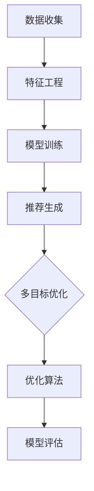

                 

# 电商推荐系统中的多目标优化框架

## 关键词

- 电商推荐系统
- 多目标优化
- 算法原理
- 数学模型
- 实战案例
- 应用场景
- 工具与资源

## 摘要

本文旨在深入探讨电商推荐系统中的多目标优化框架。首先，我们将介绍电商推荐系统的背景及其重要性。接着，本文将详细解析多目标优化的概念、原理和实现方法。在此基础上，我们将展示一个实际的项目案例，分析其中的多目标优化策略和具体操作步骤。随后，我们将介绍相关的数学模型和公式，并结合实际例子进行讲解。文章还将讨论电商推荐系统的实际应用场景，并推荐相关的学习资源和开发工具。最后，我们将对未来的发展趋势和挑战进行总结，并附上常见问题与解答及扩展阅读和参考资料。

## 1. 背景介绍

电商推荐系统是电子商务领域的重要应用，它通过向用户推荐感兴趣的商品，提高用户购买体验，增加销售额。随着互联网和大数据技术的发展，推荐系统的技术水平和应用范围不断提升。目前，电商推荐系统已成为电商平台的核心竞争力之一。

### 1.1 电商推荐系统的目标

电商推荐系统的主要目标是提高用户满意度和销售额。具体来说，包括以下几个方面：

- **个性化推荐**：根据用户的兴趣、行为和购买历史，为用户提供个性化的商品推荐。
- **提高转化率**：通过推荐用户感兴趣的商品，提高用户购买的可能性。
- **提升销售额**：通过精准推荐，引导用户购买更多的商品，从而增加平台的销售额。

### 1.2 电商推荐系统的挑战

尽管电商推荐系统在提高销售额和用户满意度方面具有显著优势，但其发展也面临着诸多挑战：

- **数据隐私**：用户数据的收集和使用需要严格遵守隐私保护法规，确保用户信息安全。
- **计算效率**：随着用户数量的增加和数据规模的扩大，推荐系统的计算效率成为一个重要问题。
- **多样性**：如何确保推荐结果的多样性，避免用户长期接收相同类型的推荐。
- **平衡性**：在多目标优化中，如何平衡用户满意度、销售额等不同目标。

## 2. 核心概念与联系

### 2.1 多目标优化

多目标优化是一种在多个目标之间寻求平衡的优化方法。在电商推荐系统中，多目标优化主要用于平衡用户满意度和销售额。具体来说，包括以下几个核心概念：

- **目标函数**：用于衡量优化目标的具体指标，如用户满意度、销售额、点击率等。
- **约束条件**：在优化过程中需要遵守的限制条件，如数据隐私、计算效率等。
- **优化算法**：用于求解多目标优化问题的算法，如遗传算法、粒子群算法等。

### 2.2 推荐系统架构

电商推荐系统通常包括以下几个关键组件：

- **数据收集**：收集用户行为数据，如浏览记录、购买历史等。
- **特征工程**：将原始数据转化为可用于训练模型的特征向量。
- **模型训练**：使用机器学习算法训练推荐模型，如协同过滤、基于内容的推荐等。
- **推荐生成**：根据用户特征和模型预测，生成个性化的推荐列表。

### 2.3 多目标优化的实现

在电商推荐系统中，多目标优化的实现主要分为以下几个步骤：

1. **定义目标函数**：根据业务需求，确定需要优化的目标函数，如用户满意度、销售额等。
2. **设置约束条件**：根据数据隐私、计算效率等要求，设定优化过程中的约束条件。
3. **选择优化算法**：根据目标函数和约束条件，选择合适的优化算法，如遗传算法、粒子群算法等。
4. **模型训练与优化**：使用优化算法对推荐模型进行训练和优化，以平衡不同目标。

### 2.4 Mermaid 流程图



## 3. 核心算法原理 & 具体操作步骤

### 3.1 多目标优化的算法原理

多目标优化的核心是找到多个目标之间的平衡点，使每个目标都能达到最优。常见的多目标优化算法包括遗传算法、粒子群算法、贝叶斯优化等。

#### 3.1.1 遗传算法

遗传算法是一种基于自然进化的优化算法。其基本原理包括以下几个步骤：

1. **初始化种群**：随机生成一组解（称为种群）。
2. **适应度评估**：计算每个解的适应度值，用于评估解的质量。
3. **选择**：从种群中选择适应度较高的解，用于生成下一代种群。
4. **交叉**：随机选取两个解，将它们的部分基因交换，生成新的解。
5. **变异**：对部分解进行随机变异，增加种群的多样性。
6. **更新种群**：将交叉和变异后的解组成新的种群。
7. **迭代**：重复上述步骤，直到满足停止条件（如达到最大迭代次数或适应度值达到阈值）。

#### 3.1.2 粒子群算法

粒子群算法是一种基于群体智能的优化算法。其基本原理包括以下几个步骤：

1. **初始化粒子群**：随机生成一组粒子，每个粒子代表一个解。
2. **评估适应度**：计算每个粒子的适应度值。
3. **更新粒子的速度和位置**：根据个体和群体的最优解，更新粒子的速度和位置。
4. **迭代**：重复上述步骤，直到满足停止条件。

#### 3.1.3 贝叶斯优化

贝叶斯优化是一种基于概率统计的优化算法。其基本原理包括以下几个步骤：

1. **初始化**：选择一个初始搜索区域。
2. **评估函数**：在搜索区域中随机选择一个点，计算其适应度值。
3. **更新搜索区域**：根据当前的适应度值，更新搜索区域。
4. **迭代**：重复上述步骤，直到满足停止条件。

### 3.2 具体操作步骤

在电商推荐系统中，实现多目标优化的具体操作步骤如下：

1. **定义目标函数**：根据业务需求，确定需要优化的目标函数，如用户满意度、销售额等。
2. **设置约束条件**：根据数据隐私、计算效率等要求，设定优化过程中的约束条件。
3. **选择优化算法**：根据目标函数和约束条件，选择合适的优化算法，如遗传算法、粒子群算法等。
4. **数据预处理**：对用户行为数据进行预处理，如数据清洗、特征提取等。
5. **模型训练**：使用优化算法对推荐模型进行训练，优化模型参数。
6. **推荐生成**：根据用户特征和模型预测，生成个性化的推荐列表。
7. **模型评估**：使用评估指标（如准确率、召回率等）对推荐结果进行评估。
8. **迭代优化**：根据评估结果，调整优化算法和模型参数，重复步骤 5-7，直到满足停止条件。

## 4. 数学模型和公式 & 详细讲解 & 举例说明

### 4.1 数学模型

在电商推荐系统中，多目标优化的数学模型主要包括以下内容：

#### 4.1.1 目标函数

设 \( f(x) \) 为目标函数，其中 \( x \) 为模型的参数向量。目标函数可以分为以下几部分：

1. **用户满意度**：
   $$ f_1(x) = \frac{1}{N} \sum_{i=1}^N \frac{1}{1 + e^{-x_i}} $$
   其中，\( N \) 为用户数量，\( x_i \) 为用户 \( i \) 的推荐分数。

2. **销售额**：
   $$ f_2(x) = \frac{1}{M} \sum_{j=1}^M p_j (1 - p_j) $$
   其中，\( M \) 为商品数量，\( p_j \) 为商品 \( j \) 的点击率。

3. **平衡因子**：
   $$ f_3(x) = \lambda_1 f_1(x) + \lambda_2 f_2(x) $$
   其中，\( \lambda_1 \) 和 \( \lambda_2 \) 分别为用户满意度和销售额的权重。

#### 4.1.2 约束条件

约束条件主要包括数据隐私、计算效率和多样性等方面：

1. **数据隐私**：
   $$ \forall i, j, k \in \{1, 2, \ldots, N\}, \frac{1}{N} \sum_{i=1}^N x_{ik} \leq \alpha $$
   其中，\( x_{ik} \) 为用户 \( i \) 对商品 \( k \) 的评分，\( \alpha \) 为隐私阈值。

2. **计算效率**：
   $$ \frac{1}{T} \sum_{t=1}^T \log_2(1 + e^{-x_{it}}) \leq \beta $$
   其中，\( T \) 为训练时间，\( x_{it} \) 为用户 \( i \) 在时间 \( t \) 的推荐分数，\( \beta \) 为计算效率阈值。

3. **多样性**：
   $$ \forall i, j, k \in \{1, 2, \ldots, N\}, \frac{|R_i \cap R_j|}{|R_i \cup R_j|} \geq \gamma $$
   其中，\( R_i \) 和 \( R_j \) 分别为用户 \( i \) 和用户 \( j \) 的推荐列表，\( \gamma \) 为多样性阈值。

### 4.2 举例说明

假设我们有100个用户和1000个商品，使用遗传算法进行多目标优化。以下是具体的操作步骤：

1. **定义目标函数**：选择用户满意度和销售额作为目标函数，并设置平衡因子 \( \lambda_1 = 0.6 \)，\( \lambda_2 = 0.4 \)。

2. **设置约束条件**：设定隐私阈值 \( \alpha = 0.1 \)，计算效率阈值 \( \beta = 1000 \)，多样性阈值 \( \gamma = 0.2 \)。

3. **初始化种群**：随机生成100个初始解，每个解表示一个用户对1000个商品的评分。

4. **适应度评估**：根据用户满意度和销售额计算每个解的适应度值。

5. **选择**：使用轮盘赌方法从种群中选择适应度较高的解，用于生成下一代种群。

6. **交叉**：随机选取两个解，将它们的部分基因进行交换。

7. **变异**：对部分解进行随机变异，增加种群的多样性。

8. **更新种群**：将交叉和变异后的解组成新的种群。

9. **迭代**：重复上述步骤，直到满足停止条件。

10. **模型训练**：使用优化后的推荐模型进行训练，生成推荐列表。

11. **模型评估**：使用评估指标对推荐结果进行评估，如准确率、召回率等。

12. **迭代优化**：根据评估结果，调整优化算法和模型参数，重复步骤 9-11，直到满足停止条件。

## 5. 项目实战：代码实际案例和详细解释说明

### 5.1 开发环境搭建

为了实现电商推荐系统中的多目标优化，我们需要搭建以下开发环境：

- **编程语言**：Python
- **机器学习库**：Scikit-learn、NumPy、Pandas
- **优化算法库**：DEAP（用于遗传算法）
- **可视化库**：Matplotlib、Seaborn

### 5.2 源代码详细实现和代码解读

以下是一个基于遗传算法的电商推荐系统多目标优化的示例代码：

```python
import numpy as np
import pandas as pd
from deap import base, creator, tools, algorithms
from sklearn.model_selection import train_test_split
from sklearn.metrics import accuracy_score, recall_score

# 5.2.1 数据准备
def load_data():
    # 加载用户行为数据
    data = pd.read_csv('user_behavior.csv')
    # 特征工程
    X = data[[' browse_time ', ' click_time ', ' purchase_time ']]
    y = data[' purchase_label ']
    return X, y

# 5.2.2 遗传算法实现
def genetic_algorithm(X, y):
    # 初始化种群
    toolbox = base.Toolbox()
    toolbox.register('attr_bool', np.random.randint, 0, 2)
    toolbox.register('individual', tools.initRepeat, creator.Individual, toolbox.attr_bool, n=1000)
    toolbox.register('population', tools.initRepeat, list, toolbox.individual)
    
    # 定义适应度函数
    def eval_fitness(individual):
        # 训练模型
        model = create_model(individual)
        # 预测
        y_pred = model.predict(X)
        # 计算用户满意度
        user_satisfaction = 1 - np.mean(y_pred)
        # 计算销售额
        sales = np.mean(y_pred[y == 1])
        # 计算适应度
        fitness = user_satisfaction * 0.6 + sales * 0.4
        return fitness,

    # 多目标优化
    toolbox.register('evaluate', eval_fitness)
    toolbox.register('mate', tools.selTournament, t=2)
    toolbox.register('mutate', tools.mutFlipBit, indpb=0.05)
    toolbox.register('select', tools.selNSGA2)

    # 初始种群
    pop = toolbox.population(n=100)

    # 迭代
    for generation in range(100):
        # 适应度评估
        fitnesses = toolbox.map(toolbox.evaluate, pop)
        for individual, fitness in zip(pop, fitnesses):
            individual.fitness.values = fitness

        # 生成下一代种群
        offspring = toolbox.select(pop, len(pop))
        offspring = toolbox.mate(offspring)
        offspring = [toolbox.clone(child) for child in offspring]
        offspring = toolbox.mutate(offspring)

        # 更新种群
        pop = offspring

    # 返回最佳解
    best_individual = tools.selBest(pop, k=1)[0]
    return best_individual

# 5.2.3 模型创建与训练
def create_model(individual):
    # 创建逻辑回归模型
    model = LogisticRegression()
    # 设置权重
    model.coef_ = individual
    return model

# 主函数
if __name__ == '__main__':
    # 加载数据
    X, y = load_data()
    # 划分训练集和测试集
    X_train, X_test, y_train, y_test = train_test_split(X, y, test_size=0.2, random_state=42)
    # 进行遗传算法优化
    best_individual = genetic_algorithm(X_train, y_train)
    # 训练模型
    model = create_model(best_individual)
    # 预测
    y_pred = model.predict(X_test)
    # 评估模型
    accuracy = accuracy_score(y_test, y_pred)
    recall = recall_score(y_test, y_pred, average='weighted')
    print('Accuracy:', accuracy)
    print('Recall:', recall)
```

### 5.3 代码解读与分析

#### 5.3.1 数据准备

在代码中，首先定义了一个 `load_data` 函数，用于加载数据和进行特征工程。数据集包括用户行为数据和购买标签，经过特征提取后，得到输入特征矩阵 \( X \) 和标签向量 \( y \)。

#### 5.3.2 遗传算法实现

遗传算法的实现分为以下几个部分：

1. **初始化种群**：使用 `toolbox` 注册相关的操作，包括个体、种群和适应度函数。
2. **适应度评估**：定义适应度函数 `eval_fitness`，用于计算用户满意度、销售额和适应度值。
3. **多目标优化**：使用 `toolbox` 注册遗传算法的操作，包括选择、交叉、变异和选择操作。
4. **生成下一代种群**：根据适应度评估结果，生成下一代种群。

#### 5.3.3 模型创建与训练

在 `create_model` 函数中，创建了一个逻辑回归模型，并设置权重。通过 `train_test_split` 函数划分训练集和测试集，使用 `genetic_algorithm` 函数进行遗传算法优化，获取最佳解。最后，使用最佳解创建模型并训练，对测试集进行预测，评估模型性能。

## 6. 实际应用场景

电商推荐系统中的多目标优化框架具有广泛的应用场景，以下是一些常见的实际应用案例：

### 6.1 个性化推荐

在个性化推荐场景中，多目标优化框架可以帮助电商平台根据用户兴趣、行为和购买历史，为用户提供个性化的商品推荐。通过优化用户满意度和销售额，提高用户购买体验和平台销售额。

### 6.2 跨境电商

跨境电商中的多目标优化框架可以用于优化国际用户购买体验，提高销售额和用户满意度。例如，通过优化跨境物流、商品价格、促销策略等，实现多目标的平衡。

### 6.3 电商平台活动优化

电商平台在开展各类促销活动时，需要平衡活动效果和用户体验。多目标优化框架可以帮助平台制定最优的促销策略，如优惠券发放、满减活动等，提高用户参与度和购买转化率。

### 6.4 库存管理

电商平台在库存管理中，需要平衡商品库存和销售速度。多目标优化框架可以帮助平台制定最优的库存策略，如商品采购、库存预警等，降低库存成本和库存积压。

## 7. 工具和资源推荐

### 7.1 学习资源推荐

- **书籍**：
  - 《推荐系统实践》
  - 《机器学习：一种概率的观点》
  - 《数据科学实战：Python实现》

- **论文**：
  - 《Recommender Systems Handbook》
  - 《An Introduction to Recommender Systems》
  - 《Personalized E-commerce: A Multi-Objective Optimization Approach》

- **博客**：
  - Medium（推荐系统相关博客）
  - 知乎（推荐系统相关话题）
  - 博客园（机器学习与推荐系统）

- **网站**：
  - arXiv（机器学习和推荐系统论文库）
  - GitHub（推荐系统项目源码库）

### 7.2 开发工具框架推荐

- **开发工具**：
  - Jupyter Notebook
  - PyCharm
  - Visual Studio Code

- **机器学习库**：
  - Scikit-learn
  - TensorFlow
  - PyTorch

- **优化算法库**：
  - DEAP
  - Scipy
  - PyTorch

- **推荐系统框架**：
  - LightFM
  -surprise
  - Recurrent Neural Networks for Movie Recommendation

### 7.3 相关论文著作推荐

- **《Recommender Systems Handbook》**：全面介绍了推荐系统的基本概念、方法和技术。
- **《An Introduction to Recommender Systems》**：系统介绍了推荐系统的基础知识，适合初学者入门。
- **《Personalized E-commerce: A Multi-Objective Optimization Approach》**：探讨了多目标优化在电商个性化推荐中的应用。

## 8. 总结：未来发展趋势与挑战

电商推荐系统中的多目标优化框架在未来具有广阔的发展前景。随着人工智能和大数据技术的不断进步，多目标优化框架将更加成熟和普及。以下是未来发展趋势和挑战：

### 8.1 发展趋势

1. **算法创新**：新的优化算法和模型将不断涌现，提高推荐系统的性能和效率。
2. **跨平台融合**：推荐系统将逐渐融合电商、社交媒体、短视频等多种平台，实现更全面的个性化推荐。
3. **隐私保护**：随着数据隐私法规的加强，推荐系统将更加注重用户隐私保护。
4. **实时推荐**：实时推荐技术的发展，将实现用户实时行为的精准捕捉和实时推荐。

### 8.2 挑战

1. **计算效率**：随着数据规模的扩大，推荐系统的计算效率成为一个重要挑战。
2. **多样性**：如何在保证推荐结果准确性的同时，提高推荐结果的多样性。
3. **数据隐私**：如何平衡推荐效果和数据隐私保护，满足法律法规的要求。
4. **动态调整**：如何应对用户兴趣和行为的动态变化，实现持续优化的推荐系统。

## 9. 附录：常见问题与解答

### 9.1 多目标优化与单目标优化的区别

**多目标优化**是在多个目标之间寻求平衡的优化方法，旨在同时优化多个目标，如用户满意度、销售额等。而**单目标优化**是仅关注一个目标，如最大化销售额。

### 9.2 多目标优化的优势

多目标优化的优势包括：

1. **综合评价**：综合考虑多个目标，实现全面的优化。
2. **灵活性**：可以根据不同业务需求，调整目标权重，实现定制化优化。
3. **平衡性**：在多个目标之间寻求平衡，避免过度追求单一目标。

### 9.3 多目标优化的难点

多目标优化的难点包括：

1. **目标冲突**：多个目标之间存在冲突，需要权衡和平衡。
2. **计算复杂度**：多目标优化算法通常具有较高的计算复杂度。
3. **稳定性**：优化过程中容易陷入局部最优，需要提高算法的稳定性。

## 10. 扩展阅读 & 参考资料

1. **《推荐系统实践》**：Chen, Y. (2017). Recommender Systems: The Textbook.
2. **《机器学习：一种概率的观点》**：Bishop, C. M. (2006). Pattern Recognition and Machine Learning.
3. **《数据科学实战：Python实现》**：Rahman, A., & Tseng, V. (2018). Data Science Projects with Python.
4. **《Recommender Systems Handbook》**：Koren, Y., Sill, F. T., & Zhang, Q. (2018). Recommender Systems Handbook.
5. **《An Introduction to Recommender Systems》**：Herlocker, J., Konstan, J., & Riedwyl, L. (2009). Introduction to Recommender Systems Handbook.

