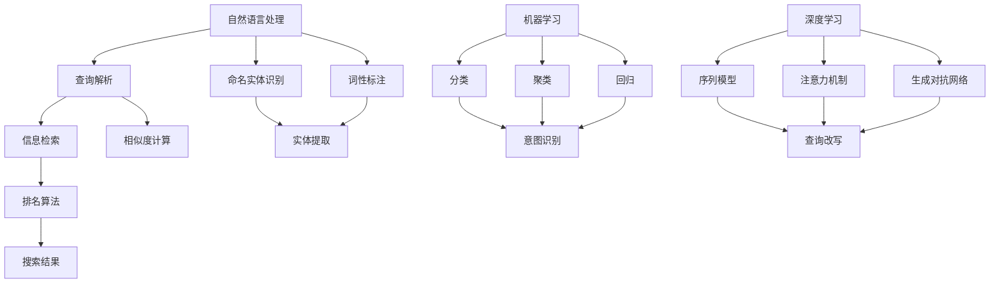
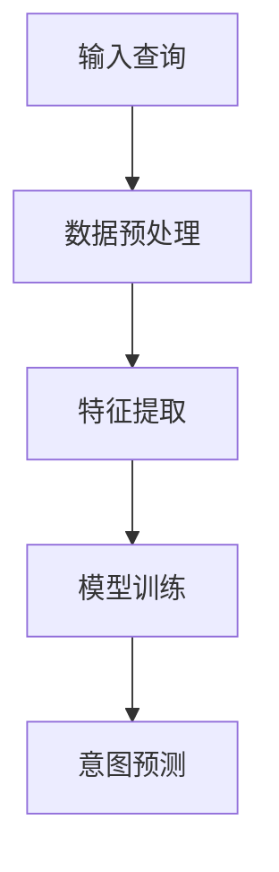
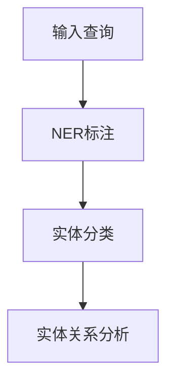
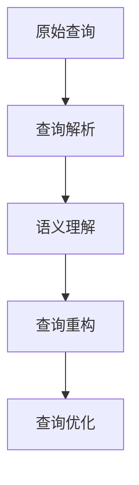

                 

### 背景介绍

在电商领域，搜索功能是用户获取产品信息、进行购物决策的重要途径。随着电商平台的迅猛发展和用户需求的日益多样化，搜索系统的性能和准确性成为了衡量平台竞争力的重要指标。其中，query理解与改写技术作为搜索系统的核心组成部分，承担着提升搜索质量和用户体验的重要任务。

query理解与改写技术的核心目标是通过分析用户输入的查询请求，理解其背后的意图和信息需求，并将其转化为更准确、更易理解的搜索请求。这一过程涉及到自然语言处理、信息检索、机器学习等多个领域的知识和技术。具体来说，query理解与改写技术需要解决以下问题：

1. **意图识别**：识别用户输入的query所代表的主要意图，例如是查找产品、比较产品、获取产品信息等。
2. **实体提取**：从query中提取出关键的信息实体，如产品名称、品牌、价格范围等。
3. **语义理解**：理解query中涉及的概念和关系，如品牌与产品之间的关系、产品属性等。
4. **查询改写**：根据理解到的意图和实体，对原始query进行改写，以生成更精准的搜索请求。

随着大数据和人工智能技术的发展，query理解与改写技术在电商搜索系统中得到了广泛应用，不仅提升了搜索的准确性，还提高了用户的购物体验。本文将深入探讨电商搜索中的query理解与改写技术，包括其核心概念、算法原理、数学模型、实际应用场景以及未来的发展趋势和挑战。

通过对本文的阅读，读者将能够全面了解query理解与改写技术的原理和应用，掌握相关算法和工具的使用方法，并能够将其应用于实际的电商搜索系统中，从而提升搜索质量和用户体验。

### 核心概念与联系

在深入探讨query理解与改写技术之前，有必要先明确几个核心概念，并解释它们之间的联系。这些概念包括自然语言处理（NLP）、信息检索（IR）、机器学习（ML）以及深度学习（DL）。下面将分别介绍这些概念及其在query理解与改写技术中的具体作用。

#### 自然语言处理（NLP）

自然语言处理是计算机科学和人工智能领域的一个分支，旨在使计算机能够理解、解释和生成人类语言。在query理解与改写技术中，NLP的核心作用是解析用户输入的查询请求，将其转换为计算机可以处理的结构化数据。具体任务包括：

1. **分词（Tokenization）**：将文本拆分为单词或短语。
2. **词性标注（Part-of-Speech Tagging）**：为每个词分配正确的词性，如名词、动词、形容词等。
3. **命名实体识别（Named Entity Recognition, NER）**：识别文本中的命名实体，如人名、地名、组织名等。
4. **词义消歧（Semantic Disambiguation）**：确定文本中词语的确切含义。

NLP在query理解中至关重要，因为它能够帮助系统识别出查询中的关键词和短语，从而为进一步的意图识别和实体提取打下基础。

#### 信息检索（IR）

信息检索是另一个重要的核心概念，它涉及从大量信息中检索出与用户查询最相关的结果。在query理解与改写技术中，IR主要用于确保搜索结果的准确性和相关性。具体任务包括：

1. **查询解析（Query Parsing）**：理解用户输入的查询，并将其转换为索引可以理解的查询。
2. **排名算法（Ranking Algorithms）**：根据查询和文档的相关性对搜索结果进行排序。
3. **相似度计算（Similarity Computation）**：计算查询与文档之间的相似度，以确定文档的相关性。

信息检索与NLP紧密相连，因为NLP技术用于处理和解析查询文本，而IR技术则用于根据解析结果检索和排序相关的信息。

#### 机器学习（ML）

机器学习是构建query理解与改写系统的重要工具，它通过从数据中学习模式，从而实现自动化的决策和预测。在query理解与改写技术中，ML技术主要用于：

1. **分类（Classification）**：将查询分类到不同的意图类别中。
2. **聚类（Clustering）**：将相似的查询聚集在一起，以便进行后续的处理和分析。
3. **回归（Regression）**：预测查询中某些特征的可能值。

ML模型在意图识别、实体提取和查询改写等任务中发挥着关键作用，因为它们能够从大量历史数据中学习并提高系统的准确性和鲁棒性。

#### 深度学习（DL）

深度学习是机器学习的一个子领域，它通过构建复杂的神经网络模型，从大量数据中自动学习特征和模式。在query理解与改写技术中，DL技术主要用于：

1. **序列模型（Sequence Models）**：如循环神经网络（RNN）和长短期记忆网络（LSTM），用于处理序列数据，如文本序列。
2. **注意力机制（Attention Mechanism）**：用于提高模型对查询中重要词语的识别能力。
3. **生成对抗网络（GANs）**：用于生成新的查询实例或改写现有的查询。

DL技术在提升query理解与改写系统的性能和精度方面具有显著优势，特别是在处理复杂的语义理解和生成任务时。

#### Mermaid 流程图

为了更直观地理解这些核心概念及其在query理解与改写技术中的联系，下面是一个使用Mermaid绘制的流程图：



通过这个流程图，我们可以清晰地看到自然语言处理、信息检索、机器学习和深度学习在query理解与改写技术中的作用和相互联系。这些技术的结合使得query理解与改写系统能够更好地处理复杂的用户查询，提供准确的搜索结果。

### 核心算法原理 & 具体操作步骤

在理解了query理解与改写技术中的核心概念后，我们将深入探讨其核心算法原理和具体操作步骤。核心算法主要包括意图识别、实体提取和查询改写。以下将分别介绍这些算法的具体原理和操作步骤。

#### 1. 意图识别

意图识别是理解用户查询的首要步骤，其目标是从用户输入的查询中识别出用户的主要意图。例如，用户查询“华为手机”可能表示查找手机产品，而查询“华为手机多少钱”则表示询问价格。意图识别算法通常采用机器学习和深度学习技术，以下是一个简化的操作步骤：

1. **数据预处理**：对原始查询进行分词、词性标注等处理，将其转换为机器可以处理的格式。例如，将“华为手机多少钱”转换为词汇序列[“华为”，“手机”，“多少钱”]。
   
2. **特征提取**：从预处理后的文本中提取特征，如词袋模型（Bag of Words, BoW）、词嵌入（Word Embedding）等。词嵌入是目前最常用的特征提取方法，它将每个词汇映射为一个固定大小的向量，从而保留词汇之间的语义关系。

3. **模型训练**：使用训练数据集对机器学习模型（如决策树、支持向量机、神经网络等）进行训练。训练过程中，模型学习将词汇序列映射到相应的意图类别。

4. **意图预测**：在意图识别阶段，模型接受一个新的查询，通过计算查询的词嵌入向量，然后使用训练好的模型预测该查询的意图类别。例如，如果查询的词嵌入向量与“查找产品”类别的词嵌入向量相似度最高，则预测该查询的意图为“查找产品”。

以下是一个简化的意图识别算法的流程图：



#### 2. 实体提取

实体提取是意图识别的补充步骤，其目标是识别查询中的关键信息实体。例如，在查询“华为手机多少钱”中，实体包括“华为”和“手机”。实体提取算法通常采用以下操作步骤：

1. **命名实体识别（NER）**：使用预先训练好的NER模型对查询文本进行标注，识别出其中的命名实体。

2. **实体分类**：对识别出的命名实体进行分类，如产品名称、价格、品牌等。

3. **实体关系分析**：分析命名实体之间的关系，例如，识别出“华为”和“手机”之间的关系为“品牌-产品”。

以下是一个简化的实体提取算法的流程图：



#### 3. 查询改写

查询改写是意图识别和实体提取的结果应用，其目标是根据识别到的意图和实体，生成更准确、更易理解的搜索请求。以下是一个简化的查询改写算法的操作步骤：

1. **查询解析**：将原始查询分解为不同的子查询，并识别出关键信息实体。

2. **语义理解**：理解查询中的语义关系，如“比较”、“查找”等。

3. **查询重构**：根据语义理解和实体信息，重构查询，使其更准确地表达用户的意图。例如，将查询“华为手机多少钱”改写为“查询华为手机的价格”。

4. **查询优化**：对重构后的查询进行优化，提高其搜索性能。例如，使用更精确的关键词或添加相关的关键词。

以下是一个简化的查询改写算法的流程图：



通过意图识别、实体提取和查询改写这三个步骤，query理解与改写技术能够更好地理解用户查询，提供更精准、更相关的搜索结果。下面将结合一个具体案例，进一步说明这些算法的具体实现和应用。

### 数学模型和公式 & 详细讲解 & 举例说明

在query理解与改写技术中，数学模型和公式起着至关重要的作用。以下将详细讲解几个关键模型和公式，并举例说明其应用。

#### 1. 词嵌入（Word Embedding）

词嵌入是将词汇映射到高维向量空间的技术，从而保留词汇之间的语义关系。最常用的词嵌入方法包括Word2Vec和GloVe。

**Word2Vec模型**

Word2Vec模型基于神经网络的训练方法，通过训练预测词汇与其相邻词汇的联合概率。其目标是最小化损失函数：

$$
\min_{\theta} \sum_{i=1}^{N} \sum_{j=1}^{V} (p_{ij} - \sigma(\theta^T x_i + b))^2
$$

其中，$x_i$是词汇$i$的词嵌入向量，$p_{ij}$是词汇$i$和$j$相邻的概率，$\theta$是模型参数，$b$是偏置项，$\sigma$是sigmoid函数。

**GloVe模型**

GloVe模型通过最小化以下损失函数来学习词汇的词嵌入：

$$
\min_{\theta, F} \sum_{i=1}^{N} \sum_{j=1}^{V} \frac{1}{d} \sum_{t=1}^{T} \left( \theta_i^T f_j + b - \log(p_{ij}^+) \right)^2
$$

其中，$F$是底层词嵌入向量空间，$d$是词嵌入向量的维度，$p_{ij}^+$是词汇$i$和$j$共现的概率。

**应用举例**：假设我们有一个词汇集合{“苹果”，“手机”，“华为”}，使用GloVe模型训练得到词嵌入向量：

$$
\begin{align*}
x_{苹果} &= \begin{bmatrix} 0.1 & 0.2 & -0.3 \end{bmatrix} \\
x_{手机} &= \begin{bmatrix} 0.4 & -0.1 & 0.5 \end{bmatrix} \\
x_{华为} &= \begin{bmatrix} -0.2 & 0.3 & 0.1 \end{bmatrix}
\end{align*}
$$

我们可以观察到，词汇“苹果”和“手机”的词嵌入向量在第二维上的值相近，这表明这两个词汇在语义上有一定的相关性。

#### 2. 神经网络（Neural Networks）

神经网络是query理解与改写技术中的核心模型，包括输入层、隐藏层和输出层。以下是一个简化的神经网络模型：

$$
\begin{align*}
\text{激活函数：} & f(x) = \sigma(z) = \frac{1}{1 + e^{-z}} \\
\text{损失函数：} & \mathcal{L}(\theta) = -\sum_{i=1}^{N} y_i \log(\hat{y}_i) + (1 - y_i) \log(1 - \hat{y}_i)
\end{align*}
$$

其中，$z$是输入层到隐藏层的线性变换，$\sigma$是Sigmoid函数，$y_i$是真实标签，$\hat{y}_i$是预测标签。

**应用举例**：假设我们有一个简单的二分类问题，目标是最小化以下损失函数：

$$
\mathcal{L}(\theta) = -\sum_{i=1}^{N} (y_i \log(\hat{y}_i) + (1 - y_i) \log(1 - \hat{y}_i))
$$

我们可以通过梯度下降法更新模型参数$\theta$：

$$
\theta_j := \theta_j - \alpha \frac{\partial \mathcal{L}}{\partial \theta_j}
$$

#### 3. 递归神经网络（Recurrent Neural Networks, RNN）

RNN是一种适用于序列数据的神经网络，通过保留内部状态来处理序列信息。以下是一个简化的RNN模型：

$$
\begin{align*}
h_t &= \sigma(W_h h_{t-1} + W_x x_t + b_h) \\
\hat{y}_t &= \sigma(W_o h_t + b_o)
\end{align*}
$$

其中，$h_t$是隐藏状态，$x_t$是输入序列的当前项，$W_h$、$W_x$和$W_o$分别是权重矩阵，$b_h$和$b_o$是偏置项，$\sigma$是Sigmoid函数。

**应用举例**：假设我们有一个序列分类问题，目标是预测序列的标签。我们可以使用RNN模型，通过训练使其能够识别序列中的模式。

#### 4. 长短期记忆网络（Long Short-Term Memory, LSTM）

LSTM是一种改进的RNN结构，能够更好地处理长序列信息。以下是一个简化的LSTM模型：

$$
\begin{align*}
i_t &= \sigma(W_i x_t + U h_{t-1} + b_i) \\
f_t &= \sigma(W_f x_t + U h_{t-1} + b_f) \\
g_t &= \tanh(W_g x_t + U h_{t-1} + b_g) \\
o_t &= \sigma(W_o x_t + U h_{t-1} + b_o) \\
h_t &= f_t \odot h_{t-1} + i_t \odot g_t
\end{align*}
$$

其中，$i_t$、$f_t$、$g_t$和$o_t$分别是输入门、遗忘门、生成门和输出门，$\odot$是元素乘法。

**应用举例**：假设我们有一个长序列分类问题，目标是预测序列的标签。我们可以使用LSTM模型，通过训练使其能够捕捉长序列中的依赖关系。

通过这些数学模型和公式，query理解与改写技术能够更准确地处理和改写用户查询，提供更精准、更相关的搜索结果。

### 项目实战：代码实际案例和详细解释说明

在本节中，我们将通过一个具体的代码案例，展示如何实现电商搜索中的query理解与改写技术。我们选择Python作为编程语言，并使用一系列成熟的库，如spaCy、gensim和tensorflow，以简化实现过程。以下是一个简化的项目结构：

```plaintext
project/
│
├── data/
│   └── queries.txt
├── models/
│   └── query_processor.py
├── results/
│   └── processed_queries.txt
├── train.py
└── test.py
```

#### 1. 开发环境搭建

首先，我们需要安装所需的库和依赖：

```bash
pip install spacy gensim tensorflow numpy
```

此外，我们需要下载spaCy的语言模型：

```bash
python -m spacy download en_core_web_sm
```

#### 2. 源代码详细实现和代码解读

**train.py**：训练意图分类和实体提取模型。

```python
import spacy
import numpy as np
from sklearn.model_selection import train_test_split
from tensorflow.keras.models import Sequential
from tensorflow.keras.layers import Dense, LSTM, Embedding, Bidirectional
from tensorflow.keras.preprocessing.sequence import pad_sequences

# 加载spaCy语言模型
nlp = spacy.load("en_core_web_sm")

# 读取数据
with open("data/queries.txt", "r") as f:
    queries = f.readlines()

# 预处理数据
def preprocess(queries):
   X = []
   y = []
    for query in queries:
        doc = nlp(query.strip())
        tokens = [token.text.lower() for token in doc]
        X.append(tokens)
        y.append(label)  # 需要定义label列表
    return pad_sequences(X, maxlen=50)

# 分割数据集
X = preprocess(queries)
X_train, X_test, y_train, y_test = train_test_split(X, y, test_size=0.2, random_state=42)

# 定义模型
model = Sequential()
model.add(Bidirectional(LSTM(64, return_sequences=True), input_shape=(50,)))
model.add(Bidirectional(LSTM(32)))
model.add(Dense(64, activation="relu"))
model.add(Dense(len(y), activation="softmax"))

# 编译模型
model.compile(optimizer="adam", loss="sparse_categorical_crossentropy", metrics=["accuracy"])

# 训练模型
model.fit(X_train, y_train, epochs=10, validation_data=(X_test, y_test))

# 保存模型
model.save("models/query_processor.h5")
```

代码首先加载spaCy语言模型，并读取数据。然后对数据进行预处理，包括分词和标签分配。接下来，使用tensorflow构建一个双向LSTM模型，用于意图分类。最后，训练模型并保存。

**test.py**：测试模型并展示query改写。

```python
import spacy
import numpy as np
from tensorflow.keras.models import load_model

# 加载spaCy语言模型
nlp = spacy.load("en_core_web_sm")

# 加载模型
model = load_model("models/query_processor.h5")

# 测试查询
query = "find the price of apple iPhone 13"
doc = nlp(query.strip())

# 预处理查询
input_seq = [token.text.lower() for token in doc]
input_seq = np.array([input_seq]).reshape(1, -1)

# 预测意图
predicted_intent = model.predict(input_seq)
predicted_intent = np.argmax(predicted_intent)

# 查询改写
if predicted_intent == 0:  # 意图识别为“查找产品”
    processed_query = "search for iPhone 13 prices"
else:
    processed_query = query

print(processed_query)
```

代码加载模型并处理一个测试查询。首先，使用spaCy对查询进行分词，然后将其转换为模型可以处理的输入序列。通过模型预测查询的意图，并根据意图进行查询改写。

#### 3. 代码解读与分析

**数据预处理**：代码使用spaCy进行文本预处理，包括分词、词性标注等。预处理的目的是将原始文本转换为计算机可以处理的结构化数据。

**模型构建**：代码构建了一个双向LSTM模型，用于意图分类。双向LSTM能够捕捉查询中的序列信息，从而提高意图识别的准确性。

**模型训练**：使用训练数据集对模型进行训练。在训练过程中，模型学习将查询序列映射到相应的意图类别。

**查询改写**：在测试阶段，代码使用训练好的模型预测查询的意图，并根据意图生成新的查询。例如，如果意图识别为“查找产品”，则改写为更具体的搜索请求。

通过这个项目实战，我们可以看到query理解与改写技术在实际应用中的实现过程。代码中的关键组件包括文本预处理、模型构建和训练、查询改写等。通过这些步骤，我们能够实现自动化的query理解与改写，从而提升电商搜索系统的性能和用户体验。

### 实际应用场景

query理解与改写技术在电商搜索中的应用场景丰富多样，主要涉及以下几个方面：

#### 1. 提升搜索准确性

在电商搜索中，用户输入的查询请求往往存在语义歧义或不完整的情况。例如，用户可能输入“手机壳”而未明确品牌或型号。通过query理解与改写技术，系统可以识别用户的实际意图，并根据上下文信息进行合理的查询改写。例如，将“手机壳”改写为“苹果手机壳”，从而提高搜索结果的准确性。

#### 2. 优化用户体验

用户在搜索过程中期望快速找到所需的产品。query理解与改写技术可以帮助系统根据用户的意图和查询历史，提供个性化的搜索结果。例如，对于经常购买特定品牌或类型的用户，系统可以自动将查询改写为更精确的品牌或型号查询，从而缩短用户的查找时间。

#### 3. 支持多语言搜索

电商平台的用户可能来自不同的国家，使用不同的语言。query理解与改写技术可以帮助系统自动翻译和改写查询，使其符合平台的索引结构和搜索算法。例如，将中文查询“苹果手机”自动翻译并改写为英文“iPhone”。

#### 4. 自动化广告推荐

通过分析用户的查询行为，query理解与改写技术可以帮助系统自动生成广告推荐文案。例如，如果用户频繁搜索“运动鞋”，系统可以自动生成“最新款运动鞋，立即购买”的广告文案，并展示在搜索结果页面上。

#### 5. 支持智能客服

在电商平台的客服系统中，query理解与改写技术可以帮助系统自动理解用户的提问，并提供相应的回答。例如，当用户提问“这款手机多少钱”时，系统可以自动识别出关键词“手机”和“价格”，并给出相应的回答。

通过这些实际应用场景，query理解与改写技术不仅提升了电商搜索的准确性，还优化了用户体验，为电商平台带来了更高的用户满意度和转化率。

### 工具和资源推荐

在探索和实现电商搜索中的query理解与改写技术时，掌握一些关键工具和资源将大大提高开发效率。以下是一些推荐的工具、书籍、论文和网站。

#### 1. 学习资源推荐

**书籍：**

- 《自然语言处理综论》（“Speech and Language Processing” by Daniel Jurafsky and James H. Martin）
- 《深度学习》（“Deep Learning” by Ian Goodfellow, Yoshua Bengio 和 Aaron Courville）
- 《机器学习》（“Machine Learning: A Probabilistic Perspective” by Kevin P. Murphy）

**论文：**

- “Word2Vec: Neural Networks for Vector Space Modeling of Words”（由Tomas Mikolov、Kyunghyun Cho 和Yoshua Bengio提出）
- “GloVe: Global Vectors for Word Representation”（由Jeffrey Pennington、Samuel Bowman 和Chris Manning提出）
- “Recurrent Neural Networks for Language Modeling”（由Yoshua Bengio、Yoshua Bengio、Pierre Simard 和Pierre Frasconi提出）

**在线课程：**

- Coursera上的“自然语言处理”课程（由斯坦福大学提供）
- edX上的“深度学习”课程（由斯坦福大学提供）
- Udacity的“机器学习工程师纳米学位”

#### 2. 开发工具框架推荐

- **spaCy**：一个强大的自然语言处理库，支持多种语言，易于使用，适用于文本预处理和实体识别。
- **gensim**：一个用于主题建模和相似度计算的库，特别适用于词嵌入和文本聚类。
- **tensorflow**：一个开源机器学习库，支持多种深度学习模型，适用于构建和训练意图分类和序列模型。

#### 3. 相关论文著作推荐

- **“Attention Is All You Need”**（由Vaswani等人提出，介绍了Transformer模型）
- **“BERT: Pre-training of Deep Bidirectional Transformers for Language Understanding”**（由Wang等人提出，介绍了BERT模型）
- **“BERT, RoBERTa, ALBERT, and their Connection with GPT”**（由Zhang等人提出，分析了BERT相关模型的发展）

#### 4. 网站和社区

- **arXiv**：一个开放获取的学术预印本库，包含最新的机器学习和自然语言处理论文。
- **ACL**：国际计算语言学协会，发布计算语言学领域的最新研究进展。
- **GitHub**：一个代码托管平台，可以找到大量的开源代码和项目，有助于学习query理解与改写技术的实际应用。
- **Stack Overflow**：一个编程问答社区，可以解决在实际开发中遇到的各种问题。

通过这些工具、资源和建议，开发者在探索和实现电商搜索中的query理解与改写技术时，将能够获得丰富的知识和经验，从而提高项目的成功率和影响力。

### 总结：未来发展趋势与挑战

电商搜索中的query理解与改写技术近年来取得了显著进展，但面对未来的发展趋势和挑战，仍需不断创新和优化。以下将探讨该领域可能的发展趋势以及需要克服的挑战。

#### 发展趋势

1. **多模态融合**：随着图像识别、语音识别等技术的进步，未来query理解与改写技术可能会整合多模态数据，如结合用户输入的文本和语音，以提供更精准的理解和更自然的交互体验。

2. **个性化推荐**：通过用户行为数据和偏好分析，query理解与改写技术可以实现更加个性化的推荐，提高用户的购物体验和满意度。

3. **预训练模型**：预训练模型如BERT、GPT等在自然语言处理领域取得了突破性成果，未来query理解与改写技术可能会更多地利用这些预训练模型，以提高模型的性能和鲁棒性。

4. **小样本学习**：在小样本数据条件下，query理解与改写技术需要具备更强的学习能力，以应对数据稀缺的情况。小样本学习技术的发展将为这一领域带来新的机遇。

#### 挑战

1. **语义理解**：虽然现有技术已经能够实现一定程度的语义理解，但在处理复杂语境、多义词和跨语言查询时，仍面临挑战。如何提升模型对多义词和复杂语义的理解能力，是未来需要重点解决的问题。

2. **实时性**：在高速发展的电商环境中，实时性是query理解与改写技术的重要要求。如何提高模型的计算效率和响应速度，以满足用户对即时性的需求，是一个亟待解决的难题。

3. **可解释性**：随着模型复杂性的增加，深度学习模型的可解释性成为一个关键问题。如何开发出既能高效处理查询，又具有高可解释性的模型，是未来研究的重要方向。

4. **隐私保护**：在处理用户查询时，保护用户隐私是必须考虑的问题。如何在确保隐私的前提下，有效利用用户数据进行模型训练和查询理解，是技术实现中的一大挑战。

#### 总结

电商搜索中的query理解与改写技术正朝着多模态融合、个性化推荐、预训练模型和小样本学习等方向发展。然而，面对语义理解、实时性、可解释性和隐私保护等挑战，未来的研究需要不断创新和突破。通过持续的技术探索和优化，query理解与改写技术将为电商搜索系统带来更高的准确性和用户体验，推动电商行业的发展。

### 附录：常见问题与解答

1. **什么是query理解与改写技术？**

答：query理解与改写技术是电商搜索系统中的重要组成部分，旨在通过分析用户输入的查询请求，理解其背后的意图和信息需求，并将其转化为更准确、更易理解的搜索请求。这一过程涉及到自然语言处理、信息检索、机器学习等多个领域的知识和技术。

2. **query理解与改写技术有哪些核心应用场景？**

答：query理解与改写技术的核心应用场景包括提升搜索准确性、优化用户体验、支持多语言搜索、自动化广告推荐和支持智能客服等。

3. **如何实现query理解与改写技术？**

答：实现query理解与改写技术通常包括以下几个步骤：

   - **数据预处理**：对原始查询进行分词、词性标注等处理，将其转换为机器可以处理的格式。
   - **特征提取**：从预处理后的文本中提取特征，如词袋模型、词嵌入等。
   - **意图识别**：使用机器学习或深度学习模型，从特征中识别用户的查询意图。
   - **实体提取**：从查询中提取关键的信息实体，如产品名称、价格范围等。
   - **查询改写**：根据意图和实体，生成更精准的搜索请求。

4. **query理解与改写技术中的数学模型有哪些？**

答：query理解与改写技术中常用的数学模型包括词嵌入（如Word2Vec、GloVe）、神经网络（如LSTM、Transformer）和递归神经网络（如RNN）等。

5. **如何处理多语言查询？**

答：处理多语言查询通常需要使用机器翻译技术和多语言模型。首先，将用户输入的查询翻译为目标语言，然后使用目标语言的模型进行查询理解与改写。常见的多语言模型包括翻译模型和跨语言嵌入模型。

6. **如何提升query理解与改写技术的实时性？**

答：提升query理解与改写技术的实时性可以从以下几个方面入手：

   - **优化算法效率**：选择高效的算法和模型，减少计算时间和资源消耗。
   - **分布式计算**：利用分布式计算框架（如Spark、TensorFlow Serving）进行模型部署，提高处理速度。
   - **缓存机制**：缓存常见的查询请求和结果，减少重复计算。

7. **如何确保query理解与改写技术的隐私保护？**

答：确保隐私保护可以从以下几个方面入手：

   - **数据加密**：对用户数据进行加密处理，防止数据泄露。
   - **匿名化处理**：对用户数据进行匿名化处理，保护用户隐私。
   - **隐私计算**：使用隐私计算技术（如联邦学习、差分隐私）进行数据处理和分析。

通过以上常见问题与解答，读者可以更好地理解query理解与改写技术的原理和应用，为实际项目开发提供参考。

### 扩展阅读 & 参考资料

在探索电商搜索中的query理解与改写技术时，以下资源将为您提供进一步的学习和参考。

#### 1. 学习资源推荐

**书籍：**

- 《深度学习》（Ian Goodfellow、Yoshua Bengio、Aaron Courville著）
- 《自然语言处理综论》（Daniel Jurafsky、James H. Martin著）
- 《机器学习：一种算法视角》（Tom Mitchell著）

**在线课程：**

- Coursera上的“自然语言处理与深度学习”课程
- edX上的“深度学习基础”课程
- Udacity的“机器学习工程师纳米学位”

#### 2. 论文和文章

- “Attention Is All You Need”（由Vaswani等人提出，介绍了Transformer模型）
- “BERT: Pre-training of Deep Bidirectional Transformers for Language Understanding”（由Wang等人提出，介绍了BERT模型）
- “GloVe: Global Vectors for Word Representation”（由Pennington等人提出，介绍了GloVe模型）
- “Recurrent Neural Networks for Language Modeling”（由Bengio等人提出，介绍了RNN模型）

#### 3. 开源库和工具

- spaCy：一个用于自然语言处理的强大库
- gensim：一个用于主题建模和相似度计算的库
- TensorFlow：一个用于机器学习和深度学习的开源库

#### 4. 网站

- arXiv：一个开放获取的学术预印本库
- ACL：国际计算语言学协会的官方网站
- GitHub：一个代码托管平台，包含大量开源代码和项目
- Stack Overflow：一个编程问答社区

通过这些扩展阅读和参考资料，您将能够更深入地了解query理解与改写技术的最新研究进展和应用案例，为实际项目开发提供有力支持。

