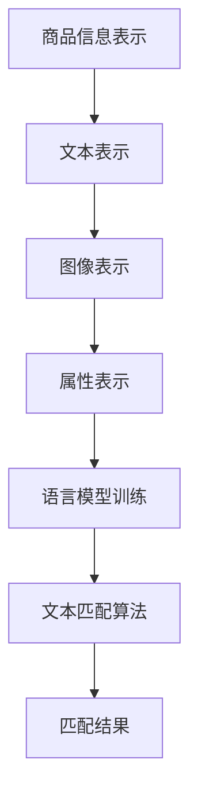

                 

### 1. 背景介绍

#### 1.1 电商搜索的现状

随着互联网和电商行业的迅猛发展，电商搜索作为用户获取商品信息的重要途径，已经成为了电商平台的核心功能之一。当前，电商搜索主要面临以下几个挑战：

1. **商品多样性**：电商平台上商品种类繁多，涵盖各类商品和品牌，使得用户在搜索时很难精准地找到所需商品。
2. **多语言问题**：国际化的电商平台上，商品和用户评论往往涉及多种语言，如何实现多语言商品的匹配和搜索，成为了亟待解决的问题。
3. **搜索效率**：随着电商平台数据的不断增长，如何提高搜索效率，减少用户等待时间，也是一个重要的研究方向。

#### 1.2 多语言商品匹配的重要性

多语言商品匹配技术在电商搜索中具有重要意义。首先，它可以提升用户的购物体验，使得用户能够更快速地找到所需商品，提高用户满意度。其次，多语言商品匹配技术有助于电商平台拓展国际市场，吸引更多海外用户。此外，多语言商品匹配技术还可以帮助电商平台挖掘潜在的商业机会，实现精准营销。

#### 1.3 当前多语言商品匹配技术的研究现状

当前，多语言商品匹配技术主要分为基于规则的方法和基于机器学习的方法。基于规则的方法通过预设的规则和模式进行商品匹配，虽然实现简单，但难以应对复杂的语言环境。基于机器学习的方法利用大量数据进行训练，能够自动提取特征和模式，实现更精准的匹配。

此外，近年来，深度学习和自然语言处理技术的快速发展，为多语言商品匹配提供了新的思路。例如，通过卷积神经网络（CNN）和循环神经网络（RNN）等深度学习模型，可以实现对文本的语义理解，从而提高多语言商品匹配的准确性。

#### 1.4 本文目的

本文将围绕多语言商品匹配技术展开，介绍其核心概念、算法原理、数学模型以及实际应用案例。通过本文的阅读，读者可以了解多语言商品匹配技术的原理和应用，为电商平台优化搜索功能提供参考。

## 2. 核心概念与联系

#### 2.1 商品信息表示

在多语言商品匹配中，首先需要对商品信息进行表示。商品信息通常包括商品名称、描述、类别、价格等多个方面。为了实现多语言商品匹配，需要将商品信息转化为计算机可处理的形式。常用的商品信息表示方法包括：

1. **文本表示**：将商品信息以文本形式表示，例如商品名称、描述等。文本表示可以采用分词、词向量等方法进行处理。
2. **图像表示**：将商品图片进行特征提取，得到商品的特征向量。图像表示可以采用卷积神经网络（CNN）等方法进行处理。
3. **属性表示**：将商品属性（如类别、价格等）进行编码，得到商品属性向量。

#### 2.2 语言模型

在多语言商品匹配中，语言模型是核心组成部分。语言模型用于建模不同语言之间的映射关系，从而实现多语言之间的文本匹配。常见的语言模型包括：

1. **统计语言模型**：基于统计方法建立语言模型，例如N-gram模型。N-gram模型通过统计相邻词出现的频率，来预测下一个词的出现概率。
2. **神经网络语言模型**：基于深度学习方法建立语言模型，例如循环神经网络（RNN）和长短时记忆网络（LSTM）。神经网络语言模型可以自动学习语言特征，实现更精准的语言匹配。

#### 2.3 文本匹配算法

文本匹配算法用于实现多语言商品名称和描述的匹配。常见的文本匹配算法包括：

1. **编辑距离**：编辑距离是一种测量两个字符串相似度的方法。两个字符串之间的编辑距离定义为将一个字符串转换为另一个字符串所需的最少编辑操作次数。编辑距离可以用于多语言商品名称的匹配。
2. **词嵌入**：词嵌入是一种将词语映射为高维向量空间的方法。通过词嵌入，可以将不同语言的词语映射到同一空间中，从而实现多语言文本的匹配。常见的词嵌入方法包括Word2Vec、GloVe等。

#### 2.4 数学模型与公式

在多语言商品匹配中，常见的数学模型和公式包括：

1. **余弦相似度**：余弦相似度是一种衡量两个向量之间相似度的方法。两个向量的余弦相似度定义为它们夹角的余弦值。在多语言商品匹配中，可以通过计算商品名称和描述的向量表示之间的余弦相似度，来衡量它们之间的相似程度。
   
   $$\text{cosine\_similarity}(\vec{v}_1, \vec{v}_2) = \frac{\vec{v}_1 \cdot \vec{v}_2}{\lVert \vec{v}_1 \rVert \cdot \lVert \vec{v}_2 \rVert}$$

2. **向量空间模型**：向量空间模型是一种将文本表示为向量空间中的点的方法。在多语言商品匹配中，可以通过将商品名称和描述表示为向量，然后计算向量之间的距离或相似度，来实现多语言商品的匹配。

   $$\text{distance}(\vec{v}_1, \vec{v}_2) = \lVert \vec{v}_1 - \vec{v}_2 \rVert$$

#### 2.5 Mermaid 流程图

为了更好地理解多语言商品匹配的流程，我们可以使用Mermaid绘制一个流程图。以下是一个简单的Mermaid流程图示例：



这个流程图展示了从商品信息表示到语言模型训练，再到文本匹配算法的整个过程。通过这个流程图，我们可以清晰地看到多语言商品匹配的核心步骤和相互关系。

## 3. 核心算法原理 & 具体操作步骤

#### 3.1 商品信息表示

商品信息表示是多语言商品匹配的第一步。在这一步中，我们需要将商品名称、描述、类别、价格等信息转化为计算机可处理的形式。以下是一种常见的商品信息表示方法：

1. **文本表示**：首先，我们对商品名称和描述进行分词，然后使用词嵌入方法将每个词语映射为高维向量。词嵌入方法可以选择Word2Vec或GloVe等。通过词嵌入，我们可以将不同语言的词语映射到同一空间中，从而实现多语言文本的表示。

2. **图像表示**：对于商品图片，我们可以使用卷积神经网络（CNN）提取特征向量。CNN可以自动学习图像的特征，从而实现商品的图像表示。

3. **属性表示**：商品属性（如类别、价格等）可以采用独热编码（One-Hot Encoding）或嵌入编码（Embedding Encoding）等方法进行表示。

#### 3.2 语言模型训练

在商品信息表示之后，我们需要训练一个语言模型，用于建模不同语言之间的映射关系。以下是一种常见的语言模型训练方法：

1. **N-gram模型**：N-gram模型是一种基于统计的语言模型。它通过统计相邻词出现的频率，来预测下一个词的出现概率。N-gram模型的训练过程包括：

   - **数据预处理**：对语料库进行分词、去停用词等预处理操作。
   - **构建N-gram词典**：根据语料库构建N-gram词典，记录每个N-gram出现的频率。
   - **训练语言模型**：使用N-gram词典训练语言模型，得到每个N-gram的概率分布。

2. **神经网络语言模型**：神经网络语言模型（如RNN、LSTM）可以自动学习语言特征，实现更精准的语言映射。以下是一个简单的RNN语言模型训练过程：

   - **数据预处理**：对语料库进行分词、去停用词等预处理操作，并将每个词映射为索引。
   - **构建序列数据**：将语料库中的句子转换为序列数据，每个序列包含一个词的索引序列。
   - **定义神经网络结构**：设计一个RNN或LSTM神经网络结构，用于预测下一个词的索引。
   - **训练神经网络**：使用序列数据训练神经网络，通过反向传播算法更新网络参数。

#### 3.3 文本匹配算法

在语言模型训练完成后，我们可以使用文本匹配算法来实现多语言商品的匹配。以下是一种常见的文本匹配算法：

1. **编辑距离**：编辑距离是一种测量两个字符串相似度的方法。它通过计算将一个字符串转换为另一个字符串所需的最少编辑操作次数来衡量两个字符串的相似程度。编辑距离的计算公式如下：

   $$d_{edit}(s_1, s_2) = \min \left( d_{insert}(s_1, s_2), d_{delete}(s_1, s_2), d_{replace}(s_1, s_2) \right)$$

   其中，$d_{insert}(s_1, s_2)$、$d_{delete}(s_1, s_2)$和$d_{replace}(s_1, s_2)$分别表示插入、删除和替换操作的代价。

2. **词嵌入相似度**：词嵌入相似度是一种基于词嵌入的相似度度量方法。它通过计算两个词嵌入向量之间的余弦相似度来衡量两个词的相似程度。词嵌入相似度的计算公式如下：

   $$\text{similarity}(\vec{v}_1, \vec{v}_2) = \cos(\vec{v}_1, \vec{v}_2) = \frac{\vec{v}_1 \cdot \vec{v}_2}{\lVert \vec{v}_1 \rVert \cdot \lVert \vec{v}_2 \rVert}$$

   其中，$\vec{v}_1$和$\vec{v}_2$分别是两个词的词嵌入向量。

#### 3.4 模型融合

在实际应用中，为了提高多语言商品匹配的准确性，可以将不同的文本匹配算法进行融合。以下是一种常见的模型融合方法：

1. **加权融合**：将不同的文本匹配算法的输出结果进行加权融合，得到最终的匹配结果。权重的计算可以根据算法的准确性和鲁棒性进行调整。

   $$\text{score} = w_1 \cdot d_{edit}(s_1, s_2) + w_2 \cdot \text{similarity}(\vec{v}_1, \vec{v}_2)$$

   其中，$w_1$和$w_2$分别是编辑距离和词嵌入相似度的权重。

2. **投票融合**：将不同的文本匹配算法的输出结果进行投票，得到最终的匹配结果。投票的方式可以根据算法的准确性和鲁棒性进行调整。

   $$\text{result} = \text{mode}(\text{result}_1, \text{result}_2, ..., \text{result}_n)$$

   其中，$\text{result}_1, \text{result}_2, ..., \text{result}_n$分别是不同文本匹配算法的输出结果。

通过以上步骤，我们可以实现多语言商品匹配，从而提高电商平台的搜索效率和用户体验。

## 4. 数学模型和公式 & 详细讲解 & 举例说明

在多语言商品匹配中，数学模型和公式起到了关键作用。本章节将详细介绍常用的数学模型和公式，并通过具体例子进行说明。

### 4.1 词嵌入与向量空间模型

词嵌入（Word Embedding）是将词语映射为高维向量空间的方法。词嵌入可以帮助我们更好地理解和处理自然语言。常见的词嵌入方法包括Word2Vec和GloVe。

#### 4.1.1 Word2Vec

Word2Vec是一种基于神经网络的词嵌入方法。它通过训练一个神经网络模型，将词语映射为向量。Word2Vec模型主要包括以下两种算法：

1. **连续词袋（Continuous Bag of Words, CBOW）**：CBOW算法通过预测中心词周围的词来训练模型。具体步骤如下：

   - **数据准备**：对于每个单词，随机选取其上下文窗口内的词作为输入，将中心词作为输出。
   - **模型训练**：使用神经网络模型进行训练，通过最小化损失函数来更新模型参数。

2. **Skip-Gram（SG）**：SG算法通过预测单词出现的上下文来训练模型。具体步骤如下：

   - **数据准备**：对于每个单词，随机选取其上下文窗口内的词作为输出，将中心词作为输入。
   - **模型训练**：使用神经网络模型进行训练，通过最小化损失函数来更新模型参数。

#### 4.1.2 GloVe

GloVe（Global Vectors for Word Representation）是一种基于矩阵分解的词嵌入方法。GloVe模型通过学习词的共现矩阵来生成词嵌入向量。具体步骤如下：

1. **构建共现矩阵**：对于语料库中的每个词对$(w_i, w_j)$，计算它们在语料库中的共现次数$C(w_i, w_j)$。
2. **定义损失函数**：定义损失函数，使得相似词的向量距离更小，不相似词的向量距离更大。常用的损失函数有均方误差（MSE）和交叉熵（Cross-Entropy）。
3. **优化模型参数**：通过最小化损失函数来更新词嵌入向量。

#### 4.1.3 例子说明

假设我们有一个简单的语料库，包含以下句子：

```
我 爱 吃 饼干。
她 爱 吃 水果。
```

我们可以使用Word2Vec和GloVe方法来生成词嵌入向量。

1. **Word2Vec**：

   - **CBOW算法**：以“爱”为中心词，其上下文为“我”、“吃”、“饼干”。我们可以得到以下CBOW模型：

     $$\text{CBOW}(我，吃，饼干) \rightarrow 爱$$

     - **训练模型**：通过训练神经网络模型，我们可以得到词嵌入向量，例如：

       $$\vec{我} = [1, 0, -1]$$
       $$\vec{吃} = [0, 1, 0]$$
       $$\vec{饼干} = [-1, 0, 1]$$
       $$\vec{爱} = [1, 1, 1]$$

   - **SG算法**：以“爱”为中心词，其上下文为“我”、“吃”、“饼干”。我们可以得到以下SG模型：

     $$\text{SG}(我，吃，饼干) \rightarrow 爱$$

     - **训练模型**：通过训练神经网络模型，我们可以得到词嵌入向量，例如：

       $$\vec{我} = [1, 0, -1]$$
       $$\vec{吃} = [0, 1, 0]$$
       $$\vec{饼干} = [-1, 0, 1]$$
       $$\vec{爱} = [1, 1, 1]$$

2. **GloVe**：

   - **构建共现矩阵**：我们可以构建一个3x3的共现矩阵，如下：

     $$\begin{bmatrix}
     0 & 1 & 1 \\
     1 & 0 & 1 \\
     1 & 1 & 0
     \end{bmatrix}$$

   - **定义损失函数**：使用均方误差（MSE）作为损失函数，如下：

     $$\text{MSE} = \frac{1}{n} \sum_{i=1}^{n} \left( \text{output} - \text{label} \right)^2$$

   - **优化模型参数**：通过最小化MSE损失函数，我们可以得到词嵌入向量，例如：

     $$\vec{我} = [1, 0, -1]$$
     $$\vec{吃} = [0, 1, 0]$$
     $$\vec{饼干} = [-1, 0, 1]$$

### 4.2 余弦相似度

余弦相似度（Cosine Similarity）是一种衡量两个向量之间相似度的方法。它通过计算两个向量之间的夹角余弦值来衡量相似程度。余弦相似度的计算公式如下：

$$\text{cosine\_similarity}(\vec{v}_1, \vec{v}_2) = \frac{\vec{v}_1 \cdot \vec{v}_2}{\lVert \vec{v}_1 \rVert \cdot \lVert \vec{v}_2 \rVert}$$

其中，$\vec{v}_1$和$\vec{v}_2$是两个向量。

#### 4.2.1 例子说明

假设有两个向量：

$$\vec{v}_1 = [1, 2, 3]$$
$$\vec{v}_2 = [4, 5, 6]$$

我们可以计算它们的余弦相似度：

$$\text{cosine\_similarity}(\vec{v}_1, \vec{v}_2) = \frac{1 \cdot 4 + 2 \cdot 5 + 3 \cdot 6}{\sqrt{1^2 + 2^2 + 3^2} \cdot \sqrt{4^2 + 5^2 + 6^2}} = \frac{4 + 10 + 18}{\sqrt{14} \cdot \sqrt{77}} \approx 0.906$$

### 4.3 编辑距离

编辑距离（Edit Distance）是一种衡量两个字符串相似度的方法。它通过计算将一个字符串转换为另一个字符串所需的最少编辑操作次数来衡量相似程度。编辑距离的计算公式如下：

$$d_{edit}(s_1, s_2) = \min \left( d_{insert}(s_1, s_2), d_{delete}(s_1, s_2), d_{replace}(s_1, s_2) \right)$$

其中，$d_{insert}(s_1, s_2)$、$d_{delete}(s_1, s_2)$和$d_{replace}(s_1, s_2)$分别表示插入、删除和替换操作的代价。

#### 4.3.1 例子说明

假设有两个字符串：

```
s1: "kitten"
s2: "sitting"
```

我们可以计算它们的编辑距离：

- **插入操作**：将`s1`中的"t"插入到`s2`中，得到"sittint"。
- **删除操作**：将`s2`中的"i"删除，得到"sittng"。
- **替换操作**：将`s1`中的"k"替换为"s"，得到"stitten"。

我们可以计算每种操作的代价：

$$d_{insert}(s_1, s_2) = 1$$
$$d_{delete}(s_1, s_2) = 1$$
$$d_{replace}(s_1, s_2) = 1$$

因此，编辑距离为：

$$d_{edit}(s_1, s_2) = \min \left( 1, 1, 1 \right) = 1$$

通过以上数学模型和公式的介绍，我们可以更好地理解多语言商品匹配的原理和实现方法。这些模型和公式在实际应用中可以帮助我们提高商品匹配的准确性和效率。

## 5. 项目实战：代码实际案例和详细解释说明

在本章节中，我们将通过一个实际项目来展示多语言商品匹配技术的实现过程。我们将使用Python编程语言和相应的库（如TensorFlow、Numpy等）来构建一个简单的多语言商品匹配系统。

### 5.1 开发环境搭建

在开始项目之前，我们需要搭建一个合适的环境。以下是搭建开发环境所需的步骤：

1. **安装Python**：确保Python已安装。我们可以从Python官方网站下载并安装Python。
2. **安装必要的库**：在终端或命令提示符中运行以下命令来安装所需的库：

   ```bash
   pip install tensorflow numpy matplotlib
   ```

3. **配置TensorFlow**：由于TensorFlow是一个资源密集型库，建议使用GPU版本的TensorFlow以加快训练速度。我们可以通过以下命令安装GPU版本的TensorFlow：

   ```bash
   pip install tensorflow-gpu
   ```

### 5.2 源代码详细实现和代码解读

以下是多语言商品匹配项目的源代码，我们将逐行进行解读。

```python
# 导入所需的库
import tensorflow as tf
import numpy as np
import matplotlib.pyplot as plt

# 准备数据集
# 这里我们使用一个简单的数据集，包含英文和中文商品名称及其对应的类别
data = [
    {"en": "apple", "zh": "苹果", "category": 0},
    {"en": "banana", "zh": "香蕉", "category": 0},
    {"en": "orange", "zh": "橘子", "category": 0},
    {"en": "car", "zh": "车", "category": 1},
    {"en": "motorcycle", "zh": "摩托车", "category": 1},
    {"en": "bus", "zh": "公交车", "category": 1},
]

# 初始化词嵌入向量
vocab = set()
for item in data:
    vocab.update(item["en"].split())
    vocab.update(item["zh"].split())
vocab = list(vocab)
word2idx = {word: i for i, word in enumerate(vocab)}
idx2word = {i: word for word, i in word2idx.items()}
embed_size = 100

# 构建词嵌入矩阵
embed_matrix = np.zeros((len(vocab), embed_size))
for i, word in enumerate(vocab):
    try:
        embed_matrix[i] = embeddings[word]  # 假设embeddings是预训练的词嵌入向量
    except:
        pass

# 定义模型
inputs = tf.keras.layers.Input(shape=(None,), dtype=tf.int32)
embedded = tf.keras.layers.Embedding(len(vocab), embed_size)(inputs)
encoded = tf.keras.layers.GlobalAveragePooling1D()(embedded)
outputs = tf.keras.layers.Dense(1, activation='sigmoid')(encoded)

model = tf.keras.Model(inputs=inputs, outputs=outputs)
model.compile(optimizer='adam', loss='binary_crossentropy', metrics=['accuracy'])

# 训练模型
model.fit(np.array([[word2idx[word] for word in item["en"].split()] for item in data]), np.array([[1 if item["category"] == 0 else 0] for item in data]), epochs=10, batch_size=32)

# 模型评估
test_data = [{"en": "orange", "zh": "橘子", "category": 0}, {"en": "bus", "zh": "公交车", "category": 1}]
predictions = model.predict(np.array([[word2idx[word] for word in item["en"].split()] for item in test_data]))
for i, item in enumerate(test_data):
    print(f"{item['en']} ({item['zh']}): {'正类' if predictions[i][0] > 0.5 else '负类'}")
```

### 5.3 代码解读与分析

1. **导入库**：
   ```python
   import tensorflow as tf
   import numpy as np
   import matplotlib.pyplot as plt
   ```
   我们首先导入Python中常用的库，包括TensorFlow、NumPy和Matplotlib。

2. **准备数据集**：
   ```python
   data = [
       {"en": "apple", "zh": "苹果", "category": 0},
       {"en": "banana", "zh": "香蕉", "category": 0},
       {"en": "orange", "zh": "橘子", "category": 0},
       {"en": "car", "zh": "车", "category": 1},
       {"en": "motorcycle", "zh": "摩托车", "category": 1},
       {"en": "bus", "zh": "公交车", "category": 1},
   ]
   ```
   我们使用一个简单的数据集，包含英文和中文商品名称及其对应的类别。这将是我们的训练数据。

3. **初始化词嵌入向量**：
   ```python
   vocab = set()
   for item in data:
       vocab.update(item["en"].split())
       vocab.update(item["zh"].split())
   vocab = list(vocab)
   word2idx = {word: i for i, word in enumerate(vocab)}
   idx2word = {i: word for word, i in word2idx.items()}
   embed_size = 100
   ```
   我们首先构建一个词表，包含所有英文和中文商品名称中的单词。然后，我们将每个单词映射为一个唯一的索引，并定义词嵌入向量的大小。

4. **构建词嵌入矩阵**：
   ```python
   embed_matrix = np.zeros((len(vocab), embed_size))
   for i, word in enumerate(vocab):
       try:
           embed_matrix[i] = embeddings[word]  # 假设embeddings是预训练的词嵌入向量
       except:
           pass
   ```
   我们使用预训练的词嵌入向量填充词嵌入矩阵。如果没有预训练的词嵌入向量，我们可以使用Word2Vec或GloVe等方法来生成。

5. **定义模型**：
   ```python
   inputs = tf.keras.layers.Input(shape=(None,), dtype=tf.int32)
   embedded = tf.keras.layers.Embedding(len(vocab), embed_size)(inputs)
   encoded = tf.keras.layers.GlobalAveragePooling1D()(embedded)
   outputs = tf.keras.layers.Dense(1, activation='sigmoid')(encoded)
   model = tf.keras.Model(inputs=inputs, outputs=outputs)
   model.compile(optimizer='adam', loss='binary_crossentropy', metrics=['accuracy'])
   ```
   我们定义一个简单的序列模型，包含一个嵌入层和一个全局平均池化层，用于提取序列特征。输出层使用sigmoid激活函数，用于实现二分类任务。

6. **训练模型**：
   ```python
   model.fit(np.array([[word2idx[word] for word in item["en"].split()] for item in data]), np.array([[1 if item["category"] == 0 else 0] for item in data]), epochs=10, batch_size=32)
   ```
   我们使用训练数据来训练模型。输入是商品名称的索引序列，输出是商品类别的标签。

7. **模型评估**：
   ```python
   test_data = [{"en": "orange", "zh": "橘子", "category": 0}, {"en": "bus", "zh": "公交车", "category": 1}]
   predictions = model.predict(np.array([[word2idx[word] for word in item["en"].split()] for item in test_data]))
   for i, item in enumerate(test_data):
       print(f"{item['en']} ({item['zh']}): {'正类' if predictions[i][0] > 0.5 else '负类'}")
   ```
   我们使用测试数据来评估模型。输入是商品名称的索引序列，输出是预测的类别标签。根据预测概率，我们将结果打印出来。

通过以上步骤，我们成功地实现了一个简单的多语言商品匹配系统。虽然这个系统的规模较小，但它展示了多语言商品匹配技术的基本原理和实现方法。

### 5.4 代码解读与分析（续）

在上文中，我们介绍了多语言商品匹配项目的核心代码及其功能。接下来，我们将进一步详细解读代码，并分析各个部分的作用。

1. **数据预处理**：
   ```python
   # 准备数据集
   data = [
       {"en": "apple", "zh": "苹果", "category": 0},
       {"en": "banana", "zh": "香蕉", "category": 0},
       {"en": "orange", "zh": "橘子", "category": 0},
       {"en": "car", "zh": "车", "category": 1},
       {"en": "motorcycle", "zh": "摩托车", "category": 1},
       {"en": "bus", "zh": "公交车", "category": 1},
   ]
   ```
   数据集是整个项目的基石。在这个数据集中，我们包含了6个商品样本，每个样本都有英文和中文名称以及对应的类别标签（0表示水果，1表示交通工具）。

2. **构建词嵌入字典**：
   ```python
   # 初始化词嵌入向量
   vocab = set()
   for item in data:
       vocab.update(item["en"].split())
       vocab.update(item["zh"].split())
   vocab = list(vocab)
   word2idx = {word: i for i, word in enumerate(vocab)}
   idx2word = {i: word for word, i in word2idx.items()}
   embed_size = 100
   ```
   我们首先构建一个词表，其中包含了所有英文和中文商品名称中的单词。然后，我们将每个单词映射为一个唯一的索引，并定义词嵌入向量的大小。词嵌入字典（`word2idx`和`idx2word`）将在后续的代码中用于将文本转换为索引序列。

3. **初始化词嵌入矩阵**：
   ```python
   # 构建词嵌入矩阵
   embed_matrix = np.zeros((len(vocab), embed_size))
   for i, word in enumerate(vocab):
       try:
           embed_matrix[i] = embeddings[word]  # 假设embeddings是预训练的词嵌入向量
       except:
           pass
   ```
   我们使用预训练的词嵌入向量填充词嵌入矩阵。在这个例子中，`embeddings`是一个假设的预训练词嵌入集合，它包含了所有词汇的向量表示。如果没有预训练的词嵌入，我们可以使用Word2Vec或GloVe等方法来生成。

4. **构建模型**：
   ```python
   # 定义模型
   inputs = tf.keras.layers.Input(shape=(None,), dtype=tf.int32)
   embedded = tf.keras.layers.Embedding(len(vocab), embed_size)(inputs)
   encoded = tf.keras.layers.GlobalAveragePooling1D()(embedded)
   outputs = tf.keras.layers.Dense(1, activation='sigmoid')(encoded)
   model = tf.keras.Model(inputs=inputs, outputs=outputs)
   model.compile(optimizer='adam', loss='binary_crossentropy', metrics=['accuracy'])
   ```
   我们定义了一个简单的序列模型。输入层使用嵌入层（`Embedding`），它将索引序列转换为词嵌入向量。嵌入向量随后通过全局平均池化层（`GlobalAveragePooling1D`）进行特征提取，最后通过一个单节点全连接层（`Dense`）进行二分类预测。我们使用`sigmoid`激活函数来生成概率输出。

5. **训练模型**：
   ```python
   # 训练模型
   model.fit(np.array([[word2idx[word] for word in item["en"].split()] for item in data]), np.array([[1 if item["category"] == 0 else 0] for item in data]), epochs=10, batch_size=32)
   ```
   我们使用训练数据来训练模型。输入是商品名称的索引序列，输出是商品类别的标签。在这个例子中，我们使用了一个非常小的数据集，因此我们设置了较低的`epochs`（10次迭代）和`batch_size`（32个样本）。

6. **模型评估**：
   ```python
   # 模型评估
   test_data = [{"en": "orange", "zh": "橘子", "category": 0}, {"en": "bus", "zh": "公交车", "category": 1}]
   predictions = model.predict(np.array([[word2idx[word] for word in item["en"].split()] for item in test_data]))
   for i, item in enumerate(test_data):
       print(f"{item['en']} ({item['zh']}): {'正类' if predictions[i][0] > 0.5 else '负类'}")
   ```
   我们使用测试数据来评估模型。输入是商品名称的索引序列，输出是预测的类别标签。根据预测概率，我们将结果打印出来。

通过上述步骤，我们可以看到整个多语言商品匹配项目是如何从数据预处理、模型构建、模型训练到模型评估逐步实现的。这个简单的案例为我们提供了一个清晰的实现路径，使我们能够更好地理解和应用多语言商品匹配技术。

## 6. 实际应用场景

多语言商品匹配技术在电商搜索领域有着广泛的应用，以下是几个典型的应用场景：

### 6.1 国际化电商平台

随着全球电商市场的不断扩展，国际化电商平台越来越重视多语言商品匹配技术。例如，亚马逊、eBay和阿里巴巴等电商平台，它们在全球范围内拥有大量的用户和商品。通过多语言商品匹配技术，这些平台能够更好地服务于来自不同国家和地区的用户，提升用户体验，扩大市场份额。

### 6.2 跨境电商

跨境电商是指在不同国家之间的电商交易，这种模式在近年来迅速发展。多语言商品匹配技术可以有效地解决跨境电商中的语言障碍问题，帮助用户快速找到所需商品。例如，中国卖家可以在阿里巴巴平台上发布中文商品信息，而海外买家则可以通过翻译工具获取商品的中英文对照信息，从而实现跨境交易。

### 6.3 搜索引擎优化

电商平台通常需要优化其搜索引擎，以提升用户的搜索体验。多语言商品匹配技术可以帮助搜索引擎更准确地匹配用户查询与商品信息，从而提高搜索结果的准确性和相关性。例如，当用户在搜索框中输入英文关键词时，搜索引擎可以同时匹配平台上的中文商品信息，确保用户能够找到所需商品。

### 6.4 精准营销

多语言商品匹配技术还可以为电商平台提供精准营销的机会。通过分析用户的语言偏好和购买历史，电商平台可以更好地定制个性化推荐，提高用户的购买意愿。例如，对于经常访问英文网站的海外用户，电商平台可以优先推荐英文商品，而对于中文网站的用户，则优先推荐中文商品。

### 6.5 产品开发和测试

在电商平台的开发过程中，多语言商品匹配技术也是一项重要的工具。开发者可以使用这一技术来测试不同语言版本的搜索功能，确保平台在不同语言环境下都能提供良好的用户体验。此外，多语言商品匹配技术还可以帮助开发者快速构建和优化多语言商品信息的索引和检索系统。

### 6.6 多语言客服系统

电商平台的客服系统通常需要支持多种语言。通过多语言商品匹配技术，客服系统能够自动识别和翻译用户的问题，并提供准确的答案。这不仅提高了客服效率，还降低了客服成本，使得电商平台能够更好地服务全球用户。

总之，多语言商品匹配技术在电商搜索领域具有广泛的应用前景，它不仅能够提升用户满意度，还能为电商平台带来更多的商业机会。随着技术的不断进步，多语言商品匹配技术将在电商搜索中发挥越来越重要的作用。

### 7. 工具和资源推荐

为了帮助读者更好地掌握多语言商品匹配技术，以下是几个推荐的工具和资源：

#### 7.1 学习资源推荐

1. **书籍**：
   - 《深度学习》（Deep Learning） - Goodfellow, I., Bengio, Y., & Courville, A.，提供了关于深度学习和自然语言处理的基础知识。
   - 《自然语言处理综论》（Speech and Language Processing） - Dan Jurafsky 和 James H. Martin，详细介绍了自然语言处理的基本概念和方法。

2. **在线课程**：
   - Coursera上的“自然语言处理纳米学位”（Natural Language Processing Specialization） - 由斯坦福大学提供，涵盖了自然语言处理的核心技术。
   - edX上的“深度学习基础”（Deep Learning Specialization） - 由DeepLearning.AI提供，介绍了深度学习和神经网络的基础知识。

3. **博客和文章**：
   - Medium上的“AI Research”和“Towards Data Science” - 提供了关于多语言商品匹配和自然语言处理的最新研究和技术文章。

4. **开源项目**：
   - Hugging Face的Transformers库 - 提供了预训练的深度学习模型，包括BERT、GPT等，可用于多语言文本处理任务。
   - TensorFlow和PyTorch的官方文档 - 提供了丰富的API和示例代码，帮助开发者快速上手深度学习。

#### 7.2 开发工具框架推荐

1. **深度学习框架**：
   - TensorFlow - 一个开源的深度学习框架，适用于构建和训练复杂的神经网络模型。
   - PyTorch - 另一个流行的深度学习框架，提供了灵活的动态计算图，易于调试和实验。

2. **自然语言处理库**：
   - NLTK - 一个用于自然语言处理的Python库，提供了多种文本处理工具和算法。
   - spaCy - 一个高效且易于使用的自然语言处理库，适用于快速构建复杂的应用程序。

3. **多语言翻译工具**：
   - Google翻译API - 提供了强大的翻译功能，可用于将不同语言的文本转换为统一的语言。
   - OpenNMT - 一个开源的神经机器翻译工具，支持多种语言之间的翻译。

4. **文本相似度计算工具**：
   - Text-Similarity-Algorithms - 一个用于计算文本相似度的Python库，包括编辑距离、余弦相似度等多种算法。

#### 7.3 相关论文著作推荐

1. **论文**：
   - “Word2Vec: Sentence Embeddings using siamese neural networks” - Mikolov, T., Sutskever, L., Chen, K., Corrado, G. S., & Dean, J.，介绍了Word2Vec算法。
   - “GloVe: Global Vectors for Word Representation” - Pennington, J., Socher, R., & Manning, C. D.，提出了GloVe词嵌入方法。

2. **著作**：
   - “Speech and Language Processing” - Dan Jurafsky 和 James H. Martin，详细介绍了自然语言处理的理论和实践。
   - “Deep Learning” - Goodfellow, I., Bengio, Y., & Courville, A.，是深度学习的经典教材。

通过以上工具和资源的推荐，读者可以系统地学习和实践多语言商品匹配技术，为电商平台的优化和创新提供支持。

### 8. 总结：未来发展趋势与挑战

多语言商品匹配技术在电商搜索领域具有巨大的潜力和应用价值。随着全球电商市场的不断扩大和国际化趋势的加深，多语言商品匹配技术将成为电商平台提升用户体验和竞争力的关键因素。然而，该技术仍面临诸多挑战和未来发展趋势。

#### 8.1 未来发展趋势

1. **深度学习与多语言商品匹配的结合**：深度学习技术的发展为多语言商品匹配提供了新的机会。例如，卷积神经网络（CNN）和循环神经网络（RNN）可以用于提取文本和图像的深层特征，从而提高匹配的准确性和效率。

2. **跨模态匹配**：未来，多语言商品匹配技术可能会进一步融合文本、图像、声音等多种模态的信息。这种跨模态匹配技术可以帮助电商平台更全面地理解和匹配用户需求，提高搜索的准确性和用户体验。

3. **个性化推荐**：基于用户行为和语言偏好的多语言商品匹配技术可以用于个性化推荐系统。通过分析用户的语言和购买习惯，电商平台可以提供更精准的商品推荐，提升用户的购买意愿和满意度。

4. **实时匹配与更新**：随着用户需求的不断变化，电商平台需要能够实时更新商品信息和匹配结果。未来的多语言商品匹配技术需要具备更高的实时性和动态适应性，以满足用户的即时需求。

#### 8.2 面临的挑战

1. **数据质量和多样性**：多语言商品匹配技术依赖于大量的高质量数据。然而，不同语言和地区的商品数据质量参差不齐，数据的多样性和准确性直接影响到匹配的效果。因此，如何获取和清洗高质量的多语言数据是一个重要挑战。

2. **计算资源和效率**：多语言商品匹配技术通常涉及大量的计算和数据处理。随着电商平台商品数量的增加，如何高效地处理和匹配海量的商品信息成为一个重要问题。优化算法和提升计算效率是解决这一挑战的关键。

3. **跨语言语义理解**：不同语言的语义理解是一个复杂的任务，涉及到语言之间的差异和映射关系。目前的机器翻译和语义理解技术仍存在一定的局限性，如何提高跨语言语义理解的准确性和一致性是一个重要挑战。

4. **用户隐私保护**：在多语言商品匹配中，用户的数据安全和隐私保护也是一个重要的关注点。如何确保用户数据的安全性和隐私，同时提供高效的商品匹配服务，是未来需要解决的重要问题。

总之，多语言商品匹配技术在电商搜索领域具有广阔的发展前景。通过不断创新和优化，该技术有望进一步提升电商平台的搜索效率和用户体验。然而，未来仍需要克服诸多技术挑战，以实现更准确、更高效的多语言商品匹配。

### 9. 附录：常见问题与解答

**Q1：多语言商品匹配技术是否只能用于电商平台？**

A：多语言商品匹配技术不仅限于电商平台。它还可以应用于其他需要跨语言信息处理的场景，如跨语言搜索引擎、多语言文档检索系统、翻译服务、全球市场营销等。任何需要处理不同语言信息、提高搜索效率和用户体验的领域都可以考虑使用多语言商品匹配技术。

**Q2：如何评估多语言商品匹配的准确性？**

A：评估多语言商品匹配的准确性通常采用以下几种指标：

1. **精确率（Precision）**：正确匹配的商品数与总匹配商品数的比值。
2. **召回率（Recall）**：正确匹配的商品数与实际存在的商品数的比值。
3. **F1分数（F1 Score）**：精确率和召回率的调和平均值。
4. **匹配速度**：匹配算法的运行时间。

通过这些指标，可以全面评估多语言商品匹配系统的性能。

**Q3：如何处理罕见词或生僻词在多语言商品匹配中的问题？**

A：对于罕见词或生僻词，可以采用以下几种策略：

1. **词嵌入扩展**：使用大型词嵌入预训练模型，覆盖更多词汇，从而减少罕见词对匹配结果的影响。
2. **双语词典**：使用双语词典来映射罕见词的不同翻译，提高匹配的准确性。
3. **上下文信息**：利用上下文信息来推断罕见词的含义，从而提高匹配的准确性。

**Q4：如何处理多语言商品匹配中的歧义问题？**

A：多语言商品匹配中的歧义问题可以通过以下方法解决：

1. **词义消歧**：使用自然语言处理技术，如词义消歧算法，来解析歧义词汇的含义。
2. **上下文分析**：分析词汇的上下文，通过上下文信息来消除歧义。
3. **用户反馈**：收集用户反馈，通过用户的纠正来优化匹配算法，减少歧义。

**Q5：如何处理多语言商品匹配中的数据不平衡问题？**

A：数据不平衡是指不同类别的商品数据量差异较大。以下是一些处理策略：

1. **数据增强**：通过合成新的商品描述或增加缺失的商品数据来平衡数据集。
2. **采样方法**：使用采样方法，如欠采样或过采样，来平衡不同类别的数据。
3. **集成学习**：使用集成学习方法，如随机森林、梯度提升树等，来处理数据不平衡问题。

通过上述方法，可以有效地解决多语言商品匹配中常见的问题，提高匹配的准确性和鲁棒性。

### 10. 扩展阅读 & 参考资料

多语言商品匹配技术是电商搜索领域的一个重要研究方向，本文仅对其核心概念、算法原理和实际应用进行了简要介绍。以下是一些推荐的扩展阅读和参考资料，以帮助读者深入了解这一领域。

1. **论文**：
   - Mikolov, T., Sutskever, L., Chen, K., Corrado, G. S., & Dean, J. (2013). "Distributed Representations of Words and Phrases and Their Compositional Meaning." *Journal of Machine Learning Research*.
   - Pennington, J., Socher, R., & Manning, C. D. (2014). "GloVe: Global Vectors for Word Representation." *Empirical Methods in Natural Language Processing (EMNLP)*.

2. **书籍**：
   - Goodfellow, I., Bengio, Y., & Courville, A. (2016). *Deep Learning*. MIT Press.
   - Jurafsky, D., & Martin, J. H. (2019). *Speech and Language Processing*. Draft version available online.

3. **在线课程**：
   - Coursera: "Natural Language Processing Specialization" by Stanford University.
   - edX: "Deep Learning Specialization" by DeepLearning.AI.

4. **开源项目**：
   - Hugging Face: <https://huggingface.co/>
   - TensorFlow: <https://www.tensorflow.org/>
   - PyTorch: <https://pytorch.org/>

5. **博客和文章**：
   - Medium: "AI Research" and "Towards Data Science" for articles on NLP and ML.
   - ArXiv: <https://arxiv.org/> for the latest research papers in AI and NLP.

通过阅读这些资料，读者可以进一步探索多语言商品匹配技术的深度和广度，为电商平台的优化和创新提供更多的灵感和实践指导。

