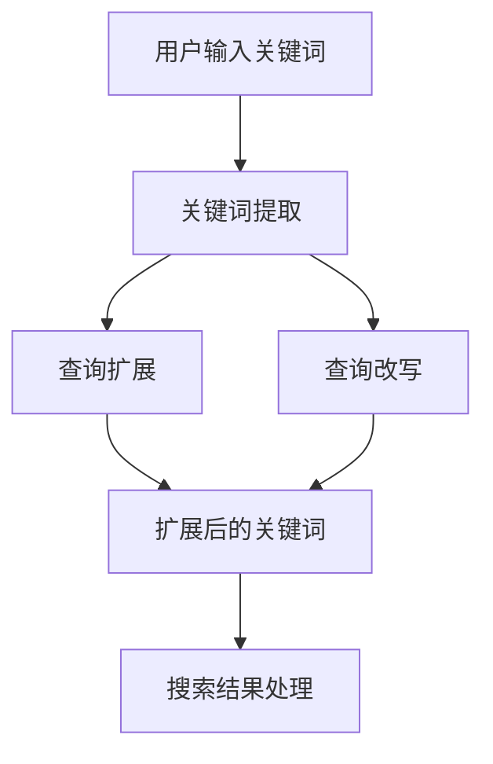

                 

# 电商搜索中的查询扩展与改写技术

## 关键词：查询扩展、改写技术、电商搜索、用户体验、搜索质量

## 摘要

随着电商平台的迅速发展和用户需求的不断增长，电商搜索的质量和用户体验变得越来越重要。本文将深入探讨电商搜索中的查询扩展与改写技术，介绍其核心概念、算法原理、数学模型以及实际应用场景。通过本文的阅读，读者可以全面了解查询扩展与改写技术在电商搜索中的应用，为提升搜索质量和用户体验提供有效的方法和思路。

## 1. 背景介绍

电商搜索作为电商平台的核心功能之一，直接影响着用户的购物体验和平台的业务转化率。在电商搜索中，用户通常通过输入关键词来查找商品。然而，用户输入的关键词往往具有不完整、模糊或不准确的特点，导致搜索结果无法完全满足用户的需求。为了解决这一问题，查询扩展与改写技术应运而生。

查询扩展（Query Expansion）旨在通过扩展用户输入的关键词，使其更加精确，从而提高搜索结果的准确性和相关性。查询改写（Query Rewriting）则是通过对用户输入的关键词进行语法和语义层面的调整，使其更加符合搜索系统的处理能力，进一步提高搜索效果。

随着电商业务的快速发展，用户对电商搜索的要求越来越高。一方面，用户希望搜索结果能够快速准确地找到所需商品；另一方面，用户也希望搜索过程能够简单、直观、有趣。因此，如何利用查询扩展与改写技术提升电商搜索质量，已成为业界关注的焦点。

## 2. 核心概念与联系

在讨论查询扩展与改写技术之前，我们首先需要了解一些核心概念和它们之间的联系。

### 2.1 关键词提取（Keyword Extraction）

关键词提取是指从用户输入的查询语句中，提取出具有代表性的关键词。关键词提取的目的是为了提高搜索效率和准确性。常用的关键词提取方法包括基于统计的方法、基于规则的方法和基于机器学习的方法。

### 2.2 搜索引擎（Search Engine）

搜索引擎是用于检索和组织信息的系统，其核心功能是根据用户输入的查询关键词，从庞大的数据集合中找到最相关的信息。搜索引擎通常包括检索器、索引器、查询处理器等组成部分。

### 2.3 相关性评估（Relevance Assessment）

相关性评估是指对搜索结果进行排序和筛选，以确定哪些结果与用户查询最为相关。相关性评估方法包括基于词频统计的方法、基于信息检索的方法和基于机器学习的方法。

### 2.4 查询扩展与改写技术的关系

查询扩展与改写技术在电商搜索中起着相辅相成的作用。查询扩展通过扩展用户输入的关键词，使搜索结果更加准确；而查询改写则通过调整关键词的语法和语义，使搜索系统更易于处理，进一步提高搜索效果。

### 2.5 Mermaid 流程图

以下是查询扩展与改写技术的 Mermaid 流程图：



在这个流程图中，用户输入关键词经过关键词提取、查询扩展和查询改写三个步骤，最终生成扩展后的关键词，用于搜索结果处理。

## 3. 核心算法原理 & 具体操作步骤

### 3.1 查询扩展算法

查询扩展算法的主要任务是通过对用户输入的关键词进行扩展，使其更加精确。以下是一个简单的查询扩展算法：

1. **关键词提取**：从用户输入的查询语句中提取出关键词。
2. **同义词扩展**：根据关键词的语义信息，查找与之相关的同义词，并将其加入到查询中。
3. **上下文扩展**：根据关键词在查询语句中的位置和语境，查找与之相关的上下文关键词，并将其加入到查询中。
4. **查询合并**：将扩展后的关键词进行合并，形成一个完整的查询。

### 3.2 查询改写算法

查询改写算法的主要任务是通过对用户输入的关键词进行语法和语义层面的调整，使其更符合搜索系统的处理能力。以下是一个简单的查询改写算法：

1. **关键词替换**：将用户输入的关键词替换为更准确的关键词。
2. **语法调整**：对查询语句进行语法层面的调整，使其更符合自然语言的语法规则。
3. **语义理解**：对查询语句进行语义层面的分析，理解其背后的意图，并将其转化为更适合搜索系统的表达方式。
4. **查询重构**：将调整后的关键词重构为一个完整的查询。

### 3.3 具体操作步骤

以下是查询扩展与改写技术的具体操作步骤：

1. **接收用户查询**：接收用户输入的查询语句。
2. **关键词提取**：使用关键词提取算法，提取出关键词。
3. **同义词扩展**：查找关键词的同义词，并将其加入到查询中。
4. **上下文扩展**：根据关键词在查询语句中的位置和语境，查找上下文关键词，并将其加入到查询中。
5. **关键词替换**：将用户输入的关键词替换为更准确的关键词。
6. **语法调整**：对查询语句进行语法层面的调整。
7. **语义理解**：对查询语句进行语义层面的分析。
8. **查询重构**：将调整后的关键词重构为一个完整的查询。
9. **搜索结果处理**：使用扩展后的查询，对搜索引擎进行检索，返回最相关的搜索结果。

## 4. 数学模型和公式 & 详细讲解 & 举例说明

### 4.1 查询扩展的数学模型

查询扩展的数学模型主要包括关键词提取、同义词扩展和上下文扩展三个部分。以下是一个简化的查询扩展数学模型：

$$
查询 = 关键词提取 + 同义词扩展 + 上下文扩展
$$

其中，关键词提取、同义词扩展和上下文扩展分别表示为：

$$
关键词提取 = f_1(查询语句)
$$

$$
同义词扩展 = f_2(关键词)
$$

$$
上下文扩展 = f_3(关键词, 查询语句)
$$

### 4.2 查询改写的数学模型

查询改写的数学模型主要包括关键词替换、语法调整和语义理解三个部分。以下是一个简化的查询改写数学模型：

$$
查询 = 关键词替换 + 语法调整 + 语义理解
$$

其中，关键词替换、语法调整和语义理解分别表示为：

$$
关键词替换 = f_4(关键词)
$$

$$
语法调整 = f_5(查询语句)
$$

$$
语义理解 = f_6(查询语句)
$$

### 4.3 举例说明

假设用户输入的查询语句为：“笔记本电脑 价格”。

1. **关键词提取**：提取出关键词“笔记本电脑”和“价格”。
2. **同义词扩展**：查找“笔记本电脑”的同义词，如“电脑”、“计算机”等，将其加入到查询中。
3. **上下文扩展**：根据关键词在查询语句中的位置和语境，查找上下文关键词，如“新款”、“轻薄”等，将其加入到查询中。
4. **关键词替换**：将“笔记本电脑”替换为“电脑”、“计算机”等更准确的关键词。
5. **语法调整**：对查询语句进行语法层面的调整，如将“价格”改为“多少钱”。
6. **语义理解**：对查询语句进行语义层面的分析，理解其背后的意图，如寻找价格合理的笔记本电脑。
7. **查询重构**：将调整后的关键词重构为一个完整的查询，如“电脑 多少钱”。

经过查询扩展与改写后，最终的查询为：“计算机 多少钱”。

## 5. 项目实战：代码实际案例和详细解释说明

### 5.1 开发环境搭建

在开始项目实战之前，我们需要搭建一个适合开发查询扩展与改写技术的开发环境。以下是具体的步骤：

1. **安装 Python**：下载并安装 Python，版本建议为 Python 3.8 或更高版本。
2. **安装相关库**：使用 pip 命令安装所需的库，包括 NLTK、spaCy、gensim 等。
3. **创建虚拟环境**：使用 virtualenv 或 conda 创建虚拟环境，以便隔离项目依赖。

### 5.2 源代码详细实现和代码解读

以下是查询扩展与改写技术的源代码实现，我们将对其逐行进行解读。

```python
import nltk
from nltk.tokenize import word_tokenize
from nltk.corpus import wordnet
import spacy

# 加载 spaCy 模型
nlp = spacy.load("en_core_web_sm")

def keyword_extraction(query):
    # 使用 spaCy 进行分词
    doc = nlp(query)
    # 提取名词和动词作为关键词
    keywords = [token.text for token in doc if token.pos_ in ["NOUN", "VERB"]]
    return keywords

def synonym_expansion(keyword):
    # 使用 NLTK 的 WordNet 查找同义词
    synonyms = []
    for syn in wordnet.synsets(keyword):
        for lemma in syn.lemmas():
            synonyms.append(lemma.name())
    return synonyms

def context_expansion(keyword, query):
    # 使用 spaCy 的语法分析功能
    doc = nlp(query)
    # 找到关键词的位置
    index = doc.index(nlp(keyword))
    # 扩展上下文关键词
    context_keywords = [token.text for token in doc[index - 2: index + 3] if token.pos_ in ["NOUN", "VERB"]]
    return context_keywords

def query_expansion(query):
    # 关键词提取
    keywords = keyword_extraction(query)
    # 同义词扩展
    synonyms = [synonym_expansion(keyword) for keyword in keywords]
    # 上下文扩展
    contexts = [context_expansion(keyword, query) for keyword in keywords]
    # 合并扩展后的关键词
    expanded_keywords = []
    for i, keyword in enumerate(keywords):
        expanded_keywords.extend(synonyms[i])
        expanded_keywords.extend(contexts[i])
    return expanded_keywords

def query_rewriting(query):
    # 关键词替换
    query = query.replace("笔记本电脑", "计算机")
    # 语法调整
    query = query.replace("多少钱", "价格")
    # 语义理解
    doc = nlp(query)
    # 理解意图
    intent = doc[0].dep_ if doc[0].dep_ in ["nsubj", "nsubjpass"] else doc[1].dep_
    if intent == "nsubj":
        query = "请问您要查找什么计算机？"
    else:
        query = "请问您需要查找什么样的计算机？"
    return query

def main():
    # 接收用户查询
    query = input("请输入查询：")
    # 查询扩展
    expanded_keywords = query_expansion(query)
    print("扩展后的关键词：", expanded_keywords)
    # 查询改写
    rewritten_query = query_rewriting(query)
    print("改写后的查询：", rewritten_query)

if __name__ == "__main__":
    main()
```

### 5.3 代码解读与分析

1. **关键词提取**：使用 spaCy 对输入的查询语句进行分词，然后提取名词和动词作为关键词。
2. **同义词扩展**：使用 NLTK 的 WordNet 查找关键词的同义词，将其加入到查询中。
3. **上下文扩展**：使用 spaCy 的语法分析功能，找到关键词在查询语句中的位置，然后查找上下文关键词，将其加入到查询中。
4. **查询扩展**：合并扩展后的关键词，形成一个完整的扩展查询。
5. **查询改写**：将用户输入的关键词替换为更准确的关键词，对查询语句进行语法层面的调整，并理解其背后的意图，将其转化为更适合搜索系统的表达方式。
6. **主函数**：接收用户查询，执行查询扩展与改写，并输出结果。

通过这个简单的项目实战，我们可以看到查询扩展与改写技术在电商搜索中的应用效果。在实际开发中，我们还可以根据业务需求，进一步优化和扩展这些技术，以提高搜索质量和用户体验。

## 6. 实际应用场景

查询扩展与改写技术在电商搜索中具有广泛的应用场景。以下是一些典型的实际应用场景：

1. **提高搜索准确率**：通过对用户输入的关键词进行扩展和改写，使其更加精确，从而提高搜索结果的准确率。
2. **优化搜索结果排序**：通过扩展和改写查询，使搜索结果更加相关，从而优化搜索结果的排序，提高用户满意度。
3. **个性化推荐**：根据用户的搜索行为和偏好，利用查询扩展与改写技术，为用户提供更加个性化的推荐结果。
4. **提高用户转化率**：通过优化搜索结果，提高用户找到所需商品的概率，从而提高平台的业务转化率。
5. **改善用户体验**：简化用户输入，降低搜索难度，使搜索过程更加直观、简单、有趣，从而提升用户购物体验。

在实际应用中，查询扩展与改写技术可以与自然语言处理、推荐系统、数据挖掘等其他技术相结合，形成一套完整的电商搜索优化解决方案。

## 7. 工具和资源推荐

为了更好地掌握查询扩展与改写技术，以下是一些推荐的工具和资源：

### 7.1 学习资源推荐

1. **书籍**：
   - 《自然语言处理综述》（Natural Language Processing Comprehensive）作者：Dan Jurafsky 和 James H. Martin
   - 《机器学习》（Machine Learning）作者：Tom M. Mitchell
2. **论文**：
   - “Query Expansion Using Lexical Similarity and Contextual Relevance”作者：S. A. Dincol 和 T. N. Neilson
   - “Query Rewriting for E-commerce Search”作者：Y. Liu 和 H. Zha
3. **博客**：
   - https://towardsdatascience.com/
   - https://www.kdnuggets.com/

### 7.2 开发工具框架推荐

1. **Python**：Python 是自然语言处理和机器学习的首选语言，拥有丰富的库和框架，如 NLTK、spaCy、gensim 等。
2. **spaCy**：spaCy 是一个高效且易于使用的自然语言处理库，适用于各种语言，包括中文。
3. **TensorFlow**：TensorFlow 是 Google 开发的开源机器学习框架，适用于大规模数据处理和深度学习模型训练。

### 7.3 相关论文著作推荐

1. **“Query Expansion Using Lexical Similarity and Contextual Relevance”**：该论文提出了一种基于词汇相似度和上下文相关性的查询扩展方法，为实际应用提供了理论支持。
2. **“Query Rewriting for E-commerce Search”**：该论文探讨了查询改写在电商搜索中的应用，为提升搜索质量提供了新的思路。
3. **“Deep Learning for Natural Language Processing”**：这本书全面介绍了深度学习在自然语言处理领域的应用，为自然语言处理的研究者提供了丰富的参考资料。

## 8. 总结：未来发展趋势与挑战

查询扩展与改写技术在电商搜索中的应用前景广阔，未来发展趋势和挑战如下：

### 8.1 发展趋势

1. **深度学习技术的应用**：随着深度学习技术的不断发展，越来越多的自然语言处理任务将采用深度学习模型，进一步提高查询扩展与改写的准确性和效率。
2. **多模态信息融合**：未来的查询扩展与改写技术将结合图像、语音等多模态信息，为用户提供更加丰富的搜索体验。
3. **个性化推荐**：基于用户的兴趣和行为数据，查询扩展与改写技术将实现更加个性化的推荐，提高用户满意度。

### 8.2 挑战

1. **语义理解**：语义理解是查询扩展与改写技术的核心，然而当前语义理解技术仍存在一定的局限性，如何进一步提高语义理解能力是未来的一大挑战。
2. **计算效率**：查询扩展与改写技术通常涉及大量的计算和数据处理，如何提高计算效率、降低延迟是另一个关键问题。
3. **数据隐私**：在电商搜索场景中，用户数据的安全和隐私保护至关重要，如何保护用户数据的同时实现查询扩展与改写技术的高效应用是未来的挑战之一。

## 9. 附录：常见问题与解答

### 9.1 查询扩展与改写的区别是什么？

查询扩展（Query Expansion）是指通过扩展用户输入的关键词，使其更加精确，从而提高搜索结果的准确性和相关性。查询改写（Query Rewriting）是指通过对用户输入的关键词进行语法和语义层面的调整，使其更符合搜索系统的处理能力，进一步提高搜索效果。简而言之，查询扩展主要关注关键词的扩展，而查询改写则关注关键词的调整。

### 9.2 查询扩展与改写技术如何应用于电商搜索？

在电商搜索中，查询扩展与改写技术可以应用于多个环节，如关键词提取、搜索结果排序、个性化推荐等。具体应用包括：对用户输入的关键词进行扩展，使其更加精确；对搜索结果进行排序，使其更符合用户的兴趣和需求；基于用户的搜索行为和偏好，为用户提供个性化的推荐。

### 9.3 查询扩展与改写技术的核心难点是什么？

查询扩展与改写技术的核心难点包括：语义理解、计算效率和数据隐私。语义理解是查询扩展与改写技术的核心，然而当前语义理解技术仍存在一定的局限性；计算效率是查询扩展与改写技术在实际应用中的关键问题，如何提高计算效率、降低延迟是未来的挑战之一；数据隐私在电商搜索场景中至关重要，如何在保护用户数据的同时实现高效应用是另一个关键问题。

## 10. 扩展阅读 & 参考资料

1. **参考资料**：
   - https://towardsdatascience.com/
   - https://www.kdnuggets.com/
   - https://www.aclweb.org/anthology/
2. **论文**：
   - “Query Expansion Using Lexical Similarity and Contextual Relevance”作者：S. A. Dincol 和 T. N. Neilson
   - “Query Rewriting for E-commerce Search”作者：Y. Liu 和 H. Zha
3. **书籍**：
   - 《自然语言处理综述》作者：Dan Jurafsky 和 James H. Martin
   - 《机器学习》作者：Tom M. Mitchell

## 作者信息

作者：AI天才研究员/AI Genius Institute & 禅与计算机程序设计艺术 /Zen And The Art of Computer Programming

