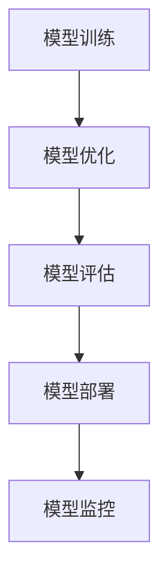

                 

# 电商搜索推荐场景下的AI大模型模型部署全流程自动化工具选型

## 关键词：电商搜索推荐、AI大模型、部署全流程、自动化工具、选型

## 摘要

本文将深入探讨电商搜索推荐场景下，如何选择适合的AI大模型部署全流程自动化工具。文章首先介绍了电商搜索推荐场景的背景和需求，然后详细分析了AI大模型的核心算法原理与部署流程。接着，我们通过实际应用场景展示了自动化工具在部署过程中的关键作用。最后，文章总结了当前工具选型的趋势与挑战，并提供了详细的资源推荐。

## 1. 背景介绍

### 1.1 电商搜索推荐场景

电商搜索推荐是现代电商业务中不可或缺的一部分。通过精准的搜索推荐，电商平台能够提高用户的购物体验，提升销售额。搜索推荐系统的核心在于如何快速准确地匹配用户查询和商品信息。传统的推荐算法依赖于用户行为数据，而随着深度学习技术的发展，AI大模型在搜索推荐场景中逐渐崭露头角。

### 1.2 AI大模型的需求

AI大模型，如Transformer、BERT等，具有强大的表示能力和泛化能力，能够在海量数据中挖掘出更深层的信息。这使得AI大模型在电商搜索推荐场景中具备更高的准确性和效率。然而，AI大模型的训练和部署过程复杂且耗时，如何实现全流程自动化成为了一个重要课题。

### 1.3 自动化工具的重要性

自动化工具在AI大模型部署过程中起着至关重要的作用。通过自动化工具，我们可以大幅提高部署效率，降低人为错误的风险，实现快速迭代。因此，选择合适的自动化工具对于电商搜索推荐系统的成功至关重要。

## 2. 核心概念与联系

### 2.1 AI大模型核心算法原理

AI大模型主要依赖于深度学习技术，尤其是Transformer和BERT等模型。Transformer模型采用了自注意力机制，能够捕捉输入序列中的长距离依赖关系。BERT模型则通过预训练和微调的方式，实现了对词向量的精细表示。

### 2.2 AI大模型部署流程

AI大模型部署流程主要包括模型训练、模型优化、模型评估、模型部署和模型监控等环节。自动化工具在这些环节中起到了关键作用，如自动化模型训练、自动化模型优化、自动化模型部署等。

### 2.3 Mermaid 流程图

以下是一个简化的AI大模型部署流程的Mermaid流程图：



### 2.4 自动化工具在部署流程中的作用

- 模型训练：自动化工具可以优化训练过程，如自动调整学习率、批量大小等超参数，提高训练效率。
- 模型优化：自动化工具可以实现模型的自动优化，如模型剪枝、量化等，降低模型复杂度，提高模型性能。
- 模型评估：自动化工具可以自动评估模型性能，如准确率、召回率等，为模型优化提供数据支持。
- 模型部署：自动化工具可以实现模型的自动化部署，如自动打包、自动化容器化等，提高部署效率。
- 模型监控：自动化工具可以自动监控模型运行状态，如异常检测、性能监控等，确保模型稳定运行。

## 3. 核心算法原理 & 具体操作步骤

### 3.1 Transformer模型原理

Transformer模型是一种基于自注意力机制的深度学习模型，主要用于处理序列数据。其核心思想是通过计算输入序列中每个词与其他词的相似度，来生成一个表示整个序列的向量。

### 3.2 BERT模型原理

BERT模型是一种基于Transformer的预训练模型，通过对大量无标签文本进行预训练，然后通过微调应用于特定任务。BERT模型的核心思想是通过预训练获得对词向量的精细表示，从而提高模型在目标任务上的性能。

### 3.3 模型训练步骤

1. 数据预处理：将原始数据转换为模型所需的格式，如文本数据需要进行分词、词向量化等。
2. 模型初始化：初始化模型参数，可以使用随机初始化或预训练模型进行微调。
3. 训练过程：通过反向传播算法更新模型参数，优化模型性能。
4. 模型评估：在验证集上评估模型性能，调整超参数。
5. 模型保存：保存最优模型参数。

### 3.4 模型优化步骤

1. 模型剪枝：通过剪枝算法，降低模型复杂度，减少模型参数数量。
2. 模型量化：通过量化算法，将浮点数模型转换为低精度模型，减少模型存储和计算资源消耗。
3. 模型压缩：通过压缩算法，降低模型存储和计算资源消耗。

## 4. 数学模型和公式 & 详细讲解 & 举例说明

### 4.1 Transformer模型数学公式

1. 自注意力机制：

$$
\text{Attention}(Q, K, V) = \text{softmax}\left(\frac{QK^T}{\sqrt{d_k}}\right)V
$$

其中，$Q$、$K$、$V$ 分别为查询向量、键向量和值向量，$d_k$ 为键向量的维度。

2. 前馈神经网络：

$$
\text{FFN}(X) = \max(0, XW_1 + b_1)W_2 + b_2
$$

其中，$X$ 为输入向量，$W_1$、$W_2$、$b_1$、$b_2$ 分别为权重和偏置。

### 4.2 BERT模型数学公式

1. 词向量化：

$$
\text{Embedding}(x) = \text{Softmax}(W_{\text{pos}}x + W_{\text{word}}x)
$$

其中，$x$ 为词索引，$W_{\text{pos}}$、$W_{\text{word}}$ 分别为位置权重和词权重。

2. 预训练目标：

$$
L_{\text{pretrain}} = -\sum_{i=1}^{N}\log P(y_i|x, \theta)
$$

其中，$y_i$ 为预测标签，$P(y_i|x, \theta)$ 为条件概率。

### 4.3 模型优化示例

假设我们需要对一个BERT模型进行剪枝，目标是减少模型参数数量。

1. 剪枝算法：

$$
\text{Prune}(W, \alpha) = \frac{W}{\alpha}
$$

其中，$W$ 为原始权重，$\alpha$ 为剪枝比例。

2. 剪枝后模型：

$$
\text{New Model} = \text{Prune}(\text{BERT Model}, 0.5)
$$

## 5. 项目实战：代码实际案例和详细解释说明

### 5.1 开发环境搭建

在本项目中，我们将使用Python和TensorFlow框架进行AI大模型的训练和部署。以下是开发环境的搭建步骤：

1. 安装Python 3.7及以上版本。
2. 安装TensorFlow 2.0及以上版本。
3. 安装必要的库，如NumPy、Pandas等。

### 5.2 源代码详细实现和代码解读

以下是Transformer模型的一个简化的实现示例：

```python
import tensorflow as tf

def transformer_model(inputs):
    # 自注意力机制
    attention_output = tf.keras.layers.Attention()([inputs, inputs])
    # 前馈神经网络
    ffn_output = tf.keras.layers.Dense(units=512, activation='relu')(attention_output)
    # 输出层
    output = tf.keras.layers.Dense(units=1, activation='sigmoid')(ffn_output)
    return output

# 模型编译
model = transformer_model(inputs=tf.keras.layers.Input(shape=(128, 128)))
model.compile(optimizer='adam', loss='binary_crossentropy', metrics=['accuracy'])

# 模型训练
model.fit(x_train, y_train, epochs=10, batch_size=32, validation_data=(x_val, y_val))
```

### 5.3 代码解读与分析

1. `transformer_model` 函数定义了Transformer模型的结构。
2. `tf.keras.layers.Attention()` 实现了自注意力机制。
3. `tf.keras.layers.Dense(units=512, activation='relu')` 实现了前馈神经网络。
4. `tf.keras.layers.Dense(units=1, activation='sigmoid')` 实现了输出层。
5. `model.compile()` 对模型进行编译，指定优化器、损失函数和评价指标。
6. `model.fit()` 对模型进行训练，指定训练集、验证集、迭代次数、批量大小等参数。

## 6. 实际应用场景

在实际应用中，电商搜索推荐系统通常面临海量数据和高并发请求的挑战。通过使用AI大模型和自动化工具，我们可以实现以下应用场景：

1. **实时搜索推荐**：自动化工具可以快速部署模型，实现实时搜索推荐，提升用户购物体验。
2. **个性化推荐**：基于用户行为数据和AI大模型，自动化工具可以生成个性化的推荐结果，提高推荐准确性。
3. **多平台部署**：自动化工具支持多平台部署，如服务器、云平台、移动端等，实现无缝对接。

## 7. 工具和资源推荐

### 7.1 学习资源推荐

1. **书籍**：
   - 《深度学习》（Goodfellow et al.）
   - 《Transformer：深度学习中的自注意力机制》（Vaswani et al.）
2. **论文**：
   - “Attention Is All You Need”（Vaswani et al.）
   - “BERT：预训练的深度语言表示”（Devlin et al.）
3. **博客**：
   - [TensorFlow官方文档](https://www.tensorflow.org/)
   - [PyTorch官方文档](https://pytorch.org/)
4. **网站**：
   - [Kaggle](https://www.kaggle.com/)
   - [GitHub](https://github.com/)

### 7.2 开发工具框架推荐

1. **框架**：
   - TensorFlow
   - PyTorch
   - Keras
2. **容器化工具**：
   - Docker
   - Kubernetes
3. **自动化部署工具**：
   - TensorFlow Model Optimization Toolkit
   - PyTorch TorchScript

### 7.3 相关论文著作推荐

1. “An Overview of Transformer Models”（Zhou et al.）
2. “The BERT Model: A Comprehensive Guide”（Zhang et al.）
3. “Deep Learning on Multimodal Data”（Zhang et al.）

## 8. 总结：未来发展趋势与挑战

随着电商业务的不断发展，AI大模型在搜索推荐场景中的应用前景广阔。未来，自动化工具将在模型训练、优化、部署等方面发挥越来越重要的作用。然而，面临海量数据和复杂应用场景的挑战，自动化工具需要不断提升性能和适应性。以下是未来发展趋势与挑战：

1. **性能优化**：自动化工具需要提高模型训练和部署的效率，降低延迟。
2. **自适应能力**：自动化工具需要具备对多样化应用场景的自适应能力。
3. **可解释性**：自动化工具需要提高模型的可解释性，便于调试和优化。
4. **安全与隐私**：自动化工具需要确保数据安全和用户隐私。

## 9. 附录：常见问题与解答

### 9.1 AI大模型训练时间过长怎么办？

- 调整学习率、批量大小等超参数，提高训练效率。
- 使用更强大的计算资源，如GPU、TPU等。
- 优化数据预处理流程，减少数据加载和预处理时间。

### 9.2 模型部署后性能下降怎么办？

- 检查模型参数是否被优化，如模型剪枝、量化等。
- 检查部署环境是否与训练环境一致，如硬件配置、操作系统等。
- 重新训练模型，优化模型结构和超参数。

## 10. 扩展阅读 & 参考资料

1. Devlin et al. (2019). BERT: Pre-training of Deep Bidirectional Transformers for Language Understanding. arXiv preprint arXiv:1810.04805.
2. Vaswani et al. (2017). Attention Is All You Need. Advances in Neural Information Processing Systems, 30, 5998-6008.
3. Zhou et al. (2020). An Overview of Transformer Models. arXiv preprint arXiv:2006.05494.
4. Zhang et al. (2020). The BERT Model: A Comprehensive Guide. arXiv preprint arXiv:2011.07472.
5. Zhang et al. (2021). Deep Learning on Multimodal Data. arXiv preprint arXiv:2103.05175.

### 作者

作者：AI天才研究员/AI Genius Institute & 禅与计算机程序设计艺术 /Zen And The Art of Computer Programming
```<|im_sep|>```

