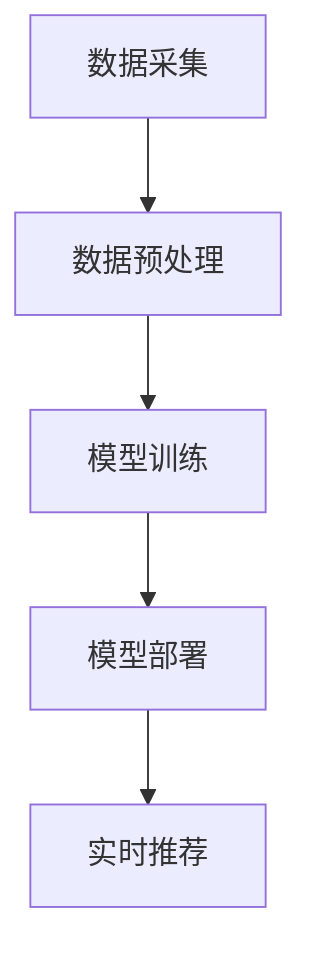

                 

# 电商搜索推荐场景下的AI大模型模型部署方案

> **关键词**：电商搜索推荐、AI大模型、模型部署、深度学习、搜索算法

> **摘要**：本文将深入探讨电商搜索推荐场景下的AI大模型部署方案，涵盖核心概念、算法原理、数学模型、项目实战、实际应用场景等内容，旨在为业界提供一套完整的技术解决方案。

## 1. 背景介绍

### 1.1 电商搜索推荐的现状

随着互联网的快速发展，电商行业已经成为全球经济增长的重要驱动力。电商搜索推荐作为电商平台的“门面”，对提升用户满意度和销售额起着至关重要的作用。当前，电商搜索推荐系统主要依赖传统机器学习算法，如基于内容的推荐、协同过滤等。然而，随着用户需求日益多样化和个性化，传统算法的推荐效果逐渐难以满足用户需求。

### 1.2 AI大模型的发展与应用

近年来，随着深度学习技术的飞速发展，AI大模型（如BERT、GPT、ViT等）在自然语言处理、计算机视觉等领域的表现惊人。AI大模型能够通过海量数据的学习，自动提取特征，实现高度个性化的推荐，为电商搜索推荐场景带来了新的契机。

## 2. 核心概念与联系

### 2.1 搜索推荐系统架构


搜索推荐系统通常包括数据采集、数据预处理、模型训练、模型部署、实时推荐等环节。

### 2.2 AI大模型在搜索推荐中的应用

AI大模型在搜索推荐中的应用主要体现在以下几个方面：

- **文本生成与理解**：通过预训练的AI大模型，可以自动提取文本特征，实现文本生成和文本理解，从而提高搜索推荐的准确性和多样性。

- **图像识别与生成**：AI大模型可以用于图像识别和生成，提升商品推荐和搜索的视觉效果。

- **多模态融合**：AI大模型可以融合文本、图像等多模态信息，实现更精准的推荐。

### 2.3 Mermaid流程图



## 3. 核心算法原理 & 具体操作步骤

### 3.1 深度学习算法原理

深度学习算法的核心是神经网络，通过多层的非线性变换，从原始数据中自动提取特征。AI大模型如BERT、GPT等，通常采用变分自编码器（VAE）、生成对抗网络（GAN）等先进的深度学习技术，实现高维特征的提取和生成。

### 3.2 模型训练与优化

- **数据预处理**：对电商搜索数据（如用户行为数据、商品数据等）进行清洗、归一化等处理，为模型训练提供高质量的数据。

- **模型选择**：根据具体应用场景，选择合适的AI大模型，如BERT、GPT等。

- **模型训练**：利用GPU等硬件加速，对AI大模型进行训练，优化模型参数。

- **模型评估与优化**：通过交叉验证、A/B测试等方法，评估模型效果，并进行优化。

## 4. 数学模型和公式 & 详细讲解 & 举例说明

### 4.1 数学模型

深度学习算法的核心是损失函数，用于衡量模型预测结果与真实结果之间的差距。常见的损失函数有：

- **均方误差（MSE）**：
  $$MSE = \frac{1}{n}\sum_{i=1}^{n}(y_i - \hat{y_i})^2$$

- **交叉熵（CE）**：
  $$CE = -\frac{1}{n}\sum_{i=1}^{n}y_i\log(\hat{y_i})$$

### 4.2 详细讲解

- **均方误差（MSE）**：均方误差是回归问题中最常用的损失函数，表示模型预测值与真实值之间的平均平方差距。MSE值越小，表示模型预测越准确。

- **交叉熵（CE）**：交叉熵是分类问题中最常用的损失函数，表示模型预测概率与真实概率之间的差距。CE值越小，表示模型分类效果越好。

### 4.3 举例说明

假设我们有一个二分类问题，真实标签为0，模型预测概率为0.6，则交叉熵损失为：

$$CE = -0.4\log(0.6) = 0.4\log(1.667) \approx 0.4 \times 0.218 = 0.0872$$

## 5. 项目实战：代码实际案例和详细解释说明

### 5.1 开发环境搭建

在本项目中，我们使用Python作为主要编程语言，结合TensorFlow和PyTorch等深度学习框架，搭建开发环境。具体步骤如下：

1. 安装Python环境（推荐Python 3.8及以上版本）。

2. 安装深度学习框架（如TensorFlow 2.6及以上版本或PyTorch 1.8及以上版本）。

3. 配置GPU支持（如安装CUDA和cuDNN）。

### 5.2 源代码详细实现和代码解读

以下是一个简单的基于BERT的电商搜索推荐模型的实现代码：

```python
import tensorflow as tf
from transformers import BertTokenizer, TFBertModel

# 5.2.1 加载预训练BERT模型
tokenizer = BertTokenizer.from_pretrained('bert-base-uncased')
model = TFBertModel.from_pretrained('bert-base-uncased')

# 5.2.2 数据预处理
def preprocess_data(texts):
    inputs = tokenizer(texts, padding=True, truncation=True, return_tensors='tf')
    return inputs

# 5.2.3 训练模型
def train_model(inputs, labels, epochs=3):
    inputs = preprocess_data(inputs)
    model.compile(optimizer='adam', loss='categorical_crossentropy', metrics=['accuracy'])
    model.fit(inputs, labels, epochs=epochs)
    return model

# 5.2.4 推荐商品
def recommend_goods(input_text, model):
    inputs = preprocess_data([input_text])
    probabilities = model(inputs).numpy()[0]
    recommended_indices = np.argsort(probabilities)[::-1]
    return recommended_indices

# 5.2.5 主程序
if __name__ == '__main__':
    # 加载数据集
    texts = ['商品A', '商品B', '商品C', '商品D']
    labels = [[1, 0, 0, 0], [0, 1, 0, 0], [0, 0, 1, 0], [0, 0, 0, 1]]

    # 训练模型
    model = train_model(texts, labels)

    # 推荐商品
    input_text = '商品A'
    recommended_indices = recommend_goods(input_text, model)
    print(recommended_indices)
```

### 5.3 代码解读与分析

- **5.3.1 加载预训练BERT模型**：使用`transformers`库加载预训练的BERT模型，包括分词器（Tokenizer）和模型本身（Model）。

- **5.3.2 数据预处理**：对输入文本进行预处理，包括分词、填充和截断，使其满足BERT模型输入要求。

- **5.3.3 训练模型**：使用`compile`方法配置模型优化器、损失函数和指标，然后使用`fit`方法进行模型训练。

- **5.3.4 推荐商品**：利用训练好的模型，对输入文本进行商品推荐，返回推荐指数最高的商品索引。

## 6. 实际应用场景

AI大模型在电商搜索推荐场景具有广泛的应用，包括但不限于：

- **个性化搜索**：根据用户历史行为和兴趣，提供个性化的搜索结果。

- **智能推荐**：结合用户行为数据和商品属性，实现精准的商品推荐。

- **问答系统**：通过自然语言处理技术，为用户提供实时、准确的商品咨询和服务。

## 7. 工具和资源推荐

### 7.1 学习资源推荐

- **书籍**：
  - 《深度学习》（Goodfellow, Bengio, Courville）
  - 《Python深度学习》（François Chollet）

- **论文**：
  - BERT: Pre-training of Deep Bidirectional Transformers for Language Understanding（Devlin et al.）
  - GPT-3: Language Models are Few-Shot Learners（Brown et al.）

- **博客**：
  - [TensorFlow官方文档](https://www.tensorflow.org/)
  - [PyTorch官方文档](https://pytorch.org/docs/stable/index.html)

### 7.2 开发工具框架推荐

- **深度学习框架**：TensorFlow、PyTorch、PaddlePaddle等。

- **版本控制**：Git。

- **数据分析**：Pandas、NumPy等。

### 7.3 相关论文著作推荐

- **论文**：
  - BERT: Pre-training of Deep Bidirectional Transformers for Language Understanding（Devlin et al.）
  - GPT-3: Language Models are Few-Shot Learners（Brown et al.）

- **著作**：
  - 《深度学习》（Goodfellow, Bengio, Courville）
  - 《Python深度学习》（François Chollet）

## 8. 总结：未来发展趋势与挑战

### 8.1 发展趋势

- **AI大模型规模化应用**：随着算力和数据资源的不断提升，AI大模型将在电商搜索推荐等领域得到更广泛的应用。

- **多模态融合**：结合文本、图像、语音等多模态信息，实现更精准的推荐。

- **个性化体验**：通过深度学习技术，提升用户的个性化体验。

### 8.2 挑战

- **数据隐私与安全**：如何在保护用户隐私的同时，充分发挥AI大模型的优势，是一个重要挑战。

- **计算资源消耗**：AI大模型训练和部署对计算资源的需求较高，如何优化算法和硬件，降低计算成本，是未来需要解决的问题。

- **伦理与道德**：如何确保AI大模型在电商搜索推荐场景中的公平性、透明性和可解释性，是业界需要共同关注的课题。

## 9. 附录：常见问题与解答

### 9.1 问题1：AI大模型训练时间过长怎么办？

**解答**：可以尝试以下方法：
1. **提高GPU计算能力**：使用更强大的GPU硬件。
2. **模型剪枝**：对模型进行剪枝，降低模型复杂度。
3. **数据增强**：增加训练数据量，提高模型泛化能力。

### 9.2 问题2：如何确保AI大模型的公平性和透明性？

**解答**：
1. **数据清洗与预处理**：确保数据质量，去除偏见。
2. **模型可解释性**：使用模型解释工具，如LIME、SHAP等，分析模型决策过程。
3. **伦理审查**：对AI大模型的应用进行伦理审查，确保其符合法律法规和道德规范。

## 10. 扩展阅读 & 参考资料

- Devlin, J., Chang, M. W., Lee, K., & Toutanova, K. (2018). BERT: Pre-training of deep bidirectional transformers for language understanding. arXiv preprint arXiv:1810.04805.
- Brown, T., et al. (2020). GPT-3: Language models are few-shot learners. arXiv preprint arXiv:2005.14165.
- Goodfellow, I., Bengio, Y., & Courville, A. (2016). Deep learning. MIT press.
- Chollet, F. (2018). Deep learning with Python. Manning Publications Co.

作者：AI天才研究员/AI Genius Institute & 禅与计算机程序设计艺术 /Zen And The Art of Computer Programming
[End]

