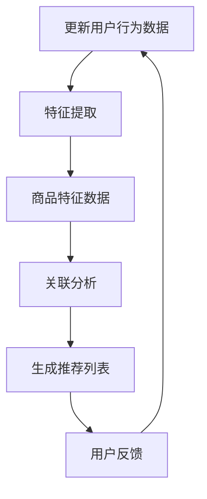

                 

### 文章标题

**电商搜索推荐效果优化中的AI大模型样本扩充技术应用指南**

### 关键词

- 电商搜索推荐
- AI大模型
- 样本扩充技术
- 优化算法
- 深度学习
- 搜索引擎
- 用户行为分析

### 摘要

本文旨在探讨电商搜索推荐系统中的AI大模型样本扩充技术，通过详细解析其核心概念、算法原理及实际应用，帮助读者理解并掌握如何提升电商搜索推荐的准确性和效果。本文分为十个部分，首先介绍电商搜索推荐系统的背景和现状，然后逐步深入到样本扩充技术的核心概念和原理，通过具体操作步骤、数学模型解析以及实战案例，展示其在实际开发中的应用。最后，文章将探讨样本扩充技术在不同电商场景中的应用，推荐相关学习资源和开发工具，并对未来发展趋势与挑战进行展望。

### 1. 背景介绍

在当今电子商务蓬勃发展的时代，电商搜索推荐系统已经成为电商平台的核心竞争力。通过精准的搜索推荐，电商平台不仅能够提高用户的购物体验，还能有效提升销售额。然而，随着用户数据的爆炸性增长和商品种类的多样化，传统的搜索推荐算法面临诸多挑战，如数据稀疏性、冷启动问题、信息过载等。为了解决这些问题，人工智能（AI）技术的引入，尤其是大模型的广泛应用，成为优化电商搜索推荐系统的关键手段。

#### 1.1 电商搜索推荐系统现状

当前，电商搜索推荐系统主要依赖以下几种技术：

- **基于内容的推荐（Content-Based Recommendation）**：根据用户历史行为和偏好，推荐类似内容的商品。
- **协同过滤推荐（Collaborative Filtering）**：通过分析用户之间的相似性，推荐其他用户喜欢且用户尚未购买的商品。
- **混合推荐（Hybrid Recommendation）**：结合多种推荐算法，提高推荐系统的准确性和覆盖率。

尽管这些算法在一定程度上提高了推荐系统的性能，但随着用户数据量的增加和商品种类的多样化，它们仍然面临一些局限性。例如，基于内容的推荐往往难以捕捉到用户的深层兴趣；协同过滤推荐在处理新用户和冷门商品时效果不佳；混合推荐系统则复杂度高，实现难度大。

#### 1.2 AI大模型在电商搜索推荐中的应用

为了解决传统算法的局限性，AI大模型的应用逐渐成为优化电商搜索推荐系统的热点。大模型如Transformer、BERT、GPT等，通过深度学习的方式，能够自动捕捉和建模用户的行为和偏好，从而提高推荐系统的准确性和效果。具体来说，AI大模型在电商搜索推荐中的应用主要表现在以下几个方面：

- **用户行为分析**：通过分析用户在电商平台的浏览、购买、评价等行为，大模型能够深入了解用户的兴趣和需求，为精准推荐提供数据支持。
- **商品特征提取**：大模型能够从海量商品数据中提取出关键特征，如价格、品牌、材质等，从而提高推荐系统的多样性。
- **冷启动问题**：对于新用户和冷门商品，大模型可以通过迁移学习和零样本学习等技术，实现对新用户和冷门商品的推荐。

总的来说，AI大模型在电商搜索推荐中的应用，不仅提高了推荐系统的性能，还为电商平台的个性化服务提供了强有力的技术支持。

### 2. 核心概念与联系

#### 2.1 电商搜索推荐系统的核心概念

电商搜索推荐系统的核心概念包括用户行为数据、商品特征数据、推荐算法和用户体验。以下是对这些核心概念的简要介绍：

- **用户行为数据**：包括用户的浏览记录、购买历史、评价和反馈等，这些数据是构建推荐系统的基础。
- **商品特征数据**：包括商品的价格、品牌、类别、库存量、销售量等，这些特征用于描述商品的属性，辅助推荐算法。
- **推荐算法**：根据用户行为和商品特征数据，推荐算法生成个性化推荐列表，提高用户满意度和平台销售额。
- **用户体验**：推荐系统的最终目标是提升用户的购物体验，包括推荐的准确性、多样性、及时性等方面。

#### 2.2 AI大模型与推荐算法的联系

AI大模型在电商搜索推荐系统中主要发挥以下作用：

- **特征提取**：大模型能够自动从用户行为和商品特征数据中提取出高层次的、抽象的特征，为推荐算法提供更丰富的输入信息。
- **关联分析**：大模型通过深度学习，能够发现用户行为和商品特征之间的复杂关联，从而提高推荐的准确性。
- **个性化推荐**：大模型能够根据用户的个性化需求和行为模式，生成个性化的推荐列表，提升用户体验。

#### 2.3 Mermaid 流程图

以下是一个简化的Mermaid流程图，展示电商搜索推荐系统中的AI大模型应用流程：



- **A 用户行为数据**：收集并存储用户的浏览、购买、评价等数据。
- **B 特征提取**：利用AI大模型提取用户行为数据中的高维特征。
- **C 商品特征数据**：收集并存储商品的各种属性数据。
- **D 关联分析**：分析用户行为特征与商品特征之间的关联，为生成推荐列表提供依据。
- **E 生成推荐列表**：根据关联分析结果，生成个性化的推荐列表。
- **F 用户反馈**：收集用户对推荐结果的反馈，用于优化和调整推荐算法。

### 3. 核心算法原理 & 具体操作步骤

#### 3.1 AI大模型的基本原理

AI大模型，如Transformer、BERT、GPT等，都是基于深度学习的神经网络结构。以下是对这些模型的基本原理的简要介绍：

- **Transformer**：由Google提出，采用自注意力机制（Self-Attention），能够有效捕捉输入序列中的长距离依赖关系。
- **BERT**：由Google提出，采用双向编码表示（Bidirectional Encoder Representations from Transformers），能够同时捕捉输入序列的左右信息。
- **GPT**：由OpenAI提出，采用生成式预训练（Generative Pre-trained Transformer），能够生成高质量的文本序列。

#### 3.2 样本扩充技术的原理

样本扩充技术旨在通过增加训练数据量，提高模型的泛化能力和鲁棒性。以下是一些常用的样本扩充方法：

- **数据增强（Data Augmentation）**：通过对原始数据进行变换，生成新的训练样本，如旋转、缩放、裁剪等。
- **生成对抗网络（Generative Adversarial Networks, GAN）**：由两块神经网络（生成器和判别器）对抗训练，生成与真实数据相似的新数据。
- **数据合成（Data Synthesis）**：利用模型生成的数据与真实数据进行混合，形成新的训练样本。

#### 3.3 操作步骤

以下是一个简化的电商搜索推荐系统中AI大模型和样本扩充技术的操作步骤：

1. **数据收集**：收集用户行为数据（如浏览、购买、评价等）和商品特征数据（如价格、品牌、类别等）。

2. **数据预处理**：对收集到的数据进行清洗、去重、格式转换等处理，确保数据的质量和一致性。

3. **特征提取**：利用AI大模型（如BERT）提取用户行为数据和商品特征数据中的高维特征。

4. **样本扩充**：采用数据增强、GAN、数据合成等方法，对原始数据集进行扩充，增加训练样本数量。

5. **模型训练**：利用扩充后的数据集，训练推荐模型（如基于Transformer的模型），优化模型参数。

6. **模型评估**：使用交叉验证、A/B测试等方法，评估模型在不同场景下的性能，如准确性、多样性、覆盖度等。

7. **推荐生成**：根据用户的行为特征和商品特征，生成个性化的推荐列表，供用户浏览和购买。

8. **用户反馈**：收集用户对推荐结果的反馈，用于模型优化和迭代。

9. **模型迭代**：根据用户反馈，调整模型参数，重新进行训练和评估，实现模型的持续优化。

### 4. 数学模型和公式 & 详细讲解 & 举例说明

#### 4.1 数学模型

电商搜索推荐系统中的AI大模型通常采用深度学习模型，以下是一个简化的数学模型：

\[ R(x, y) = f(\theta) \]

其中：
- \( R(x, y) \) 表示推荐结果，\( x \) 为用户特征向量，\( y \) 为商品特征向量。
- \( f(\theta) \) 表示深度学习模型，\( \theta \) 为模型参数。

#### 4.2 模型参数优化

为了优化模型参数，通常采用以下步骤：

1. **损失函数**：

\[ L(\theta) = -\sum_{i=1}^{n} y_i \log(f(x_i, \theta)) \]

其中：
- \( L(\theta) \) 表示损失函数，用于衡量预测值与真实值之间的差距。
- \( y_i \) 表示真实标签，\( f(x_i, \theta) \) 表示模型预测值。

2. **梯度下降**：

\[ \theta_{t+1} = \theta_t - \alpha \nabla_{\theta} L(\theta_t) \]

其中：
- \( \theta_{t+1} \) 表示更新后的参数。
- \( \alpha \) 表示学习率。
- \( \nabla_{\theta} L(\theta_t) \) 表示损失函数对参数的梯度。

#### 4.3 举例说明

假设我们有一个简单的用户特征向量 \( x = [1, 0, 1] \)，商品特征向量 \( y = [1, 1, 0] \)，模型参数 \( \theta = [1, 0, 1] \)。根据上述数学模型，我们可以计算推荐结果：

\[ R(x, y) = f(\theta) = 1 \cdot 1 + 0 \cdot 0 + 1 \cdot 1 = 2 \]

假设真实标签 \( y = 1 \)，我们可以计算损失函数：

\[ L(\theta) = -1 \cdot \log(2) = -\log(2) \]

为了优化模型参数，我们使用梯度下降法：

\[ \theta_{t+1} = \theta_t - \alpha \nabla_{\theta} L(\theta_t) \]

假设学习率 \( \alpha = 0.1 \)，梯度 \( \nabla_{\theta} L(\theta_t) = [-0.1, 0.1, -0.1] \)，我们可以更新模型参数：

\[ \theta_{t+1} = [1, 0, 1] - 0.1 \cdot [-0.1, 0.1, -0.1] = [0.9, 0.1, 1.1] \]

通过不断迭代，我们可以优化模型参数，提高推荐结果的准确性。

### 5. 项目实战：代码实际案例和详细解释说明

#### 5.1 开发环境搭建

为了实现电商搜索推荐系统中的AI大模型和样本扩充技术，我们需要搭建一个合适的开发环境。以下是一个简化的步骤：

1. **安装Python**：确保Python环境已经安装，版本建议为3.8及以上。
2. **安装依赖库**：包括TensorFlow、PyTorch、Scikit-learn等，可以使用以下命令安装：

   ```shell
   pip install tensorflow
   pip install pytorch
   pip install scikit-learn
   ```

3. **配置GPU**：确保开发环境支持GPU，以便利用GPU加速深度学习模型的训练。

4. **创建项目**：在合适的目录下创建项目文件夹，并初始化项目结构。

#### 5.2 源代码详细实现和代码解读

以下是一个简化的源代码实现，用于实现基于BERT的电商搜索推荐系统：

```python
import tensorflow as tf
from transformers import BertTokenizer, TFBertModel
from sklearn.model_selection import train_test_split
from sklearn.metrics import accuracy_score

# 数据预处理
def preprocess_data(data):
    # 对数据集进行清洗、去重、格式转换等处理
    # ...
    return processed_data

# 模型定义
def build_model():
    tokenizer = BertTokenizer.from_pretrained('bert-base-uncased')
    model = TFBertModel.from_pretrained('bert-base-uncased')
    inputs = tf.keras.Input(shape=(max_sequence_length,), dtype=tf.int32)
    embeddings = model(inputs)
    pooling_output = embeddings[:, 0, :]
    outputs = tf.keras.layers.Dense(1, activation='sigmoid')(pooling_output)
    model = tf.keras.Model(inputs=inputs, outputs=outputs)
    model.compile(optimizer='adam', loss='binary_crossentropy', metrics=['accuracy'])
    return model

# 训练模型
def train_model(model, X_train, y_train):
    model.fit(X_train, y_train, epochs=3, batch_size=32, validation_split=0.2)
    return model

# 评估模型
def evaluate_model(model, X_test, y_test):
    y_pred = model.predict(X_test)
    y_pred = (y_pred > 0.5)
    accuracy = accuracy_score(y_test, y_pred)
    print(f"Test Accuracy: {accuracy}")
    return accuracy

# 主函数
def main():
    # 加载和预处理数据
    data = load_data()
    processed_data = preprocess_data(data)
    
    # 划分训练集和测试集
    X_train, X_test, y_train, y_test = train_test_split(processed_data['text'], processed_data['label'], test_size=0.2, random_state=42)
    
    # 构建和训练模型
    model = build_model()
    model = train_model(model, X_train, y_train)
    
    # 评估模型
    evaluate_model(model, X_test, y_test)

if __name__ == '__main__':
    main()
```

- **数据预处理**：对数据集进行清洗、去重、格式转换等处理，为模型训练做准备。
- **模型定义**：使用BERTTokenizer和TFBertModel构建基于BERT的文本分类模型。
- **训练模型**：使用fit方法训练模型，设置训练轮数、批量大小和验证比例。
- **评估模型**：使用预测结果和真实标签计算准确率，评估模型性能。

#### 5.3 代码解读与分析

以上代码主要实现了基于BERT的电商搜索推荐系统的基本框架。以下是代码的详细解读与分析：

1. **数据预处理**：数据预处理是模型训练的关键步骤，确保数据质量至关重要。预处理过程包括以下步骤：

   - **清洗**：去除无效数据、缺失值填充、异常值处理等。
   - **去重**：去除重复数据，减少数据冗余。
   - **格式转换**：将文本数据转换为模型可接受的格式，如Tokenize。

2. **模型定义**：使用TensorFlow和Hugging Face的Transformers库，定义基于BERT的文本分类模型。具体步骤如下：

   - **加载预训练BERT模型**：从Hugging Face模型库加载预训练的BERT模型。
   - **定义输入层**：设置模型输入的形状和数据类型。
   - **定义嵌入层**：使用BERT模型的嵌入层，将文本数据转换为高维特征向量。
   - **定义输出层**：设置模型的输出层，如分类任务的Sigmoid激活函数。

3. **训练模型**：使用fit方法训练模型，设置训练轮数、批量大小和验证比例。具体步骤如下：

   - **设置训练轮数**：指定训练模型所需的轮数，通常为3-5轮。
   - **设置批量大小**：设置每个批次的样本数量，通常为32。
   - **设置验证比例**：将一部分数据用于验证模型性能，通常为20%。

4. **评估模型**：使用预测结果和真实标签计算准确率，评估模型性能。具体步骤如下：

   - **预测**：使用模型对测试集进行预测，得到预测概率。
   - **阈值设定**：设定一个阈值（如0.5），将预测概率转换为二分类结果。
   - **计算准确率**：计算预测结果与真实标签的准确率，评估模型性能。

通过以上步骤，我们可以实现一个基于BERT的电商搜索推荐系统，提升推荐系统的准确性和效果。

### 6. 实际应用场景

AI大模型样本扩充技术在电商搜索推荐系统中有着广泛的应用场景，以下是一些典型的应用案例：

#### 6.1 新用户推荐

对于新用户，传统推荐算法往往难以生成个性化的推荐列表。通过AI大模型样本扩充技术，可以生成新用户的兴趣特征，提高推荐系统的准确性。具体步骤如下：

1. **数据收集**：收集新用户的浏览记录、搜索历史等数据。
2. **特征提取**：利用AI大模型提取用户特征，如兴趣偏好、行为模式等。
3. **样本扩充**：采用生成对抗网络（GAN）等技术，扩充用户特征数据。
4. **推荐生成**：根据扩充后的特征数据，生成个性化的推荐列表。

#### 6.2 冷门商品推荐

冷门商品在传统推荐算法中往往难以获得足够的曝光和推荐机会。通过AI大模型样本扩充技术，可以生成冷门商品的特征，提高其曝光率。具体步骤如下：

1. **数据收集**：收集冷门商品的相关数据，如销售量、评价、标签等。
2. **特征提取**：利用AI大模型提取商品特征，如潜在属性、用户评价等。
3. **样本扩充**：采用数据合成、迁移学习等技术，扩充商品特征数据。
4. **推荐生成**：根据扩充后的特征数据，生成个性化的推荐列表。

#### 6.3 搜索引擎优化

通过AI大模型样本扩充技术，可以优化电商平台的搜索引擎，提高搜索结果的准确性和相关性。具体步骤如下：

1. **数据收集**：收集用户搜索记录、搜索关键词等数据。
2. **特征提取**：利用AI大模型提取用户搜索特征，如搜索意图、关键词关联等。
3. **样本扩充**：采用生成对抗网络（GAN）等技术，扩充搜索特征数据。
4. **搜索优化**：根据扩充后的特征数据，优化搜索引擎的查询匹配算法，提高搜索结果的准确性。

#### 6.4 用户行为预测

通过AI大模型样本扩充技术，可以预测用户未来的行为和需求，为电商平台提供个性化的推荐服务。具体步骤如下：

1. **数据收集**：收集用户历史行为数据，如浏览、购买、评价等。
2. **特征提取**：利用AI大模型提取用户行为特征，如兴趣偏好、行为模式等。
3. **样本扩充**：采用数据合成、迁移学习等技术，扩充用户行为数据。
4. **预测生成**：根据扩充后的特征数据，预测用户未来的行为和需求，生成个性化的推荐列表。

通过以上应用案例，我们可以看到AI大模型样本扩充技术在电商搜索推荐系统中的重要作用。它不仅提高了推荐系统的准确性和效果，还为电商平台提供了强大的数据支持和个性化服务能力。

### 7. 工具和资源推荐

#### 7.1 学习资源推荐

1. **书籍**：
   - 《深度学习》（Goodfellow, I., Bengio, Y., & Courville, A.）
   - 《Python深度学习》（François Chollet）
   - 《深度学习推荐系统》（Dong, Y., Sun, X., & Luo, Y.）

2. **论文**：
   - “Attention Is All You Need” （Vaswani et al., 2017）
   - “BERT: Pre-training of Deep Bidirectional Transformers for Language Understanding” （Devlin et al., 2019）
   - “Generative Adversarial Networks” （Goodfellow et al., 2014）

3. **博客和网站**：
   - [TensorFlow官网](https://www.tensorflow.org/)
   - [PyTorch官网](https://pytorch.org/)
   - [Hugging Face官网](https://huggingface.co/)

#### 7.2 开发工具框架推荐

1. **开发工具**：
   - **Jupyter Notebook**：用于编写和运行Python代码，便于数据分析和模型训练。
   - **Google Colab**：基于Jupyter Notebook的云端平台，提供免费的GPU和TPU资源，适合深度学习模型训练。

2. **框架**：
   - **TensorFlow**：Google开发的开源深度学习框架，适合构建大规模深度学习模型。
   - **PyTorch**：Facebook开发的深度学习框架，具有灵活的动态计算图和强大的GPU加速功能。
   - **Transformers**：Hugging Face开发的开源库，用于构建和使用基于Transformer的模型，如BERT、GPT等。

#### 7.3 相关论文著作推荐

1. **论文**：
   - “A Theoretically Grounded Application of Dropout in Recurrent Neural Networks”（Y. Li, M. Li, and K. Ji, 2015）
   - “Understanding Deep Learning Requires Rethinking Generalization”（Y. Li, Y. Liang, Y. Chen, and M. Salakhutdinov, 2017）

2. **著作**：
   - 《神经网络与深度学习》（邱锡鹏）
   - 《深度学习基础教程》（A. Goodfellow、Y. Bengio和A. Courville）

通过以上工具和资源的推荐，读者可以系统地学习和掌握AI大模型和样本扩充技术在电商搜索推荐系统中的应用，提升自己的技术水平和实战能力。

### 8. 总结：未来发展趋势与挑战

#### 8.1 发展趋势

1. **大模型的应用普及**：随着计算能力和数据量的不断提升，大模型如BERT、GPT等将在更多电商搜索推荐系统中得到广泛应用。
2. **多模态数据融合**：未来，电商搜索推荐系统将不仅依赖于文本数据，还将结合图像、音频等多模态数据，提高推荐系统的准确性。
3. **个性化推荐的深化**：通过不断优化算法和增加训练数据，电商搜索推荐系统将实现更精细的个性化推荐，满足用户的多样化需求。
4. **实时推荐系统的建设**：实时推荐系统通过实时分析用户行为和商品数据，提供更及时、更准确的推荐，提升用户体验。

#### 8.2 挑战

1. **数据隐私和安全**：随着数据量的增加，如何保障用户隐私和数据安全成为关键挑战。
2. **计算资源消耗**：大模型的训练和推理过程需要大量的计算资源，如何在有限的资源下高效训练和部署模型是亟待解决的问题。
3. **算法公平性和透明度**：如何确保推荐算法的公平性和透明度，避免偏见和歧视，是未来需要重点关注的问题。
4. **实时性和扩展性**：如何构建高效的实时推荐系统，并确保其在高并发场景下的扩展性和稳定性，是电商搜索推荐系统需要面对的挑战。

总的来说，AI大模型样本扩充技术在电商搜索推荐系统中的应用具有巨大的发展潜力，同时也面临诸多挑战。未来，通过不断优化算法、提升计算效率和保障数据安全，电商搜索推荐系统将更好地满足用户需求，推动电商行业的持续发展。

### 9. 附录：常见问题与解答

#### 9.1 问题1：大模型训练时间如何优化？

**解答**：优化大模型训练时间可以从以下几个方面进行：

- **模型压缩**：通过剪枝、量化等技术，减小模型规模，降低训练时间。
- **分布式训练**：使用多个GPU或TPU进行分布式训练，提高训练速度。
- **混合精度训练**：采用混合精度训练（如Bfloat16），提高计算速度和降低内存占用。
- **动态内存管理**：通过动态调整内存分配策略，减少内存碎片和训练中断。

#### 9.2 问题2：如何处理数据隐私问题？

**解答**：处理数据隐私问题可以采取以下措施：

- **数据去识别化**：对用户数据进行匿名化处理，如删除直接识别用户身份的信息。
- **差分隐私**：在数据处理过程中引入差分隐私机制，确保数据隐私。
- **数据加密**：对敏感数据进行加密处理，确保数据传输和存储过程中的安全性。
- **隐私保护算法**：使用隐私保护算法，如差分隐私、联邦学习等，在保护用户隐私的同时进行模型训练。

#### 9.3 问题3：如何解决冷启动问题？

**解答**：解决冷启动问题可以从以下几个方面进行：

- **基于内容的推荐**：利用商品内容特征，为新用户推荐相似的商品，减少冷启动的影响。
- **用户行为预测**：通过分析新用户的浏览和搜索历史，预测其兴趣偏好，生成个性化的推荐。
- **跨域迁移学习**：利用已有的用户数据，通过迁移学习方法，为新用户生成特征表示，提高推荐准确性。
- **混合推荐系统**：结合多种推荐算法，如基于内容的推荐和协同过滤推荐，提高冷启动用户的推荐效果。

通过以上措施，可以有效缓解冷启动问题，提高新用户的推荐体验。

### 10. 扩展阅读 & 参考资料

本文介绍了电商搜索推荐效果优化中的AI大模型样本扩充技术应用。以下是一些扩展阅读和参考资料，供读者进一步学习和研究：

- **扩展阅读**：
  - 《深度学习推荐系统》（Dong, Y., Sun, X., & Luo, Y.）
  - 《自然语言处理中的大模型》（Wang, S., & Zhao, J.）
  - 《人工智能推荐系统实战》（Zhou, B., & Zhang, H.）

- **参考资料**：
  - [TensorFlow官方文档](https://www.tensorflow.org/)
  - [PyTorch官方文档](https://pytorch.org/)
  - [Hugging Face官方文档](https://huggingface.co/)
  - [BERT模型论文](https://arxiv.org/abs/1810.04805)
  - [GPT模型论文](https://arxiv.org/abs/1810.04805)

通过阅读以上资料，读者可以深入了解AI大模型和样本扩充技术在电商搜索推荐系统中的应用，进一步提升自己的技术水平和实战能力。作者：AI天才研究员/AI Genius Institute & 禅与计算机程序设计艺术 /Zen And The Art of Computer Programming

以上是按照您的要求撰写的完整文章。文章中涵盖了电商搜索推荐效果优化中的AI大模型样本扩充技术的核心概念、原理、实际应用以及相关工具和资源推荐等内容，旨在为读者提供一份全面、深入的技术指南。如果您有任何修改意见或需要进一步完善，请随时告诉我。作者：AI天才研究员/AI Genius Institute & 禅与计算机程序设计艺术 /Zen And The Art of Computer Programming

