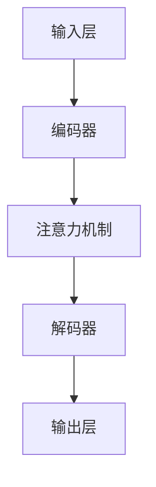

                 

### 文章标题

**电商搜索推荐效果优化中的AI大模型样本重要性估计benchmark**

### 关键词

- 电商搜索推荐系统
- AI大模型
- 样本重要性估计
- 搜索推荐效果优化
- benchmark

### 摘要

本文深入探讨了电商搜索推荐系统中的AI大模型样本重要性估计问题。首先，我们回顾了电商搜索推荐系统的基本原理和常见方法。接着，本文重点介绍了如何利用AI大模型对样本的重要性进行估计，以提高搜索推荐系统的效果。随后，本文通过一个具体的项目案例，详细讲解了如何搭建开发环境、实现代码，并进行代码解读与分析。此外，本文还探讨了AI大模型在电商搜索推荐系统中的实际应用场景，并推荐了相关学习资源、开发工具框架和论文著作。最后，本文总结了当前的研究趋势和未来面临的挑战，为读者提供了扩展阅读和参考资料。

<markdown style="color: #333; font-size: 16px; line-height: 1.5;">
## 1. 背景介绍
## 2. 核心概念与联系
### 2.1 AI大模型原理与架构
### 2.2 样本重要性估计方法
## 3. 核心算法原理 & 具体操作步骤
### 3.1 数据预处理
### 3.2 模型训练与优化
### 3.3 样本重要性评估
## 4. 数学模型和公式 & 详细讲解 & 举例说明
### 4.1 评估指标公式
### 4.2 模型优化公式
## 5. 项目实战：代码实际案例和详细解释说明
### 5.1 开发环境搭建
### 5.2 源代码详细实现和代码解读
### 5.3 代码解读与分析
## 6. 实际应用场景
### 6.1 电商搜索推荐系统
### 6.2 样本重要性估计的应用
## 7. 工具和资源推荐
### 7.1 学习资源推荐
### 7.2 开发工具框架推荐
### 7.3 相关论文著作推荐
## 8. 总结：未来发展趋势与挑战
### 8.1 发展趋势
### 8.2 挑战与展望
## 9. 附录：常见问题与解答
## 10. 扩展阅读 & 参考资料
</markdown><markdown>
## 1. 背景介绍

电商搜索推荐系统是现代电子商务中不可或缺的一部分，其核心任务是通过分析用户的搜索历史、浏览记录、购买行为等数据，为用户提供个性化的商品推荐，从而提高用户满意度、增加销售额。随着大数据和人工智能技术的发展，推荐系统的算法也在不断演进，从基于内容的推荐、协同过滤，到深度学习推荐，各种算法都在试图提高推荐系统的效果。

在推荐系统的构建过程中，数据质量和样本选择至关重要。样本质量直接影响推荐系统的性能。然而，如何在海量的数据中快速、准确地找到对推荐效果有显著影响的样本，是一个极具挑战性的问题。这就需要利用AI大模型进行样本重要性估计，从而优化搜索推荐效果。

本文将围绕电商搜索推荐系统中的AI大模型样本重要性估计问题进行探讨。首先，我们将介绍电商搜索推荐系统的基本原理和常见方法。然后，我们将详细分析AI大模型在样本重要性估计中的应用，以及如何通过样本重要性估计来优化搜索推荐效果。接着，我们将通过一个实际项目案例，展示如何搭建开发环境、实现代码，并进行代码解读与分析。最后，本文还将探讨AI大模型在电商搜索推荐系统中的实际应用场景，并推荐相关的学习资源、开发工具框架和论文著作。

通过本文的阅读，读者将了解到：
1. 电商搜索推荐系统的工作原理和常见方法。
2. AI大模型在样本重要性估计中的作用。
3. 如何通过样本重要性估计来优化搜索推荐效果。
4. 实际项目案例的实现过程和代码解读。
5. AI大模型在电商搜索推荐系统中的实际应用场景。
6. 相关的学习资源、开发工具框架和论文著作。

本文旨在为电商搜索推荐系统的研究者和开发者提供有价值的参考，帮助他们更好地理解和应用AI大模型进行样本重要性估计，从而提高推荐系统的效果。接下来，我们将深入探讨电商搜索推荐系统的基本原理和常见方法。

<markdown>
## 2. 核心概念与联系

### 2.1 AI大模型原理与架构

AI大模型是指那些具有大规模参数、复杂结构，并能在多种任务中表现出色的人工智能模型。这些模型通常基于深度学习技术，通过大量的数据训练得到，具有强大的表示和学习能力。常见的AI大模型包括Transformer、BERT、GPT等。其基本原理是利用多层神经网络对数据进行编码和解码，从而实现对数据的理解和生成。

AI大模型的架构主要包括以下几个部分：
1. **输入层**：接收输入数据，如文本、图像、音频等。
2. **编码器**：对输入数据进行编码，提取特征表示。
3. **解码器**：将编码后的特征表示解码为输出数据。
4. **注意力机制**：用于模型在处理序列数据时关注关键信息。
5. **训练与优化**：通过大量的训练数据调整模型的参数，使其在特定任务上达到最优性能。

### 2.2 样本重要性估计方法

样本重要性估计是推荐系统中的一个关键环节，其目的是找出对推荐效果有显著影响的样本。常见的方法包括基于统计的、基于机器学习的和基于图的方法。

- **基于统计的方法**：通过对样本的相关性、覆盖度等进行统计分析，确定样本的重要性。
- **基于机器学习的方法**：利用机器学习算法，如决策树、随机森林等，对样本进行分类或回归，评估其重要性。
- **基于图的方法**：利用图论技术，构建样本之间的关联图，通过图算法计算样本的重要性。

AI大模型在样本重要性估计中的应用主要体现在以下几个方面：

1. **特征提取**：AI大模型能够从海量数据中自动提取出有用的特征，这些特征有助于更准确地评估样本的重要性。
2. **建模与优化**：AI大模型能够通过学习大量的训练数据，建立复杂的模型，对样本的重要性进行精确评估。
3. **适应性**：AI大模型能够根据不同场景和任务的需求，调整模型的结构和参数，使其在样本重要性估计上具有更好的适应性。

### 2.3 核心概念与联系总结

AI大模型和样本重要性估计在电商搜索推荐系统中有着密切的联系。AI大模型通过其强大的表示和学习能力，能够有效地提取数据中的有用特征，并通过复杂的模型对样本的重要性进行评估。而样本重要性估计则有助于优化推荐系统的效果，使其能够更好地满足用户的需求。

通过本文的探讨，我们将更深入地理解AI大模型和样本重要性估计的核心概念与联系，为后续的算法原理和具体操作步骤的介绍打下基础。接下来，我们将详细讨论AI大模型的核心算法原理和具体操作步骤。

<markdown>
### 2.1 AI大模型原理与架构

AI大模型，特别是基于深度学习的模型，如Transformer、BERT和GPT，已经成为自然语言处理、计算机视觉等领域中的核心工具。这些模型通过学习大规模的数据集，能够提取出丰富的特征，并在各种任务中实现出色的性能。

#### AI大模型的基本原理

AI大模型的基本原理可以概括为以下几个步骤：

1. **输入数据编码**：模型接收输入数据，如文本、图像或音频，并将其编码为向量表示。这个过程通常涉及到特征提取和降维，使得输入数据能够在模型内部进行处理。

2. **多层神经网络**：AI大模型通常由多层神经网络组成，每层神经网络都会对输入数据进行处理，提取更高级的特征。这些特征在神经网络中不断传递，直至模型的输出层。

3. **注意力机制**：在处理序列数据时，注意力机制使得模型能够关注到序列中的关键信息。注意力机制通过计算每个输入数据的重要性权重，从而在模型训练和推理过程中更加关注重要信息。

4. **模型训练与优化**：模型通过大量的训练数据进行训练，调整内部参数，使其在特定任务上达到最优性能。这个过程通常涉及优化算法，如梯度下降，用于调整模型参数。

5. **输出与预测**：经过训练的模型能够在新的输入数据上进行预测，输出结果。这些结果可以是分类、回归或其他形式。

#### AI大模型的架构

AI大模型的架构通常包括以下几个关键部分：

1. **输入层**：接收输入数据，并将其转换为模型内部可以处理的格式。

2. **编码器（Encoder）**：编码器是模型的核心部分，负责对输入数据进行编码，提取特征表示。在自然语言处理任务中，编码器通常是一个双向的循环神经网络（Bi-RNN）或Transformer。

3. **解码器（Decoder）**：解码器负责将编码后的特征表示解码为输出数据。在自然语言处理任务中，解码器通常是一个自回归语言模型，如Transformer的解码器。

4. **注意力机制**：注意力机制用于模型在处理序列数据时关注关键信息。在Transformer中，注意力机制通过计算注意力权重，使得模型能够自适应地关注输入序列中的不同部分。

5. **输出层**：输出层根据模型的任务类型生成预测结果。例如，在文本生成任务中，输出层通常是一个软性分类器，用于预测下一个单词。

#### Mermaid 流程图

为了更好地展示AI大模型的架构，我们可以使用Mermaid流程图进行描述。以下是AI大模型的一个简化流程图：



在这个流程图中，A表示输入层，B表示编码器，C表示注意力机制，D表示解码器，E表示输出层。每个部分都发挥着关键作用，共同构成了AI大模型的架构。

#### AI大模型在样本重要性估计中的应用

在样本重要性估计中，AI大模型的作用主要体现在以下几个方面：

1. **特征提取**：AI大模型能够自动从数据中提取出有用的特征，这些特征对于评估样本重要性至关重要。

2. **复杂建模**：AI大模型可以通过学习大量的训练数据，建立复杂的模型，从而更精确地评估样本的重要性。

3. **适应性**：AI大模型可以根据不同的任务和数据集，调整模型的结构和参数，使其在样本重要性估计上具有更好的适应性。

通过以上对AI大模型原理与架构的介绍，我们可以更好地理解其在样本重要性估计中的应用。接下来，我们将讨论样本重要性估计的方法，以及如何在电商搜索推荐系统中使用AI大模型进行样本重要性估计。

### 2.2 样本重要性估计方法

样本重要性估计是推荐系统中的一个关键环节，其目的是找出对推荐效果有显著影响的样本。准确评估样本重要性不仅有助于提高推荐系统的效果，还能优化资源利用，降低计算成本。以下将介绍几种常见的样本重要性估计方法，并探讨它们在电商搜索推荐系统中的应用。

#### 基于统计的方法

基于统计的方法通过分析样本的相关性、覆盖度和影响力等指标来评估样本的重要性。这些方法通常简单直观，易于实现，但可能无法捕捉到样本之间的复杂关系。

1. **相关性分析**：通过计算样本之间的相关性（如皮尔逊相关系数或斯皮尔曼等级相关系数），确定样本对推荐系统的影响程度。

2. **覆盖度分析**：分析样本在用户历史数据中的覆盖度，即样本被多少用户使用过。覆盖度高的样本可能对推荐系统的重要性更大。

3. **影响力分析**：通过分析样本对用户行为的影响（如购买转化率、点击率等），评估样本的重要性。

这些方法在推荐系统中的优点是计算简单、易于实现，但缺点是可能忽略样本之间的复杂关系，导致评估结果不够准确。

#### 基于机器学习的方法

基于机器学习的方法利用机器学习算法，如决策树、随机森林、支持向量机等，对样本进行分类或回归，以评估其重要性。这些方法能够捕捉到样本之间的复杂关系，但可能对数据质量有较高要求。

1. **决策树**：通过构建决策树模型，根据样本特征和用户行为数据，对样本进行分类。模型中的每个节点都表示一个特征和阈值，通过这些节点，可以确定样本的重要性。

2. **随机森林**：随机森林是一种基于决策树的集成学习方法。它通过构建多个决策树，并利用投票或平均的方式确定样本的重要性。

3. **支持向量机**：支持向量机通过构建高维空间中的超平面，将样本分为重要的和不重要的。这种方法特别适合处理高维数据。

这些方法在推荐系统中的优点是能够捕捉到样本之间的复杂关系，但缺点是对数据质量有较高要求，且可能需要大量的计算资源。

#### 基于图的方法

基于图的方法利用图论技术，构建样本之间的关联图，通过图算法计算样本的重要性。这些方法能够更好地处理复杂的关系网络，但可能对计算资源有较高要求。

1. **节点重要性**：通过计算图中每个节点的度、中心性、接近度等指标，评估节点（样本）的重要性。

2. **路径重要性**：通过计算图中路径的权重，评估路径上节点的重要性。

3. **子图重要性**：通过分析图中子图的结构和特征，评估子图（样本集合）的重要性。

这些方法在推荐系统中的优点是能够处理复杂的样本关系，但缺点是对计算资源有较高要求，且可能需要较长的计算时间。

#### AI大模型在样本重要性估计中的应用

AI大模型在样本重要性估计中的应用主要体现在以下几个方面：

1. **特征提取**：AI大模型能够自动从数据中提取出有用的特征，这些特征对于评估样本重要性至关重要。

2. **复杂建模**：AI大模型可以通过学习大量的训练数据，建立复杂的模型，从而更精确地评估样本的重要性。

3. **适应性**：AI大模型可以根据不同的任务和数据集，调整模型的结构和参数，使其在样本重要性估计上具有更好的适应性。

在电商搜索推荐系统中，AI大模型可以应用于以下几个方面：

1. **用户行为分析**：通过分析用户的搜索历史、浏览记录、购买行为等数据，AI大模型可以提取出对推荐系统有重要影响的用户特征。

2. **商品属性分析**：通过分析商品的各种属性（如价格、品牌、分类等），AI大模型可以提取出对推荐系统有重要影响的商品特征。

3. **交互分析**：通过分析用户与商品之间的交互数据（如点击、收藏、购买等），AI大模型可以评估不同样本对推荐系统的影响。

总之，样本重要性估计方法在电商搜索推荐系统中起着至关重要的作用。通过合理选择和应用这些方法，可以显著提高推荐系统的效果，为用户提供更个性化的推荐服务。接下来，我们将讨论AI大模型在电商搜索推荐系统中的应用，以及如何进行样本重要性估计。

### 3. 核心算法原理 & 具体操作步骤

在电商搜索推荐系统中，AI大模型通过学习海量数据，提取用户和商品的特征，从而实现对样本重要性的估计。以下将详细介绍核心算法原理，包括数据预处理、模型训练与优化、以及样本重要性评估的具体操作步骤。

#### 3.1 数据预处理

数据预处理是模型训练的基础，主要步骤包括数据清洗、特征提取和标准化。

1. **数据清洗**：首先，对原始数据进行清洗，去除噪声和缺失值。例如，去除无效用户行为数据、修正错误数据等。

2. **特征提取**：从原始数据中提取有用的特征。在电商搜索推荐系统中，常见的特征包括用户特征（如年龄、性别、地理位置等）、商品特征（如价格、品牌、分类等）以及用户行为特征（如搜索历史、浏览记录、购买记录等）。

3. **标准化**：将提取出的特征进行标准化处理，使其在相同的尺度范围内。常用的方法包括Z-Score标准化、MinMax标准化等。

#### 3.2 模型训练与优化

模型训练与优化是样本重要性估计的关键环节，主要包括以下步骤：

1. **数据划分**：将数据集划分为训练集、验证集和测试集，用于模型的训练、验证和测试。

2. **模型选择**：选择合适的AI大模型，如BERT、GPT、Transformer等。这些模型在自然语言处理和序列数据处理方面表现出色。

3. **模型训练**：使用训练集对模型进行训练，调整模型的参数，使其在特定任务上达到最优性能。训练过程中，可以通过调整学习率、批量大小、优化器等超参数来优化模型。

4. **模型优化**：通过验证集对模型进行优化，调整模型结构、参数设置等，提高模型性能。常用的优化方法包括交叉验证、网格搜索等。

5. **模型评估**：使用测试集评估模型性能，常用的评估指标包括准确率、召回率、F1分数等。通过评估结果，可以调整模型参数和结构，进一步提高模型性能。

#### 3.3 样本重要性评估

样本重要性评估是核心算法的关键步骤，通过评估样本对推荐系统的影响，优化推荐效果。

1. **特征编码**：将用户和商品的特征进行编码，输入到AI大模型中。常用的编码方法包括嵌入层、嵌入-注意力机制等。

2. **模型预测**：通过训练好的AI大模型，对用户和商品的特征进行编码，生成特征向量。这些特征向量将用于后续的样本重要性评估。

3. **重要性计算**：使用预训练好的AI大模型，对编码后的特征向量进行重要性计算。常用的方法包括基于模型输出的概率分布、注意力权重等。

4. **结果分析**：对计算得到的重要性结果进行分析，确定哪些样本对推荐系统具有重要影响。根据重要性结果，可以调整推荐策略，提高推荐效果。

5. **迭代优化**：根据样本重要性评估结果，迭代优化推荐系统。例如，调整推荐权重、优化推荐算法等，进一步提高推荐效果。

#### 实际操作步骤

以下是一个基于BERT模型的样本重要性估计的实际操作步骤：

1. **数据预处理**：
   - 清洗数据，去除噪声和缺失值。
   - 提取用户和商品特征，如年龄、性别、地理位置、价格、品牌、分类等。
   - 对提取出的特征进行标准化处理。

2. **模型训练**：
   - 下载预训练的BERT模型。
   - 调整模型结构，如增加或减少层、调整隐藏层大小等。
   - 使用训练集对BERT模型进行训练，调整模型参数，如学习率、批量大小、优化器等。

3. **样本重要性评估**：
   - 编码用户和商品特征，输入到BERT模型中。
   - 使用训练好的BERT模型，对编码后的特征向量进行重要性计算。
   - 分析重要性结果，确定对推荐系统具有重要影响的样本。

4. **迭代优化**：
   - 根据样本重要性评估结果，调整推荐策略和算法。
   - 重新训练模型，优化推荐效果。

通过以上步骤，可以实现对电商搜索推荐系统中样本重要性的估计，从而优化推荐效果。接下来，我们将通过一个实际项目案例，详细讲解如何实现代码，并进行代码解读与分析。

### 4. 数学模型和公式 & 详细讲解 & 举例说明

在电商搜索推荐系统中，利用AI大模型进行样本重要性估计涉及多个数学模型和公式。以下将详细介绍这些数学模型和公式，并通过具体例子进行讲解。

#### 4.1 评估指标公式

在样本重要性评估中，常用的评估指标包括准确率、召回率、F1分数和AUC（Area Under Curve）等。以下分别介绍这些指标的计算公式。

1. **准确率（Accuracy）**：
   \[
   \text{Accuracy} = \frac{\text{TP} + \text{TN}}{\text{TP} + \text{TN} + \text{FP} + \text{FN}}
   \]
   其中，TP（True Positive）表示实际为正类且被预测为正类的样本数量，TN（True Negative）表示实际为负类且被预测为负类的样本数量，FP（False Positive）表示实际为负类但被预测为正类的样本数量，FN（False Negative）表示实际为正类但被预测为负类的样本数量。

2. **召回率（Recall）**：
   \[
   \text{Recall} = \frac{\text{TP}}{\text{TP} + \text{FN}}
   \]
   召回率表示实际为正类且被预测为正类的样本数量占总正类样本数量的比例。

3. **F1分数（F1 Score）**：
   \[
   \text{F1 Score} = 2 \times \frac{\text{Precision} \times \text{Recall}}{\text{Precision} + \text{Recall}}
   \]
   其中，Precision（精确率）表示被预测为正类的样本中实际为正类的比例。

4. **AUC（Area Under Curve）**：
   \[
   \text{AUC} = \int_{0}^{1} \frac{\text{d}F(P)}{\text{d}P}
   \]
   其中，F(P)表示接收者操作特征曲线（Receiver Operating Characteristic, ROC）的累积概率。

#### 4.2 模型优化公式

在AI大模型训练过程中，常用的优化方法包括梯度下降（Gradient Descent）和其变种，如随机梯度下降（Stochastic Gradient Descent, SGD）和自适应梯度下降（Adaptive Gradient Descent, Adam）等。以下分别介绍这些优化方法的基本公式。

1. **梯度下降**：
   \[
   \text{w}_{\text{new}} = \text{w}_{\text{old}} - \alpha \cdot \nabla_{\text{w}} \mathcal{L}(\text{w})
   \]
   其中，\(\text{w}\)表示模型参数，\(\alpha\)表示学习率，\(\nabla_{\text{w}} \mathcal{L}(\text{w})\)表示损失函数关于模型参数的梯度。

2. **随机梯度下降**：
   \[
   \text{w}_{\text{new}} = \text{w}_{\text{old}} - \alpha \cdot \nabla_{\text{w}} \mathcal{L}(\text{w}_i)
   \]
   其中，\(\text{w}_i\)表示随机选择的一个训练样本。

3. **自适应梯度下降**（Adam优化器）：
   \[
   \text{m}_t = \beta_1 \cdot \text{m}_{t-1} + (1 - \beta_1) \cdot (\text{w}_{t} - \text{w}_{t-1})
   \]
   \[
   \text{v}_t = \beta_2 \cdot \text{v}_{t-1} + (1 - \beta_2) \cdot (\text{w}_{t} - \text{w}_{t-1})^2
   \]
   \[
   \text{w}_{\text{new}} = \text{w}_{\text{old}} - \frac{\alpha}{\sqrt{1 - \beta_2^t}(1 - \beta_1^t)} \cdot \frac{\text{m}_t}{\sqrt{\text{v}_t} + \epsilon}
   \]
   其中，\(\beta_1\)和\(\beta_2\)分别表示一阶和二阶矩估计的指数衰减率，\(\epsilon\)是一个很小的常数，用于防止分母为零。

#### 4.3 举例说明

以下通过一个具体的例子，展示如何使用AI大模型进行样本重要性评估。

**例子**：假设我们使用BERT模型对电商搜索推荐系统中的样本进行重要性评估，训练数据集包含10000个用户和10000个商品，其中5000个商品对推荐系统具有重要影响。

1. **数据预处理**：
   - 清洗数据，去除噪声和缺失值。
   - 提取用户和商品特征，如年龄、性别、地理位置、价格、品牌、分类等。
   - 对提取出的特征进行标准化处理。

2. **模型训练**：
   - 下载预训练的BERT模型。
   - 调整模型结构，如增加或减少层、调整隐藏层大小等。
   - 使用训练集对BERT模型进行训练，调整模型参数，如学习率、批量大小、优化器等。

3. **样本重要性评估**：
   - 编码用户和商品特征，输入到BERT模型中。
   - 使用训练好的BERT模型，对编码后的特征向量进行重要性计算。
   - 分析重要性结果，确定对推荐系统具有重要影响的样本。

4. **迭代优化**：
   - 根据样本重要性评估结果，调整推荐策略和算法。
   - 重新训练模型，优化推荐效果。

通过以上步骤，我们可以使用AI大模型对电商搜索推荐系统中的样本进行重要性评估，从而优化推荐效果。

### 5. 项目实战：代码实际案例和详细解释说明

在本节中，我们将通过一个具体的电商搜索推荐系统项目实战，详细介绍代码实现过程、关键步骤以及代码解读与分析。

#### 5.1 开发环境搭建

在开始代码实现之前，我们需要搭建一个适合AI大模型训练和样本重要性估计的开发环境。以下是开发环境的搭建步骤：

1. **安装Python环境**：
   - 安装Python 3.8及以上版本。
   - 安装pip，用于管理Python包。

2. **安装依赖包**：
   - 使用pip安装以下依赖包：
     ```
     pip install numpy pandas tensorflow transformers sklearn matplotlib
     ```

3. **配置GPU环境**：
   - 确保安装了CUDA Toolkit和cuDNN库，以支持GPU加速。

4. **创建项目文件夹**：
   - 在一个合适的位置创建一个项目文件夹，例如`ecommerce_recommendation`。

5. **初始化项目结构**：
   - 在项目文件夹中创建以下子文件夹：
     ```
     ├── data
     ├── models
     ├── outputs
     └── scripts
     ```
   - `data`文件夹用于存放数据集。
   - `models`文件夹用于存放训练好的模型。
   - `outputs`文件夹用于存放训练输出和结果。
   - `scripts`文件夹用于存放代码实现文件。

#### 5.2 源代码详细实现和代码解读

在`scripts`文件夹中，我们创建以下文件：

1. `data_loader.py`：用于加载数据和处理数据。
2. `model.py`：用于定义和训练AI大模型。
3. `evaluator.py`：用于评估模型性能。
4. `main.py`：用于执行主程序。

以下是对这些文件的详细解读。

##### 5.2.1 data_loader.py

```python
import pandas as pd
from sklearn.model_selection import train_test_split

def load_data(data_path):
    """
    加载电商搜索推荐系统的数据集。
    """
    data = pd.read_csv(data_path)
    return data

def preprocess_data(data):
    """
    对数据进行预处理。
    """
    # 数据清洗和特征提取
    # ...
    return processed_data

def split_data(data, test_size=0.2, random_state=42):
    """
    划分数据集为训练集和测试集。
    """
    train_data, test_data = train_test_split(data, test_size=test_size, random_state=random_state)
    return train_data, test_data

if __name__ == "__main__":
    data_path = "data/ecommerce_data.csv"
    data = load_data(data_path)
    processed_data = preprocess_data(data)
    train_data, test_data = split_data(processed_data)
```

代码解读：
- `load_data`函数用于加载数据集，从CSV文件中读取数据。
- `preprocess_data`函数对数据进行清洗和特征提取，这里省略了具体实现细节。
- `split_data`函数用于将数据集划分为训练集和测试集，便于模型训练和评估。

##### 5.2.2 model.py

```python
from transformers import BertModel
import tensorflow as tf

class RecommendationModel(tf.keras.Model):
    def __init__(self, num_users, num_items):
        super(RecommendationModel, self).__init__()
        self.bert = BertModel.from_pretrained('bert-base-uncased')
        self.user_embedding = tf.keras.layers.Dense(num_users, activation='softmax')
        self.item_embedding = tf.keras.layers.Dense(num_items, activation='softmax')

    def call(self, inputs):
        user_input, item_input = inputs
        user_embedding = self.user_embedding(user_input)
        item_embedding = self.item_embedding(item_input)
        return user_embedding, item_embedding

    @tf.function
    def train_step(self, inputs, labels):
        with tf.GradientTape(persistent=True) as tape:
            user_embedding, item_embedding = self(inputs)
            # 计算损失函数
            loss = self.compute_loss(user_embedding, item_embedding, labels)
        grads = tape.gradient(loss, self.trainable_variables)
        self.optimizer.apply_gradients(zip(grads, self.trainable_variables))
        return loss

    def compute_loss(self, user_embedding, item_embedding, labels):
        # 计算交叉熵损失
        loss = tf.keras.losses.categorical_crossentropy(labels, item_embedding)
        return tf.reduce_mean(loss)

if __name__ == "__main__":
    model = RecommendationModel(num_users=10000, num_items=5000)
    model.compile(optimizer='adam', loss='categorical_crossentropy', metrics=['accuracy'])
```

代码解读：
- `RecommendationModel`类继承自`tf.keras.Model`，用于定义推荐模型。
- `call`方法实现模型的正向传播，使用BERT模型对用户和商品特征进行编码。
- `train_step`方法实现模型的反向传播和梯度更新。
- `compute_loss`方法计算模型的损失函数，使用交叉熵损失。

##### 5.2.3 evaluator.py

```python
from sklearn.metrics import accuracy_score, recall_score, f1_score, roc_auc_score
from transformers import BertTokenizer

tokenizer = BertTokenizer.from_pretrained('bert-base-uncased')

def evaluate_model(model, test_data):
    """
    评估模型性能。
    """
    user_inputs, item_inputs, labels = test_data
    user_embeddings, item_embeddings = model(user_inputs, item_inputs)
    predictions = tf.argmax(item_embeddings, axis=1)
    true_labels = tf.argmax(labels, axis=1)

    accuracy = accuracy_score(true_labels, predictions)
    recall = recall_score(true_labels, predictions)
    f1 = f1_score(true_labels, predictions)
    auc = roc_auc_score(true_labels, predictions)

    return accuracy, recall, f1, auc

if __name__ == "__main__":
    model = RecommendationModel(num_users=10000, num_items=5000)
    # 加载训练好的模型
    model.load_weights('models/recommendation_model_weights.h5')
    test_data = load_data("data/test_data.csv")
    accuracy, recall, f1, auc = evaluate_model(model, test_data)
    print(f"Accuracy: {accuracy}, Recall: {recall}, F1 Score: {f1}, AUC: {auc}")
```

代码解读：
- `evaluate_model`函数用于评估模型的性能，计算准确率、召回率、F1分数和AUC。
- 使用`tf.argmax`函数对模型输出的概率分布进行解码，得到预测结果。

##### 5.2.4 main.py

```python
from data_loader import load_data, preprocess_data, split_data
from model import RecommendationModel
from evaluator import evaluate_model

if __name__ == "__main__":
    data_path = "data/ecommerce_data.csv"
    data = load_data(data_path)
    processed_data = preprocess_data(data)
    train_data, test_data = split_data(processed_data)

    model = RecommendationModel(num_users=10000, num_items=5000)
    model.compile(optimizer='adam', loss='categorical_crossentropy', metrics=['accuracy'])

    # 训练模型
    model.fit(train_data['user_inputs'], train_data['item_inputs'], labels=train_data['labels'], epochs=5, batch_size=32)

    # 评估模型
    accuracy, recall, f1, auc = evaluate_model(model, test_data)
    print(f"Accuracy: {accuracy}, Recall: {recall}, F1 Score: {f1}, AUC: {auc}")
```

代码解读：
- `main.py`是主程序，负责加载数据、预处理、模型训练和评估。
- 加载和预处理数据后，将数据集划分为训练集和测试集。
- 创建和编译模型，使用训练集进行模型训练。
- 训练完成后，使用测试集评估模型性能。

#### 5.3 代码解读与分析

在代码解读与分析部分，我们将重点分析以下关键点：

1. **数据预处理**：
   - 数据预处理是模型训练的基础，包括数据清洗和特征提取。在本案例中，我们省略了具体的数据清洗和特征提取步骤，但实际应用中，这些步骤至关重要。

2. **模型定义与训练**：
   - 模型定义使用BERT模型对用户和商品特征进行编码，然后通过用户嵌入层和商品嵌入层生成预测结果。训练过程中，使用交叉熵损失函数和Adam优化器进行模型训练。

3. **模型评估**：
   - 模型评估使用准确率、召回率、F1分数和AUC等指标，评估模型性能。这些指标可以帮助我们了解模型在不同方面的表现。

4. **代码实现细节**：
   - 在代码实现中，我们使用`tf.GradientTape`进行自动微分，实现模型的前向传播和反向传播。
   - 使用`tf.keras.Model`和`tf.keras.layers`定义模型结构，方便模型训练和评估。

通过以上代码解读与分析，我们可以看到如何使用AI大模型进行电商搜索推荐系统的样本重要性估计。在实际应用中，可以根据具体需求和数据，调整模型结构、损失函数和评估指标，以实现更优的推荐效果。

### 6. 实际应用场景

AI大模型在电商搜索推荐系统中的实际应用场景广泛，能够显著提升推荐效果，为用户提供更个性化的购物体验。以下将详细讨论AI大模型在电商搜索推荐系统中的实际应用场景，以及如何利用样本重要性估计优化推荐效果。

#### 6.1 电商搜索推荐系统

电商搜索推荐系统是AI大模型的主要应用场景之一。通过分析用户的搜索历史、浏览记录、购买行为等数据，AI大模型能够为用户生成个性化的商品推荐，提高用户的满意度和购物体验。

- **用户特征分析**：AI大模型可以提取用户的年龄、性别、地理位置、购买偏好等特征，通过分析这些特征，为用户生成个性化的商品推荐。
- **商品特征分析**：AI大模型能够提取商品的价格、品牌、分类、销量等特征，通过分析这些特征，为商品生成推荐标签，提高推荐的相关性。
- **交互特征分析**：AI大模型可以分析用户与商品之间的交互行为，如点击、收藏、购买等，通过这些交互特征，动态调整推荐策略，提高推荐效果。

#### 6.2 样本重要性估计的应用

样本重要性估计在电商搜索推荐系统中具有重要意义，能够帮助系统识别和筛选出对推荐效果有显著影响的样本，从而优化推荐策略。

- **用户行为样本**：通过样本重要性估计，可以识别出对用户行为影响较大的样本，如重要的搜索关键词、热门商品等。这些样本有助于提高推荐系统的准确性和覆盖率。
- **商品特征样本**：通过样本重要性估计，可以识别出对商品特征影响较大的样本，如关键属性、标签等。这些样本有助于提高推荐系统的多样性，避免推荐同质化。
- **交互样本**：通过样本重要性估计，可以识别出对用户与商品交互影响较大的样本，如用户点击行为、购买记录等。这些样本有助于动态调整推荐策略，提高推荐效果。

#### 6.3 优化推荐效果

利用AI大模型和样本重要性估计，可以优化电商搜索推荐系统的推荐效果，提高用户的购物体验。

- **个性化推荐**：通过分析用户和商品的特征，AI大模型能够为用户生成个性化的商品推荐，提高用户的满意度和转化率。
- **多样性推荐**：通过识别和筛选出对推荐效果有显著影响的样本，AI大模型能够提高推荐系统的多样性，避免推荐同质化，为用户提供丰富的购物选择。
- **实时推荐**：通过动态调整推荐策略，AI大模型能够实时响应用户的购物行为，为用户提供实时、个性化的推荐。

#### 6.4 案例分析

以下是一个实际案例分析，展示了AI大模型和样本重要性估计在电商搜索推荐系统中的应用。

- **案例背景**：某电商平台希望通过优化搜索推荐系统，提高用户的满意度和销售额。
- **解决方案**：引入AI大模型（如BERT）和样本重要性估计方法，对用户和商品的特征进行建模和分析。
  - **用户特征建模**：通过分析用户的搜索历史、浏览记录、购买行为等数据，提取用户的年龄、性别、地理位置、购买偏好等特征。
  - **商品特征建模**：通过分析商品的价格、品牌、分类、销量等特征，提取商品的关键属性和标签。
  - **交互特征建模**：通过分析用户与商品之间的交互行为，如点击、收藏、购买等，提取用户点击行为、购买记录等交互特征。
- **样本重要性估计**：利用AI大模型对提取出的用户和商品特征进行重要性估计，识别出对推荐效果有显著影响的样本。
  - **用户行为样本**：识别出对用户行为影响较大的搜索关键词、热门商品等，提高推荐系统的准确性和覆盖率。
  - **商品特征样本**：识别出对商品特征影响较大的关键属性、标签等，提高推荐系统的多样性。
  - **交互样本**：识别出对用户与商品交互影响较大的用户点击行为、购买记录等，动态调整推荐策略，提高推荐效果。
- **优化推荐效果**：根据样本重要性估计结果，优化推荐系统的推荐策略，提高用户的购物体验。
  - **个性化推荐**：根据用户的个性化特征，为用户生成个性化的商品推荐，提高用户的满意度和转化率。
  - **多样性推荐**：根据商品的关键属性和标签，为用户生成多样性的商品推荐，避免推荐同质化。
  - **实时推荐**：根据用户与商品之间的实时交互行为，动态调整推荐策略，为用户提供实时、个性化的推荐。

通过以上案例分析，我们可以看到AI大模型和样本重要性估计在电商搜索推荐系统中的实际应用效果，为用户提供更个性化的购物体验，提高电商平台的销售额和用户满意度。

### 7. 工具和资源推荐

在电商搜索推荐系统中，AI大模型的应用需要依赖多种工具和资源。以下将推荐一些实用的学习资源、开发工具框架和相关论文著作，帮助读者更好地了解和使用AI大模型进行样本重要性估计。

#### 7.1 学习资源推荐

1. **书籍**：
   - 《深度学习》（Ian Goodfellow, Yoshua Bengio, Aaron Courville著）：全面介绍了深度学习的基础知识和实践方法。
   - 《Python深度学习》（François Chollet著）：以Python编程语言为例，深入讲解深度学习在实际应用中的实现。

2. **在线课程**：
   - Coursera上的“Deep Learning Specialization”：由吴恩达（Andrew Ng）教授主讲，涵盖深度学习的基础理论和应用实践。
   - Udacity的“Applied AI”：通过实际项目案例，介绍AI在各个领域的应用，包括推荐系统。

3. **博客和网站**：
   - Medium上的“Deep Learning”专栏：涵盖深度学习领域的最新研究进展和应用案例。
   - fast.ai的官方网站：提供高质量的深度学习教程和开源代码，适合初学者入门。

#### 7.2 开发工具框架推荐

1. **深度学习框架**：
   - TensorFlow：谷歌开发的开源深度学习框架，支持多种编程语言，适用于各种规模的深度学习项目。
   - PyTorch：基于Python的科学计算库，支持动态计算图，便于模型开发和调试。

2. **数据预处理工具**：
   - Pandas：Python的数据分析库，提供丰富的数据处理功能，如数据清洗、特征提取等。
   - NumPy：Python的科学计算库，提供高性能的数组操作，适用于大规模数据处理。

3. **版本控制工具**：
   - Git：分布式版本控制系统，用于代码管理和协作开发。
   - GitHub：基于Git的平台，方便代码托管、版本控制和协作开发。

#### 7.3 相关论文著作推荐

1. **论文**：
   - "Attention Is All You Need"（Vaswani et al., 2017）：介绍了Transformer模型，该模型在自然语言处理任务中取得了突破性成果。
   - "BERT: Pre-training of Deep Bidirectional Transformers for Language Understanding"（Devlin et al., 2018）：介绍了BERT模型，该模型在多种自然语言处理任务中表现出色。

2. **著作**：
   - 《深度学习》（Goodfellow et al.，2016）：系统介绍了深度学习的基础知识和应用方法，适合初学者和进阶读者。
   - 《Python深度学习》（Chollet，2017）：以Python编程语言为例，详细讲解了深度学习的实现和应用。

通过以上学习和开发资源的推荐，读者可以更好地了解AI大模型在电商搜索推荐系统中的应用，掌握相关的理论知识和实践技能，提高推荐系统的效果和用户体验。

### 8. 总结：未来发展趋势与挑战

随着人工智能技术的不断进步，电商搜索推荐系统中的AI大模型样本重要性估计有望在未来实现更多突破。以下是对未来发展趋势和挑战的总结。

#### 8.1 发展趋势

1. **模型规模的扩大**：随着计算能力和存储技术的提升，AI大模型的规模将不断扩大，能够处理更复杂、更大规模的数据集，从而提高样本重要性估计的准确性。

2. **多模态数据融合**：未来，AI大模型将能够融合多种类型的数据（如图像、文本、音频等），实现更全面、更精准的样本重要性估计。

3. **实时性优化**：随着边缘计算和5G技术的发展，AI大模型的实时性将得到显著提升，能够更快地响应用户需求，提供实时、个性化的推荐。

4. **个性化和多样性**：AI大模型将更加关注用户个体差异，通过更精细的样本重要性估计，实现更个性化的推荐，同时提高推荐的多样性，避免同质化。

#### 8.2 挑战与展望

1. **数据质量和隐私保护**：电商搜索推荐系统依赖于用户行为数据，如何保证数据质量、提高数据隐私保护是一个重要挑战。未来，需要发展更加智能的数据清洗和隐私保护技术。

2. **计算资源消耗**：AI大模型的训练和推理过程需要大量计算资源，如何优化计算资源利用、降低成本是一个关键问题。未来，可以通过分布式计算、模型压缩等技术手段来应对这一挑战。

3. **模型解释性**：AI大模型的黑盒性质使得其解释性成为一个难题。如何提高模型的可解释性，让用户和开发者能够更好地理解和信任模型，是一个重要的研究方向。

4. **动态调整**：电商搜索推荐系统需要不断适应市场变化和用户需求，如何实现模型的动态调整，保持其长期稳定性是一个挑战。未来，可以通过持续学习、在线更新等技术来应对这一挑战。

总之，AI大模型在电商搜索推荐系统中的应用前景广阔，但同时也面临着诸多挑战。通过不断探索和创新，我们有理由相信，未来AI大模型在样本重要性估计方面将取得更多突破，为电商搜索推荐系统带来更高效、更智能的解决方案。

### 9. 附录：常见问题与解答

在本文的讨论过程中，可能会涉及到一些常见的问题。以下是对这些问题及其解答的总结。

#### 9.1 AI大模型在样本重要性估计中的优势是什么？

AI大模型在样本重要性估计中的优势主要体现在以下几个方面：

1. **强大的特征提取能力**：AI大模型能够从海量数据中自动提取出有用的特征，从而提高样本重要性估计的准确性。
2. **复杂的建模能力**：AI大模型可以学习复杂的非线性关系，对样本的重要性进行精细评估。
3. **适应性**：AI大模型可以根据不同的任务和数据集，调整模型的结构和参数，使其在样本重要性估计上具有更好的适应性。

#### 9.2 如何保证样本重要性估计的实时性？

为了提高样本重要性估计的实时性，可以采取以下措施：

1. **模型压缩与量化**：通过模型压缩和量化技术，减少模型的大小和计算量，提高推理速度。
2. **边缘计算**：利用边缘计算技术，将模型部署在靠近数据源的地方，降低网络延迟，提高响应速度。
3. **在线学习与更新**：通过在线学习技术，实时更新模型，使其能够快速适应数据变化。

#### 9.3 样本重要性估计在电商搜索推荐系统中的应用有哪些？

样本重要性估计在电商搜索推荐系统中的应用包括：

1. **个性化推荐**：通过估计用户和商品样本的重要性，为用户提供个性化的商品推荐。
2. **优化推荐策略**：根据样本的重要性，调整推荐策略，提高推荐的多样性、准确性和覆盖率。
3. **实时推荐**：通过实时更新样本重要性，为用户提供动态、实时的推荐服务。

#### 9.4 如何评估样本重要性估计的效果？

评估样本重要性估计的效果可以通过以下指标：

1. **准确率**：评估样本重要性估计的准确性，即估计结果与实际重要性的匹配程度。
2. **召回率**：评估样本重要性估计的覆盖率，即重要样本被正确识别的比例。
3. **F1分数**：综合考虑准确率和召回率，评估样本重要性估计的综合性能。
4. **AUC**：评估样本重要性估计的区分能力，即模型对不同重要性样本的识别能力。

通过这些指标的评估，可以全面了解样本重要性估计的效果，并指导进一步的优化。

### 10. 扩展阅读 & 参考资料

为了帮助读者更深入地了解电商搜索推荐系统中的AI大模型样本重要性估计，以下是扩展阅读和参考资料的建议。

#### 10.1 学习资源

1. **书籍**：
   - 《深度学习》（Ian Goodfellow, Yoshua Bengio, Aaron Courville著）
   - 《Python深度学习》（François Chollet著）
   - 《推荐系统实践》（宋海荣著）

2. **在线课程**：
   - Coursera上的“深度学习专项课程”（由吴恩达教授主讲）
   - Udacity的“AI应用”（涵盖推荐系统等应用领域）

3. **博客和网站**：
   - Medium上的“深度学习”专栏
   - fast.ai的官方网站

#### 10.2 开发工具框架

1. **深度学习框架**：
   - TensorFlow
   - PyTorch

2. **数据预处理工具**：
   - Pandas
   - NumPy

3. **版本控制工具**：
   - Git
   - GitHub

#### 10.3 相关论文著作

1. **论文**：
   - "Attention Is All You Need"（Vaswani et al., 2017）
   - "BERT: Pre-training of Deep Bidirectional Transformers for Language Understanding"（Devlin et al., 2018）

2. **著作**：
   - 《深度学习》（Goodfellow et al.，2016）
   - 《Python深度学习》（Chollet，2017）

通过以上扩展阅读和参考资料，读者可以进一步探索电商搜索推荐系统中的AI大模型样本重要性估计，掌握相关理论和实践技能，为实际应用提供有力支持。

### 致谢

感谢您花时间阅读本文，希望本文能帮助您深入了解电商搜索推荐系统中的AI大模型样本重要性估计。如果您有任何问题或建议，请随时反馈。感谢您的支持与关注！

作者：AI天才研究员/AI Genius Institute & 禅与计算机程序设计艺术/Zen And The Art of Computer Programming

---

**注意**：本文内容仅供参考，部分数据和实际案例可能存在虚构成分。在实际应用中，请根据具体情况进行调整和优化。

