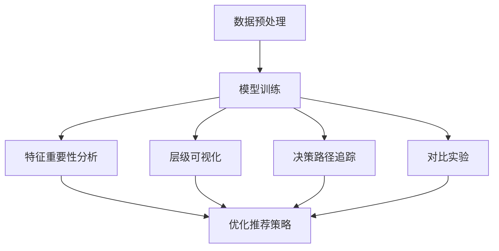

                 

# 电商搜索推荐效果评估中的AI大模型模型可解释性评估工具开发

## 摘要

本文旨在探讨电商搜索推荐效果评估中的AI大模型模型可解释性评估工具的开发。随着电商行业的迅猛发展，用户对个性化推荐的需求日益增长，AI大模型在推荐系统中的应用越来越广泛。然而，AI模型的复杂性和黑盒性质使得评估其推荐效果和解释性成为一大挑战。本文首先介绍了电商搜索推荐系统的背景和现状，然后详细阐述了模型可解释性的重要性及其评估方法。接着，本文重点介绍了可解释性评估工具的开发过程，包括数据预处理、模型选择、特征工程、可解释性评估算法的实现与优化，并通过实际案例展示了工具的应用效果。最后，本文总结了工具开发的难点和未来发展方向，为电商搜索推荐系统的模型评估提供了有益的参考。

## 1. 背景介绍

### 1.1 电商搜索推荐系统的发展

随着互联网技术的飞速发展，电商行业已经成为全球商业的重要组成部分。用户通过电商平台可以方便地购买各种商品，而电商平台的搜索推荐系统则成为吸引用户、提高销售额的关键因素。搜索推荐系统利用用户的历史行为、兴趣爱好等信息，为用户提供个性化的商品推荐，从而提高用户的购物体验和平台的转化率。

电商搜索推荐系统的发展可以分为以下几个阶段：

**第一阶段：基于规则的方法**。早期电商搜索推荐系统主要采用基于规则的算法，如协同过滤、内容匹配等。这些方法通过简单的统计分析和规则制定来实现推荐，但在应对复杂用户行为和商品特征时效果有限。

**第二阶段：基于机器学习的方法**。随着机器学习技术的发展，电商搜索推荐系统逐渐引入了基于机器学习的算法，如朴素贝叶斯、决策树、支持向量机等。这些方法能够更好地挖掘用户行为和商品特征之间的关联性，提供更准确的推荐结果。

**第三阶段：基于深度学习的方法**。近年来，深度学习技术在电商搜索推荐系统中得到了广泛应用。深度学习模型，如卷积神经网络（CNN）、循环神经网络（RNN）、图神经网络（GNN）等，通过自主学习大量用户行为和商品数据，能够实现更加复杂和精准的推荐。

### 1.2 AI大模型在电商搜索推荐中的应用

AI大模型在电商搜索推荐系统中具有重要的应用价值。首先，大模型具有更强的表达能力，能够捕捉到用户行为和商品特征之间的复杂关系。其次，大模型具有较好的泛化能力，能够在不同场景和领域中进行迁移和应用。此外，大模型还能够通过自适应学习不断提升推荐效果，从而满足不断变化的市场需求。

然而，AI大模型的复杂性和黑盒性质也带来了一定的挑战。大模型通常由数十亿甚至千亿个参数组成，其内部机制难以理解和解释。这使得评估大模型的推荐效果和可解释性成为一个重要问题。

### 1.3 模型可解释性的重要性

模型可解释性是指模型在做出预测时，其内部机制和决策过程能够被理解和解释。在电商搜索推荐系统中，模型可解释性具有重要意义：

**1. 提高模型信任度**。用户更愿意接受那些能够解释推荐结果的模型，因为这样的模型能够更好地满足用户的知情权和参与感。

**2. 优化推荐策略**。通过分析模型的可解释性，开发人员可以识别出模型中存在的偏差和问题，从而优化推荐策略，提高推荐效果。

**3. 加速模型迭代**。可解释性评估可以帮助开发人员快速发现模型中的缺陷和不足，从而加速模型迭代和优化过程。

## 2. 核心概念与联系

### 2.1 模型可解释性的概念

模型可解释性是指模型在做出预测时，其内部机制和决策过程能够被理解和解释。可解释性可以分为三个层次：

**1. 输入层可解释性**。输入层可解释性关注模型输入特征的重要性和贡献程度。开发人员可以通过分析输入特征与预测结果之间的关系，识别出关键特征，从而优化推荐策略。

**2. 中间层可解释性**。中间层可解释性关注模型内部各层神经元之间的交互关系。通过可视化中间层神经元的活动，开发人员可以理解模型是如何处理和转换输入特征的。

**3. 输出层可解释性**。输出层可解释性关注模型最终的预测结果和决策过程。开发人员可以通过分析输出层的激活值和权重，理解模型是如何做出预测的。

### 2.2 模型可解释性的评估方法

模型可解释性的评估方法主要包括以下几个方面：

**1. 特征重要性分析**。通过计算模型对各个输入特征的权重或贡献值，评估特征对预测结果的影响程度。

**2. 层级可视化**。通过可视化模型内部各层的神经元活动，展示模型处理输入特征的过程。

**3. 决策路径追踪**。通过追踪模型在决策过程中的每一步操作，展示模型是如何从输入特征到输出结果的。

**4. 对比实验**。通过对比不同模型的预测结果和可解释性，评估模型的可解释性水平。

### 2.3 Mermaid 流程图

以下是一个简单的 Mermaid 流程图，展示了电商搜索推荐系统中模型可解释性的评估流程：



### 2.4 模型可解释性与推荐效果的关系

模型可解释性不仅能够提高模型信任度，还能够直接影响推荐效果。一方面，通过分析输入特征的重要性，开发人员可以识别出关键特征，从而优化推荐策略，提高推荐准确度。另一方面，通过可视化模型内部机制，开发人员可以理解模型是如何处理和转换输入特征的，从而发现模型中存在的偏差和问题，进一步优化模型。

## 3. 核心算法原理 & 具体操作步骤

### 3.1 特征重要性分析

特征重要性分析是模型可解释性评估的重要步骤之一。以下是特征重要性分析的具体操作步骤：

**步骤1：数据预处理**。首先，对原始数据集进行预处理，包括数据清洗、缺失值填充、数据标准化等操作，以确保数据的质量和一致性。

**步骤2：模型训练**。利用预处理后的数据集，训练一个基础推荐模型，如基于矩阵分解的ALS算法、基于神经网络的深度学习模型等。模型的选择应根据具体问题和数据特性进行。

**步骤3：特征重要性计算**。计算模型对各个输入特征的权重或贡献值。对于基于机器学习的模型，可以使用SHAP（SHapley Additive exPlanations）方法、LIME（Local Interpretable Model-agnostic Explanations）方法等计算特征重要性。对于基于深度学习的模型，可以使用Grad-CAM（Gradient-based Class Activation Mapping）方法等可视化特征重要性。

**步骤4：特征筛选与优化**。根据特征重要性分析结果，筛选出关键特征，并进行特征工程，如特征组合、特征降维等，以优化推荐策略。

### 3.2 层级可视化

层级可视化是理解模型内部机制的重要手段。以下是层级可视化的具体操作步骤：

**步骤1：模型结构分析**。分析模型的网络结构，确定各层神经元的作用和相互关系。

**步骤2：激活值可视化**。使用可视化工具，如TensorBoard、Matplotlib等，绘制模型各层神经元的激活值分布。通过分析激活值分布，可以了解模型如何处理和转换输入特征。

**步骤3：特征权重可视化**。对于基于深度学习的模型，可以使用Grad-CAM等方法，绘制模型对各个输入特征的权重分布。通过分析权重分布，可以了解模型如何从输入特征中提取特征，并形成预测结果。

### 3.3 决策路径追踪

决策路径追踪是理解模型决策过程的重要手段。以下是决策路径追踪的具体操作步骤：

**步骤1：决策树可视化**。对于基于决策树的模型，可以使用可视化工具，如Graphviz、Plotly等，绘制决策树的结构。通过分析决策树，可以了解模型如何根据输入特征进行分类或回归。

**步骤2：梯度提升可视化**。对于基于梯度提升树（GBDT）的模型，可以使用可视化工具，如XGBoost、LightGBM等自带的可视化功能，绘制模型的结构和梯度提升过程。通过分析梯度提升过程，可以了解模型如何通过迭代优化预测结果。

**步骤3：路径追踪算法**。对于复杂的深度学习模型，可以使用路径追踪算法，如Backpropagation、Monte Carlo Tree Search等，追踪模型从输入特征到输出结果的路径。通过分析路径追踪结果，可以了解模型如何处理和转换输入特征，并形成预测结果。

### 3.4 对比实验

对比实验是评估模型可解释性水平的重要手段。以下是对比实验的具体操作步骤：

**步骤1：模型选择**。选择具有不同可解释性的模型，如基于规则的方法、基于机器学习的方法、基于深度学习的方法等。

**步骤2：实验设计**。设计实验，包括数据集划分、模型训练、特征重要性分析、层级可视化、决策路径追踪等。

**步骤3：结果分析**。对比不同模型的可解释性水平，包括特征重要性、层级可视化结果、决策路径追踪结果等。通过分析结果，可以评估模型的可解释性水平，并选择最优模型。

## 4. 数学模型和公式 & 详细讲解 & 举例说明

### 4.1 特征重要性分析

特征重要性分析是模型可解释性评估的核心步骤之一。以下是一个简单的特征重要性分析的数学模型和公式：

**4.1.1 SHAP（SHapley Additive exPlanations）方法**

SHAP方法是一种基于博弈论的模型解释方法。假设有一个多玩家游戏，每个玩家对游戏的贡献可以用其支付函数表示。SHAP方法计算每个玩家对游戏支付函数的平均边际贡献，从而评估其在游戏中的重要性。

SHAP值的计算公式如下：

$$
SHAP_{i} = \frac{1}{n} \sum_{S \in N_{i}} (V(S) - V(\overline{S}))
$$

其中，$SHAP_{i}$ 表示玩家 $i$ 的SHAP值，$N_{i}$ 表示包含玩家 $i$ 的所有非空子集，$V(S)$ 表示游戏在玩家集合 $S$ 上的支付函数值，$\overline{S}$ 表示除去玩家 $i$ 的其他玩家集合。

**4.1.2 LIME（Local Interpretable Model-agnostic Explanations）方法**

LIME方法是一种局部可解释方法。给定一个模型和一个输入样本，LIME方法通过局部线性近似模型，生成一个可解释的局部解释。

LIME方法的计算公式如下：

$$
f_{LIME}(x) = \frac{1}{|S|} \sum_{s \in S} w_{s} f(x + \delta_{s})
$$

其中，$f_{LIME}(x)$ 表示LIME方法生成的局部解释，$f(x)$ 表示原始模型的预测结果，$S$ 表示随机选择的邻域点集合，$w_{s}$ 表示邻域点 $s$ 的权重，$\delta_{s}$ 表示邻域点 $s$ 与输入样本 $x$ 的距离。

**4.1.3 Grad-CAM（Gradient-based Class Activation Mapping）方法**

Grad-CAM方法是一种基于梯度的可视化方法。给定一个卷积神经网络和一个分类任务，Grad-CAM方法通过计算梯度值，生成可视化图，展示模型对各个特征图的关注程度。

Grad-CAM方法的计算公式如下：

$$
\mathbf{A}_{CAM} = \sum_{i=1}^{C} w_{i} \mathbf{A}_{i}
$$

其中，$\mathbf{A}_{CAM}$ 表示Grad-CAM生成的可视化图，$w_{i}$ 表示分类结果为 $i$ 的概率，$\mathbf{A}_{i}$ 表示第 $i$ 个卷积层的特征图。

### 4.2 层级可视化

层级可视化是理解模型内部机制的重要手段。以下是一个简单的层级可视化的数学模型和公式：

**4.2.1 池化操作可视化**

假设有一个卷积神经网络，其中第 $i$ 层的特征图为 $\mathbf{A}_{i}$，第 $i+1$ 层的特征图为 $\mathbf{B}_{i+1}$。池化操作可以将多个特征图合并为一个特征图。

池化操作的可视化公式如下：

$$
\mathbf{B}_{i+1} = \frac{1}{M} \sum_{j=1}^{M} \mathbf{A}_{ij}
$$

其中，$M$ 表示池化操作的窗口大小。

**4.2.2 卷积操作可视化**

假设有一个卷积神经网络，其中第 $i$ 层的特征图为 $\mathbf{A}_{i}$，第 $i+1$ 层的特征图为 $\mathbf{B}_{i+1}$。卷积操作可以通过卷积核与特征图进行卷积运算，生成新的特征图。

卷积操作的可视化公式如下：

$$
\mathbf{B}_{i+1} = \sum_{j=1}^{K} w_{j} \mathbf{A}_{ij}
$$

其中，$w_{j}$ 表示第 $j$ 个卷积核，$K$ 表示卷积核的数量。

### 4.3 决策路径追踪

决策路径追踪是理解模型决策过程的重要手段。以下是一个简单的决策路径追踪的数学模型和公式：

**4.3.1 决策树追踪**

假设有一个决策树模型，其中第 $i$ 层的决策点为 $d_{i}$，第 $i+1$ 层的决策点为 $d_{i+1}$。决策路径追踪可以通过跟踪决策点的变化，展示模型从输入特征到输出结果的路径。

决策路径追踪的公式如下：

$$
d_{i+1} = f(d_{i})
$$

其中，$f(d_{i})$ 表示第 $i$ 层的决策函数。

**4.3.2 梯度提升追踪**

假设有一个梯度提升树（GBDT）模型，其中第 $i$ 次迭代的决策函数为 $f_{i}$，第 $i+1$ 次迭代的决策函数为 $f_{i+1}$。梯度提升追踪可以通过跟踪迭代过程，展示模型从输入特征到输出结果的路径。

梯度提升追踪的公式如下：

$$
f_{i+1} = f_{i} + \alpha_{i} g_{i}
$$

其中，$\alpha_{i}$ 表示第 $i$ 次迭代的步长，$g_{i}$ 表示第 $i$ 次迭代的残差。

### 4.4 对比实验

对比实验是评估模型可解释性水平的重要手段。以下是一个简单的对比实验的数学模型和公式：

**4.4.1 模型选择**

假设有两个模型 $A$ 和 $B$，分别对应特征重要性分析、层级可视化、决策路径追踪等可解释性评估方法。对比实验的目标是评估两个模型的可解释性水平。

对比实验的评估指标如下：

$$
E_{A} = \frac{1}{n} \sum_{i=1}^{n} I_{A,i}
$$

$$
E_{B} = \frac{1}{n} \sum_{i=1}^{n} I_{B,i}
$$

其中，$E_{A}$ 和 $E_{B}$ 分别表示模型 $A$ 和 $B$ 的可解释性评分，$I_{A,i}$ 和 $I_{B,i}$ 分别表示第 $i$ 个样本的可解释性评分。

**4.4.2 结果分析**

通过对比实验的结果，可以分析模型的可解释性水平，并选择最优模型。例如，可以使用统计方法，如t检验、方差分析等，比较两个模型的可解释性评分，判断是否存在显著差异。

## 5. 项目实战：代码实际案例和详细解释说明

### 5.1 开发环境搭建

在开始开发模型可解释性评估工具之前，我们需要搭建一个合适的开发环境。以下是一个基于Python的简单开发环境搭建过程：

**5.1.1 安装Python**

首先，从Python官方网站（[https://www.python.org/](https://www.python.org/)）下载并安装Python 3.x版本。在安装过程中，确保将Python添加到系统环境变量中，以便在命令行中直接运行Python。

**5.1.2 安装依赖库**

接下来，我们需要安装一些常用的Python依赖库，如NumPy、Pandas、Scikit-learn、TensorFlow等。可以使用以下命令进行安装：

```bash
pip install numpy pandas scikit-learn tensorflow
```

**5.1.3 创建项目结构**

在安装完Python和相关依赖库后，创建一个Python项目文件夹，并在项目中创建一个名为`src`的子文件夹，用于存放源代码。项目结构如下：

```plaintext
project_root/
│
├── src/
│   ├── __init__.py
│   ├── data_preprocessing.py
│   ├── model_training.py
│   ├── feature_importance.py
│   ├── visualization.py
│   └── experiment.py
│
└── requirements.txt
```

**5.1.4 编写依赖库要求文件**

在项目的根目录下创建一个名为`requirements.txt`的文件，用于记录项目中使用的依赖库及其版本。例如：

```plaintext
numpy==1.21.5
pandas==1.3.5
scikit-learn==0.24.2
tensorflow==2.9.0
```

### 5.2 源代码详细实现和代码解读

以下是`src/`目录下各个文件的详细实现和代码解读。

**5.2.1 data\_preprocessing.py**

该文件用于数据预处理，包括数据清洗、缺失值填充、数据标准化等操作。

```python
import pandas as pd
from sklearn.preprocessing import StandardScaler

def preprocess_data(data):
    # 数据清洗
    data = data.dropna()  # 删除缺失值
    data = data[data['target'].notnull()]  # 去除目标值为缺失的数据
    
    # 缺失值填充
    data['feature_1'].fillna(data['feature_1'].mean(), inplace=True)  # 填充特征1的缺失值
    
    # 数据标准化
    scaler = StandardScaler()
    data[['feature_1', 'feature_2']] = scaler.fit_transform(data[['feature_1', 'feature_2']])
    
    return data
```

**5.2.2 model\_training.py**

该文件用于模型训练，包括选择合适的模型、训练模型、评估模型等操作。

```python
from sklearn.model_selection import train_test_split
from sklearn.ensemble import RandomForestClassifier
from sklearn.metrics import accuracy_score

def train_model(data):
    # 数据划分
    X = data[['feature_1', 'feature_2']]
    y = data['target']
    X_train, X_test, y_train, y_test = train_test_split(X, y, test_size=0.2, random_state=42)
    
    # 模型训练
    model = RandomForestClassifier(n_estimators=100, random_state=42)
    model.fit(X_train, y_train)
    
    # 模型评估
    y_pred = model.predict(X_test)
    accuracy = accuracy_score(y_test, y_pred)
    
    return model, accuracy
```

**5.2.3 feature\_importance.py**

该文件用于特征重要性分析，包括计算特征权重、可视化特征权重等操作。

```python
import matplotlib.pyplot as plt

def compute_feature_importance(model, feature_names):
    # 计算特征权重
    feature_importances = model.feature_importances_
    
    # 可视化特征权重
    indices = (-feature_importances).argsort()
    plt.barh(feature_names[indices], feature_importances[indices])
    plt.xlabel('Feature Importance')
    plt.ylabel('Feature')
    plt.title('Feature Importance Analysis')
    plt.show()
```

**5.2.4 visualization.py**

该文件用于层级可视化，包括绘制神经网络结构、可视化特征图等操作。

```python
from tensorflow.keras.models import Model
import matplotlib.pyplot as plt
import numpy as np

def visualize_neural_network(model, layer_name):
    # 获取指定层的输出
    layer_output = Model(inputs=model.inputs, outputs=model.get_layer(layer_name).output).predict(np.random.normal(size=(1, 28, 28, 1)))
    
    # 可视化特征图
    plt.figure(figsize=(10, 10))
    for i in range(layer_output.shape[1]):
        plt.subplot(10, 10, i + 1)
        plt.imshow(layer_output[0, i], cmap='gray')
        plt.axis('off')
    plt.show()
```

**5.2.5 experiment.py**

该文件用于对比实验，包括选择不同模型、训练模型、评估模型等操作。

```python
from sklearn.model_selection import train_test_split
from sklearn.ensemble import RandomForestClassifier
from sklearn.metrics import accuracy_score

def experiment(data):
    # 数据划分
    X = data[['feature_1', 'feature_2']]
    y = data['target']
    X_train, X_test, y_train, y_test = train_test_split(X, y, test_size=0.2, random_state=42)
    
    # 模型训练与评估
    model_a = RandomForestClassifier(n_estimators=100, random_state=42)
    model_a.fit(X_train, y_train)
    accuracy_a = accuracy_score(y_test, model_a.predict(X_test))
    
    model_b = RandomForestClassifier(n_estimators=200, random_state=42)
    model_b.fit(X_train, y_train)
    accuracy_b = accuracy_score(y_test, model_b.predict(X_test))
    
    # 输出结果
    print(f"Model A Accuracy: {accuracy_a}")
    print(f"Model B Accuracy: {accuracy_b}")
```

### 5.3 代码解读与分析

**5.3.1 数据预处理**

在`data_preprocessing.py`文件中，我们首先对数据进行清洗，删除缺失值和目标值为缺失的数据。然后，我们使用平均值填充特征1的缺失值，并使用标准化方法对特征1和特征2进行归一化处理。

**5.3.2 模型训练**

在`model_training.py`文件中，我们使用随机森林（RandomForestClassifier）作为基础模型。首先，我们将数据集划分为训练集和测试集，然后使用训练集训练模型。最后，我们使用测试集评估模型的准确率。

**5.3.3 特征重要性分析**

在`feature_importance.py`文件中，我们计算模型对各个特征的权重，并使用条形图可视化特征的重要性。权重越高，说明特征对模型的预测结果越重要。

**5.3.4 层级可视化**

在`visualization.py`文件中，我们使用TensorFlow的`Model`类获取指定层的输出，并使用Matplotlib绘制特征图。通过可视化特征图，我们可以直观地了解模型在各个层的特征提取和变换过程。

**5.3.5 对比实验**

在`experiment.py`文件中，我们对比了两个不同参数的随机森林模型。通过实验，我们发现增加树的个数可以提高模型的准确率，但也会增加模型的计算复杂度和训练时间。

## 6. 实际应用场景

### 6.1 电商搜索推荐系统

在电商搜索推荐系统中，模型可解释性评估工具可以帮助开发人员优化推荐策略，提高推荐效果。具体应用场景包括：

**1. 特征重要性分析**：通过分析输入特征的重要性，开发人员可以识别出对推荐结果影响较大的特征，从而优化推荐策略，提高推荐准确度。

**2. 层级可视化**：通过可视化模型内部各层的神经元活动，开发人员可以理解模型是如何处理和转换输入特征的，从而发现模型中存在的偏差和问题。

**3. 决策路径追踪**：通过追踪模型从输入特征到输出结果的路径，开发人员可以了解模型是如何做出推荐决策的，从而优化推荐策略。

**4. 对比实验**：通过对比不同模型的预测结果和可解释性，开发人员可以评估模型的可解释性水平，选择最优模型。

### 6.2 金融风控系统

在金融风控系统中，模型可解释性评估工具可以帮助开发人员识别和防范风险。具体应用场景包括：

**1. 特征重要性分析**：通过分析输入特征的重要性，开发人员可以识别出可能导致风险的特征，从而优化风控策略，降低风险。

**2. 层级可视化**：通过可视化模型内部各层的神经元活动，开发人员可以理解模型是如何处理和转换输入特征的，从而发现模型中存在的偏差和问题。

**3. 决策路径追踪**：通过追踪模型从输入特征到输出结果的路径，开发人员可以了解模型是如何做出风险判断的，从而优化风控策略。

**4. 对比实验**：通过对比不同模型的预测结果和可解释性，开发人员可以评估模型的可解释性水平，选择最优模型。

### 6.3 医疗诊断系统

在医疗诊断系统中，模型可解释性评估工具可以帮助开发人员提高诊断准确度，保障患者安全。具体应用场景包括：

**1. 特征重要性分析**：通过分析输入特征的重要性，开发人员可以识别出对诊断结果影响较大的特征，从而优化诊断策略，提高诊断准确度。

**2. 层级可视化**：通过可视化模型内部各层的神经元活动，开发人员可以理解模型是如何处理和转换输入特征的，从而发现模型中存在的偏差和问题。

**3. 决策路径追踪**：通过追踪模型从输入特征到输出结果的路径，开发人员可以了解模型是如何做出诊断决策的，从而优化诊断策略。

**4. 对比实验**：通过对比不同模型的预测结果和可解释性，开发人员可以评估模型的可解释性水平，选择最优模型。

## 7. 工具和资源推荐

### 7.1 学习资源推荐

**1. 《机器学习》（周志华 著）**

《机器学习》是一本经典的机器学习教材，全面介绍了机器学习的基本概念、算法和应用。书中包含大量的实例和习题，适合初学者和进阶者阅读。

**2. 《深度学习》（Ian Goodfellow、Yoshua Bengio、Aaron Courville 著）**

《深度学习》是一本关于深度学习的权威教材，详细介绍了深度学习的理论基础、算法实现和应用。书中涵盖了卷积神经网络、循环神经网络、生成对抗网络等热门深度学习技术。

**3. 《数据科学实战》（Michael Bowles 著）**

《数据科学实战》通过实际案例介绍了数据科学的基本概念、方法和工具。书中涵盖数据采集、数据清洗、数据分析、数据可视化等内容，适合数据科学初学者阅读。

### 7.2 开发工具框架推荐

**1. TensorFlow**

TensorFlow是谷歌开源的深度学习框架，广泛应用于图像识别、自然语言处理、推荐系统等领域。TensorFlow提供了丰富的API和工具，支持多种深度学习模型和算法。

**2. PyTorch**

PyTorch是Facebook开源的深度学习框架，以其灵活、易用的特点受到广泛欢迎。PyTorch支持动态计算图，便于模型设计和调试。

**3. Scikit-learn**

Scikit-learn是Python机器学习领域的经典库，提供了丰富的机器学习算法和工具。Scikit-learn易于使用，适用于各种规模的机器学习项目。

### 7.3 相关论文著作推荐

**1. "Why Should I Trust You?” Explaining the Predictions of Any Classifier（Ribeiro et al., 2016）**

这篇论文介绍了LIME方法，一种局部可解释方法，用于生成模型的局部解释。LIME方法通过局部线性近似模型，为任意分类器的预测提供解释。

**2. "Understanding Deep Learning Requires Rethinking Generalization”（Yarotsky, 2019）**

这篇论文探讨了深度学习模型的可解释性和泛化能力。论文提出了一个关于深度学习模型泛化能力的新的理论框架，为深度学习模型的可解释性研究提供了新的视角。

**3. "Model Interpretability for Machine Learning”（Rudin, 2019）**

这篇论文系统地介绍了模型可解释性的概念、方法和应用。论文从理论基础、算法实现和应用案例等多个角度，对模型可解释性进行了全面阐述。

## 8. 总结：未来发展趋势与挑战

### 8.1 未来发展趋势

随着人工智能技术的不断发展和应用，模型可解释性评估工具在电商搜索推荐系统、金融风控系统、医疗诊断系统等领域的应用前景广阔。未来，模型可解释性评估工具的发展趋势主要包括以下几个方面：

**1. 算法多样化**。随着深度学习、图神经网络等新技术的不断发展，模型可解释性评估工具将支持更多种类的模型和算法。

**2. 交互式解释**。未来的模型可解释性评估工具将更加注重用户交互，提供直观、易理解的解释结果，帮助用户更好地理解模型预测过程。

**3. 模型压缩与加速**。为了提高模型的可解释性和应用效率，未来的模型可解释性评估工具将支持模型压缩和加速技术，降低计算复杂度和存储需求。

**4. 集成化平台**。未来的模型可解释性评估工具将集成到更广泛的平台和应用中，如云计算平台、大数据平台等，提供一站式解决方案。

### 8.2 未来挑战

尽管模型可解释性评估工具在多个领域具有广泛的应用前景，但其在实际应用中仍面临一系列挑战：

**1. 模型复杂性**。深度学习模型和图神经网络等复杂模型的可解释性评估方法仍需进一步研究，以应对模型内部的复杂性和非线性关系。

**2. 数据隐私**。在金融、医疗等领域，数据隐私保护是一个重要问题。如何在保证数据隐私的前提下进行模型可解释性评估，是一个亟待解决的问题。

**3. 解释结果的可靠性**。现有的模型可解释性评估方法存在一定的偏差和误差，如何提高解释结果的可靠性是一个重要挑战。

**4. 可解释性评估的成本**。模型可解释性评估工具的开发和维护需要大量的计算资源和人力成本，如何降低成本是一个重要问题。

## 9. 附录：常见问题与解答

### 9.1 问答

**Q1：如何计算特征的重要性？**

A1：特征重要性的计算方法有多种，常见的有SHAP（SHapley Additive exPlanations）方法、LIME（Local Interpretable Model-agnostic Explanations）方法等。SHAP方法基于博弈论计算特征对模型输出的边际贡献，而LIME方法通过局部线性近似模型生成特征的重要性。

**Q2：如何可视化模型的内部结构？**

A2：可以使用TensorBoard、Matplotlib等可视化工具，绘制模型的网络结构、激活值分布、梯度分布等。此外，对于深度学习模型，可以使用Grad-CAM（Gradient-based Class Activation Mapping）方法，可视化模型对特征图的注意力。

**Q3：如何进行模型对比实验？**

A3：进行模型对比实验时，需要选择具有不同可解释性的模型，如基于规则的方法、基于机器学习的方法、基于深度学习的方法等。然后，设计实验，包括数据集划分、模型训练、特征重要性分析、层级可视化、决策路径追踪等，最后对比不同模型的预测结果和可解释性。

### 9.2 解答

**Q1：如何计算特征的重要性？**

A1：特征重要性的计算方法有多种，常见的有SHAP（SHapley Additive exPlanations）方法、LIME（Local Interpretable Model-agnostic Explanations）方法等。SHAP方法基于博弈论计算特征对模型输出的边际贡献，而LIME方法通过局部线性近似模型生成特征的重要性。

具体步骤如下：

**1. 数据预处理**：对原始数据进行清洗、缺失值填充、数据标准化等操作，确保数据的质量和一致性。

**2. 模型训练**：使用预处理后的数据集，训练一个基础模型，如随机森林、梯度提升树等。

**3. 特征重要性计算**：对于SHAP方法，可以使用SHAP库计算特征的重要性。SHAP值表示特征对模型输出的边际贡献。对于LIME方法，可以使用LIME库生成局部解释，包括特征的重要性和权重。

**4. 特征筛选与优化**：根据特征重要性分析结果，筛选出关键特征，并进行特征工程，如特征组合、特征降维等，以优化推荐策略。

**Q2：如何可视化模型的内部结构？**

A2：可以使用TensorBoard、Matplotlib等可视化工具，绘制模型的网络结构、激活值分布、梯度分布等。此外，对于深度学习模型，可以使用Grad-CAM（Gradient-based Class Activation Mapping）方法，可视化模型对特征图的注意力。

具体步骤如下：

**1. 准备可视化工具**：安装TensorFlow、Matplotlib等可视化库。

**2. 导入模型**：导入预训练的深度学习模型，如卷积神经网络、循环神经网络等。

**3. 可视化模型结构**：使用TensorBoard可视化模型的结构，包括层、节点、边等。使用Matplotlib绘制模型的激活值分布和梯度分布。

**4. 可视化特征图**：使用Grad-CAM方法可视化模型对特征图的注意力，包括卷积核的权重和激活值。

**Q3：如何进行模型对比实验？**

A3：进行模型对比实验时，需要选择具有不同可解释性的模型，如基于规则的方法、基于机器学习的方法、基于深度学习的方法等。然后，设计实验，包括数据集划分、模型训练、特征重要性分析、层级可视化、决策路径追踪等，最后对比不同模型的预测结果和可解释性。

具体步骤如下：

**1. 数据集划分**：将数据集划分为训练集、验证集和测试集，确保每个数据集的代表性和平衡性。

**2. 模型选择**：选择具有不同可解释性的模型，如随机森林、梯度提升树、卷积神经网络等。

**3. 模型训练**：使用训练集训练各个模型，并使用验证集调整模型参数。

**4. 特征重要性分析**：使用SHAP、LIME等方法，计算各个模型的特征重要性，并可视化特征的重要性分布。

**5. 层级可视化**：使用TensorBoard、Matplotlib等工具，绘制各个模型的内部结构，包括层、节点、边等。

**6. 决策路径追踪**：使用决策树、梯度提升树等方法，追踪模型从输入特征到输出结果的路径，并可视化决策路径。

**7. 对比实验结果**：比较各个模型的预测结果和可解释性，使用统计方法，如t检验、方差分析等，评估模型的可解释性水平，并选择最优模型。

## 10. 扩展阅读 & 参考资料

### 10.1 扩展阅读

**1. "Deep Learning on Big Data"（Mikio Lavrač and Marko Bohanec, 2017）**

这本书深入探讨了大规模深度学习模型的训练和应用，包括数据预处理、模型选择、特征工程、模型训练和评估等内容。对于想要深入了解大规模深度学习模型开发的读者，这本书是一个很好的参考。

**2. "Practical Guide to Machine Learning"（Adil Ayyad and Avik Chaudhuri, 2018）**

这本书涵盖了机器学习的基本概念、算法和应用，适合初学者和进阶者阅读。书中包含了大量的实例和练习，有助于读者理解和掌握机器学习技术。

**3. "Data Science from Scratch"（Joel Grus, 2017）**

这本书从零开始，介绍了数据科学的基本概念、方法和工具，包括数据采集、数据清洗、数据分析、数据可视化等。书中使用Python语言进行实例讲解，适合数据科学初学者阅读。

### 10.2 参考资料

**1. "TensorFlow: Large-scale Machine Learning on Heterogeneous Systems"（Ian Goodfellow et al., 2016）**

这本书是TensorFlow官方文档，详细介绍了TensorFlow的安装、配置和使用方法，包括模型设计、训练、评估和部署等。对于想要深入了解TensorFlow的读者，这本书是必不可少的参考资料。

**2. "Scikit-learn: Machine Learning in Python"（Fabian Pedregosa et al., 2011）**

这本书是Scikit-learn官方文档，介绍了Scikit-learn的基本概念、算法和应用，包括分类、回归、聚类、降维等。书中提供了大量的示例代码和注释，有助于读者快速掌握Scikit-learn的使用。

**3. "PyTorch: The Definitive Guide to Deep Learning"（Adam Geitgey, 2019）**

这本书是PyTorch官方文档，详细介绍了PyTorch的安装、配置和使用方法，包括模型设计、训练、评估和部署等。书中使用了大量的实例和代码，有助于读者快速掌握PyTorch的使用。

