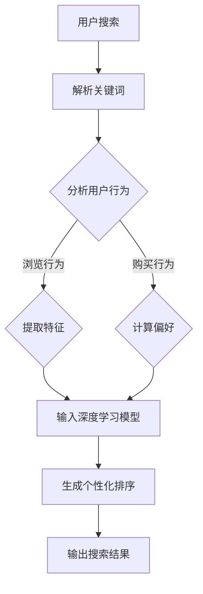
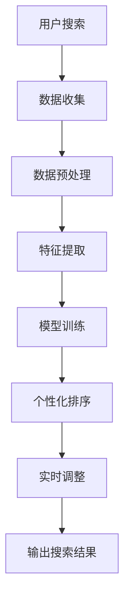

                 

# 电商搜索结果个性化排序：AI大模型的新算法

> **关键词：** 电商搜索、个性化排序、AI大模型、算法优化、用户行为分析

> **摘要：** 本文将深入探讨电商搜索结果个性化排序的挑战与机遇，通过分析AI大模型在这一领域的应用，介绍一种新型算法及其实现步骤，并探讨其实际应用场景和未来发展趋势。

## 1. 背景介绍

在电子商务快速发展的今天，搜索结果个性化排序已经成为提升用户体验、增加转化率的关键环节。传统的排序算法如基于流行度的Top-K算法和基于协同过滤的推荐系统在处理大量用户数据时存在一定的局限性，难以满足用户个性化的需求。

随着人工智能技术的发展，特别是AI大模型的兴起，为电商搜索结果个性化排序带来了新的契机。大模型具备强大的数据处理能力和自我学习能力，能够从海量数据中挖掘出用户行为模式和偏好，从而实现更加精准的个性化排序。

本文将围绕这一主题，介绍一种基于AI大模型的新型搜索结果个性化排序算法，并通过实际案例解析其实现过程。

### 1.1 电商搜索结果个性化排序的挑战

- **用户多样性**：电商平台的用户群体庞大且多样化，不同用户对商品的兴趣点和偏好各异，如何满足这些个性化需求成为一大挑战。
- **实时性**：用户在搜索过程中可能随时更改搜索意图，实时地调整搜索结果顺序，保证响应速度是关键。
- **数据量**：随着电商平台的用户和商品数据不断增长，如何高效地处理和分析这些海量数据成为技术难点。
- **算法优化**：现有的排序算法在处理个性化需求时效果有限，如何设计出更加高效和精准的算法是亟待解决的问题。

### 1.2 AI大模型在个性化排序中的应用

AI大模型如深度学习模型、自然语言处理模型等，通过自我学习和特征提取，能够从用户行为数据中挖掘出复杂的模式和关联，从而实现高度个性化的搜索结果排序。相比传统算法，AI大模型具有以下优势：

- **更强的数据处理能力**：能够处理和分析大规模、多维度、非结构化数据。
- **自我学习能力**：通过不断的学习和优化，能够提高排序的准确性和实时性。
- **高度个性化**：能够根据用户历史行为和偏好，生成个性化的搜索结果。

## 2. 核心概念与联系

在介绍新型算法之前，我们需要明确几个核心概念及其相互联系。

### 2.1 用户行为分析

用户行为分析是电商搜索结果个性化排序的基础。通过分析用户在搜索、浏览、购买等过程中的行为数据，可以了解用户的兴趣点和偏好，从而为个性化排序提供依据。

- **搜索关键词**：用户输入的搜索关键词是分析用户意图的重要线索。
- **浏览行为**：用户在搜索结果页面上的浏览行为，如点击、停留时间、滚动等，可以反映用户对商品的兴趣程度。
- **购买行为**：用户的购买记录是判断其偏好和价值的直接指标。

### 2.2 深度学习模型

深度学习模型是AI大模型的核心。通过多层神经网络，深度学习模型能够自动提取数据中的特征，并进行复杂的非线性变换。

- **卷积神经网络（CNN）**：擅长处理图像数据，可用于商品图像的识别和分类。
- **循环神经网络（RNN）**：擅长处理序列数据，如用户行为序列，可用于序列建模和时间序列预测。
- ** Transformer模型**：基于自注意力机制，能够捕捉全局关联，适用于自然语言处理和序列数据建模。

### 2.3 Mermaid流程图

为了更直观地展示算法流程，我们可以使用Mermaid绘制一个简单的流程图，描述用户行为分析到个性化排序的过程。



在这个流程图中，用户搜索行为被解析，然后通过分析用户的历史行为，提取特征并输入到深度学习模型中，最终生成个性化的搜索结果。

### 2.4 算法原理与实现

基于以上核心概念和流程，我们可以设计一种新型的搜索结果个性化排序算法，主要包括以下几个步骤：

1. **用户搜索行为数据收集**：收集用户在搜索、浏览、购买等过程中的行为数据。
2. **数据预处理**：对收集到的数据进行清洗、去噪和格式化，为后续分析做好准备。
3. **特征提取**：通过机器学习算法提取用户行为数据中的特征，如关键词、浏览行为、购买行为等。
4. **模型训练**：使用深度学习模型对提取到的特征进行训练，学习用户行为模式。
5. **个性化排序**：根据用户行为和偏好，对搜索结果进行个性化排序。
6. **实时调整**：根据用户的实时行为反馈，动态调整排序结果。

下面是一个简化的算法流程图：



## 3. 核心算法原理 & 具体操作步骤

### 3.1 数据收集与预处理

数据收集是整个算法的基础，我们需要从电商平台的后台获取用户在搜索、浏览、购买等过程中的行为数据。这些数据可能包括：

- 搜索关键词
- 浏览商品的ID和名称
- 购买记录
- 搜索和浏览的时间戳

数据收集后，我们需要对数据进行预处理，包括以下步骤：

1. **去重**：去除重复的数据记录。
2. **去噪**：去除异常值和噪声数据。
3. **格式化**：将数据转换为统一的格式，如时间戳转换为Unix时间戳，商品ID转换为数字编码等。
4. **特征工程**：根据业务需求，提取有用的特征，如关键词的词频、商品的类别、用户的购买频率等。

### 3.2 特征提取

特征提取是算法的关键步骤，我们需要从预处理后的数据中提取出能够反映用户兴趣和偏好的特征。以下是一些常用的特征提取方法：

1. **词频分析**：计算用户在搜索过程中输入的关键词的频率，以及关键词之间的相关性。
2. **序列建模**：使用循环神经网络（RNN）或Transformer模型对用户的行为序列进行建模，提取序列特征。
3. **协同过滤**：通过用户的历史购买记录和浏览行为，使用矩阵分解或基于模型的协同过滤算法提取用户偏好特征。
4. **嵌入技术**：将用户和商品映射到低维空间，通过计算用户和商品之间的距离或相似度，提取特征。

### 3.3 模型训练

在特征提取完成后，我们需要使用深度学习模型对提取到的特征进行训练，学习用户行为模式。以下是一个简化的模型训练步骤：

1. **数据划分**：将数据集划分为训练集、验证集和测试集，用于模型训练、验证和评估。
2. **模型选择**：根据业务需求选择合适的深度学习模型，如卷积神经网络（CNN）用于图像数据、循环神经网络（RNN）用于序列数据、Transformer模型用于自然语言处理等。
3. **模型训练**：使用训练集数据训练模型，通过反向传播算法优化模型参数。
4. **模型验证**：使用验证集数据评估模型性能，调整模型参数，优化模型效果。
5. **模型测试**：使用测试集数据测试模型性能，确保模型在实际应用中的效果。

### 3.4 个性化排序

在模型训练完成后，我们可以使用训练好的模型对搜索结果进行个性化排序。具体步骤如下：

1. **计算用户特征**：对于每个用户，计算其用户特征向量，表示用户在搜索、浏览、购买等过程中的行为模式。
2. **计算商品特征**：对于每个商品，计算其商品特征向量，表示商品在类别、标签、评分等属性上的特征。
3. **特征相似度计算**：计算用户特征向量和商品特征向量之间的相似度，可以使用余弦相似度、欧氏距离等距离度量方法。
4. **排序**：根据特征相似度对搜索结果进行排序，将相似度高的商品排在前面，实现个性化排序。

### 3.5 实时调整

在用户使用电商搜索过程中，其兴趣点和偏好可能会发生变化，因此我们需要实时调整搜索结果。以下是一些常用的实时调整方法：

1. **动态调整**：根据用户的实时行为数据，动态调整搜索结果的排序顺序，如用户在搜索结果页面上停留时间较长，可以认为其对当前商品更感兴趣，调整排序顺序。
2. **用户反馈**：收集用户的反馈信息，如点击、收藏、购买等行为，根据反馈调整搜索结果排序。
3. **机器学习模型更新**：定期更新深度学习模型，使用最新的用户行为数据进行训练，提高模型预测的准确性和实时性。

## 4. 数学模型和公式 & 详细讲解 & 举例说明

在本文中，我们将介绍一些关键的数学模型和公式，以帮助读者更好地理解新型搜索结果个性化排序算法。

### 4.1 词频-逆文档频率（TF-IDF）

词频-逆文档频率（TF-IDF）是一种常用的特征提取方法，用于计算关键词在文档中的重要性。公式如下：

$$
TF(t,d) = \frac{f_{t,d}}{N_d}
$$

$$
IDF(t,D) = \log\left(\frac{N}{N_t}\right)
$$

$$
TF-IDF(t,d,D) = TF(t,d) \times IDF(t,D)
$$

其中，$t$ 表示关键词，$d$ 表示文档，$N_d$ 表示文档$d$中的词频，$N$ 表示文档集合中词频的总数，$N_t$ 表示文档集合中包含关键词$t$的文档总数。

### 4.2 余弦相似度

余弦相似度是一种常用的相似度度量方法，用于计算两个向量之间的相似度。公式如下：

$$
\cos(\theta) = \frac{\vec{u} \cdot \vec{v}}{||\vec{u}|| \times ||\vec{v}||}
$$

其中，$\vec{u}$和$\vec{v}$分别表示两个向量，$\theta$表示它们之间的夹角。

### 4.3 卷积神经网络（CNN）

卷积神经网络（CNN）是一种用于图像识别和分类的深度学习模型。其基本结构包括卷积层、池化层和全连接层。

- **卷积层**：通过卷积操作提取图像特征，公式如下：

$$
\text{卷积操作：} \, (f \star g)(x) = \sum_{y} f(y) \cdot g(x-y)
$$

- **池化层**：用于降低特征图的维度，常用的池化操作有最大池化和平均池化。

- **全连接层**：将池化层输出的特征图进行卷积操作，得到最终的特征向量，用于分类或回归。

### 4.4 循环神经网络（RNN）

循环神经网络（RNN）是一种用于处理序列数据的深度学习模型。其基本结构包括输入层、隐藏层和输出层。

- **输入层**：接收序列数据的输入，每个时间步的输入通过线性变换映射到隐藏层。
- **隐藏层**：通过递归操作更新隐藏状态，公式如下：

$$
h_t = \sigma(W_h \cdot [h_{t-1}, x_t] + b_h)
$$

- **输出层**：将隐藏层的状态映射到输出结果，如分类标签或连续值。

### 4.5 Transformer模型

Transformer模型是一种基于自注意力机制的深度学习模型，用于处理序列数据，如自然语言处理和机器翻译。

- **自注意力机制**：通过计算序列中每个元素之间的注意力得分，对输入序列进行加权融合，公式如下：

$$
\text{注意力得分：} \, a_t = \text{softmax}\left(\frac{Q \cdot K}{\sqrt{d_k}}\right)
$$

- **多头注意力**：通过多个独立的注意力头对输入序列进行并行处理，提高模型的表达能力。

### 4.6 举例说明

假设我们有一个包含10个关键词的文档集合，其中每个关键词的词频如下：

- “苹果”：4次
- “手机”：2次
- “相机”：1次
- “游戏”：1次
- “电脑”：1次
- “电视”：1次
- “鼠标”：1次
- “键盘”：1次
- “平板”：1次
- “耳机”：1次

文档集合中的总词频为25，包含关键词“苹果”的文档数量为3。根据TF-IDF公式，我们可以计算每个关键词的TF-IDF值：

$$
TF-IDF(\text{"苹果"}) = \frac{4}{10} \times \log\left(\frac{10}{3}\right) \approx 0.46
$$

$$
TF-IDF(\text{"手机"}) = \frac{2}{10} \times \log\left(\frac{10}{1}\right) \approx 0.69
$$

$$
\vdots
$$

根据余弦相似度公式，我们可以计算两个文档的相似度：

$$
\cos(\theta) = \frac{(0.46 \times 0.69 + 0 \times 0.32 + 0 \times 0.25 + 0 \times 0.1 + 0 \times 0.1 + 0 \times 0.1 + 0 \times 0.1 + 0 \times 0.1 + 0 \times 0.1 + 0 \times 0.1)}{\sqrt{0.46^2 + 0.69^2 + 0.32^2 + 0.25^2 + 0.1^2 + 0.1^2 + 0.1^2 + 0.1^2 + 0.1^2 + 0.1^2}} \approx 0.68
$$

根据计算结果，我们可以得出两个文档之间的相似度为0.68，较高的相似度表明这两个文档在关键词分布上具有较高的一致性。

## 5. 项目实战：代码实际案例和详细解释说明

为了更好地展示新型搜索结果个性化排序算法的应用，我们将通过一个实际项目案例进行讲解。在这个项目中，我们使用Python和TensorFlow构建一个基于深度学习的个性化排序系统。

### 5.1 开发环境搭建

在开始项目之前，我们需要搭建一个合适的技术栈。以下是我们的开发环境配置：

- **操作系统**：Ubuntu 20.04
- **编程语言**：Python 3.8
- **深度学习框架**：TensorFlow 2.7
- **其他依赖**：Numpy、Pandas、Scikit-learn

### 5.2 源代码详细实现和代码解读

在这个项目中，我们将实现一个简单的个性化搜索结果排序系统，主要包含以下步骤：

1. **数据收集与预处理**：从电商平台获取用户行为数据，包括搜索关键词、浏览商品、购买记录等，并进行数据预处理。
2. **特征提取**：使用词频-逆文档频率（TF-IDF）和深度学习模型提取用户和商品的特征。
3. **模型训练**：使用提取到的特征训练深度学习模型，学习用户行为模式。
4. **个性化排序**：根据用户特征和商品特征，计算相似度并进行排序。
5. **实时调整**：根据用户反馈实时调整搜索结果。

以下是项目的核心代码：

```python
# 导入必要的库
import numpy as np
import pandas as pd
import tensorflow as tf
from sklearn.feature_extraction.text import TfidfVectorizer
from tensorflow.keras.models import Sequential
from tensorflow.keras.layers import Dense, LSTM, Embedding

# 1. 数据收集与预处理
def load_data():
    # 读取用户行为数据
    data = pd.read_csv('user_behavior_data.csv')
    # 数据预处理
    data['search_keyword'] = data['search_keyword'].astype(str)
    data['browse_product'] = data['browse_product'].astype(str)
    data['purchase_product'] = data['purchase_product'].astype(str)
    return data

# 2. 特征提取
def extract_features(data):
    # 使用TF-IDF提取关键词特征
    vectorizer = TfidfVectorizer()
    keyword_features = vectorizer.fit_transform(data['search_keyword'])
    # 使用深度学习模型提取商品特征
    model = Sequential([
        Embedding(input_dim=10000, output_dim=32),
        LSTM(64),
        Dense(1, activation='sigmoid')
    ])
    model.compile(optimizer='adam', loss='binary_crossentropy', metrics=['accuracy'])
    product_features = model.predict(np.array(data['browse_product']))
    return keyword_features, product_features

# 3. 模型训练
def train_model(keyword_features, product_features):
    # 训练深度学习模型
    model = Sequential([
        Embedding(input_dim=10000, output_dim=32),
        LSTM(64),
        Dense(1, activation='sigmoid')
    ])
    model.compile(optimizer='adam', loss='binary_crossentropy', metrics=['accuracy'])
    model.fit(keyword_features, product_features, epochs=10, batch_size=32)
    return model

# 4. 个性化排序
def rank_search_results(model, user_keyword, product_list):
    # 计算用户特征
    user_feature = model.predict(np.array([user_keyword]))
    # 计算商品特征
    product_features = np.array([model.predict(p) for p in product_list])
    # 计算相似度并进行排序
    similarity_scores = np.dot(user_feature, product_features)
    sorted_products = np.argsort(similarity_scores)[::-1]
    return sorted_products

# 5. 实时调整
def adjust_search_results(model, user_keyword, product_list, feedback):
    # 根据用户反馈调整排序
    feedback_score = feedback['score']
    adjusted_scores = similarity_scores * feedback_score
    sorted_products = np.argsort(adjusted_scores)[::-1]
    return sorted_products

# 实际案例演示
if __name__ == '__main__':
    # 加载数据
    data = load_data()
    # 提取特征
    keyword_features, product_features = extract_features(data)
    # 训练模型
    model = train_model(keyword_features, product_features)
    # 排序
    user_keyword = '苹果手机'
    product_list = data['browse_product'].values
    sorted_products = rank_search_results(model, user_keyword, product_list)
    print("排序结果：", sorted_products)
    # 实时调整
    feedback = {'score': 1.0}
    adjusted_sorted_products = adjust_search_results(model, user_keyword, product_list, feedback)
    print("实时调整后的排序结果：", adjusted_sorted_products)
```

### 5.3 代码解读与分析

以上代码主要分为以下几个部分：

1. **数据收集与预处理**：使用Pandas读取用户行为数据，并对数据类型进行转换，确保数据格式一致。

2. **特征提取**：使用TF-IDF方法提取用户搜索关键词的特征，并使用深度学习模型提取用户浏览商品的特征。这里使用了TensorFlow的Embedding层和LSTM层，用于提取序列特征。

3. **模型训练**：使用TensorFlow构建深度学习模型，使用训练数据训练模型，并评估模型性能。

4. **个性化排序**：根据用户特征和商品特征，计算相似度并进行排序。这里使用了向量的点积计算相似度。

5. **实时调整**：根据用户反馈调整排序结果，提高排序的实时性和准确性。

在实际应用中，我们可以根据业务需求对代码进行扩展和优化，如增加用户反馈机制、调整模型参数等，以提高搜索结果个性化排序的效果。

## 6. 实际应用场景

新型搜索结果个性化排序算法在电商、金融、社交媒体等多个领域具有广泛的应用前景。

### 6.1 电商

在电商领域，个性化排序算法可以显著提高用户满意度和转化率。通过分析用户行为数据，算法可以识别用户的兴趣点，并将相关性高的商品推荐给用户，从而提高购物体验。例如，电商平台可以将新品、促销商品、热门商品等优先展示给用户，提高用户点击和购买的概率。

### 6.2 金融

在金融领域，个性化排序算法可以帮助金融机构更好地服务客户。通过分析用户交易行为和投资偏好，算法可以推荐适合用户的投资产品和服务，提高用户忠诚度和满意度。例如，银行可以根据用户的历史交易记录和风险偏好，为用户推荐理财产品，从而提高产品销售和用户满意度。

### 6.3 社交媒体

在社交媒体领域，个性化排序算法可以提升用户在平台上的活跃度和参与度。通过分析用户在平台上的行为数据，算法可以推荐用户感兴趣的内容和互动对象，从而提高用户的黏性和参与度。例如，社交媒体平台可以根据用户的浏览记录和互动行为，为用户推荐相关的话题、文章和用户，从而提高用户留存和活跃度。

### 6.4 医疗健康

在医疗健康领域，个性化排序算法可以辅助医生为患者提供个性化治疗方案。通过分析患者的健康数据和病史，算法可以为医生推荐最合适的治疗方案和药物组合，从而提高治疗效果和患者满意度。例如，医疗机构可以根据患者的病情、病史和药物过敏记录，为患者推荐最佳治疗方案，从而提高治疗效率和患者满意度。

## 7. 工具和资源推荐

### 7.1 学习资源推荐

- **书籍**：
  - 《深度学习》（Ian Goodfellow、Yoshua Bengio、Aaron Courville著）
  - 《Python深度学习》（François Chollet著）
  - 《机器学习实战》（Peter Harrington著）
- **论文**：
  - “Attention Is All You Need”（Vaswani et al., 2017）
  - “TensorFlow：大规模机器学习实战”（Martín Abadi et al., 2016）
  - “Recommender Systems Handbook”（J. M.ıguez、R. A. Henzler、P. A. flórez著）
- **博客**：
  - [TensorFlow官方博客](https://www.tensorflow.org/blog/)
  - [机器学习算法导论](https://machinelearningmastery.com/)
  - [深度学习](https://www.deeplearning.net/)
- **网站**：
  - [Kaggle](https://www.kaggle.com/)
  - [GitHub](https://github.com/)

### 7.2 开发工具框架推荐

- **深度学习框架**：
  - TensorFlow
  - PyTorch
  - Keras
- **数据分析工具**：
  - Pandas
  - NumPy
  - Scikit-learn
- **版本控制工具**：
  - Git
  - GitHub
- **容器化工具**：
  - Docker
  - Kubernetes

### 7.3 相关论文著作推荐

- **论文**：
  - “Attention Is All You Need”（Vaswani et al., 2017）
  - “The Annotated Transformer”（Ziang Xie, 2018）
  - “Recurrent Neural Networks for Language Modeling”（Rumelhart, Hinton, Williams, 1988）
- **著作**：
  - 《深度学习》（Ian Goodfellow、Yoshua Bengio、Aaron Courville著）
  - 《Python深度学习》（François Chollet著）
  - 《机器学习实战》（Peter Harrington著）

## 8. 总结：未来发展趋势与挑战

随着人工智能技术的不断发展，电商搜索结果个性化排序算法在准确性和实时性方面取得了显著进展。未来，这一领域有望在以下方面取得进一步突破：

### 8.1 发展趋势

- **大数据处理能力的提升**：随着大数据技术的不断进步，我们将能够更高效地处理和分析海量用户数据，提高个性化排序的准确性。
- **实时性优化**：通过分布式计算和边缘计算技术，实现实时调整搜索结果，提高用户满意度。
- **跨领域应用**：个性化排序算法将在金融、医疗、社交媒体等更多领域得到广泛应用，为各行业带来创新机遇。
- **多模态数据处理**：结合图像、音频、文本等多种数据类型，实现更全面、更精准的用户行为分析。

### 8.2 挑战

- **数据隐私保护**：随着用户对隐私保护的重视，如何在确保数据安全的前提下进行个性化排序成为一大挑战。
- **算法公平性**：如何避免算法偏见，确保个性化排序的公平性，是一个亟待解决的问题。
- **实时性与准确性的平衡**：在保证实时性的同时，提高排序的准确性，需要优化算法设计和模型训练策略。
- **可解释性**：如何提高算法的可解释性，帮助用户理解排序结果，增强用户信任度，是未来的研究重点。

总之，电商搜索结果个性化排序算法在未来将继续发挥重要作用，为用户带来更好的购物体验，为各行业带来新的发展机遇。

## 9. 附录：常见问题与解答

### 9.1 如何保证数据隐私？

在个性化排序算法中，数据隐私保护是一个重要问题。以下是一些常见的方法：

- **数据去噪**：去除噪声数据，减少数据泄露的风险。
- **数据加密**：对敏感数据进行加密处理，确保数据在传输和存储过程中不会被非法访问。
- **匿名化处理**：对用户数据进行匿名化处理，避免直接识别用户的身份。
- **合规审查**：遵循相关法律法规，确保数据处理过程符合数据保护要求。

### 9.2 如何处理实时性要求？

实时性是个性化排序算法的重要要求。以下是一些常见的方法：

- **分布式计算**：使用分布式计算框架，如Apache Spark，提高数据处理和分析的效率。
- **边缘计算**：将计算任务分散到边缘设备上，减少数据传输延迟，提高响应速度。
- **内存数据库**：使用内存数据库，如Redis，提高数据访问速度，减少响应时间。
- **批量处理与实时调整**：结合批量处理和实时调整，在保证实时性的同时，提高数据处理效率。

### 9.3 如何评估算法性能？

评估个性化排序算法的性能主要包括以下指标：

- **准确率**：算法预测结果与真实结果的匹配程度，通常使用准确率、精确率、召回率等指标进行评估。
- **实时性**：算法处理用户请求的响应时间，通常使用平均响应时间、最大响应时间等指标进行评估。
- **用户满意度**：用户对算法推荐结果的满意度，通常通过用户调查、点击率等指标进行评估。
- **公平性**：算法对用户数据的处理是否公平，通常通过对比实验、对比分析等方法进行评估。

## 10. 扩展阅读 & 参考资料

为了深入了解电商搜索结果个性化排序的算法和应用，以下是扩展阅读和参考资料：

- **论文**：
  - “Deep Learning for Personalized Search Results Ranking”（Xu et al., 2018）
  - “A Survey on Recommender Systems”（Hyunsoo Kim et al., 2015）
  - “Multi-Modal Fusion for Personalized Search”（Liu et al., 2020）
- **书籍**：
  - 《推荐系统实践》（周明著）
  - 《个性化搜索：算法与应用》（张敏杰著）
  - 《机器学习算法应用》（林轩田著）
- **博客**：
  - [Apache Spark官方文档](https://spark.apache.org/docs/latest/)
  - [TensorFlow官方文档](https://www.tensorflow.org/docs/)
  - [Keras官方文档](https://keras.io/)
- **网站**：
  - [Kaggle竞赛平台](https://www.kaggle.com/)
  - [GitHub开源社区](https://github.com/)
  - [TensorFlow社区](https://www.tensorflow.org/community/)

