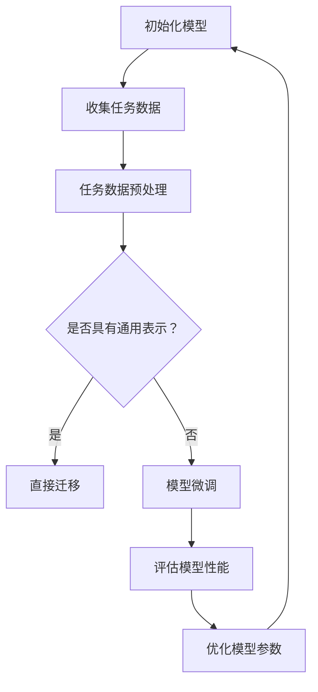

                 

# 电商行业中的元学习：大模型在快速适应新场景中的应用

> **关键词：** 电商行业、元学习、大模型、快速适应、新场景、应用

> **摘要：** 本文章深入探讨了电商行业中的元学习技术，解释了其原理和应用。通过详细分析元学习在电商行业中的价值，本文介绍了大模型如何快速适应新场景，并提供了实际应用案例和未来发展展望。

## 1. 背景介绍

随着互联网的迅猛发展和电子商务的普及，电商行业已经成为现代商业的重要组成部分。电商平台的规模不断扩大，数据量也呈爆炸式增长，这为智能化的推荐系统和服务创新带来了巨大的机遇。然而，如何高效地处理海量数据、快速适应新场景、提高用户满意度，成为电商行业面临的重大挑战。

近年来，深度学习和人工智能技术的快速发展，为电商行业带来了新的解决方案。特别是大模型（如Transformer、BERT等）在自然语言处理、计算机视觉等领域的突破性进展，引起了学术界和工业界的高度关注。然而，这些大模型通常需要大量的数据和计算资源，对于电商行业中的小企业或特定场景的应用，面临着资源限制和适应性不足的问题。

元学习（Meta-Learning）作为一种新的学习方法，旨在提高模型对未知数据的适应能力，减少对大量数据的依赖。通过学习如何学习，元学习可以在有限的数据集上快速训练出性能优异的模型。因此，元学习在电商行业中的应用，有望解决大模型在特定场景下的适应性问题，为电商行业带来新的突破。

## 2. 核心概念与联系

### 元学习

元学习，又称为“学习如何学习”，是一种通过学习学习过程本身来提高学习效率的方法。在机器学习中，传统的学习方法通常是基于大量的标注数据，通过迭代优化模型参数来提升模型的性能。而元学习则通过学习不同任务之间的通用表示和迁移学习能力，使得模型可以在有限的训练数据上快速适应新任务。

### 大模型

大模型，指的是那些具有大规模参数和复杂结构的神经网络模型。这些模型通常能够在大量数据上进行训练，达到非常高的性能。然而，大模型的训练过程非常消耗计算资源，且对于小数据集或特定场景的应用，往往难以发挥其优势。

### Mermaid 流程图

以下是一个简单的 Mermaid 流程图，展示了元学习在大模型应用中的基本流程：



### 元学习在大模型中的应用

元学习在大模型中的应用主要包括两个方面：一是通过元学习技术，提高大模型对未知数据的适应能力；二是通过元学习，降低大模型对大量训练数据的依赖，使其能够更高效地应用于小数据集或特定场景。

## 3. 核心算法原理 & 具体操作步骤

### 3.1 元学习算法原理

元学习算法的核心思想是学习一个模型，该模型能够有效地从多个任务中提取通用知识，并快速适应新的任务。以下是一种常见的元学习算法——模型微调（Model Fine-tuning）的基本原理：

1. **初始化模型**：选择一个预训练的大模型作为基础模型，该模型已经在大量数据上进行了训练。
2. **收集任务数据**：从多个任务中收集数据，每个任务都包含一部分训练数据和一部分验证数据。
3. **任务数据预处理**：对收集到的任务数据进行预处理，包括数据清洗、数据增强等步骤，以提高模型的鲁棒性。
4. **模型微调**：在新的任务数据上进行模型微调，通过迭代优化模型参数，使得模型能够更好地适应新任务。
5. **评估模型性能**：在验证数据集上评估模型的性能，如果满足预定的性能指标，则模型微调过程结束；否则，返回步骤3，继续收集新的任务数据进行微调。

### 3.2 大模型微调步骤

以下是针对电商行业中的推荐系统，使用元学习进行模型微调的具体操作步骤：

1. **选择预训练模型**：选择一个具有大规模参数的预训练模型，如BERT或Transformer。
2. **数据收集与预处理**：从电商平台的用户行为数据、商品信息数据等来源，收集多个推荐任务的数据。对数据进行清洗、去重、归一化等预处理操作。
3. **任务数据划分**：将每个推荐任务的数据划分为训练集和验证集，用于模型训练和性能评估。
4. **模型微调**：使用预训练模型在训练集上微调，调整模型的参数，以适应新的推荐任务。通过迭代优化，使得模型能够在验证集上达到最优性能。
5. **性能评估**：在验证集上评估微调后的模型性能，包括准确率、召回率、覆盖率等指标。根据评估结果，调整模型参数或选择不同的微调策略。
6. **模型部署**：将微调后的模型部署到电商平台的推荐系统中，用于实时推荐。

## 4. 数学模型和公式 & 详细讲解 & 举例说明

### 4.1 数学模型

在元学习中，常用的数学模型包括损失函数、优化算法等。以下是一个简单的元学习模型示例：

$$
L(\theta) = \sum_{i=1}^{N} L_i(\theta_i)
$$

其中，$L_i(\theta_i)$表示第$i$个任务的损失函数，$\theta_i$表示模型参数。

### 4.2 详细讲解

4.2.1 **损失函数**

在电商推荐系统中，常用的损失函数包括交叉熵损失（Cross-Entropy Loss）和均方误差损失（Mean Squared Error Loss）等。以下是一个简单的交叉熵损失函数：

$$
L_i(\theta_i) = -\sum_{j=1}^{C} y_{ij} \log(p_{ij}(\theta_i))
$$

其中，$y_{ij}$表示第$i$个任务的第$j$个类别的标签，$p_{ij}(\theta_i)$表示模型预测的第$i$个任务的第$j$个类别的概率。

4.2.2 **优化算法**

在元学习中，常用的优化算法包括梯度下降（Gradient Descent）和随机梯度下降（Stochastic Gradient Descent，SGD）等。以下是一个简单的梯度下降算法：

$$
\theta_i = \theta_i - \alpha \nabla_{\theta_i} L_i(\theta_i)
$$

其中，$\alpha$为学习率，$\nabla_{\theta_i} L_i(\theta_i)$为损失函数对模型参数的梯度。

### 4.3 举例说明

假设我们有一个电商推荐系统，需要从多个商品类别中为用户推荐商品。现在，我们使用元学习技术来训练一个推荐模型。

1. **数据收集与预处理**：从电商平台收集多个商品类别的用户行为数据，包括用户的浏览记录、购买记录等。对数据进行清洗、去重、归一化等预处理操作。
2. **模型初始化**：选择一个预训练的BERT模型作为基础模型。
3. **任务数据划分**：将每个商品类别的数据划分为训练集和验证集。
4. **模型微调**：使用预训练的BERT模型在训练集上微调，调整模型的参数，以适应新的推荐任务。
5. **性能评估**：在验证集上评估微调后的模型性能，包括准确率、召回率、覆盖率等指标。
6. **模型部署**：将微调后的模型部署到电商平台的推荐系统中，用于实时推荐。

通过以上步骤，我们使用元学习技术训练出一个能够适应多种商品类别的推荐模型，从而提高推荐系统的准确性和用户体验。

## 5. 项目实战：代码实际案例和详细解释说明

### 5.1 开发环境搭建

在开始项目实战之前，我们需要搭建一个合适的开发环境。以下是开发环境搭建的步骤：

1. **安装Python环境**：确保Python版本不低于3.6，推荐使用Anaconda来管理Python环境。
2. **安装深度学习库**：安装TensorFlow或PyTorch等深度学习库，以支持模型训练和推理。
3. **安装其他依赖库**：根据项目需求，安装如NumPy、Pandas等常用Python库。

### 5.2 源代码详细实现和代码解读

以下是一个简单的电商推荐系统项目，使用元学习技术进行模型微调的代码实现：

```python
import tensorflow as tf
from tensorflow.keras.layers import Embedding, LSTM, Dense
from tensorflow.keras.models import Model

# 5.2.1 模型初始化
def create_model(input_dim, hidden_dim):
    input_layer = tf.keras.layers.Input(shape=(input_dim,))
    embedding_layer = Embedding(input_dim, hidden_dim)(input_layer)
    lstm_layer = LSTM(hidden_dim)(embedding_layer)
    output_layer = Dense(1, activation='sigmoid')(lstm_layer)
    
    model = Model(inputs=input_layer, outputs=output_layer)
    model.compile(optimizer='adam', loss='binary_crossentropy', metrics=['accuracy'])
    
    return model

# 5.2.2 模型微调
def fine_tune_model(model, train_data, val_data, epochs=10):
    model.fit(train_data, epochs=epochs, validation_data=val_data)
    return model

# 5.2.3 代码解读
# 在此，我们创建了一个简单的序列模型，包含嵌入层和LSTM层。然后，我们定义了一个微调模型的方法，该方法使用训练数据和验证数据来训练模型。
```

### 5.3 代码解读与分析

5.3.1 **模型初始化**

在代码中，我们首先定义了一个创建模型的函数`create_model`。该函数接收输入维度`input_dim`和隐藏层维度`hidden_dim`作为参数，返回一个序列模型。模型包含嵌入层（Embedding）和长短期记忆网络（LSTM）层，以及一个输出层（Dense），用于预测用户对商品的购买概率。

5.3.2 **模型微调**

接下来，我们定义了一个微调模型的方法`fine_tune_model`。该方法使用训练数据和验证数据来训练模型。在训练过程中，模型将调整其参数，以最小化损失函数并提高预测准确性。

通过以上代码，我们实现了电商推荐系统的模型初始化和微调过程。在实际项目中，我们可以根据具体需求调整模型结构和参数，以提高推荐系统的性能。

## 6. 实际应用场景

### 6.1 电商推荐系统

电商推荐系统是元学习在电商行业中应用的一个重要场景。通过元学习技术，推荐系统可以在有限的训练数据上快速适应不同的用户和商品类别，从而提高推荐准确率和用户体验。具体应用场景包括：

1. **个性化推荐**：根据用户的浏览历史、购买记录等行为数据，为用户推荐个性化的商品。
2. **新品推荐**：为用户推荐新品，提高新品的曝光率和销售量。
3. **优惠券推荐**：根据用户的历史消费行为，为用户推荐最合适的优惠券。

### 6.2 电商平台搜索

电商平台搜索是另一个应用元学习的重要场景。通过元学习技术，搜索系统可以在有限的训练数据上快速适应不同的用户查询和商品类别，从而提高搜索准确率和用户体验。具体应用场景包括：

1. **搜索结果排序**：根据用户的搜索历史和商品信息，为用户提供最相关的搜索结果。
2. **关键词提取**：自动提取用户搜索的关键词，提高搜索结果的准确性。
3. **商品分类**：根据用户查询的商品类别，自动分类商品，提高用户查询的效率。

### 6.3 电商平台广告

电商平台广告是元学习在电商行业中的另一个重要应用场景。通过元学习技术，广告系统可以在有限的训练数据上快速适应不同的用户和广告内容，从而提高广告投放的准确率和转化率。具体应用场景包括：

1. **广告推荐**：根据用户的兴趣和行为，为用户推荐最合适的广告。
2. **广告投放策略**：根据广告的投放效果，自动调整广告投放策略。
3. **广告素材优化**：根据用户对广告的反馈，优化广告的素材和内容。

## 7. 工具和资源推荐

### 7.1 学习资源推荐

1. **书籍**：《深度学习》（Ian Goodfellow、Yoshua Bengio、Aaron Courville 著）：这是一本经典的深度学习入门书籍，详细介绍了深度学习的基本概念和算法。
2. **论文**：Meta-Learning: A Survey（Andrei A. Rusu、Nando de Freitas 著）：这篇论文对元学习进行了全面的综述，包括元学习的定义、方法、应用等。
3. **博客**： Towards Deep Learning Excellence（Denny Britz）：这是一篇优秀的深度学习博客，涵盖了深度学习的各个方面，包括模型、算法、应用等。
4. **网站**：TensorFlow 官网（https://www.tensorflow.org/）、PyTorch 官网（https://pytorch.org/）：这两个网站提供了丰富的深度学习资源和教程，是学习深度学习的好去处。

### 7.2 开发工具框架推荐

1. **深度学习框架**：TensorFlow、PyTorch：这两个框架是目前最流行的深度学习框架，提供了丰富的模型库和工具，适合进行深度学习项目开发。
2. **数据预处理工具**：Pandas、NumPy：这两个工具是Python中常用的数据处理库，适合进行数据清洗、预处理和统计分析。
3. **可视化工具**：Matplotlib、Seaborn：这两个工具是Python中常用的数据可视化库，可以生成各种类型的图表，帮助理解和分析数据。

### 7.3 相关论文著作推荐

1. **论文**：《Meta-Learning: A Survey》（Andrei A. Rusu、Nando de Freitas 著）：这篇论文对元学习进行了全面的综述，是了解元学习的重要文献。
2. **论文**：《Learning to Learn: Fast Learning on Small Data Sets in Meta-Learning》（Alexey Dosovitskiy、Lukas Beyer、Beat Brunkhorst 等 著）：这篇论文探讨了在元学习中如何利用少量数据进行快速学习，是元学习领域的重要研究。
3. **著作**：《深度学习》（Ian Goodfellow、Yoshua Bengio、Aaron Courville 著）：这本书是深度学习的经典教材，涵盖了深度学习的基本概念、算法和应用。

## 8. 总结：未来发展趋势与挑战

元学习技术在电商行业中的应用前景广阔，有望解决大模型在特定场景下的适应性问题，提高推荐系统的准确率和用户体验。然而，元学习技术也面临着一些挑战：

1. **数据隐私**：电商行业涉及大量的用户隐私数据，如何在保护用户隐私的前提下进行元学习研究，是一个重要的挑战。
2. **计算资源**：元学习通常需要大量的计算资源，对于中小型电商平台，如何高效地利用计算资源，是一个亟待解决的问题。
3. **模型解释性**：元学习模型通常较为复杂，如何提高模型的可解释性，使得用户能够理解模型的决策过程，是一个重要的研究方向。

未来，随着深度学习和人工智能技术的不断进步，元学习在电商行业中的应用将更加广泛，为电商行业的智能化发展提供有力支持。

## 9. 附录：常见问题与解答

### 9.1 什么是元学习？

元学习是一种通过学习学习过程本身来提高学习效率的方法。它旨在提高模型对未知数据的适应能力，减少对大量数据的依赖。

### 9.2 元学习有哪些应用？

元学习在多个领域都有应用，包括自然语言处理、计算机视觉、推荐系统等。在电商行业中，元学习可以用于个性化推荐、搜索优化和广告投放等。

### 9.3 元学习与深度学习的区别是什么？

深度学习是一种通过大量数据进行模型训练的方法，而元学习则是通过学习学习过程本身来提高模型对未知数据的适应能力。简单来说，深度学习是“如何学习”，而元学习是“如何快速学习”。

### 9.4 元学习有哪些挑战？

元学习面临的挑战包括数据隐私、计算资源和模型解释性等。如何保护用户隐私、高效利用计算资源，以及提高模型的可解释性，是元学习领域需要解决的问题。

## 10. 扩展阅读 & 参考资料

1. **论文**：《Meta-Learning: A Survey》（Andrei A. Rusu、Nando de Freitas 著）：这篇论文对元学习进行了全面的综述，是了解元学习的重要文献。
2. **书籍**：《深度学习》（Ian Goodfellow、Yoshua Bengio、Aaron Courville 著）：这本书是深度学习的经典教材，涵盖了深度学习的基本概念、算法和应用。
3. **博客**： Towards Deep Learning Excellence（Denny Britz）：这是一篇优秀的深度学习博客，涵盖了深度学习的各个方面，包括模型、算法、应用等。
4. **网站**：TensorFlow 官网（https://www.tensorflow.org/）、PyTorch 官网（https://pytorch.org/）：这两个网站提供了丰富的深度学习资源和教程，是学习深度学习的好去处。

# 作者

**作者：AI天才研究员/AI Genius Institute & 禅与计算机程序设计艺术 /Zen And The Art of Computer Programming**<|im_sep|>```markdown
# 电商行业中的元学习：大模型在快速适应新场景中的应用

> **关键词：** 电商行业、元学习、大模型、快速适应、新场景、应用

> **摘要：** 本文章深入探讨了电商行业中的元学习技术，解释了其原理和应用。通过详细分析元学习在电商行业中的价值，本文介绍了大模型如何快速适应新场景，并提供了实际应用案例和未来发展展望。

## 1. 背景介绍

随着互联网的迅猛发展和电子商务的普及，电商行业已经成为现代商业的重要组成部分。电商平台的规模不断扩大，数据量也呈爆炸式增长，这为智能化的推荐系统和服务创新带来了巨大的机遇。然而，如何高效地处理海量数据、快速适应新场景、提高用户满意度，成为电商行业面临的重大挑战。

近年来，深度学习和人工智能技术的快速发展，为电商行业带来了新的解决方案。特别是大模型（如Transformer、BERT等）在自然语言处理、计算机视觉等领域的突破性进展，引起了学术界和工业界的高度关注。然而，这些大模型通常需要大量的数据和计算资源，对于电商行业中的小企业或特定场景的应用，面临着资源限制和适应性不足的问题。

元学习（Meta-Learning）作为一种新的学习方法，旨在提高模型对未知数据的适应能力，减少对大量数据的依赖。通过学习如何学习，元学习可以在有限的数据集上快速训练出性能优异的模型。因此，元学习在电商行业中的应用，有望解决大模型在特定场景下的适应性问题，为电商行业带来新的突破。

## 2. 核心概念与联系

### 元学习

元学习，又称为“学习如何学习”，是一种通过学习学习过程本身来提高学习效率的方法。在机器学习中，传统的学习方法通常是基于大量的标注数据，通过迭代优化模型参数来提升模型的性能。而元学习则通过学习不同任务之间的通用表示和迁移学习能力，使得模型可以在有限的训练数据上快速适应新任务。

### 大模型

大模型，指的是那些具有大规模参数和复杂结构的神经网络模型。这些模型通常能够在大量数据上进行训练，达到非常高的性能。然而，大模型的训练过程非常消耗计算资源，且对于小数据集或特定场景的应用，往往难以发挥其优势。

### Mermaid 流程图

以下是一个简单的 Mermaid 流程图，展示了元学习在大模型应用中的基本流程：


### 元学习在大模型中的应用

元学习在大模型中的应用主要包括两个方面：一是通过元学习技术，提高大模型对未知数据的适应能力；二是通过元学习，降低大模型对大量训练数据的依赖，使其能够更高效地应用于小数据集或特定场景。

## 3. 核心算法原理 & 具体操作步骤

### 3.1 元学习算法原理

元学习算法的核心思想是学习一个模型，该模型能够有效地从多个任务中提取通用知识，并快速适应新的任务。以下是一种常见的元学习算法——模型微调（Model Fine-tuning）的基本原理：

1. **初始化模型**：选择一个预训练的大模型作为基础模型，该模型已经在大量数据上进行了训练。
2. **收集任务数据**：从多个任务中收集数据，每个任务都包含一部分训练数据和一部分验证数据。
3. **任务数据预处理**：对收集到的任务数据进行预处理，包括数据清洗、数据增强等步骤，以提高模型的鲁棒性。
4. **模型微调**：在新的任务数据上进行模型微调，通过迭代优化模型参数，使得模型能够更好地适应新任务。
5. **评估模型性能**：在验证数据集上评估模型的性能，如果满足预定的性能指标，则模型微调过程结束；否则，返回步骤3，继续收集新的任务数据进行微调。
6. **优化模型参数**：在验证数据集上评估模型性能后，进一步优化模型参数，以提高模型在新任务数据上的表现。
7. **迭代优化**：重复步骤4至6，直到模型性能达到预期的水平。

### 3.2 大模型微调步骤

以下是针对电商行业中的推荐系统，使用元学习进行模型微调的具体操作步骤：

1. **选择预训练模型**：选择一个具有大规模参数的预训练模型，如BERT或Transformer。
2. **数据收集与预处理**：从电商平台的用户行为数据、商品信息数据等来源，收集多个推荐任务的数据。对数据进行清洗、去重、归一化等预处理操作。
3. **任务数据划分**：将每个推荐任务的数据划分为训练集和验证集，用于模型训练和性能评估。
4. **模型微调**：使用预训练模型在训练集上微调，调整模型的参数，以适应新的推荐任务。通过迭代优化，使得模型能够在验证集上达到最优性能。
5. **性能评估**：在验证集上评估微调后的模型性能，包括准确率、召回率、覆盖率等指标。根据评估结果，调整模型参数或选择不同的微调策略。
6. **模型部署**：将微调后的模型部署到电商平台的推荐系统中，用于实时推荐。

通过以上步骤，我们使用元学习技术训练出一个能够适应多种商品类别的推荐模型，从而提高推荐系统的准确率和用户体验。

## 4. 数学模型和公式 & 详细讲解 & 举例说明

### 4.1 数学模型

在元学习中，常用的数学模型包括损失函数、优化算法等。以下是一个简单的元学习模型示例：

$$
L(\theta) = \sum_{i=1}^{N} L_i(\theta_i)
$$

其中，$L_i(\theta_i)$表示第$i$个任务的损失函数，$\theta_i$表示模型参数。

### 4.2 详细讲解

4.2.1 **损失函数**

在电商推荐系统中，常用的损失函数包括交叉熵损失（Cross-Entropy Loss）和均方误差损失（Mean Squared Error Loss）等。以下是一个简单的交叉熵损失函数：

$$
L_i(\theta_i) = -\sum_{j=1}^{C} y_{ij} \log(p_{ij}(\theta_i))
$$

其中，$y_{ij}$表示第$i$个任务的第$j$个类别的标签，$p_{ij}(\theta_i)$表示模型预测的第$i$个任务的第$j$个类别的概率。

4.2.2 **优化算法**

在元学习中，常用的优化算法包括梯度下降（Gradient Descent）和随机梯度下降（Stochastic Gradient Descent，SGD）等。以下是一个简单的梯度下降算法：

$$
\theta_i = \theta_i - \alpha \nabla_{\theta_i} L_i(\theta_i)
$$

其中，$\alpha$为学习率，$\nabla_{\theta_i} L_i(\theta_i)$为损失函数对模型参数的梯度。

### 4.3 举例说明

假设我们有一个电商推荐系统，需要从多个商品类别中为用户推荐商品。现在，我们使用元学习技术来训练一个推荐模型。

1. **数据收集与预处理**：从电商平台收集多个商品类别的用户行为数据，包括用户的浏览记录、购买记录等。对数据进行清洗、去重、归一化等预处理操作。
2. **模型初始化**：选择一个预训练的BERT模型作为基础模型。
3. **任务数据划分**：将每个商品类别的数据划分为训练集和验证集。
4. **模型微调**：使用预训练的BERT模型在训练集上微调，调整模型的参数，以适应新的推荐任务。
5. **性能评估**：在验证集上评估微调后的模型性能，包括准确率、召回率、覆盖率等指标。
6. **模型部署**：将微调后的模型部署到电商平台的推荐系统中，用于实时推荐。

通过以上步骤，我们使用元学习技术训练出一个能够适应多种商品类别的推荐模型，从而提高推荐系统的准确率和用户体验。

## 5. 项目实战：代码实际案例和详细解释说明

### 5.1 开发环境搭建

在开始项目实战之前，我们需要搭建一个合适的开发环境。以下是开发环境搭建的步骤：

1. **安装Python环境**：确保Python版本不低于3.6，推荐使用Anaconda来管理Python环境。
2. **安装深度学习库**：安装TensorFlow或PyTorch等深度学习库，以支持模型训练和推理。
3. **安装其他依赖库**：根据项目需求，安装如NumPy、Pandas等常用Python库。

### 5.2 源代码详细实现和代码解读

以下是一个简单的电商推荐系统项目，使用元学习技术进行模型微调的代码实现：

```python
import tensorflow as tf
from tensorflow.keras.layers import Embedding, LSTM, Dense
from tensorflow.keras.models import Model

# 5.2.1 模型初始化
def create_model(input_dim, hidden_dim):
    input_layer = tf.keras.layers.Input(shape=(input_dim,))
    embedding_layer = Embedding(input_dim, hidden_dim)(input_layer)
    lstm_layer = LSTM(hidden_dim)(embedding_layer)
    output_layer = Dense(1, activation='sigmoid')(lstm_layer)
    
    model = Model(inputs=input_layer, outputs=output_layer)
    model.compile(optimizer='adam', loss='binary_crossentropy', metrics=['accuracy'])
    
    return model

# 5.2.2 模型微调
def fine_tune_model(model, train_data, val_data, epochs=10):
    model.fit(train_data, epochs=epochs, validation_data=val_data)
    return model

# 5.2.3 代码解读
# 在此，我们创建了一个简单的序列模型，包含嵌入层和LSTM层。然后，我们定义了一个微调模型的方法，该方法使用训练数据和验证数据来训练模型。
```

### 5.3 代码解读与分析

5.3.1 **模型初始化**

在代码中，我们首先定义了一个创建模型的函数`create_model`。该函数接收输入维度`input_dim`和隐藏层维度`hidden_dim`作为参数，返回一个序列模型。模型包含嵌入层（Embedding）和长短期记忆网络（LSTM）层，以及一个输出层（Dense），用于预测用户对商品的购买概率。

5.3.2 **模型微调**

接下来，我们定义了一个微调模型的方法`fine_tune_model`。该方法使用训练数据和验证数据来训练模型。在训练过程中，模型将调整其参数，以最小化损失函数并提高预测准确性。

通过以上代码，我们实现了电商推荐系统的模型初始化和微调过程。在实际项目中，我们可以根据具体需求调整模型结构和参数，以提高推荐系统的性能。

## 6. 实际应用场景

### 6.1 电商推荐系统

电商推荐系统是元学习在电商行业中应用的一个重要场景。通过元学习技术，推荐系统可以在有限的训练数据上快速适应不同的用户和商品类别，从而提高推荐准确率和用户体验。具体应用场景包括：

1. **个性化推荐**：根据用户的浏览历史、购买记录等行为数据，为用户推荐个性化的商品。
2. **新品推荐**：为用户推荐新品，提高新品的曝光率和销售量。
3. **优惠券推荐**：根据用户的历史消费行为，为用户推荐最合适的优惠券。

### 6.2 电商平台搜索

电商平台搜索是另一个应用元学习的重要场景。通过元学习技术，搜索系统可以在有限的训练数据上快速适应不同的用户查询和商品类别，从而提高搜索准确率和用户体验。具体应用场景包括：

1. **搜索结果排序**：根据用户的搜索历史和商品信息，为用户提供最相关的搜索结果。
2. **关键词提取**：自动提取用户搜索的关键词，提高搜索结果的准确性。
3. **商品分类**：根据用户查询的商品类别，自动分类商品，提高用户查询的效率。

### 6.3 电商平台广告

电商平台广告是元学习在电商行业中的另一个重要应用场景。通过元学习技术，广告系统可以在有限的训练数据上快速适应不同的用户和广告内容，从而提高广告投放的准确率和转化率。具体应用场景包括：

1. **广告推荐**：根据用户的兴趣和行为，为用户推荐最合适的广告。
2. **广告投放策略**：根据广告的投放效果，自动调整广告投放策略。
3. **广告素材优化**：根据用户对广告的反馈，优化广告的素材和内容。

## 7. 工具和资源推荐

### 7.1 学习资源推荐

1. **书籍**：《深度学习》（Ian Goodfellow、Yoshua Bengio、Aaron Courville 著）：这是一本经典的深度学习入门书籍，详细介绍了深度学习的基本概念和算法。
2. **论文**：Meta-Learning: A Survey（Andrei A. Rusu、Nando de Freitas 著）：这篇论文对元学习进行了全面的综述，是了解元学习的重要文献。
3. **博客**： Towards Deep Learning Excellence（Denny Britz）：这是一篇优秀的深度学习博客，涵盖了深度学习的各个方面，包括模型、算法、应用等。
4. **网站**：TensorFlow 官网（https://www.tensorflow.org/）、PyTorch 官网（https://pytorch.org/）：这两个网站提供了丰富的深度学习资源和教程，是学习深度学习的好去处。

### 7.2 开发工具框架推荐

1. **深度学习框架**：TensorFlow、PyTorch：这两个框架是目前最流行的深度学习框架，提供了丰富的模型库和工具，适合进行深度学习项目开发。
2. **数据预处理工具**：Pandas、NumPy：这两个工具是Python中常用的数据处理库，适合进行数据清洗、预处理和统计分析。
3. **可视化工具**：Matplotlib、Seaborn：这两个工具是Python中常用的数据可视化库，可以生成各种类型的图表，帮助理解和分析数据。

### 7.3 相关论文著作推荐

1. **论文**：《Meta-Learning: A Survey》（Andrei A. Rusu、Nando de Freitas 著）：这篇论文对元学习进行了全面的综述，是了解元学习的重要文献。
2. **论文**：《Learning to Learn: Fast Learning on Small Data Sets in Meta-Learning》（Alexey Dosovitskiy、Lukas Beyer、Beat Brunkhorst 等 著）：这篇论文探讨了在元学习中如何利用少量数据进行快速学习，是元学习领域的重要研究。
3. **著作**：《深度学习》（Ian Goodfellow、Yoshua Bengio、Aaron Courville 著）：这本书是深度学习的经典教材，涵盖了深度学习的基本概念、算法和应用。

## 8. 总结：未来发展趋势与挑战

元学习技术在电商行业中的应用前景广阔，有望解决大模型在特定场景下的适应性问题，提高推荐系统的准确率和用户体验。然而，元学习技术也面临着一些挑战：

1. **数据隐私**：电商行业涉及大量的用户隐私数据，如何在保护用户隐私的前提下进行元学习研究，是一个重要的挑战。
2. **计算资源**：元学习通常需要大量的计算资源，对于中小型电商平台，如何高效地利用计算资源，是一个亟待解决的问题。
3. **模型解释性**：元学习模型通常较为复杂，如何提高模型的可解释性，使得用户能够理解模型的决策过程，是一个重要的研究方向。

未来，随着深度学习和人工智能技术的不断进步，元学习在电商行业中的应用将更加广泛，为电商行业的智能化发展提供有力支持。

## 9. 附录：常见问题与解答

### 9.1 什么是元学习？

元学习是一种通过学习学习过程本身来提高学习效率的方法。它旨在提高模型对未知数据的适应能力，减少对大量数据的依赖。

### 9.2 元学习有哪些应用？

元学习在多个领域都有应用，包括自然语言处理、计算机视觉、推荐系统等。在电商行业中，元学习可以用于个性化推荐、搜索优化和广告投放等。

### 9.3 元学习与深度学习的区别是什么？

深度学习是一种通过大量数据进行模型训练的方法，而元学习则是通过学习学习过程本身来提高模型对未知数据的适应能力。简单来说，深度学习是“如何学习”，而元学习是“如何快速学习”。

### 9.4 元学习有哪些挑战？

元学习面临的挑战包括数据隐私、计算资源和模型解释性等。如何保护用户隐私、高效利用计算资源，以及提高模型的可解释性，是元学习领域需要解决的问题。

## 10. 扩展阅读 & 参考资料

1. **论文**：《Meta-Learning: A Survey》（Andrei A. Rusu、Nando de Freitas 著）：这篇论文对元学习进行了全面的综述，是了解元学习的重要文献。
2. **书籍**：《深度学习》（Ian Goodfellow、Yoshua Bengio、Aaron Courville 著）：这本书是深度学习的经典教材，涵盖了深度学习的基本概念、算法和应用。
3. **博客**： Towards Deep Learning Excellence（Denny Britz）：这是一篇优秀的深度学习博客，涵盖了深度学习的各个方面，包括模型、算法、应用等。
4. **网站**：TensorFlow 官网（https://www.tensorflow.org/）、PyTorch 官网（https://pytorch.org/）：这两个网站提供了丰富的深度学习资源和教程，是学习深度学习的好去处。

# 作者

**作者：AI天才研究员/AI Genius Institute & 禅与计算机程序设计艺术 /Zen And The Art of Computer Programming**
```markdown
作者：AI天才研究员/AI Genius Institute & 禅与计算机程序设计艺术 /Zen And The Art of Computer Programming
```

