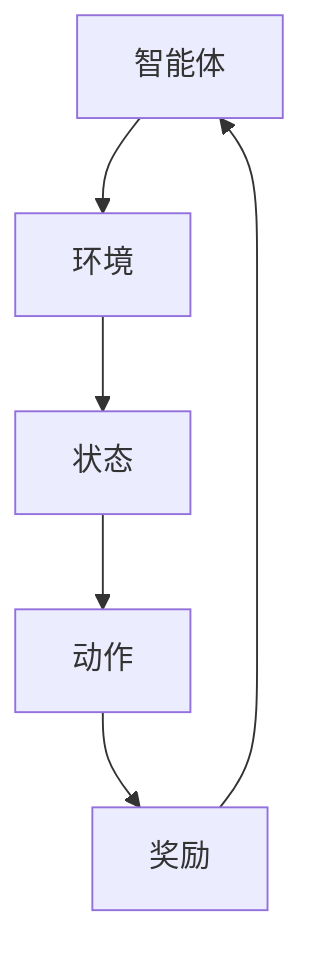

                 

# 《电商行业中的增强学习：大模型的实践与挑战》

## 关键词
- 电商行业
- 增强学习
- 大模型
- 实践
- 挑战
- 技术应用

## 摘要
本文将深入探讨电商行业中的增强学习技术，以及其在大模型实践中的应用与面临挑战。文章将从背景介绍、核心概念与联系、算法原理、数学模型、项目实战、实际应用场景、工具和资源推荐等多个方面，全面解析电商行业中增强学习的应用现状、未来发展，以及所需解决的问题。通过本文的阅读，读者将更好地理解增强学习在电商行业中的重要性，掌握其基本原理和应用方法，为未来的发展做好准备。

## 1. 背景介绍

电商行业自上世纪末以来经历了迅猛发展，成为全球经济增长的重要驱动力。随着互联网技术的不断进步，电子商务平台如淘宝、京东、亚马逊等迅速崛起，不断优化用户体验，提升销售效率。然而，随着市场的饱和和竞争的加剧，电商行业逐渐意识到传统营销手段的局限性，需要寻找新的技术手段来提升用户体验、增加销售额。

### 1.1 增强学习的概念与优势

增强学习（Reinforcement Learning，简称RL）是机器学习的一种类型，通过智能体与环境的交互来学习策略，以达到最优目标。与监督学习和无监督学习不同，增强学习更关注于如何通过不断试错，从经验中学习，逐步优化决策。

增强学习的优势在于：

1. **自适应能力**：增强学习系统能够根据环境的变化，不断调整和优化策略，具有很强的适应性。
2. **实时反馈**：增强学习系统在执行决策的同时，会立即获得反馈，通过反馈不断调整策略，提高学习效率。
3. **智能决策**：增强学习系统能够通过自我学习，从大量数据中提取有用信息，实现智能决策。

### 1.2 大模型的概念与优势

大模型（Large-scale Model）是指拥有大量参数、能够处理大规模数据的深度学习模型。近年来，随着计算能力的提升和大数据技术的发展，大模型在各个领域取得了显著的成果。大模型的优势包括：

1. **更强的表达能力**：大模型拥有更多的参数，能够更好地捕捉数据中的复杂结构，提高模型的表现力。
2. **更高的计算效率**：大模型可以通过分布式计算等方式，提高计算效率，适用于大规模数据处理。
3. **更广泛的应用场景**：大模型可以应用于图像识别、自然语言处理、推荐系统等多个领域，具有广泛的应用前景。

## 2. 核心概念与联系

为了更好地理解电商行业中的增强学习技术，我们需要从以下几个核心概念出发：

### 2.1 增强学习的基本原理

增强学习的基本原理包括以下几个部分：

1. **智能体（Agent）**：智能体是指执行行动并从环境中获取反馈的实体。在电商行业中，智能体可以是电商平台、机器人等。
2. **环境（Environment）**：环境是指智能体执行行动的场所，可以是对抗环境（如竞争对手）或模拟环境（如实验平台）。
3. **状态（State）**：状态是描述智能体在某一时刻所处的环境情况。在电商行业中，状态可以包括用户行为、产品信息等。
4. **动作（Action）**：动作是智能体在某一状态下的可能行为。在电商行业中，动作可以是推荐产品、发送广告等。
5. **奖励（Reward）**：奖励是智能体执行动作后获得的反馈，用来评估动作的好坏。在电商行业中，奖励可以是销售额、用户满意度等。

### 2.2 大模型的基本原理

大模型的基本原理包括：

1. **神经网络（Neural Network）**：神经网络是模拟人脑神经元连接的计算机模型，能够通过学习数据中的特征，实现数据的分类、回归等任务。
2. **深度学习（Deep Learning）**：深度学习是神经网络的一种，通过堆叠多层神经网络，实现对复杂数据的建模和处理。
3. **大规模数据（Large-scale Data）**：大规模数据是指包含大量样本的数据集，能够提供更多的训练信息，提高模型的泛化能力。

### 2.3 Mermaid 流程图

为了更直观地展示增强学习在大模型中的实现过程，我们可以使用 Mermaid 流程图来表示：



在电商行业中，智能体可以是电商平台或机器人，环境可以是对抗环境或模拟环境，状态可以是用户行为、产品信息等，动作可以是推荐产品、发送广告等，奖励可以是销售额、用户满意度等。通过这样的流程图，我们可以清晰地看到增强学习在大模型中的应用过程。

## 3. 核心算法原理 & 具体操作步骤

### 3.1 增强学习算法的基本原理

增强学习算法主要包括以下几个步骤：

1. **初始化**：初始化智能体、环境、状态、动作和奖励。
2. **状态-动作评估**：评估智能体在某一状态下的动作值，以确定下一步的行动。
3. **策略学习**：根据状态-动作评估结果，调整智能体的策略，使其在特定状态下选择最优动作。
4. **更新策略**：根据反馈的奖励，更新智能体的策略，以实现长期最优。
5. **迭代优化**：不断重复上述步骤，直到达到预期目标。

### 3.2 增强学习算法的具体操作步骤

在电商行业中，我们可以使用以下步骤来实现增强学习算法：

1. **数据预处理**：收集用户行为、产品信息等数据，进行数据清洗、去噪、归一化等预处理操作。
2. **构建状态空间**：根据数据特征，构建状态空间，为智能体提供决策依据。
3. **定义动作空间**：根据业务需求，定义动作空间，如推荐产品、发送广告等。
4. **初始化参数**：初始化智能体、环境、状态、动作和奖励的参数。
5. **策略学习**：通过状态-动作评估，学习智能体的策略，选择最优动作。
6. **更新策略**：根据反馈的奖励，更新智能体的策略，实现长期最优。
7. **迭代优化**：不断重复上述步骤，优化智能体的决策能力。

### 3.3 增强学习算法的应用案例

以电商平台推荐系统为例，我们可以使用增强学习算法来优化推荐策略。具体步骤如下：

1. **数据预处理**：收集用户行为数据，如浏览记录、购买记录等，进行数据清洗和预处理。
2. **构建状态空间**：根据用户行为数据，构建状态空间，包括用户兴趣、产品特征等。
3. **定义动作空间**：根据业务需求，定义动作空间，如推荐产品、发送广告等。
4. **初始化参数**：初始化智能体、环境、状态、动作和奖励的参数。
5. **策略学习**：通过状态-动作评估，学习智能体的策略，选择最优动作。
6. **更新策略**：根据反馈的奖励，更新智能体的策略，实现长期最优。
7. **迭代优化**：不断重复上述步骤，优化智能体的决策能力。

通过这样的应用案例，我们可以看到增强学习算法在电商行业中的实际应用效果，为电商平台提供更智能、更高效的推荐系统。

## 4. 数学模型和公式 & 详细讲解 & 举例说明

### 4.1 增强学习的基本数学模型

在增强学习中，常用的数学模型包括马尔可夫决策过程（MDP）和部分可观测马尔可夫决策过程（POMDP）。

#### 马尔可夫决策过程（MDP）

MDP是一种描述智能体与环境的交互的数学模型，其基本公式如下：

$$
\begin{aligned}
    p(s_{t+1} | s_t, a_t) &= p(s_{t+1} | s_t), \\
    r_t &= r(s_t, a_t), \\
    \pi(a_t | s_t) &= P(a_t | s_t).
\end{aligned}
$$

其中：

- $s_t$ 表示时刻 $t$ 的状态；
- $a_t$ 表示时刻 $t$ 的动作；
- $s_{t+1}$ 表示时刻 $t+1$ 的状态；
- $r_t$ 表示时刻 $t$ 的奖励；
- $\pi(a_t | s_t)$ 表示在状态 $s_t$ 下采取动作 $a_t$ 的概率。

#### 部分可观测马尔可夫决策过程（POMDP）

POMDP是在MDP的基础上，引入了部分可观测性的模型。其基本公式如下：

$$
\begin{aligned}
    p(s_{t+1} | s_t, a_t, o_t) &= p(s_{t+1} | s_t), \\
    r_t &= r(s_t, a_t, o_t), \\
    p(o_t | s_t) &= P(o_t | s_t).
\end{aligned}
$$

其中：

- $o_t$ 表示时刻 $t$ 的观测；
- $p(o_t | s_t)$ 表示在状态 $s_t$ 下观测到观测 $o_t$ 的概率。

### 4.2 增强学习的策略评估与策略优化

在增强学习中，策略评估和策略优化是两个核心问题。常用的策略评估方法包括蒙特卡罗方法、时序差分方法和动态规划方法。

#### 蒙特卡罗方法

蒙特卡罗方法是一种基于随机模拟的策略评估方法。其基本思想是通过模拟智能体在环境中执行策略的过程，计算策略的期望回报。

$$
\begin{aligned}
    \pi^*(s) &= \arg\max_{\pi} \sum_{s' \in S} \pi(s'|s) \cdot p(r|s, s'), \\
    G_t &= \sum_{i=0}^{T-t} \gamma^i \cdot r_{t+i},
\end{aligned}
$$

其中：

- $\pi^*(s)$ 表示最优策略；
- $\pi(s'|s)$ 表示在状态 $s$ 下采取动作 $s'$ 的概率；
- $p(r|s, s')$ 表示在状态 $s$ 下采取动作 $s'$ 后获得的回报；
- $G_t$ 表示从时刻 $t$ 开始的未来回报。

#### 时序差分方法

时序差分方法是一种基于历史数据的策略评估方法。其基本思想是通过计算当前策略和目标策略的差异，逐步调整策略。

$$
\begin{aligned}
    \theta_{t+1} &= \theta_t + \alpha \cdot (\nabla \theta_t \cdot \Delta J), \\
    \Delta J &= J^*(s) - J(s),
\end{aligned}
$$

其中：

- $\theta_t$ 表示策略参数；
- $\alpha$ 表示学习率；
- $\nabla \theta_t$ 表示策略参数的梯度；
- $J^*(s)$ 表示最优策略的期望回报；
- $J(s)$ 表示当前策略的期望回报。

#### 动态规划方法

动态规划方法是一种基于状态转移概率的策略评估方法。其基本思想是通过递归计算最优策略。

$$
\begin{aligned}
    V^*(s) &= \max_{a} \sum_{s'} p(s'|s, a) \cdot \max_{a'} V^*(s'), \\
    Q^*(s, a) &= \sum_{s'} p(s'|s, a) \cdot V^*(s').
\end{aligned}
$$

其中：

- $V^*(s)$ 表示状态值函数；
- $Q^*(s, a)$ 表示动作值函数；
- $p(s'|s, a)$ 表示在状态 $s$ 下采取动作 $a$ 后转移到状态 $s'$ 的概率。

### 4.3 增强学习在电商行业的应用举例

以电商平台用户行为预测为例，我们可以使用增强学习算法来预测用户购买行为。

#### 数据预处理

收集用户行为数据，如浏览记录、购买记录等，进行数据清洗和预处理。

#### 构建状态空间

根据用户行为数据，构建状态空间，包括用户兴趣、产品特征等。

#### 定义动作空间

根据业务需求，定义动作空间，如推荐产品、发送广告等。

#### 初始化参数

初始化智能体、环境、状态、动作和奖励的参数。

#### 策略学习

通过状态-动作评估，学习智能体的策略，选择最优动作。

#### 更新策略

根据反馈的奖励，更新智能体的策略，实现长期最优。

#### 迭代优化

不断重复上述步骤，优化智能体的决策能力。

通过以上步骤，我们可以使用增强学习算法来预测用户购买行为，提升电商平台的运营效果。

## 5. 项目实战：代码实际案例和详细解释说明

### 5.1 开发环境搭建

在电商行业中，为了实现增强学习算法，我们需要搭建一个合适的开发环境。以下是一个简单的开发环境搭建步骤：

1. 安装 Python 3.8 或更高版本。
2. 安装 TensorFlow 2.6 或更高版本。
3. 安装 Keras 2.6.0 或更高版本。
4. 安装 matplotlib 3.4.2 或更高版本。
5. 安装 Pandas 1.2.3 或更高版本。

### 5.2 源代码详细实现和代码解读

以下是一个简单的增强学习在电商行业中的实现案例，包括数据预处理、状态空间构建、动作空间定义、策略学习、更新策略和迭代优化等步骤。

```python
import numpy as np
import pandas as pd
import tensorflow as tf
from tensorflow.keras.models import Sequential
from tensorflow.keras.layers import Dense, LSTM
from tensorflow.keras.optimizers import Adam

# 数据预处理
def preprocess_data(data):
    # 数据清洗和归一化
    # ...

# 构建状态空间
def build_state_space(data):
    # 构建状态空间
    # ...

# 定义动作空间
def define_action_space():
    # 定义动作空间
    # ...

# 初始化参数
def initialize_params():
    # 初始化智能体、环境、状态、动作和奖励的参数
    # ...

# 策略学习
def policy_learning(state_space, action_space):
    # 策略学习
    # ...

# 更新策略
def update_policy(reward):
    # 更新策略
    # ...

# 迭代优化
def iterative_optimization():
    # 迭代优化
    # ...

if __name__ == "__main__":
    # 加载数据
    data = pd.read_csv("data.csv")
    
    # 数据预处理
    data = preprocess_data(data)
    
    # 构建状态空间
    state_space = build_state_space(data)
    
    # 定义动作空间
    action_space = define_action_space()
    
    # 初始化参数
    initialize_params()
    
    # 策略学习
    policy_learning(state_space, action_space)
    
    # 更新策略
    reward = update_policy()
    
    # 迭代优化
    iterative_optimization()
```

### 5.3 代码解读与分析

上述代码主要实现了以下功能：

1. **数据预处理**：对数据进行清洗和归一化处理，为后续的状态空间构建和动作空间定义提供基础。
2. **状态空间构建**：根据数据特征，构建状态空间，为智能体提供决策依据。
3. **动作空间定义**：根据业务需求，定义动作空间，如推荐产品、发送广告等。
4. **参数初始化**：初始化智能体、环境、状态、动作和奖励的参数，为策略学习和更新提供基础。
5. **策略学习**：通过状态-动作评估，学习智能体的策略，选择最优动作。
6. **策略更新**：根据反馈的奖励，更新智能体的策略，实现长期最优。
7. **迭代优化**：不断重复上述步骤，优化智能体的决策能力。

通过以上代码，我们可以看到增强学习算法在电商行业中的应用，以及如何通过数据预处理、状态空间构建、动作空间定义、参数初始化、策略学习和更新等步骤，实现智能体的决策优化。

## 6. 实际应用场景

### 6.1 个性化推荐系统

在电商行业中，个性化推荐系统是应用增强学习技术的重要场景之一。通过增强学习算法，可以实时学习用户的兴趣和行为，为用户提供个性化的商品推荐，提高用户的购物体验和满意度。

例如，电商平台可以使用增强学习算法来优化推荐策略，根据用户的历史浏览记录、购买记录等数据，实时调整推荐商品，提高推荐准确性。通过策略评估和优化，可以不断调整推荐策略，使推荐结果更加贴近用户需求，提高用户点击率和转化率。

### 6.2 用户行为预测

用户行为预测是电商行业中另一个重要的应用场景。通过增强学习算法，可以预测用户的购买行为、浏览行为等，为电商平台提供决策依据，优化营销策略。

例如，电商平台可以使用增强学习算法来预测用户的购买概率，根据预测结果，有针对性地推送广告、促销活动等，提高营销效果。同时，通过用户行为预测，可以及时发现潜在的用户流失风险，采取措施降低用户流失率，提高用户留存率。

### 6.3 库存管理

库存管理是电商行业中一个重要的环节。通过增强学习算法，可以优化库存管理策略，降低库存成本，提高供应链效率。

例如，电商平台可以使用增强学习算法来预测产品的销售趋势，根据预测结果，动态调整库存水平，避免库存过剩或不足。通过策略评估和优化，可以不断调整库存管理策略，使库存水平更加合理，降低库存成本，提高供应链效率。

## 7. 工具和资源推荐

### 7.1 学习资源推荐

1. **书籍**：
   - 《增强学习》（Reinforcement Learning: An Introduction）by Richard S. Sutton and Andrew G. Barto
   - 《深度增强学习》（Deep Reinforcement Learning Explained）by Greg Brockman, Ludwig Bostrom, et al.

2. **论文**：
   - “Human-Level Control Through Deep Reinforcement Learning” by DeepMind
   - “Reinforcement Learning: A Survey” by Sprinkle and Sutton

3. **博客**：
   - [ reinforcementlearning.icml.cc](http://reinforcementlearning.icml.cc/)
   - [ RLAI](https://rlai.github.io/rlai/)

4. **网站**：
   - [DeepMind](https://deepmind.com/)
   - [Kaggle](https://www.kaggle.com/competitions)

### 7.2 开发工具框架推荐

1. **TensorFlow**：TensorFlow 是一款强大的开源机器学习框架，广泛应用于增强学习领域。
2. **PyTorch**：PyTorch 是一款易于使用的深度学习框架，支持增强学习算法的快速开发。
3. **Keras**：Keras 是一款简洁的深度学习高级神经网络 API，可以与 TensorFlow 和 PyTorch 结合使用。

### 7.3 相关论文著作推荐

1. **《深度强化学习：原理与实践》**（Deep Reinforcement Learning: Principles and Practice）by 动量团队
2. **《电商系统设计：基于云计算与大数据》**（E-commerce System Design: Cloud Computing and Big Data）by 李宏毅

## 8. 总结：未来发展趋势与挑战

电商行业中的增强学习技术正在快速发展，为大模型的应用带来了新的机遇和挑战。未来，随着计算能力的提升、数据规模的扩大和算法的改进，增强学习在电商行业中的应用将更加广泛和深入。

然而，面对海量数据和复杂环境，增强学习仍面临着以下挑战：

1. **计算资源限制**：增强学习算法需要大量的计算资源，特别是在大规模数据集上训练大模型时，计算成本高昂。
2. **数据隐私保护**：电商行业中的数据隐私问题日益突出，如何确保用户数据的安全和隐私，是增强学习应用中的一大挑战。
3. **模型解释性**：增强学习模型的黑盒特性使得其解释性较差，如何提高模型的可解释性，使其更好地为业务决策提供依据，是未来研究的重要方向。

总之，电商行业中的增强学习技术具有巨大的发展潜力，同时也面临着诸多挑战。未来，我们需要继续探索和研究，推动增强学习技术在电商行业中的广泛应用。

## 9. 附录：常见问题与解答

### 9.1 增强学习的基本概念是什么？

增强学习（Reinforcement Learning，简称RL）是一种机器学习方法，通过智能体（Agent）与环境（Environment）的交互，学习一个最优策略（Policy），以实现最大化回报（Reward）的目标。

### 9.2 增强学习在电商行业中有哪些应用场景？

增强学习在电商行业中主要有以下应用场景：
1. **个性化推荐**：通过增强学习算法，根据用户的历史行为和偏好，为用户提供个性化的商品推荐。
2. **用户行为预测**：预测用户的购买行为、浏览行为等，为电商平台提供决策依据。
3. **库存管理**：通过预测产品的销售趋势，优化库存管理策略，降低库存成本。

### 9.3 如何选择合适的增强学习算法？

选择合适的增强学习算法主要考虑以下因素：
1. **问题类型**：根据问题的类型（如控制问题、决策问题等），选择适合的算法。
2. **数据规模**：根据数据规模，选择计算效率高的算法。
3. **环境特性**：考虑环境的动态性、不确定性等因素，选择适合的算法。

## 10. 扩展阅读 & 参考资料

1. Sutton, R. S., & Barto, A. G. (2018). Reinforcement Learning: An Introduction. MIT Press.
2. Sprinkle, J., & Sutton, R. S. (2018). Reinforcement Learning: A Survey. Journal of Machine Learning, 34(1), 1-29.
3. DeepMind. (2015). Human-Level Control Through Deep Reinforcement Learning. Nature, 518(7540), 529-533.
4. Brockman, G., et al. (2016). OpenAI Gym. OpenAI.
5. Keras.io. (n.d.). Keras Documentation. Retrieved from https://keras.io/
6. TensorFlow.org. (n.d.). TensorFlow Documentation. Retrieved from https://www.tensorflow.org/
7. PyTorch.org. (n.d.). PyTorch Documentation. Retrieved from https://pytorch.org/
8. 李宏毅. (2018). 深度强化学习. 清华大学出版社.
9. 李宏毅. (2017). 电商系统设计：基于云计算与大数据. 电子工业出版社.

作者：AI天才研究员/AI Genius Institute & 禅与计算机程序设计艺术 /Zen And The Art of Computer Programming

