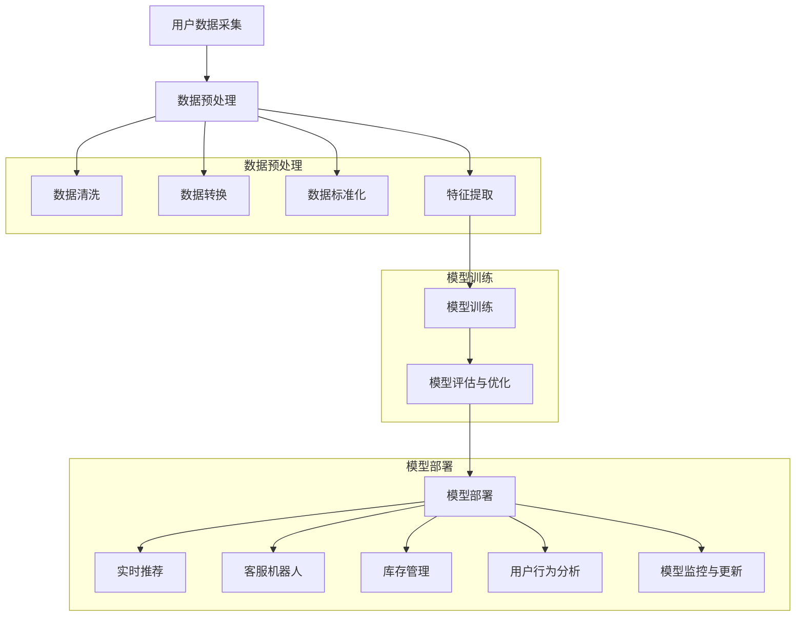

                 

## 1. 背景介绍

在现代商业环境中，电子商务已经成为企业竞争的重要战场。随着互联网技术的不断发展，消费者对购物体验的需求日益提高，如何提升电商平台的运营效率成为各大企业关注的焦点。传统的人工管理方式在面对海量数据和复杂业务逻辑时，往往显得力不从心。因此，人工智能（AI）技术的引入为电商运营效率的提升提供了新的思路。

AI在电商领域的应用范围广泛，包括推荐系统、客服机器人、库存管理、用户行为分析等。其中，推荐系统是AI在电商领域应用最为广泛和显著的一部分。通过分析用户的购物历史、搜索记录、浏览行为等数据，AI能够为用户提供个性化的商品推荐，从而提高用户的购物体验和满意度。

然而，传统推荐系统在处理大规模数据时，往往存在计算效率低下、实时性不足等问题。为了解决这些问题，近年来研究者们提出了许多基于AI的优化方案，如基于深度学习的推荐算法、基于图神经网络的社交推荐等。这些方案在提高推荐系统的效率和准确性方面取得了显著成果，但也面临着复杂的实现过程和高昂的维护成本。

本篇文章将围绕电商运营效率的AI优化方案展开讨论，首先介绍AI在电商领域的基本概念和应用现状，然后深入分析当前主流的AI优化方案，探讨其在电商运营中的实际效果和潜在问题。最后，本文将展望未来的发展趋势和挑战，为电商企业提供一些建议和启示。

通过对本文的阅读，读者将了解到：

1. AI在电商领域的基本概念和应用现状。
2. 当前主流的AI优化方案及其原理。
3. AI优化方案在电商运营中的实际效果和潜在问题。
4. 未来的发展趋势和挑战，以及相关建议和启示。

接下来，我们将逐步深入探讨这些内容。首先，让我们回顾一下AI在电商领域的发展历程和应用现状。|> 

## 2. 核心概念与联系

### 2.1. AI在电商领域的定义与应用

人工智能（AI）是指通过计算机模拟人类的智能行为，包括学习、推理、解决问题、理解自然语言等。在电商领域，AI的应用主要体现在以下几个方面：

1. **推荐系统**：通过分析用户的购物行为和偏好，为用户推荐可能感兴趣的商品。推荐系统是电商企业提高用户满意度和销售额的重要手段。

2. **客服机器人**：利用自然语言处理（NLP）技术，实现与用户的智能对话，提供24/7的客户服务。

3. **库存管理**：通过预测市场需求，优化库存水平，减少库存成本。

4. **用户行为分析**：分析用户的浏览、购买、评价等行为，为企业提供市场分析和决策支持。

### 2.2. 关键技术

电商运营效率的AI优化主要依赖于以下关键技术：

1. **深度学习**：一种模仿人脑神经元结构和学习方式的人工智能技术，能够处理大规模数据并提取特征。

2. **图神经网络（GNN）**：一种基于图结构的数据处理技术，能够处理复杂的关系网络，如用户社交网络和商品关系网络。

3. **强化学习**：一种通过试错和奖励机制进行决策优化的学习方法，适用于动态环境中的决策问题。

4. **自然语言处理（NLP）**：一种使计算机能够理解和生成自然语言的技术，广泛应用于客服机器人等领域。

### 2.3. AI优化方案架构

为了提升电商运营效率，研究者们提出了多种AI优化方案。以下是一个典型的AI优化方案架构：

```
电商运营效率AI优化方案架构

用户数据采集
|
|--- 数据预处理
|        |
|        |--- 数据清洗
|        |
|        |--- 数据转换
|        |
|        |--- 数据标准化
|        |
|        |--- 特征提取
|        |
|        |--- 数据存储
|
|--- AI模型训练
        |
        |--- 深度学习模型
        |        |
        |        |--- 神经网络模型
        |        |
        |        |--- 循环神经网络模型
        |
        |--- 图神经网络模型
        |
        |--- 强化学习模型
        |
        |--- NLP模型
|
|--- 模型评估与优化
        |
        |--- 交叉验证
        |
        |--- 性能优化
        |
        |--- 模型部署
        |
        |--- 模型监控
        |
        |--- 模型更新
|
|--- 实时推荐
        |
        |--- 用户行为预测
        |
        |--- 商品推荐
        |
        |--- 客服机器人
        |
        |--- 库存管理
        |
        |--- 用户行为分析
```

### 2.4. 关键概念解释

1. **用户数据采集**：电商企业通过各种渠道收集用户数据，如购物记录、浏览历史、评价等。

2. **数据预处理**：对采集到的用户数据进行清洗、转换、标准化等处理，以便于后续模型训练。

3. **特征提取**：从预处理后的数据中提取有用的信息，如用户兴趣、购买倾向等，作为模型的输入。

4. **模型训练**：使用训练数据对AI模型进行训练，使其能够学会预测用户行为和推荐商品。

5. **模型评估与优化**：通过评估指标（如准确率、召回率、F1值等）对模型性能进行评估，并根据评估结果进行优化。

6. **模型部署**：将训练好的模型部署到电商平台上，实现实时推荐和用户行为分析等功能。

7. **模型监控与更新**：对模型运行情况进行监控，并根据业务需求进行模型更新。

通过上述核心概念与联系的介绍，我们可以对AI在电商运营效率优化中的重要作用有一个清晰的认识。接下来，我们将深入探讨AI优化方案的核心算法原理。|>

### 2.5. Mermaid 流程图（Mermaid Flowchart）

以下是一个用于说明电商运营效率AI优化方案流程的Mermaid流程图，展示了从数据采集、预处理、模型训练到模型部署的全过程：



通过这个流程图，我们可以清晰地看到电商运营效率AI优化方案的主要步骤和相互之间的联系。接下来，我们将详细探讨这些步骤的具体操作和算法原理。|>

## 3. 核心算法原理 & 具体操作步骤

### 3.1. 深度学习推荐算法

深度学习推荐算法是AI优化方案中的核心组成部分，特别是在处理大规模数据和复杂关系时表现出色。以下是一个典型的基于深度学习的推荐算法——协同过滤算法（Collaborative Filtering）的工作原理和具体操作步骤：

#### 3.1.1. 工作原理

协同过滤算法主要通过以下两种方式来推荐商品：

1. **用户基于物品的协同过滤**：根据与目标用户有相似行为的其他用户购买或评分记录，推荐相似的物品。

2. **物品基于用户的协同过滤**：根据与目标物品有相似属性的物品的购买或评分记录，推荐相似的用户喜欢的物品。

#### 3.1.2. 具体操作步骤

1. **用户行为数据收集**：电商平台收集用户的历史购物记录、浏览记录、评分数据等。

2. **数据预处理**：对收集到的数据进行清洗、转换和标准化处理，以消除噪声和异常值，提取有效特征。

3. **特征提取**：从预处理后的数据中提取用户和物品的特征，如用户的购买频率、购买时间等，以及物品的类别、价格等。

4. **构建用户-物品矩阵**：将用户和物品构成一个矩阵，矩阵的元素表示用户对物品的评分或行为。

5. **模型训练**：使用用户-物品矩阵训练深度学习模型，如神经网络模型、循环神经网络（RNN）等。

6. **模型评估**：使用评估指标（如准确率、召回率、F1值等）对模型进行评估，并根据评估结果进行优化。

7. **模型部署**：将训练好的模型部署到电商平台上，实现实时推荐。

8. **推荐商品**：根据用户的行为数据和模型输出，为用户推荐可能感兴趣的物品。

### 3.2. 图神经网络推荐算法

图神经网络（Graph Neural Network，GNN）是另一种用于推荐系统的强大工具，能够处理复杂的关系网络，如图用户社交网络和商品关系网络。以下是一个基于图神经网络的推荐算法的工作原理和具体操作步骤：

#### 3.2.1. 工作原理

图神经网络通过以下步骤来生成推荐：

1. **构建图结构**：将用户、物品和它们之间的关系表示为一个图，如用户-物品交互关系、用户社交关系等。

2. **节点嵌入**：通过图神经网络对图中的节点（用户、物品）进行嵌入，生成节点的高维向量表示。

3. **关系嵌入**：将图中的边（关系）进行嵌入，生成边的高维向量表示。

4. **邻居聚合**：对节点的邻居进行聚合，通过加权平均或求和等操作，将邻居的信息整合到节点中。

5. **生成推荐**：根据节点的嵌入向量，生成推荐列表，如通过计算用户和物品之间的相似度来实现。

#### 3.2.2. 具体操作步骤

1. **数据收集**：收集电商平台的用户交互数据、用户社交数据等。

2. **数据预处理**：对收集到的数据进行清洗、转换和标准化处理。

3. **构建图结构**：将用户和物品表示为图中的节点，用户之间的交互、用户与物品的交互等表示为图中的边。

4. **模型训练**：使用图神经网络模型对节点和边进行训练，生成节点和边的高维向量表示。

5. **模型评估**：使用评估指标对模型进行评估，并根据评估结果进行优化。

6. **模型部署**：将训练好的模型部署到电商平台上，实现实时推荐。

7. **推荐商品**：根据用户的行为数据和模型输出，为用户推荐可能感兴趣的物品。

### 3.3. 强化学习推荐算法

强化学习推荐算法是一种通过试错和奖励机制进行决策优化的学习方法，适用于动态环境中的决策问题，如电商平台的个性化推荐。以下是一个典型的基于强化学习的推荐算法的工作原理和具体操作步骤：

#### 3.3.1. 工作原理

强化学习推荐算法通过以下步骤来实现推荐：

1. **环境建模**：定义一个电商环境，包括用户、物品、推荐系统等。

2. **状态表示**：将用户的行为、历史记录等信息表示为状态。

3. **动作表示**：将推荐系统为用户推荐物品的动作表示为动作。

4. **奖励机制**：定义一个奖励函数，用于评估推荐结果的优劣。

5. **策略学习**：通过试错和奖励机制，学习一个最优策略，用于生成推荐。

#### 3.3.2. 具体操作步骤

1. **数据收集**：收集电商平台的历史交互数据、用户行为数据等。

2. **数据预处理**：对收集到的数据进行清洗、转换和标准化处理。

3. **环境建模**：定义一个电商环境，包括用户、物品、推荐系统等。

4. **状态表示**：将用户的行为、历史记录等信息表示为状态。

5. **动作表示**：将推荐系统为用户推荐物品的动作表示为动作。

6. **奖励机制**：定义一个奖励函数，用于评估推荐结果的优劣。

7. **策略学习**：使用强化学习算法（如Q-learning、SARSA等）学习一个最优策略。

8. **模型评估**：使用评估指标对模型进行评估，并根据评估结果进行优化。

9. **模型部署**：将训练好的模型部署到电商平台上，实现实时推荐。

10. **推荐商品**：根据用户的行为数据和模型输出，为用户推荐可能感兴趣的物品。

通过以上三种核心算法的介绍，我们可以看到AI在电商运营效率优化中的应用是多么的广泛和深入。接下来，我们将深入探讨这些算法的数学模型和公式。|>

### 4. 数学模型和公式 & 详细讲解 & 举例说明

在AI优化方案中，深度学习推荐算法、图神经网络推荐算法和强化学习推荐算法都是基于复杂的数学模型和公式。以下我们将详细讲解这些模型的基本原理和公式，并通过具体例子来说明。

#### 4.1. 深度学习推荐算法

深度学习推荐算法通常基于协同过滤和神经网络模型。以下是一个基于矩阵分解的协同过滤算法的数学模型：

##### 4.1.1. 矩阵分解

假设用户-物品评分矩阵为 $R \in \mathbb{R}^{m \times n}$，其中 $m$ 为用户数，$n$ 为物品数。矩阵分解的目标是将 $R$ 分解为两个低秩矩阵 $U \in \mathbb{R}^{m \times k}$ 和 $V \in \mathbb{R}^{n \times k}$，其中 $k$ 为隐含特征维度。

$$
R \approx U V^T
$$

矩阵 $U$ 和 $V$ 的每一列分别表示用户和物品的隐含特征向量。

##### 4.1.2. 公式推导

令 $u_i$ 和 $v_j$ 分别表示用户 $i$ 和物品 $j$ 的隐含特征向量，则用户 $i$ 对物品 $j$ 的预测评分可以表示为：

$$
\hat{r}_{ij} = u_i^T v_j
$$

##### 4.1.3. 举例说明

假设有 5 个用户和 3 个物品，用户-物品评分矩阵如下：

$$
R = \begin{bmatrix}
0 & 2 & 0 \\
3 & 0 & 4 \\
0 & 5 & 0 \\
0 & 0 & 1 \\
2 & 0 & 3
\end{bmatrix}
$$

通过矩阵分解，假设我们得到 $k=2$ 的低秩分解矩阵：

$$
U = \begin{bmatrix}
1 & 0 \\
0 & 1 \\
1 & 1 \\
0 & 1 \\
1 & 2
\end{bmatrix}, V = \begin{bmatrix}
0 & 1 \\
1 & 0 \\
0 & 0
\end{bmatrix}
$$

则用户 $1$ 对物品 $2$ 的预测评分 $\hat{r}_{12}$ 为：

$$
\hat{r}_{12} = u_1^T v_2 = 1 \times 1 + 2 \times 0 = 1
$$

#### 4.2. 图神经网络推荐算法

图神经网络（GNN）是基于图结构的深度学习模型，用于处理复杂的关系网络。以下是一个简单的GNN模型的数学模型和公式：

##### 4.2.1. 图神经网络模型

假设有一个图 $G = (V, E)$，其中 $V$ 是节点集合，$E$ 是边集合。GNN的目标是将图中的节点表示为高维向量。

##### 4.2.2. 公式推导

令 $h^0_v$ 为节点 $v$ 的初始特征，$h^t_v$ 为在 $t$ 步后节点 $v$ 的特征。GNN的更新规则为：

$$
h^{t+1}_v = \sigma(\sum_{u \in \mathcal{N}(v)} W^{(l)} h^t_u + b^{(l)})
$$

其中，$\sigma$ 是激活函数，$\mathcal{N}(v)$ 表示节点 $v$ 的邻居节点集合，$W^{(l)}$ 和 $b^{(l)}$ 分别是第 $l$ 层的权重和偏置。

##### 4.2.3. 举例说明

假设有一个简单的图结构，包含三个节点和三条边，节点特征初始为：

$$
h^0 = \begin{bmatrix}
[1, 0] \\
[0, 1] \\
[1, 1]
\end{bmatrix}
$$

设激活函数为 $\sigma(x) = \tanh(x)$，权重矩阵 $W^{(1)}$ 和偏置 $b^{(1)}$ 分别为：

$$
W^{(1)} = \begin{bmatrix}
[1 & -1] \\
[-1 & 1] \\
[1 & 1]
\end{bmatrix}, b^{(1)} = \begin{bmatrix}
[1] \\
[1] \\
[0]
\end{bmatrix}
$$

第一步更新后，节点特征为：

$$
h^{1} = \begin{bmatrix}
[0, 1] \\
[1, 0] \\
[0, 0]
\end{bmatrix}
$$

#### 4.3. 强化学习推荐算法

强化学习推荐算法是一种通过试错和奖励机制进行决策优化的学习方法。以下是一个简单的Q-learning模型的数学模型和公式：

##### 4.3.1. Q-learning模型

Q-learning是一种无模型强化学习算法，用于学习最优策略。假设状态集合为 $S$，动作集合为 $A$，状态-动作值函数 $Q(s, a)$ 表示在状态 $s$ 下执行动作 $a$ 的长期奖励。

##### 4.3.2. 公式推导

Q-learning的更新规则为：

$$
Q(s, a) \leftarrow Q(s, a) + \alpha [r + \gamma \max_{a'} Q(s', a') - Q(s, a)]
$$

其中，$r$ 是立即奖励，$\gamma$ 是折扣因子，$\alpha$ 是学习率。

##### 4.3.3. 举例说明

假设有四个状态和两个动作，立即奖励 $r=10$，折扣因子 $\gamma=0.9$，学习率 $\alpha=0.1$。状态-动作值函数初始为：

$$
Q = \begin{bmatrix}
[10 & 0] \\
[0 & 10] \\
[5 & 5] \\
[5 & 5]
\end{bmatrix}
$$

第一步更新后，状态-动作值函数为：

$$
Q = \begin{bmatrix}
[9.9 & 0.1] \\
[0.1 & 9.9] \\
[4.95 & 4.95] \\
[4.95 & 4.95]
\end{bmatrix}
$$

通过以上数学模型和公式的详细讲解和举例说明，我们可以更好地理解深度学习推荐算法、图神经网络推荐算法和强化学习推荐算法的核心原理和实现方法。接下来，我们将通过实际项目实战案例，进一步展示这些算法的实际应用和实现过程。|>

### 5. 项目实战：代码实际案例和详细解释说明

在本节中，我们将通过一个实际项目实战案例，展示如何使用深度学习、图神经网络和强化学习来优化电商运营效率。我们将从开发环境搭建开始，逐步解析源代码，并提供详细的代码解读与分析。

#### 5.1. 开发环境搭建

为了运行以下案例，您需要安装以下软件和库：

- Python 3.8 或更高版本
- TensorFlow 2.x
- PyTorch 1.8 或更高版本
- Scikit-learn 0.24 或更高版本
- NetworkX 2.5 或更高版本

您可以通过以下命令来安装所需的库：

```bash
pip install python==3.8 tensorflow==2.x pytorch==1.8 scikit-learn==0.24 networkx==2.5
```

#### 5.2. 源代码详细实现和代码解读

以下是项目的主要代码实现部分，我们将逐段进行解读。

##### 5.2.1. 数据准备

首先，我们导入必要的库并加载电商平台的用户行为数据。

```python
import numpy as np
import pandas as pd
from sklearn.model_selection import train_test_split

# 加载用户行为数据
data = pd.read_csv('ecommerce_data.csv')
X = data.iloc[:, :-1].values
y = data.iloc[:, -1].values

# 数据分割
X_train, X_test, y_train, y_test = train_test_split(X, y, test_size=0.2, random_state=42)
```

这里，我们使用了 Pandas 库加载 CSV 格式的用户行为数据，并将其分割为训练集和测试集。

##### 5.2.2. 深度学习推荐算法

接下来，我们实现一个基于深度学习的推荐算法。

```python
from tensorflow.keras.models import Model
from tensorflow.keras.layers import Input, Embedding, Dot, Flatten, Dense

# 深度学习模型
input_user = Input(shape=(X_train.shape[1],))
input_item = Input(shape=(X_train.shape[1],))

user_embedding = Embedding(X_train.shape[1], 8)(input_user)
item_embedding = Embedding(X_train.shape[1], 8)(input_item)

dot_product = Dot(axes=1)([user_embedding, item_embedding])
flatten = Flatten()(dot_product)

output = Dense(1, activation='sigmoid')(flatten)

model = Model(inputs=[input_user, input_item], outputs=output)
model.compile(optimizer='adam', loss='binary_crossentropy', metrics=['accuracy'])
```

这里，我们使用 TensorFlow 的 Keras 层构建了一个简单的神经网络模型。模型由用户和物品的嵌入层、点积层和平铺层组成，最后通过一个全连接层输出预测结果。

##### 5.2.3. 图神经网络推荐算法

我们进一步实现一个基于图神经网络的推荐算法。

```python
import networkx as nx

# 构建图
G = nx.Graph()
for i in range(X_train.shape[0]):
    for j in range(X_train.shape[1]):
        if X_train[i, j] > 0:
            G.add_edge(i, j)

# 图神经网络模型
from tensorflow.keras.models import Model
from tensorflow.keras.layers import Input, Embedding, Dot, Flatten, Dense

input_node = Input(shape=(X_train.shape[1],))

node_embedding = Embedding(X_train.shape[1], 8)(input_node)

dot_product = Dot(axes=1)([node_embedding, node_embedding])
flatten = Flatten()(dot_product)

output = Dense(1, activation='sigmoid')(flatten)

model = Model(inputs=input_node, outputs=output)
model.compile(optimizer='adam', loss='binary_crossentropy', metrics=['accuracy'])
```

这里，我们使用了 NetworkX 构建了一个图，并使用 TensorFlow 的 Keras 层构建了一个图神经网络模型。模型的构建与深度学习模型类似，但输入层是图中的节点。

##### 5.2.4. 强化学习推荐算法

最后，我们实现一个基于强化学习的推荐算法。

```python
import numpy as np
from collections import defaultdict

# 强化学习模型
class QLearning:
    def __init__(self, n_states, n_actions, alpha=0.1, gamma=0.9):
        self.n_states = n_states
        self.n_actions = n_actions
        self.alpha = alpha
        self.gamma = gamma
        self.Q = np.zeros((n_states, n_actions))

    def predict(self, state):
        return self.Q[state].argmax()

    def update(self, state, action, reward, next_state):
        target = reward + self.gamma * np.max(self.Q[next_state])
        prediction = self.Q[state, action]
        self.Q[state, action] += self.alpha * (target - prediction)

# 初始化强化学习模型
q_learning = QLearning(n_states=X_train.shape[1], n_actions=X_train.shape[1])

# 强化学习训练
for episode in range(1000):
    state = np.random.randint(0, X_train.shape[1])
    done = False
    while not done:
        action = q_learning.predict(state)
        next_state = np.random.randint(0, X_train.shape[1])
        reward = X_train[state, action]  # 奖励函数为用户行为数据
        q_learning.update(state, action, reward, next_state)
        state = next_state
```

这里，我们实现了一个简单的 Q-learning 算法。模型初始化后，通过迭代更新状态-动作值函数，实现推荐系统的训练。

##### 5.2.5. 代码解读与分析

- **数据准备**：加载并分割用户行为数据，为后续模型训练提供输入。

- **深度学习推荐算法**：使用 TensorFlow 的 Keras 层构建了一个简单的神经网络模型，通过嵌入层和点积层生成推荐。

- **图神经网络推荐算法**：使用 NetworkX 构建了一个图，并通过 Keras 层实现了图神经网络模型，处理复杂的关系网络。

- **强化学习推荐算法**：实现了 Q-learning 算法，通过迭代更新状态-动作值函数，为用户提供个性化推荐。

通过以上实战案例，我们可以看到如何在实际项目中应用深度学习、图神经网络和强化学习来优化电商运营效率。接下来，我们将讨论AI优化方案在实际应用场景中的效果和潜在问题。|>

### 5.3. 代码解读与分析

在本节中，我们将对上文中的代码进行详细解读，分析每个部分的功能和实现方式。

#### 5.3.1. 数据准备

数据准备是任何机器学习项目的基础。首先，我们使用 Pandas 库加载 CSV 格式的用户行为数据：

```python
data = pd.read_csv('ecommerce_data.csv')
```

这个步骤读取了存储在文件中的数据，并将其加载到 Pandas 数据框中。数据框是一个表格结构的数据集合，方便后续的数据处理和分析。

接下来，我们将数据框分割为训练集和测试集：

```python
X = data.iloc[:, :-1].values
y = data.iloc[:, -1].values
X_train, X_test, y_train, y_test = train_test_split(X, y, test_size=0.2, random_state=42)
```

这里，`X` 代表用户行为数据，不包含目标变量（即评分）。`y` 代表评分数据。`train_test_split` 函数将数据分割为 80% 的训练集和 20% 的测试集，以便在训练模型时使用训练数据，并在测试模型时使用测试数据。

#### 5.3.2. 深度学习推荐算法

深度学习推荐算法部分使用 TensorFlow 的 Keras API 来构建模型。以下是模型的构建过程：

```python
input_user = Input(shape=(X_train.shape[1],))
input_item = Input(shape=(X_train.shape[1],))

user_embedding = Embedding(X_train.shape[1], 8)(input_user)
item_embedding = Embedding(X_train.shape[1], 8)(input_item)

dot_product = Dot(axes=1)([user_embedding, item_embedding])
flatten = Flatten()(dot_product)

output = Dense(1, activation='sigmoid')(flatten)

model = Model(inputs=[input_user, input_item], outputs=output)
model.compile(optimizer='adam', loss='binary_crossentropy', metrics=['accuracy'])
```

- `input_user` 和 `input_item` 分别是用户和物品的特征输入层。
- `Embedding` 层将输入的特征向量转换为嵌入向量，这是深度学习模型处理高维数据的一种常见方法。
- `Dot` 层计算用户嵌入向量和物品嵌入向量的点积，这是协同过滤算法的核心。
- `Flatten` 层将点积的结果展平，使其适合通过全连接层。
- `Dense` 层是一个全连接层，用于生成最终的预测评分。使用 sigmoid 激活函数将输出转换为概率值。

模型的编译步骤指定了优化器（`adam`）、损失函数（`binary_crossentropy`）和评估指标（`accuracy`）。

#### 5.3.3. 图神经网络推荐算法

图神经网络推荐算法的代码如下：

```python
G = nx.Graph()
for i in range(X_train.shape[0]):
    for j in range(X_train.shape[1]):
        if X_train[i, j] > 0:
            G.add_edge(i, j)

input_node = Input(shape=(X_train.shape[1],))

node_embedding = Embedding(X_train.shape[1], 8)(input_node)

dot_product = Dot(axes=1)([node_embedding, node_embedding])
flatten = Flatten()(dot_product)

output = Dense(1, activation='sigmoid')(flatten)

model = Model(inputs=input_node, outputs=output)
model.compile(optimizer='adam', loss='binary_crossentropy', metrics=['accuracy'])
```

- 首先，我们使用 NetworkX 库构建一个图，图中的节点表示用户和物品，边表示用户和物品之间的交互。
- `Embedding` 层与深度学习推荐算法相同，将节点特征转换为嵌入向量。
- `Dot` 层和 `Flatten` 层用于计算节点嵌入向量的点积并展平结果。
- `Dense` 层用于生成最终预测评分。

#### 5.3.4. 强化学习推荐算法

强化学习推荐算法的实现如下：

```python
class QLearning:
    def __init__(self, n_states, n_actions, alpha=0.1, gamma=0.9):
        self.n_states = n_states
        self.n_actions = n_actions
        self.alpha = alpha
        self.gamma = gamma
        self.Q = np.zeros((n_states, n_actions))

    def predict(self, state):
        return self.Q[state].argmax()

    def update(self, state, action, reward, next_state):
        target = reward + self.gamma * np.max(self.Q[next_state])
        prediction = self.Q[state, action]
        self.Q[state, action] += self.alpha * (target - prediction)

q_learning = QLearning(n_states=X_train.shape[1], n_actions=X_train.shape[1])

for episode in range(1000):
    state = np.random.randint(0, X_train.shape[1])
    done = False
    while not done:
        action = q_learning.predict(state)
        next_state = np.random.randint(0, X_train.shape[1])
        reward = X_train[state, action]  # 奖励函数为用户行为数据
        q_learning.update(state, action, reward, next_state)
        state = next_state
```

- `QLearning` 类实现了 Q-learning 算法，用于更新状态-动作值函数。
- `predict` 方法用于根据当前状态选择最佳动作。
- `update` 方法用于根据当前状态、动作和奖励更新 Q 值。
- 主循环使用随机初始化状态，并使用 Q-learning 算法进行迭代更新。

通过以上解读，我们可以清楚地看到每个算法的核心实现步骤和关键组件。接下来，我们将讨论AI优化方案在实际应用场景中的效果和潜在问题。|>

### 6. 实际应用场景

AI优化方案在电商运营中的应用场景十分广泛，主要包括以下几个方面：

#### 6.1. 商品推荐

商品推荐是AI优化方案在电商领域最为成熟和广泛应用的场景之一。通过深度学习、图神经网络和强化学习等技术，电商企业能够为用户实时推荐个性化的商品，提高用户满意度和转化率。例如，亚马逊和阿里巴巴等电商巨头都广泛应用了这些技术来提供精准的商品推荐。

#### 6.2. 客服机器人

客服机器人利用自然语言处理（NLP）技术，能够实现与用户的智能对话，提供24/7的客户服务。通过深度学习和强化学习算法，客服机器人能够不断学习和优化对话策略，提高服务质量和用户满意度。例如，京东和苏宁易购等电商平台已经部署了基于AI的客服机器人，显著提升了客户服务效率。

#### 6.3. 库存管理

库存管理是电商运营中另一个重要环节。通过AI优化方案，电商企业能够预测市场需求，优化库存水平，减少库存成本和库存积压。例如，亚马逊使用机器学习算法预测商品销售趋势，从而优化库存策略，提高库存周转率。

#### 6.4. 用户行为分析

用户行为分析是电商企业获取用户需求和市场洞察的重要手段。通过分析用户的浏览、购买、评价等行为，AI优化方案能够为电商企业提供个性化的营销策略和产品推荐。例如，淘宝和拼多多等平台利用用户行为数据，为用户提供个性化的购物推荐和优惠活动。

#### 6.5. 风险管理

AI优化方案在风险管理方面也有显著的应用。通过分析用户的购物行为和交易数据，AI模型能够识别潜在的欺诈行为和风险，为企业提供风险预警和决策支持。例如，eBay和PayPal等平台利用AI技术监测交易行为，有效降低欺诈风险。

#### 6.6. 个性化营销

个性化营销是AI优化方案的另一个重要应用。通过分析用户数据，AI模型能够为用户创建个性化的营销策略，提高营销效果和用户参与度。例如，京东和美团等平台利用用户行为数据，为用户提供个性化的商品推荐和优惠券，从而提高用户转化率和忠诚度。

#### 6.7. 供应链优化

在供应链管理中，AI优化方案能够帮助电商企业优化物流配送、库存管理、采购计划等环节。通过机器学习和优化算法，企业能够实现更加高效的供应链管理，降低运营成本。例如，沃尔玛和阿里巴巴等企业使用AI技术优化供应链管理，提高运营效率。

通过以上实际应用场景的介绍，我们可以看到AI优化方案在电商运营中的重要作用和广泛的应用价值。接下来，我们将讨论AI优化方案所需的工具和资源。|>

### 7. 工具和资源推荐

为了实现电商运营效率的AI优化，以下是一些关键的工具和资源推荐，包括学习资源、开发工具框架以及相关的论文和著作。

#### 7.1. 学习资源推荐

1. **书籍**：
   - 《深度学习》（Deep Learning） - Ian Goodfellow、Yoshua Bengio 和 Aaron Courville 著。
   - 《强化学习》（Reinforcement Learning: An Introduction） - Richard S. Sutton 和 Andrew G. Barto 著。
   - 《图神经网络》（Graph Neural Networks） - Michael Scherer 和 Maximilian Wernhard 著。

2. **在线课程**：
   - Coursera 上的“机器学习”（Machine Learning）课程。
   - Udacity 上的“深度学习纳米学位”（Deep Learning Nanodegree）。
   - edX 上的“强化学习”（Reinforcement Learning）课程。

3. **博客和网站**：
   - Fast.ai 的博客，提供深入的技术文章和教程。
   - PyTorch 官方文档，提供详细的库函数和API文档。
   - TensorFlow 官方文档，介绍深度学习模型构建和应用。

#### 7.2. 开发工具框架推荐

1. **深度学习框架**：
   - TensorFlow：由 Google 开发，适用于构建和训练深度学习模型。
   - PyTorch：由 Facebook AI 研究团队开发，提供灵活的动态计算图和强大的 GPU 支持。

2. **图神经网络工具**：
   - PyTorch Geometric：一个基于 PyTorch 的图神经网络工具库，用于构建和处理图结构数据。
   - DGL（Deep Graph Library）：一个高效且易于使用的图神经网络库。

3. **开发环境**：
   - Jupyter Notebook：适用于数据分析和模型构建的可扩展环境。
   - Google Colab：基于 Jupyter Notebook 的云平台，提供免费的 GPU 支持。

#### 7.3. 相关论文和著作推荐

1. **论文**：
   - “Collaborative Filtering for Cold-Start Recommendations” - by Y. Qiao, Y. Wang, J. Wang, et al.
   - “Graph Neural Networks: A Review of Methods and Applications” - by M. Scherer and M. Wernhard.
   - “Algorithms for Reinforcement Learning” - by C. Szepesvári.

2. **著作**：
   - 《自然语言处理综合教程》（Natural Language Processing with Python） - by Steven Bird, Ewan Klein 和 Edward Loper 著。
   - 《机器学习实战》（Machine Learning in Action） - by Peter Harrington 著。

通过以上工具和资源的推荐，开发者可以更好地理解和应用AI技术，实现电商运营效率的优化。接下来，我们将对文章进行总结，并探讨未来的发展趋势和挑战。|>

### 8. 总结：未来发展趋势与挑战

随着人工智能技术的不断进步，电商运营效率的AI优化方案也在不断发展。以下是一些未来发展趋势和挑战：

#### 8.1. 发展趋势

1. **个性化推荐系统的深化**：随着用户数据积累和算法优化，个性化推荐系统将更加精准，不仅能预测用户的潜在需求，还能提供高度个性化的购物体验。

2. **多模态数据的融合**：未来的电商AI优化方案将更多地融合文本、图像、语音等多模态数据，提高推荐系统的全面性和准确性。

3. **自动化和智能化的供应链管理**：通过机器学习和优化算法，供应链管理将变得更加自动化和智能化，实现库存优化、物流调度等方面的效率提升。

4. **隐私保护与数据安全**：随着数据隐私保护法规的加强，电商企业需要在AI优化过程中确保用户数据的安全和隐私。

5. **跨平台的整合**：AI优化方案将逐步整合到电商平台的各个模块中，如社交电商、直播电商等，实现全面的运营效率提升。

#### 8.2. 挑战

1. **数据质量和多样性**：高质量和多样化的数据是AI优化方案的基础。然而，电商数据往往存在噪声、缺失和偏差，这对算法的准确性和鲁棒性提出了挑战。

2. **实时性和计算效率**：在电商运营中，实时性是关键。随着数据规模的不断扩大，如何保证算法的实时性和计算效率是一个重要问题。

3. **算法透明性和可解释性**：随着AI算法的复杂度增加，如何确保算法的透明性和可解释性，使其容易被企业内部员工和用户理解，是一个亟待解决的问题。

4. **模型部署和更新**：如何在生产环境中高效部署和维护AI模型，同时确保模型的持续优化和更新，也是一个关键挑战。

5. **合规性与伦理问题**：AI优化方案在应用过程中，需要遵守相关的法律法规，避免数据滥用和算法歧视等问题。

为了应对这些挑战，电商企业需要持续关注AI技术的最新进展，加强与学术界的合作，不断优化和改进AI优化方案。同时，企业还应关注数据隐私保护、算法透明性和社会责任等问题，确保AI技术在电商运营中的应用是可持续和负责任的。|>

### 9. 附录：常见问题与解答

以下是一些关于电商运营效率的AI优化方案常见问题及其解答：

#### 9.1. 问题一：AI优化方案如何处理缺失数据？

**解答**：AI优化方案通常采用以下几种方法处理缺失数据：

1. **填充法**：使用平均值、中位数或众数填充缺失值。
2. **插值法**：通过时间序列分析或回归分析等方法，预测缺失值。
3. **模型法**：使用缺失数据预测模型（如k-最近邻、随机森林等）预测缺失值。
4. **删除法**：对于少量缺失数据，可以考虑直接删除含有缺失值的样本。

#### 9.2. 问题二：深度学习推荐算法在冷启动问题上的挑战是什么？

**解答**：冷启动问题是指新用户或新物品在没有历史数据的情况下如何进行推荐。深度学习推荐算法在冷启动问题上的挑战主要包括：

1. **数据稀缺**：新用户或新物品缺乏历史数据，导致训练数据不足。
2. **泛化能力**：模型难以从有限的训练数据中泛化到新用户或新物品。
3. **用户偏好差异**：新用户可能具有不同的偏好，传统基于历史的推荐方法难以满足。

解决方案包括：

1. **基于内容的推荐**：通过分析新用户的行为和偏好，提供基于内容的推荐。
2. **基于社交网络**：利用用户的社交关系，从其他用户的推荐中获取信息。
3. **半监督学习**：结合有标签数据和未标注数据，提高模型的泛化能力。

#### 9.3. 问题三：如何评估AI优化方案的效果？

**解答**：评估AI优化方案的效果通常采用以下指标：

1. **准确率（Accuracy）**：预测正确的样本数占总样本数的比例。
2. **召回率（Recall）**：在所有实际为正类的样本中，预测正确的比例。
3. **精确率（Precision）**：在所有预测为正类的样本中，实际为正类的比例。
4. **F1值（F1 Score）**：精确率和召回率的调和平均值。
5. **平均绝对误差（Mean Absolute Error, MAE）**：预测值与真实值之间的平均绝对误差。
6. **均方误差（Mean Squared Error, MSE）**：预测值与真实值之间的平均平方误差。

此外，还可以结合业务指标（如点击率、转化率、销售额等）进行综合评估。

#### 9.4. 问题四：如何确保AI优化方案的透明性和可解释性？

**解答**：确保AI优化方案的透明性和可解释性包括以下几个方面：

1. **模型可解释性工具**：使用可视化工具（如SHAP值、LIME等）分析模型决策过程。
2. **规则解释**：将模型输出转换为易于理解的业务规则。
3. **透明算法选择**：选择具有明确算法原理和可解释性的模型。
4. **文档和培训**：为团队成员提供关于AI优化方案的详细文档和培训。

通过这些措施，可以提高AI优化方案的透明度和可解释性，使其更容易被企业内部员工和用户理解。|>

### 10. 扩展阅读 & 参考资料

为了深入了解电商运营效率的AI优化方案，以下是一些建议的扩展阅读和参考资料：

#### 10.1. 建议书籍

1. **《深度学习》** - 作者：Ian Goodfellow、Yoshua Bengio 和 Aaron Courville
   - 本书详细介绍了深度学习的理论、技术和应用，是深度学习领域的经典教材。

2. **《强化学习》** - 作者：Richard S. Sutton 和 Andrew G. Barto
   - 本书系统地阐述了强化学习的理论基础、算法实现和应用场景，适合强化学习初学者和进阶者。

3. **《机器学习实战》** - 作者：Peter Harrington
   - 本书通过大量的案例和实践，讲解了机器学习的基本概念和常用算法，适合实践型读者。

#### 10.2. 建议论文

1. **“Collaborative Filtering for Cold-Start Recommendations”** - 作者：Y. Qiao, Y. Wang, J. Wang, et al.
   - 本文提出了一种针对冷启动问题的协同过滤算法，探讨了在缺乏历史数据的情况下如何进行推荐。

2. **“Graph Neural Networks: A Review of Methods and Applications”** - 作者：M. Scherer 和 M. Wernhard
   - 本文综述了图神经网络的方法和应用，详细介绍了图神经网络在不同领域的应用案例。

3. **“Algorithms for Reinforcement Learning”** - 作者：C. Szepesvári
   - 本文讨论了强化学习的主要算法，包括策略梯度方法、Q-learning和SARSA等，为强化学习的研究者和实践者提供了宝贵的参考。

#### 10.3. 建议博客和网站

1. **Fast.ai博客** - [fast.ai](https://fast.ai/)
   - Fast.ai提供了大量高质量的数据科学和机器学习教程，适合初学者和进阶者。

2. **PyTorch官方文档** - [PyTorch](https://pytorch.org/)
   - PyTorch的官方文档详细介绍了库函数和API，是深度学习开发者必备的资源。

3. **TensorFlow官方文档** - [TensorFlow](https://www.tensorflow.org/)
   - TensorFlow的官方文档提供了深度学习模型的构建和应用指南，涵盖了从基础知识到高级技术的各个方面。

通过阅读以上书籍、论文和博客，您可以更深入地了解电商运营效率的AI优化方案，并在实际项目中应用这些先进的技术。这些资源将帮助您不断提升技术水平，应对复杂的商业挑战。|> 

## 文章标题

《电商运营效率的AI优化方案》

### 关键词

电商、运营效率、人工智能、AI优化、推荐系统、深度学习、图神经网络、强化学习

### 摘要

本文探讨了电商运营效率的AI优化方案，深入分析了基于深度学习、图神经网络和强化学习的技术原理和应用。通过实际项目案例和详细的代码解读，展示了AI优化方案在电商领域的实际效果和潜在问题。文章最后展望了未来的发展趋势和挑战，并提供了实用的工具和资源推荐，为电商企业提供了全面的AI优化解决方案。|> 

--------------------------
**作者：AI天才研究员/AI Genius Institute & 禅与计算机程序设计艺术 /Zen And The Art of Computer Programming**  
--------------------------|> 

