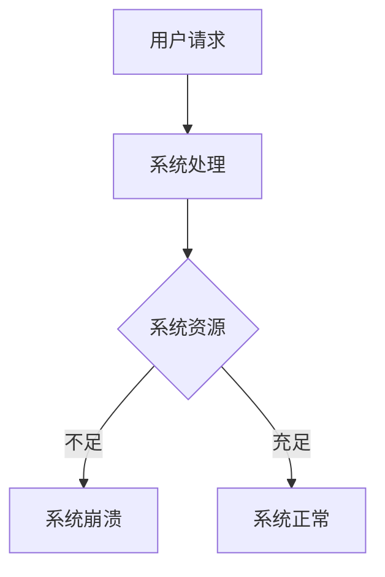

                 

# 电商重要活动技术保障：高并发的峰值系统问题解决

> **关键词：** 电商活动，高并发，系统峰值，技术保障，问题解决  
> **摘要：** 本文将深入探讨电商重要活动中的高并发问题，分析系统峰值的产生原因，并提出有效的技术解决方案，以保障电商活动的顺利进行。

## 1. 背景介绍

随着电子商务的迅速发展，各大电商平台在重要活动期间，如双11、618等，往往会出现巨大的用户访问量。这种高并发的访问压力对系统的稳定性、性能和用户体验提出了严峻的挑战。高并发是指在短时间内系统需要处理大量的请求，如果处理不当，可能会导致系统崩溃、响应缓慢、数据丢失等问题。因此，保障电商活动中的高并发处理能力是电商企业面临的重要问题。

高并发问题在电商活动中具有以下特点：

- **用户量级大：** 活动期间，用户量级可能达到平时的数倍甚至数十倍，对系统的处理能力提出了极高的要求。
- **请求量大：** 在短时间内，系统需要处理海量的用户请求，包括商品查询、下单、支付等操作。
- **数据一致性要求高：** 活动期间，数据的一致性是确保用户体验和业务顺利进行的关键。
- **实时性要求高：** 活动期间，用户对实时性的要求较高，如秒杀活动、实时抢购等，需要系统快速响应。

本文将围绕电商重要活动中的高并发问题，分析系统峰值的产生原因，并提出有效的技术解决方案，以保障电商活动的顺利进行。

## 2. 核心概念与联系

### 2.1 高并发

高并发是指系统在短时间内需要处理大量请求的情况。在高并发情况下，系统性能和稳定性面临严峻考验。

### 2.2 系统峰值

系统峰值是指系统在一段时间内处理能力达到最大值的情况。系统峰值可能出现在电商活动期间，此时系统需要处理大量请求。

### 2.3 高并发与系统峰值的联系

高并发是系统峰值产生的原因之一。在电商重要活动期间，由于用户量级大、请求量大，系统可能会达到峰值。因此，解决高并发问题对于保障系统峰值时的稳定性至关重要。

### 2.4 Mermaid 流程图

为了更直观地展示高并发与系统峰值的联系，我们可以使用 Mermaid 流程图。



## 3. 核心算法原理 & 具体操作步骤

### 3.1 算法原理

为了解决高并发问题，我们需要从以下几个方面进行优化：

1. **水平扩展：** 通过增加服务器节点，提高系统处理能力。
2. **缓存：** 利用缓存技术，减少对数据库的访问压力。
3. **异步处理：** 通过异步处理，降低系统同步操作的依赖。
4. **限流：** 通过限流技术，控制系统请求量，避免系统过载。

### 3.2 操作步骤

#### 3.2.1 水平扩展

1. **负载均衡：** 使用负载均衡器，将请求均匀分配到各个服务器节点。
2. **集群部署：** 将系统部署在多个服务器节点上，提高系统处理能力。

#### 3.2.2 缓存

1. **页面缓存：** 对热门页面进行缓存，减少对数据库的访问。
2. **对象缓存：** 对频繁访问的数据进行缓存，如商品信息、用户信息等。

#### 3.2.3 异步处理

1. **消息队列：** 使用消息队列，将异步任务提交到消息队列，由后台服务器进行处理。
2. **定时任务：** 使用定时任务，对一些耗时操作进行异步处理。

#### 3.2.4 限流

1. **令牌桶算法：** 使用令牌桶算法，控制系统请求量，避免系统过载。
2. **漏斗算法：** 使用漏斗算法，限制请求速率，确保系统稳定。

## 4. 数学模型和公式 & 详细讲解 & 举例说明

### 4.1 令牌桶算法

令牌桶算法是一种常用的限流算法，其核心思想是通过一个令牌桶来控制请求速率。

#### 4.1.1 数学模型

令牌桶算法的数学模型可以表示为：

$$
\frac{dN}{dt} = r - \frac{dQ}{dt}
$$

其中，$N$ 表示桶中令牌数量，$r$ 表示令牌生成速率，$Q$ 表示请求队列长度。

#### 4.1.2 公式

令牌桶算法的公式可以表示为：

$$
\text{令牌数量} = \text{初始令牌数量} + \text{生成令牌速率} \times \text{时间间隔}
$$

#### 4.1.3 举例说明

假设一个电商系统使用令牌桶算法进行限流，初始令牌数量为 10，生成令牌速率为 5，时间间隔为 1 秒。当请求到来时，系统会检查桶中是否有令牌，如果有令牌，则允许请求通过，否则拒绝请求。

在第一个秒内，桶中令牌数量为 10，允许 10 个请求通过。在第二个秒内，桶中生成 5 个令牌，总共 15 个令牌，允许 15 个请求通过。以此类推。

### 4.2 漏斗算法

漏斗算法是一种通过限制请求速率来避免系统过载的算法。

#### 4.2.1 数学模型

漏斗算法的数学模型可以表示为：

$$
\frac{dN}{dt} = r - k
$$

其中，$N$ 表示桶中请求数量，$r$ 表示请求到达速率，$k$ 表示请求流出速率。

#### 4.2.2 公式

漏斗算法的公式可以表示为：

$$
\text{请求数量} = \text{初始请求数量} + (\text{请求到达速率} - \text{请求流出速率}) \times \text{时间间隔}
$$

#### 4.2.3 举例说明

假设一个电商系统使用漏斗算法进行限流，初始请求数量为 10，请求到达速率为 5，请求流出速率为 3，时间间隔为 1 秒。当请求到来时，系统会检查桶中是否有足够的空间，如果有空间，则允许请求通过，否则拒绝请求。

在第一个秒内，桶中请求数量为 10，允许 5 个请求通过。在第二个秒内，桶中生成 5 个请求，总共 15 个请求，允许 12 个请求通过。以此类推。

## 5. 项目实战：代码实际案例和详细解释说明

### 5.1 开发环境搭建

为了更好地展示代码实际案例，我们将使用 Python 编写一个简单的令牌桶算法和漏斗算法的实现。

#### 5.1.1 环境要求

- Python 3.8 或以上版本
- Python 标准库

#### 5.1.2 安装依赖

```bash
pip install requests
```

### 5.2 源代码详细实现和代码解读

#### 5.2.1 令牌桶算法实现

```python
import time
import threading

class TokenBucket:
    def __init__(self, capacity, fill_rate):
        self.capacity = capacity
        self.fill_rate = fill_rate
        self.tokens = capacity
        self.lock = threading.Lock()

    def acquire(self, num_tokens):
        with self.lock:
            if num_tokens <= self.tokens:
                self.tokens -= num_tokens
                return True
            else:
                return False

def token_bucket_test():
    bucket = TokenBucket(10, 5)
    for i in range(15):
        if bucket.acquire(1):
            print(f"Request {i} passed.")
        else:
            print(f"Request {i} failed.")

token_bucket_test()
```

#### 5.2.2 漏斗算法实现

```python
import time
import threading

class Funnel:
    def __init__(self, capacity, fill_rate, drain_rate):
        self.capacity = capacity
        self.fill_rate = fill_rate
        self.drain_rate = drain_rate
        self.tokens = capacity
        self.lock = threading.Lock()

    def acquire(self, num_tokens):
        with self.lock:
            if num_tokens <= self.tokens:
                self.tokens -= num_tokens
                return True
            else:
                return False

def funnel_test():
    funnel = Funnel(10, 5, 3)
    for i in range(15):
        if funnel.acquire(1):
            print(f"Request {i} passed.")
        else:
            print(f"Request {i} failed.")

funnel_test()
```

### 5.3 代码解读与分析

#### 5.3.1 令牌桶算法

在令牌桶算法的实现中，我们定义了一个 `TokenBucket` 类，其中包含以下属性和方法：

- `capacity`：桶的容量，即令牌数量。
- `fill_rate`：令牌生成速率。
- `tokens`：桶中当前令牌数量。
- `lock`：用于线程安全的锁。

`acquire` 方法用于获取令牌，其逻辑如下：

1. 获取锁，确保线程安全。
2. 如果请求的令牌数量小于等于桶中的令牌数量，则减去请求的令牌数量，返回 `True`。
3. 否则，返回 `False`。

#### 5.3.2 漏斗算法

在漏斗算法的实现中，我们定义了一个 `Funnel` 类，其中包含以下属性和方法：

- `capacity`：桶的容量，即令牌数量。
- `fill_rate`：令牌生成速率。
- `drain_rate`：令牌流出速率。
- `tokens`：桶中当前令牌数量。
- `lock`：用于线程安全的锁。

`acquire` 方法用于获取令牌，其逻辑如下：

1. 获取锁，确保线程安全。
2. 如果请求的令牌数量小于等于桶中的令牌数量，则减去请求的令牌数量，返回 `True`。
3. 否则，返回 `False`。

### 5.4 实际应用场景

在实际应用中，令牌桶算法和漏斗算法可以用于以下几个方面：

- **API 接口限流：** 避免过多的请求对系统造成压力。
- **秒杀活动：** 控制秒杀活动的请求量，避免系统过载。
- **抽奖活动：** 控制抽奖活动的参与人数，避免过多请求。

## 6. 实际应用场景

### 6.1 API 接口限流

API 接口限流是电商系统中常见的需求，例如，对于用户频繁调用的接口，如购物车、下单等，我们可以使用令牌桶算法进行限流，确保接口不会被过多的请求淹没。

### 6.2 秒杀活动

秒杀活动是电商活动中的重要环节，为了确保系统稳定运行，我们可以使用漏斗算法对秒杀活动的请求进行控制，限制每个用户的请求速率，避免系统过载。

### 6.3 抽奖活动

抽奖活动通常需要限制参与人数，以避免服务器过载。我们可以使用漏斗算法对抽奖活动的参与人数进行控制，确保系统稳定运行。

## 7. 工具和资源推荐

### 7.1 学习资源推荐

- 《大话设计模式》
- 《分布式系统原理与范型》
- 《高性能网站建设指南》

### 7.2 开发工具框架推荐

- Nginx：高性能的HTTP和反向代理服务器。
- Redis：高性能的key-value存储系统，适用于缓存、分布式会话等。
- Kafka：分布式流处理平台，适用于消息队列和实时数据处理。

### 7.3 相关论文著作推荐

- 《大规模分布式存储系统：原理解析与架构实战》
- 《高性能Web架构：解析大型网站核心元素》
- 《系统设计：大型分布式网站架构设计与优化》

## 8. 总结：未来发展趋势与挑战

随着电商活动的日益繁荣，高并发问题将愈发突出。未来，在以下几个方面有望取得突破：

- **智能化：** 利用人工智能技术，如深度学习、强化学习等，实现更精准的流量预测和请求调度。
- **分布式：** 加强分布式系统的研发，提高系统弹性和可扩展性。
- **边缘计算：** 结合边缘计算，降低网络延迟，提高用户体验。

同时，未来面临的挑战包括：

- **海量数据：** 如何处理和存储海量数据，确保数据一致性和安全性。
- **实时性：** 如何保证系统实时性，满足用户需求。
- **弹性伸缩：** 如何实现系统的弹性伸缩，以应对突发流量。

## 9. 附录：常见问题与解答

### 9.1 什么是高并发？

高并发是指在短时间内系统需要处理大量的请求。

### 9.2 如何解决高并发问题？

解决高并发问题可以从以下几个方面入手：

- 水平扩展：增加服务器节点，提高系统处理能力。
- 缓存：利用缓存技术，减少对数据库的访问压力。
- 异步处理：通过异步处理，降低系统同步操作的依赖。
- 限流：通过限流技术，控制系统请求量，避免系统过载。

### 9.3 什么是令牌桶算法？

令牌桶算法是一种常用的限流算法，通过控制令牌数量来限制请求速率。

### 9.4 什么是漏斗算法？

漏斗算法是一种通过限制请求速率来避免系统过载的算法。

## 10. 扩展阅读 & 参考资料

- 《分布式系统原理与范型》
- 《大规模分布式存储系统：原理解析与架构实战》
- 《高性能Web架构：解析大型网站核心元素》
- 《系统设计：大型分布式网站架构设计与优化》

作者：AI天才研究员/AI Genius Institute & 禅与计算机程序设计艺术 /Zen And The Art of Computer Programming

