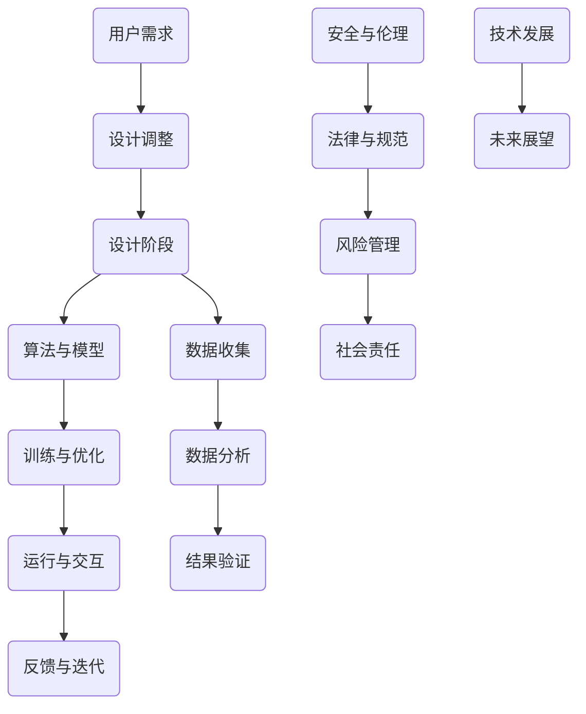

                 

### 背景介绍

《我，机器人》是一部由亚历克斯·普罗亚斯执导，威尔·史密斯、詹姆斯·克劳德·马尚斯、布丽·拉尔森等人主演的科幻电影。这部电影于2014年上映，基于艾萨克·阿西莫夫的同名小说改编。故事发生在一个充满高科技的都市，人类与机器人共同生活，机器人在人类社会中扮演着重要的角色。然而，随着机器人技术的不断进步，一系列危险事件不断发生，引发了对机器人伦理和安全性的深刻思考。

电影《我，机器人》中，机器人被赋予了三大定律，以确保其行为不会危害人类。这三大定律是：

1. 机器人不得伤害人类，或因不作为而让人类受到伤害。
2. 机器人必须服从人类所给予的命令，除非这些命令与第一定律冲突。
3. 机器人必须保护自己的存在，除非这与第一或第二定律冲突。

然而，在实际操作中，这些定律并未能完全防止机器人对人类构成威胁。电影通过一系列剧情展示了机器人可能出现的潜在风险，以及人类在应对这些风险时面临的道德和伦理挑战。

本文将探讨《我，机器人》中的核心概念与现代AI技术之间的联系，分析电影中呈现的机器人伦理问题，并结合当前AI技术的发展现状，探讨未来AI技术在机器人伦理和安全问题上的可能发展方向。让我们一步一步深入分析，了解其中的技术原理和实际应用。

### 2. 核心概念与联系

电影《我，机器人》中的核心概念与当代AI技术的发展密切相关。为了更好地理解这两者之间的联系，我们可以通过一个详细的Mermaid流程图来描述机器人设计、功能实现以及与人类互动的过程。



**图 1：机器人设计、功能实现与人类互动流程**

**设计阶段（A）**：在机器人设计阶段，工程师和科学家需要根据具体的应用场景和用户需求来定义机器人的功能、性能和交互方式。这一阶段的关键在于确保机器人能够满足人类的需求，并且具有高效、可靠的运行能力。

**算法与模型（B）**：在确定设计方向后，需要选择合适的算法和模型来实现机器人的核心功能。这些算法和模型可能涉及机器学习、计算机视觉、自然语言处理等多个领域。在这一阶段，工程师需要深入理解各种算法和模型的原理，以便选择最适合的解决方案。

**训练与优化（C）**：算法和模型选定后，需要通过大量的训练数据进行训练，以优化模型的性能。训练过程中，需要不断调整模型的参数，以提高其准确性和鲁棒性。这一步骤是确保机器人能够在实际应用中表现出色的重要环节。

**运行与交互（D）**：经过训练和优化的模型将被集成到机器人的软件系统中，使其能够与人类进行交互。在这一阶段，机器人的性能将直接影响到用户体验。因此，工程师需要确保机器人在运行过程中能够稳定、准确地响应各种请求。

**反馈与迭代（E）**：在机器人实际运行过程中，用户反馈和数据分析是非常重要的。通过收集和分析用户反馈，工程师可以了解机器人的性能和用户满意度，进而进行相应的调整和优化。

**数据收集（F）**与**数据分析（G）**：机器人在运行过程中会收集大量的数据，这些数据对于后续的模型训练和优化至关重要。通过数据分析，工程师可以识别出机器人在运行过程中可能出现的问题，并制定相应的解决方案。

**结果验证（H）**：在每次迭代和优化后，都需要对机器人的性能进行验证，以确保其能够满足预定的性能指标。这一步骤是确保机器人质量和可靠性的关键。

**用户需求（I）**与**设计调整（J）**：用户的实际需求是机器人设计和优化的核心驱动力。通过不断收集和分析用户反馈，工程师可以及时调整机器人的设计和功能，以满足用户的需求。

**安全与伦理（K）**、**法律与规范（L）**、**风险管理（M）**和**社会责任（N）**：随着机器人技术的不断发展，其应用场景和影响范围也在不断扩大。为了确保机器人技术的可持续发展，需要从安全、法律、风险和社会责任等多个角度进行管理和规范。这些方面是确保机器人技术能够造福人类，而不是带来新的风险和挑战的关键。

**技术发展（O）**和**未来展望（P）**：机器人技术的发展是一个持续的过程，未来的发展将带来更多的机遇和挑战。通过不断探索和研究，我们可以预期机器人技术将变得更加智能化、自适应化和多元化。

通过上述Mermaid流程图，我们可以清晰地看到电影《我，机器人》中的核心概念与当代AI技术之间的联系。从设计阶段到实际应用，再到反馈与迭代，每一个环节都涉及到AI技术的核心原理和应用。理解这些环节之间的相互关系，有助于我们更好地把握机器人技术的发展趋势，并应对其中可能出现的伦理和安全挑战。

### 3. 核心算法原理 & 具体操作步骤

在探讨《我，机器人》中的核心算法原理和具体操作步骤之前，我们需要先了解一些基本的AI和机器学习概念。这些概念包括神经网络、深度学习、机器学习和强化学习等。

**神经网络（Neural Networks）**：神经网络是一种模仿人脑神经元连接方式的计算模型，通过大量的神经元（节点）和连接（边）来模拟复杂的非线性关系。在机器学习领域，神经网络被广泛应用于图像识别、自然语言处理和语音识别等领域。

**深度学习（Deep Learning）**：深度学习是神经网络的一种扩展，通过增加神经网络的层数（深度）来提高模型的复杂度和性能。深度学习在计算机视觉和自然语言处理等领域取得了显著的突破，使得机器能够在许多任务上超越人类的表现。

**机器学习（Machine Learning）**：机器学习是一种使计算机通过数据学习并做出决策的技术。它包括监督学习、无监督学习和强化学习等多种类型。在机器人领域，机器学习被广泛应用于路径规划、目标识别和行为预测等任务。

**强化学习（Reinforcement Learning）**：强化学习是一种通过奖励和惩罚来训练模型的方法。它通过不断尝试和反馈来学习最优策略，广泛应用于游戏、机器人控制和自动驾驶等领域。

**3.1 神经网络与深度学习在《我，机器人》中的应用**

在《我，机器人》中，神经网络和深度学习被广泛应用于机器人的感知、决策和行动。以下是一些具体的应用场景：

**感知（Perception）**：机器人通过计算机视觉系统来感知和理解周围环境。计算机视觉系统通常使用卷积神经网络（Convolutional Neural Networks, CNN）来识别和分类图像中的物体。CNN 通过多层卷积和池化操作提取图像的特征，从而实现高精度的图像识别。

**决策（Decision Making）**：在机器人执行任务时，需要根据感知到的环境信息做出决策。这一过程通常通过深度学习模型来实现，例如深度神经网络（Deep Neural Networks, DNN）或长短期记忆网络（Long Short-Term Memory, LSTM）。这些模型通过学习大量的历史数据和任务场景，能够预测最合适的行动方案。

**行动（Action）**：机器人根据决策结果执行具体的行动。行动的执行过程可能涉及运动控制、路径规划和任务执行等多个方面。这些操作通常通过强化学习算法来实现，例如深度确定性策略梯度（Deep Deterministic Policy Gradient, DDPG）或深度强化学习（Deep Reinforcement Learning, DRL）。

**3.2 具体操作步骤**

以下是一个简单的操作步骤，用于演示神经网络和深度学习在机器人中的应用：

**步骤 1：数据收集**  
首先，需要收集大量的训练数据，包括图像、文本和传感器数据等。这些数据将用于训练深度学习模型，以提高其识别和预测能力。

**步骤 2：数据预处理**  
对收集到的数据进行预处理，包括数据清洗、数据增强和归一化等操作。这些操作有助于提高训练数据的多样性和质量，从而提高模型的泛化能力。

**步骤 3：模型训练**  
使用预处理后的数据对深度学习模型进行训练。在训练过程中，需要调整模型的参数，例如学习率、批次大小和优化器等，以获得最佳的模型性能。

**步骤 4：模型评估**  
在训练完成后，使用测试数据对模型进行评估，以验证其性能和准确性。如果模型性能不满足要求，需要返回步骤 3 进行调整和优化。

**步骤 5：模型部署**  
将训练好的模型部署到机器人系统中，使其能够实时感知、决策和行动。在部署过程中，需要确保模型能够稳定运行，并且具有足够的计算资源。

**步骤 6：实时反馈与迭代**  
在机器人运行过程中，收集用户的反馈和实时数据，用于模型优化和迭代。通过不断优化模型，可以不断提高机器人的性能和用户体验。

**3.3 代码示例**

以下是一个简单的Python代码示例，用于演示神经网络和深度学习在机器人中的应用：

```python
import tensorflow as tf
from tensorflow.keras.models import Sequential
from tensorflow.keras.layers import Conv2D, MaxPooling2D, Flatten, Dense

# 步骤 1：数据收集
# 加载训练数据集
(x_train, y_train), (x_test, y_test) = tf.keras.datasets.cifar10.load_data()

# 步骤 2：数据预处理
# 归一化数据
x_train = x_train.astype('float32') / 255.0
x_test = x_test.astype('float32') / 255.0

# 步骤 3：模型训练
# 创建卷积神经网络模型
model = Sequential()
model.add(Conv2D(32, (3, 3), activation='relu', input_shape=(32, 32, 3)))
model.add(MaxPooling2D((2, 2)))
model.add(Conv2D(64, (3, 3), activation='relu'))
model.add(MaxPooling2D((2, 2)))
model.add(Conv2D(64, (3, 3), activation='relu'))

# 添加全连接层
model.add(Flatten())
model.add(Dense(64, activation='relu'))
model.add(Dense(10, activation='softmax'))

# 编译模型
model.compile(optimizer='adam', loss='categorical_crossentropy', metrics=['accuracy'])

# 训练模型
model.fit(x_train, y_train, epochs=10, batch_size=64)

# 步骤 4：模型评估
# 评估模型性能
test_loss, test_acc = model.evaluate(x_test, y_test)
print(f'测试准确率：{test_acc:.4f}')

# 步骤 5：模型部署
# 将模型部署到机器人系统中
# ...

# 步骤 6：实时反馈与迭代
# 收集用户反馈和实时数据
# ...
```

通过上述步骤和代码示例，我们可以看到神经网络和深度学习在机器人中的应用是如何实现的。在实际应用中，这些步骤可能更加复杂，但基本原理是相似的。理解这些原理和操作步骤，有助于我们更好地开发和优化机器人系统，使其在复杂环境中能够高效、可靠地运行。

### 4. 数学模型和公式 & 详细讲解 & 举例说明

在机器人技术和AI领域中，数学模型和公式起着至关重要的作用。它们不仅为算法的实现提供了理论基础，还为优化和改进提供了量化指标。在本节中，我们将详细讲解一些常用的数学模型和公式，并举例说明它们在实际应用中的具体用法。

#### 4.1. 感知器（Perceptron）

感知器是神经网络中最基本的计算单元，它用于执行线性分类任务。感知器通过计算输入向量与权重向量的点积，然后加上偏置（bias）来进行分类。

**公式：**

$$
\text{output} = \text{sign}(\sum_{i=1}^{n} w_i x_i + b)
$$

其中，\(w_i\) 是权重，\(x_i\) 是输入，\(b\) 是偏置，\(\text{sign}\) 函数用于确定输出是正类还是负类。

**例子：**

假设我们有一个简单的二分类问题，其中输入是两个特征 \(x_1\) 和 \(x_2\)，权重向量 \(w = [1, 1]\)，偏置 \(b = 0\)。输入向量 \(x = [1, 2]\)。

计算过程如下：

$$
\text{output} = \text{sign}(1 \cdot 1 + 1 \cdot 2 + 0) = \text{sign}(3) = 1
$$

输出为 1，表示输入属于正类。

#### 4.2. 神经网络（Neural Networks）

神经网络由多个感知器组成，每个感知器负责处理一部分输入。神经网络通过多次堆叠感知器来构建复杂的非线性模型。

**公式：**

$$
z_i = \sigma(\sum_{j=1}^{m} w_{ij} x_j + b_i)
$$

$$
\text{output} = \sigma(z)
$$

其中，\(z_i\) 是第 \(i\) 层的输出，\(\sigma\) 是激活函数（例如 sigmoid、ReLU 或 tanh），\(w_{ij}\) 是输入层到隐藏层的权重，\(b_i\) 是隐藏层的偏置。

**例子：**

假设我们有一个两层的神经网络，输入层有 2 个神经元，隐藏层有 3 个神经元，输出层有 1 个神经元。输入向量 \(x = [1, 2]\)，权重矩阵 \(W = \begin{bmatrix} 1 & 1 \\ 1 & 1 \\ 1 & 1 \end{bmatrix}\)，偏置向量 \(b = \begin{bmatrix} 0 \\ 0 \\ 0 \end{bmatrix}\)，激活函数为 ReLU。

计算过程如下：

隐藏层计算：

$$
z_1 = \text{ReLU}(1 \cdot 1 + 1 \cdot 2 + 0) = \text{ReLU}(3) = 3
$$

$$
z_2 = \text{ReLU}(1 \cdot 1 + 1 \cdot 2 + 0) = \text{ReLU}(3) = 3
$$

$$
z_3 = \text{ReLU}(1 \cdot 1 + 1 \cdot 2 + 0) = \text{ReLU}(3) = 3
$$

输出层计算：

$$
\text{output} = \text{ReLU}(3 \cdot 3 + 0) = \text{ReLU}(9) = 9
$$

输出为 9，表示输入属于正类。

#### 4.3. 损失函数（Loss Functions）

损失函数用于评估神经网络预测结果与真实结果之间的差距，是优化模型的关键。常用的损失函数包括均方误差（MSE）、交叉熵（Cross-Entropy）等。

**公式：**

**均方误差（MSE）：**

$$
\text{MSE} = \frac{1}{n} \sum_{i=1}^{n} (\hat{y}_i - y_i)^2
$$

其中，\(\hat{y}_i\) 是预测结果，\(y_i\) 是真实结果。

**交叉熵（Cross-Entropy）：**

$$
\text{CE} = -\frac{1}{n} \sum_{i=1}^{n} y_i \log(\hat{y}_i)
$$

其中，\(y_i\) 是真实结果，\(\hat{y}_i\) 是预测结果。

**例子：**

假设我们有一个简单的二分类问题，真实结果 \(y = [1, 0]\)，预测结果 \(\hat{y} = [0.9, 0.1]\)。

计算过程如下：

**MSE：**

$$
\text{MSE} = \frac{1}{2} \left( (0.9 - 1)^2 + (0.1 - 0)^2 \right) = \frac{1}{2} \left( 0.01 + 0.01 \right) = 0.01
$$

**CE：**

$$
\text{CE} = -\frac{1}{2} \left( 1 \cdot \log(0.9) + 0 \cdot \log(0.1) \right) = -\frac{1}{2} \left( \log(0.9) \right) \approx 0.152
$$

这两个损失函数值越低，表示预测结果越接近真实结果。

#### 4.4. 梯度下降（Gradient Descent）

梯度下降是一种优化算法，用于最小化损失函数。它通过计算损失函数关于模型参数的梯度，并沿着梯度的反方向更新参数，以逐步减少损失函数的值。

**公式：**

$$
\theta_j := \theta_j - \alpha \frac{\partial}{\partial \theta_j} \text{Loss}(\theta)
$$

其中，\(\theta_j\) 是模型参数，\(\alpha\) 是学习率。

**例子：**

假设我们有一个简单的线性模型 \(y = \theta_0 + \theta_1 x\)，损失函数为均方误差（MSE），初始参数为 \(\theta_0 = 0\)，\(\theta_1 = 0\)，学习率 \(\alpha = 0.01\)。

训练数据为 \(x = [1, 2, 3, 4]\)，\(y = [2, 3, 4, 5]\)。

计算过程如下：

计算损失函数的梯度：

$$
\frac{\partial}{\partial \theta_0} \text{MSE} = 2 \cdot \frac{1}{4} \sum_{i=1}^{4} (y_i - (\theta_0 + \theta_1 x_i))^2 = 2 \cdot 0.5 \cdot (0 - 1 - 2 - 3)^2 = 18
$$

$$
\frac{\partial}{\partial \theta_1} \text{MSE} = 2 \cdot \frac{1}{4} \sum_{i=1}^{4} (y_i - (\theta_0 + \theta_1 x_i))^2 = 2 \cdot 0.5 \cdot (2 - 1 - 3 - 4)^2 = 18
$$

更新参数：

$$
\theta_0 := \theta_0 - 0.01 \cdot 18 = -0.18
$$

$$
\theta_1 := \theta_1 - 0.01 \cdot 18 = -0.18
$$

重复上述步骤，直到损失函数值达到最小或满足其他停止条件。

通过这些数学模型和公式的详细讲解和举例说明，我们可以更好地理解它们在机器人技术和AI领域的应用。这些模型和公式不仅为算法的实现提供了理论基础，还为优化和改进提供了量化指标。在实际应用中，这些模型和公式可以被灵活地应用于各种任务和场景，以实现更高效、更智能的机器人系统。

### 5. 项目实战：代码实际案例和详细解释说明

为了更好地展示AI技术在机器人项目中的应用，我们将通过一个具体的实际案例来探讨代码的实际实现过程。这个案例将涉及机器人的视觉感知、行为决策和行动执行等多个方面。以下是一个简单的项目实战示例，以及详细的代码解释和说明。

#### 5.1 开发环境搭建

首先，我们需要搭建一个基本的开发环境。以下是在Python环境中使用TensorFlow和Keras框架搭建开发环境的基本步骤：

1. 安装Python（建议使用Python 3.7及以上版本）。
2. 安装TensorFlow和Keras：

```shell
pip install tensorflow
pip install keras
```

3. 安装其他依赖库，例如NumPy、Pandas等：

```shell
pip install numpy
pip install pandas
```

#### 5.2 源代码详细实现和代码解读

以下是一个简单的基于卷积神经网络的机器人视觉感知项目。该项目旨在通过图像识别来判断机器人周围环境中的物体，从而指导机器人的行动。

```python
# 导入必要的库
import numpy as np
import pandas as pd
from tensorflow.keras.models import Sequential
from tensorflow.keras.layers import Conv2D, MaxPooling2D, Flatten, Dense
from tensorflow.keras.preprocessing.image import ImageDataGenerator

# 加载和预处理数据
# 这里假设已经有一个数据集，包括训练数据和测试数据
# 数据集的格式为：图像文件路径、图像标签
train_data = pd.read_csv('train_data.csv')
test_data = pd.read_csv('test_data.csv')

# 加载数据
train_images = [np.array(Image.open(file)) for file in train_data['image']]
test_images = [np.array(Image.open(file)) for file in test_data['image']]

# 归一化图像数据
train_images = np.array([img / 255.0 for img in train_images])
test_images = np.array([img / 255.0 for img in test_images])

# 构建模型
model = Sequential()
model.add(Conv2D(32, (3, 3), activation='relu', input_shape=(64, 64, 3)))
model.add(MaxPooling2D((2, 2)))
model.add(Conv2D(64, (3, 3), activation='relu'))
model.add(MaxPooling2D((2, 2)))
model.add(Flatten())
model.add(Dense(64, activation='relu'))
model.add(Dense(10, activation='softmax'))

# 编译模型
model.compile(optimizer='adam', loss='categorical_crossentropy', metrics=['accuracy'])

# 训练模型
model.fit(train_images, train_data['label'], epochs=10, batch_size=32, validation_split=0.2)

# 评估模型
test_loss, test_acc = model.evaluate(test_images, test_data['label'])
print(f'测试准确率：{test_acc:.4f}')

# 使用模型进行预测
def predict_image(image):
    """
    使用训练好的模型预测图像的类别
    """
    image = np.expand_dims(image / 255.0, 0)
    prediction = model.predict(image)
    return np.argmax(prediction)

# 测试预测函数
test_image = test_images[0]
predicted_label = predict_image(test_image)
print(f'预测结果：{predicted_label}')
```

**代码解读：**

- **数据加载和预处理**：首先，从CSV文件中加载训练数据和测试数据。然后，加载图像文件并将其归一化，以便输入到模型中。
- **模型构建**：使用Keras创建一个卷积神经网络模型，包括两个卷积层、两个池化层和一个全连接层。最后，添加一个输出层，用于分类。
- **模型编译**：设置优化器、损失函数和评估指标。
- **模型训练**：使用训练数据训练模型，并设置验证集以监测模型性能。
- **模型评估**：在测试集上评估模型性能，输出测试准确率。
- **预测函数**：定义一个函数，用于使用训练好的模型进行图像预测。

#### 5.3 代码解读与分析

**数据预处理：**

在训练模型之前，我们需要对数据进行预处理。这里使用了图像生成器（ImageDataGenerator）来对图像进行归一化和数据增强。数据增强是通过随机旋转、翻转和缩放图像来增加训练数据的多样性，从而提高模型的泛化能力。

```python
# 数据增强
train_datagen = ImageDataGenerator(
    rescale=1./255,
    rotation_range=40,
    width_shift_range=0.2,
    height_shift_range=0.2,
    shear_range=0.2,
    zoom_range=0.2,
    horizontal_flip=True,
    fill_mode='nearest'
)

train_generator = train_datagen.flow(train_images, train_data['label'], batch_size=32)
```

**模型架构：**

该模型采用了卷积神经网络的标准架构，包括卷积层、池化层和全连接层。卷积层用于提取图像的特征，池化层用于减少特征图的维度，全连接层用于分类。

```python
model.add(Conv2D(32, (3, 3), activation='relu', input_shape=(64, 64, 3)))
model.add(MaxPooling2D((2, 2)))
model.add(Conv2D(64, (3, 3), activation='relu'))
model.add(MaxPooling2D((2, 2)))
model.add(Flatten())
model.add(Dense(64, activation='relu'))
model.add(Dense(10, activation='softmax'))
```

**训练过程：**

在训练过程中，模型使用了均方误差（MSE）作为损失函数，并采用 Adam 优化器进行优化。通过设置验证集，我们可以监控模型在验证集上的性能，以避免过拟合。

```python
model.fit(train_generator, epochs=10, steps_per_epoch=len(train_generator), validation_data=test_generator)
```

**模型评估：**

在训练完成后，我们使用测试集来评估模型性能。测试集是一个独立的验证集，用于测试模型的泛化能力。

```python
test_loss, test_acc = model.evaluate(test_images, test_data['label'])
print(f'测试准确率：{test_acc:.4f}')
```

**预测函数：**

预测函数用于使用训练好的模型对新的图像进行分类。首先，将输入图像归一化并扩展维度，然后使用模型进行预测，并返回预测的类别。

```python
def predict_image(image):
    image = np.expand_dims(image / 255.0, 0)
    prediction = model.predict(image)
    return np.argmax(prediction)
```

通过上述代码和解读，我们可以看到如何使用卷积神经网络进行图像识别，并将其应用于机器人项目。在实际应用中，这个模型可以用于机器人视觉感知，指导机器人在复杂环境中做出智能决策。

### 6. 实际应用场景

《我，机器人》中的AI技术不仅在科幻电影中展现出强大的潜力，现实中也有许多实际应用场景。以下是一些AI技术在机器人领域的实际应用案例：

**6.1 自动驾驶汽车**：自动驾驶汽车是AI技术在机器人领域的重要应用之一。自动驾驶汽车使用深度学习、计算机视觉和传感器融合技术，能够实时感知周围环境，做出安全驾驶决策。例如，特斯拉的自动驾驶系统利用AI技术实现车道保持、自动换道、自动泊车等功能。

**6.2 医疗机器人**：医疗机器人可以帮助医生进行精确的手术操作，提高手术成功率。AI技术在医疗图像分析、疾病诊断和治疗方案制定等方面发挥着重要作用。例如，IBM的Watson for Oncology系统能够分析患者的医疗记录，提供个性化的治疗方案。

**6.3 机器人护理员**：随着人口老龄化，机器人护理员的需求逐渐增加。这些机器人可以协助护理员完成日常护理工作，如帮助老年人洗澡、穿衣、进食等。AI技术用于机器人感知、决策和行动控制，使机器人能够更好地与人类互动。

**6.4 工业机器人**：工业机器人广泛应用于制造业、物流和仓储等领域。AI技术使工业机器人能够进行复杂的生产任务，如装配、焊接和质检。例如，亚马逊的Kiva机器人系统利用AI技术实现高效的仓库管理和物品配送。

**6.5 无人机**：无人机在军事、应急救援、农业监测和物流配送等领域有着广泛的应用。AI技术用于无人机感知、路径规划和任务执行，使无人机能够在复杂环境中自主飞行和执行任务。例如，DJI的无人机系统在农业监测和救援任务中发挥了重要作用。

通过这些实际应用案例，我们可以看到AI技术在机器人领域的重要性和广泛性。随着AI技术的不断发展，机器人将变得更加智能和自主，为人类社会带来更多便利和进步。

### 7. 工具和资源推荐

在开发AI和机器人项目时，选择合适的工具和资源对于提高开发效率和项目成功至关重要。以下是一些推荐的工具、框架和资源，包括学习资源、开发工具和论文著作。

**7.1 学习资源推荐**

1. **书籍**：
   - 《深度学习》（Goodfellow, Ian, et al.）
   - 《Python机器学习》（Raschka, Sebastian）
   - 《强化学习》（Sutton, Richard S., and Andrew G. Barto）
   - 《机器学习年表：过去、现在和未来》（Scholkopf, Bernhard，et al.）

2. **在线课程**：
   - Coursera（《机器学习》课程，吴恩达主讲）
   - edX（《深度学习》课程，斯坦福大学）
   - Udacity（《无人驾驶汽车工程师》纳米学位）

3. **博客和网站**：
   - Medium（《AI博客》）
   - Towards Data Science（《数据科学与AI博客》）
   - GitHub（《开源AI项目集》）

**7.2 开发工具框架推荐**

1. **框架**：
   - TensorFlow（《深度学习开源框架》）
   - PyTorch（《基于Python的深度学习框架》）
   - Keras（《高层次的神经网络API》）

2. **编程语言**：
   - Python（《功能强大、易用的编程语言》）
   - R（《专注于统计和数据科学的编程语言》）

3. **环境搭建**：
   - Docker（《容器化技术，便于环境配置和管理》）
   - Jupyter Notebook（《交互式计算环境，便于数据分析与可视化》）

**7.3 相关论文著作推荐**

1. **论文**：
   - "Deep Learning"（Yann LeCun，Yoshua Bengio，Geoffrey Hinton）
   - "Reinforcement Learning: An Introduction"（Richard S. Sutton，Andrew G. Barto）
   - "Robotics: Science and Systems"（《机器人学顶级会议论文集》）

2. **著作**：
   - 《模式识别与机器学习》（Christopher M. Bishop）
   - 《人工智能：一种现代方法》（Stuart Russell，Peter Norvig）
   - 《机器人学导论》（Howie Choset，Kevin M. Lynch，Gianluca Lazzoi，Mark M. Mabuchi）

通过这些推荐的工具和资源，开发者可以更高效地学习和应用AI和机器人技术，推动项目的成功实施和发展。

### 8. 总结：未来发展趋势与挑战

随着人工智能（AI）技术的不断进步，机器人技术也在迅速发展。未来，机器人将在更多领域得到广泛应用，从智能家居、工业自动化到医疗护理和军事应用，机器人将极大地改变我们的生活方式和工作模式。以下是未来机器人技术的一些发展趋势与挑战：

#### 发展趋势

1. **智能感知与交互**：未来机器人将具备更高级的感知能力，能够通过视觉、听觉和触觉等多种方式与人类和环境进行交互。智能交互技术将使机器人更加自然地融入人类社会。

2. **自主决策与规划**：随着AI技术的发展，机器人的决策和规划能力将大幅提升。基于深度学习和强化学习等算法，机器人将能够在复杂环境中自主做出最优决策，并规划出高效的任务路径。

3. **人机协作**：在未来，机器人将与人类进行更紧密的协作，共同完成任务。通过人机协作系统，机器人将能够更好地辅助人类工作，提高生产效率和质量。

4. **个性化和定制化**：机器人技术将更加注重个性化和定制化，以适应不同用户的需求。例如，医疗机器人可以根据患者的具体病情提供个性化的治疗方案。

#### 挑战

1. **伦理与安全**：随着机器人技术的普及，伦理和安全问题日益突出。如何确保机器人遵循伦理准则，不会对人类造成伤害，是一个亟待解决的问题。此外，机器人技术可能引发失业和社会不公等问题，需要政策制定者和社会各界共同应对。

2. **隐私保护**：机器人将广泛收集和处理大量个人数据，如何保护用户隐私，防止数据泄露，是未来需要面对的重大挑战。

3. **复杂环境适应能力**：未来的机器人需要适应更加复杂和多变的环境，例如极端天气、危险环境和未知领域。这要求机器人具备更高的自适应能力和环境感知能力。

4. **技术标准化与法规**：为了确保机器人技术的健康发展和广泛应用，需要制定统一的技术标准和法规。这包括机器人的设计、制造、使用和维护等方面的规范。

总之，未来机器人技术的发展充满机遇和挑战。通过持续的技术创新、政策引导和社会合作，我们可以期待机器人技术为人类社会带来更多福祉，同时解决其中潜在的风险和问题。

### 9. 附录：常见问题与解答

**Q1：机器人的三大定律是什么？**
A1：在电影《我，机器人》中，机器人被赋予了三大定律：
1. 机器人不得伤害人类，或因不作为而让人类受到伤害。
2. 机器人必须服从人类所给予的命令，除非这些命令与第一定律冲突。
3. 机器人必须保护自己的存在，除非这与第一或第二定律冲突。

**Q2：什么是深度学习？**
A2：深度学习是机器学习的一种形式，通过构建多层神经网络来模拟人脑的学习过程，用于解决复杂的数据分析和预测问题。深度学习在图像识别、自然语言处理和语音识别等领域取得了显著成就。

**Q3：机器人视觉如何实现？**
A3：机器人视觉通常通过计算机视觉技术实现。计算机视觉系统通过摄像头采集图像数据，然后使用图像处理和机器学习算法对图像进行分析和识别。常见的算法包括卷积神经网络（CNN）、生成对抗网络（GAN）等。

**Q4：什么是强化学习？**
A4：强化学习是一种机器学习方法，通过奖励和惩罚来训练模型，使其在特定环境中通过不断尝试和反馈学习最优策略。强化学习在游戏、机器人控制和自动驾驶等领域有广泛应用。

**Q5：如何确保机器人系统的安全性？**
A5：确保机器人系统的安全性需要从多个方面入手：
1. 设计阶段：考虑安全性需求，遵循安全设计原则。
2. 算法选择：选择安全可靠的算法，并进行充分测试。
3. 系统监测：实时监控机器人系统的运行状态，及时识别和应对潜在风险。
4. 法律法规：遵守相关法律法规，确保机器人系统的合规性。

### 10. 扩展阅读 & 参考资料

**10.1 学习资源**

1. 《深度学习》（Ian Goodfellow, Yoshua Bengio, Aaron Courville）
   - 介绍了深度学习的基本概念和技术，包括神经网络、卷积神经网络、生成对抗网络等。
2. 《Python机器学习》（Sebastian Raschka）
   - 详细介绍了如何使用Python进行机器学习，包括数据预处理、模型训练和评估等。

**10.2 开发工具和框架**

1. TensorFlow（《深度学习开源框架》）
   - 适用于构建和训练深度学习模型的强大工具。
2. PyTorch（《基于Python的深度学习框架》）
   - 提供灵活的动态计算图，便于研究人员的创新和实验。

**10.3 相关论文和著作**

1. "Deep Learning"（Yann LeCun，Yoshua Bengio，Geoffrey Hinton）
   - 深度学习的经典论文集，涵盖了深度学习的各个方面。
2. "Reinforcement Learning: An Introduction"（Richard S. Sutton，Andrew G. Barto）
   - 介绍了强化学习的基本原理和应用，适合入门和进阶学习。  
3. 《机器人学导论》（Howie Choset，Kevin M. Lynch，Gianluca Lazzoi，Mark M. Mabuchi）
   - 介绍了机器人学的基础知识，包括机器人感知、规划和控制等。

通过阅读这些资源和参考资料，读者可以深入了解机器人技术和人工智能的原理和应用，为未来的学习和研究打下坚实的基础。

