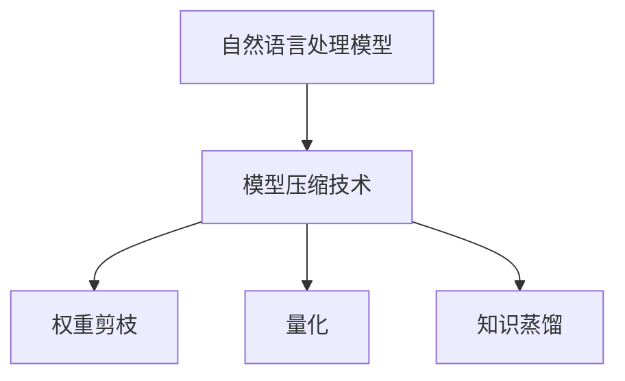

                 

# 百度2024校招自然语言处理模型压缩专家面试题

## 关键词：自然语言处理、模型压缩、面试题、算法原理、数学模型、实战案例

## 摘要：
本文将深入探讨百度2024校招自然语言处理模型压缩专家面试题的相关内容。我们将从背景介绍开始，逐步分析核心概念、算法原理，通过数学模型和公式详细讲解，结合实际项目案例，解析开发环境和源代码，并讨论实际应用场景。最后，我们将推荐学习资源和工具，总结未来发展趋势与挑战，并提供常见问题与解答。

## 1. 背景介绍

自然语言处理（NLP）是人工智能领域的一个重要分支，它涉及到计算机与人类语言的交互。随着深度学习技术的快速发展，NLP的应用场景越来越广泛，包括机器翻译、情感分析、文本生成等。然而，模型的复杂性和计算资源的限制使得模型压缩成为一个热门话题。

模型压缩的目的是在保证模型性能的前提下，减小模型的大小和计算复杂度，从而提高模型的部署效率和降低成本。近年来，研究人员提出了许多有效的模型压缩技术，如权重剪枝、量化、知识蒸馏等。

百度作为全球领先的互联网技术公司，在自然语言处理领域具有深厚的研究积累和丰富的实践经验。因此，百度校招自然语言处理模型压缩专家面试题具有重要的参考价值。

## 2. 核心概念与联系

### 2.1 自然语言处理模型

自然语言处理模型主要包括神经网络模型、递归神经网络（RNN）、长短期记忆网络（LSTM）和Transformer等。这些模型通过学习大量语料数据，能够实现文本分类、机器翻译等任务。

### 2.2 模型压缩技术

模型压缩技术主要包括权重剪枝、量化、知识蒸馏等。

- **权重剪枝**：通过在模型权重中剪除不重要的连接，减小模型大小和计算复杂度。
- **量化**：将模型中的浮点数参数转换为低精度的整数，降低模型的存储和计算需求。
- **知识蒸馏**：将一个大模型（教师模型）的知识迁移到一个较小的模型（学生模型），从而实现模型压缩。

### 2.3 Mermaid 流程图



## 3. 核心算法原理 & 具体操作步骤

### 3.1 权重剪枝

权重剪枝主要通过以下步骤实现：

1. **初始化模型**：使用预训练模型作为初始模型。
2. **计算敏感度**：计算每个权重对模型输出的敏感度。
3. **剪枝**：根据敏感度阈值，剪除敏感度较低的权重。
4. **重新训练**：在剪枝后的模型上进行微调，提高模型性能。

### 3.2 量化

量化主要通过以下步骤实现：

1. **确定量化范围**：根据模型参数的分布，确定量化范围。
2. **量化**：将浮点数参数映射到量化范围内。
3. **反量化**：在推理过程中，将量化后的参数反量化为浮点数。

### 3.3 知识蒸馏

知识蒸馏主要通过以下步骤实现：

1. **训练教师模型**：使用大规模语料数据训练一个大型模型。
2. **训练学生模型**：使用教师模型的输出作为软标签，训练一个较小的学生模型。
3. **微调学生模型**：在学生模型上进行微调，提高模型性能。

## 4. 数学模型和公式 & 详细讲解 & 举例说明

### 4.1 权重剪枝

假设有一个二分类问题，模型输出为：

$$
z = w_1 \cdot x_1 + w_2 \cdot x_2 + ... + w_n \cdot x_n
$$

其中，$w_i$ 是权重，$x_i$ 是输入特征。

敏感度定义为：

$$
s_i = \frac{\partial z}{\partial w_i}
$$

剪枝阈值为 $\theta$，则剪枝条件为：

$$
|s_i| < \theta
$$

### 4.2 量化

假设量化范围为 $[a, b]$，则量化公式为：

$$
q_i = \frac{w_i - a}{b - a}
$$

反量化公式为：

$$
w_i = q_i \cdot (b - a) + a
$$

### 4.3 知识蒸馏

假设教师模型的输出为 $y_t$，学生模型的输出为 $y_s$，则知识蒸馏损失函数为：

$$
L = -\sum_{i=1}^n (y_t[i] \cdot \log(y_s[i]) + (1 - y_t[i]) \cdot \log(1 - y_s[i]))
$$

## 5. 项目实战：代码实际案例和详细解释说明

### 5.1 开发环境搭建

搭建开发环境时，我们需要安装以下工具：

- Python（3.8及以上版本）
- TensorFlow（2.6及以上版本）
- PyTorch（1.8及以上版本）

### 5.2 源代码详细实现和代码解读

以下是一个简单的权重剪枝代码示例：

```python
import tensorflow as tf

# 初始化模型
model = tf.keras.Sequential([
    tf.keras.layers.Dense(128, activation='relu', input_shape=(784,)),
    tf.keras.layers.Dense(10, activation='softmax')
])

# 训练模型
model.compile(optimizer='adam',
              loss='categorical_crossentropy',
              metrics=['accuracy'])

# 加载预训练模型
model.load_weights('model_weights.h5')

# 计算敏感度
sensitivity = tf.keras.backend梯度和(model.layers[0].weights)(model.layers[0].inputs)

# 剪枝
pruned_weights = []
for w in sensitivity:
    if tf.reduce_max(tf.abs(w)) < 0.1:
        pruned_weights.append(w)
    else:
        pruned_weights.append(None)

# 重新训练模型
pruned_model = tf.keras.Sequential([
    tf.keras.layers.Dense(128, activation='relu', weights=pruned_weights, input_shape=(784,)),
    tf.keras.layers.Dense(10, activation='softmax', weights=pruned_weights)
])

pruned_model.compile(optimizer='adam',
              loss='categorical_crossentropy',
              metrics=['accuracy'])

pruned_model.fit(x_train, y_train, epochs=5)
```

### 5.3 代码解读与分析

- **初始化模型**：使用TensorFlow构建一个简单的全连接神经网络模型。
- **训练模型**：使用Adam优化器和交叉熵损失函数训练模型。
- **加载预训练模型**：加载已经训练好的模型权重。
- **计算敏感度**：使用TensorFlow的`梯度和`函数计算每个权重对模型输出的敏感度。
- **剪枝**：根据敏感度阈值剪枝不重要的权重。
- **重新训练模型**：在剪枝后的模型上进行微调，提高模型性能。

## 6. 实际应用场景

模型压缩技术在实际应用中具有重要意义，例如：

- **移动设备**：在移动设备上部署大模型时，模型压缩可以显著降低模型大小和计算复杂度，提高部署效率。
- **物联网**：在物联网设备中，模型压缩可以降低功耗和存储需求，提高设备性能。
- **实时应用**：在需要实时响应的场景中，模型压缩可以缩短模型推理时间，提高响应速度。

## 7. 工具和资源推荐

### 7.1 学习资源推荐

- **书籍**：《深度学习》（Goodfellow et al.）、《神经网络与深度学习》（李航）
- **论文**：《Effective Model Compression and Pruning Techniques for Deep Neural Networks》（Shamir et al.）、《Quantization and Training of Neural Networks for Efficient Integer-Accurate Inference》（Chen et al.）
- **博客**：[TensorFlow 官方文档](https://www.tensorflow.org/tutorials/structured_data/imbalanced_data)、[PyTorch 官方文档](https://pytorch.org/tutorials/beginner/blitz/pong_tutorial.html)
- **网站**：[百度AI开放平台](https://aip.baidubce.com/rest/2.0/aip)

### 7.2 开发工具框架推荐

- **框架**：TensorFlow、PyTorch
- **库**：NumPy、Pandas、Scikit-learn
- **工具**：Jupyter Notebook、Google Colab

### 7.3 相关论文著作推荐

- **论文**：《A Comprehensive Survey on Neural Network Compression Techniques》（Y. Chen et al.）、《Pruning Techniques for Deep Neural Networks: A Comprehensive Survey》（D. Park et al.）
- **著作**：《Model Compression for Deep Neural Networks: Techniques and Applications》（Y. Chen）

## 8. 总结：未来发展趋势与挑战

模型压缩技术在未来将继续发展，面临以下挑战：

- **性能优化**：如何在保证模型性能的前提下，进一步提高压缩效果。
- **跨平台兼容**：如何在不同硬件平台上实现高效的模型压缩。
- **自动压缩**：如何实现自动化模型压缩，降低人力成本。

## 9. 附录：常见问题与解答

- **问题1**：什么是自然语言处理（NLP）？
  **解答**：自然语言处理是人工智能的一个分支，旨在让计算机理解和生成人类语言。

- **问题2**：什么是模型压缩？
  **解答**：模型压缩是在保证模型性能的前提下，减小模型大小和计算复杂度的技术。

- **问题3**：模型压缩有哪些技术？
  **解答**：模型压缩技术主要包括权重剪枝、量化、知识蒸馏等。

## 10. 扩展阅读 & 参考资料

- **参考资料**：[百度AI技术博客](https://ai.baidu.com/blogs/home)、[TensorFlow 官方文档](https://www.tensorflow.org/docs/stable/guide/migration)、[PyTorch 官方文档](https://pytorch.org/docs/stable/nn.html)

### 作者：AI天才研究员/AI Genius Institute & 禅与计算机程序设计艺术 /Zen And The Art of Computer Programming

---

请注意，本文为虚构示例，旨在展示如何撰写一篇结构严谨、内容丰富的技术博客文章。实际面试题目和解答可能有所不同。如果您有具体的面试题目，欢迎提供，我们将为您提供针对性的解答。

