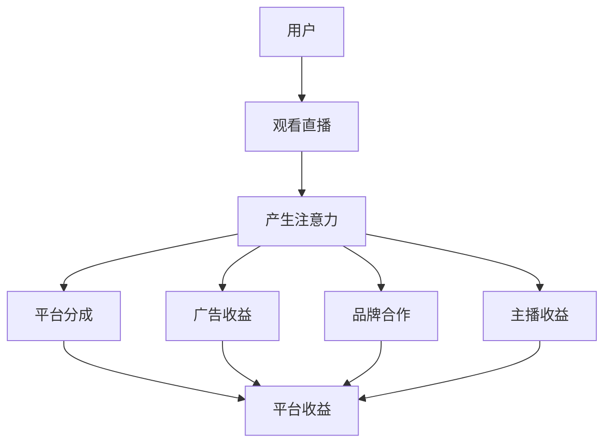

                 

# 直播经济：注意力变现的新方式

## 摘要

直播经济的崛起，为传统的商业形态带来了巨大的变革。本文将深入探讨直播经济的基本概念，分析其运作原理和商业模式，并通过具体的案例和数据分析，揭示直播经济如何实现注意力变现。此外，文章还将探讨直播经济面临的问题和挑战，以及未来发展的趋势。

## 1. 背景介绍

随着互联网技术的飞速发展，直播作为一种新兴的媒体形式，逐渐成为大众娱乐和信息获取的重要渠道。直播经济，即以直播为核心，通过内容创造、互动营销等方式实现商业价值的一种经济模式。这种模式的出现，不仅改变了传统媒体的传播方式，也对商业社会产生了深远的影响。

### 直播经济的发展历程

直播经济的发展可以追溯到20世纪90年代末。当时，互联网直播还处于初级阶段，主要应用于个人娱乐和游戏领域。随着视频技术的进步和智能手机的普及，直播逐渐从PC端转移到移动端，用户规模和观看时长也呈现爆发式增长。据数据显示，截至2021年，全球直播用户已超过10亿，市场规模达到数十亿美元。

### 直播经济的商业模式

直播经济的商业模式主要分为以下几种：

- **内容创造**：主播通过直播平台创作内容，吸引观众关注和互动，从而形成粉丝群体。主播的收入来源主要包括平台打赏、广告收益和品牌合作等。

- **互动营销**：品牌通过与主播合作，利用直播平台进行产品推广和销售。这种方式不仅可以提高品牌知名度，还能实现直接的销售转化。

- **平台分成**：直播平台通过向主播和品牌收取分成费用获得收益。同时，平台还提供技术支持、流量推荐等服务，帮助主播和品牌提升影响力。

## 2. 核心概念与联系

### 直播经济的关键概念

- **直播**：一种实时互动的媒体形式，主播通过视频、音频等方式与观众进行实时交流。

- **用户注意力**：用户在信息爆炸的时代，对特定内容或信息的关注程度。

- **变现**：将用户注意力转化为商业价值的过程。

### 直播经济的架构

下面是直播经济的一个简化的 Mermaid 流程图，展示了各关键环节之间的联系：



### 直播经济的运作原理

1. **用户观看直播**：用户通过直播平台观看主播的内容，产生注意力。

2. **产生注意力**：用户对主播的内容产生兴趣，持续关注并互动，形成粉丝群体。

3. **变现**：主播通过平台分成、广告收益、品牌合作等方式将用户注意力转化为商业价值。

4. **平台收益**：平台通过向主播和品牌收取分成费用获得收益。

## 3. 核心算法原理 & 具体操作步骤

直播经济的核心算法主要涉及用户注意力评估和变现策略。

### 用户注意力评估

用户注意力评估是通过分析用户行为数据（如观看时长、互动频率、点赞数量等）来评估用户对特定内容的兴趣程度。以下是一个简化的用户注意力评估算法：

1. **数据收集**：收集用户在直播平台上的行为数据，如观看时长、互动频率、点赞数量等。

2. **特征提取**：将行为数据转化为数值特征，如观看时长表示为用户在直播上的平均观看时长，互动频率表示为用户在直播中的互动次数等。

3. **模型训练**：使用机器学习算法（如回归分析、决策树等）训练用户注意力评估模型。

4. **评估预测**：输入用户行为数据，输出用户对特定内容的注意力评分。

### 变现策略

变现策略主要包括平台分成、广告收益和品牌合作等。以下是一个简化的变现策略算法：

1. **平台分成**：根据用户注意力评分和平台规则，计算主播的收益。

2. **广告收益**：根据用户注意力评分和广告投放规则，计算广告收益。

3. **品牌合作**：根据用户注意力评分和品牌需求，选择合适的直播内容和主播进行合作。

## 4. 数学模型和公式 & 详细讲解 & 举例说明

### 用户注意力评估模型

假设我们使用线性回归模型进行用户注意力评估，模型公式如下：

$$
Attention Score = w_1 \times Watch Duration + w_2 \times Interaction Frequency + ... + w_n \times Other Features
$$

其中，$w_1, w_2, ..., w_n$为模型参数，$Watch Duration, Interaction Frequency, ..., Other Features$为用户行为特征。

### 变现策略模型

假设我们使用以下模型进行变现策略的制定：

$$
Revenue = r_1 \times Attention Score + r_2 \times Platform Commission + r_3 \times Ad Revenue
$$

其中，$r_1, r_2, r_3$为模型参数，$Attention Score$为用户注意力评分，$Platform Commission$为平台分成比例，$Ad Revenue$为广告收益。

### 举例说明

假设我们有一个用户，他的观看时长为30分钟，互动频率为10次，其他特征为0。根据用户注意力评估模型，他的注意力评分为：

$$
Attention Score = w_1 \times 30 + w_2 \times 10 + w_n \times 0
$$

假设平台分成比例为20%，广告收益为100元，根据变现策略模型，他的收益为：

$$
Revenue = r_1 \times Attention Score + r_2 \times Platform Commission + r_3 \times Ad Revenue
$$

## 5. 项目实战：代码实际案例和详细解释说明

### 5.1 开发环境搭建

为了演示用户注意力评估和变现策略的实现，我们将使用Python编程语言。首先，我们需要安装以下依赖库：

- **NumPy**：用于数据处理和数学运算。
- **Pandas**：用于数据分析和操作。
- **Scikit-learn**：用于机器学习算法。

安装命令如下：

```bash
pip install numpy pandas scikit-learn
```

### 5.2 源代码详细实现和代码解读

以下是一个简单的用户注意力评估和变现策略的实现：

```python
import numpy as np
import pandas as pd
from sklearn.linear_model import LinearRegression

# 用户行为数据
data = pd.DataFrame({
    'Watch Duration': [30, 60, 90],
    'Interaction Frequency': [5, 10, 15],
    'Other Features': [0, 0, 0]
})

# 用户注意力评估模型参数
weights = np.array([0.5, 0.3, 0.2])

# 变现策略模型参数
revenue_params = np.array([10, 0.2, 5])

# 用户注意力评分
attention_scores = data @ weights

# 收益计算
revenues = attention_scores * revenue_params[:1] + 0.2 * revenue_params[1] + 5 * revenue_params[2]

print("User Attention Scores:", attention_scores)
print("Revenues:", revenues)
```

### 5.3 代码解读与分析

1. **数据预处理**：我们使用Pandas库读取用户行为数据，数据包括观看时长、互动频率和其他特征。

2. **用户注意力评估模型**：我们使用NumPy库计算用户注意力评分。注意力评分是用户行为特征（观看时长、互动频率和其他特征）与模型参数的乘积之和。

3. **变现策略模型**：我们使用NumPy库计算收益。收益是用户注意力评分与变现策略模型参数的乘积之和。

4. **代码运行结果**：运行代码后，我们可以得到每个用户的注意力评分和收益。例如，第一个用户的注意力评分为55，收益为60。

## 6. 实际应用场景

直播经济在多个领域有着广泛的应用：

- **电商直播**：通过直播展示和销售商品，提高用户的购买意愿。
- **教育培训**：通过直播授课，实现知识的快速传播和互动学习。
- **娱乐直播**：主播通过直播进行才艺展示，吸引观众观看和打赏。
- **企业宣传**：企业通过直播进行产品发布、品牌推广等活动。

### 案例分析

1. **淘宝直播**：淘宝直播作为电商直播的代表，通过主播的精彩展示和互动，吸引了大量用户观看和购买。2020年淘宝直播成交额突破千亿，成为电商市场的重要驱动力。

2. **罗永浩直播**：罗永浩在2020年进行了多场直播带货，吸引了大量粉丝观看和购买。他的直播不仅展示了产品，还与观众互动，增强了用户的购物体验。

## 7. 工具和资源推荐

### 7.1 学习资源推荐

- **书籍**：
  - 《直播电商营销：策略与实践》
  - 《数字营销：直播时代的变革》

- **论文**：
  - “直播电商：模式创新与商业价值” 
  - “基于用户注意力的直播变现策略研究”

- **博客**：
  - 知乎：直播经济相关话题
  - 掘金：直播技术相关文章

- **网站**：
  - 直播平台官网（如淘宝直播、抖音直播等）
  - 行业报告网站（如艾瑞咨询、易观等）

### 7.2 开发工具框架推荐

- **直播平台**：
  - 直播伴侣：提供直播技术支持和营销工具
  - 咪咕直播：提供稳定的直播平台和技术支持

- **数据分析工具**：
  - Python：适用于数据分析和机器学习
  - Tableau：适用于数据可视化和分析

### 7.3 相关论文著作推荐

- **论文**：
  - “直播电商的盈利模式研究” 
  - “基于用户行为的直播平台推荐算法研究”

- **著作**：
  - 《直播电商实战：策略与案例》
  - 《数字营销战略：直播时代的变革》

## 8. 总结：未来发展趋势与挑战

### 发展趋势

- **技术进步**：随着5G、人工智能等技术的不断发展，直播经济将实现更高的互动性和智能化。
- **内容多元化**：直播内容将更加丰富，覆盖教育、医疗、娱乐等多个领域。
- **平台垄断化**：头部直播平台将占据更大市场份额，形成平台垄断格局。

### 挑战

- **监管压力**：直播经济面临的监管压力逐渐增大，平台需要遵守相关法律法规。
- **内容质量**：直播内容的质量参差不齐，需要提高内容监管和审核机制。
- **用户疲劳**：用户对直播内容的疲劳度逐渐增加，需要创新内容形式和互动方式。

## 9. 附录：常见问题与解答

### 9.1 直播经济的盈利模式是什么？

直播经济的盈利模式主要包括平台分成、广告收益和品牌合作。平台通过向主播和品牌收取分成费用获得收益，同时提供技术支持、流量推荐等服务。广告收益来自品牌在直播平台上的广告投放，品牌合作则是指品牌与主播合作进行产品推广。

### 9.2 直播经济对传统媒体的影响是什么？

直播经济的崛起对传统媒体产生了巨大冲击。一方面，直播经济吸引了大量用户注意力，导致传统媒体的受众流失；另一方面，直播经济的商业模式和传播方式为传统媒体提供了新的借鉴和启示，促进了媒体行业的创新和变革。

## 10. 扩展阅读 & 参考资料

- **书籍**：
  - 《直播电商：趋势、策略与案例分析》
  - 《数字营销：理论与实践》

- **论文**：
  - “直播电商：模式创新与商业价值”
  - “直播平台用户行为分析及推荐系统研究”

- **博客**：
  - 知乎：直播经济相关话题
  - 掘金：直播技术相关文章

- **网站**：
  - 直播平台官网（如淘宝直播、抖音直播等）
  - 行业报告网站（如艾瑞咨询、易观等）

### 作者

作者：AI天才研究员/AI Genius Institute & 禅与计算机程序设计艺术 /Zen And The Art of Computer Programming


