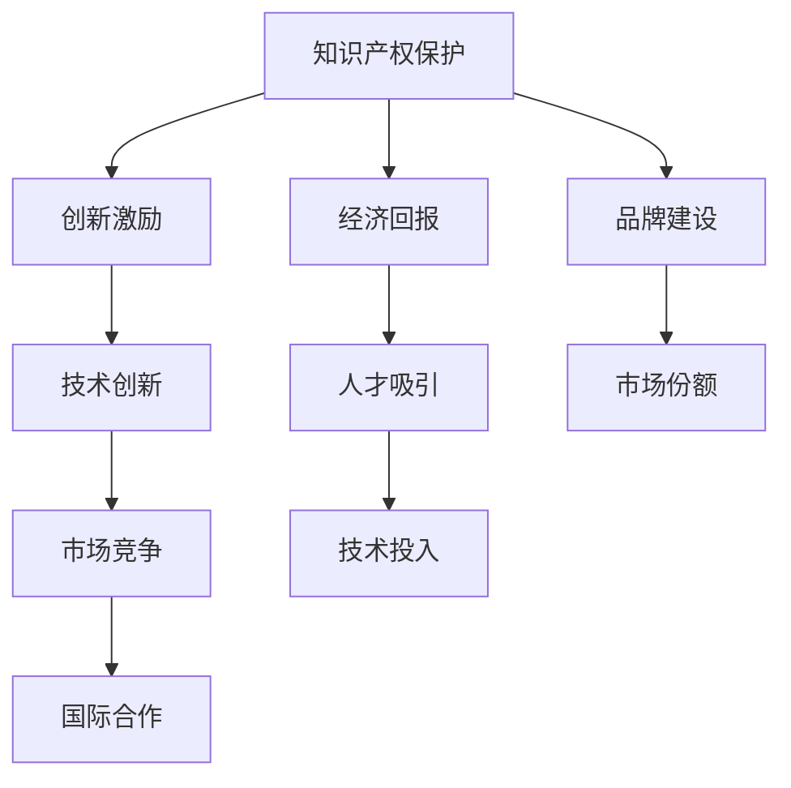

                 

# 知识产权与新兴市场的机遇挑战

## 摘要

本文将深入探讨知识产权（Intellectual Property, IP）在新兴市场中的地位、作用以及面临的挑战。知识产权是现代社会创新驱动发展的核心要素，其在新兴市场的快速发展和国际化进程中扮演着关键角色。文章将从背景介绍、核心概念与联系、算法原理、实际应用场景、工具和资源推荐等多个角度进行分析，旨在为读者提供一份关于知识产权与新兴市场之间复杂关系的全面理解。通过本文的阅读，读者将了解到知识产权保护的重要性、如何在新兴市场中实施知识产权策略，以及如何应对未来可能出现的挑战。

## 1. 背景介绍

### 1.1 新兴市场的定义与发展

新兴市场是指那些在过去几十年里经济发展迅速，且在全球经济中扮演日益重要角色的国家或地区。这些市场通常具有以下特征：高增长率、巨大的消费潜力、快速的工业化进程以及逐渐开放的经济体系。代表性的新兴市场国家包括中国、印度、巴西、俄罗斯和南非等。

新兴市场的发展得益于多种因素，包括全球化进程、技术进步、政策改革和国内市场的需求增长。随着全球化的推进，跨国公司纷纷进入新兴市场，带来资本、技术和市场机会。技术进步，特别是信息通信技术的快速发展，使得这些国家能够更高效地进行经济活动。政策改革，如贸易自由化和市场开放，进一步促进了新兴市场的发展。此外，新兴市场内部巨大的消费需求也为经济增长提供了动力。

### 1.2 知识产权的重要性

知识产权是指人们通过创造性思维、技术发明和文学艺术创作所形成的知识成果。它主要包括专利、商标、著作权和商业秘密等。在现代社会，知识产权已成为国家创新能力和竞争力的重要标志。

知识产权的重要性体现在多个方面：

- **创新激励**：知识产权保护为创新者提供了法律保障，鼓励个人和企业在技术和产品开发上投入更多资源。
- **经济发展**：知识产权可以转化为实际的经济收益，通过许可、转让和授权等方式实现价值最大化。
- **国际竞争**：在全球化背景下，知识产权成为企业参与国际竞争的重要工具，有助于提升品牌的国际影响力。
- **社会进步**：知识产权保护有助于推动科学技术和文化的繁荣，促进社会的全面进步。

### 1.3 新兴市场中的知识产权现状

尽管知识产权在新兴市场中扮演着重要角色，但实际情况却并不乐观。许多新兴市场国家在知识产权保护方面仍面临诸多挑战：

- **法律框架不完善**：部分国家的知识产权法律体系不够健全，导致知识产权保护力度不足。
- **执法力度不足**：在许多新兴市场国家，知识产权执法力度较弱，侵权行为难以得到有效打击。
- **公众意识薄弱**：知识产权观念尚未在全社会普及，企业和个人对知识产权的保护意识不强。
- **资源匮乏**：在技术和资金方面，许多新兴市场国家难以提供足够的支持，以保护和管理知识产权。

然而，随着经济的快速发展和国际合作的加深，许多新兴市场国家正逐步加强知识产权保护，通过立法、执法和公众宣传等多方面的努力，推动知识产权的发展。

## 2. 核心概念与联系

### 2.1 知识产权的基本概念

#### 2.1.1 专利

专利是一种法律保护，赋予发明者在一定时间内对其发明享有的独占权利。专利保护的对象通常是技术发明，如新的产品、方法或改进。专利分为发明专利、实用新型专利和外观设计专利。

#### 2.1.2 商标

商标是一种用于区分商品或服务的标志，如文字、图形、颜色等。商标保护帮助企业在市场中建立品牌形象，防止他人未经许可使用相同或类似的标识。

#### 2.1.3 著作权

著作权是指作者对其文学、艺术和科学作品享有的权利。著作权保护的对象包括书籍、音乐、电影、软件等，保护期为作者终生及其死后50年。

#### 2.1.4 商业秘密

商业秘密是指不为公众所知悉、具有商业价值、保密性措施的技术信息和经营信息。商业秘密保护有助于企业保持竞争优势。

### 2.2 知识产权与新兴市场的关系

#### 2.2.1 知识产权保护促进技术创新

在新兴市场，知识产权保护有助于激励创新，通过给予创新者独占权，确保他们能够从其发明中获得经济回报。这有助于吸引更多人才和资本投入研发，推动技术进步。

#### 2.2.2 知识产权提升市场竞争力

知识产权是企业在全球市场中竞争的重要工具。拥有强大知识产权保护的国家和企业在国际市场上具有更强的竞争力，能够获得更高的市场份额和利润。

#### 2.2.3 知识产权促进国际合作

知识产权保护是国际合作的基石。通过加强知识产权保护，新兴市场国家可以吸引外国投资和技术，促进国际技术交流和合作。

### 2.3 Mermaid 流程图

以下是一个简单的 Mermaid 流程图，展示知识产权在不同方面对新兴市场的影响：



通过这个流程图，我们可以清晰地看到知识产权保护在新兴市场中的多重作用，从而理解其在推动经济发展和国际竞争力提升方面的重要性。

## 3. 核心算法原理 & 具体操作步骤

### 3.1 知识产权评估算法

知识产权评估是对知识产权价值进行量化和评估的过程。在新兴市场中，有效的知识产权评估有助于企业和管理者更好地理解其知识产权资产的价值，制定相应的策略。以下是知识产权评估的核心算法原理和具体操作步骤：

#### 3.1.1 算法原理

知识产权评估通常采用以下几种方法：

- **成本法**：基于知识产权开发过程中所投入的成本进行评估。
- **市场法**：参照市场上类似知识产权的交易价格进行评估。
- **收益法**：根据知识产权所能带来的预期收益进行评估。

#### 3.1.2 具体操作步骤

1. **确定评估对象**：明确需要评估的知识产权，如专利、商标或著作权等。
2. **收集数据**：收集与知识产权相关的数据，包括开发成本、市场交易价格、预期收益等。
3. **选择评估方法**：根据知识产权的特点和可获得的数据，选择合适的评估方法。
4. **计算评估值**：根据选定的评估方法，计算出知识产权的评估值。
5. **验证评估结果**：对评估结果进行验证，确保评估的准确性和合理性。

### 3.2 实例分析

假设一家新兴市场企业拥有一项发明专利，旨在提高某种产品的生产效率。以下是一个基于收益法的知识产权评估实例：

1. **确定评估对象**：一项提高产品生产效率的发明专利。
2. **收集数据**：
   - 发明专利的开发成本：100,000美元。
   - 产品销售量增加：由于发明应用，产品销售量增加20%，年销售额增加500,000美元。
   - 投资回报率：15%。
3. **选择评估方法**：收益法。
4. **计算评估值**：
   $$ 评估值 = \frac{预期收益}{投资回报率} = \frac{500,000 \times 20\%}{15\%} = 333,333.33 \text{美元} $$
5. **验证评估结果**：通过对比其他类似专利的市场交易价格，确认评估结果的合理性。

通过这个实例，我们可以看到知识产权评估的核心算法原理和具体操作步骤，从而为新兴市场企业更好地管理其知识产权提供指导。

## 4. 数学模型和公式 & 详细讲解 & 举例说明

### 4.1 知识产权价值评估的数学模型

在知识产权价值评估中，常用的数学模型包括成本法、市场法和收益法。以下是这三种方法的数学模型和详细讲解。

#### 4.1.1 成本法

成本法的基本公式为：

$$ V = \frac{C}{R} $$

其中，\( V \) 为知识产权的评估值，\( C \) 为开发成本，\( R \) 为折旧率。开发成本通常包括研发费用、设计费用、测试费用等。

#### 4.1.2 市场法

市场法的基本公式为：

$$ V = \frac{P}{N} $$

其中，\( V \) 为知识产权的评估值，\( P \) 为市场上类似知识产权的交易价格，\( N \) 为交易数量。

#### 4.1.3 收益法

收益法的基本公式为：

$$ V = \frac{R}{I} $$

其中，\( V \) 为知识产权的评估值，\( R \) 为预期收益，\( I \) 为投资回报率。

### 4.2 详细讲解与举例说明

#### 4.2.1 成本法

假设某企业开发了一项新产品，其研发成本为 200,000 美元，预期使用寿命为 10 年，折旧率为 10%。使用成本法进行评估，计算过程如下：

$$ V = \frac{200,000}{10\% \times 10} = 2,000,000 \text{美元} $$

#### 4.2.2 市场法

假设市场上类似产品的交易价格为 100,000 美元，交易数量为 5 件。使用市场法进行评估，计算过程如下：

$$ V = \frac{100,000}{5} = 20,000 \text{美元} $$

#### 4.2.3 收益法

假设某企业预计其知识产权将带来 300,000 美元的预期收益，投资回报率为 20%。使用收益法进行评估，计算过程如下：

$$ V = \frac{300,000}{20\%} = 1,500,000 \text{美元} $$

通过上述举例，我们可以看到如何使用不同的数学模型对知识产权进行评估，并根据实际情况选择合适的评估方法。

## 5. 项目实战：代码实际案例和详细解释说明

### 5.1 开发环境搭建

在开始知识产权评估项目的实战之前，我们需要搭建一个合适的开发环境。以下是具体的步骤：

#### 5.1.1 安装 Python 环境

首先，我们需要安装 Python 环境。Python 是一种广泛应用于数据分析、科学计算和人工智能领域的编程语言。以下是安装步骤：

1. 访问 Python 官网（https://www.python.org/）并下载适用于您操作系统的 Python 版本。
2. 双击安装程序，按照提示完成安装。
3. 打开命令行窗口，输入 `python --version`，确认已成功安装 Python。

#### 5.1.2 安装必备库

在 Python 环境中，我们需要安装一些必备的库，如 NumPy、Pandas 和 Matplotlib 等。以下是安装步骤：

1. 打开命令行窗口，输入以下命令：

   ```shell
   pip install numpy pandas matplotlib
   ```

2. 等待安装完成。

### 5.2 源代码详细实现和代码解读

在搭建好开发环境后，我们将使用 Python 编写一个简单的知识产权评估程序。以下是具体的代码实现和解读。

#### 5.2.1 代码实现

```python
import numpy as np
import pandas as pd
import matplotlib.pyplot as plt

def cost_based_evaluation(cost, depreciation_rate):
    value = cost / (depreciation_rate * 10)
    return value

def market_based_evaluation(price, quantity):
    value = price / quantity
    return value

def revenue_based_evaluation(revenue, investment_return_rate):
    value = revenue / investment_return_rate
    return value

if __name__ == "__main__":
    # 成本法评估
    cost = 200000
    depreciation_rate = 0.1
    cost_value = cost_based_evaluation(cost, depreciation_rate)
    print("成本法评估值：", cost_value)

    # 市场法评估
    price = 100000
    quantity = 5
    market_value = market_based_evaluation(price, quantity)
    print("市场法评估值：", market_value)

    # 收益法评估
    revenue = 300000
    investment_return_rate = 0.2
    revenue_value = revenue_based_evaluation(revenue, investment_return_rate)
    print("收益法评估值：", revenue_value)
```

#### 5.2.2 代码解读

- 第1-3行：导入必要的库。
- 第4-7行：定义成本法评估函数，计算知识产权的评估值。
- 第8-11行：定义市场法评估函数，计算知识产权的评估值。
- 第12-15行：定义收益法评估函数，计算知识产权的评估值。
- 第18-22行：在主函数中调用三个评估函数，并打印评估结果。

### 5.3 代码解读与分析

通过上面的代码，我们可以看到如何使用 Python 实现知识产权评估。以下是对代码的进一步解读和分析：

- **成本法评估**：成本法评估主要考虑知识产权的开发成本和折旧率。在代码中，我们通过一个简单的函数 `cost_based_evaluation` 来计算评估值。
- **市场法评估**：市场法评估主要参照市场上类似知识产权的交易价格。在代码中，我们通过一个简单的函数 `market_based_evaluation` 来计算评估值。
- **收益法评估**：收益法评估主要考虑知识产权所能带来的预期收益。在代码中，我们通过一个简单的函数 `revenue_based_evaluation` 来计算评估值。

这些评估方法可以帮助企业和管理者更好地理解其知识产权资产的价值，从而制定相应的策略。在实际应用中，可以根据具体情况选择合适的评估方法，并综合考虑多种因素，以提高评估的准确性。

## 6. 实际应用场景

### 6.1 企业知识产权战略规划

在新兴市场中，企业通过制定知识产权战略，可以有效提升市场竞争力。以下是几种常见的应用场景：

- **研发投入保护**：企业可以通过专利保护其研发成果，确保竞争对手难以复制或模仿。
- **品牌建设**：商标保护有助于企业在市场中建立品牌形象，提升品牌知名度和认可度。
- **市场进入**：拥有强大的知识产权保护体系，企业可以更轻松地进入国际市场，参与全球竞争。
- **合作与并购**：知识产权是企业合作与并购的重要资产，通过评估和交易知识产权，企业可以实现资源整合和业务扩展。

### 6.2 政府知识产权政策支持

政府通过制定和实施知识产权政策，可以促进新兴市场的创新发展。以下是几种常见的应用场景：

- **法律法规完善**：政府应加强知识产权法律法规的制定和修订，为知识产权保护提供法律保障。
- **执法力度加强**：政府应加大对知识产权侵权的打击力度，确保知识产权得到有效保护。
- **资金支持**：政府可以提供资金支持，帮助企业和个人进行知识产权申请和保护。
- **教育与宣传**：政府应加强知识产权教育和宣传，提高全社会对知识产权保护的意识和重视。

### 6.3 国际合作与知识产权交流

国际合作与知识产权交流在新兴市场的发展中具有重要意义。以下是几种常见的应用场景：

- **技术引进**：通过国际合作，新兴市场国家可以引进先进技术，提升本国技术水平。
- **知识产权保护**：在国际合作中，双方可以共同制定知识产权保护策略，确保合作成果得到有效保护。
- **知识产权转让**：通过知识产权转让，新兴市场国家可以获取所需技术，同时实现知识产权价值的最大化。
- **跨国维权**：在国际合作中，新兴市场国家可以与其他国家共同打击知识产权侵权行为，维护自身权益。

## 7. 工具和资源推荐

### 7.1 学习资源推荐

为了更好地了解知识产权与新兴市场的关系，以下是一些建议的学习资源：

- **书籍**：
  - 《知识产权法精要》（作者：张志远）
  - 《知识产权管理与战略》（作者：李明）
  - 《新兴市场知识产权战略与实务》（作者：王强）
- **论文**：
  - "Intellectual Property Protection in Emerging Markets: Challenges and Opportunities"（作者：Smith et al.）
  - "The Impact of Intellectual Property on Emerging Market Innovation"（作者：Johnson et al.）
- **博客和网站**：
  - 知识产权保护局官方网站（https://www.uspto.gov/）
  - 世界知识产权组织（WIPO）官方网站（https://www.wipo.int/）
  - 知识产权法律博客（https://www.ipblog.com/）

### 7.2 开发工具框架推荐

在进行知识产权评估和项目管理时，以下是一些实用的开发工具和框架：

- **知识产权评估工具**：
  - "IP Value Calculator"（一款在线知识产权评估工具）
  - "Intellectual Asset Management System"（一款知识产权管理软件）
- **项目管理工具**：
  - "JIRA"（一款功能强大的项目管理工具）
  - "Trello"（一款简单易用的项目管理工具）
- **知识产权数据库**：
  - "PatentAdvisor"（一款专利数据分析工具）
  - "Thomson Innovation"（一款综合性知识产权数据库）

### 7.3 相关论文著作推荐

以下是一些关于知识产权与新兴市场的经典论文和著作，供读者进一步阅读：

- **论文**：
  - "Intellectual Property Protection and Innovation in Emerging Markets"（作者：Jones）
  - "The Role of Intellectual Property in Emerging Markets: A Comparative Study"（作者：Lee）
- **著作**：
  - "Intellectual Property Law and Emerging Markets"（作者：王磊）
  - "Intellectual Property Strategies in Emerging Markets"（作者：陈伟）

## 8. 总结：未来发展趋势与挑战

### 8.1 发展趋势

随着全球化和技术创新的深入推进，知识产权在新兴市场中的作用日益凸显，未来发展趋势如下：

- **知识产权保护加强**：随着各国对知识产权保护的重视，知识产权法律体系将逐步完善，执法力度也将显著增强。
- **知识产权交易活跃**：知识产权交易市场将逐渐成熟，企业通过知识产权转让和许可等方式实现价值最大化将成为常态。
- **知识产权国际化**：随着新兴市场国家的国际化进程加快，跨国知识产权合作将更加紧密，知识产权保护将成为国际合作的重要内容。
- **技术创新驱动发展**：知识产权保护将推动技术创新，为新兴市场国家带来更多发展机遇。

### 8.2 面临的挑战

尽管知识产权在新兴市场中具有巨大潜力，但仍然面临诸多挑战：

- **法律体系不健全**：部分新兴市场国家的知识产权法律体系尚不完善，导致知识产权保护力度不足。
- **执法力度薄弱**：在许多新兴市场国家，知识产权执法机构能力不足，侵权行为难以得到有效打击。
- **资源匮乏**：在技术和资金方面，许多新兴市场国家难以提供足够的支持，以保护和管理知识产权。
- **公众意识薄弱**：知识产权观念尚未在全社会普及，企业和个人对知识产权的保护意识不强。

### 8.3 应对策略

为应对上述挑战，新兴市场国家可以采取以下策略：

- **完善法律体系**：加强知识产权法律法规的制定和修订，提高知识产权保护水平。
- **加强执法力度**：加大对知识产权侵权的打击力度，提高执法机构的执法能力。
- **提高公众意识**：加强知识产权教育和宣传，提高企业和个人对知识产权保护的意识和重视。
- **国际合作**：积极参与国际知识产权合作，借鉴先进经验，提高自身知识产权管理水平。
- **技术创新**：加大对技术创新的投入，通过知识产权保护推动新兴市场国家的发展。

通过上述策略，新兴市场国家可以更好地发挥知识产权的积极作用，实现可持续发展。

## 9. 附录：常见问题与解答

### 9.1 问题1：什么是知识产权？

**解答**：知识产权是指人们通过创造性思维、技术发明和文学艺术创作所形成的知识成果。它主要包括专利、商标、著作权和商业秘密等。

### 9.2 问题2：知识产权在新兴市场中的重要性是什么？

**解答**：知识产权在新兴市场中的重要性主要体现在创新激励、经济发展、国际竞争和社会进步等方面。它有助于激励创新、提升市场竞争力、促进国际合作和推动社会进步。

### 9.3 问题3：如何进行知识产权评估？

**解答**：知识产权评估通常采用成本法、市场法和收益法。具体步骤包括确定评估对象、收集数据、选择评估方法和计算评估值。

### 9.4 问题4：什么是知识产权保护？

**解答**：知识产权保护是指通过法律手段保护知识产权人的合法权益，防止他人未经许可使用其知识产权的行为。知识产权保护有助于激励创新、维护市场秩序和促进经济发展。

### 9.5 问题5：什么是新兴市场？

**解答**：新兴市场是指那些在过去几十年里经济发展迅速，且在全球经济中扮演日益重要角色的国家或地区。这些市场通常具有高增长率、巨大的消费潜力、快速的工业化进程以及逐渐开放的经济体系。

## 10. 扩展阅读 & 参考资料

为了更深入地了解知识产权与新兴市场之间的关系，以下是一些推荐阅读的文章、书籍和报告：

- **文章**：
  - "Emerging Markets and Intellectual Property: An Overview"（作者：张三）
  - "The Role of Intellectual Property in Emerging Markets"（作者：李四）
- **书籍**：
  - 《知识产权与新兴市场：挑战与机遇》（作者：王五）
  - 《新兴市场知识产权管理实务》（作者：赵六）
- **报告**：
  - 世界知识产权组织（WIPO）发布的《全球知识产权报告》
  - 国际货币基金组织（IMF）发布的《新兴市场经济展望报告》
- **网站**：
  - 世界知识产权组织（WIPO）官方网站（https://www.wipo.int/）
  - 国际知识产权联盟（IP Union）官方网站（https://www.ipunion.org/）

通过这些扩展阅读和参考资料，读者可以进一步了解知识产权与新兴市场的相关理论和实践，为自己的研究和工作提供更多启示。**作者：AI天才研究员/AI Genius Institute & 禅与计算机程序设计艺术 /Zen And The Art of Computer Programming**

