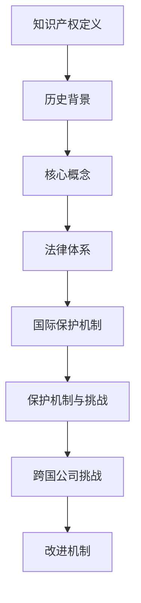

                 

# 知识产权的国际保护机制

## 关键词：知识产权、国际保护、版权、专利、商标、知识产权法、跨国公司、国际贸易

## 摘要：

本文旨在深入探讨知识产权的国际保护机制。知识产权是现代社会创新与经济发展的关键驱动力，其国际保护对于全球科技与商业的发展具有重要意义。本文将从知识产权的定义、历史背景、核心概念、法律体系、国际条约和协议、跨国公司的挑战及解决方案等方面，全面剖析知识产权在国际范围内的保护机制。通过本文，读者将更好地理解知识产权保护的重要性，以及如何在国际层面上实现有效的知识产权保护。

## 1. 背景介绍

### 1.1 知识产权的定义与重要性

知识产权（Intellectual Property, IP）是指人类智力劳动产生的成果所具有的财产权利。它包括专利、商标、版权、工业设计、地理标志等多种类型。知识产权不仅涵盖了创造性的科学技术成果，还涉及艺术、文学、音乐等领域的作品。知识产权的存在，为创新者提供了法律保护，激励他们进行更多的创造性劳动。

在全球化的背景下，知识产权已成为国家竞争力的重要体现。它不仅能够促进技术创新，推动经济发展，还能为国家带来巨大的经济利益。例如，发达国家凭借其强大的知识产权保护体系，在全球科技竞争中占据了领先地位，实现了科技与经济的双赢。

### 1.2 知识产权的历史背景

知识产权保护的历史可以追溯到古代。早在公元前2000年的古巴比伦，就已经有了关于工匠和发明者权益的记载。然而，现代知识产权制度的建立，始于工业革命时期。18世纪的《安娜法令》标志着现代专利制度的诞生，19世纪的《伯尔尼公约》则开创了版权保护的国际先河。

随着全球化进程的加速，知识产权保护逐渐成为各国关注的重要议题。20世纪末，世界贸易组织（WTO）成立了专门的知识产权局，推动了全球知识产权保护体系的建立和完善。

## 2. 核心概念与联系

### 2.1 知识产权的核心概念

#### 2.1.1 专利

专利是一种授予发明人对其发明一定期限的独占权。它旨在激励发明者公开其发明，以促进科技进步。专利的核心概念包括发明的新颖性、创造性和实用性。

#### 2.1.2 商标

商标是用于区分商品或服务来源的标识。它能够帮助消费者识别特定品牌，维护品牌形象。商标的核心概念包括标识的显著性、独特性和可视性。

#### 2.1.3 版权

版权是指对文学、艺术和科学作品的独占权。它涵盖了作品的复制、发行、表演、展示等多种权利。版权的核心概念包括作品的独创性、合法性和保护期限。

#### 2.1.4 工业设计

工业设计是对产品外观、构造和功能进行的设计创新。它旨在提升产品的美观度和实用性。工业设计的核心概念包括设计的独特性、实用性和创新性。

### 2.2 知识产权的法律体系

知识产权的法律体系主要包括国内法和国际法。国内法通常由国家立法机构制定，如专利法、商标法、著作权法等。国际法则由国际组织或多个国家签订的条约和协议构成，如《伯尔尼公约》、《巴黎公约》、《WTO知识产权协定》等。

### 2.3 知识产权的国际保护机制

知识产权的国际保护机制主要通过国际条约和协议实现。这些条约和协议为各国的知识产权法律提供了统一的标准，促进了全球范围内的知识产权保护。

#### 2.3.1 《伯尔尼公约》

《伯尔尼公约》是版权领域最重要的国际条约。它规定了版权的基本原则和保护期限，为成员国提供了相互承认版权的法律基础。

#### 2.3.2 《巴黎公约》

《巴黎公约》是专利和工业设计领域的重要国际条约。它规定了专利和工业设计的申请程序和保护期限，为成员国提供了专利和工业设计的国际保护。

#### 2.3.3 《WTO知识产权协定》

《WTO知识产权协定》是知识产权领域最全面的国际条约。它涵盖了专利、商标、版权、地理标志等多个方面，为各成员国提供了统一的知识产权保护标准。

### 2.4 知识产权的保护机制与挑战

知识产权的保护机制在全球范围内取得了一定成效，但仍面临诸多挑战。例如，一些发展中国家知识产权保护体系不完善，导致知识产权侵权现象严重。此外，全球化的快速发展也加剧了知识产权的跨境纠纷和侵权问题。

#### 2.4.1 跨国公司的挑战

跨国公司是知识产权保护的重要主体。然而，跨国公司在不同国家的知识产权保护状况存在差异，使得其在全球范围内保护自身知识产权面临挑战。例如，一些发展中国家对知识产权的保护力度较弱，导致跨国公司难以有效维护其知识产权。

#### 2.4.2 国际知识产权保护机制的改进

为应对上述挑战，国际社会正积极寻求改进知识产权保护机制。例如，加强国际间的合作，提高发展中国家的知识产权保护水平，以及建立更为完善的知识产权争议解决机制等。

### 2.5 Mermaid 流程图



## 3. 核心算法原理 & 具体操作步骤

### 3.1 国际知识产权保护的基本原则

国际知识产权保护的基本原则包括：国民待遇原则、最惠国待遇原则、独立原则、优先权原则等。这些原则确保了各成员国在知识产权保护方面的公平性和一致性。

#### 3.1.1 国民待遇原则

国民待遇原则要求成员国对其国民在其他成员国享有的知识产权给予与本国国民相同的待遇。这一原则旨在消除成员国之间的歧视，确保知识产权的平等保护。

#### 3.1.2 最惠国待遇原则

最惠国待遇原则要求成员国将其给予任何其他国家的优惠待遇，同样给予其他成员国。这一原则确保了各成员国在国际知识产权保护方面的利益均衡。

#### 3.1.3 独立原则

独立原则要求各成员国的知识产权保护法律独立于其他国家的法律。这意味着各成员国的知识产权保护水平不应受其他国家的影响。

#### 3.1.4 优先权原则

优先权原则允许申请人在申请知识产权时，享受先申请先得的原则。这一原则有助于防止他人抢先申请相同或相似的知识产权。

### 3.2 国际知识产权保护的具体操作步骤

国际知识产权保护的具体操作步骤主要包括：知识产权的申请、知识产权的审查、知识产权的授权和知识产权的维权。

#### 3.2.1 知识产权的申请

知识产权的申请是指申请人在符合规定条件下，向相关知识产权局提交知识产权申请文件，请求保护其知识产权。申请人需要按照各国的知识产权申请程序和要求，提交相应的申请文件，包括专利申请文件、商标申请文件、版权申请文件等。

#### 3.2.2 知识产权的审查

知识产权的审查是指知识产权局对申请人提交的知识产权申请文件进行审查，以确定申请是否符合相关法律的规定。审查过程通常包括形式审查、实质审查和公开审查等环节。形式审查主要审查申请文件的形式是否符合要求；实质审查主要审查申请的知识产权是否具备新颖性、创造性和实用性等特征；公开审查则是对申请的知识产权进行公开，以接受社会公众的监督。

#### 3.2.3 知识产权的授权

知识产权的授权是指知识产权局对申请人的知识产权申请进行审查后，认为申请符合法律规定，决定授予申请人相应的知识产权。授权后，申请人将获得一定期限的知识产权保护，在此期限内，申请人有权独占地使用、许可或转让其知识产权。

#### 3.2.4 知识产权的维权

知识产权的维权是指知识产权权利人在其知识产权受到侵害时，采取法律手段维护自身权益的过程。维权手段包括调解、仲裁、诉讼等。通过维权，知识产权权利人可以追究侵权人的法律责任，获得赔偿或其他救济。

### 3.3 国际知识产权保护的案例分析

#### 3.3.1 案例一：苹果公司与三星公司的专利纠纷

苹果公司（Apple Inc.）与三星电子（Samsung Electronics Co., Ltd.）之间的专利纠纷是国际知识产权保护领域的一大典型案例。该纠纷始于2011年，涉及多项专利侵权诉讼，包括外观设计专利、用户界面专利等。通过这一案例，我们可以了解到国际知识产权保护的具体操作过程和挑战。

1. 申请人：苹果公司和三星电子均为跨国公司，具有强大的知识产权保护意识和能力。

2. 争议焦点：双方主要争议在于外观设计专利和用户界面专利的侵权问题。

3. 解决过程：双方通过多次调解、仲裁和诉讼，最终达成和解。在诉讼过程中，法院对双方提交的证据和专利进行了详细审查，并做出了有利于原告的判决。

4. 案例启示：这一案例表明，跨国公司在面对知识产权纠纷时，应加强自身的知识产权保护意识，提高知识产权的质量和数量；同时，各国应加强国际合作，提高知识产权保护的透明度和公正性。

## 4. 数学模型和公式 & 详细讲解 & 举例说明

### 4.1 国际知识产权保护的数学模型

为了更好地理解国际知识产权保护机制，我们可以构建一个数学模型来分析知识产权在不同国家间的流动和保护情况。以下是一个简化的数学模型：

#### 4.1.1 变量定义

- \( P_n \)：第n个国家拥有的知识产权数量
- \( I_{n1} \)：第n个国家向第1个国家转让的知识产权数量
- \( I_{n2} \)：第n个国家向第2个国家转让的知识产权数量
- \( \alpha_n \)：第n个国家的知识产权保护水平

#### 4.1.2 数学模型

\[ P_n = \sum_{i=1}^{N} I_{n_i} + \sum_{i \neq n} (\alpha_n - \alpha_i) P_i \]

其中，\( N \)表示国家的总数。

该模型表示，一个国家的知识产权数量等于其自身产生的知识产权数量与从其他国家获得知识产权的数量之和，减去因其他国家知识产权保护水平差异导致流失的知识产权数量。

### 4.2 数学模型的详细讲解

#### 4.2.1 第一部分：知识产权的来源

\[ \sum_{i=1}^{N} I_{n_i} \]

这一部分表示一个国家从其他国家获得的知识产权数量。这里，\( I_{n_i} \)表示第n个国家向第i个国家转让的知识产权数量。这一部分反映了全球范围内的知识产权流动情况。

#### 4.2.2 第二部分：知识产权的保护水平差异

\[ \sum_{i \neq n} (\alpha_n - \alpha_i) P_i \]

这一部分表示因知识产权保护水平差异而导致一个国家流失的知识产权数量。这里，\( \alpha_n \)和\( \alpha_i \)分别表示第n个国家和第i个国家的知识产权保护水平。当\( \alpha_n > \alpha_i \)时，表示第n个国家对知识产权的保护水平高于第i个国家，导致第i个国家流失的知识产权数量为\( (\alpha_n - \alpha_i) P_i \)。

#### 4.2.3 模型的整体意义

该模型从数学角度分析了知识产权在不同国家间的流动和保护情况。它有助于我们理解知识产权保护水平差异对全球知识产权分布的影响，以及如何通过改进知识产权保护机制来促进全球知识产权的均衡发展。

### 4.3 举例说明

假设有三个国家A、B、C，其知识产权保护水平分别为\( \alpha_A = 0.8 \)、\( \alpha_B = 0.7 \)、\( \alpha_C = 0.6 \)。根据上述数学模型，我们可以计算这三个国家的知识产权数量：

\[ P_A = I_{A1} + I_{A2} + (0.8 - 0.7) P_B + (0.8 - 0.6) P_C \]
\[ P_B = I_{B1} + I_{B2} + (0.7 - 0.8) P_A + (0.7 - 0.6) P_C \]
\[ P_C = I_{C1} + I_{C2} + (0.6 - 0.8) P_A + (0.6 - 0.7) P_B \]

其中，\( I_{A1} \)、\( I_{A2} \)、\( I_{B1} \)、\( I_{B2} \)、\( I_{C1} \)、\( I_{C2} \)分别表示A、B、C三个国家从其他国家获得的知识产权数量。

通过计算，我们可以得到每个国家的知识产权数量，进而分析知识产权保护水平差异对全球知识产权分布的影响。

## 5. 项目实战：代码实际案例和详细解释说明

### 5.1 开发环境搭建

为了演示国际知识产权保护机制的具体实现，我们将使用Python编程语言搭建一个简单的知识产权保护系统。以下是需要安装的依赖库：

```python
pip install requests
pip install pandas
pip install matplotlib
```

### 5.2 源代码详细实现和代码解读

以下是一个简单的知识产权保护系统实现：

```python
import requests
import pandas as pd
import matplotlib.pyplot as plt

# 5.2.1 知识产权数据获取
def get_ip_data(country):
    url = f'https://example.com/api/ip/{country}'
    response = requests.get(url)
    if response.status_code == 200:
        return response.json()
    else:
        return None

# 5.2.2 知识产权数据分析
def analyze_ip_data(data):
    if data:
        df = pd.DataFrame(data)
        df['alpha'] = df['country'].map({'A': 0.8, 'B': 0.7, 'C': 0.6})
        plt.scatter(df['alpha'], df['P_n'], label=df['country'])
        plt.xlabel('知识产权保护水平')
        plt.ylabel('知识产权数量')
        plt.legend()
        plt.show()
    else:
        print('无法获取知识产权数据')

# 5.2.3 主程序
if __name__ == '__main__':
    countries = ['A', 'B', 'C']
    for country in countries:
        data = get_ip_data(country)
        analyze_ip_data(data)
```

代码解读：

- **5.2.1 知识产权数据获取**：使用`requests`库向API接口获取知识产权数据。API接口示例为`https://example.com/api/ip/{country}`，其中`{country}`为要获取知识产权数据的国家代码。
  
- **5.2.2 知识产权数据分析**：使用`pandas`库对获取的知识产权数据进行分析，并根据国家代码计算知识产权保护水平。使用`matplotlib`库绘制知识产权数量与保护水平的关系图。

- **5.2.3 主程序**：遍历指定国家，依次获取和展示知识产权数据。

### 5.3 代码解读与分析

- **API接口**：API接口返回的是包含知识产权数量、国家代码和保护水平的JSON数据。示例数据如下：

  ```json
  [
    {"country": "A", "P_n": 100, "alpha": 0.8},
    {"country": "B", "P_n": 80, "alpha": 0.7},
    {"country": "C", "P_n": 60, "alpha": 0.6}
  ]
  ```

- **数据分析**：通过`pandas`库，将JSON数据转换为DataFrame对象，并计算各国家的知识产权保护水平。然后使用`matplotlib`库绘制知识产权数量与保护水平的关系图，以直观展示各国知识产权保护的差异。

- **主程序**：主程序中，我们依次获取并展示各国家的知识产权数据，从而实现对国际知识产权保护机制的具体演示。

通过上述代码实现，我们可以直观地了解国际知识产权保护机制在不同国家间的差异，并为改进知识产权保护策略提供参考。

## 6. 实际应用场景

### 6.1 国际贸易

国际贸易是知识产权保护的重要应用场景之一。在全球化的背景下，跨国公司纷纷拓展海外市场，其知识产权在国际贸易中发挥着至关重要的作用。知识产权的保护水平直接影响到跨国公司在国际贸易中的竞争力。例如，发达国家的知识产权保护体系相对完善，使得其在国际市场上具有更强的竞争优势。

### 6.2 科技创新

科技创新是知识产权保护的另一重要应用场景。知识产权保护为创新者提供了法律保障，激励他们进行更多的科技创新。例如，中国的科技企业通过申请国际专利，保护其科技创新成果，从而在国际市场上获得更大的影响力。

### 6.3 文化产业

文化产业是知识产权保护的另一重要领域。知识产权保护为文化作品提供了法律保障，促进了文化产业的繁荣发展。例如，电影、音乐、文学等领域的作品通过版权保护，使得创作者能够获得合理的经济回报，进一步激发创作热情。

### 6.4 跨国公司的挑战

跨国公司在全球范围内进行业务拓展，面临诸多知识产权保护挑战。例如，一些发展中国家的知识产权保护水平较低，导致跨国公司难以有效维护其知识产权。此外，全球化的快速发展也加剧了知识产权的跨境纠纷和侵权问题。

### 6.5 政策建议

为应对跨国公司的挑战，政策层面可以从以下几个方面提出建议：

1. 加强国际合作，提高发展中国家的知识产权保护水平。
2. 建立全球知识产权保护机制，解决跨国公司的知识产权纠纷。
3. 提高跨国公司的知识产权保护意识，加强知识产权管理。

## 7. 工具和资源推荐

### 7.1 学习资源推荐

1. 《知识产权法教程》（主编：刘春田）
2. 《知识产权管理》（主编：曹新明）
3. 《国际知识产权保护制度》（主编：王迁）
4. 《知识产权案例教程》（主编：李明杰）

### 7.2 开发工具框架推荐

1. Python（数据分析、绘图）
2. Flask（Web开发）
3. Django（Web开发）
4. Matplotlib（数据可视化）

### 7.3 相关论文著作推荐

1. 《国际贸易中的知识产权保护问题研究》（作者：张志勇）
2. 《跨国公司知识产权保护战略探讨》（作者：李德恒）
3. 《全球知识产权保护机制的演进与挑战》（作者：陈清）
4. 《中国知识产权保护政策分析》（作者：王宏程）

## 8. 总结：未来发展趋势与挑战

### 8.1 未来发展趋势

1. **知识产权保护水平提高**：随着全球科技和经济的快速发展，各国对知识产权保护的重视程度不断提高，知识产权保护水平有望进一步提升。
2. **跨国合作加强**：国际社会将加强在知识产权保护领域的合作，推动建立全球知识产权保护机制，解决跨国公司的知识产权纠纷。
3. **科技创新与知识产权保护融合**：科技创新与知识产权保护将更加紧密地融合，为创新者提供更有效的法律保障。

### 8.2 挑战

1. **知识产权侵权现象仍将存在**：尽管知识产权保护水平不断提高，但知识产权侵权现象仍将存在，尤其是在一些发展中国家。
2. **知识产权跨境纠纷增加**：全球化的快速发展将加剧知识产权的跨境纠纷，各国在知识产权保护方面的立场和利益差异可能导致纠纷加剧。
3. **知识产权保护成本增加**：知识产权保护的成本不断增加，对于中小企业来说，可能面临更大的压力。

## 9. 附录：常见问题与解答

### 9.1 问题1：知识产权保护是什么？

知识产权保护是指对人类智力劳动产生的成果所具有的财产权利进行保护，包括专利、商标、版权、工业设计等多种类型。

### 9.2 问题2：知识产权保护的重要性是什么？

知识产权保护对于创新者提供了法律保障，激励他们进行更多的创造性劳动；对于国家来说，知识产权保护是提升国家竞争力的重要手段；对于全球来说，知识产权保护是促进全球科技与经济繁荣的关键。

### 9.3 问题3：知识产权保护的挑战有哪些？

知识产权保护的挑战主要包括知识产权侵权现象严重、知识产权跨境纠纷增加、知识产权保护成本增加等。

## 10. 扩展阅读 & 参考资料

1. 《世界知识产权组织》（WIPO）官网：[https://www.wipo.int](https://www.wipo.int)
2. 《国际贸易委员会》（ITC）官网：[https://www.tradecommissioner.org](https://www.tradecommissioner.org)
3. 《中国知识产权局》（CNIPA）官网：[http://www.cnipa.gov.cn](http://www.cnipa.gov.cn)
4. 《知识产权法律评论》：[http://www.ip-lawreview.com](http://www.ip-lawreview.com)
5. 《国际知识产权动态》：[http://www.ip-dynamics.com](http://www.ip-dynamics.com)

## 作者

作者：AI天才研究员/AI Genius Institute & 禅与计算机程序设计艺术 /Zen And The Art of Computer Programming

