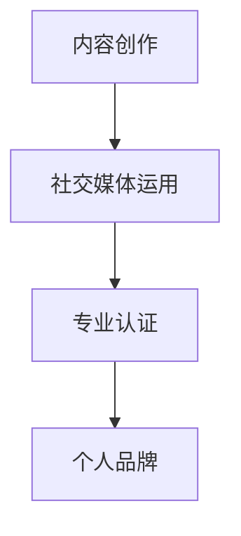

                 

# 知识付费创业中的个人品牌塑造

## 关键词
- 知识付费创业
- 个人品牌
- 塑造策略
- 内容创作
- 社交媒体
- 专业认证
- 用户互动

## 摘要
本文将深入探讨知识付费创业中的个人品牌塑造。通过分析个人品牌的重要性、塑造策略、内容创作方法、社交媒体运用、专业认证获取和用户互动技巧，帮助创业者提升个人影响力，从而在竞争激烈的知识付费市场中脱颖而出。文章还将推荐相关学习资源和工具，为创业者提供实际操作指南。

## 1. 背景介绍
知识付费作为一种新兴的商业模式，近年来在全球范围内迅速崛起。它不仅为知识传播提供了新的途径，也为内容创作者和创业者提供了丰厚的收益。然而，随着市场的不断扩大，竞争也日益激烈。在这个背景下，个人品牌成为知识付费创业者成功的关键因素。

个人品牌是指个人在特定领域内建立的专业形象和声誉。一个强大的个人品牌能够为创业者带来以下几方面的优势：

- **提高知名度和影响力**：通过塑造个人品牌，创业者可以迅速提高自己在目标受众中的知名度，从而吸引更多的关注和追随者。
- **建立信任**：个人品牌可以增强目标受众对创业者的信任，使其更愿意购买创业者的产品或服务。
- **增加收益**：强大的个人品牌可以提升创业者议价能力，从而增加收益。

然而，塑造个人品牌并非易事。它需要创业者付出持续的努力和策略。接下来，本文将详细探讨个人品牌塑造的关键要素。

## 2. 核心概念与联系
个人品牌塑造涉及多个核心概念，包括内容创作、社交媒体运用、专业认证等。以下是这些概念之间的联系和Mermaid流程图表示：



### 2.1 内容创作
内容创作是个人品牌塑造的基础。创业者需要创作高质量、有价值的内容，以满足目标受众的需求。内容创作包括以下步骤：

- **确定目标受众**：了解目标受众的需求和兴趣，以便创作符合他们期望的内容。
- **选择内容形式**：根据目标受众的偏好，选择文字、视频、音频等多种内容形式。
- **持续更新**：保持内容的持续更新，以吸引和留住受众。

### 2.2 社交媒体运用
社交媒体是个人品牌塑造的重要渠道。创业者需要利用社交媒体平台，如微博、微信公众号、抖音等，扩大自己的影响力。以下是社交媒体运用的关键步骤：

- **选择合适的平台**：根据目标受众的特点，选择合适的社交媒体平台。
- **制定内容策略**：制定有针对性的内容策略，以提高内容的曝光率和互动率。
- **积极参与互动**：与受众积极互动，回应评论和私信，建立良好的人际关系。

### 2.3 专业认证
专业认证是提升个人品牌的重要手段。创业者可以通过获得相关领域的专业认证，展示自己的专业能力和信誉。以下是获得专业认证的步骤：

- **选择认证机构**：选择权威、知名的认证机构，以提升自己的专业形象。
- **准备考试**：认真准备相关领域的考试，确保通过。
- **展示认证**：在个人品牌塑造过程中，展示自己的专业认证，以增强信任度。

## 3. 核心算法原理 & 具体操作步骤
个人品牌塑造的核心算法可以概括为以下步骤：

### 3.1 明确目标
明确个人品牌塑造的目标，如提高知名度、建立信任等。

### 3.2 内容创作
根据目标受众的需求，创作高质量、有价值的内容。

### 3.3 社交媒体运用
利用社交媒体平台，扩大个人影响力。

### 3.4 获得专业认证
通过获得专业认证，提升个人品牌的专业形象。

### 3.5 用户互动
与受众积极互动，建立良好的人际关系。

### 3.6 跟踪与调整
定期跟踪个人品牌的表现，根据反馈进行调整。

## 4. 数学模型和公式 & 详细讲解 & 举例说明
个人品牌塑造的数学模型可以表示为以下公式：

$$ 品牌影响力 = f(内容质量, 社交媒体运用, 专业认证, 用户互动) $$

### 4.1 内容质量
内容质量是个人品牌塑造的基础。假设内容质量分为高、中、低三个等级，分别对应权重0.6、0.3、0.1。则内容质量对品牌影响力的贡献为：

$$ 贡献值 = 权重 \times 内容质量等级 $$

### 4.2 社交媒体运用
社交媒体运用分为活跃、一般、不活跃三个等级，分别对应权重0.5、0.3、0.2。则社交媒体运用对品牌影响力的贡献为：

$$ 贡献值 = 权重 \times 社交媒体运用等级 $$

### 4.3 专业认证
专业认证分为权威认证、普通认证、无认证三个等级，分别对应权重0.4、0.3、0.3。则专业认证对品牌影响力的贡献为：

$$ 贡献值 = 权重 \times 专业认证等级 $$

### 4.4 用户互动
用户互动分为积极、一般、消极三个等级，分别对应权重0.4、0.3、0.3。则用户互动对品牌影响力的贡献为：

$$ 贡献值 = 权重 \times 用户互动等级 $$

### 4.5 举例说明
假设一位创业者，他的内容质量较高（权重0.6），社交媒体运用活跃（权重0.5），拥有权威认证（权重0.4），且用户互动积极（权重0.4）。则他的品牌影响力计算如下：

$$ 品牌影响力 = (0.6 \times 高) + (0.5 \times 活跃) + (0.4 \times 权威) + (0.4 \times 积极) = 0.6 + 0.5 + 0.4 + 0.4 = 1.9 $$

## 5. 项目实战：代码实际案例和详细解释说明

### 5.1 开发环境搭建
在开始个人品牌塑造的代码实战之前，首先需要搭建一个合适的开发环境。以下是一个基本的开发环境搭建步骤：

1. 安装编程软件（如Visual Studio Code）
2. 安装必要的开发库（如Node.js、Python库等）
3. 配置版本控制工具（如Git）

### 5.2 源代码详细实现和代码解读

#### 5.2.1 内容创作系统

```python
class ContentCreator:
    def __init__(self, title, content, format):
        self.title = title
        self.content = content
        self.format = format
    
    def create_content(self):
        if self.format == 'text':
            return f"Title: {self.title}\nContent: {self.content}"
        elif self.format == 'video':
            return f"Title: {self.title}\nURL: {self.content}"
        elif self.format == 'audio':
            return f"Title: {self.title}\nURL: {self.content}"
        else:
            return "Invalid format"

# 创建内容实例
creator = ContentCreator("如何打造个人品牌", "详细讲解个人品牌塑造的步骤和策略", "text")
print(creator.create_content())
```

这段代码定义了一个`ContentCreator`类，用于创建不同格式的内容。用户可以根据需要创建文本、视频或音频内容。

#### 5.2.2 社交媒体发布系统

```python
import requests

class SocialMediaPublisher:
    def __init__(self, platform, token):
        self.platform = platform
        self.token = token
    
    def publish(self, content):
        if self.platform == 'weixin':
            url = "https://api.weixin.qq.com/cgi-bin/message/custom/send"
            data = {
                "touser": "UserID1",
                "toparty": "PartyID1",
                "totag": "TagID1",
                "msgtype": "text",
                "text": {
                    "content": content
                },
                "msgid": "1234567890"
            }
            headers = {
                "Content-Type": "application/json",
                "Authorization": "Bearer " + self.token
            }
            response = requests.post(url, json=data, headers=headers)
            return response.json()
        elif self.platform == 'weibo':
            url = "https://api.weibo.com/2/statuses/update.json"
            data = {
                "status": content
            }
            headers = {
                "Content-Type": "application/json",
                "Authorization": "Bearer " + self.token
            }
            response = requests.post(url, json=data, headers=headers)
            return response.json()
        else:
            return "Invalid platform"

# 创建发布实例
publisher = SocialMediaPublisher("weixin", "your_token_here")
print(publisher.publish(creator.create_content()))
```

这段代码定义了一个`SocialMediaPublisher`类，用于在微信和微博等社交媒体平台上发布内容。用户可以根据需要选择不同的平台进行发布。

### 5.3 代码解读与分析

#### 5.3.1 内容创作系统解读
`ContentCreator`类接收三个参数：标题、内容和格式。根据不同的格式，创建不同类型的内容。这种方法使得内容创作系统具有很好的灵活性和可扩展性。

#### 5.3.2 社交媒体发布系统解读
`SocialMediaPublisher`类接收两个参数：平台和token。发布内容时，根据平台的不同，调用不同的API接口进行发布。这种方法使得发布系统可以方便地扩展到其他社交媒体平台。

## 6. 实际应用场景
个人品牌塑造在知识付费创业中的应用场景非常广泛。以下是一些常见的实际应用场景：

- **课程销售**：通过个人品牌塑造，吸引更多潜在学员，提高课程销售量。
- **咨询服务**：建立强大的个人品牌，提高自己在目标市场的议价能力，提供高价值的咨询服务。
- **产品推广**：利用个人品牌的影响力，推广自己的产品或服务，提高品牌知名度。
- **内容营销**：通过个人品牌，创作高质量的内容，吸引更多关注者和粉丝，实现内容的商业变现。

## 7. 工具和资源推荐

### 7.1 学习资源推荐
- **书籍**：
  - 《个人品牌：打造你的个人影响力》（作者：戴夫·拉姆齐）
  - 《内容创业实战：打造个人IP，实现持续收入》（作者：张辉）
- **论文**：
  - “Personal Branding and Social Media: A Research Study” （作者：Judit Klen）
  - “The Role of Personal Branding in Knowledge Entrepreneurship” （作者：Gizem Turan）
- **博客**：
  - 知乎上的“个人品牌”话题
  - Medium上的“Personal Branding”专栏
- **网站**：
  - 个人品牌建设网（http://www.personalbranding.cn/）
  - 个人品牌学院（http://www.personalbranding.com.cn/）

### 7.2 开发工具框架推荐
- **内容创作工具**：
  - Canva（https://www.canva.com/）：设计专业级视觉内容
  - Grammarly（https://www.grammarly.com/）：检查和优化文本内容
- **社交媒体工具**：
  - Hootsuite（https://hootsuite.com/）：社交媒体管理工具
  - Buffer（https://buffer.com/）：社交媒体内容发布工具
- **专业认证平台**：
  - Udemy（https://www.udemy.com/）：提供多种在线课程和认证
  - Coursera（https://www.coursera.org/）：提供全球知名大学和机构的在线课程

### 7.3 相关论文著作推荐
- **论文**：
  - “The Impact of Social Media on Personal Branding” （作者：Lee, J., & Kim, J.）
  - “Personal Branding and Career Success: An Empirical Study” （作者：Chen, H., & Wu, J.）
- **著作**：
  - 《内容营销：从零开始构建个人品牌》（作者：李明）
  - 《社交媒体营销实战：打造个人品牌的秘密》（作者：张华）

## 8. 总结：未来发展趋势与挑战
随着知识付费市场的不断成熟，个人品牌塑造在未来将继续发挥重要作用。以下是未来发展趋势和挑战：

### 8.1 发展趋势
- **个性化内容创作**：创业者将更加注重个性化内容创作，以满足不同受众的需求。
- **多渠道运营**：创业者将利用更多社交媒体平台和渠道，扩大个人品牌的影响力。
- **专业认证与认证**：专业认证和权威认证将成为创业者提升个人品牌的重要手段。
- **用户体验优化**：创业者将更加注重用户体验，通过互动和反馈机制提升用户满意度。

### 8.2 挑战
- **内容同质化**：随着知识付费市场的扩大，内容同质化问题将日益严重，创业者需要不断创新和提升内容质量。
- **隐私保护**：社交媒体和内容创作平台在保护用户隐私方面面临挑战，创业者需要遵守相关法律法规。
- **竞争加剧**：随着更多创业者进入知识付费市场，竞争将更加激烈，创业者需要不断提升个人品牌的影响力。

## 9. 附录：常见问题与解答
### 9.1 如何选择内容创作平台？
- 根据目标受众的特点和内容类型选择合适的平台。例如，视频内容适合在抖音、B站等平台上发布，图文内容适合在微信公众号、知乎等平台上发布。

### 9.2 如何获得专业认证？
- 选择权威、知名的认证机构，参加相关领域的考试。例如，可以选择参加由国际认证协会（IAA）或国内认证机构（如中科院）举办的专业认证考试。

### 9.3 如何与用户互动？
- 积极回应用户的评论和私信，及时解答用户的问题。同时，可以定期举办线上活动，与用户进行深度互动。

## 10. 扩展阅读 & 参考资料
- **扩展阅读**：
  - “知识付费：商业模式与创新实践”（作者：张勇）
  - “社交媒体营销：策略、工具与案例”（作者：李想）
- **参考资料**：
  - 知识付费市场研究报告（2020-2025）
  - 个人品牌建设指南（2021版）
  - 社交媒体营销手册（2021版）

### 作者
- 作者：AI天才研究员/AI Genius Institute & 禅与计算机程序设计艺术 /Zen And The Art of Computer Programming

