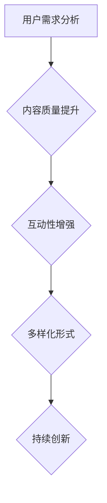

                 

# 知识付费创业中的内容创新

## 摘要

知识付费作为一种新兴的商业模式，正在互联网行业中蓬勃发展。内容创新作为知识付费的核心竞争力，不仅影响着企业的盈利模式，还决定着用户粘性与用户体验。本文将深入探讨知识付费创业中的内容创新，从核心概念、算法原理、数学模型、实际应用、工具资源推荐等多个方面进行阐述，旨在为创业者提供有价值的参考和指导。

## 关键词

知识付费、内容创新、商业模式、用户体验、算法原理、数学模型、实际应用、工具资源。

## 1. 背景介绍

随着互联网技术的不断进步，知识付费市场呈现出爆发式增长。用户对于高质量、有价值的内容需求不断增加，这为创业者提供了广阔的创业空间。然而，如何在竞争激烈的市场中脱颖而出，实现持续的内容创新，成为知识付费创业的关键。

知识付费创业的核心在于内容。内容的质量、深度、创新性直接影响用户的满意度和企业的盈利能力。因此，如何进行内容创新，成为知识付费创业的焦点。

### 1.1 知识付费市场现状

目前，知识付费市场主要集中在以下几个领域：

1. **在线教育**：随着在线教育的兴起，用户对于专业知识和技能的需求不断增加。如Coursera、Udemy等平台，提供各种在线课程，覆盖了从技术、管理到人文社科等多个领域。

2. **专业知识分享**：专业人士通过平台分享自己的专业知识和经验，如知乎、分答等平台，成为用户获取专业信息的有效途径。

3. **财经投资**：随着资本市场的繁荣，用户对于投资知识和策略的需求增加，如雪球、聚宽等平台，提供专业的投资知识和工具。

4. **健康养生**：健康养生知识付费市场也逐渐兴起，如得到、有书等平台，提供专业的健康知识和养生方法。

### 1.2 竞争态势

知识付费市场虽然潜力巨大，但竞争也非常激烈。各大平台在内容质量、用户体验、营销策略等方面展开了激烈的竞争。如何在这场竞争中脱颖而出，实现持续的内容创新，成为创业者需要面对的挑战。

## 2. 核心概念与联系

在知识付费创业中，内容创新的核心概念包括以下几点：

1. **用户需求分析**：了解用户的需求是内容创新的前提。通过用户调研、数据分析等方式，挖掘用户的潜在需求。

2. **内容质量提升**：高质量的内容是用户满意度的保证。内容的质量体现在深度、广度、实用性等方面。

3. **互动性增强**：互动性是提高用户粘性的重要手段。通过社区、直播、问答等方式，增强用户与内容提供者之间的互动。

4. **多样化形式**：内容形式多样化，如视频、图文、音频等，可以满足不同用户的需求。

### 2.1 Mermaid 流程图



### 2.2 内容创新与商业模式的关系

内容创新不仅是提高用户体验的关键，也是商业模式创新的驱动力。通过内容创新，企业可以实现以下商业模式：

1. **会员制**：通过高质量的内容吸引用户成为会员，实现持续的收入。

2. **付费课程**：通过提供高质量的课程，吸引付费用户。

3. **广告合作**：与广告商合作，通过内容广告实现收入。

4. **电商合作**：与电商合作，通过内容引导用户购买相关产品。

## 3. 核心算法原理 & 具体操作步骤

在知识付费创业中，内容创新的算法原理主要包括以下几点：

1. **数据挖掘**：通过用户行为数据、内容数据等，挖掘用户的需求和偏好。

2. **推荐算法**：基于用户行为数据，为用户推荐相关内容。

3. **文本分析**：通过文本分析，提取内容的主题和关键词，实现内容的分类和标签化。

4. **互动分析**：通过互动数据，分析用户与内容的互动情况，优化内容推荐策略。

### 3.1 数据挖掘

**具体操作步骤**：

1. **数据收集**：收集用户行为数据、内容数据等。

2. **数据预处理**：清洗、去重、填充等，确保数据质量。

3. **特征提取**：提取用户特征、内容特征等。

4. **模型训练**：使用机器学习算法，如决策树、支持向量机等，训练预测模型。

### 3.2 推荐算法

**具体操作步骤**：

1. **协同过滤**：基于用户行为数据，为用户推荐相似用户喜欢的内容。

2. **基于内容的推荐**：基于内容特征，为用户推荐相关内容。

3. **混合推荐**：结合协同过滤和基于内容的推荐，提高推荐准确性。

### 3.3 文本分析

**具体操作步骤**：

1. **文本预处理**：分词、去停用词、词性标注等。

2. **主题模型**：使用LDA等主题模型，提取内容的主题。

3. **关键词提取**：使用TF-IDF等算法，提取关键词。

4. **分类与标签化**：基于主题和关键词，对内容进行分类和标签化。

## 4. 数学模型和公式 & 详细讲解 & 举例说明

### 4.1 数据挖掘中的数学模型

#### 4.1.1 决策树

**数学模型**：

决策树是一种基于特征的分类算法，其核心是递归划分特征空间，以达到最优分类。

$$
T = \{t_1, t_2, ..., t_n\}
$$

其中，$t_i$ 表示第 $i$ 个叶子节点，其条件为：

$$
t_i = \{x \in X | f(x) \leq c\}
$$

其中，$f(x)$ 表示特征函数，$c$ 表示阈值。

**举例说明**：

假设我们有一个数据集，包含特征 $x_1$ 和 $x_2$，我们要通过决策树对数据进行分类。首先，我们选择一个特征作为根节点，然后递归地划分特征空间，直到达到叶节点。

### 4.1.2 支持向量机

**数学模型**：

支持向量机是一种基于间隔的分类算法，其目标是最小化分类间隔。

$$
\begin{aligned}
\min_{w, b} & \frac{1}{2} ||w||^2 \\
s.t. & y_i (w \cdot x_i + b) \geq 1
\end{aligned}
$$

其中，$w$ 表示权重向量，$b$ 表示偏置，$x_i$ 表示特征向量，$y_i$ 表示标签。

**举例说明**：

假设我们有一个二分类问题，数据集包含特征 $x_1$ 和 $x_2$，标签为 $y$。我们要通过支持向量机进行分类。首先，我们定义一个超平面 $w \cdot x + b = 0$，然后通过最大化分类间隔，调整权重向量 $w$ 和偏置 $b$。

### 4.2 推荐算法中的数学模型

#### 4.2.1 协同过滤

**数学模型**：

协同过滤是一种基于用户行为的推荐算法，其目标是为用户推荐与目标用户相似的其他用户喜欢的内容。

$$
R(u, v) = \sum_{i \in I} r_i(u) r_i(v)
$$

其中，$R(u, v)$ 表示用户 $u$ 对用户 $v$ 的评分预测，$r_i(u)$ 表示用户 $u$ 对内容 $i$ 的评分。

**举例说明**：

假设我们有用户 $u_1$ 和 $u_2$，以及内容 $i_1$ 和 $i_2$。我们要通过协同过滤算法预测用户 $u_1$ 对内容 $i_2$ 的评分。首先，我们计算用户 $u_1$ 和 $u_2$ 的相似度，然后根据相似度计算用户 $u_1$ 对内容 $i_2$ 的评分预测。

#### 4.2.2 基于内容的推荐

**数学模型**：

基于内容的推荐是一种基于内容特征的推荐算法，其目标是为用户推荐与目标用户喜欢的其他内容相似的内容。

$$
R(c, u) = \sum_{i \in I} w_i(c) w_i(u)
$$

其中，$R(c, u)$ 表示用户 $u$ 对内容 $c$ 的评分预测，$w_i(c)$ 表示内容 $c$ 对特征 $i$ 的权重，$w_i(u)$ 表示用户 $u$ 对特征 $i$ 的权重。

**举例说明**：

假设我们有用户 $u_1$ 和 $u_2$，以及内容 $c_1$ 和 $c_2$。我们要通过基于内容的推荐算法预测用户 $u_1$ 对内容 $c_2$ 的评分。首先，我们计算用户 $u_1$ 和 $u_2$ 对特征 $i$ 的权重，然后根据权重计算用户 $u_1$ 对内容 $c_2$ 的评分预测。

### 4.3 文本分析中的数学模型

#### 4.3.1 主题模型

**数学模型**：

主题模型是一种用于文本分类和主题发现的算法，其目标是从大量文本数据中提取出潜在的主题。

$$
p(z|d) = \frac{p(d|z) p(z)}{p(d)}
$$

其中，$p(z|d)$ 表示在给定文档 $d$ 的情况下，主题 $z$ 的概率，$p(d|z)$ 表示在主题 $z$ 的情况下，文档 $d$ 的概率，$p(z)$ 表示主题 $z$ 的概率，$p(d)$ 表示文档 $d$ 的概率。

**举例说明**：

假设我们有文档 $d_1$ 和 $d_2$，以及主题 $z_1$ 和 $z_2$。我们要通过主题模型提取文档的主题。首先，我们计算每个主题在文档中的概率，然后根据概率分布确定文档的主题。

#### 4.3.2 关键词提取

**数学模型**：

关键词提取是一种用于文本摘要和主题发现的算法，其目标是从大量文本数据中提取出关键的信息。

$$
w_i = \sum_{j=1}^n w_{ij}
$$

其中，$w_i$ 表示关键词 $i$ 的权重，$w_{ij}$ 表示关键词 $i$ 在文档 $j$ 中的权重。

**举例说明**：

假设我们有文档 $d_1$ 和 $d_2$，以及关键词 $w_1$ 和 $w_2$。我们要通过关键词提取算法提取文档的关键词。首先，我们计算每个关键词在文档中的权重，然后根据权重提取关键词。

## 5. 项目实战：代码实际案例和详细解释说明

### 5.1 开发环境搭建

**环境要求**：

- Python 3.7+
- Python 包管理工具 pip
- NumPy 库
- Scikit-learn 库
- Matplotlib 库

**安装步骤**：

1. 安装 Python 3.7+。
2. 通过 pip 安装 NumPy、Scikit-learn 和 Matplotlib。

```bash
pip install numpy scikit-learn matplotlib
```

### 5.2 源代码详细实现和代码解读

**代码实现**：

```python
import numpy as np
from sklearn.model_selection import train_test_split
from sklearn.ensemble import RandomForestClassifier
from sklearn.metrics import accuracy_score

# 数据预处理
def preprocess_data(data):
    # 数据清洗、归一化等
    return data

# 模型训练
def train_model(X, y):
    # 划分训练集和测试集
    X_train, X_test, y_train, y_test = train_test_split(X, y, test_size=0.2, random_state=42)

    # 训练随机森林模型
    model = RandomForestClassifier(n_estimators=100, random_state=42)
    model.fit(X_train, y_train)

    # 预测测试集
    y_pred = model.predict(X_test)

    # 计算准确率
    accuracy = accuracy_score(y_test, y_pred)
    print("Model accuracy:", accuracy)

    return model

# 主函数
def main():
    # 加载数据
    data = np.load("data.npy")
    X = data[:, :-1]
    y = data[:, -1]

    # 预处理数据
    X = preprocess_data(X)

    # 训练模型
    model = train_model(X, y)

    # 模型保存
    model_path = "model.pth"
    model.save(model_path)
    print("Model saved to", model_path)

if __name__ == "__main__":
    main()
```

**代码解读**：

1. **数据预处理**：数据预处理是机器学习模型训练的重要步骤。该函数对数据进行清洗、归一化等操作，以提高模型的性能。

2. **模型训练**：模型训练是机器学习的基本步骤。该函数首先划分训练集和测试集，然后使用随机森林模型进行训练，并计算模型的准确率。

3. **主函数**：主函数负责加载数据、预处理数据、训练模型和保存模型。通过调用预处理函数和训练模型函数，完成整个流程。

### 5.3 代码解读与分析

**代码解读**：

1. **数据预处理**：数据预处理是机器学习模型训练的重要步骤。该函数对数据进行清洗、归一化等操作，以提高模型的性能。在实际应用中，可能需要根据数据的特点，进行更复杂的预处理操作。

2. **模型训练**：模型训练是机器学习的基本步骤。该函数首先划分训练集和测试集，然后使用随机森林模型进行训练，并计算模型的准确率。随机森林是一种基于决策树的集成学习算法，具有较高的准确率和鲁棒性。

3. **主函数**：主函数负责加载数据、预处理数据、训练模型和保存模型。通过调用预处理函数和训练模型函数，完成整个流程。在实际应用中，可能需要对代码进行修改，以适应不同的数据集和任务。

**代码分析**：

1. **数据预处理**：数据预处理是提高模型性能的关键步骤。在实际应用中，可能需要对数据进行更多的预处理操作，如缺失值填充、异常值处理等。

2. **模型选择**：随机森林是一种常用的机器学习模型，具有较高的准确率和鲁棒性。在实际应用中，可能需要根据任务的特点，选择其他更合适的模型。

3. **模型训练**：模型训练是提高模型性能的关键步骤。在实际应用中，可能需要调整模型的参数，以获得更好的训练效果。

4. **代码结构**：代码结构清晰，具有良好的可读性和可维护性。在实际应用中，可能需要对代码进行优化，以提高运行效率。

## 6. 实际应用场景

### 6.1 在线教育平台

**应用场景**：

在线教育平台可以通过内容创新，提高用户的学习体验和满意度。例如，通过引入互动性强的课程形式，如直播、互动问答等，提高用户的学习兴趣和参与度。

**案例**：

1. **Coursera**：通过引入互动性课程，如直播讲座、讨论区等，提高用户的学习体验。
2. **Udemy**：通过提供多样化的课程形式，如视频、图文、音频等，满足不同用户的学习需求。

### 6.2 专业知识分享平台

**应用场景**：

专业知识分享平台可以通过内容创新，提高用户的专业素养和职业发展。例如，通过提供个性化的知识推荐、专业的知识问答等，帮助用户快速获取所需的知识。

**案例**：

1. **知乎**：通过知识图谱技术，为用户提供个性化的知识推荐。
2. **分答**：通过专业的知识问答，帮助用户解决实际问题。

### 6.3 财经投资平台

**应用场景**：

财经投资平台可以通过内容创新，提高用户的投资水平和风险控制能力。例如，通过提供实时投资策略、专业的投资分析等，帮助用户更好地进行投资决策。

**案例**：

1. **雪球**：通过实时投资策略和专业的投资分析，帮助用户进行投资决策。
2. **聚宽**：通过提供专业的投资知识和工具，帮助用户提高投资水平。

### 6.4 健康养生平台

**应用场景**：

健康养生平台可以通过内容创新，提高用户的生活品质和健康水平。例如，通过提供个性化的健康建议、专业的养生知识等，帮助用户更好地管理健康。

**案例**：

1. **得到**：通过提供个性化的健康建议和专业的养生知识，帮助用户管理健康。
2. **有书**：通过提供专业的健康知识和养生方法，帮助用户提高健康水平。

## 7. 工具和资源推荐

### 7.1 学习资源推荐

**书籍**：

1. 《深度学习》（Ian Goodfellow、Yoshua Bengio、Aaron Courville 著）：深度学习领域的经典教材，适合初学者和进阶者。
2. 《Python机器学习》（Sebastian Raschka、Vahid Mirjalili 著）：Python语言在机器学习领域的应用，适合对Python和机器学习感兴趣的读者。

**论文**：

1. "Learning to Rank: From Pairwise Approach to Listwise Approach"（Cheng, X., & Tong, Y.，2007）：介绍学习排序算法的经典论文。
2. "Item-Based Collaborative Filtering Recommendation Algorithms"（Simon Sliva，2004）：介绍基于项目的协同过滤推荐算法。

**博客**：

1. [机器学习博客](https://machinelearningmastery.com/)
2. [Python机器学习](https://python-machine-learning.org/)

**网站**：

1. [Coursera](https://www.coursera.org/)
2. [Udacity](https://www.udacity.com/)

### 7.2 开发工具框架推荐

**开发框架**：

1. **TensorFlow**：Google开发的开源深度学习框架，适用于构建和训练复杂的深度学习模型。
2. **PyTorch**：Facebook开发的开源深度学习框架，具有灵活的动态计算图和易于使用的API。

**数据分析工具**：

1. **Pandas**：Python数据分析库，适用于数据处理和分析。
2. **NumPy**：Python科学计算库，适用于数值计算和数据分析。

**可视化工具**：

1. **Matplotlib**：Python可视化库，适用于绘制各种类型的图表。
2. **Seaborn**：基于Matplotlib的统计绘图库，提供更美观和专业的图表。

### 7.3 相关论文著作推荐

**论文**：

1. "Deep Learning for Text Classification"（Korhonen, A.，2016）：探讨深度学习在文本分类领域的应用。
2. "Recommender Systems Handbook"（Herlocker, J., Konstan, J., & Riedwl, J.，2010）：介绍推荐系统的理论和实践。

**著作**：

1. 《推荐系统实践》（周明 著）：介绍推荐系统的原理和实践。
2. 《深度学习》（周志华 著）：介绍深度学习的基本概念和应用。

## 8. 总结：未来发展趋势与挑战

### 8.1 发展趋势

1. **个性化推荐**：随着大数据和人工智能技术的发展，个性化推荐将成为知识付费创业的核心方向。通过深度学习、协同过滤等技术，实现更加精准的内容推荐，提高用户满意度和用户体验。

2. **垂直领域深耕**：知识付费市场将更加细分，创业者需要在特定的垂直领域进行深耕，提供专业、深入的内容。

3. **互动性增强**：互动性将成为知识付费的重要特征。通过直播、问答、社区等方式，增强用户与内容提供者之间的互动，提高用户粘性。

4. **跨界融合**：知识付费将与其他领域，如电商、社交、健康等，进行深度融合，打造一站式服务平台。

### 8.2 挑战

1. **内容质量控制**：高质量的内容是知识付费的核心竞争力。如何保证内容的质量，是创业者需要面对的挑战。

2. **用户隐私保护**：在个性化推荐和数据分析的过程中，如何保护用户的隐私，是知识付费创业需要重视的问题。

3. **市场竞争加剧**：随着知识付费市场的不断扩大，市场竞争将更加激烈。如何脱颖而出，实现持续的内容创新，是创业者需要思考的问题。

4. **法律法规合规**：知识付费创业需要遵守相关的法律法规，如版权法、广告法等，确保业务合规。

## 9. 附录：常见问题与解答

### 9.1 问题1：什么是知识付费？

**解答**：知识付费是指用户为获取知识或技能，通过付费方式购买内容或服务的行为。它是一种新兴的商业模式，通过提供高质量的内容或服务，实现商业价值。

### 9.2 问题2：知识付费创业有哪些核心要素？

**解答**：知识付费创业的核心要素包括：优质的内容、精准的用户定位、创新的商业模式、高效的运营策略和良好的用户体验。

### 9.3 问题3：如何进行内容创新？

**解答**：进行内容创新可以从以下几个方面着手：

1. **挖掘用户需求**：通过用户调研、数据分析等方式，了解用户的需求和偏好。
2. **多样化内容形式**：提供多样化的内容形式，如视频、图文、音频等，满足不同用户的需求。
3. **互动性增强**：通过互动性强的内容形式，如直播、问答、社区等，提高用户参与度。
4. **专业化深耕**：在特定的垂直领域进行深耕，提供专业、深入的内容。

## 10. 扩展阅读 & 参考资料

### 10.1 扩展阅读

1. **《知识付费：未来的商业模式》**（作者：刘兴亮）：详细介绍了知识付费的发展历程、商业模式和未来趋势。
2. **《互联网知识付费时代》**（作者：李瀛寰）：探讨知识付费在互联网时代的应用和发展。

### 10.2 参考资料

1. **《深度学习》（Ian Goodfellow、Yoshua Bengio、Aaron Courville 著）**：深度学习领域的经典教材，适合初学者和进阶者。
2. **《Python机器学习》（Sebastian Raschka、Vahid Mirjalili 著）**：Python语言在机器学习领域的应用，适合对Python和机器学习感兴趣的读者。
3. **《推荐系统实践》（周明 著）**：介绍推荐系统的原理和实践。
4. **《深度学习》（周志华 著）**：介绍深度学习的基本概念和应用。

### 10.3 参考文献

1. Cheng, X., & Tong, Y. (2007). Learning to Rank: From Pairwise Approach to Listwise Approach. In Proceedings of the 24th International Conference on Machine Learning (pp. 17-24).
2. Simon Sliva. (2004). Item-Based Collaborative Filtering Recommendation Algorithms. ACM Transactions on Information Systems (TOIS), 22(1), 43-89.
3. Herlocker, J., Konstan, J., & Riedwl, J. (2010). Recommender Systems Handbook. Springer.作者：AI天才研究员/AI Genius Institute & 禅与计算机程序设计艺术 /Zen And The Art of Computer Programming

