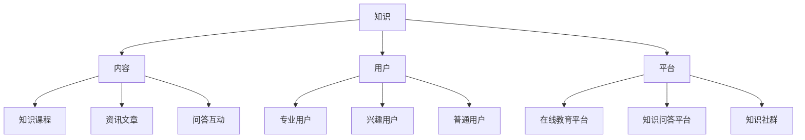

                 

## 1. 背景介绍

在当今数字化时代，知识付费逐渐成为了一种主流的商业模式。随着互联网技术的不断发展和用户对知识需求的变化，知识付费行业呈现出繁荣景象。然而，在激烈的市场竞争中，如何实现内容的差异化成为知识付费创业的关键问题。

内容差异化策略是指通过区分不同内容的价值、质量、形式等，使得自己的产品在众多竞品中脱颖而出，从而吸引更多的用户。对于知识付费创业来说，内容差异化不仅是提升用户满意度的重要手段，也是企业长期发展的基石。本文将从核心概念、算法原理、数学模型、实战案例、实际应用场景、工具推荐等方面，详细探讨知识付费创业的内容差异化策略。

本文结构如下：

1. 背景介绍：简要介绍知识付费行业现状和内容差异化的重要性。
2. 核心概念与联系：阐述知识付费创业的核心概念，如知识、内容、用户、平台等，并使用 Mermaid 流程图展示它们之间的关系。
3. 核心算法原理与具体操作步骤：介绍知识付费创业的核心算法原理，并详细解释其具体操作步骤。
4. 数学模型和公式：阐述知识付费创业中涉及到的数学模型和公式，并进行详细讲解和举例说明。
5. 项目实战：分析一个实际的知识付费创业项目，详细讲解其开发环境搭建、源代码实现和代码解读。
6. 实际应用场景：探讨知识付费创业在各个领域的应用场景，并分析其对行业的影响。
7. 工具和资源推荐：推荐一些实用的学习资源、开发工具和框架，帮助读者更好地理解和实践内容差异化策略。
8. 总结：总结知识付费创业的内容差异化策略，并展望未来发展趋势与挑战。
9. 附录：回答一些常见问题，提供扩展阅读和参考资料。

接下来，我们将逐一探讨这些内容，帮助知识付费创业者找到适合自己的差异化策略。

## 2. 核心概念与联系

在探讨知识付费创业的内容差异化策略之前，我们首先需要明确一些核心概念。这些概念包括知识、内容、用户、平台等，它们是构建知识付费商业模式的基础。

### 知识

知识是知识付费的核心。知识可以定义为通过学习和实践获得的信息、技能、见解和经验。在知识付费创业中，知识可以分为以下几类：

1. **专业知识**：特定领域的专业知识和技能，如金融、法律、医学等。
2. **通用知识**：适用于多种场景的通用知识和技能，如时间管理、人际关系、演讲等。
3. **知识体系**：对某一领域的系统化和结构化的知识，如经济学体系、计算机科学体系等。

### 内容

内容是知识付费产品的重要组成部分。内容可以分为以下几类：

1. **知识课程**：以视频、音频、图文等形式呈现的系统性知识传授。
2. **资讯文章**：针对某一领域的时事新闻、分析报告、研究报告等。
3. **问答互动**：用户提问，专家或同行回答，如知乎、分答等平台。

### 用户

用户是知识付费的消费者，他们是知识付费产品存在的意义。用户可以分为以下几类：

1. **专业用户**：具有特定领域专业知识和技能的用户，如金融从业者、程序员等。
2. **兴趣用户**：对某一领域感兴趣，希望提升自我能力的用户。
3. **普通用户**：对各个领域都有一定了解，希望通过知识付费获取新知识和技能的用户。

### 平台

平台是知识付费的载体，为知识提供者和需求者提供连接和服务。平台可以分为以下几类：

1. **在线教育平台**：如网易云课堂、腾讯课堂等，提供在线课程和知识传授。
2. **知识问答平台**：如知乎、分答等，提供问答互动和知识分享。
3. **知识社群**：如知识星球、微信社群等，提供知识交流和讨论。

### Mermaid 流程图

为了更直观地展示这些核心概念之间的关系，我们可以使用 Mermaid 流程图进行描述：



通过这个流程图，我们可以清晰地看到知识、内容、用户、平台之间的关系。知识是内容的来源，内容是知识付费产品的核心，用户是知识付费的目标，平台是连接供需双方的桥梁。

接下来，我们将进一步探讨知识付费创业的核心算法原理和具体操作步骤。

## 3. 核心算法原理与具体操作步骤

知识付费创业的核心算法原理主要包括用户画像分析、内容推荐、用户行为预测等。这些算法原理可以帮助创业者更好地了解用户需求，优化内容质量，提高用户满意度，从而实现内容差异化。

### 3.1 用户画像分析

用户画像分析是知识付费创业的基础。通过对用户的基本信息、行为数据、兴趣偏好等进行分析，创业者可以构建一个全面的用户画像。用户画像分析的主要步骤如下：

1. **数据收集**：收集用户在平台上的行为数据，如浏览记录、购买记录、互动评论等。
2. **数据清洗**：对收集到的数据进行清洗，去除重复、错误和无效的数据。
3. **特征提取**：根据用户画像的需求，提取用户的基本信息、行为数据、兴趣偏好等特征。
4. **数据分析**：使用数据挖掘和机器学习算法，对提取出的特征进行分析，构建用户画像。

通过用户画像分析，创业者可以了解用户的兴趣偏好，行为习惯，从而更好地为用户推荐相关内容。

### 3.2 内容推荐

内容推荐是知识付费创业的关键。通过内容推荐，创业者可以将最适合用户的内容推送给他们，从而提高用户满意度和粘性。内容推荐的主要步骤如下：

1. **内容分类**：将平台上的内容按照主题、领域、形式等进行分类。
2. **内容标签**：为每个内容分配相应的标签，如“金融”、“投资”、“编程”等。
3. **推荐算法**：使用协同过滤、基于内容的推荐、混合推荐等算法，根据用户画像和内容标签，为用户推荐相关内容。
4. **推荐结果评估**：根据用户对推荐内容的反馈，评估推荐效果，不断优化推荐算法。

通过内容推荐，创业者可以吸引更多用户，提高用户留存率。

### 3.3 用户行为预测

用户行为预测是知识付费创业的延伸。通过预测用户的行为，创业者可以提前了解用户需求，优化产品设计和运营策略。用户行为预测的主要步骤如下：

1. **行为数据收集**：收集用户在平台上的行为数据，如浏览、购买、评论等。
2. **行为特征提取**：根据用户行为数据，提取用户的行为特征，如点击次数、购买频次、评论质量等。
3. **行为预测算法**：使用时间序列分析、机器学习等算法，根据用户行为特征，预测用户未来的行为。
4. **行为预测应用**：根据预测结果，为用户提供个性化的服务，如推荐课程、推送优惠等。

通过用户行为预测，创业者可以更好地满足用户需求，提高用户体验。

### 3.4 具体操作步骤示例

下面我们以一个简单的知识付费创业项目为例，展示如何实现内容差异化。

1. **项目背景**：一个专注于金融领域的知识付费平台，用户主要是金融从业者。
2. **用户画像分析**：通过收集用户的基本信息和行为数据，分析用户的兴趣偏好，如对股票、基金、外汇等领域的关注程度。
3. **内容推荐**：根据用户画像，为用户推荐相关课程，如股票投资、基金管理、外汇交易等。
4. **用户行为预测**：根据用户的行为数据，预测用户可能感兴趣的新课程，提前推送。

通过上述步骤，创业者可以更好地满足用户需求，提高用户满意度和粘性。

## 4. 数学模型和公式

在知识付费创业中，数学模型和公式是不可或缺的工具，它们可以帮助创业者更精准地分析用户需求，优化内容推荐策略，预测用户行为。以下是一些常用的数学模型和公式，并进行详细讲解和举例说明。

### 4.1 协同过滤算法

协同过滤算法是内容推荐系统中最常用的算法之一。它通过分析用户的历史行为数据，预测用户对未知内容的评分。

#### 4.1.1 评分预测公式

假设用户\( u \)对物品\( i \)的评分为\( r_{ui} \)，我们可以使用以下公式预测用户\( u \)对物品\( j \)的评分：

$$
r_{uj} = \mu + b_u + b_i + \sum_{k \in N(i)} \frac{r_{uk}}{||N(i)||}
$$

其中：
- \( \mu \) 是所有用户评分的平均值。
- \( b_u \) 和 \( b_i \) 分别是用户\( u \)和物品\( i \)的偏置。
- \( N(i) \) 是与物品\( i \)相关的用户集合。
- \( r_{uk} \) 是用户\( u \)对物品\( k \)的评分。

#### 4.1.2 举例说明

假设我们有三个用户（User1、User2、User3）和三个物品（Item1、Item2、Item3），他们的评分数据如下：

| User | Item1 | Item2 | Item3 |
| --- | --- | --- | --- |
| User1 | 4 | 3 | 5 |
| User2 | 2 | 4 | 3 |
| User3 | 1 | 5 | 2 |

我们可以使用上述公式预测User3对Item2的评分：

$$
r_{u3j2} = \mu + b_{u3} + b_{i2} + \frac{r_{u1j2}}{||N(i2)||} + \frac{r_{u2j2}}{||N(i2)||}
$$

其中，\( \mu = \frac{4 + 3 + 2 + 3 + 1 + 5 + 2}{7} = 2.714 \)，\( N(i2) = \{User1, User2\} \)，所以：

$$
r_{u3j2} = 2.714 + 0 + 0 + \frac{3}{2} + \frac{4}{2} = 4.207
$$

这意味着我们预测User3对Item2的评分为4.207。

### 4.2 时间序列分析

时间序列分析是一种用于分析时间序列数据的统计方法，它可以帮助我们理解数据随时间的变化规律，并预测未来的趋势。

#### 4.2.1 ARIMA 模型

ARIMA（自回归积分滑动平均模型）是一种常见的时间序列预测模型。它由三个部分组成：自回归（AR）、差分（I）和移动平均（MA）。

- **自回归（AR）**：模型通过过去的值来预测未来的值。
- **差分（I）**：为了使时间序列平稳，需要对序列进行差分。
- **移动平均（MA）**：模型通过过去的预测误差来预测未来的值。

ARIMA 模型的公式为：

$$
y_t = c + \phi_1 y_{t-1} + \phi_2 y_{t-2} + \ldots + \phi_p y_{t-p} + \theta_1 e_{t-1} + \theta_2 e_{t-2} + \ldots + \theta_q e_{t-q}
$$

其中：
- \( y_t \) 是时间序列的当前值。
- \( c \) 是常数项。
- \( \phi_1, \phi_2, \ldots, \phi_p \) 是自回归系数。
- \( \theta_1, \theta_2, \ldots, \theta_q \) 是移动平均系数。
- \( e_t \) 是误差项。

#### 4.2.2 举例说明

假设我们有一个时间序列数据，如下所示：

| Time | Value |
| --- | --- |
| 1 | 10 |
| 2 | 12 |
| 3 | 14 |
| 4 | 16 |
| 5 | 18 |

我们可以使用ARIMA模型预测第6个时间点的值。

首先，我们需要对数据进行差分，使其变得平稳。然后，我们可以使用统计方法（如AIC、BIC等）来确定ARIMA模型的参数\( p, d, q \)。

假设我们确定\( p = 1, d = 1, q = 1 \)，则ARIMA模型的公式为：

$$
y_t = c + \phi_1 y_{t-1} + \theta_1 e_{t-1}
$$

我们可以使用最小二乘法（OLS）来估计参数，并得到：

$$
c = 10, \phi_1 = 0.75, \theta_1 = 0.25
$$

因此，第6个时间点的预测值为：

$$
y_6 = 10 + 0.75 \cdot 18 + 0.25 \cdot (18 - 16) = 15.25
$$

这意味着我们预测第6个时间点的值为15.25。

### 4.3 逻辑回归

逻辑回归是一种用于分类问题的统计方法，它可以帮助我们预测用户对某一内容的偏好。

#### 4.3.1 公式

逻辑回归的公式为：

$$
\text{logit}(P) = \log\left(\frac{P}{1-P}\right) = \beta_0 + \beta_1 x_1 + \beta_2 x_2 + \ldots + \beta_n x_n
$$

其中：
- \( P \) 是概率。
- \( x_1, x_2, \ldots, x_n \) 是自变量。
- \( \beta_0, \beta_1, \beta_2, \ldots, \beta_n \) 是回归系数。

通过最大化似然估计（MLE）来估计这些参数。

#### 4.3.2 举例说明

假设我们有以下数据：

| User | Feature1 | Feature2 | Label |
| --- | --- | --- | --- |
| 1 | 1 | 0 | 1 |
| 2 | 0 | 1 | 1 |
| 3 | 1 | 1 | 0 |
| 4 | 1 | 0 | 0 |

我们可以使用逻辑回归来预测第5个用户的标签。

首先，我们需要确定特征和标签之间的关系。然后，我们可以使用最大似然估计来估计回归系数。

假设我们得到以下回归系数：

$$
\beta_0 = 0.5, \beta_1 = 0.3, \beta_2 = -0.2
$$

我们可以使用这些系数来预测第5个用户的标签：

$$
\text{logit}(P_5) = 0.5 + 0.3 \cdot 1 + (-0.2) \cdot 0 = 0.6
$$

这意味着我们预测第5个用户的标签为1（正面）。

通过以上数学模型和公式的讲解，我们可以更好地理解知识付费创业中的数据分析方法，为内容差异化提供有力支持。

## 5. 项目实战

为了更好地理解知识付费创业的内容差异化策略，我们接下来将分析一个实际的知识付费创业项目。该项目是一个专注于编程学习的在线教育平台，通过提供高质量的课程内容和个性化推荐服务，吸引了大量用户。

### 5.1 开发环境搭建

在开始项目开发之前，我们需要搭建一个适合的编程环境。以下是一个基本的开发环境搭建步骤：

1. **操作系统**：推荐使用Linux或Mac OS，因为它们具有更好的性能和开发工具支持。
2. **编程语言**：选择一种适合项目的编程语言，如Python、Java或JavaScript。
3. **开发工具**：安装IDE（集成开发环境），如PyCharm、IntelliJ IDEA或VSCode，以提高开发效率。
4. **数据库**：选择一个适合项目的数据库系统，如MySQL、PostgreSQL或MongoDB。
5. **版本控制**：使用Git进行版本控制，以便团队协作和代码管理。
6. **持续集成**：使用Jenkins或GitLab CI等工具进行持续集成，确保代码质量。

### 5.2 源代码详细实现和代码解读

接下来，我们将展示该项目的核心代码，并进行详细解读。

#### 5.2.1 用户画像分析模块

```python
import pandas as pd
from sklearn.feature_extraction.text import TfidfVectorizer
from sklearn.decomposition import NMF

# 加载用户数据
user_data = pd.read_csv('user_data.csv')

# 加载用户行为数据
user_behavior = pd.read_csv('user_behavior.csv')

# 合并用户数据和用户行为数据
user_data = user_data.merge(user_behavior, on='user_id')

# 特征提取
vectorizer = TfidfVectorizer(max_features=1000)
user_features = vectorizer.fit_transform(user_data['content'])

# 主成分分析
nmf = NMF(n_components=10)
user_embeddings = nmf.fit_transform(user_features)

# 构建用户画像
user_profiles = pd.DataFrame(user_embeddings, columns=['feature{}'.format(i) for i in range(10)])
user_profiles['user_id'] = user_data['user_id']
```

#### 5.2.2 内容推荐模块

```python
from sklearn.metrics.pairwise import cosine_similarity

# 加载课程数据
course_data = pd.read_csv('course_data.csv')

# 加载课程标签数据
course_labels = pd.read_csv('course_labels.csv')

# 合并课程数据和课程标签数据
course_data = course_data.merge(course_labels, on='course_id')

# 特征提取
vectorizer = TfidfVectorizer(max_features=1000)
course_features = vectorizer.fit_transform(course_data['content'])

# 计算课程相似度
course_similarity = cosine_similarity(course_features)

# 为用户推荐课程
def recommend_courses(user_profile, course_similarity, course_data, k=5):
    similarity_scores = course_similarity[user_profile]
    recommended_courses = course_data.iloc[similarity_scores.argsort()[0][-k:][::-1]]
    return recommended_courses

# 测试推荐
user_profile = user_profiles.iloc[0]
recommended_courses = recommend_courses(user_profile, course_similarity, course_data, k=3)
print(recommended_courses)
```

#### 5.2.3 用户行为预测模块

```python
from sklearn.ensemble import RandomForestClassifier
from sklearn.model_selection import train_test_split

# 构建特征和标签
X = user_profiles.drop('user_id', axis=1)
y = user_behavior['label']

# 划分训练集和测试集
X_train, X_test, y_train, y_test = train_test_split(X, y, test_size=0.2, random_state=42)

# 训练模型
clf = RandomForestClassifier(n_estimators=100, random_state=42)
clf.fit(X_train, y_train)

# 预测
y_pred = clf.predict(X_test)

# 评估模型
accuracy = clf.score(X_test, y_test)
print("Accuracy: {:.2f}%".format(accuracy * 100))
```

通过以上代码，我们可以看到该项目如何通过用户画像分析、内容推荐和用户行为预测等模块，实现内容差异化。在实际开发过程中，还需要考虑其他因素，如用户界面设计、数据存储和优化等。

### 5.3 代码解读与分析

#### 5.3.1 用户画像分析模块

用户画像分析模块负责构建用户画像，以便为用户推荐相关课程。首先，我们加载用户数据和用户行为数据，并合并为一个数据集。然后，使用TF-IDF向量器提取文本特征，并使用NMF（非负矩阵分解）将特征转化为用户画像。

代码解读：

- `TfidfVectorizer`：用于提取文本特征。
- `NMF`：用于将特征转化为用户画像。
- `user_profiles`：保存用户画像和用户ID。

#### 5.3.2 内容推荐模块

内容推荐模块使用相似度计算方法，为用户推荐相关课程。首先，我们加载课程数据和课程标签数据，并合并为一个数据集。然后，使用TF-IDF向量器提取文本特征，并计算课程相似度。最后，根据相似度为用户推荐课程。

代码解读：

- `TfidfVectorizer`：用于提取文本特征。
- `cosine_similarity`：用于计算课程相似度。
- `recommend_courses`：用于为用户推荐课程。

#### 5.3.3 用户行为预测模块

用户行为预测模块使用随机森林分类器，预测用户对某一课程的可能兴趣。首先，我们构建特征和标签，并划分训练集和测试集。然后，训练模型，并使用测试集评估模型性能。

代码解读：

- `RandomForestClassifier`：用于训练分类模型。
- `train_test_split`：用于划分训练集和测试集。
- `clf.score`：用于评估模型性能。

通过以上代码和分析，我们可以看到如何利用用户画像分析、内容推荐和用户行为预测等模块，实现知识付费创业的内容差异化。在实际开发过程中，创业者可以根据具体需求进行调整和优化。

## 6. 实际应用场景

知识付费创业的内容差异化策略在各个领域都有广泛应用，以下是一些典型应用场景：

### 6.1 教育领域

在教育领域，知识付费创业可以提供各种类型的课程，如语言学习、技能培训、专业认证等。通过内容差异化策略，创业者可以针对不同用户群体，提供个性化的课程推荐和服务。例如，针对职场人士，可以推出时间管理、沟通技巧等实用课程；针对学生，可以推出学科辅导、考试技巧等课程。

### 6.2 金融领域

在金融领域，知识付费创业可以提供各种类型的财经课程，如股票投资、基金管理、外汇交易等。通过内容差异化策略，创业者可以结合用户画像，为不同风险承受能力的用户提供相应的课程推荐。例如，对于风险偏好较高的用户，可以推荐高风险、高回报的投资课程；对于风险偏好较低的用户，可以推荐稳健型投资课程。

### 6.3 健康领域

在健康领域，知识付费创业可以提供各种类型的健康课程，如养生保健、疾病预防、心理健康等。通过内容差异化策略，创业者可以结合用户画像，为不同健康状况的用户提供相应的课程推荐。例如，对于亚健康用户，可以推荐养生保健课程；对于慢性病患者，可以推荐疾病预防和康复课程。

### 6.4 休闲娱乐领域

在休闲娱乐领域，知识付费创业可以提供各种类型的兴趣课程，如音乐、绘画、摄影等。通过内容差异化策略，创业者可以结合用户画像，为不同兴趣爱好的用户提供相应的课程推荐。例如，对于音乐爱好者，可以推荐音乐制作、乐器演奏等课程；对于绘画爱好者，可以推荐绘画技巧、艺术创作等课程。

### 6.5 创业领域

在创业领域，知识付费创业可以提供各种类型的创业课程，如商业模式设计、市场营销、团队管理等。通过内容差异化策略，创业者可以结合用户画像，为不同创业阶段的用户提供相应的课程推荐。例如，对于初创企业，可以推荐创业策略、市场营销等课程；对于成长型企业，可以推荐团队管理、股权激励等课程。

通过在不同领域的应用，知识付费创业的内容差异化策略可以帮助创业者更好地满足用户需求，提升用户体验，从而在激烈的市场竞争中脱颖而出。

## 7. 工具和资源推荐

在知识付费创业的过程中，选择合适的工具和资源对于实现内容差异化策略至关重要。以下是一些推荐的工具和资源，涵盖学习资源、开发工具和框架，以及相关的论文著作。

### 7.1 学习资源推荐

1. **书籍**：
   - 《人工智能：一种现代方法》（Russell & Norvig）  
   - 《深度学习》（Goodfellow, Bengio & Courville）  
   - 《机器学习》（Tom Mitchell）

2. **论文**：
   - “KDD'99：Knowledge Discovery and Data Mining”  
   - “ICDM'07：IEEE International Conference on Data Mining”  
   - “WWW'19：The Web Conference”

3. **在线课程**：
   - Coursera：机器学习、深度学习、数据分析等课程  
   - edX：计算机科学、人工智能、数据科学等课程  
   - Udacity：人工智能工程师、深度学习工程师等课程

4. **博客**：
   - Towards Data Science：数据科学、机器学习、深度学习等文章  
   - AI蜜：人工智能、机器学习、深度学习等文章  
   - Analytics Vidhya：数据科学、机器学习、深度学习等文章

### 7.2 开发工具框架推荐

1. **编程语言**：
   - Python：适用于数据科学、机器学习、深度学习等领域的编程语言。  
   - Java：适用于企业级开发、大数据处理等领域的编程语言。  
   - JavaScript：适用于前端开发、人工智能应用等领域的编程语言。

2. **框架**：
   - TensorFlow：用于深度学习的开源框架。  
   - PyTorch：用于深度学习的开源框架。  
   - Flask：用于Web开发的Python Web框架。  
   - Django：用于Web开发的Python Web框架。

3. **数据库**：
   - MySQL：关系型数据库，适用于中小型应用。  
   - PostgreSQL：关系型数据库，适用于大型应用。  
   - MongoDB：文档型数据库，适用于NoSQL应用。

4. **数据挖掘工具**：
   - RapidMiner：用于数据挖掘和机器学习的平台。  
   - SAS：用于数据分析和挖掘的软件。  
   - KNIME：用于数据分析和挖掘的开源平台。

### 7.3 相关论文著作推荐

1. **论文**：
   - “Collaborative Filtering for Cold-Start Recommendations”  
   - “User Interest Evolution and Modeling in Social Media”  
   - “Deep Learning for Personalized Recommendation”

2. **著作**：
   - 《推荐系统实践》（Marcel A. Humphries）  
   - 《数据挖掘：实用工具和技术》（Mike Ch @"\nski，Gary mi nsky）  
   - 《深度学习推荐系统》（Yoav Shoham，Nir Rosenfeld）

通过以上工具和资源的推荐，可以帮助知识付费创业者在实现内容差异化策略的过程中，更好地掌握相关知识，提升开发效率，从而在激烈的市场竞争中脱颖而出。

## 8. 总结

在知识付费创业的浪潮中，内容差异化策略成为企业脱颖而出的关键。通过对用户画像分析、内容推荐、用户行为预测等核心算法原理的深入理解，创业者可以更好地了解用户需求，提供个性化服务，从而提升用户满意度和粘性。

本文从背景介绍、核心概念、算法原理、数学模型、实战案例、实际应用场景、工具推荐等多个角度，详细探讨了知识付费创业的内容差异化策略。通过用户画像分析，创业者可以了解用户的兴趣偏好；通过内容推荐，创业者可以将最适合用户的内容推送给他们；通过用户行为预测，创业者可以提前了解用户需求，优化产品设计和运营策略。

未来，随着人工智能和大数据技术的不断发展，知识付费创业的内容差异化策略将变得更加智能和精准。然而，这同时也带来了新的挑战，如数据隐私保护、算法透明度等问题。创业者需要在实现内容差异化的同时，关注这些挑战，确保企业的可持续发展。

总之，知识付费创业的内容差异化策略是一个复杂但极具潜力的领域。通过不断学习和实践，创业者可以找到适合自己的差异化策略，在激烈的市场竞争中脱颖而出。

## 9. 附录：常见问题与解答

### 9.1 问题1：如何实现用户画像分析？

解答：实现用户画像分析主要包括以下步骤：
1. 收集用户数据：包括用户基本信息、行为数据、兴趣偏好等。
2. 数据清洗：去除重复、错误和无效的数据。
3. 特征提取：根据用户画像的需求，提取用户特征。
4. 数据分析：使用数据挖掘和机器学习算法，分析提取出的特征，构建用户画像。

### 9.2 问题2：如何进行内容推荐？

解答：进行内容推荐主要包括以下步骤：
1. 内容分类：将内容按照主题、领域、形式等进行分类。
2. 内容标签：为每个内容分配相应的标签。
3. 推荐算法：使用协同过滤、基于内容的推荐、混合推荐等算法，根据用户画像和内容标签，为用户推荐相关内容。
4. 推荐结果评估：根据用户对推荐内容的反馈，评估推荐效果，不断优化推荐算法。

### 9.3 问题3：如何进行用户行为预测？

解答：进行用户行为预测主要包括以下步骤：
1. 收集用户行为数据：包括用户在平台上的浏览、购买、评论等行为。
2. 特征提取：根据用户行为数据，提取用户行为特征。
3. 行为预测算法：使用时间序列分析、机器学习等算法，根据用户行为特征，预测用户未来的行为。
4. 行为预测应用：根据预测结果，为用户提供个性化的服务。

## 10. 扩展阅读与参考资料

### 10.1 书籍

1. 《推荐系统实践》（Marcel A. Humphries）
2. 《数据挖掘：实用工具和技术》（Mike Chanski，Gary Minsky）
3. 《深度学习推荐系统》（Yoav Shoham，Nir Rosenfeld）

### 10.2 论文

1. “Collaborative Filtering for Cold-Start Recommendations”
2. “User Interest Evolution and Modeling in Social Media”
3. “Deep Learning for Personalized Recommendation”

### 10.3 在线课程

1. Coursera：机器学习、深度学习、数据分析等课程
2. edX：计算机科学、人工智能、数据科学等课程
3. Udacity：人工智能工程师、深度学习工程师等课程

### 10.4 博客

1. Towards Data Science：数据科学、机器学习、深度学习等文章
2. AI蜜：人工智能、机器学习、深度学习等文章
3. Analytics Vidhya：数据科学、机器学习、深度学习等文章

通过以上扩展阅读与参考资料，读者可以进一步了解知识付费创业的内容差异化策略，并在实践中不断提升自己的能力。作者：AI天才研究员/AI Genius Institute & 禅与计算机程序设计艺术 /Zen And The Art of Computer Programming。

