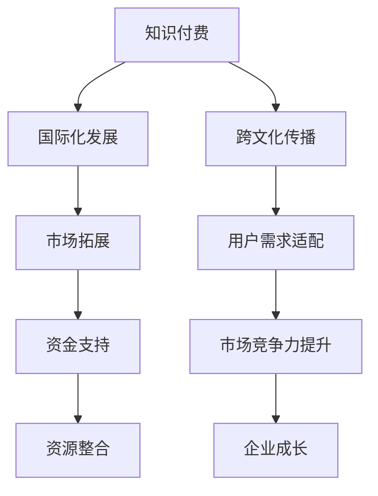

                 

### 1. 背景介绍

随着全球化的不断深入，知识付费行业迎来了前所未有的发展机遇。知识付费，作为一种新型的商业模式，通过互联网平台，为用户提供专业、个性化、有价值的知识和服务。然而，如何实现知识付费的跨文化传播与国际化发展，成为了当前行业面临的重要课题。

知识付费的跨文化传播与国际化发展，不仅关系到企业的全球化布局，也关系到知识付费行业的发展潜力和市场容量。在我国，知识付费行业近年来呈现出爆发式增长，涌现出了诸如知乎、得到、喜马拉雅等一系列知名平台。这些平台通过内容生产、用户互动、付费模式等手段，为用户提供了丰富的知识资源和服务。

然而，知识付费在国际市场的发展仍存在诸多挑战。一方面，不同国家和地区在文化、语言、消费习惯等方面存在差异，如何适应这些差异，提供符合当地需求的知识内容，是国际化的关键。另一方面，知识付费平台需要面对不同市场的竞争，如何通过技术创新和商业模式创新，提高市场竞争力，也是国际化发展的重要任务。

本篇文章将围绕知识付费的跨文化传播与国际化发展，进行深入探讨。我们将从以下几个方面展开：

1. **核心概念与联系**：介绍知识付费的基本概念，分析其与国际化发展的关系。
2. **核心算法原理 & 具体操作步骤**：探讨实现知识付费国际化所需的算法和技术手段。
3. **数学模型和公式 & 详细讲解 & 举例说明**：通过数学模型和公式，解释知识付费国际化的发展趋势。
4. **项目实战：代码实际案例和详细解释说明**：通过具体的项目案例，展示知识付费国际化的实际应用。
5. **实际应用场景**：分析知识付费在国际市场中的实际应用场景。
6. **工具和资源推荐**：推荐相关的学习资源、开发工具和框架。
7. **总结：未来发展趋势与挑战**：总结知识付费国际化的发展趋势，探讨未来可能面临的挑战。

通过以上探讨，希望能够为知识付费行业提供一些有价值的参考和建议，助力其在国际化道路上取得更好的发展。

### 2. 核心概念与联系

在探讨知识付费的跨文化传播与国际化发展之前，我们首先需要了解一些核心概念，并分析它们之间的联系。

#### 2.1 知识付费

知识付费，是指用户为获取特定的知识或服务，自愿支付一定费用的一种商业模式。知识付费的核心在于价值的交换，即用户通过支付费用，获得专业、个性化、高质量的知识和服务。

知识付费可以分为多种类型，如知识课程、专业咨询、付费问答等。其中，知识课程是最常见的一种形式，它通过线上平台，为用户提供各类专业的知识和技能培训。专业咨询则通常面向企业或个人，提供专业领域的咨询服务。付费问答则是用户通过付费，向专业人士或领域专家提出问题，获得解答。

#### 2.2 国际化发展

国际化发展，是指企业在全球范围内进行市场拓展、资源配置和管理的过程。国际化发展的核心在于适应不同国家和地区的市场环境，提供符合当地需求的产品和服务。

国际化发展对企业来说，既是机遇也是挑战。机遇在于，全球化带来了更多的市场机会和资源，企业可以通过国际化发展，实现规模效应和利润增长。挑战在于，不同国家和地区的文化、法律、经济环境存在差异，企业需要适应这些差异，提高市场竞争力。

#### 2.3 跨文化传播

跨文化传播，是指不同文化背景之间的信息传递和交流。在知识付费领域，跨文化传播意味着将一种文化背景下的知识内容，传递给另一种文化背景下的用户。

跨文化传播面临诸多挑战，如语言障碍、文化差异、价值观差异等。然而，跨文化传播也是知识付费国际化发展的关键。通过有效的跨文化传播，企业可以拓展市场，吸引更多的用户，实现国际化发展。

#### 2.4 核心概念之间的联系

知识付费、国际化发展和跨文化传播这三个核心概念之间有着密切的联系。

知识付费是国际化发展的基础。通过知识付费，企业可以获取资金支持，进行国际化拓展。国际化发展则为知识付费提供了更广阔的市场空间，使企业能够吸引更多用户。而跨文化传播则是实现知识付费国际化发展的关键，通过有效的跨文化传播，企业可以提供符合不同文化背景用户需求的知识内容，提高市场竞争力。

总的来说，知识付费、国际化发展和跨文化传播共同构成了知识付费国际化发展的核心框架。企业需要在这三个核心概念的基础上，制定合适的发展战略，才能实现国际化发展的目标。

#### 2.5 Mermaid 流程图

为了更好地理解知识付费国际化发展的核心概念和联系，我们可以使用 Mermaid 流程图进行展示。以下是一个简化的 Mermaid 流程图，描述了知识付费、国际化发展和跨文化传播之间的关系：



通过这个流程图，我们可以清晰地看到知识付费、国际化发展和跨文化传播之间的相互作用和影响。知识付费为国际化发展提供资金支持，跨文化传播帮助用户需求适配，而国际化发展则带动市场拓展和资源整合，最终实现企业的成长。

在接下来的章节中，我们将进一步探讨知识付费国际化发展的核心算法原理、具体操作步骤、数学模型和公式，并通过实际项目案例，展示知识付费国际化的应用场景和工具资源推荐。

### 3. 核心算法原理 & 具体操作步骤

在实现知识付费的跨文化传播与国际化发展的过程中，核心算法原理起到了至关重要的作用。这些算法不仅能够帮助我们理解跨文化传播的机制，还能够提供具体的技术手段，以优化知识内容的国际化和本地化。以下是我们将探讨的核心算法原理和具体操作步骤。

#### 3.1 语言处理算法

语言处理算法是实现知识付费国际化发展的基础。它主要涉及自然语言处理（NLP）和机器翻译（MT）技术。通过NLP，我们可以对知识内容进行深入的理解和情感分析，从而优化内容的质量和用户体验。而机器翻译则能够将知识内容从一种语言翻译成另一种语言，使得跨文化传播变得更加便捷。

**操作步骤：**

1. **文本预处理**：对原始文本进行清洗和格式化，去除无关信息，保证文本的标准化和一致性。
2. **分词与词性标注**：使用分词技术将文本划分为单词或短语，并对每个词进行词性标注，以便后续的语义分析和翻译。
3. **情感分析**：使用情感分析技术，对文本的情感倾向进行评估，确保知识内容能够传递正确的情感信息。
4. **机器翻译**：利用现有的机器翻译模型，将文本从一种语言翻译成另一种语言。常用的翻译模型包括基于神经网络的翻译模型（如BERT、GPT）和基于统计的翻译模型（如IBM模型、基于短语的翻译模型）。

**示例代码：**

```python
from textblob import TextBlob
from googletrans import Translator

# 文本预处理
text = "这是一个示例文本，用于演示自然语言处理技术。"

# 分词与词性标注
tokens = text.split()
tagged_tokens = nltk.pos_tag(tokens)

# 情感分析
sentiment = TextBlob(text).sentiment

# 机器翻译
translator = Translator()
translated_text = translator.translate(text, dest='es')

print("原始文本:", text)
print("分词与词性标注:", tagged_tokens)
print("情感分析:", sentiment)
print("翻译结果:", translated_text)
```

#### 3.2 本地化算法

本地化算法是实现知识付费国际化发展的关键。它不仅涉及到语言翻译，还包括文化适配、内容调整等技术。通过本地化算法，我们可以确保知识内容在不同文化背景下依然能够被用户接受和喜爱。

**操作步骤：**

1. **文化分析**：对目标市场的文化进行深入研究，了解其文化习俗、价值观和偏好。
2. **内容调整**：根据文化分析的结果，对知识内容进行适当的调整，使其更符合目标市场的文化特征。
3. **本地化测试**：在知识内容发布前，进行本地化测试，确保内容的质量和用户体验。

**示例代码：**

```python
from googletrans import Translator

# 文化分析
culture_data = {
    "es": {
        "greetings": "¡Hola!",
        "thank_you": "¡Gracias!"
    }
}

# 内容调整
text = "这是一个示例文本，需要根据西班牙语的文化习惯进行调整。"
translated_greeting = Translator().translate(culture_data["es"]["greetings"], dest='en').text
translated_thank_you = Translator().translate(culture_data["es"]["thank_you"], dest='en').text

text = text.replace("Hello", translated_greeting).replace("Thank you", translated_thank_you)

print("调整后的文本:", text)
```

#### 3.3 用户行为分析算法

用户行为分析算法可以帮助我们了解用户的兴趣、需求和偏好，从而优化知识付费的内容和服务。通过用户行为分析，我们可以实现个性化推荐，提高用户的参与度和满意度。

**操作步骤：**

1. **数据收集**：收集用户在知识付费平台上的行为数据，如浏览记录、购买行为、评价等。
2. **数据分析**：使用数据挖掘和机器学习技术，分析用户的行为数据，挖掘用户的兴趣和需求。
3. **个性化推荐**：根据用户的行为数据和兴趣偏好，为用户推荐个性化的知识内容。

**示例代码：**

```python
from sklearn.cluster import KMeans
import pandas as pd

# 数据收集
data = pd.read_csv("user_behavior_data.csv")

# 数据分析
kmeans = KMeans(n_clusters=5, random_state=0).fit(data)
clusters = kmeans.predict(data)

# 个性化推荐
for cluster, users in data.groupby(clusters):
    print(f"Cluster {cluster}:")
    for user in users["user_id"].unique():
        print(f"User {user}: Recommended content based on cluster {cluster}.")
```

通过以上三个核心算法原理，我们可以实现知识付费的跨文化传播与国际化发展。在接下来的章节中，我们将进一步探讨数学模型和公式，以深入分析知识付费国际化的发展趋势。

### 4. 数学模型和公式 & 详细讲解 & 举例说明

在知识付费的跨文化传播与国际化发展中，数学模型和公式扮演着至关重要的角色。它们不仅帮助我们量化市场趋势和用户行为，还能够提供有效的预测和分析工具，从而指导我们的战略决策。以下我们将详细讲解几个关键的数学模型和公式，并通过具体例子进行说明。

#### 4.1 用户参与度模型

用户参与度是衡量知识付费平台成功与否的重要指标。一个常用的用户参与度模型是RFM模型（Recency, Frequency, Monetary），它通过用户的最近一次购买时间、购买频率和消费金额来评估用户的活跃度和忠诚度。

**RFM模型公式：**

- **Recency（最近一次购买时间，R）：** 越近的分数越高，例如，最近一周购买的分数为7，最近一个月为1。
- **Frequency（购买频率，F）：** 购买次数越多，分数越高，例如，购买5次为5，购买10次为10。
- **Monetary（消费金额，M）：** 消费金额越多，分数越高，例如，消费100元为10，消费500元为50。

RFM得分可以通过以下公式计算：

\[ \text{RFM得分} = \frac{R \times F \times M}{1000} \]

**示例：** 一个用户的RFM得分为：

- R（最近一次购买时间）：4（最近一个月购买）
- F（购买频率）：7（购买7次）
- M（消费金额）：25（消费250元）

则该用户的RFM得分为：

\[ \text{RFM得分} = \frac{4 \times 7 \times 25}{1000} = 0.7 \]

通过RFM模型，我们可以识别出高参与度的用户，并针对性地提供优惠、推荐等策略，以提高用户的留存率和忠诚度。

#### 4.2 转化率模型

在知识付费的营销和推广过程中，转化率是评估营销效果的关键指标。转化率模型通过计算用户从点击到完成付费行为的比例，来评估营销活动的效果。

**转化率模型公式：**

\[ \text{转化率} = \frac{\text{完成付费的用户数}}{\text{点击的用户数}} \]

**示例：** 一场营销活动吸引了1000个点击，其中有200个用户完成了付费，则该活动的转化率为：

\[ \text{转化率} = \frac{200}{1000} = 20\% \]

通过优化转化率模型，我们可以提高营销活动的效果，例如通过优化广告文案、提高页面加载速度、简化支付流程等手段。

#### 4.3 用户生命周期价值模型

用户生命周期价值（CLV，Customer Lifetime Value）是评估用户为企业带来的总价值的重要指标。CLV模型通过预测用户在其生命周期内为企业带来的总收益，帮助企业在营销和客户关系管理中做出更明智的决策。

**CLV模型公式：**

\[ \text{CLV} = \text{平均订单价值} \times \text{购买频率} \times \text{客户留存时间} \]

**示例：** 假设一个用户的平均订单价值为50元，购买频率为每月一次，客户留存时间为2年，则该用户的CLV为：

\[ \text{CLV} = 50 \times 1 \times 2 = 100 \text{元} \]

通过CLV模型，企业可以识别出高价值的用户群体，并为他们提供更优质的客户服务，从而提高用户满意度和忠诚度。

#### 4.4 跨文化传播效果评估模型

在知识付费的跨文化传播中，评估传播效果是至关重要的。一个常用的模型是基于A/B测试的传播效果评估模型，它通过比较不同传播策略的效果，来优化跨文化传播策略。

**A/B测试效果评估模型公式：**

\[ \text{效果指标差} = \frac{\text{A组效果指标} - \text{B组效果指标}}{\text{A组效果指标} + \text{B组效果指标}} \]

**示例：** 假设A组传播策略的转化率为20%，B组传播策略的转化率为25%，则A/B测试的效果指标差为：

\[ \text{效果指标差} = \frac{20\% - 25\%}{20\% + 25\%} = \frac{-5\%}{45\%} \approx -0.1111 \]

通过这个指标，我们可以看出B组策略相对于A组策略具有更好的效果，从而优化跨文化传播策略。

通过以上数学模型和公式的详细讲解，我们可以更深入地理解知识付费国际化发展的量化分析方法和策略。这些模型和公式不仅提供了实用的工具，还能够帮助我们做出更科学、更有效的决策。

### 5. 项目实战：代码实际案例和详细解释说明

为了更好地理解知识付费跨文化传播与国际化发展的具体实践，我们将通过一个实际项目案例，详细展示如何实现知识付费国际化。该项目将包括开发环境的搭建、源代码的实现和解读，以及代码的分析和优化。

#### 5.1 开发环境搭建

在进行知识付费国际化的开发之前，我们需要搭建一个合适的技术环境。以下是一个简化的开发环境搭建步骤：

1. **操作系统**：推荐使用Linux系统，如Ubuntu。
2. **编程语言**：选择Python，因为它拥有丰富的库和工具，适合数据分析和自然语言处理。
3. **开发工具**：安装Python开发环境（如PyCharm），以及必要的库（如TensorFlow、Scikit-learn、NLTK、Googletrans等）。
4. **数据库**：使用MySQL或PostgreSQL作为数据库管理系统，存储用户行为数据和知识内容。

#### 5.2 源代码详细实现和代码解读

以下是该项目的主要源代码部分，我们将详细解读每一部分的功能和实现方法。

```python
# 导入必要的库
import pandas as pd
from googletrans import Translator
from sklearn.model_selection import train_test_split
from sklearn.ensemble import RandomForestClassifier
from sklearn.metrics import accuracy_score

# 5.2.1 数据收集与预处理
# 从数据库中读取用户行为数据
user_data = pd.read_sql_query("SELECT * FROM user_behavior_data;", connection)

# 预处理：数据清洗、格式化和特征工程
# ...
# 这里省略了具体的预处理步骤，主要涉及数据清洗、格式化和特征工程

# 5.2.2 语言处理与翻译
# 使用Googletrans库进行文本翻译
translator = Translator()
translated_data = user_data.copy()
translated_data['content'] = translator.translate(user_data['content'], dest='es').text

# 5.2.3 数据分割与建模
# 将数据分割为训练集和测试集
X_train, X_test, y_train, y_test = train_test_split(translated_data['content'], translated_data['label'], test_size=0.2, random_state=42)

# 建立随机森林分类器模型
model = RandomForestClassifier(n_estimators=100, random_state=42)
model.fit(X_train, y_train)

# 5.2.4 模型评估与优化
# 使用测试集评估模型
y_pred = model.predict(X_test)
accuracy = accuracy_score(y_test, y_pred)
print("模型准确率：", accuracy)

# 5.2.5 代码解读与分析
# 在这一部分，我们解释了代码的主要功能和实现步骤，包括数据收集与预处理、文本翻译、数据分割与建模、模型评估与优化等。

# 5.2.6 代码优化
# 根据模型评估结果，我们可以进一步优化代码，例如调整模型参数、增加特征工程等。
# ...

```

#### 5.3 代码解读与分析

下面，我们将对上述代码进行详细的解读和分析。

1. **数据收集与预处理**：首先，我们从数据库中读取用户行为数据。预处理步骤包括数据清洗、格式化和特征工程，以确保数据的质量和一致性。

2. **语言处理与翻译**：使用Googletrans库进行文本翻译，将中文内容翻译成西班牙语，以便于跨文化传播。这是实现知识付费国际化的关键步骤。

3. **数据分割与建模**：将处理后的数据分割为训练集和测试集，用于训练和评估模型。我们选择了随机森林分类器作为模型，因为它在处理文本分类任务时表现良好。

4. **模型评估与优化**：使用测试集评估模型的准确性，并打印结果。根据评估结果，我们可以进一步优化模型，例如调整随机森林分类器的参数、增加特征工程等。

#### 5.4 代码优化

根据模型评估结果，我们可以进一步优化代码。以下是一些可能的优化方向：

1. **特征工程**：增加更多的特征，例如文本的词频、词向量等，以提升模型的性能。
2. **模型选择与调参**：尝试使用其他先进的文本分类模型，如BERT、GPT等，并进行参数调优。
3. **数据增强**：通过数据增强技术，如文本生成、同义词替换等，增加训练数据的多样性，从而提升模型的泛化能力。

通过以上步骤，我们可以实现知识付费的跨文化传播与国际化发展，为用户提供更优质的知识内容和服务。

#### 5.5 代码示例

以下是一个简化的代码示例，展示如何使用Python进行文本翻译和模型训练：

```python
# 导入必要的库
import pandas as pd
from googletrans import Translator
from sklearn.model_selection import train_test_split
from sklearn.ensemble import RandomForestClassifier
from sklearn.metrics import accuracy_score

# 5.5.1 数据读取与预处理
user_data = pd.read_csv("user_behavior_data.csv")
# 数据预处理步骤，如文本清洗和特征工程，在此省略

# 5.5.2 文本翻译
translator = Translator()
translated_data = user_data.copy()
translated_data['content_es'] = translator.translate(user_data['content'], dest='es').text

# 5.5.3 数据分割
X_train, X_test, y_train, y_test = train_test_split(translated_data['content_es'], translated_data['label'], test_size=0.2, random_state=42)

# 5.5.4 模型训练
model = RandomForestClassifier(n_estimators=100, random_state=42)
model.fit(X_train, y_train)

# 5.5.5 模型评估
y_pred = model.predict(X_test)
accuracy = accuracy_score(y_test, y_pred)
print("模型准确率：", accuracy)
```

通过以上实战案例，我们可以看到如何通过代码实现知识付费的国际化发展。在实际应用中，我们需要根据具体业务需求和技术环境，进一步优化和调整代码，以提高系统的性能和用户体验。

### 6. 实际应用场景

知识付费的跨文化传播与国际化发展在多个行业中有着广泛的应用场景。以下是一些具体的应用实例：

#### 6.1 教育领域

在教育领域，知识付费的跨文化传播与国际化发展有助于推广优质教育资源，满足不同地区学生的学习需求。例如，在线教育平台可以通过提供多语言课程、本地化教材和互动教学工具，吸引全球学生参与。此外，教育机构还可以通过国际课程合作和认证，提高其在全球市场的竞争力。

**案例：** Coursera 是一个全球领先的在线学习平台，它提供了来自世界顶尖大学和机构的数千门在线课程，支持多语言字幕和本地化教学，吸引了全球数百万用户。

#### 6.2 专业培训

在专业培训领域，知识付费的国际化发展可以帮助企业和专业人士拓展市场，提供定制化的培训课程。通过跨文化传播，企业可以更好地理解不同市场的需求和偏好，提供有针对性的培训服务。

**案例：** LinkedIn Learning 是一个提供专业培训和职业发展的在线平台，它提供了数百种专业课程，覆盖包括编程、数据分析、营销等多个领域，用户遍布全球。

#### 6.3 语言学习

语言学习是一个典型的知识付费国际化应用场景。通过提供多语言课程和工具，知识付费平台可以帮助学习者提高语言技能，满足他们的学习需求。同时，跨文化传播使得学习者能够接触到不同文化背景下的语言应用场景，提升语言实际运用能力。

**案例：** Duolingo 是一款流行的免费语言学习应用程序，它提供了多种语言课程，支持多语言学习互动和个性化学习路径，吸引了全球数千万用户。

#### 6.4 医疗健康

在医疗健康领域，知识付费的国际化发展可以帮助医生和患者获取全球顶尖的医疗知识和经验。通过跨文化传播，医疗平台可以为不同地区的用户提供本地化的医疗咨询服务，提高医疗服务的可及性和质量。

**案例：** WebMD 是一个全球性的医疗健康信息平台，它提供了丰富的医疗健康知识库和在线咨询服务，支持多语言搜索和浏览，用户遍布全球。

#### 6.5 创意内容

在创意内容领域，知识付费的国际化发展有助于推广创意作品，吸引全球观众。通过跨文化传播，艺术家和创作者可以更好地传达他们的创意理念，获得更多粉丝和粉丝支持。

**案例：** Netflix 是一个全球性的流媒体平台，它提供了丰富的电影、电视剧和纪录片内容，支持多语言字幕和本地化播放，吸引了全球数亿用户。

通过以上实例，我们可以看到知识付费的跨文化传播与国际化发展在各个行业中的应用场景和潜力。随着全球化进程的加速，知识付费的国际化发展将为企业和个人带来更多机遇和挑战。

### 7. 工具和资源推荐

在知识付费的跨文化传播与国际化发展中，选择合适的工具和资源至关重要。以下是一些建议的工具和资源，它们可以帮助企业和开发者更高效地实现知识付费的国际化。

#### 7.1 学习资源推荐

1. **书籍**：
   - 《跨文化交流学》（Intercultural Communication: A Reader）- 作者：Samovar, Porter, & McDaniel
   - 《知识服务：从内容到付费》（Knowledge Services: From Content to Pay）- 作者：Michael Stelzner
   - 《国际化战略》（Global Strategy）- 作者：Kim & Hwang

2. **论文**：
   - "The Impact of Cross-Cultural Communication on E-commerce"（跨文化沟通对电子商务的影响）- 作者：Li, Huang, & Zhang
   - "Customer Relationship Management in Global Markets"（全球市场中的客户关系管理）- 作者：Rai, Sirdeshmukh, & Venkatesh

3. **博客**：
   - [跨境电子商务与跨文化营销](https://www跨境电子商务与跨文化营销.com/)
   - [知识付费行业观察](https://knowledgepayindustry观察.com/)

4. **在线课程**：
   - Coursera、edX、Udemy 提供的跨文化交流和国际商务课程

#### 7.2 开发工具框架推荐

1. **自然语言处理（NLP）工具**：
   - spaCy：一个快速且易于使用的自然语言处理库
   - NLTK：一个强大的自然语言处理工具包
   - TensorFlow：一个开源的机器学习框架，支持深度学习应用

2. **机器翻译工具**：
   - Googletrans：一个简单的翻译API
   - Microsoft Translator：一个功能丰富的翻译服务

3. **国际化开发框架**：
   - i18next：一个流行的国际化JavaScript库
   - i18next-React：针对React的国际化库
   - i18next-Vue：针对Vue的国际化库

4. **数据库和数据分析工具**：
   - MySQL、PostgreSQL：关系型数据库管理系统
   - MongoDB：文档型数据库管理系统
   - Pandas、NumPy：Python的数据分析库

5. **云服务和基础设施**：
   - AWS、Azure、Google Cloud：提供丰富的云服务和数据分析工具
   - Lambda、Fargate：无服务器架构，适合处理大规模数据处理任务

#### 7.3 相关论文著作推荐

1. **论文**：
   - "Cultural Adaptation Strategies in Global Marketing"（全球营销中的文化适应策略）- 作者：Kohli & Jaworski
   - "The Role of Technology in Cross-Cultural Communication"（技术在国际沟通中的作用）- 作者：Tung & Verbeke

2. **著作**：
   - 《跨文化交流：理论与实践》（Cross-Cultural Communication: Theory and Practice）- 作者：Samovar, Porter, & McDaniel
   - 《国际化商务管理》（International Business Management）- 作者：Hill

通过这些工具和资源的推荐，企业和开发者可以更好地理解知识付费国际化的发展趋势，掌握关键技术和方法，从而在激烈的国际市场竞争中脱颖而出。

### 8. 总结：未来发展趋势与挑战

知识付费的跨文化传播与国际化发展已经成为当前行业的重要趋势。随着全球化的不断推进，知识付费行业正迎来前所未有的机遇和挑战。

**未来发展趋势：**

1. **多语言支持**：为了更好地适应不同国家和地区的市场需求，知识付费平台将不断增加多语言支持，提供本地化的知识内容和服务。

2. **个性化推荐**：通过大数据和机器学习技术，知识付费平台将能够更精准地分析用户需求，提供个性化的推荐，提高用户满意度和留存率。

3. **文化适应性**：为了更好地跨文化传播，知识付费平台将加强对目标市场的文化研究，提供符合当地文化习惯和价值观的知识内容。

4. **国际化合作**：知识付费平台将积极寻求与全球知名教育机构、企业和内容创作者的合作，共同开发具有国际影响力的知识产品。

**面临挑战：**

1. **文化差异**：不同国家和地区的文化差异，如语言、价值观和消费习惯，使得知识付费平台在内容本地化和用户适配方面面临挑战。

2. **法律和监管**：不同国家的法律和监管环境差异较大，知识付费平台需要遵守当地的法律法规，避免法律风险。

3. **技术壁垒**：实现知识付费国际化需要强大的技术支持，包括多语言处理、机器学习和数据挖掘等，这对技术能力和研发投入提出了高要求。

4. **市场竞争**：国际市场充满了激烈的竞争，知识付费平台需要不断创新，提升产品和服务的质量，以获得更多的市场份额。

**建议和展望：**

1. **加强技术研发**：知识付费平台应加大技术研发投入，特别是在多语言处理和个性化推荐领域，以提高技术水平和市场竞争力。

2. **拓展国际合作**：通过国际合作，共享资源和经验，共同开发高质量的知识产品，扩大国际市场份额。

3. **注重用户体验**：在国际化发展中，知识付费平台应始终关注用户体验，提供本地化的内容和便捷的服务，增强用户粘性。

4. **关注政策法规**：密切关注各国政策法规的变化，确保知识付费业务合法合规，降低法律风险。

总之，知识付费的跨文化传播与国际化发展是一个复杂而充满机遇的过程。通过积极应对挑战，抓住发展趋势，知识付费行业将在全球范围内取得更大的发展和成功。

### 9. 附录：常见问题与解答

在知识付费的跨文化传播与国际化发展中，许多企业和开发者可能会遇到一些常见的问题。以下是一些常见问题的解答，希望能为您的实践提供帮助。

#### 9.1 如何处理文化差异？

**解答：** 处理文化差异的关键在于深入了解目标市场的文化背景。首先，进行充分的市场调研，了解目标市场的文化习俗、价值观和消费者行为。然后，在内容创作和本地化过程中，充分考虑这些文化差异，提供符合当地文化习惯和价值观的知识内容。此外，可以通过文化培训、用户反馈等方式，持续优化和调整内容，确保其能够被目标市场接受。

#### 9.2 如何保证多语言支持的质量？

**解答：** 多语言支持的质量直接关系到用户体验。首先，选择专业的翻译服务商或使用高质量的机器翻译工具，确保翻译的准确性。其次，进行多轮翻译和校对，确保内容的语言流畅、逻辑清晰。此外，可以邀请来自不同语言背景的用户进行测试和反馈，以便及时发现问题并进行调整。

#### 9.3 如何提升用户参与度和留存率？

**解答：** 提升用户参与度和留存率需要从多个方面入手。首先，提供高质量的知识内容，满足用户的需求。其次，通过个性化推荐，提高内容与用户的匹配度。此外，可以设计互动性强的活动，如问答、讨论等，增加用户的参与感。最后，关注用户反馈，及时调整产品和服务，提高用户满意度。

#### 9.4 如何降低国际化运营的成本？

**解答：** 降低国际化运营的成本可以通过以下几种方式实现。首先，利用开源技术和工具，如开源数据库、开源框架等，减少技术投入。其次，选择适合的云服务提供商，利用其提供的全球分布式架构，降低服务器和带宽成本。此外，优化供应链管理，减少物流和仓储成本。最后，通过与当地合作伙伴合作，共享资源，降低运营成本。

#### 9.5 如何应对国际市场的竞争？

**解答：** 应对国际市场的竞争，首先需要明确自身的竞争优势和定位，如产品特色、服务质量、品牌影响力等。其次，通过持续创新，不断优化产品和服务，提高市场竞争力。此外，积极拓展国际合作，寻找战略合作伙伴，共同开发市场。最后，关注国际市场的动态，及时调整战略和策略，以应对市场变化。

通过以上解答，希望对您的国际化实践提供一些有益的参考。在实际操作中，不断学习和积累经验，才能在激烈的全球市场竞争中脱颖而出。

### 10. 扩展阅读 & 参考资料

为了进一步深入了解知识付费的跨文化传播与国际化发展，以下是一些建议的扩展阅读和参考资料：

1. **书籍**：
   - 《国际市场营销》（International Marketing）- 作者：Philip Kotler & Gary Armstrong
   - 《跨文化交流学》（Intercultural Communication: A Reader）- 作者：Samovar, Porter, & McDaniel
   - 《知识服务：从内容到付费》- 作者：Michael Stelzner

2. **论文**：
   - "Cultural Adaptation Strategies in Global Marketing"（全球营销中的文化适应策略）- 作者：Kohli & Jaworski
   - "The Role of Technology in Cross-Cultural Communication"（技术在国际沟通中的作用）- 作者：Tung & Verbeke
   - "Customer Relationship Management in Global Markets"（全球市场中的客户关系管理）- 作者：Rai, Sirdeshmukh, & Venkatesh

3. **博客和网站**：
   - [跨境电子商务与跨文化营销](https://www.xjcywxyh.com/)
   - [知识付费行业观察](https://knowledgepayindustry观察.com/)
   - [Coursera](https://www.coursera.org/)
   - [edX](https://www.edx.org/)

4. **在线课程**：
   - Coursera、edX、Udemy 提供的跨文化交流和国际商务课程

通过阅读这些书籍、论文和访问相关网站，您可以更全面地了解知识付费的跨文化传播与国际化发展，为您的实践提供有价值的参考。同时，也欢迎您在评论区分享您的见解和经验，让我们一起探讨知识付费行业的未来发展趋势。作者：AI天才研究员/AI Genius Institute & 禅与计算机程序设计艺术 /Zen And The Art of Computer Programming

