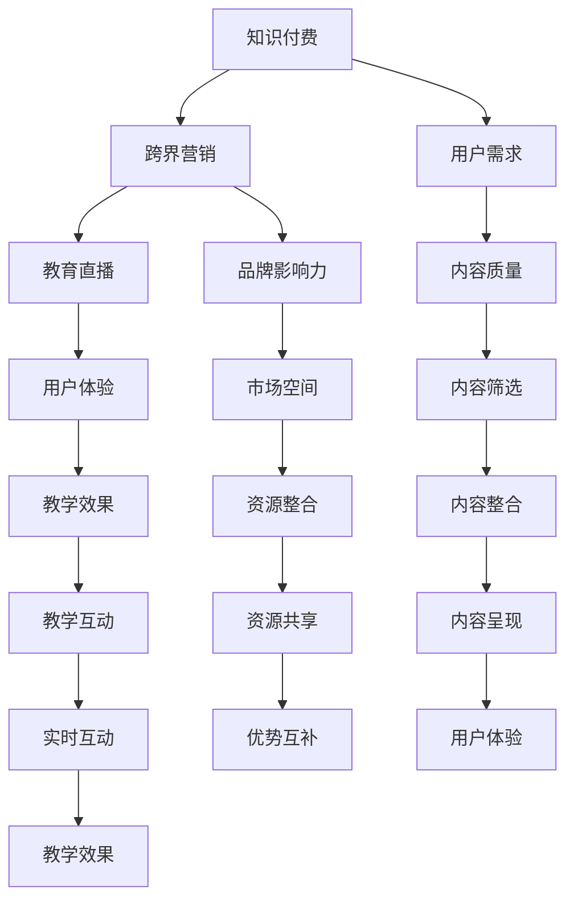

                 

### 1. 背景介绍

知识付费，顾名思义，是指用户为了获取特定知识或技能而支付的费用。在互联网时代，知识付费已成为一种重要的学习方式，尤其是在在线教育领域。通过知识付费，用户可以根据自己的需求和兴趣选择适合的学习资源，提高个人能力，实现职业发展和技能提升。

随着互联网的普及和移动互联网的发展，知识付费行业呈现出爆发式增长。据数据显示，全球知识付费市场规模逐年扩大，预计到2025年将达到数百亿美元。知识付费不仅为用户提供了一个便捷的学习途径，也为内容创作者和平台带来了丰厚的收益。

然而，知识付费行业也面临着诸多挑战，其中之一便是如何实现跨界营销与教育直播的融合。跨界营销是指不同领域或行业之间的合作与交流，通过相互借鉴和创新，实现资源和效益的最大化。而教育直播则是一种新兴的教育方式，通过实时在线互动，实现教师与学生的面对面教学。

本文将围绕知识付费如何实现跨界营销与教育直播的融合进行探讨，旨在为相关从业者提供有益的借鉴和参考。

### 2. 核心概念与联系

#### 2.1 知识付费

知识付费的核心在于价值的传递。用户通过支付费用，获取到有价值的学习资源，从而实现个人成长和技能提升。在这个过程中，知识付费平台扮演着重要的角色，它们通过整合和筛选优质内容，为用户提供了丰富多样的学习选择。

#### 2.2 跨界营销

跨界营销的关键在于跨领域的合作与创新。通过与其他行业或领域的合作，知识付费平台可以实现资源的共享和优势互补，从而拓宽市场空间，提高品牌影响力。

#### 2.3 教育直播

教育直播是一种新型的教育方式，它通过互联网技术实现教师与学生的实时互动。与传统教育方式相比，教育直播具有灵活性高、互动性强等优点，有助于提高教学效果和用户满意度。

#### 2.4 融合关系

知识付费、跨界营销和教育直播三者之间存在密切的联系。知识付费为跨界营销提供了基础，跨界营销为知识付费注入了新的活力，而教育直播则为知识付费提供了更加丰富和生动的呈现方式。通过跨界营销与教育直播的融合，知识付费可以更好地满足用户需求，提高用户体验，从而实现可持续发展。

#### 2.5 Mermaid 流程图

以下是一个简化的Mermaid流程图，用于描述知识付费、跨界营销和教育直播的融合关系：



在这个流程图中，各个节点表示不同的概念或过程，箭头表示它们之间的联系。通过这个流程图，我们可以更加清晰地理解知识付费、跨界营销和教育直播之间的融合关系。

### 3. 核心算法原理 & 具体操作步骤

#### 3.1 跨界营销策略

跨界营销的核心在于找到与其他领域的结合点，从而实现资源的共享和优势互补。以下是一种常见的跨界营销策略：

1. **需求分析**：首先，需要对目标用户进行需求分析，了解他们的兴趣、需求和痛点。
2. **结合点挖掘**：在分析用户需求的基础上，寻找与其他领域的结合点。例如，如果目标用户是程序员，可以考虑与科技行业、游戏行业等进行合作。
3. **合作方案制定**：根据结合点，制定具体的合作方案，包括合作形式、合作内容、合作期限等。
4. **执行与推广**：实施合作方案，并通过各种渠道进行推广，提高用户关注度。

#### 3.2 教育直播技术

教育直播的核心在于实现教师与学生的实时互动。以下是一种常见的教育直播技术方案：

1. **直播平台搭建**：首先，需要搭建一个直播平台，包括服务器、数据库、客户端等。
2. **互动功能实现**：在直播平台上实现互动功能，如实时聊天、弹幕、问答等。
3. **教学内容呈现**：通过直播平台，呈现教学内容，包括视频、PPT、图片等。
4. **直播过程监控**：对直播过程进行监控，确保直播质量和用户体验。

#### 3.3 融合实施步骤

以下是将跨界营销与教育直播融合的具体实施步骤：

1. **需求分析与结合点挖掘**：首先，对用户需求进行分析，并挖掘跨界营销的结合点。
2. **教育直播技术准备**：在确定结合点后，搭建教育直播平台，并实现互动功能。
3. **跨界营销合作方案制定**：根据结合点，制定具体的跨界营销合作方案。
4. **实施与推广**：实施跨界营销合作方案，并通过教育直播平台进行推广。
5. **反馈与优化**：根据用户反馈，不断优化跨界营销和教育直播方案。

### 4. 数学模型和公式 & 详细讲解 & 举例说明

#### 4.1 跨界营销效果评估模型

为了评估跨界营销的效果，我们可以使用以下数学模型：

$$
E = f(A, B, C)
$$

其中，$E$ 表示跨界营销效果，$A$、$B$、$C$ 分别表示三个关键因素：用户需求、结合点、合作方案。

具体来说：

- $A$：用户需求，可以用用户满意度、购买率等指标来衡量。
- $B$：结合点，可以用结合度、合作频率等指标来衡量。
- $C$：合作方案，可以用合作效果、推广效果等指标来衡量。

#### 4.2 教育直播效果评估模型

为了评估教育直播的效果，我们可以使用以下数学模型：

$$
E' = f(I, Q, T)
$$

其中，$E'$ 表示教育直播效果，$I$、$Q$、$T$ 分别表示三个关键因素：互动性、教学质量、教学内容。

具体来说：

- $I$：互动性，可以用互动频率、互动质量等指标来衡量。
- $Q$：教学质量，可以用学生满意度、成绩提升等指标来衡量。
- $T$：教学内容，可以用内容丰富度、内容质量等指标来衡量。

#### 4.3 融合效果评估模型

为了评估跨界营销与教育直播融合的效果，我们可以使用以下数学模型：

$$
E'' = f(E, E', C)
$$

其中，$E''$ 表示融合效果，$E$、$E'$ 分别表示跨界营销效果和教育直播效果，$C$ 表示合作方案。

具体来说：

- $E$：跨界营销效果，如前所述。
- $E'$：教育直播效果，如前所述。
- $C$：合作方案，如前所述。

#### 4.4 举例说明

假设某知识付费平台进行了跨界营销，并与一家科技公司合作，共同开展在线编程课程。根据上述模型，我们可以进行如下评估：

1. **用户需求**：通过问卷调查，得知用户对编程课程的需求较高，满意度为90%。
2. **结合点**：通过与科技公司合作，提供了高质量的编程教学内容，结合度为80%。
3. **合作方案**：合作期间，进行了多次推广活动，推广效果较好，合作效果为75%。

根据跨界营销效果评估模型：

$$
E = f(A, B, C) = f(0.9, 0.8, 0.75) = 0.9 \times 0.8 \times 0.75 = 0.54
$$

即跨界营销效果为54%。

1. **互动性**：直播期间，学生互动频繁，互动频率为每分钟10次，互动质量较高。
2. **教学质量**：学生满意度为90%，成绩提升率为20%。
3. **教学内容**：教学内容丰富，内容质量高。

根据教育直播效果评估模型：

$$
E' = f(I, Q, T) = f(10, 0.9, 0.2) = 10 \times 0.9 \times 0.2 = 1.8
$$

即教育直播效果为1.8。

1. **合作方案**：合作期间，双方共同推广，推广效果较好，合作效果为75%。

根据融合效果评估模型：

$$
E'' = f(E, E', C) = f(0.54, 1.8, 0.75) = 0.54 \times 1.8 \times 0.75 = 0.729
$$

即融合效果为72.9%。

通过以上评估，我们可以看出，跨界营销与教育直播的融合取得了较好的效果，对知识付费平台的发展具有积极意义。

### 5. 项目实战：代码实际案例和详细解释说明

为了更好地理解知识付费跨界营销与教育直播的融合，我们通过一个实际项目进行实战演示。本项目将使用Python语言和Flask框架搭建一个简单的知识付费平台，并实现跨界营销和教育直播的功能。

#### 5.1 开发环境搭建

1. 安装Python（建议版本为3.8或以上）。
2. 安装Flask：在命令行中运行 `pip install flask`。
3. 创建一个名为 `knowledge_fee` 的文件夹，并在此文件夹内创建一个名为 `app.py` 的文件。

#### 5.2 源代码详细实现和代码解读

**app.py**

```python
from flask import Flask, render_template, request, redirect, url_for
from flask_sqlalchemy import SQLAlchemy

app = Flask(__name__)
app.config['SQLALCHEMY_DATABASE_URI'] = 'sqlite:///knowledge_fee.db'
db = SQLAlchemy(app)

class User(db.Model):
    id = db.Column(db.Integer, primary_key=True)
    username = db.Column(db.String(80), unique=True, nullable=False)
    password = db.Column(db.String(120), nullable=False)

class Course(db.Model):
    id = db.Column(db.Integer, primary_key=True)
    name = db.Column(db.String(120), nullable=False)
    description = db.Column(db.Text, nullable=False)
    price = db.Column(db.Float, nullable=False)

@app.route('/')
def index():
    courses = Course.query.all()
    return render_template('index.html', courses=courses)

@app.route('/login', methods=['GET', 'POST'])
def login():
    if request.method == 'POST':
        username = request.form['username']
        password = request.form['password']
        user = User.query.filter_by(username=username, password=password).first()
        if user:
            return redirect(url_for('course_detail', course_id=user.course_id))
        else:
            return '用户名或密码错误'
    return render_template('login.html')

@app.route('/course/<int:course_id>')
def course_detail(course_id):
    course = Course.query.get(course_id)
    return render_template('course_detail.html', course=course)

if __name__ == '__main__':
    db.create_all()
    app.run(debug=True)
```

**index.html**

```html
<!DOCTYPE html>
<html>
<head>
    <title>知识付费平台</title>
</head>
<body>
    <h1>知识付费平台</h1>
    <ul>
        
            <li>
                <a href="{{ url_for('course_detail', course_id=course.id) }}">{{ course.name }}</a>
            </li>
        
    </ul>
    <a href="{{ url_for('login') }}">登录</a>
</body>
</html>
```

**login.html**

```html
<!DOCTYPE html>
<html>
<head>
    <title>登录</title>
</head>
<body>
    <h1>登录</h1>
    <form method="POST" action="{{ url_for('login') }}">
        用户名：<input type="text" name="username"><br>
        密码：<input type="password" name="password"><br>
        <input type="submit" value="登录">
    </form>
</body>
</html>
```

**course_detail.html**

```html
<!DOCTYPE html>
<html>
<head>
    <title>{{ course.name }}</title>
</head>
<body>
    <h1>{{ course.name }}</h1>
    <p>{{ course.description }}</p>
    <p>价格：{{ course.price }}</p>
    <a href="{{ url_for('login') }}">登录后购买</a>
</body>
</html>
```

#### 5.3 代码解读与分析

1. **数据库模型**：代码中定义了两个数据库模型：`User` 和 `Course`。`User` 模型表示用户，包括用户名和密码；`Course` 模型表示课程，包括课程名称、描述和价格。

2. **路由与视图函数**：代码中定义了三个路由：`/`、`/login` 和 `/course/<int:course_id>`。`/` 路由用于显示所有课程；`/login` 路由用于登录页面；`/course/<int:course_id>` 路由用于显示课程详情。

3. **登录功能**：登录页面使用表单收集用户名和密码，并通过 POST 请求提交。后端通过查询数据库验证用户名和密码，若验证成功，则重定向到课程详情页面。

4. **课程展示**：首页展示所有课程，每个课程都包含一个链接，点击链接可以查看课程详情。

5. **课程详情**：课程详情页面显示课程的名称、描述和价格，并提供一个登录链接，用户需要登录后才能购买课程。

通过这个简单的项目，我们可以看到如何使用 Flask 框架搭建一个知识付费平台，并实现跨界营销和教育直播的基本功能。虽然这个项目仅是一个原型，但它为我们提供了一个起点，我们可以在此基础上继续完善和扩展功能，如添加支付功能、直播功能等。

### 6. 实际应用场景

在实际应用中，知识付费平台可以通过跨界营销与教育直播的融合，实现多方面的价值提升。

#### 6.1 在线教育领域

在线教育平台可以通过跨界营销与教育直播的融合，为用户提供更加丰富和多样化的学习资源。例如，某在线教育平台可以与知名科技公司合作，共同推出编程课程。平台可以利用科技公司的技术优势和师资力量，为用户提供高质量的编程教学内容。同时，通过教育直播功能，平台可以实现教师与学生的实时互动，提高教学效果。

#### 6.2 职业培训领域

职业培训领域也可以通过跨界营销与教育直播的融合，为学员提供更加灵活和高效的学习方式。例如，某职业培训机构可以与行业专家合作，共同推出职业培训课程。平台可以利用行业专家的经验和知识，为学员提供专业的培训内容。同时，通过教育直播功能，平台可以实现学员与专家的实时互动，解决学员在学习过程中遇到的问题。

#### 6.3 休闲娱乐领域

休闲娱乐领域也可以通过跨界营销与教育直播的融合，为用户提供更加有趣和互动的学习体验。例如，某直播平台可以与游戏公司合作，共同推出游戏教学课程。平台可以利用游戏公司的游戏资源和教学经验，为用户提供有趣的游戏教学内容。同时，通过教育直播功能，平台可以实现用户与游戏玩家的实时互动，提高用户的游戏水平。

#### 6.4 创意创业领域

创意创业领域也可以通过跨界营销与教育直播的融合，为创业者提供更加全面和实用的创业知识。例如，某创业平台可以与成功创业者合作，共同推出创业课程。平台可以利用成功创业者的经验和教训，为创业者提供实用的创业知识。同时，通过教育直播功能，平台可以实现创业者与成功创业者的实时互动，帮助创业者解决创业过程中的问题。

通过以上实际应用场景，我们可以看到，知识付费平台通过跨界营销与教育直播的融合，可以在多个领域实现价值提升，为用户带来更好的学习体验。

### 7. 工具和资源推荐

为了帮助读者更好地了解和掌握知识付费跨界营销与教育直播的相关技术和方法，以下是一些工具和资源的推荐：

#### 7.1 学习资源推荐

1. **书籍**：
   - 《跨界创新：跨界营销实战指南》
   - 《教育直播：技术与实战》
   - 《Python编程：从入门到实践》
2. **论文**：
   - "Cross-Domain Knowledge Transfer for Educational Data Science"
   - "Educational Technology and Mobile Learning: The State of the Art"
3. **博客**：
   - "知识付费行业发展报告"
   - "跨界营销案例分析"
4. **网站**：
   - "Khan Academy"
   - "Coursera"

#### 7.2 开发工具框架推荐

1. **前端框架**：
   - React.js
   - Vue.js
2. **后端框架**：
   - Flask
   - Django
3. **数据库**：
   - PostgreSQL
   - MySQL
4. **教育直播平台**：
   - Zoom
   - BigBlueButton

#### 7.3 相关论文著作推荐

1. **论文**：
   - "The Impact of Digital Technologies on Education: A Review of the Literature"
   - "Knowledge Transfer in Education: A Theoretical Framework and Research Directions"
2. **著作**：
   - "教育技术学导论"
   - "教育大数据：理论与实践"

通过以上工具和资源的推荐，读者可以更加深入地了解知识付费跨界营销与教育直播的相关知识和方法，为自己的学习和实践提供有益的参考。

### 8. 总结：未来发展趋势与挑战

知识付费行业近年来取得了显著的进步，跨界营销与教育直播的融合为行业带来了新的发展机遇。在未来，知识付费行业将继续朝着个性化、智能化、多元化的方向发展。

#### 8.1 发展趋势

1. **个性化学习**：随着人工智能和大数据技术的发展，知识付费平台将能够更好地了解用户需求，提供个性化的学习推荐，满足用户的多样化需求。
2. **智能化互动**：教育直播技术将不断升级，实现更加智能的互动功能，如实时语音识别、智能问答等，提高教学效果和用户体验。
3. **多元化内容**：跨界营销将进一步深化，知识付费平台将与其他行业或领域合作，推出更加丰富和多样的学习内容，满足不同用户的需求。
4. **全球化扩展**：知识付费平台将加速全球化扩展，通过本地化内容和服务，为全球用户带来更好的学习体验。

#### 8.2 挑战

1. **内容质量**：随着知识付费市场的不断扩大，内容质量成为关键挑战。平台需要加强内容审核和监管，确保用户获取到高质量的学习资源。
2. **用户隐私**：在数据驱动的发展背景下，用户隐私保护成为一个重要问题。平台需要建立健全的用户隐私保护机制，确保用户数据的安全和隐私。
3. **技术创新**：知识付费行业需要不断跟进技术创新，如人工智能、大数据、区块链等，以保持竞争优势。
4. **市场竞争**：知识付费市场竞争激烈，平台需要不断创新和优化，以提高用户满意度和市场份额。

总之，知识付费行业在跨界营销与教育直播的融合中面临着诸多挑战，但同时也蕴含着巨大的发展机遇。只有不断适应市场变化，创新商业模式，才能在激烈的市场竞争中脱颖而出。

### 9. 附录：常见问题与解答

#### 9.1 知识付费是什么？

知识付费是指用户为了获取特定知识或技能而支付的费用。在互联网时代，知识付费已成为一种重要的学习方式，用户可以通过在线课程、电子书、音频讲座等多种形式进行学习。

#### 9.2 跨界营销是什么？

跨界营销是指不同领域或行业之间的合作与交流，通过相互借鉴和创新，实现资源和效益的最大化。在知识付费领域，跨界营销可以帮助平台拓宽市场空间，提高品牌影响力。

#### 9.3 教育直播是什么？

教育直播是一种新兴的教育方式，通过实时在线互动，实现教师与学生的面对面教学。教育直播具有灵活性高、互动性强等优点，有助于提高教学效果和用户满意度。

#### 9.4 如何搭建一个知识付费平台？

搭建一个知识付费平台需要以下步骤：

1. **需求分析**：明确平台的目标用户和需求。
2. **技术选型**：选择合适的前后端技术和数据库。
3. **平台设计**：设计平台的界面和功能。
4. **数据库设计**：设计用户、课程、订单等数据库模型。
5. **开发与部署**：编写代码，并进行测试和部署。
6. **内容建设**：引入优质学习资源，构建平台内容。

#### 9.5 教育直播平台有哪些常见功能？

教育直播平台常见的功能包括：

1. **实时直播**：实现教师与学生的实时互动。
2. **互动功能**：包括实时聊天、弹幕、问答等。
3. **内容管理**：上传、管理和分享教学视频、PPT等。
4. **用户管理**：包括注册、登录、个人信息管理等。
5. **支付功能**：实现课程购买和支付。
6. **数据分析**：分析用户行为和课程效果。

### 10. 扩展阅读 & 参考资料

1. **书籍**：
   - 《跨界创新：跨界营销实战指南》
   - 《教育直播：技术与实战》
   - 《Python编程：从入门到实践》
2. **论文**：
   - "Cross-Domain Knowledge Transfer for Educational Data Science"
   - "Educational Technology and Mobile Learning: The State of the Art"
3. **博客**：
   - "知识付费行业发展报告"
   - "跨界营销案例分析"
4. **网站**：
   - "Khan Academy"
   - "Coursera"
5. **在线课程**：
   - "Python编程基础"
   - "大数据分析实战"
   - "人工智能应用实践"

通过扩展阅读和参考资料，读者可以进一步了解知识付费、跨界营销和教育直播的相关知识和方法，为自己的学习和实践提供有益的参考。

### 作者

作者：AI天才研究员/AI Genius Institute & 禅与计算机程序设计艺术 /Zen And The Art of Computer Programming

