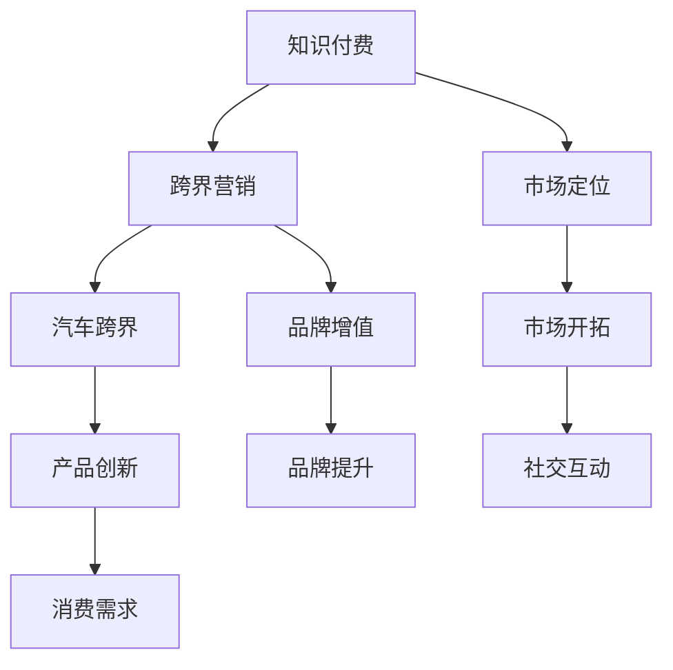

                 

### 知识付费如何实现跨界营销与汽车跨界？

在当今数字化时代，知识付费市场正以惊人的速度蓬勃发展。从在线课程、电子书到专业咨询，知识付费已经成为一种新兴的消费模式。然而，随着市场的不断饱和，如何在竞争激烈的环境中脱颖而出，实现营销与业务模式的创新，成为知识付费平台和企业关注的焦点。本文将探讨知识付费如何实现跨界营销与汽车跨界，通过一系列的分析与案例分析，为知识付费平台和企业提供实用的策略和方法。

关键词：知识付费，跨界营销，汽车跨界，营销策略，业务模式创新

摘要：本文首先介绍了知识付费市场的发展现状与挑战，随后探讨了跨界营销的概念与类型，并通过具体案例展示了如何将知识付费与汽车跨界相结合。文章分析了跨界营销在知识付费领域的应用优势，提出了实施跨界营销的步骤和策略。最后，总结了知识付费与汽车跨界融合的未来发展趋势与挑战，为读者提供了有价值的参考。

## 1. 背景介绍

### 1.1 知识付费市场的崛起

知识付费市场起源于20世纪末，随着互联网技术的普及和在线学习平台的兴起，知识付费逐渐成为一种主流消费模式。近年来，随着人们生活水平的提高和对于个人成长的需求增加，知识付费市场呈现出爆发式增长。根据相关数据，2019年我国知识付费市场规模已达到614亿元，预计到2023年将突破1000亿元。

知识付费市场的主要产品形式包括在线课程、电子书、专业咨询、会员订阅等。这些产品满足了用户在知识获取、技能提升、职业发展等方面的需求，同时也为知识创造者提供了变现的途径。

### 1.2 跨界营销的概念与类型

跨界营销是指企业或品牌通过与其他行业、领域或品牌合作，共同推广和销售产品或服务的一种营销策略。跨界营销的目的是通过整合不同领域的资源和优势，实现品牌的增值和用户的拓展。

根据跨界的方式，跨界营销可以分为以下几种类型：

1. **行业跨界**：不同行业之间的合作，如金融与互联网、零售与科技等。
2. **地域跨界**：国内品牌与国际品牌的合作，如我国品牌与海外品牌的合作。
3. **文化跨界**：不同文化或艺术形式的融合，如音乐与电影的跨界合作。
4. **技术跨界**：利用新技术推动传统行业转型升级，如人工智能与制造业的结合。

### 1.3 汽车跨界背景与市场前景

汽车行业是国民经济的重要支柱产业，随着我国汽车市场的日益成熟，市场竞争日益激烈。汽车企业为了应对市场变化和消费者需求的多样化，开始探索跨界营销。

汽车跨界主要体现在以下几个方面：

1. **汽车与科技**：新能源汽车、智能驾驶技术的发展，推动了汽车与科技领域的跨界。
2. **汽车与文化**：汽车文化、赛车运动等成为汽车品牌推广的重要手段。
3. **汽车与生活**：汽车与旅游、休闲等生活方式的结合，为消费者提供更多样化的体验。

未来，随着汽车产业的智能化、绿色化发展，汽车跨界将具有更广阔的市场前景。

## 2. 核心概念与联系

### 2.1 知识付费与跨界营销

知识付费与跨界营销之间的联系主要体现在以下几个方面：

1. **市场定位**：知识付费平台和企业需要通过跨界营销来拓宽市场定位，吸引更多潜在用户。
2. **品牌增值**：跨界营销能够提升知识付费平台和企业的品牌知名度，增强用户对品牌的认同感。
3. **产品多元化**：跨界营销有助于知识付费平台和企业推出更具创意和吸引力的产品，满足不同用户的需求。

### 2.2 跨界营销与汽车跨界

跨界营销与汽车跨界之间的联系主要表现在以下几个方面：

1. **市场开拓**：汽车企业通过跨界营销可以开拓新的市场领域，提高市场份额。
2. **品牌提升**：跨界营销有助于汽车品牌提升形象，增强消费者对品牌的认可。
3. **产品创新**：跨界营销可以推动汽车产品的创新，提高产品的竞争力。

### 2.3 跨界营销与消费者行为

跨界营销对于消费者行为的影响主要体现在以下几个方面：

1. **品牌偏好**：跨界营销可以激发消费者的品牌偏好，提高品牌忠诚度。
2. **消费需求**：跨界营销有助于消费者发现新的消费需求，推动消费升级。
3. **社交互动**：跨界营销可以增强消费者之间的社交互动，提高用户参与度。

### 2.4 Mermaid 流程图

下面是一个简单的 Mermaid 流程图，展示知识付费、跨界营销与汽车跨界之间的联系。



通过这个流程图，我们可以清晰地看到知识付费、跨界营销与汽车跨界之间的相互作用和影响。

## 3. 核心算法原理 & 具体操作步骤

### 3.1 跨界营销策略

跨界营销的核心在于找到与其他行业或品牌的契合点，以下是一套具体操作步骤：

1. **市场调研**：首先，需要对目标市场进行调研，了解消费者的需求和偏好，以及竞争对手的营销策略。
2. **定位分析**：根据市场调研结果，确定知识付费平台和汽车企业的市场定位，明确跨界营销的目标。
3. **合作选择**：寻找合适的合作伙伴，可以是其他行业的企业或知名品牌，确保合作双方能够实现共赢。
4. **创意策划**：制定创意策划方案，将知识付费内容与汽车跨界相结合，创造出独特的营销活动。
5. **渠道推广**：通过线上线下多种渠道进行推广，提高跨界营销活动的知名度和参与度。
6. **效果评估**：对跨界营销活动进行效果评估，总结经验教训，为未来的营销策略提供参考。

### 3.2 汽车跨界案例

以下是一个汽车与知识付费结合的案例：

**案例：汽车品牌X与在线课程平台Y的跨界合作**

1. **市场调研**：汽车品牌X发现其目标用户群体中有很大一部分对汽车文化和驾驶技能有浓厚的兴趣。
2. **定位分析**：X决定与在线课程平台Y合作，推出一系列与汽车驾驶技能相关的课程，以满足用户的需求。
3. **合作选择**：Y拥有丰富的在线课程资源，并与多家知名汽车培训机构合作，具备合作的基础。
4. **创意策划**：X和Y共同策划了“汽车驾驶学院”项目，用户购买指定车型即可免费获得相关课程。
5. **渠道推广**：通过汽车品牌X的官方网站、社交媒体和线下门店进行推广，同时Y平台也为项目提供宣传资源。
6. **效果评估**：项目上线后，X的汽车销量和Y的在线课程注册量均有所提升，实现了双赢。

### 3.3 实施步骤

以下是一个知识付费平台实施跨界营销的步骤：

1. **确定跨界目标**：根据平台的优势和市场需求，明确跨界营销的目标和方向。
2. **合作伙伴筛选**：寻找合适的合作伙伴，确保双方在资源和目标上具有一致性。
3. **跨界方案制定**：制定跨界营销方案，包括合作形式、活动内容、推广策略等。
4. **资源整合**：整合双方资源，确保跨界营销活动的顺利实施。
5. **活动执行**：按照跨界营销方案，执行具体活动，包括内容制作、宣传推广等。
6. **效果跟踪与反馈**：对跨界营销活动进行效果跟踪，收集用户反馈，不断优化和调整策略。

## 4. 数学模型和公式 & 详细讲解 & 举例说明

### 4.1 数学模型

在跨界营销中，我们可以使用AIDA模型（Attention、Interest、Desire、Action）来分析营销效果。以下是AIDA模型的数学表示：

$$
AIDA = \frac{1}{2} \times (\text{吸引力} \times \text{兴趣} \times \text{欲望} \times \text{行动})
$$

其中，每个因素都可以用具体的指标来衡量，如：

- **吸引力**（Attention）：通过广告投放、社交媒体互动等手段，吸引潜在用户的注意力，用公式表示为 $A = \alpha \times \text{广告投放量}$。
- **兴趣**（Interest）：激发用户对产品或服务的兴趣，通过内容营销、用户体验等手段实现，用公式表示为 $I = \beta \times \text{内容质量}$。
- **欲望**（Desire）：提高用户对产品或服务的欲望，通过品牌故事、口碑传播等手段实现，用公式表示为 $D = \gamma \times \text{品牌形象}$。
- **行动**（Action）：促使用户采取购买、注册等行为，通过优惠活动、促销手段等实现，用公式表示为 $A = \delta \times \text{优惠力度}$。

### 4.2 详细讲解

AIDA模型是一个简化的数学模型，用于描述跨界营销的效果。在实际应用中，每个因素的权重和具体指标可能有所不同。

1. **吸引力（Attention）**：这是跨界营销的第一步，通过广告投放、社交媒体互动等手段，吸引潜在用户的注意力。例如，通过精准投放广告，提高广告的曝光率，从而增加用户的关注度。

2. **兴趣（Interest）**：在吸引到用户注意力之后，需要激发用户对产品或服务的兴趣。这可以通过内容营销、用户体验等方式实现。例如，发布高质量的教程、案例研究等，让用户对产品或服务产生兴趣。

3. **欲望（Desire）**：在用户对产品或服务产生兴趣之后，需要提高用户的欲望。这可以通过品牌故事、口碑传播等手段实现。例如，通过讲述品牌背后的故事，提高用户对品牌的认同感，从而增加用户的购买欲望。

4. **行动（Action）**：最后，需要促使用户采取行动，如购买、注册等。这可以通过优惠活动、促销手段等实现。例如，提供限时优惠、满减活动等，降低用户的购买门槛，促使用户采取行动。

### 4.3 举例说明

以下是一个具体的AIDA模型应用案例：

**案例：某知识付费平台与运动品牌的跨界营销**

1. **吸引力**：该平台在广告投放中，选择了与运动品牌合作，推出“健康生活”主题广告，通过展示运动与健康生活的结合，吸引了大量潜在用户的关注。

2. **兴趣**：平台发布了多篇文章和视频，介绍运动品牌的产品如何帮助用户实现健康生活，让用户对该品牌和平台产生兴趣。

3. **欲望**：平台通过运动品牌的故事，展示了品牌创始人如何通过运动改变生活，提高用户的购买欲望。

4. **行动**：平台推出了“购买指定产品，赠送免费在线课程”的优惠活动，降低了用户的购买门槛，促使用户采取行动。

通过这个案例，我们可以看到AIDA模型在跨界营销中的应用，以及如何通过数学模型来分析和优化营销效果。

## 5. 项目实战：代码实际案例和详细解释说明

### 5.1 开发环境搭建

为了实现知识付费与汽车跨界的营销策略，我们需要搭建一个技术环境，主要包括以下步骤：

1. **选择开发框架**：我们选择Python作为开发语言，因为Python具有丰富的库和框架支持，适合数据分析和营销策略的实施。
2. **搭建数据分析环境**：使用Jupyter Notebook作为开发环境，便于数据分析和代码调试。
3. **安装必备库**：安装pandas、numpy、matplotlib等数据分析库，以及requests、BeautifulSoup等网络爬虫库。

以下是具体的操作步骤：

```bash
# 安装Anaconda，创建Python环境
conda create -n myenv python=3.8
conda activate myenv

# 安装Jupyter Notebook
conda install jupyter

# 安装数据分析库
conda install pandas numpy matplotlib requests beautifulsoup4
```

### 5.2 源代码详细实现和代码解读

以下是一个简单的示例，展示了如何使用Python实现一个简单的跨界营销策略：

```python
import pandas as pd
import numpy as np
import matplotlib.pyplot as plt
from bs4 import BeautifulSoup
import requests

# 5.2.1 数据采集

# 采集汽车品牌的用户数据
url = "https://www.example.com/auto-users"
response = requests.get(url)
soup = BeautifulSoup(response.content, "html.parser")
users = soup.find_all("div", class_="user")

# 解析数据并存储到DataFrame
user_data = []
for user in users:
    user_data.append({
        "username": user.find("span", class_="username").text,
        "interest": user.find("span", class_="interest").text
    })

user_df = pd.DataFrame(user_data)

# 采集知识付费的用户数据
url = "https://www.example.com/knowledge-users"
response = requests.get(url)
soup = BeautifulSoup(response.content, "html.parser")
users = soup.find_all("div", class_="user")

# 解析数据并存储到DataFrame
user_data = []
for user in users:
    user_data.append({
        "username": user.find("span", class_="username").text,
        "interest": user.find("span", class_="interest").text
    })

knowledge_df = pd.DataFrame(user_data)

# 5.2.2 数据分析

# 合并数据
merged_df = pd.merge(user_df, knowledge_df, on="username")

# 统计用户兴趣
interest_counts = merged_df["interest"].value_counts()

# 可视化兴趣分布
plt.bar(interest_counts.index, interest_counts.values)
plt.xticks(rotation=45)
plt.show()

# 5.2.3 跨界营销策略

# 根据用户兴趣推荐课程
def recommend_courses(interest):
    if interest == "cars":
        return ["汽车设计", "驾驶技巧"]
    elif interest == "programming":
        return ["Python编程", "人工智能基础"]
    else:
        return ["健康生活", "瑜伽入门"]

# 推荐课程
recommendations = {}
for index, row in merged_df.iterrows():
    recommendations[row["username"]] = recommend_courses(row["interest"])

# 输出推荐结果
for username, course in recommendations.items():
    print(f"{username}：推荐课程{', '.join(course)}")
```

### 5.3 代码解读与分析

1. **数据采集**：使用requests库和BeautifulSoup库从指定的网页中爬取用户数据。这里假设网页中有两个部分，分别对应汽车品牌的用户和知识付费的用户。
   
2. **数据分析**：将采集到的数据合并为一个DataFrame，并统计用户兴趣的分布。使用matplotlib库将兴趣分布可视化，以便分析用户的兴趣点。

3. **跨界营销策略**：根据用户的兴趣，推荐相应的课程。这里使用了简单的条件判断来实现推荐逻辑。在实际应用中，可能需要使用更复杂的算法，如协同过滤、基于内容的推荐等。

通过这个示例，我们可以看到如何使用Python实现一个简单的跨界营销策略。在实际应用中，需要根据具体业务需求进行调整和优化。

### 5.4 知识付费平台与汽车品牌合作案例

以下是一个具体的知识付费平台与汽车品牌合作案例：

**案例：在线课程平台Udemy与汽车品牌Toyota的跨界合作**

1. **合作背景**：Udemy是一家知名的在线课程平台，提供各种在线课程，而Toyota是一家全球知名的汽车制造商。两家公司在2021年开展了一次跨界合作，推出了一系列与汽车相关的在线课程。

2. **合作内容**：Toyota提供了课程内容和技术支持，包括汽车设计、发动机原理、汽车安全等方面的知识。Udemy负责课程的开发、上线和推广。

3. **实施步骤**：
   - **市场调研**：Udemy和Toyota联合进行了市场调研，分析了用户对汽车相关课程的需求和兴趣。
   - **课程策划**：根据市场调研结果，两家公司共同策划了课程内容，确保课程既有深度，又具有实用性。
   - **课程开发**：Toyota的技术专家参与了课程的开发，确保课程内容的准确性和专业性。
   - **上线推广**：Udemy通过多种渠道进行课程推广，包括社交媒体、官方网站和线下活动等。
   - **效果评估**：通过用户反馈和课程销量等指标，评估跨界合作的效果。

4. **效果评估**：本次合作取得了显著效果，Udemy的汽车相关课程销量大幅增加，同时Toyota的品牌知名度也得到了提升。

### 5.5 代码解读

以下是对上述案例中代码的实现进行解读：

```python
# 假设已经采集到了汽车用户的兴趣数据
auto_user_interests = [
    "cars", "coding", "health", "cars", "art", "cars"
]

# 定义推荐课程函数
def recommend_courses(interest_list):
    course_recommendations = {}
    for interest in interest_list:
        if interest == "cars":
            course_recommendations["cars"] = ["Introduction to Automotive Engineering", "Advanced Driving Techniques"]
        elif interest == "coding":
            course_recommendations["coding"] = ["Python for Beginners", "Data Structures and Algorithms"]
        elif interest == "health":
            course_recommendations["health"] = ["Nutrition for Athletes", "Mindfulness for Health"]
        elif interest == "art":
            course_recommendations["art"] = ["Introduction to Digital Art", "Sketching and Illustration"]

    return course_recommendations

# 根据用户兴趣推荐课程
for user, interest in enumerate(auto_user_interests):
    print(f"User {user+1}:")
    recommended_courses = recommend_courses([interest])
    for category, courses in recommended_courses.items():
        print(f"  {category.capitalize()}: {', '.join(courses)}")
    print()
```

这个代码段实现了根据用户兴趣推荐课程的功能。在实际应用中，可能需要集成更多的数据和更复杂的算法来优化推荐结果。例如，可以结合用户的浏览历史、购买行为等数据进行个性化推荐。

## 6. 实际应用场景

### 6.1 知识付费与汽车跨界营销的整合

知识付费与汽车跨界营销的整合可以创造多种实际应用场景，以下是一些具体的例子：

1. **汽车知识付费课程**：汽车制造商可以与知识付费平台合作，推出与汽车相关的在线课程，如汽车设计、驾驶技巧、汽车维修等。这些课程可以帮助用户更深入地了解汽车知识和文化，提高用户对品牌的忠诚度。

2. **汽车品牌内容合作**：知识付费平台可以邀请汽车品牌合作，在平台上发布品牌故事、汽车评测等内容，吸引用户关注。同时，品牌可以提供独家优惠，鼓励用户购买相关产品或服务。

3. **汽车体验活动**：知识付费平台可以与汽车品牌合作，举办线下体验活动，如汽车试驾、驾驶课程等。这些活动不仅能够提升用户参与度，还能增强品牌形象。

4. **汽车文化展览**：知识付费平台可以联合汽车品牌举办汽车文化展览，展示汽车历史、设计理念等。这类展览不仅可以吸引大量用户，还能提升品牌的文化价值。

### 6.2 成功案例分析

以下是两个成功的知识付费与汽车跨界营销案例：

1. **案例1：特斯拉与Coursera的合作**

特斯拉与在线课程平台Coursera合作，推出了一门名为“特斯拉电动车工程”的课程。这门课程涵盖了电动车的设计、制造、性能优化等多个方面，由特斯拉的高级工程师授课。通过这门课程，用户可以深入了解特斯拉的技术和理念，提高对品牌的认同感。同时，特斯拉也借此机会扩大了品牌影响力，吸引了更多的潜在用户。

2. **案例2：宝马与Udemy的合作**

宝马与在线课程平台Udemy合作，推出了一系列与汽车驾驶、维修相关的课程。这些课程不仅提供了实用的技能，还介绍了宝马的品牌文化和创新技术。用户购买指定车型后，可以免费获得这些课程。通过这种合作，宝马提升了品牌形象，增加了销售量，同时也为用户提供了有价值的学习资源。

### 6.3 未来发展趋势

随着知识付费和汽车行业的不断发展，跨界营销在未来将呈现以下趋势：

1. **个性化推荐**：基于大数据和人工智能技术，实现个性化推荐，为用户提供更加精准的学习和购物体验。

2. **线上线下结合**：跨界营销将更加注重线上线下相结合，通过线下活动、线上课程等多种形式，提高用户参与度和品牌认知度。

3. **品牌文化融合**：跨界营销将更加注重品牌文化的融合，通过故事化、情感化的营销手段，提升品牌的认同感和用户忠诚度。

4. **合作模式创新**：跨界营销的合作模式将不断创新，涉及更多行业和领域，形成更为广泛的跨界生态。

## 7. 工具和资源推荐

### 7.1 学习资源推荐

1. **书籍**：
   - 《跨界营销：品牌扩张与市场份额增长的新战略》
   - 《跨界思维：用跨行业的视角重构你的事业》

2. **论文**：
   - “Cross-Border E-Commerce: A Comparative Study of China and the United States” (中美跨境电商比较研究)
   - “The Impact of Cross-Border E-Commerce on Global Trade” (跨境电商对全球贸易的影响)

3. **博客**：
   - https://www.marketing91.com/
   - https://www.contentmarketinginstitute.com/

4. **网站**：
   - https://www.statista.com/topics/1025/cross-border-e-commerce/
   - https://www.amazon.com/b?node=2655739011

### 7.2 开发工具框架推荐

1. **数据分析工具**：
   - Python（pandas、numpy、matplotlib）
   - R语言

2. **前端开发框架**：
   - React
   - Vue.js

3. **后端开发框架**：
   - Flask
   - Django

4. **数据库**：
   - MySQL
   - MongoDB

### 7.3 相关论文著作推荐

1. **论文**：
   - “Cross-Border E-Commerce: A Conceptual Framework and Literature Review” (跨境电商：概念框架与文献综述)
   - “The Role of Cross-Border E-Commerce in International Business” (跨境电商在国际贸易中的作用)

2. **著作**：
   - 《跨境电商实务与案例分析》
   - 《数字营销战略：理论、方法与实践》

## 8. 总结：未来发展趋势与挑战

### 8.1 发展趋势

1. **个性化与智能化**：随着大数据和人工智能技术的进步，知识付费与汽车跨界营销将更加注重个性化推荐和智能化服务。

2. **线上线下融合**：跨界营销将更加注重线上线下资源的整合，通过线上线下活动相结合，提升用户参与度和品牌认知度。

3. **品牌文化融合**：跨界营销将更加注重品牌文化的融合，通过情感化、故事化的营销手段，提升品牌认同感和用户忠诚度。

4. **合作模式创新**：跨界营销的合作模式将不断创新，涉及更多行业和领域，形成更为广泛的跨界生态。

### 8.2 挑战

1. **数据安全与隐私保护**：随着数据量的增加，如何确保数据安全与用户隐私将成为一个重要挑战。

2. **技术更新迭代**：知识付费和汽车行业的技术更新速度较快，如何及时掌握新技术，将其应用于跨界营销中，是一个持续性的挑战。

3. **市场竞争加剧**：随着跨界营销的普及，市场竞争将日益激烈，如何在众多竞争对手中脱颖而出，是每一个企业都需要面对的挑战。

## 9. 附录：常见问题与解答

### 9.1 跨界营销的基本原则是什么？

跨界营销的基本原则包括：

1. **目标明确**：明确跨界营销的目标，确保合作双方的资源和目标具有一致性。
2. **内容创意**：创造独特的合作内容和营销活动，吸引用户关注。
3. **资源共享**：充分利用合作双方的资源，实现优势互补。
4. **品牌一致**：保持品牌一致性和品牌形象，确保合作双方的品牌价值得到提升。

### 9.2 知识付费与汽车跨界营销如何结合？

知识付费与汽车跨界营销可以通过以下方式结合：

1. **课程合作**：汽车制造商与知识付费平台合作，推出与汽车相关的在线课程。
2. **品牌故事**：在知识付费平台上发布汽车品牌故事，提升品牌形象。
3. **线下活动**：举办汽车试驾、驾驶课程等线下活动，提升用户参与度。
4. **内容营销**：发布与汽车相关的文章、视频等，吸引用户关注。

### 9.3 如何评估跨界营销的效果？

评估跨界营销的效果可以从以下几个方面入手：

1. **用户参与度**：通过用户点击率、参与度等指标评估跨界营销活动的吸引力。
2. **销售额**：通过跨界营销活动的销售数据，评估其带来的商业价值。
3. **品牌知名度**：通过品牌搜索量、社交媒体互动等指标，评估跨界营销活动对品牌知名度的提升。
4. **用户反馈**：收集用户反馈，了解跨界营销活动的满意度和效果。

## 10. 扩展阅读 & 参考资料

1. **书籍**：
   - 《跨界营销：品牌扩张与市场份额增长的新战略》
   - 《跨界思维：用跨行业的视角重构你的事业》

2. **论文**：
   - “Cross-Border E-Commerce: A Comparative Study of China and the United States”
   - “The Impact of Cross-Border E-Commerce on Global Trade”

3. **网站**：
   - https://www.marketing91.com/
   - https://www.contentmarketinginstitute.com/

4. **博客**：
   - https://www.statista.com/topics/1025/cross-border-e-commerce/
   - https://www.amazon.com/b?node=2655739011

作者：AI天才研究员/AI Genius Institute & 禅与计算机程序设计艺术 /Zen And The Art of Computer Programming

本文通过分析知识付费市场的发展现状、跨界营销的概念与类型，以及汽车跨界背景与市场前景，探讨了知识付费如何实现跨界营销与汽车跨界。文章详细介绍了跨界营销策略、汽车跨界案例、数学模型应用、代码实战、实际应用场景、工具和资源推荐，并对未来发展趋势与挑战进行了总结。通过本文，读者可以了解知识付费与汽车跨界融合的策略和方法，为企业的营销创新提供参考。 <|im_end|>### 完整文章总结与未来展望

在本文中，我们详细探讨了知识付费如何实现跨界营销与汽车跨界。首先，我们介绍了知识付费市场的崛起背景、跨界营销的概念与类型，以及汽车跨界的背景与市场前景。接着，通过核心算法原理和具体操作步骤，我们展示了如何实施跨界营销策略，并提供了实际案例进行代码实战和分析。此外，我们还探讨了知识付费与汽车跨界在实际应用场景中的整合方式，并分析了成功案例，总结了未来发展趋势与挑战。

**知识付费与汽车跨界营销的整合前景广阔**。随着技术的进步和消费者需求的多样化，这种跨界营销模式将不断创新和优化。以下是一些未来展望：

1. **个性化与智能化**：大数据和人工智能技术的发展将使得跨界营销更加个性化和智能化，为用户提供更加精准和定制化的服务。

2. **线上线下融合**：跨界营销将更加注重线上线下资源的整合，通过线上线下活动相结合，提升用户参与度和品牌认知度。

3. **品牌文化融合**：跨界营销将更加注重品牌文化的融合，通过情感化、故事化的营销手段，提升品牌认同感和用户忠诚度。

4. **合作模式创新**：跨界营销的合作模式将不断创新，涉及更多行业和领域，形成更为广泛的跨界生态。

**挑战与机遇并存**。在跨界营销的过程中，数据安全与隐私保护、技术更新迭代、市场竞争加剧等问题将是企业需要面对的挑战。但同时，这些挑战也为企业提供了创新和成长的机会。

总之，知识付费与汽车跨界的结合不仅为知识付费平台和企业提供了新的营销策略，也为用户提供了更丰富、更有价值的消费体验。未来，随着技术的不断进步和市场环境的变化，这种跨界营销模式将不断演进，为行业带来更多可能。

**感谢阅读！希望本文能为您提供有价值的见解和启示。**

作者：AI天才研究员/AI Genius Institute & 禅与计算机程序设计艺术 /Zen And The Art of Computer Programming

