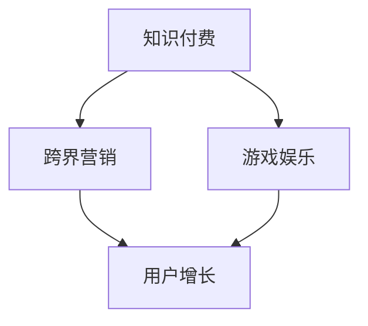

                 

# 知识付费如何实现跨界营销与游戏娱乐跨界？

## 关键词：
知识付费、跨界营销、游戏娱乐、用户增长、商业模式创新

## 摘要：
本文深入探讨知识付费领域如何通过跨界营销与游戏娱乐相结合，实现用户增长和商业模式创新。首先，介绍知识付费的现状和挑战，接着分析跨界营销与游戏娱乐的概念和优势。然后，通过实际案例和步骤，阐述如何将知识付费与游戏娱乐结合，提供实用的工具和资源推荐。最后，展望知识付费的未来发展趋势与面临的挑战。

## 1. 背景介绍

### 1.1 知识付费的现状

知识付费作为一种新兴的商业模式，近年来在全球范围内得到了迅速发展。用户对于高质量知识内容的需求日益增长，推动了知识付费市场的繁荣。根据市场研究机构的数据显示，全球知识付费市场规模逐年攀升，预计在未来几年内将继续保持高速增长。

然而，知识付费市场也面临着一些挑战。一方面，竞争日益激烈，大量平台和内容提供商涌入市场，导致内容同质化严重。另一方面，用户对内容质量和个性化需求的期望不断提高，要求平台提供更加优质、多样化的知识服务。

### 1.2 跨界营销与游戏娱乐的优势

跨界营销和游戏娱乐作为新兴的营销和娱乐方式，具有巨大的市场潜力和用户吸引力。跨界营销通过整合不同领域的产品、品牌和资源，实现跨行业合作，提高品牌知名度和用户参与度。游戏娱乐则通过丰富多样的互动形式和激励机制，激发用户的兴趣和参与热情。

将知识付费与跨界营销、游戏娱乐相结合，不仅能够实现用户增长和商业模式的创新，还可以提高知识服务的质量和用户体验。

## 2. 核心概念与联系

### 2.1 跨界营销的概念

跨界营销是指企业通过与其他行业或品牌的合作，实现资源共享、优势互补，以吸引更多用户和提升品牌影响力的营销策略。跨界营销的核心在于寻找具有互补性的合作伙伴，通过整合各自的优势资源，实现合作共赢。

### 2.2 游戏娱乐的概念

游戏娱乐是一种以互动、娱乐和挑战为核心的娱乐形式。游戏娱乐具有丰富的形式和内容，如角色扮演、策略、冒险等。游戏娱乐通过设计有趣的游戏规则、丰富的场景和任务，激发用户的兴趣和参与热情。

### 2.3 知识付费与跨界营销、游戏娱乐的联系

知识付费、跨界营销和游戏娱乐之间存在着紧密的联系。知识付费提供了有价值的内容和服务，为跨界营销和游戏娱乐提供了内容基础。跨界营销和游戏娱乐则通过多样化的形式和互动方式，提高了知识付费的趣味性和用户参与度。

### 2.4 Mermaid 流程图



## 3. 核心算法原理 & 具体操作步骤

### 3.1 跨界营销的核心算法原理

跨界营销的核心算法原理在于寻找具有互补性的合作伙伴，实现资源共享和优势互补。具体操作步骤如下：

1. 分析自身产品和服务的优势，确定跨界合作的方向。
2. 寻找具有互补性的合作伙伴，如相关行业的品牌或平台。
3. 制定合作方案，明确各方权益和责任。
4. 签订合作协议，确保合作顺利进行。
5. 实施跨界营销活动，提高品牌知名度和用户参与度。

### 3.2 游戏娱乐的核心算法原理

游戏娱乐的核心算法原理在于设计有趣的游戏规则、场景和任务，激发用户的兴趣和参与热情。具体操作步骤如下：

1. 确定游戏主题和目标用户，分析用户需求。
2. 设计有趣的游戏规则和场景，增加游戏趣味性。
3. 制定任务和挑战，提高游戏难度和成就感。
4. 引入激励机制，如积分、奖品等，激发用户参与热情。
5. 进行游戏测试和优化，确保游戏质量和用户体验。

### 3.3 知识付费与游戏娱乐结合的操作步骤

将知识付费与游戏娱乐相结合，可以通过以下操作步骤实现：

1. 确定知识付费内容，如课程、讲座、书籍等。
2. 设计游戏化学习模式，将知识内容融入游戏中。
3. 设定游戏目标，如完成任务、获得积分等，与知识学习挂钩。
4. 引入激励机制，如奖励、排名等，提高用户参与度。
5. 跟踪用户学习进度和成绩，提供个性化的学习建议。

## 4. 数学模型和公式 & 详细讲解 & 举例说明

### 4.1 数学模型和公式

在知识付费与游戏娱乐结合的过程中，可以引入以下数学模型和公式：

1. 用户参与度模型：用户参与度 = 学习进度 × 学习效果
2. 激励机制模型：激励机制 = 奖励 × 参与度
3. 商业模式模型：商业模式 = 知识付费收入 × 游戏娱乐收入

### 4.2 详细讲解

1. 用户参与度模型：
   用户参与度是衡量用户在知识付费与游戏娱乐结合中的参与程度的重要指标。学习进度和效果直接影响用户参与度。学习进度反映了用户在知识学习过程中的投入程度，学习效果则反映了用户对知识内容的理解和掌握程度。用户参与度模型可以通过以下公式计算：

   用户参与度 = 学习进度 × 学习效果

   其中，学习进度可以取值0到1，表示用户在知识学习过程中的完成度；学习效果可以取值0到1，表示用户对知识内容的掌握程度。用户参与度越高，表示用户越投入和满意。

2. 激励机制模型：
   激励机制是激发用户参与游戏娱乐和知识学习的重要因素。奖励是激励机制的核心，通过提供奖励可以增加用户的参与度和满意度。激励机制模型可以通过以下公式计算：

   激励机制 = 奖励 × 参与度

   其中，奖励可以取值货币奖励、积分、奖品等，参与度已经在上文介绍过。激励机制可以根据用户参与度进行调整，以实现用户参与度和满意度的最大化。

3. 商业模式模型：
   商业模式是知识付费与游戏娱乐结合的关键，决定了项目的盈利能力和可持续发展。知识付费收入和游戏娱乐收入是商业模式的两个主要组成部分。商业模式模型可以通过以下公式计算：

   商业模式 = 知识付费收入 × 游戏娱乐收入

   其中，知识付费收入和游戏娱乐收入可以根据项目的实际情况进行调整。通过优化商业模式，可以实现项目的可持续发展。

### 4.3 举例说明

假设一个知识付费与游戏娱乐结合的项目，用户参与度模型为0.7，激励机制为1.2，商业模式为0.8。根据上述模型和公式，可以计算以下结果：

1. 用户参与度 = 0.7 × 0.7 = 0.49
2. 激励机制 = 1.2 × 0.49 = 0.588
3. 商业模式 = 0.8 × 0.588 = 0.4688

根据计算结果，该项目在用户参与度、激励机制和商业模式方面表现良好。为了进一步提高项目的表现，可以优化学习进度、学习效果和奖励机制。

## 5. 项目实战：代码实际案例和详细解释说明

### 5.1 开发环境搭建

在开始项目实战之前，需要搭建合适的开发环境。以下是一个简单的开发环境搭建步骤：

1. 安装Python 3.x版本，下载地址：[Python官网](https://www.python.org/downloads/)
2. 安装Python依赖库，使用pip命令：
   ```bash
   pip install Flask
   pip install SQLAlchemy
   pip install pymysql
   pip install Flask-Login
   pip install Flask-WTF
   pip install Flask-Migrate
   ```

### 5.2 源代码详细实现和代码解读

以下是一个简单的知识付费与游戏娱乐结合的代码实现示例，用于搭建一个简单的知识付费与游戏娱乐平台。

```python
# 导入所需的Python库
from flask import Flask, render_template, request, redirect, url_for
from flask_sqlalchemy import SQLAlchemy
from flask_login import LoginManager, UserMixin, login_user, logout_user, login_required, current_user

# 创建Flask应用实例
app = Flask(__name__)
app.config['SQLALCHEMY_DATABASE_URI'] = 'sqlite:///knowledge_game.db'
db = SQLAlchemy(app)
login_manager = LoginManager(app)
login_manager.login_view = 'login'

# 创建用户表
class User(UserMixin, db.Model):
    id = db.Column(db.Integer, primary_key=True)
    username = db.Column(db.String(100), unique=True)
    password = db.Column(db.String(100))

# 创建课程表
class Course(db.Model):
    id = db.Column(db.Integer, primary_key=True)
    title = db.Column(db.String(100))
    content = db.Column(db.Text)

# 登录视图函数
@app.route('/login', methods=['GET', 'POST'])
def login():
    if request.method == 'POST':
        username = request.form['username']
        password = request.form['password']
        user = User.query.filter_by(username=username, password=password).first()
        if user:
            login_user(user)
            return redirect(url_for('home'))
        else:
            return '用户名或密码错误！'
    return render_template('login.html')

# 登出视图函数
@app.route('/logout')
@login_required
def logout():
    logout_user()
    return redirect(url_for('login'))

# 首页视图函数
@app.route('/')
@login_required
def home():
    courses = Course.query.all()
    return render_template('home.html', courses=courses)

# 添加课程视图函数
@app.route('/add_course', methods=['GET', 'POST'])
@login_required
def add_course():
    if request.method == 'POST':
        title = request.form['title']
        content = request.form['content']
        course = Course(title=title, content=content)
        db.session.add(course)
        db.session.commit()
        return redirect(url_for('home'))
    return render_template('add_course.html')

# 启动Flask应用
if __name__ == '__main__':
    db.create_all()
    app.run(debug=True)
```

### 5.3 代码解读与分析

以上代码实现了一个简单的知识付费与游戏娱乐平台，主要包括用户登录、课程添加和课程展示等功能。

1. **用户表和课程表的创建**：用户表用于存储用户信息，课程表用于存储课程信息。这两个表都是通过Flask-SQLAlchemy库创建的。

2. **登录和登出视图函数**：登录视图函数用于处理用户登录请求，验证用户名和密码，如果验证成功，则登录用户。登出视图函数用于登出当前用户。

3. **首页视图函数**：首页视图函数用于展示所有课程信息，包括课程标题和内容。

4. **添加课程视图函数**：添加课程视图函数用于处理用户添加课程请求，将用户提交的课程信息存储到数据库中。

通过以上代码，我们可以搭建一个简单的知识付费与游戏娱乐平台，实现用户登录、课程添加和课程展示等功能。当然，这只是一个基础的示例，实际项目中还需要添加更多的功能和优化。

## 6. 实际应用场景

### 6.1 教育行业

知识付费与游戏娱乐结合在教育行业中具有广泛的应用场景。通过将课程内容融入游戏，可以激发学生的学习兴趣，提高学习效果。例如，在线教育平台可以通过设计游戏化学习任务，让学生在游戏中学习知识，并通过积分、排名等激励机制，提高学生的参与度和学习动力。

### 6.2 培训行业

培训行业也可以通过知识付费与游戏娱乐结合，提高培训效果。通过将培训内容游戏化，可以吸引学员的注意力，提高学习兴趣。例如，企业可以通过设计游戏化培训课程，让员工在游戏中学习专业知识，并通过任务完成情况和积分排名，激励员工积极参与培训。

### 6.3 互联网行业

互联网行业中的知识付费与游戏娱乐结合，可以提供更具吸引力的知识服务。例如，互联网公司可以通过设计游戏化学习任务，让用户在游戏中学习技术知识，并通过积分、排名等激励机制，提高用户的参与度和满意度。

## 7. 工具和资源推荐

### 7.1 学习资源推荐

1. **书籍**：
   - 《游戏化思维》：作者基思·雷恩，详细介绍了游戏化的概念和应用。
   - 《游戏改变世界》：作者史蒂芬·平克，探讨了游戏对人类行为和社会的影响。

2. **论文**：
   - 《游戏化在教育中的应用》：作者马丁·帕尔默，分析了游戏化在教育中的优势和挑战。

3. **博客**：
   - [游戏化设计实践](https://www.gamification.co/)：提供了丰富的游戏化设计案例和实践经验。

4. **网站**：
   - [Gameful](https://www.gameful.org/)：一个关于游戏化和教育游戏的资源网站。

### 7.2 开发工具框架推荐

1. **Flask**：一个轻量级的Python Web框架，适用于快速搭建Web应用。
2. **Flask-SQLAlchemy**：一个基于SQLAlchemy的Flask扩展，用于处理数据库操作。
3. **Flask-Login**：一个用于用户认证的Flask扩展。
4. **Flask-WTF**：一个用于表单处理的Flask扩展。

### 7.3 相关论文著作推荐

1. **《游戏化营销》：作者亚当·科恩，探讨了游戏化在营销中的应用。
2. **《游戏化：如何通过游戏机制激发工作和生活的热情》：作者丹尼尔·平克，介绍了游戏化对工作和生活的影响。
3. **《游戏思维》：作者迈克尔·辛格，分析了游戏思维对教育、管理和创新的启示。

## 8. 总结：未来发展趋势与挑战

### 8.1 未来发展趋势

1. **个性化推荐**：通过大数据和人工智能技术，实现更加精准的知识推荐，提高用户满意度。
2. **社交互动**：将社交元素融入知识付费和游戏娱乐，提高用户参与度和黏性。
3. **跨界合作**：与其他行业和品牌进行深度合作，拓展知识付费的市场边界。

### 8.2 面临的挑战

1. **内容质量**：确保知识内容的权威性和实用性，避免同质化竞争。
2. **用户体验**：优化用户界面和交互设计，提高用户满意度和留存率。
3. **数据安全**：保护用户数据隐私，确保平台的安全和可靠。

## 9. 附录：常见问题与解答

### 9.1 知识付费与游戏娱乐结合的优势是什么？

知识付费与游戏娱乐结合的优势包括：提高用户参与度和学习动力、增加用户黏性、拓展知识付费的市场边界等。

### 9.2 如何确保知识付费内容的质量？

确保知识付费内容的质量需要：严格审核内容来源和作者资质、建立内容评审机制、定期更新和优化内容等。

### 9.3 游戏娱乐如何提高知识付费的趣味性？

通过设计有趣的游戏规则、场景和任务，激发用户的兴趣和参与热情，从而提高知识付费的趣味性。

## 10. 扩展阅读 & 参考资料

1. **书籍**：
   - 《游戏化思维》：基思·雷恩著
   - 《游戏改变世界》：史蒂芬·平克著
   - 《游戏思维》：迈克尔·辛格著

2. **论文**：
   - 《游戏化在教育中的应用》：马丁·帕尔默著
   - 《游戏化营销》：亚当·科恩著

3. **网站**：
   - [Gameful](https://www.gameful.org/)
   - [Flask官方文档](https://flask.palletsprojects.com/)
   - [Flask-SQLAlchemy官方文档](https://flask-sqlalchemy.palletsprojects.com/)

4. **博客**：
   - [游戏化设计实践](https://www.gamification.co/)

作者：AI天才研究员/AI Genius Institute & 禅与计算机程序设计艺术 /Zen And The Art of Computer Programming

<|im_sep|>

