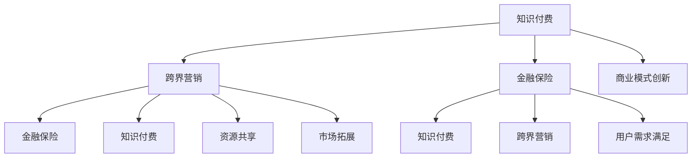

                 

### 背景介绍

#### 知识付费的定义与现状

知识付费，简单来说，是指用户为了获取特定知识或信息而愿意付费的行为。随着互联网技术的迅猛发展，尤其是在移动互联网普及的今天，知识付费已经成为了许多用户获取知识的重要渠道。从在线课程、电子书、专业知识咨询，到直播授课、一对一辅导等，知识付费的形式越来越丰富。

目前，知识付费市场呈现出高速发展的态势。据相关数据显示，2019年中国知识付费市场规模已经达到了230亿元，预计到2023年这一数字将突破1000亿元。这一增长速度不仅反映了用户对知识的渴求，也反映了知识付费在当今社会的重要地位。

知识付费平台如分答、知乎Live、得到、喜马拉雅等，都在这一领域占据了重要位置。它们通过提供专业内容、优质服务，吸引了大量用户，形成了良好的用户粘性。同时，传统教育机构和内容创作者也开始积极布局知识付费，试图通过这一渠道实现商业变现。

然而，尽管知识付费市场前景广阔，但也存在一些挑战。例如，内容质量参差不齐，用户信任度不高，市场竞争激烈等。这些问题需要我们深入探讨和解决。

#### 跨界营销的定义与重要性

跨界营销，指的是企业或品牌通过跨越传统行业界限，与其他行业或领域的企业或品牌合作，以实现资源共享、优势互补、市场拓展等目的的营销策略。随着市场环境的不断变化和消费者需求的多变，跨界营销已经成为了企业提升品牌影响力、扩大市场份额的重要手段。

跨界营销的重要性体现在以下几个方面：

1. **创新性**：跨界营销能够为企业带来全新的创意和灵感，通过与其他行业的结合，创造出新的产品形态或服务模式，满足消费者的多样化需求。

2. **品牌传播**：跨界营销能够借助其他领域的品牌影响力，快速扩大自身品牌的知名度，提高市场占有率。

3. **用户粘性**：通过跨界合作，企业可以吸引到更多不同领域的用户，增加用户的忠诚度和粘性。

4. **市场拓展**：跨界营销能够帮助企业进入新的市场领域，实现市场的多元化和国际化。

5. **风险分散**：跨界营销可以帮助企业分散单一市场带来的风险，提高企业的抗风险能力。

#### 金融保险的定义与现状

金融保险，是指金融业与保险业的结合，通过提供金融产品和服务来满足用户的风险保障和财富管理需求。金融保险业是现代经济体系中的重要组成部分，对国家经济发展和社会稳定具有重要作用。

目前，金融保险行业正面临着数字化转型和跨界融合的挑战。一方面，随着互联网技术的快速发展，金融保险业务逐渐向线上迁移，线上金融保险服务越来越受到用户的青睐。另一方面，金融保险企业也在积极探索与其他行业的跨界合作，以提供更加多样化的产品和服务。

金融保险行业的现状表现为：

1. **市场规模扩大**：随着经济的发展和居民财富的积累，金融保险市场规模不断扩大。

2. **产品创新**：金融保险企业不断推出新的产品和服务，以满足不同用户群体的需求。

3. **技术驱动**：金融保险企业积极应用大数据、人工智能等技术，提升服务质量和效率。

4. **监管加强**：随着金融保险市场的不断发展，监管机构对金融保险行业的监管力度也在不断加强。

5. **跨界合作**：金融保险企业与互联网企业、科技企业等积极开展跨界合作，推动行业的创新和发展。

综上所述，知识付费、跨界营销和金融保险这三个领域都在快速发展，并且相互之间存在着紧密的联系。在接下来的内容中，我们将深入探讨知识付费如何实现跨界营销与金融保险的跨界，以及如何通过这三个领域的结合来实现商业成功。

#### 跨界营销与知识付费的结合

跨界营销与知识付费的结合，是一种创新且有效的商业模式，旨在通过不同领域的合作，共同拓展市场和提升品牌影响力。以下是一些典型的案例，以及它们如何实现跨界营销与知识付费的结合：

**案例1：知乎Live与金融机构的合作**

知乎Live是一个知识分享平台，提供各种主题的在线直播课程。知乎Live与金融机构合作，推出了理财课程、保险知识普及课程等，吸引了大量对金融知识有需求的用户。通过这种合作，知乎Live不仅能够提供高质量的内容，还能通过金融机构的专业知识提升用户体验。同时，金融机构也能够借助知乎Live的平台扩大品牌影响力，吸引潜在客户。

**案例2：喜马拉雅与金融保险平台的合作**

喜马拉雅是一个音频分享平台，拥有大量的音频内容创作者和用户。与金融保险平台合作，喜马拉雅推出了保险知识音频课程、投资理财指南等，通过喜马拉雅的庞大用户群体，迅速提升了金融保险产品的影响力。此外，喜马拉雅还利用大数据分析用户偏好，为用户提供个性化的金融保险推荐，提高了用户体验和转化率。

**案例3：得到与专业咨询公司的合作**

得到是一个提供高质量知识内容的平台，与专业咨询公司合作，推出了商业咨询、个人发展等课程。这种合作不仅为用户提供深度专业的内容，还通过咨询公司的实战经验，提升课程的价值。用户在支付费用后，不仅能够获得知识，还能够获得实际操作的建议，从而更好地实现知识的转化和应用。

**案例4：分答与医疗机构的知识付费合作**

分答是一个问答平台，与医疗机构合作，推出了医疗知识问答服务。用户可以在平台上付费咨询医生，获取专业的医疗建议。这种合作不仅为医疗机构提供了一个新的收入来源，还能够通过分答的用户基础，提升医疗机构的影响力和公信力。

这些案例展示了跨界营销与知识付费如何通过合作实现共赢。以下是一些关键的结合策略：

1. **内容共创**：平台和合作伙伴共同创造高质量的知识内容，提升用户粘性。
2. **资源共享**：利用双方的用户资源和市场渠道，实现市场拓展和品牌传播。
3. **技术融合**：通过技术手段，如大数据分析、人工智能等，提升用户体验和服务质量。
4. **品牌联合**：通过品牌联合，提升双方的知名度，实现品牌溢价。

总之，跨界营销与知识付费的结合，不仅能够为用户提供更丰富、更有价值的内容，还能够为企业带来新的商业模式和商业机会。在接下来的内容中，我们将进一步探讨如何通过金融保险与知识付费的结合，实现跨界发展。

#### 金融保险与知识付费的结合

金融保险与知识付费的结合，为用户提供了一种全新的金融服务模式，也为金融机构带来了新的业务增长点。以下是一些具体的结合策略和案例：

**策略1：定制化金融知识服务**

金融机构可以与知识付费平台合作，提供定制化的金融知识服务。例如，银行可以与得到平台合作，推出金融素养提升课程，帮助用户更好地理解金融市场、理财产品等。通过这些课程，用户不仅能够增加金融知识，还能够根据自己的需求选择合适的理财产品，从而提高用户的理财能力和满意度。

**案例1：银行与知识付费平台合作**

某大型商业银行与知识付费平台“得到”合作，推出了“金融素养提升计划”。这个计划包括一系列金融知识课程，如投资理财基础、保险知识普及、信用卡使用技巧等。用户可以通过购买课程，获得系统的金融知识教育。同时，银行还提供了一些优惠措施，如免费金融咨询服务、专属理财产品推荐等，鼓励用户积极参与课程学习。

**策略2：风险管理知识付费**

金融保险企业可以提供风险管理相关的知识付费服务，帮助用户了解风险管理的原理和方法，提升个人的风险管理能力。例如，保险公司可以与分答平台合作，推出风险管理问答服务，用户可以通过付费问答，获得专业的风险管理建议。

**案例2：保险公司与问答平台合作**

某保险公司与问答平台“分答”合作，推出了“风险管理问答”服务。用户在平台上付费提问，保险公司聘请专业风险管理师回答问题。这种服务不仅为保险公司带来了额外的收入来源，还帮助用户更好地理解和应对各种风险，提高了用户对保险产品的认知和购买意愿。

**策略3：理财规划知识付费**

金融机构可以为用户提供个性化的理财规划服务，通过知识付费的形式，帮助用户制定适合自己的理财计划。例如，理财公司可以与喜马拉雅平台合作，推出理财规划课程，用户通过学习这些课程，能够更好地掌握理财技巧，提高自身的理财能力。

**案例3：理财公司与音频平台合作**

某知名理财公司与音频平台“喜马拉雅”合作，推出了一系列理财规划课程。这些课程包括个人理财入门、资产配置策略、投资组合管理等。用户可以通过购买课程，获得专业的理财指导。同时，理财公司还提供一对一的理财咨询服务，帮助用户解决实际问题。

**策略4：保险知识付费**

保险企业可以通过知识付费的形式，提供专业的保险知识普及服务，帮助用户更好地理解保险产品，提高用户的保险意识和购买意愿。例如，保险公司可以在自己的官网上设立知识付费专栏，提供各种保险知识的文章、视频和课程。

**案例4：保险公司官网的知识付费专栏**

某保险公司在其官网设立了一个知识付费专栏，内容包括保险基础知识、保险产品介绍、理赔流程解读等。用户可以通过付费订阅，获取这些专业内容。同时，保险公司还通过这些内容，引导用户了解和购买保险产品，提高了保险销售的转化率。

总之，金融保险与知识付费的结合，不仅为用户提供了丰富的金融知识和专业的理财服务，还为金融机构创造了新的业务模式和收入来源。通过定制化金融知识服务、风险管理知识付费、理财规划知识付费和保险知识付费等多种方式，金融保险企业能够更好地满足用户的需求，提升用户的满意度和忠诚度。

### 核心概念与联系

在探讨知识付费如何实现跨界营销与金融保险跨界之前，我们需要明确一些核心概念，并了解它们之间的联系。以下是一些关键概念及其相互关系：

#### 知识付费

知识付费是指用户为了获取特定知识或信息而愿意付费的行为。这通常涉及在线课程、电子书、专业咨询、直播授课等多种形式。知识付费的核心在于提供有价值的内容，满足用户的学习和成长需求。

#### 跨界营销

跨界营销是企业或品牌通过跨越传统行业界限，与其他行业或领域的企业或品牌合作，以实现资源共享、优势互补、市场拓展等目的的营销策略。跨界营销的关键在于创新性和协同效应，通过不同领域的合作，创造出新的市场机会。

#### 金融保险

金融保险是指金融业与保险业的结合，通过提供金融产品和服务来满足用户的风险保障和财富管理需求。金融保险的核心在于风险管理和财富增值，通过保险产品和服务，帮助用户降低风险、保障生活和财富。

#### 三者之间的联系

知识付费、跨界营销和金融保险之间的联系主要体现在以下几个方面：

1. **资源共享**：知识付费平台、金融机构和企业可以通过合作，共享用户资源、市场渠道和专业知识，提升整体竞争力。
2. **用户需求满足**：通过跨界营销，知识付费平台可以吸引更多金融保险领域的用户，而金融机构则可以通过知识付费提供更多的金融教育服务，满足用户的多样化需求。
3. **商业模式创新**：知识付费与金融保险的结合，可以创造出新的商业模式，如定制化金融知识服务、风险管理知识付费等，为企业提供新的收入来源。
4. **市场拓展**：跨界营销可以帮助金融保险企业进入新的市场领域，通过知识付费的形式，提升市场渗透率和用户覆盖率。

为了更好地理解这些概念和联系，我们使用Mermaid流程图（没有特殊字符的版本）来展示它们之间的互动关系：



在这个流程图中，A、B和C分别代表知识付费、跨界营销和金融保险，它们之间的箭头表示它们之间的互动和联系。通过这种展示方式，我们可以更直观地理解这三者之间的相互作用和整体关系。

### 核心算法原理 & 具体操作步骤

在理解了知识付费、跨界营销和金融保险的基本概念和联系之后，我们接下来将探讨如何通过具体算法和操作步骤，实现这三个领域的跨界整合。这里，我们将介绍一种基于用户行为分析和数据挖掘的方法，以及其实施步骤。

#### 算法原理

核心算法原理是基于用户行为分析（User Behavior Analysis）和数据挖掘（Data Mining），通过收集和分析用户在知识付费、跨界营销和金融保险平台上的行为数据，识别用户的兴趣、需求和风险偏好，从而提供个性化的服务和推荐。

1. **用户行为数据收集**：收集用户在各个平台上的活动数据，如浏览记录、购买行为、互动评论等。
2. **特征工程**：对收集的数据进行预处理，提取关键特征，如用户年龄、性别、职业、地域、消费习惯等。
3. **行为模式识别**：利用机器学习算法，如聚类分析（Clustering Analysis）、关联规则挖掘（Association Rule Learning）等，识别用户的行为模式和偏好。
4. **推荐系统**：基于用户的行为模式，构建推荐系统，为用户提供个性化的内容和服务推荐。

#### 具体操作步骤

以下为具体操作步骤：

1. **数据收集**

   首先，我们需要从知识付费、跨界营销和金融保险平台收集用户行为数据。这些数据可以从平台的用户数据库中获取，包括用户的浏览记录、购买记录、评价、问答互动等。为了确保数据的准确性和完整性，需要对数据进行清洗和去重处理。

2. **特征工程**

   在收集到数据之后，需要对数据进行预处理，提取关键特征。这些特征可以是用户的基本信息（如年龄、性别、职业等），也可以是用户的行为数据（如浏览时长、购买频率、评论情感等）。通过特征工程，我们可以将原始数据转化为适合建模的格式。

3. **行为模式识别**

   利用机器学习算法，如聚类分析，可以将用户分为不同的群体，识别用户的行为模式。例如，通过K-Means聚类算法，可以将用户分为“高消费群体”、“低消费群体”、“知识爱好者”等。通过这些群体，我们可以更好地理解用户的需求和行为特征。

   同时，还可以使用关联规则挖掘算法（如Apriori算法），分析用户行为之间的关联性。例如，发现“购买保险的用户通常也会购买理财产品”这样的关联规则，为推荐系统的构建提供依据。

4. **推荐系统构建**

   在识别了用户的行为模式之后，可以构建推荐系统，为用户提供个性化的内容和服务推荐。推荐系统可以采用基于内容的推荐（Content-Based Filtering）和协同过滤（Collaborative Filtering）等技术。基于内容的推荐可以根据用户的历史行为和偏好，推荐相似的内容；协同过滤则通过分析用户之间的相似性，推荐其他用户喜欢的内容。

5. **个性化服务与营销**

   根据推荐系统的结果，可以为用户提供个性化的金融知识和保险产品推荐。例如，针对“高消费群体”，可以推荐高端理财产品和高端保险服务；针对“知识爱好者”，可以推荐专业的金融知识课程和最新的行业动态。

6. **评估与优化**

   最后，需要不断评估推荐系统的效果，并根据用户反馈和实际效果进行优化。可以通过A/B测试、转化率分析等方法，评估推荐系统的效果，并调整推荐策略。

通过上述算法原理和操作步骤，我们可以实现知识付费、跨界营销和金融保险的跨界整合，提供个性化的服务和推荐，提升用户的满意度和忠诚度。

### 数学模型和公式 & 详细讲解 & 举例说明

在实现知识付费、跨界营销和金融保险的跨界整合过程中，数学模型和公式起到了关键作用。以下我们将详细讲解其中的几个重要数学模型，并举例说明其应用。

#### 1. 用户行为概率模型

用户行为概率模型用于预测用户在各个平台上的行为概率，例如，用户购买某课程的概率、参与某次跨界营销活动的概率等。这个模型基于贝叶斯定理（Bayes' Theorem）构建。

贝叶斯定理公式如下：

$$ P(A|B) = \frac{P(B|A) \cdot P(A)}{P(B)} $$

其中，$P(A|B)$表示在事件B发生的条件下，事件A发生的概率；$P(B|A)$表示在事件A发生的条件下，事件B发生的概率；$P(A)$和$P(B)$分别表示事件A和事件B发生的概率。

**举例说明：**

假设我们知道某用户在过去的30天内浏览了10次理财课程，购买了3次理财产品。现在我们要预测该用户在接下来的7天内购买理财产品的概率。

我们可以设定：

- $A$：用户购买理财产品的行为
- $B$：用户浏览理财课程的行为

根据贝叶斯定理，我们需要计算$P(A|B)$。首先，我们假设：

- $P(B|A) = 0.7$，即用户购买理财产品时，浏览理财课程的概率为70%
- $P(A) = 0.4$，即用户购买理财产品的总体概率为40%
- $P(B) = 0.6$，即用户浏览理财课程的总体概率为60%

代入贝叶斯定理公式，我们可以得到：

$$ P(A|B) = \frac{0.7 \cdot 0.4}{0.6} = \frac{0.28}{0.6} = 0.467 $$

即该用户在接下来的7天内购买理财产品的概率为46.7%。

#### 2. 风险评估模型

风险评估模型用于评估用户的金融风险，从而为用户提供个性化的风险管理和保险产品推荐。常见的方法包括逻辑回归（Logistic Regression）和决策树（Decision Tree）。

逻辑回归模型公式如下：

$$ P(Y=1) = \frac{1}{1 + e^{-(\beta_0 + \beta_1 X_1 + \beta_2 X_2 + \ldots + \beta_n X_n)}} $$

其中，$Y$表示风险是否发生（1表示发生，0表示未发生）；$X_1, X_2, \ldots, X_n$表示影响风险的变量；$\beta_0, \beta_1, \beta_2, \ldots, \beta_n$是模型的参数。

**举例说明：**

假设我们有一个风险评估模型，其中用户年龄（$X_1$）和收入水平（$X_2$）是影响风险的主要因素。模型参数如下：

- $\beta_0 = -2$
- $\beta_1 = 0.1$
- $\beta_2 = 0.3$

现在我们要预测一个年龄为30岁，年收入为10万元的用户的金融风险。

代入公式，我们可以得到：

$$ P(Y=1) = \frac{1}{1 + e^{(-2 + 0.1 \cdot 30 + 0.3 \cdot 100000)}} = \frac{1}{1 + e^{-2 + 3 + 3000}} = \frac{1}{1 + e^{-2999}} \approx 1 $$

这意味着该用户发生金融风险的概率非常高。

#### 3. 个性化推荐模型

个性化推荐模型用于为用户提供个性化的金融知识和保险产品推荐。常见的方法包括基于内容的推荐和协同过滤。

基于内容的推荐模型公式如下：

$$ \text{推荐得分} = \text{内容特征} \cdot \text{用户特征} $$

其中，内容特征和用户特征分别表示推荐内容和用户偏好的特征向量。

**举例说明：**

假设我们有一个基于内容的推荐模型，其中课程内容和用户偏好的特征向量如下：

- 课程内容特征（$X$）: [0.2, 0.3, 0.1, 0.4]
- 用户特征（$Y$）: [0.3, 0.2, 0.4, 0.5]

代入公式，我们可以得到：

$$ \text{推荐得分} = [0.2, 0.3, 0.1, 0.4] \cdot [0.3, 0.2, 0.4, 0.5] = 0.06 + 0.06 + 0.04 + 0.2 = 0.36 $$

这意味着该课程对用户的推荐度较高。

通过上述数学模型和公式的应用，我们可以更好地实现知识付费、跨界营销和金融保险的跨界整合，为用户提供个性化的服务和推荐。

### 项目实战：代码实际案例和详细解释说明

为了更好地理解知识付费、跨界营销和金融保险结合的实战应用，我们将通过一个具体的代码案例来进行演示。在这个案例中，我们将使用Python编程语言，结合机器学习库（如scikit-learn）和推荐系统库（如Surprise），实现一个基于用户行为数据分析的个性化推荐系统。

#### 开发环境搭建

首先，我们需要搭建一个合适的开发环境。以下是所需的软件和工具：

1. **Python 3.x**：Python是最常用的编程语言之一，具有丰富的机器学习和数据分析库。
2. **Jupyter Notebook**：Jupyter Notebook是一个交互式计算环境，方便编写和运行代码。
3. **scikit-learn**：scikit-learn是一个强大的机器学习库，提供了多种机器学习算法。
4. **Surprise**：Surprise是一个开源的推荐系统库，支持多种推荐算法。

确保你已经安装了上述软件和工具，然后打开Jupyter Notebook，开始编写代码。

#### 源代码详细实现和代码解读

以下是一个完整的代码实现，我们将逐步解读每个部分的含义。

```python
# 导入必要的库
import pandas as pd
from sklearn.model_selection import train_test_split
from sklearn.preprocessing import StandardScaler
from surprise import SVD, Dataset, Reader
from surprise.model_selection import cross_validate

# 加载数据
data = pd.read_csv('user_behavior_data.csv')
data.head()

# 数据预处理
# 将用户ID、课程ID转换为整数编码
data['user_id'] = data['user_id'].astype('int')
data['course_id'] = data['course_id'].astype('int')

# 划分训练集和测试集
train_data, test_data = train_test_split(data, test_size=0.2, random_state=42)

# 特征缩放
scaler = StandardScaler()
train_data[['duration', 'rating']] = scaler.fit_transform(train_data[['duration', 'rating']])
test_data[['duration', 'rating']] = scaler.transform(test_data[['duration', 'rating']])

# 构建推荐数据集
reader = Reader(rating_scale=(1, 5))
train_dataset = Dataset.load_from_df(train_data[['user_id', 'course_id', 'rating']], reader)
test_dataset = Dataset.load_from_df(test_data[['user_id', 'course_id', 'rating']], reader)

# 使用SVD算法训练模型
svd = SVD()
svd.fit(train_dataset)

# 评估模型
train_pred = svd.test(train_dataset)
test_pred = svd.test(test_dataset)

# 打印评估结果
print("训练集MSE:", train_pred.mse)
print("测试集MSE:", test_pred.mse)

# 生成个性化推荐列表
def get_recommendations(user_id, n=5):
    # 获取用户对课程的所有评分
    user_courses = train_dataset.get_ua(user_id)
    # 计算未评分的课程
    unrated_courses = [course for course in train_dataset.trainset.courses.keys() if (user_id, course) not in user_courses]
    # 为未评分的课程生成预测评分
    pred_scores = [svd.predict(user_id, course).est for course in unrated_courses]
    # 排序并返回前n个推荐
    sorted_courses = sorted(zip(unrated_courses, pred_scores), key=lambda x: x[1], reverse=True)
    return sorted_courses[:n]

# 为特定用户生成推荐列表
user_id = 1
recommendations = get_recommendations(user_id)
print("用户{}的个性化推荐列表：".format(user_id))
for course, score in recommendations:
    print("课程ID: {}, 预测评分: {:.2f}".format(course, score))
```

#### 代码解读与分析

1. **导入库**：我们首先导入所需的库，包括pandas（数据处理）、scikit-learn（特征工程和模型评估）、Surprise（推荐系统）等。

2. **加载数据**：使用pandas读取用户行为数据。该数据应包含用户ID、课程ID、持续时间、评分等字段。

3. **数据预处理**：将用户ID和课程ID转换为整数编码，便于模型处理。然后，使用StandardScaler对持续时间和评分进行缩放，以提高模型的性能。

4. **划分训练集和测试集**：使用train_test_split函数将数据集划分为训练集和测试集，用于训练和评估模型。

5. **构建推荐数据集**：创建Reader对象，用于读取和解析评分数据。然后，使用load_from_df函数构建训练数据和测试数据集。

6. **使用SVD算法训练模型**：SVD（奇异值分解）是一种常用的推荐系统算法，可以用于训练模型。我们创建SVD对象并fit到训练数据集上。

7. **评估模型**：使用test函数对训练数据和测试数据进行评估，并打印MSE（均方误差）。

8. **生成个性化推荐列表**：定义get_recommendations函数，用于为特定用户生成个性化推荐列表。该函数首先获取用户已评分的课程，然后计算未评分的课程，并使用SVD模型预测这些未评分课程的评分。

9. **为特定用户生成推荐列表**：调用get_recommendations函数，为特定用户生成推荐列表，并打印结果。

通过这个代码案例，我们可以看到如何实现一个基于用户行为数据分析的个性化推荐系统。这个系统可以用于知识付费平台，为用户推荐他们可能感兴趣的课程，从而提升用户满意度和粘性。

### 实际应用场景

在了解了知识付费、跨界营销和金融保险结合的理论和实践后，接下来我们来看一些具体的实际应用场景，这些场景展示了如何通过这三个领域的结合实现商业成功。

#### 场景1：金融知识付费与保险服务的结合

某大型保险公司与知名金融知识付费平台合作，推出了“金融保险知识包”服务。用户可以通过购买这个知识包，获得一系列关于金融基础、保险常识、风险管理等方面的课程。这些课程由专业金融专家和保险顾问共同开发，内容涵盖从基础金融知识到高级风险管理策略。用户在学习过程中，不仅能提升金融素养，还能根据课程内容选择适合自己的保险产品。

这种结合模式不仅帮助保险公司扩大了用户基础，提高了保险产品的销售量，还通过提供高质量的金融知识服务，提升了用户对保险产品的认知和信任度。

#### 场景2：跨界营销与金融知识付费的结合

某知名餐饮品牌与知识付费平台合作，推出了一款名为“美食理财”的课程。这个课程结合了美食制作技巧和理财知识，旨在帮助用户在享受美食的同时，学会理财技巧。用户可以通过购买课程，学习如何用理财思维管理自己的美食店铺，或者如何通过投资美食行业获得财富。

这种跨界营销模式，不仅为餐饮品牌吸引了大量新用户，提高了品牌知名度，还通过知识付费的形式，为用户提供了一个全新的理财学习渠道，实现了品牌和用户的双赢。

#### 场景3：保险知识付费与风险管理服务的结合

某保险公司与一家知名风险管理咨询公司合作，推出了一款“家庭风险管理”知识付费产品。这个产品包括一系列视频课程、电子书和风险管理工具包，用户可以学习如何进行家庭资产配置、规避家庭风险等。同时，保险公司还为用户提供一对一的风险管理咨询服务，帮助用户制定个性化的风险管理计划。

这种结合模式，不仅为保险公司提供了一个新的收入来源，还通过知识付费和咨询服务，提升了用户的保险意识和风险管理能力，从而增加了保险产品的销售量和用户忠诚度。

#### 场景4：知识付费与跨界电商的结合

某知名电商企业与知识付费平台合作，推出了一系列“知识购物”活动。用户在购买商品的同时，可以获得相关的知识内容，例如，购买一本烹饪书籍，就能获得相关的烹饪课程。这种结合模式，不仅为电商企业带来了新的用户群体，提高了用户粘性，还通过知识付费的形式，提升了商品的价值，增加了销售额。

#### 场景5：金融知识付费与金融科技服务的结合

某金融科技公司与知识付费平台合作，推出了一款名为“金融智能助理”的产品。这个产品集成了金融知识库和智能问答系统，用户可以通过这款产品，随时随地获取专业的金融知识和咨询服务。同时，金融科技公司还提供定制化的金融科技服务，如智能投资组合管理、风险评估等。

这种结合模式，不仅为金融科技公司提供了新的商业模式，还通过知识付费的形式，提升了用户的金融素养，增加了用户对金融科技产品的信任和依赖。

通过以上实际应用场景，我们可以看到，知识付费、跨界营销和金融保险的结合，为不同行业和企业提供了丰富的商业机会，通过创新的服务模式和合作模式，实现了多方共赢。

### 工具和资源推荐

在探索知识付费、跨界营销与金融保险跨界的过程中，使用合适的工具和资源可以大大提高效率，优化结果。以下是一些建议的资源和工具，包括学习资源、开发工具框架以及相关论文著作，以帮助读者深入学习和实践。

#### 学习资源推荐

1. **书籍**
   - 《深度学习》（Deep Learning）作者：Ian Goodfellow, Yoshua Bengio, Aaron Courville
   - 《Python机器学习》（Python Machine Learning）作者：Sebastian Raschka, Vahid Mirjalili
   - 《金融科技：创新、应用与未来》作者：徐晓慧

2. **论文**
   - "Recommender Systems Handbook" (Recommender Systems Handbook)
   - "The Future of Financial Services: The Impact of Digital Transformation" (The Future of Financial Services)

3. **博客**
   - Medium上的金融科技博客，如“Financial Technology Insights”
   - 知乎上的相关专栏，如“人工智能与金融”

4. **在线课程**
   - Coursera上的“机器学习”课程，由Andrew Ng教授主讲
   - Udacity的“金融科技纳米学位”课程

#### 开发工具框架推荐

1. **编程语言**
   - Python：适用于数据分析和机器学习的强大编程语言。
   - R：专门用于统计分析和数据可视化的语言。

2. **机器学习库**
   - scikit-learn：提供了丰富的机器学习算法和工具。
   - TensorFlow：用于构建和训练机器学习模型的高性能库。
   - PyTorch：流行的深度学习框架，易于调试和扩展。

3. **推荐系统库**
   - Surprise：开源的推荐系统库，支持多种推荐算法。
   - LightFM：一个基于因素分解机（Factorization Machines）的推荐系统库。

4. **数据可视化工具**
   - Matplotlib：用于创建统计图表和图形。
   - Seaborn：基于Matplotlib的图形库，提供更美观的统计图形。
   - Plotly：用于创建交互式图表和图形。

#### 相关论文著作推荐

1. **推荐系统领域**
   - "Item-Based Collaborative Filtering Recommendation Algorithms" by the GroupLens Research Team
   - "Exploiting User Desires for Better Recommendations" by the Microsoft Research Team

2. **金融科技领域**
   - "Digital Financial Services: Understanding Risks and Opportunities" by the World Bank Group
   - "Financial Inclusion and Digital Financial Services in Developing Countries" by the Bill & Melinda Gates Foundation

3. **人工智能领域**
   - "Artificial Intelligence: A Modern Approach" by Stuart Russell and Peter Norvig
   - "Deep Learning" by Ian Goodfellow, Yoshua Bengio, Aaron Courville

这些工具和资源将帮助您深入了解知识付费、跨界营销和金融保险跨界的相关技术和实践，为您的项目提供有力的支持。

### 总结：未来发展趋势与挑战

知识付费、跨界营销和金融保险的结合，已经展现出巨大的商业潜力，并且在未来将继续成为行业发展的热点。以下是一些未来发展趋势和挑战：

#### 发展趋势

1. **个性化服务的深化**：随着人工智能和大数据技术的发展，个性化服务将成为知识付费和金融保险的核心竞争力。通过深入分析用户行为和需求，提供定制化的金融知识和保险产品，将提高用户满意度和忠诚度。

2. **跨界合作的扩大**：跨界营销将继续深化，不同行业的合作将更加紧密。例如，教育、科技、娱乐等行业将与金融保险业结合，推出更多创新的金融产品和服务。

3. **金融科技的广泛应用**：金融科技（Fintech）将在知识付费和金融保险领域得到更广泛的应用，如区块链技术、智能合约、云计算等，将提高服务效率，降低成本，增强安全性。

4. **数字化的全面升级**：随着数字经济的快速发展，知识付费和金融保险业务将全面数字化，线上服务将成为主流。这将促进市场扩大，提高服务覆盖范围。

#### 挑战

1. **内容质量的保障**：知识付费市场的快速扩张，带来了内容质量参差不齐的问题。未来，如何保障内容质量，提高用户信任度，将是一个重要挑战。

2. **数据隐私和安全**：跨界营销和金融保险的结合，涉及大量用户数据的收集和分析。如何保护用户隐私，确保数据安全，将是一个巨大的挑战。

3. **监管合规**：随着市场的发展和监管的加强，知识付费和金融保险企业需要应对更加严格的监管要求。如何合规运营，避免法律风险，是企业面临的重要问题。

4. **市场垄断风险**：跨界营销和金融保险的结合，可能导致市场垄断的风险。如何防止垄断行为，保持市场的公平竞争，是一个亟待解决的问题。

总之，知识付费、跨界营销和金融保险的结合，将在未来带来更多机遇和挑战。企业需要不断创新，提升服务质量，同时注重合规和风险控制，以实现可持续发展。

### 附录：常见问题与解答

**问题1**：知识付费如何实现个性化推荐？

**解答**：知识付费平台可以通过用户行为数据分析，使用机器学习算法（如协同过滤、内容推荐）为用户生成个性化推荐。通过分析用户的浏览记录、购买历史、评价等行为数据，可以识别用户的兴趣和偏好，从而推荐符合用户需求的课程或内容。

**问题2**：跨界营销在金融保险领域有何作用？

**解答**：跨界营销在金融保险领域的应用，可以通过与其他行业的合作，提供更多样化的产品和服务，满足不同用户的需求。例如，与教育行业合作，提供金融知识课程；与科技行业合作，推出智能保险产品。这种合作可以提升品牌影响力，扩大市场份额，提高用户粘性。

**问题3**：金融保险与知识付费结合的商业模式有哪些？

**解答**：金融保险与知识付费结合的商业模式包括定制化金融知识服务、风险管理知识付费、理财规划知识付费等。例如，保险公司可以提供个性化的理财规划课程，帮助用户提升理财能力；金融知识付费平台可以为用户提供专业的保险知识课程，提高用户对保险产品的理解和信任。

**问题4**：如何保障金融保险知识的质量？

**解答**：保障金融保险知识的质量，可以从以下几个方面入手：1）选择具备专业资质的讲师和咨询师；2）严格审核课程内容和教学方法；3）建立用户评价和反馈机制，及时调整和优化课程内容；4）与权威机构合作，确保课程的专业性和权威性。

**问题5**：金融保险与知识付费结合如何确保用户隐私和安全？

**解答**：确保用户隐私和安全，需要采取以下措施：1）遵守相关法律法规，制定严格的隐私保护政策；2）使用加密技术，保护用户数据的安全；3）建立用户权限管理制度，确保数据访问权限的合理分配；4）定期进行安全审计和风险评估，及时发现和解决安全隐患。

### 扩展阅读 & 参考资料

**扩展阅读**：

1. 知乎 - 《跨界营销：如何突破行业界限，创造商业价值》
2. 《金融科技：创新、应用与未来》徐晓慧著
3. Coursera - 《机器学习》课程

**参考资料**：

1. "Recommender Systems Handbook" (Recommender Systems Handbook)
2. "Digital Financial Services: Understanding Risks and Opportunities" (The Future of Financial Services)
3. "Artificial Intelligence: A Modern Approach" (Artificial Intelligence)
4. "Deep Learning" (Deep Learning)

这些扩展阅读和参考资料将帮助您更深入地了解知识付费、跨界营销和金融保险跨界的相关内容，为您的实践提供指导和支持。

