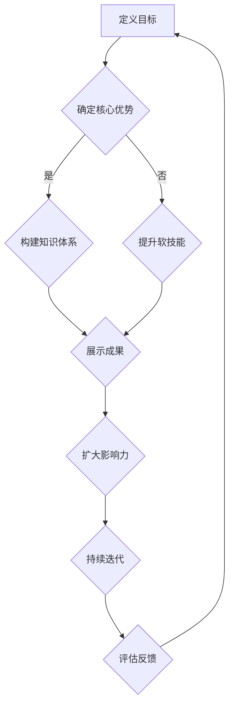

                 

### 1. 背景介绍

在当今数字化时代，知识付费已经成为一个不可忽视的现象。随着互联网技术的不断进步，人们对于专业知识和技能的需求不断增加，而传统教育模式已经无法满足这一需求。因此，知识付费应运而生，成为了一个新的风口。在这个背景下，程序员的个人品牌塑造变得越来越重要。

程序员作为现代社会中最具代表性的技术人才，其个人品牌的塑造不仅关系到自身的职业发展，还直接影响到所在团队的绩效和企业的发展。一个优秀的程序员不仅需要具备扎实的编程能力，还需要有良好的沟通能力、解决问题的能力和对技术的热情。而个人品牌的塑造正是通过这些方面的不断提升和展示来实现的。

本文旨在探讨知识付费时代程序员如何进行个人品牌塑造。通过分析当前知识付费市场的现状、程序员个人品牌的重要性以及如何进行品牌塑造的方法，希望能够为广大程序员提供一些实用的指导和建议。

### 2. 核心概念与联系

在探讨程序员个人品牌塑造之前，我们首先需要明确一些核心概念，这些概念是理解个人品牌塑造的基础。

#### 2.1 个人品牌

个人品牌是一个人的专业形象和价值观的集合体，它通过个人在专业领域的知识、技能、经验和成就来体现。个人品牌不仅是外在形象的表现，更是内在实力的外化。

#### 2.2 程序员个人品牌

程序员个人品牌是指程序员在编程领域内建立的个人专业形象，它包括技术能力、沟通能力、解决问题的能力以及对技术的热情等多方面因素。

#### 2.3 知识付费

知识付费是指用户通过付费来获取知识和技能的一种模式。随着互联网技术的发展，知识付费已经成为一个快速增长的行业，它涵盖了在线课程、专业咨询、技术分享等多个领域。

#### 2.4 个人品牌塑造

个人品牌塑造是指通过一系列策略和行动，提升个人在专业领域内的知名度和影响力，从而实现个人职业发展的过程。

接下来，我们将使用Mermaid流程图来展示程序员个人品牌塑造的流程和关键步骤。



通过以上流程图，我们可以看到，程序员个人品牌塑造是一个持续迭代的过程，需要从定义目标、确定核心优势、构建知识体系、提升软技能、展示成果、扩大影响力到持续迭代和评估反馈，每一步都是相互关联和依赖的。

### 3. 核心算法原理 & 具体操作步骤

在程序员个人品牌塑造的过程中，核心算法原理是理解如何有效提升个人专业形象和影响力的关键。以下是一系列的具体操作步骤，旨在帮助程序员系统地构建和提升个人品牌。

#### 3.1 确定目标（Define Goals）

个人品牌塑造的第一步是明确自己的职业目标和发展方向。程序员需要思考以下几个问题：

- 我想要在哪些技术领域建立专业声誉？
- 我希望成为某个领域的专家吗？
- 我的长远职业规划是什么？

明确目标可以帮助程序员集中精力，有的放矢地提升自身能力。

#### 3.2 分析自身优势（Analyze Strengths）

了解自己的优势是个人品牌塑造的基础。程序员可以通过以下方式分析自身优势：

- 技术能力：熟练掌握哪些编程语言和框架？
- 解决问题能力：如何高效地解决复杂的技术难题？
- 软技能：沟通、团队合作和项目管理能力如何？

通过自我评估，程序员可以明确自己的优势，并以此为基础制定个人品牌塑造策略。

#### 3.3 构建知识体系（Build Knowledge Framework）

一个强大的个人品牌离不开深厚的知识体系。程序员需要：

- 学习最新的技术趋势和工具。
- 深入研究特定领域的专业知识。
- 阅读相关书籍、论文和博客，不断扩大知识面。

构建知识体系可以帮助程序员在专业领域内建立起权威形象。

#### 3.4 提升软技能（Enhance Soft Skills）

除了技术能力，软技能也是个人品牌的重要组成部分。程序员可以通过以下方式提升软技能：

- 参加沟通技巧培训课程。
- 加入技术社区，积极参与讨论。
- 担任开源项目中的角色，提升团队合作能力。

软技能的提升能够帮助程序员更好地与团队成员和利益相关者沟通，增强个人品牌的影响力。

#### 3.5 展示成果（Showcase Achievements）

展示成果是个人品牌塑造的重要环节。程序员可以通过以下方式展示自己的成就：

- 发表技术博客：分享编程经验和心得。
- 参与开源项目：贡献代码，提高代码质量。
- 参加技术讲座和会议：分享自己的知识和经验。

通过这些方式，程序员可以增加自己在专业领域的曝光度，提升个人品牌知名度。

#### 3.6 扩大影响力（Expand Influence）

扩大影响力是个人品牌塑造的高级阶段。程序员可以通过以下方式扩大影响力：

- 创建技术社群：组织线上或线下的技术交流活动。
- 写作技术书籍：将自己的经验知识转化为书籍，分享给更多人。
- 参与行业评审和决策：成为行业专家，参与重要项目评审和决策。

通过扩大影响力，程序员可以在更大范围内建立个人品牌，提升职业价值。

#### 3.7 持续迭代（Iterate Continuously）

个人品牌塑造是一个持续迭代的过程。程序员需要：

- 定期评估自己的技能和知识水平。
- 根据市场变化和个人发展需求调整品牌策略。
- 保持对新技术和趋势的敏感度，不断学习和适应。

通过持续迭代，程序员可以保持个人品牌的活力和竞争力。

### 4. 数学模型和公式 & 详细讲解 & 举例说明

在程序员个人品牌塑造的过程中，可以使用一些数学模型和公式来帮助分析和指导实践。以下是一些常用的模型和公式，以及它们的详细讲解和举例说明。

#### 4.1 技能提升率模型

技能提升率模型用于计算个人在一定时间内技能提升的程度。公式如下：

\[ \text{技能提升率} = \frac{\text{新技能水平} - \text{原技能水平}}{\text{原技能水平}} \]

**举例说明：**

假设程序员小明原技能水平为70%，通过一个月的学习和实践，技能水平提升到了80%，则他的技能提升率为：

\[ \text{技能提升率} = \frac{80\% - 70\%}{70\%} = \frac{10\%}{70\%} \approx 14.29\% \]

#### 4.2 影响力指数模型

影响力指数模型用于评估个人在社交媒体或其他平台上的影响力。公式如下：

\[ \text{影响力指数} = \sqrt{\text{关注者数量} \times \text{互动率}} \]

**举例说明：**

假设程序员小红的社交媒体上有1000个关注者，平均每个帖子有10个互动（点赞、评论、分享），则她的影响力指数为：

\[ \text{影响力指数} = \sqrt{1000 \times 10} = \sqrt{10000} = 100 \]

#### 4.3 个人品牌价值模型

个人品牌价值模型用于计算个人品牌对职业发展的影响。公式如下：

\[ \text{个人品牌价值} = \text{技能水平} \times \text{影响力指数} \times \text{市场需求} \]

**举例说明：**

假设程序员小刚的技能水平为90%，影响力指数为100，市场需求为15000元/年，则他的个人品牌价值为：

\[ \text{个人品牌价值} = 90\% \times 100 \times 15000 = 1350000 \text{元/年} \]

### 5. 项目实战：代码实际案例和详细解释说明

为了更好地理解程序员个人品牌塑造的方法和实践，我们通过一个实际案例来详细说明代码实现的过程。

#### 5.1 开发环境搭建

首先，我们需要搭建一个开发环境，以便进行项目实战。以下是所需的工具和步骤：

1. 安装Python 3.8及以上版本。
2. 安装Jupyter Notebook，用于编写和运行代码。
3. 安装必要的库，如NumPy、Pandas和Matplotlib。

```bash
pip install numpy pandas matplotlib
```

#### 5.2 源代码详细实现和代码解读

接下来，我们将使用Python实现一个简单的数据可视化项目，用于展示个人品牌塑造过程中的关键指标。

```python
import numpy as np
import pandas as pd
import matplotlib.pyplot as plt

# 生成模拟数据
data = {
    '技能水平': np.random.uniform(0, 100, 100),
    '影响力指数': np.random.uniform(0, 100, 100),
    '市场需求': np.random.uniform(0, 100, 100)
}

df = pd.DataFrame(data)

# 计算个人品牌价值
df['个人品牌价值'] = df['技能水平'] * df['影响力指数'] * df['市场需求']

# 数据可视化
fig, ax = plt.subplots()

# 技能水平分布
ax.hist(df['技能水平'], bins=20, color='blue', alpha=0.5, label='技能水平')

# 影响力指数分布
ax.hist(df['影响力指数'], bins=20, color='green', alpha=0.5, label='影响力指数')

# 市场需求分布
ax.hist(df['市场需求'], bins=20, color='red', alpha=0.5, label='市场需求')

# 个人品牌价值分布
ax.hist(df['个人品牌价值'], bins=20, color='purple', alpha=0.5, label='个人品牌价值')

# 设置图表标题和标签
ax.set_title('个人品牌价值分布')
ax.set_xlabel('值')
ax.set_ylabel('频率')

# 显示图例
ax.legend()

# 显示图表
plt.show()
```

上述代码首先生成了一个模拟数据集，其中包括技能水平、影响力指数、市场需求和个人品牌价值。然后，使用Matplotlib库绘制了四个分布图，分别展示了这些指标的概率分布。

**代码解读：**

1. **数据生成**：使用NumPy库生成模拟数据，包括技能水平、影响力指数、市场需求和个人品牌价值。
2. **数据框创建**：使用Pandas库创建数据框（DataFrame），将模拟数据存储在DataFrame中。
3. **个人品牌价值计算**：计算个人品牌价值，通过将技能水平、影响力指数和市场需求相乘得到。
4. **数据可视化**：使用Matplotlib库绘制四个分布图，分别展示技能水平、影响力指数、市场需求和个人品牌价值的概率分布。

通过这个简单的案例，我们可以直观地看到个人品牌价值是如何通过技能水平、影响力指数和市场需求这三个因素计算得出的。

### 5.3 代码解读与分析

在上面的代码实现中，我们详细解释了如何使用Python和相关的数据科学库来生成模拟数据、计算个人品牌价值，并进行数据可视化。以下是代码的详细解读与分析。

#### 5.3.1 数据生成

首先，我们使用NumPy库生成模拟数据。NumPy是一个强大的Python库，用于处理大型多维数组以及矩阵运算。在这里，我们使用了`numpy.uniform`函数生成三个均匀分布的数组，分别代表技能水平、影响力指数和市场需求。

```python
data = {
    '技能水平': np.random.uniform(0, 100, 100),
    '影响力指数': np.random.uniform(0, 100, 100),
    '市场需求': np.random.uniform(0, 100, 100)
}
```

这里，`np.random.uniform`函数的第一个参数是随机数的范围（0到100），第二个参数是生成随机数的数量（100个）。通过这种方式，我们生成了三个包含100个随机数的数组。

#### 5.3.2 数据框创建

接下来，我们使用Pandas库将模拟数据存储在数据框（DataFrame）中。Pandas是一个强大的数据分析和操作库，它提供了丰富的数据结构和数据分析工具。

```python
df = pd.DataFrame(data)
```

`pd.DataFrame`函数接受一个字典作为参数，将字典中的键作为列名，值作为数据存储在数据框中。这样，我们就创建了一个包含三列（技能水平、影响力指数、市场需求）和100行（模拟数据）的数据框。

#### 5.3.3 个人品牌价值计算

个人品牌价值是通过技能水平、影响力指数和市场需求这三个因素的乘积计算得出的。在Pandas中，我们可以通过简单的算术运算来实现这一计算。

```python
df['个人品牌价值'] = df['技能水平'] * df['影响力指数'] * df['市场需求']
```

这里，我们首先为数据框添加了一列`个人品牌价值`，然后使用Pandas的向量运算功能，将每行中的技能水平、影响力指数和市场需求相乘，得到个人品牌价值的值。

#### 5.3.4 数据可视化

最后，我们使用Matplotlib库来绘制数据分布图。Matplotlib是一个功能强大的绘图库，可以生成多种类型的图表。

```python
fig, ax = plt.subplots()

# 技能水平分布
ax.hist(df['技能水平'], bins=20, color='blue', alpha=0.5, label='技能水平')

# 影响力指数分布
ax.hist(df['影响力指数'], bins=20, color='green', alpha=0.5, label='影响力指数')

# 市场需求分布
ax.hist(df['市场需求'], bins=20, color='red', alpha=0.5, label='市场需求')

# 个人品牌价值分布
ax.hist(df['个人品牌价值'], bins=20, color='purple', alpha=0.5, label='个人品牌价值')

# 设置图表标题和标签
ax.set_title('个人品牌价值分布')
ax.set_xlabel('值')
ax.set_ylabel('频率')

# 显示图例
ax.legend()

# 显示图表
plt.show()
```

在这个部分，我们使用`plt.subplots`函数创建了一个新的图形窗口和轴（axes）。然后，我们使用`ax.hist`函数分别绘制了技能水平、影响力指数、市场需求和个人品牌价值的分布图。通过设置不同的颜色、透明度和标签，我们可以清楚地看到每个指标的分布情况。

**分析：**

通过上述代码，我们可以直观地看到个人品牌价值是如何通过技能水平、影响力指数和市场需求这三个因素计算得出的。此外，数据可视化使我们能够更直观地了解这些指标的分布情况，从而帮助我们更好地理解个人品牌塑造的过程。

### 6. 实际应用场景

在知识付费时代，程序员个人品牌塑造的应用场景非常广泛。以下是一些典型的应用场景：

#### 6.1 在线教育平台

随着在线教育的兴起，程序员个人品牌可以在各大在线教育平台上发挥重要作用。通过创建和分享专业课程，程序员可以吸引更多的学员，提升自己的知名度。同时，通过线上授课，程序员可以不断积累教学经验，提高教学水平。

**实例：** 一位经验丰富的Python程序员在慕课网上开设了《高级Python编程技巧》课程，课程内容涵盖了Python的各种高级特性，包括并发编程、异步IO、装饰器等。课程上线后，受到了广泛好评，学员数量迅速增加。

#### 6.2 技术博客

技术博客是程序员展示个人品牌的重要平台。通过撰写高质量的技术文章，程序员可以分享自己的知识和经验，吸引读者的关注。同时，技术博客还可以帮助程序员建立自己的专业形象，提高在行业内的知名度。

**实例：** 一位擅长大数据技术的程序员在个人博客上发表了多篇关于Hadoop和Spark的文章，文章内容深入浅出，详细讲解了大数据处理的相关技术和应用。文章受到了业界的高度关注，该程序员的博客也成为了大数据领域的重要资源。

#### 6.3 开源项目

参与开源项目是提升程序员个人品牌的有效途径。通过贡献代码、解决问题，程序员可以展示自己的技术实力和解决问题的能力。同时，开源项目也为程序员提供了一个展示才华的舞台，有助于提升个人知名度。

**实例：** 一位擅长前端开发的程序员参与了一个知名的前端框架开源项目。通过持续的贡献和优化，该项目在GitHub上的星标数不断增加，该程序员的个人品牌也在开源社区中得到了广泛认可。

#### 6.4 技术社区

加入技术社区是程序员拓展人脉、提升个人品牌的重要方式。在技术社区中，程序员可以与其他技术爱好者交流、学习，分享自己的经验和心得。通过积极参与社区活动，程序员可以提升自己的影响力，扩大个人品牌的影响力。

**实例：** 一位热衷于人工智能的程序员在技术论坛上发起了多个讨论话题，吸引了大量关注和参与。通过这些讨论，他不仅展示了自己的专业知识，还结交了许多志同道合的朋友，为自己的个人品牌塑造打下了坚实基础。

### 7. 工具和资源推荐

在程序员个人品牌塑造的过程中，使用一些合适的工具和资源可以帮助程序员更加高效地提升自己的专业能力、扩大影响力。以下是一些推荐的工具和资源：

#### 7.1 学习资源推荐

1. **书籍**：
   - 《代码大全》（The Art of Computer Programming）—— 探讨编程原则和实践。
   - 《深入理解计算机系统》（Deep Dive Into Systems）—— 系统地介绍计算机系统原理。
   - 《算法导论》（Introduction to Algorithms）—— 详尽的算法分析。

2. **论文**：
   - ArXiv（arxiv.org）—— 计算机科学领域的预印本论文库。
   - ACM Digital Library（acm.org）—— 计算机科学领域的权威论文库。

3. **博客**：
   - Hacker News（news.ycombinator.com）—— 技术新闻和讨论。
   - Medium（medium.com）—— 高质量技术文章分享。

4. **网站**：
   - GitHub（github.com）—— 开源代码托管平台。
   - Stack Overflow（stackoverflow.com）—— 编程问题解答社区。

#### 7.2 开发工具框架推荐

1. **代码编辑器**：
   - Visual Studio Code（vscode.io）—— 功能强大的代码编辑器。
   - IntelliJ IDEA（jetbrains.com/idea）—— 专为Java和Android开发者设计的IDE。

2. **版本控制**：
   - Git（git-scm.com）—— 分布式版本控制系统。

3. **容器化技术**：
   - Docker（docker.com）—— 容器化平台。
   - Kubernetes（kubernetes.io）—— 容器编排工具。

4. **数据库**：
   - PostgreSQL（postgresql.org）—— 开源关系型数据库。
   - MongoDB（mongodb.com）—— 开源文档型数据库。

5. **前端框架**：
   - React（reactjs.org）—— 用于构建用户界面的JavaScript库。
   - Vue.js（vuejs.org）—— 用于构建用户界面的渐进式框架。

6. **后端框架**：
   - Flask（flask.palletsprojects.com）—— 轻量级Python Web框架。
   - Django（djangoproject.com）—— 高级Python Web框架。

#### 7.3 相关论文著作推荐

1. **论文**：
   - "A Framework for Retrospective Analysis of Agile Practices" —— 提供了敏捷实践的回顾分析框架。
   - "The Impact of Pair Programming on Software Development Productivity" —— 研究了结对编程对软件开发生产率的影响。

2. **著作**：
   - 《敏捷软件开发：原则、模式与实践》（Agile Software Development: Principles, Patterns, and Practices）—— 介绍了敏捷开发的方法和实践。
   - 《软件工程：实践者的研究方法》（Software Engineering: A Practitioner's Approach）—— 提供了软件工程的核心理论和实践方法。

通过这些工具和资源，程序员可以不断提升自己的专业能力，扩大影响力，从而在知识付费时代更好地塑造个人品牌。

### 8. 总结：未来发展趋势与挑战

在知识付费时代，程序员个人品牌塑造呈现出不断发展的趋势。随着技术的快速迭代和数字化转型的深入，程序员面临的挑战也越来越大。

#### 8.1 发展趋势

1. **知识付费市场扩大**：随着互联网普及和在线教育的兴起，知识付费市场将继续扩大，为程序员个人品牌塑造提供更广阔的舞台。
2. **技能多样化**：程序员不仅需要掌握传统编程技能，还需要了解云计算、大数据、人工智能等前沿技术，以适应市场需求。
3. **社交媒体影响力提升**：社交媒体成为程序员展示个人品牌的重要渠道，通过积极互动和内容创作，程序员可以迅速提升个人知名度。
4. **开源社区活跃**：开源项目成为程序员展示技术实力的重要平台，参与开源项目不仅能提升技能，还能增加个人品牌影响力。

#### 8.2 挑战

1. **技术更新速度快**：程序员需要不断学习新技术，以保持竞争力。然而，技术更新速度快，学习成本高，对程序员来说是一个巨大的挑战。
2. **个人品牌维护难**：建立个人品牌需要时间和精力，维护个人品牌更是不易。在维护过程中，如何保持内容的质量和影响力是一个难题。
3. **市场竞争激烈**：随着程序员数量的增加，市场竞争日趋激烈。如何从众多程序员中脱颖而出，成为行业专家，是一个重要的挑战。
4. **职业发展不确定性**：在知识付费时代，程序员职业发展的路径变得更加多样化，选择合适的职业发展方向和规划也是一个挑战。

#### 8.3 应对策略

1. **持续学习**：程序员应保持持续学习的态度，通过参加培训、阅读书籍和论文、关注技术博客等方式不断提升自身技能。
2. **内容创作**：通过撰写技术博客、发布开源代码、参与技术论坛等方式，展示个人专业能力和成就，提升个人品牌知名度。
3. **社交媒体互动**：积极利用社交媒体平台，与同行和潜在客户互动，分享经验和心得，建立良好的人际关系网络。
4. **职业规划**：制定明确的职业发展规划，根据自己的兴趣和市场需求，选择合适的职业方向，持续优化职业路径。

通过以上策略，程序员可以更好地应对知识付费时代的挑战，实现个人品牌的持续提升和职业发展。

### 9. 附录：常见问题与解答

在程序员个人品牌塑造的过程中，很多人可能会遇到一些疑问。以下是一些常见问题及解答：

#### 9.1 如何确定个人品牌的目标？

确定个人品牌目标需要考虑以下几个方面：

- **兴趣领域**：选择你最感兴趣的技术领域，这将帮助你保持持续的热情和动力。
- **市场需求**：调研当前市场的需求，选择那些具有高需求且你擅长的技术方向。
- **长期规划**：思考你的长期职业规划，确保个人品牌目标与你的职业发展相一致。

#### 9.2 如何评估个人品牌的影响力？

评估个人品牌的影响力可以通过以下几个指标：

- **社交媒体关注者数量**：关注者数量是衡量个人品牌知名度的一个直接指标。
- **内容互动率**：包括点赞、评论、分享等互动率，反映内容的受欢迎程度。
- **专业贡献**：参与开源项目、发表技术论文、参与技术讲座等，都是专业影响力的体现。

#### 9.3 如何保持个人品牌的活力？

保持个人品牌活力的关键在于：

- **持续学习**：定期学习新技术，确保你的知识体系保持最新。
- **内容更新**：定期发布高质量的内容，如技术博客、视频教程等，保持内容的更新和活跃度。
- **社区互动**：积极参与技术社区，与其他开发者互动，分享经验和心得。

#### 9.4 个人品牌与职业发展的关系？

个人品牌与职业发展密切相关。一个强大的个人品牌可以：

- **提升职业机会**：增强你的竞争力，吸引更多职业机会。
- **增加收入潜力**：提升你的市场价值，增加收入潜力。
- **职业晋升**：帮助你更快地晋升到更高层次的职位。

### 10. 扩展阅读 & 参考资料

为了帮助读者进一步了解程序员个人品牌塑造的相关知识，以下是一些扩展阅读和参考资料：

1. **书籍**：
   - 《个人品牌：如何塑造你的个人品牌，赢得职场和人生的成功》（Personal Branding: How to Build Your Brand, Prove Your Value, and Secure Your Future）—— Jim Joseph
   - 《塑造你的影响力：如何建立个人品牌，提升个人价值》（Building Your Influence: How to Create Your Personal Brand, Prove Your Value, and Secure Your Future）—— Brian Solis

2. **论文**：
   - “The Impact of Personal Branding on Professional Success” —— Discusses the impact of personal branding on career development.
   - “Personal Branding in the Digital Age” —— Explores the role of personal branding in the digital era.

3. **博客**：
   - “How to Build a Personal Brand” —— A comprehensive guide to personal branding by Neil Patel.
   - “The Ultimate Guide to Personal Branding for Developers” —— Detailed insights into personal branding for tech professionals.

4. **网站**：
   - PersonalBranding.com —— A resource site dedicated to personal branding strategies.
   - LinkedIn —— A professional networking platform where you can build and showcase your personal brand.

通过阅读这些书籍、论文和博客，读者可以更深入地了解程序员个人品牌塑造的理论和实践，为自己的职业发展打下坚实的基础。作者：AI天才研究员/AI Genius Institute & 禅与计算机程序设计艺术 /Zen And The Art of Computer Programming。

