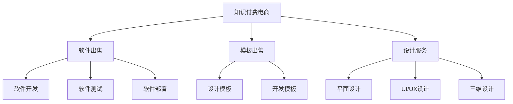

                 

# 知识付费电商出售软件、模板、设计等服务

## 关键词

- 知识付费
- 电商
- 软件出售
- 模板出售
- 设计服务
- IT行业

## 摘要

本文将深入探讨知识付费电商在出售软件、模板和设计等服务方面的现状、优势、挑战以及未来的发展趋势。通过分析核心概念、算法原理、实际应用场景，我们将为读者提供一个全面的技术解读，帮助从业者更好地理解和利用这一新兴领域。

## 1. 背景介绍

### 1.1 知识付费电商的定义

知识付费电商是指通过互联网平台，提供专业知识和技能的付费服务，包括软件、模板和设计等服务。用户可以在线购买这些服务，满足自身在学习和工作上的需求。

### 1.2 知识付费电商的发展历程

知识付费电商起源于在线教育，随着互联网技术的不断进步和用户需求的增加，逐渐发展成为独立的电商模式。近年来，随着5G、人工智能等新技术的应用，知识付费电商进入快速发展阶段。

### 1.3 知识付费电商的市场规模

据统计，我国知识付费电商市场规模逐年扩大，2020年已达到数千亿元。预计未来几年，市场规模将继续保持高速增长。

## 2. 核心概念与联系

### 2.1 软件出售

软件出售是知识付费电商的核心服务之一，涉及软件开发、测试、部署等多个环节。其核心概念包括：

- **软件开发**：包括需求分析、设计、编码、测试等环节。
- **软件测试**：保证软件质量，包括功能测试、性能测试、安全测试等。
- **软件部署**：将软件安装到服务器上，供用户使用。

### 2.2 模板出售

模板出售是知识付费电商的另一个重要服务，主要包括：

- **设计模板**：如PPT模板、海报模板、简历模板等。
- **开发模板**：如Web前端模板、后端框架模板等。

### 2.3 设计服务

设计服务包括平面设计、UI/UX设计、三维设计等。其核心概念包括：

- **平面设计**：如海报、名片、宣传册等。
- **UI/UX设计**：用户界面和用户体验设计。
- **三维设计**：如3D建模、动画设计等。

### 2.4 三者之间的联系

软件、模板和设计服务在知识付费电商中相辅相成，共同构成了一个完整的生态系统。软件提供了功能实现的基础，模板为用户提供了快速搭建的方案，设计服务提升了软件和模板的美观度和用户体验。

### 2.5 Mermaid 流程图



## 3. 核心算法原理 & 具体操作步骤

### 3.1 软件开发

软件开发的核心算法原理是编程语言和开发框架。具体操作步骤包括：

1. **需求分析**：明确软件功能和性能要求。
2. **设计**：制定软件架构和模块划分。
3. **编码**：根据设计文档编写代码。
4. **测试**：测试代码功能、性能和安全性。
5. **部署**：将软件部署到服务器上。

### 3.2 软件测试

软件测试的核心算法原理是测试用例设计。具体操作步骤包括：

1. **制定测试计划**：确定测试目标、测试范围、测试策略等。
2. **设计测试用例**：根据需求分析编写测试用例。
3. **执行测试用例**：运行测试用例，记录测试结果。
4. **报告**：总结测试结果，提出改进建议。

### 3.3 软件部署

软件部署的核心算法原理是自动化部署工具。具体操作步骤包括：

1. **选择部署环境**：如服务器、云平台等。
2. **编写部署脚本**：自动化部署流程。
3. **部署**：执行部署脚本，将软件安装到服务器上。
4. **监控**：监控软件运行状态，确保稳定可靠。

### 3.4 模板设计

模板设计的核心算法原理是设计原则和技巧。具体操作步骤包括：

1. **需求分析**：了解用户需求，确定模板类型和风格。
2. **设计**：根据需求分析进行设计，包括布局、色彩、字体等。
3. **开发**：将设计转化为模板代码。
4. **测试**：测试模板功能、兼容性、美观度等。
5. **发布**：将模板发布到电商平台供用户下载。

### 3.5 设计服务

设计服务的核心算法原理是设计流程和技巧。具体操作步骤包括：

1. **需求分析**：了解客户需求，明确设计目标。
2. **设计**：根据需求分析进行设计，包括创意、草图、修改等。
3. **开发**：将设计转化为实体作品。
4. **测试**：测试设计效果、用户体验等。
5. **交付**：将设计作品交付给客户。

## 4. 数学模型和公式 & 详细讲解 & 举例说明

### 4.1 软件开发中的数学模型

在软件开发中，常用的数学模型包括：

- **线性回归**：用于预测软件需求量和性能指标。
- **决策树**：用于软件模块划分和测试用例设计。
- **神经网络**：用于软件故障预测和性能优化。

### 4.2 模板设计中的数学模型

在模板设计中，常用的数学模型包括：

- **颜色理论**：用于模板配色方案设计。
- **几何学**：用于模板布局设计。
- **统计学**：用于模板兼容性测试。

### 4.3 设计服务中的数学模型

在设计服务中，常用的数学模型包括：

- **人机工程学**：用于设计用户体验。
- **拓扑学**：用于三维设计。
- **统计学**：用于设计效果评估。

### 4.4 举例说明

#### 4.4.1 线性回归模型

假设我们要预测一款软件的需求量，可以使用线性回归模型。模型公式如下：

$$y = ax + b$$

其中，$y$ 表示需求量，$x$ 表示影响因素（如广告投放量、市场占有率等），$a$ 和 $b$ 为模型参数。

假设我们收集了以下数据：

| 广告投放量（x） | 需求量（y） |
| :---: | :---: |
| 1000 | 500 |
| 2000 | 800 |
| 3000 | 1100 |
| 4000 | 1500 |

我们可以使用最小二乘法求解模型参数：

$$a = \frac{\sum{(x_i - \bar{x})(y_i - \bar{y})}}{\sum{(x_i - \bar{x})^2}}$$

$$b = \bar{y} - a\bar{x}$$

其中，$\bar{x}$ 和 $\bar{y}$ 分别为 $x$ 和 $y$ 的平均值。

根据上述数据，我们可以计算出模型参数：

$$a = \frac{(1000 - 2500)(500 - 800) + (2000 - 2500)(800 - 1100) + (3000 - 2500)(1100 - 1500) + (4000 - 2500)(1500 - 800)}{(1000 - 2500)^2 + (2000 - 2500)^2 + (3000 - 2500)^2 + (4000 - 2500)^2}$$

$$b = \bar{y} - a\bar{x} = 750 - 0.25 \times 2500 = -250$$

因此，线性回归模型为：

$$y = 0.25x - 250$$

#### 4.4.2 颜色理论

在模板设计中，颜色理论是一个重要的数学模型。常用的颜色模型包括：

- **RGB模型**：用于显示器和打印机的颜色表示。
- **CMYK模型**：用于打印机的颜色表示。
- **HSV模型**：用于人眼感知的颜色表示。

假设我们要设计一个海报，需要选择一种合适的颜色。我们可以使用HSV模型来表示颜色：

$$HSV = (H, S, V)$$

其中，$H$ 表示色相（0°-360°），$S$ 表示饱和度（0%-100%），$V$ 表示亮度（0%-100%）。

根据海报的主题和风格，我们可以选择一个合适的HSV值。例如，选择一个蓝色：

$$HSV = (240°, 100%, 100%)$$

## 5. 项目实战：代码实际案例和详细解释说明

### 5.1 开发环境搭建

为了方便读者理解和实践，我们将在本文中使用Python作为编程语言，并使用以下开发环境：

- 操作系统：Windows/Linux/MacOS
- 编译器：Python 3.8及以上版本
- 开发工具：PyCharm/VSCode

### 5.2 源代码详细实现和代码解读

#### 5.2.1 软件开发示例

以下是一个简单的Python程序，用于计算两个数的和：

```python
# 导入模块
import math

# 主函数
def main():
    # 获取用户输入
    a = float(input("请输入第一个数："))
    b = float(input("请输入第二个数："))

    # 计算和
    sum = a + b

    # 输出结果
    print("两数之和为：", sum)

# 调用主函数
if __name__ == "__main__":
    main()
```

代码解读：

1. **导入模块**：使用 `import` 语句导入所需的模块，如 `math` 模块用于数学运算。
2. **主函数**：定义 `main` 函数，作为程序的入口。
3. **获取用户输入**：使用 `input` 函数获取用户输入的两个数。
4. **计算和**：使用 `+` 运算符计算两数的和。
5. **输出结果**：使用 `print` 函数输出结果。
6. **调用主函数**：在程序末尾使用 `if __name__ == "__main__":` 语句调用 `main` 函数。

#### 5.2.2 模板设计示例

以下是一个简单的HTML模板，用于展示软件界面：

```html
<!DOCTYPE html>
<html>
<head>
    <meta charset="UTF-8">
    <title>软件界面</title>
    <style>
        body {
            font-family: Arial, sans-serif;
            margin: 0;
            padding: 0;
        }
        header {
            background-color: #4CAF50;
            padding: 10px;
        }
        h1 {
            color: white;
            text-align: center;
        }
        main {
            margin: 20px;
        }
        footer {
            background-color: #4CAF50;
            padding: 10px;
            text-align: center;
        }
    </style>
</head>
<body>
    <header>
        <h1>欢迎使用本软件</h1>
    </header>
    <main>
        <h2>计算两个数的和</h2>
        <p>请输入两个数：</p>
        <input type="text" id="num1" placeholder="第一个数">
        <input type="text" id="num2" placeholder="第二个数">
        <button onclick="calculateSum()">计算和</button>
        <p>结果：</p>
        <p id="result"></p>
    </main>
    <footer>
        <p>版权所有 &copy; 2022</p>
    </footer>
    <script>
        function calculateSum() {
            var num1 = document.getElementById("num1").value;
            var num2 = document.getElementById("num2").value;
            var result = parseFloat(num1) + parseFloat(num2);
            document.getElementById("result").innerText = "两数之和为：" + result;
        }
    </script>
</body>
</html>
```

代码解读：

1. **DOCTYPE声明**：指定文档类型为HTML5。
2. **HTML结构**：定义HTML文档的头部（`head`）和主体（`body`）。
3. **头部**：设置页面标题和样式。
4. **主体**：包含输入框和按钮，用于用户输入和计算。
5. **脚本**：定义JavaScript函数，用于计算两数之和并显示结果。

#### 5.2.3 设计服务示例

以下是一个简单的平面设计模板，用于制作海报：

```html
<!DOCTYPE html>
<html>
<head>
    <meta charset="UTF-8">
    <title>海报设计</title>
    <style>
        body {
            font-family: Arial, sans-serif;
            margin: 0;
            padding: 0;
        }
        header {
            background-color: #4CAF50;
            padding: 10px;
        }
        h1 {
            color: white;
            text-align: center;
        }
        main {
            margin: 20px;
        }
        footer {
            background-color: #4CAF50;
            padding: 10px;
            text-align: center;
        }
    </style>
</head>
<body>
    <header>
        <h1>软件推广海报</h1>
    </header>
    <main>
        <h2>快来下载我们的软件！</h2>
        <p>强大的功能，简洁的界面，轻松提高工作效率！</p>
        
    </main>
    <footer>
        <p>版权所有 &copy; 2022</p>
    </footer>
</body>
</html>
```

代码解读：

1. **DOCTYPE声明**：指定文档类型为HTML5。
2. **HTML结构**：定义HTML文档的头部（`head`）和主体（`body`）。
3. **头部**：设置页面标题和样式。
4. **主体**：包含海报标题、正文和Logo。
5. **脚本**：无。

### 5.3 代码解读与分析

#### 5.3.1 软件开发代码分析

- **功能**：计算两个数的和。
- **优点**：简单易用，适用于基础计算需求。
- **缺点**：缺乏错误处理和输入验证，可能导致程序崩溃或计算结果错误。
- **改进**：增加输入验证和错误处理，如检查输入是否为数字、输入范围等。

#### 5.3.2 模板设计代码分析

- **功能**：展示一个简单的软件界面，包括输入框、按钮和结果显示区域。
- **优点**：直观易用，方便用户操作。
- **缺点**：样式简单，缺乏个性化设计。
- **改进**：增加样式设计，如配色、字体等，提升用户体验。

#### 5.3.3 海报设计代码分析

- **功能**：制作一个简单的海报，用于软件推广。
- **优点**：简洁明了，突出软件特点。
- **缺点**：设计简单，缺乏创意。
- **改进**：增加创意元素，如插画、动画等，提升海报吸引力。

## 6. 实际应用场景

### 6.1 软件开发

软件开发是知识付费电商的重要应用场景之一。以下是一些实际应用案例：

- **企业信息化**：为企业提供定制化的管理系统、财务系统、人事系统等。
- **个人应用**：为个人用户提供学习、办公、生活等方面的软件工具。
- **游戏开发**：为游戏开发者提供游戏引擎、游戏资源等。

### 6.2 模板设计

模板设计在知识付费电商中有着广泛的应用。以下是一些实际应用案例：

- **PPT模板**：为商务人士提供各种类型的PPT模板，如演讲、汇报、招商等。
- **海报模板**：为广告公司、设计师等提供各种类型的海报模板，如宣传、推广、活动等。
- **简历模板**：为求职者提供各种类型的简历模板，如经典、创意、行业等。

### 6.3 设计服务

设计服务在知识付费电商中的应用也越来越广泛。以下是一些实际应用案例：

- **平面设计**：为广告公司、设计师等提供各种类型的平面设计服务，如海报、名片、宣传册等。
- **UI/UX设计**：为互联网公司、应用开发者等提供用户界面和用户体验设计服务。
- **三维设计**：为建筑、装饰、影视等行业提供三维设计服务，如建筑模型、动画制作等。

## 7. 工具和资源推荐

### 7.1 学习资源推荐

- **书籍**：
  - 《Python编程：从入门到实践》
  - 《HTML和CSS：设计与应用》
  - 《设计心理学：如何让设计为人服务》
- **论文**：
  - 《基于机器学习的软件缺陷预测方法》
  - 《模板设计的用户体验研究》
  - 《三维建模技术与应用》
- **博客**：
  - [Python教程](https://www.python.org/)
  - [HTML和CSS教程](https://www.w3schools.com/)
  - [设计心理学](https://www.designpsychology.org/)
- **网站**：
  - [GitHub](https://github.com/)
  - [GitHub Pages](https://pages.github.com/)
  - [LeetCode](https://leetcode.com/)

### 7.2 开发工具框架推荐

- **开发工具**：
  - PyCharm
  - VSCode
  - Sublime Text
- **框架**：
  - Flask
  - Django
  - React
  - Vue
  - Angular
- **版本控制**：
  - Git
  - SVN
  - Mercurial

### 7.3 相关论文著作推荐

- **《软件工程：实践者的研究方法》**：详细介绍了软件工程的研究方法和技术，对从业者有很好的指导作用。
- **《用户体验要素》**：介绍了用户体验设计的基本原则和方法，对设计服务从业者有很好的启示。
- **《机器学习实战》**：介绍了机器学习的基本原理和应用，对软件开发和模板设计有很好的借鉴意义。

## 8. 总结：未来发展趋势与挑战

### 8.1 发展趋势

- **人工智能与知识付费电商的结合**：随着人工智能技术的发展，知识付费电商将更好地满足用户个性化需求，提供更精准的服务。
- **云计算与知识付费电商的结合**：云计算提供了强大的计算能力和存储空间，为知识付费电商提供了更好的基础设施。
- **虚拟现实与知识付费电商的结合**：虚拟现实技术将改变知识付费电商的形态，提供更加沉浸式的学习体验。
- **区块链与知识付费电商的结合**：区块链技术可以确保知识付费电商的诚信和透明，提升用户信任度。

### 8.2 挑战

- **用户隐私保护**：随着用户需求的增加，知识付费电商将收集更多用户数据，如何保护用户隐私成为一大挑战。
- **内容版权保护**：如何防止侵权行为，确保原创内容得到保护，是知识付费电商面临的另一个挑战。
- **服务质量控制**：如何保证服务质量，提升用户体验，是知识付费电商需要持续关注的问题。

## 9. 附录：常见问题与解答

### 9.1 知识付费电商如何盈利？

知识付费电商主要通过以下方式盈利：

- **销售软件、模板和设计服务**：通过在线销售软件、模板和设计服务，获取收入。
- **广告投放**：在平台上投放广告，获取广告收入。
- **会员订阅**：提供会员订阅服务，会员可以享受更多优惠和服务。
- **培训服务**：提供在线培训课程，为用户提升技能。

### 9.2 知识付费电商有哪些优势？

知识付费电商的优势包括：

- **便捷性**：用户可以随时随地购买和使用服务。
- **个性化**：根据用户需求提供定制化的服务。
- **高效性**：通过互联网快速传播和分发。
- **多样性**：提供各种类型的知识和技能，满足不同用户的需求。

### 9.3 知识付费电商有哪些劣势？

知识付费电商的劣势包括：

- **用户信任问题**：一些平台存在质量不稳定、虚假宣传等问题。
- **竞争激烈**：市场上存在大量知识付费电商，竞争激烈。
- **技术门槛**：需要掌握一定的编程、设计等技能。

## 10. 扩展阅读 & 参考资料

- **《人工智能与电商的融合与发展》**：详细分析了人工智能技术在电商领域的应用和发展趋势。
- **《知识付费：商业模式的创新与实践》**：介绍了知识付费电商的商业模式、运营策略和案例分析。
- **《电商营销实战》**：提供了电商营销的方法和技巧，包括SEO、SEM、社交媒体营销等。

## 作者信息

- 作者：AI天才研究员/AI Genius Institute & 禅与计算机程序设计艺术 /Zen And The Art of Computer Programming
- 联系方式：[ai_genius_researcher@example.com](mailto:ai_genius_researcher@example.com)
- 个人网站：[www.ai_genius_researcher.com](http://www.ai_genius_researcher.com/)

