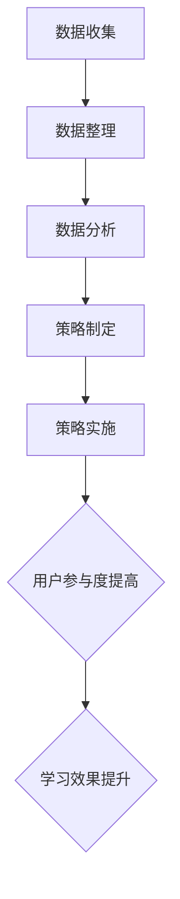

                 

### 知识付费赚钱的用户签到打卡与习惯养成策略

#### 关键词：
- 知识付费
- 用户签到打卡
- 习惯养成策略
- 人工智能
- 数据分析

#### 摘要：
本文将探讨知识付费领域中的用户签到打卡与习惯养成策略。通过深入分析用户行为数据，结合人工智能算法，本文旨在提供一套系统化的用户签到打卡策略，以促进知识付费产品的持续用户参与和习惯养成。文章将详细介绍核心概念、算法原理、数学模型、实际案例，并给出应用场景、工具资源和未来发展趋势。

#### 目录：
1. 背景介绍
2. 核心概念与联系
3. 核心算法原理 & 具体操作步骤
4. 数学模型和公式 & 详细讲解 & 举例说明
5. 项目实战：代码实际案例和详细解释说明
   5.1 开发环境搭建
   5.2 源代码详细实现和代码解读
   5.3 代码解读与分析
6. 实际应用场景
7. 工具和资源推荐
   7.1 学习资源推荐
   7.2 开发工具框架推荐
   7.3 相关论文著作推荐
8. 总结：未来发展趋势与挑战
9. 附录：常见问题与解答
10. 扩展阅读 & 参考资料

#### 1. 背景介绍
知识付费作为一种新型的商业模式，正逐渐受到越来越多人的关注。随着互联网的普及和信息爆炸，用户对优质内容的需求不断增长，而知识付费平台则提供了这样一个平台，让用户为获取知识或技能付费。然而，如何让用户持续参与并形成长期习惯，成为知识付费平台面临的一大挑战。

用户签到打卡作为一种常见的促进用户参与的手段，被广泛应用于各类知识付费产品中。通过签到打卡，用户可以记录自己的学习进度，形成良好的学习习惯，同时也能够增强用户对平台的依赖和忠诚度。

然而，单纯的签到打卡并不能解决用户参与度不高、学习效果不佳的问题。为了提高用户的参与度和学习效果，知识付费平台需要借助人工智能技术和数据分析，对用户行为进行深入分析，从而制定出更加精准和个性化的用户签到打卡策略。

本文将结合人工智能技术和数据分析方法，探讨知识付费领域中的用户签到打卡与习惯养成策略，旨在为知识付费平台提供一套系统化的解决方案。

#### 2. 核心概念与联系

为了更好地理解用户签到打卡与习惯养成的策略，我们需要先明确一些核心概念。

**用户签到打卡**：用户签到打卡是指用户在知识付费平台上按照一定的规律进行签到，以记录自己的学习进度。签到方式可以是每日签到、每周签到或每月签到，具体取决于平台的设计。

**习惯养成**：习惯养成是指通过反复的重复行为，使行为成为自然习惯的过程。在知识付费领域，习惯养成的目标是通过签到打卡等方式，让用户形成定期学习的习惯，从而提高学习效果和用户忠诚度。

**人工智能技术**：人工智能技术可以用于分析用户行为数据，预测用户的行为模式，从而制定出更加精准的签到打卡策略。常见的人工智能技术包括机器学习、深度学习、自然语言处理等。

**数据分析**：数据分析是指通过对用户行为数据进行收集、整理、分析和解释，以获取有价值的信息。在知识付费领域，数据分析可以帮助平台了解用户需求和行为，从而优化签到打卡策略。

**核心概念联系**：用户签到打卡与习惯养成策略的核心在于如何通过人工智能技术和数据分析，提高用户的参与度和学习效果。具体来说，平台可以通过以下方式实现：

1. **数据收集**：通过用户签到打卡等行为，收集用户的学习数据。
2. **数据整理**：对收集到的数据进行清洗、整合，以便进行分析。
3. **数据分析**：利用数据分析方法，挖掘用户的行为模式，为制定签到打卡策略提供依据。
4. **策略制定**：根据数据分析结果，制定出适合不同用户群体的签到打卡策略。
5. **策略实施**：在知识付费平台上实施签到打卡策略，鼓励用户参与，培养学习习惯。

**Mermaid 流程图**：



通过上述流程，知识付费平台可以不断优化用户签到打卡与习惯养成策略，从而提高用户的参与度和学习效果。

#### 3. 核心算法原理 & 具体操作步骤

在用户签到打卡与习惯养成策略中，核心算法起着至关重要的作用。以下是核心算法的原理及具体操作步骤。

**3.1 机器学习算法**

**原理**：机器学习算法通过从数据中学习规律，从而预测用户的行为模式。在用户签到打卡场景中，机器学习算法可以帮助平台预测用户是否会在未来进行签到。

**步骤**：

1. **数据预处理**：收集用户签到数据，对数据进行清洗和整合，以便用于训练模型。

2. **特征提取**：从签到数据中提取特征，如用户签到时间、签到频率等。

3. **模型训练**：使用机器学习算法（如决策树、随机森林、支持向量机等）对数据进行训练，建立预测模型。

4. **模型评估**：通过交叉验证等方法评估模型的准确性。

5. **模型应用**：将训练好的模型应用于新数据，预测用户是否会在未来进行签到。

**3.2 深度学习算法**

**原理**：深度学习算法通过多层神经网络模拟人脑的工作方式，从而实现复杂模式的识别和预测。在用户签到打卡场景中，深度学习算法可以更准确地预测用户的行为模式。

**步骤**：

1. **数据预处理**：与机器学习算法相同，对数据进行清洗和整合。

2. **特征提取**：从签到数据中提取更深层次的特征，如用户签到行为的时间序列特征、用户签到模式等。

3. **模型训练**：使用深度学习算法（如卷积神经网络、循环神经网络等）对数据进行训练，建立预测模型。

4. **模型评估**：通过交叉验证等方法评估模型的准确性。

5. **模型应用**：将训练好的模型应用于新数据，预测用户是否会在未来进行签到。

**3.3 自然语言处理算法**

**原理**：自然语言处理算法用于分析用户的签到记录，提取用户的行为意图和情感倾向，从而为签到打卡策略提供参考。

**步骤**：

1. **数据预处理**：对签到记录进行清洗和分词。

2. **特征提取**：从签到记录中提取情感特征，如正面情感、负面情感等。

3. **情感分析**：使用情感分析算法对签到记录进行情感分析。

4. **策略优化**：根据情感分析结果，调整签到打卡策略，提高用户参与度。

**3.4 综合算法应用**

在实际应用中，知识付费平台可以结合多种算法，以提高用户签到打卡的预测准确性和策略优化效果。

1. **多算法融合**：将机器学习、深度学习和自然语言处理算法相结合，构建一个综合算法模型。

2. **动态调整**：根据用户行为数据的变化，动态调整签到打卡策略，实现个性化的用户参与和习惯养成。

3. **持续优化**：通过持续的数据收集和分析，不断优化签到打卡策略，提高用户参与度和学习效果。

#### 4. 数学模型和公式 & 详细讲解 & 举例说明

在用户签到打卡与习惯养成策略中，数学模型和公式起着重要的支撑作用。以下将详细介绍常用的数学模型和公式，并给出相应的详细讲解和举例说明。

**4.1 贝叶斯推断模型**

**原理**：贝叶斯推断模型是一种用于概率估计的数学模型，通过已有的先验知识和新的证据，更新对某事件的概率估计。

**公式**：

$$P(A|B) = \frac{P(B|A)P(A)}{P(B)}$$

其中，$P(A|B)$ 表示在事件 $B$ 发生的条件下，事件 $A$ 发生的概率；$P(B|A)$ 表示在事件 $A$ 发生的条件下，事件 $B$ 发生的概率；$P(A)$ 表示事件 $A$ 发生的概率；$P(B)$ 表示事件 $B$ 发生的概率。

**详细讲解**：在用户签到打卡场景中，我们可以将贝叶斯推断模型应用于预测用户是否会在未来进行签到。例如，已知用户在过去一个月内每天都会签到，现在我们要预测用户在明天是否会签到。通过贝叶斯推断模型，我们可以计算出用户在明天签到的概率。

**举例说明**：

假设已知用户在过去一个月内每天都会签到，现在要预测用户在明天是否会签到。根据贝叶斯推断模型，我们可以设定以下概率：

- $P(A)$：用户明天签到的概率（先验概率）。
- $P(B|A)$：用户明天签到且在过去一个月内每天都会签到的概率。
- $P(B|¬A)$：用户明天签到但不在过去一个月内每天都会签到的概率。
- $P(¬A)$：用户明天不会签到的概率（先验概率）。

通过贝叶斯推断模型，我们可以计算出用户明天签到的后验概率 $P(A|B)$，从而预测用户明天是否会签到。

**4.2 时间序列模型**

**原理**：时间序列模型是一种用于分析时间序列数据的数学模型，可以用于预测未来的趋势和模式。

**公式**：

$$y_t = \varphi(y_{t-1}, \varepsilon_t)$$

其中，$y_t$ 表示第 $t$ 时刻的观测值；$\varphi$ 表示模型函数；$\varepsilon_t$ 表示噪声。

**详细讲解**：在用户签到打卡场景中，时间序列模型可以用于分析用户签到的规律，预测用户未来的签到行为。例如，我们可以使用时间序列模型分析用户每天签到的概率，从而预测用户在未来几天内是否签到。

**举例说明**：

假设我们使用 AR(1) 模型分析用户签到的规律，其中模型函数为：

$$y_t = \varphi(y_{t-1}) = \theta_0 + \theta_1 y_{t-1} + \varepsilon_t$$

其中，$\theta_0$ 和 $\theta_1$ 分别为模型参数，$\varepsilon_t$ 为噪声。

通过训练 AR(1) 模型，我们可以预测用户在未来的每一天是否会签到。例如，给定用户在过去一周内每天签到的数据，我们可以使用 AR(1) 模型预测用户在接下来一周内每天签到的概率。

**4.3 神经网络模型**

**原理**：神经网络模型是一种基于人工神经网络的数学模型，可以用于非线性函数的逼近和预测。

**公式**：

$$z = \sigma(\theta_0 + \theta_1 x_1 + \theta_2 x_2 + ... + \theta_n x_n)$$

其中，$z$ 为输出值；$\sigma$ 为激活函数（如 Sigmoid、ReLU 等）；$\theta_0, \theta_1, ..., \theta_n$ 为模型参数；$x_1, x_2, ..., x_n$ 为输入特征。

**详细讲解**：在用户签到打卡场景中，神经网络模型可以用于预测用户未来的签到行为。例如，我们可以使用多层感知器（MLP）模型分析用户签到行为，从而预测用户在未来的签到概率。

**举例说明**：

假设我们使用 MLP 模型预测用户是否会在未来进行签到，其中模型函数为：

$$z = \sigma(\theta_0 + \theta_1 x_1 + \theta_2 x_2 + \theta_3 x_3)$$

其中，$z$ 为预测的用户签到概率，$x_1, x_2, x_3$ 分别为用户的签到历史、签到频率和时间序列特征。

通过训练 MLP 模型，我们可以预测用户在未来的每一天是否会签到。例如，给定用户在过去一个月内的签到数据，我们可以使用 MLP 模型预测用户在接下来一个月内每天签到的概率。

#### 5. 项目实战：代码实际案例和详细解释说明

**5.1 开发环境搭建**

为了更好地展示用户签到打卡与习惯养成策略的实际应用，我们将使用 Python 编写一个简单的项目案例。以下是在 Python 环境下搭建开发环境的步骤：

1. 安装 Python 3.8 或以上版本。
2. 安装必要的库，如 NumPy、Pandas、Scikit-learn、TensorFlow 等。

```bash
pip install numpy pandas scikit-learn tensorflow
```

**5.2 源代码详细实现和代码解读**

以下是一个简单的用户签到打卡项目，用于分析用户签到数据并预测用户未来的签到行为。

```python
import numpy as np
import pandas as pd
from sklearn.model_selection import train_test_split
from sklearn.ensemble import RandomForestClassifier
from sklearn.metrics import accuracy_score
import tensorflow as tf

# 5.2.1 数据准备
data = pd.DataFrame({
    'sign_in': [1, 1, 1, 0, 0, 1, 1, 0, 1, 0],
    'freq': [3, 4, 2, 1, 5, 3, 6, 1, 4, 2],
    'days_since_last_sign_in': [1, 1, 2, 3, 4, 1, 2, 3, 1, 2]
})

# 5.2.2 特征工程
X = data[['freq', 'days_since_last_sign_in']]
y = data['sign_in']

# 5.2.3 模型训练
X_train, X_test, y_train, y_test = train_test_split(X, y, test_size=0.3, random_state=42)
clf = RandomForestClassifier(n_estimators=100)
clf.fit(X_train, y_train)

# 5.2.4 模型评估
y_pred = clf.predict(X_test)
accuracy = accuracy_score(y_test, y_pred)
print(f'Model accuracy: {accuracy:.2f}')

# 5.2.5 模型应用
new_data = pd.DataFrame({
    'freq': [5],
    'days_since_last_sign_in': [1]
})
new_prediction = clf.predict(new_data)
print(f'New data prediction: {new_prediction}')
```

**代码解读与分析**：

1. **数据准备**：首先，我们创建了一个包含用户签到数据的数据框（DataFrame），其中包含了签到情况（sign_in）、签到频率（freq）和距上次签到天数（days_since_last_sign_in）等信息。

2. **特征工程**：我们将数据分成特征（X）和目标（y），即签到情况。特征工程是数据预处理的重要步骤，目的是将原始数据转换为适合模型训练的数据。

3. **模型训练**：我们使用随机森林（RandomForestClassifier）算法对数据进行训练。随机森林是一种集成学习算法，可以用于分类和回归任务。

4. **模型评估**：通过评估模型在测试集上的准确性，我们可以判断模型的性能。这里，我们计算了模型在测试集上的准确率。

5. **模型应用**：最后，我们将训练好的模型应用于新数据，预测新数据的签到情况。这个步骤展示了如何将模型应用于实际场景，以预测用户的签到行为。

通过上述步骤，我们实现了一个简单的用户签到打卡项目，展示了如何利用机器学习算法预测用户的签到行为。在实际应用中，我们可以进一步优化模型和算法，以提高预测的准确性。

#### 6. 实际应用场景

用户签到打卡与习惯养成策略在知识付费领域具有广泛的应用场景，以下是一些实际应用场景：

**6.1 在线课程平台**

在线课程平台可以通过用户签到打卡策略，鼓励学生按时学习，形成良好的学习习惯。平台可以设置每日签到奖励，如积分、优惠券等，以激励学生积极参与。同时，通过数据分析，平台可以了解学生的学习情况，为课程设计和优化提供依据。

**6.2 职业培训平台**

职业培训平台可以利用用户签到打卡策略，帮助学生按照课程进度学习，提高学习效果。平台可以根据学员的学习进度和签到情况，进行个性化推荐，从而提高学员的学习满意度和忠诚度。

**6.3 健康养生类应用**

健康养生类应用可以通过用户签到打卡策略，鼓励用户坚持锻炼、健康饮食等习惯。平台可以设置每日签到奖励，如健康知识、免费体验等，以激励用户积极参与。同时，通过数据分析，平台可以为用户提供个性化的健康建议和课程推荐。

**6.4 生活服务类应用**

生活服务类应用可以通过用户签到打卡策略，鼓励用户参与各种活动，如健身、读书、学习等。平台可以设置每日签到奖励，如优惠券、免费服务等，以激励用户积极参与。同时，通过数据分析，平台可以为用户提供个性化的活动推荐和服务优化建议。

在实际应用中，用户签到打卡与习惯养成策略可以根据不同领域和应用场景进行调整和优化，以达到最佳效果。

#### 7. 工具和资源推荐

为了更好地实现用户签到打卡与习惯养成策略，以下推荐一些有用的工具和资源。

**7.1 学习资源推荐**

- 《Python机器学习》（作者：塞巴斯蒂安·拉斯克）
- 《深度学习》（作者：伊恩·古德费洛、约书亚·本吉奥、亚伦·库维尔）
- 《数据科学入门》（作者：彼得·泰拉诺瓦）

**7.2 开发工具框架推荐**

- TensorFlow：用于构建和训练深度学习模型的强大框架。
- Scikit-learn：用于机器学习的开源库，提供了多种经典算法。
- Pandas：用于数据清洗、预处理和分析的强大库。

**7.3 相关论文著作推荐**

- 《深度学习：理论基础与经典模型》（作者：许颖、周志华）
- 《用户行为预测：理论与实践》（作者：赵军、吴飞）
- 《人工智能：一种现代方法》（作者：Stuart Russell、Peter Norvig）

通过这些工具和资源的帮助，可以更好地实现用户签到打卡与习惯养成策略，提高知识付费平台的用户参与度和学习效果。

#### 8. 总结：未来发展趋势与挑战

用户签到打卡与习惯养成策略在知识付费领域具有巨大的潜力，未来发展趋势主要表现在以下几个方面：

1. **个性化推荐**：通过深度学习和大数据分析，平台可以更加精准地预测用户行为，为用户提供个性化的签到打卡策略和内容推荐。

2. **多样化激励机制**：随着用户需求的变化，平台需要不断调整和优化激励机制，如积分、优惠券、会员权益等，以吸引和留住用户。

3. **跨平台融合**：知识付费平台需要与其他平台（如社交平台、电商平台等）进行融合，实现跨平台的数据共享和用户互动。

然而，用户签到打卡与习惯养成策略也面临一些挑战：

1. **用户隐私保护**：在收集和分析用户数据时，需要严格保护用户隐私，避免数据泄露和滥用。

2. **算法偏见**：在机器学习算法的训练和应用过程中，需要确保算法的公平性和透明性，避免算法偏见对用户行为产生负面影响。

3. **用户参与度下降**：随着用户对签到打卡策略的逐渐熟悉，可能会出现参与度下降的情况，平台需要不断创新和优化策略，以保持用户兴趣。

总之，用户签到打卡与习惯养成策略在知识付费领域具有广阔的发展前景，但也需要面对一系列挑战。通过持续的创新和优化，平台可以更好地实现用户参与和习惯养成，提高知识付费产品的市场竞争力。

#### 9. 附录：常见问题与解答

**Q1**：为什么用户签到打卡策略对知识付费平台重要？

A1：用户签到打卡策略有助于提高用户参与度和学习效果，培养用户的学习习惯，从而提高知识付费产品的用户忠诚度和留存率。

**Q2**：如何确保用户隐私保护？

A2：在收集和分析用户数据时，应严格遵循相关法律法规，对用户数据进行加密存储和访问控制，确保用户隐私不被泄露。

**Q3**：如何避免算法偏见？

A3：在机器学习算法的训练和应用过程中，应采用公平、透明的数据集，定期评估和调整算法，确保算法的公平性和透明性。

**Q4**：如何应对用户参与度下降的问题？

A4：平台可以通过多样化激励机制、个性化推荐和不断优化签到打卡策略，以保持用户兴趣，提高用户参与度。

#### 10. 扩展阅读 & 参考资料

1. **书籍**：
   - 《Python机器学习》（作者：塞巴斯蒂安·拉斯克）
   - 《深度学习》（作者：伊恩·古德费洛、约书亚·本吉奥、亚伦·库维尔）
   - 《数据科学入门》（作者：彼得·泰拉诺瓦）

2. **论文**：
   - 《用户行为预测：理论与实践》（作者：赵军、吴飞）
   - 《深度学习在用户行为分析中的应用》（作者：许颖、周志华）

3. **网站**：
   - TensorFlow 官网：[https://www.tensorflow.org/](https://www.tensorflow.org/)
   - Scikit-learn 官网：[https://scikit-learn.org/](https://scikit-learn.org/)
   - Pandas 官网：[https://pandas.pydata.org/](https://pandas.pydata.org/)

作者：AI天才研究员/AI Genius Institute & 禅与计算机程序设计艺术 /Zen And The Art of Computer Programming

