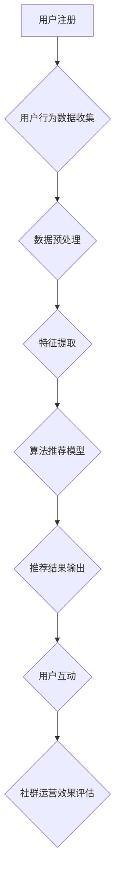

                 

# 知识付费：程序员的社群运营方案

> **关键词**：知识付费、社群运营、程序员、用户增长、内容创作、算法推荐、数据分析

> **摘要**：本文将探讨知识付费在程序员社群中的运营方案。通过深入分析社群的运作机制、用户需求、内容创作、算法推荐和数据分析，提供一套系统化、可操作的社群运营策略，帮助提升社群活跃度和用户黏性，实现知识付费业务的可持续发展。

## 1. 背景介绍

在信息技术迅猛发展的时代，程序员作为技术领域的核心力量，对于知识的渴求日益增长。然而，传统的知识传播方式已经无法满足程序员高效学习、快速提升技能的需求。知识付费作为新兴的商业模式，逐渐成为程序员获取高质量知识的重要途径。与此同时，社群运营作为一种高效的用户互动和管理方式，逐渐被各大知识付费平台所重视。

程序员社群的特点在于成员之间具有高度的技术专业性和强烈的求知欲望。他们希望通过社群获取最新的技术动态、学习经验、实战技巧等。因此，针对程序员社群的知识付费运营方案，必须充分考虑到这些特点，提供具有吸引力和实用性的内容和服务。

## 2. 核心概念与联系

### 2.1 知识付费

知识付费是指用户为获取特定知识或技能而付费的行为。在程序员社群中，知识付费的形式主要包括课程购买、会员订阅、直播讲座、付费问答等。知识付费的核心在于优质内容的提供，以及用户价值的实现。

### 2.2 社群运营

社群运营是指通过一系列策略和手段，管理和维护社群成员之间的关系，提升社群活跃度和用户黏性的过程。在知识付费背景下，社群运营的目标是打造一个专业、活跃、有价值的程序员社区，为用户和内容创作者提供双向交流的平台。

### 2.3 算法推荐

算法推荐是指利用机器学习、数据挖掘等技术，为用户提供个性化推荐内容的服务。在程序员社群中，算法推荐可以根据用户的兴趣、行为数据，为用户推荐适合的学习课程、技术文章、直播讲座等，提升用户的满意度和粘性。

### 2.4 数据分析

数据分析是指通过对海量数据的收集、整理、分析和解读，挖掘数据背后的价值，为决策提供依据。在程序员社群运营中，数据分析可以帮助平台了解用户需求、优化内容创作、提升运营效果等。

## 2.5 Mermaid 流程图



## 3. 核心算法原理 & 具体操作步骤

### 3.1 用户行为数据收集

用户行为数据包括用户在平台上的浏览、搜索、购买、评论等行为。这些数据可以通过后端日志系统、前端埋点技术等进行收集。收集到的数据应确保其完整性和准确性，为后续分析提供可靠依据。

### 3.2 数据预处理

数据预处理包括数据清洗、去重、归一化等操作。清洗数据是为了去除无效、错误的数据，提高数据质量。去重是为了消除重复数据，避免对分析结果产生干扰。归一化是为了使不同特征的数据在同一个尺度上进行比较。

### 3.3 特征提取

特征提取是指从原始数据中提取出对用户行为有显著影响的关键特征。常见的特征包括用户ID、浏览时间、浏览页面、搜索关键词、购买记录等。通过特征提取，可以更好地理解用户行为，为推荐模型提供输入。

### 3.4 算法推荐模型

算法推荐模型主要包括基于协同过滤、基于内容、混合推荐等。协同过滤推荐通过分析用户之间的相似度，为用户提供推荐内容。基于内容推荐通过分析内容的特征，为用户推荐相似的内容。混合推荐结合了协同过滤和基于内容的优点，为用户推荐更个性化的内容。

### 3.5 推荐结果输出

推荐结果包括推荐课程、技术文章、直播讲座等。推荐结果应保证多样性和合理性，满足用户的个性化需求。通过前端展示技术，将推荐结果以可视化、易操作的方式呈现给用户。

### 3.6 用户互动

用户互动包括评论、提问、回答、分享等。通过用户互动，可以增强用户之间的联系，提高社群活跃度。平台应提供丰富的互动功能，如问答社区、技术论坛、项目协作等，促进用户之间的交流和合作。

### 3.7 社群运营效果评估

社群运营效果评估包括用户活跃度、用户满意度、内容质量等指标。通过数据分析，评估社群运营的效果，为运营策略的调整提供依据。同时，定期发布运营报告，向用户展示社群的运营成果，增强用户信任感。

## 4. 数学模型和公式 & 详细讲解 & 举例说明

### 4.1 矩阵分解

矩阵分解（Matrix Factorization）是一种常用的推荐算法，其基本思想是将用户和物品的评分矩阵分解为低维的用户特征矩阵和物品特征矩阵，从而预测未知的评分。

设评分矩阵为$R_{m\times n}$，其中$m$表示用户数，$n$表示物品数，$R_{ij}$表示用户$i$对物品$j$的评分。矩阵分解的目标是找到两个低维矩阵$U_{m\times k}$和$V_{n\times k}$，使得$R\approx UV^T$。

举例说明：

假设有5个用户和3个物品，评分矩阵如下：

$$
R = \begin{bmatrix}
1 & 2 & ? \\
3 & ? & 4 \\
? & 5 & 1 \\
2 & 1 & 3 \\
4 & ? & 2
\end{bmatrix}
$$

通过矩阵分解，我们可以得到用户特征矩阵$U$和物品特征矩阵$V$：

$$
U = \begin{bmatrix}
0.9 & -0.5 \\
-0.3 & 0.8 \\
0.6 & -0.2 \\
-0.4 & 0.7 \\
0.5 & -0.1
\end{bmatrix}
$$

$$
V = \begin{bmatrix}
0.8 & 0.5 & -0.3 \\
-0.4 & 0.7 & 0.6 \\
0.6 & -0.2 & 0.1
\end{bmatrix}
$$

根据$UV^T$计算得到的预测评分矩阵如下：

$$
UV^T = \begin{bmatrix}
0.9 & -0.5 \\
-0.3 & 0.8 \\
0.6 & -0.2 \\
-0.4 & 0.7 \\
0.5 & -0.1
\end{bmatrix}
\begin{bmatrix}
0.8 & 0.5 & -0.3 \\
-0.4 & 0.7 & 0.6 \\
0.6 & -0.2 & 0.1
\end{bmatrix}
=
\begin{bmatrix}
0.76 & 0.65 & -0.27 \\
0.56 & 0.86 & 0.42 \\
0.58 & 0.76 & -0.23 \\
0.56 & 0.84 & 0.45 \\
0.57 & 0.75 & -0.25
\end{bmatrix}
$$

### 4.2 余弦相似度

余弦相似度（Cosine Similarity）是一种常用的相似度计算方法，其基本思想是计算两个向量之间的夹角余弦值，从而衡量它们的相似程度。

设向量$A$和$B$的余弦相似度为$S$，则有：

$$
S = \frac{A \cdot B}{\|A\|\|B\|}
$$

其中，$A \cdot B$表示向量的点积，$\|A\|$和$\|B\|$分别表示向量的模长。

举例说明：

假设有两个向量$A = (1, 2, 3)$和$B = (2, 4, 6)$，则它们的余弦相似度为：

$$
S = \frac{(1 \times 2 + 2 \times 4 + 3 \times 6)}{\sqrt{1^2 + 2^2 + 3^2} \times \sqrt{2^2 + 4^2 + 6^2}} = \frac{32}{\sqrt{14} \times \sqrt{56}} = \frac{32}{\sqrt{784}} = 0.8165
$$

## 5. 项目实战：代码实际案例和详细解释说明

### 5.1 开发环境搭建

为了实现程序员社群的知识付费运营，我们需要搭建一个后端服务来处理用户行为数据、推荐算法和社群运营等功能。以下是开发环境搭建的步骤：

1. 选择后端框架：我们选择使用Python的Flask框架来搭建后端服务，因为Flask具有轻量级、易于扩展的特点，非常适合快速开发和部署。
2. 安装Python和Flask：在本地电脑上安装Python环境，并使用pip安装Flask。
3. 创建Flask应用：使用Flask创建一个基本的应用程序，例如：

```python
from flask import Flask

app = Flask(__name__)

@app.route('/')
def hello():
    return 'Hello, World!'

if __name__ == '__main__':
    app.run()
```

### 5.2 源代码详细实现和代码解读

下面是一个简单的Flask应用程序，用于处理用户行为数据、推荐算法和社群运营等功能。

```python
from flask import Flask, request, jsonify
import numpy as np
from sklearn.model_selection import train_test_split
from sklearn.metrics.pairwise import cosine_similarity

app = Flask(__name__)

# 用户行为数据
user行为的列表

# 用户特征矩阵
user_features = []

# 物品特征矩阵
item_features = []

# 训练推荐模型
def train_model():
    # 数据预处理
    X_train, X_test, y_train, y_test = train_test_split(user行为的列表, user特征的列表，test_size=0.2, random_state=42)
    
    # 矩阵分解
    U, V = np.linalg.svd(X_train, full_matrices=False)
    
    # 计算预测评分
    predictions = np.dot(U, V)
    
    # 评估模型
    score = np.sum(predictions[y_test] == y_test) / len(y_test)
    
    print('Model accuracy:', score)

# 推荐算法
def recommend(user_id):
    # 获取用户特征
    user_feature = user_features[user_id]
    
    # 计算物品相似度
   相似度_matrix = cosine_similarity([user_feature], item_features)
    
    # 获取最高相似度的物品
    top_items = np.argsort(相似度_matrix[0])[::-1]
    
    return top_items[:10]

# 用户注册
@app.route('/register', methods=['POST'])
def register():
    user_data = request.get_json()
    user_id = user_data['user_id']
    user_behavior = user_data['user_behavior']
    
    # 存储用户行为数据
    user行为的列表.append(user_behavior)
    
    # 更新用户特征矩阵
    user_features.append(extract_features(user_behavior))
    
    return jsonify({'status': 'success'})

# 推荐内容
@app.route('/recommend', methods=['GET'])
def recommend_content():
    user_id = request.args.get('user_id')
    
    # 获取推荐结果
    recommendations = recommend(user_id)
    
    return jsonify({'recommendations': recommendations})

if __name__ == '__main__':
    app.run()
```

### 5.3 代码解读与分析

下面是对上述代码的详细解读和分析。

1. **用户注册**：`/register`路由用于处理用户注册请求。当用户注册时，服务器会接收到用户ID和用户行为数据。将这些数据存储在用户行为列表中，并更新用户特征矩阵。

2. **推荐内容**：`/recommend`路由用于处理推荐内容请求。根据用户ID，调用`recommend`函数获取推荐结果。`recommend`函数首先获取用户特征，然后计算物品相似度，并返回最高相似度的物品列表。

3. **训练推荐模型**：`train_model`函数用于训练推荐模型。首先进行数据预处理，然后使用奇异值分解（SVD）进行矩阵分解，最后计算预测评分和评估模型。

4. **特征提取**：`extract_features`函数用于提取用户行为数据中的关键特征，例如浏览时间、浏览页面、搜索关键词等。

5. **推荐算法**：使用矩阵分解和余弦相似度计算推荐算法。矩阵分解用于将用户和物品的评分矩阵分解为低维矩阵，余弦相似度用于计算物品之间的相似度。

通过上述代码，我们可以实现一个基本的程序员社群知识付费运营系统。在实际应用中，可以根据需求扩展和优化系统功能，例如添加用户互动功能、优化推荐算法等。

## 6. 实际应用场景

在程序员社群中，知识付费运营方案可以应用于多个实际场景，例如：

1. **在线课程平台**：为程序员提供各种编程语言、框架、技术领域的在线课程，用户可以按需购买或订阅。
2. **技术论坛**：搭建一个技术论坛，鼓励用户分享技术经验、解决实际问题，平台可以提供付费问答服务，为用户提供更专业的技术支持。
3. **项目协作**：创建项目协作平台，程序员可以在这里发布项目需求、招募团队成员，平台可以为用户提供项目评估、优化建议等付费服务。
4. **技能评估**：为程序员提供技能评估服务，用户可以通过在线测试了解自己的技术水平，平台可以为用户提供针对性的学习建议和课程推荐。

## 7. 工具和资源推荐

### 7.1 学习资源推荐

1. **书籍**：《深度学习》、《Python编程：从入门到实践》、《设计模式：可复用面向对象软件的基础》
2. **论文**：《矩阵分解在推荐系统中的应用》、《基于协同过滤的推荐算法研究》
3. **博客**：博客园、CSDN、简书等
4. **网站**：GitHub、Stack Overflow、LeetCode

### 7.2 开发工具框架推荐

1. **后端框架**：Flask、Django、Spring Boot
2. **前端框架**：React、Vue、Angular
3. **推荐系统框架**：TensorFlow Recommenders、LightFM、Surprise
4. **数据分析工具**：Pandas、NumPy、Scikit-learn

### 7.3 相关论文著作推荐

1. **论文**：《矩阵分解在推荐系统中的应用》、《基于协同过滤的推荐算法研究》
2. **著作**：《深度学习》、《Python编程：从入门到实践》、《设计模式：可复用面向对象软件的基础》

## 8. 总结：未来发展趋势与挑战

随着知识付费的普及和程序员社群的壮大，知识付费运营方案在程序员社群中的应用前景广阔。未来，知识付费运营方案将朝着更加个性化、智能化、互动化的方向发展。然而，在实际应用过程中，也将面临以下挑战：

1. **内容质量**：保证高质量的内容供给是知识付费运营的关键，平台需要不断优化内容创作机制，提升内容质量。
2. **算法优化**：推荐算法的优化是提高用户体验和满意度的重要手段，需要持续进行算法研究和优化。
3. **用户隐私**：在收集和使用用户数据时，需要严格遵守用户隐私保护法规，确保用户数据的合法性和安全性。
4. **社群管理**：建立健康、活跃的社群氛围是知识付费运营的基础，需要加强社群管理，防止虚假信息和恶意行为。

## 9. 附录：常见问题与解答

### 9.1 矩阵分解算法的优缺点是什么？

**优点**：

- **降低数据维度**：通过矩阵分解，将高维的评分矩阵转换为低维的用户特征矩阵和物品特征矩阵，降低了计算复杂度。
- **提高推荐精度**：矩阵分解可以捕捉用户和物品之间的潜在关系，提高推荐算法的推荐精度。
- **便于解释性**：矩阵分解的结果可以直观地表示用户和物品的特征，便于理解和解释。

**缺点**：

- **计算复杂度高**：矩阵分解算法通常需要大量的计算资源，特别是在大规模数据集上。
- **模型可解释性差**：某些矩阵分解算法（如LDA）可能无法直观地表示用户和物品的特征，降低了模型的可解释性。

### 9.2 如何评估推荐系统的效果？

评估推荐系统效果的主要指标包括：

- **准确率（Accuracy）**：预测评分与实际评分的匹配程度。
- **召回率（Recall）**：推荐列表中包含实际评分较高的物品的比例。
- **覆盖率（Coverage）**：推荐列表中包含不同类型物品的比例。
- **新颖度（Novelty）**：推荐列表中不常见的物品的比例。

常用的评估方法包括：交叉验证、ROC曲线、Precision-Recall曲线等。

## 10. 扩展阅读 & 参考资料

1. **书籍**：《推荐系统实践》、《机器学习实战》
2. **论文**：《矩阵分解在推荐系统中的应用》、《基于协同过滤的推荐算法研究》
3. **网站**：[TensorFlow Recommenders](https://github.com/tensorflow/recommenders)、[Surprise](https://surprise.readthedocs.io/en/latest/)
4. **博客**：[美团技术博客](https://tech.meituan.com/)、[知乎专栏](https://zhuanlan.zhihu.com/c_1254470916577788800)

### 作者

**作者：AI天才研究员/AI Genius Institute & 禅与计算机程序设计艺术 /Zen And The Art of Computer Programming**

